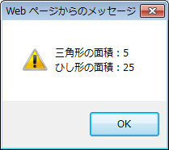
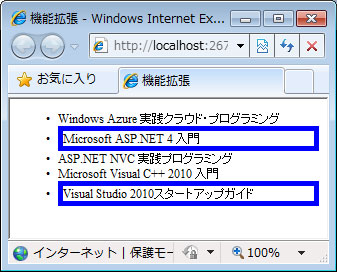

# $.extend、$.fn.extend メソッドを使用して jQuery オブジェクトの機能を拡張する
## License
- Apache License, Version 2.0
## Technologies
- Visual Studio 2010
- jQuery 1.4.4
## Topics
- 逆引きサンプル コード
- jQuery
## Updated
- 02/22/2011
## Description

執筆者: <a href="http://msdn.microsoft.com/ja-jp/gg585574#yamada" target="_blank">
有限会社 WINGS プロジェクト 山田 祥寛</a>

動作確認環境: Visual Studio 2010、jQuery 1.4.4

$.extend メソッドを利用することで、jQuery に対して静的メソッドを追加できます。たとえば、以下は三角形の面積を求める triangle メソッドと、ひし形の面積を求める diamond メソッドを追加する例です。

JavaScript

スクリプトの編集

js

<pre id="codePreview" class="js">&lt;script&nbsp;src=&quot;../Scripts/jquery-1.4.4.min.js&quot;&nbsp;type=&quot;text/javascript&quot;&gt;&lt;/script&gt;&nbsp;
&lt;script&nbsp;type=&quot;text/javascript&quot;&gt;&nbsp;
&nbsp;&nbsp;//&nbsp;静的メソッド&nbsp;triangle、diamond&nbsp;を追加&nbsp;
$.extend({&nbsp;
&nbsp;&nbsp;triangle&nbsp;:&nbsp;function(base,&nbsp;height)&nbsp;{&nbsp;return&nbsp;base&nbsp;*&nbsp;height&nbsp;/&nbsp;2;&nbsp;},&nbsp;
&nbsp;&nbsp;diamond&nbsp;:&nbsp;function(height,&nbsp;width)&nbsp;{&nbsp;return&nbsp;height&nbsp;*&nbsp;width&nbsp;/&nbsp;2&nbsp;}&nbsp;
})&nbsp;
&nbsp;
&nbsp;&nbsp;//&nbsp;triangle、diamond&nbsp;メソッドを呼び出し＆結果をダイアログ表示&nbsp;
window.alert(&nbsp;
&nbsp;&nbsp;'三角形の面積：'&nbsp;&#43;&nbsp;$.triangle(5,&nbsp;2)&nbsp;&#43;&nbsp;'\n'&nbsp;&#43;&nbsp;
&nbsp;&nbsp;'ひし形の面積：'&nbsp;&#43;&nbsp;$.diamond(10,&nbsp;5)&nbsp;
);&nbsp;
&lt;/script&gt;&nbsp;
&nbsp;
</pre>

$.extend メソッドには、「メソッド名: 匿名関数」のハッシュとして追加したいメソッドをいくつでも指定できます。$.extend メソッドで定義された静的メソッドには、「$.メソッド名(...)」、または「jQuery.メソッド名(...)」でアクセスできます。

もうひとつ、よく&#20284;たメソッドとして、$.fn.extend メソッドがあります。こちらは jQuery に対してインスタンス メソッドを追加するためのメソッドです。たとえば以下は、現在の要素セットに対して一律、指定された色で枠線を付与する border メソッドを追加しています。

HTML

スクリプトの編集

html

<pre id="codePreview" class="html">&lt;ul&gt;&nbsp;
&nbsp;&nbsp;&lt;li&gt;Windows&nbsp;Azure&nbsp;実践クラウド・プログラミング&lt;/li&gt;&nbsp;
&nbsp;&nbsp;&lt;li&nbsp;class=&quot;new&quot;&gt;Microsoft&nbsp;ASP.NET&nbsp;4&nbsp;入門&nbsp;&lt;/li&gt;&nbsp;
&nbsp;&nbsp;&lt;li&gt;ASP.NET&nbsp;NVC&nbsp;実践プログラミング&lt;/li&gt;&nbsp;
&nbsp;&nbsp;&lt;li&gt;Microsoft&nbsp;Visual&nbsp;C&#43;&#43;&nbsp;2010&nbsp;入門&nbsp;&lt;/li&gt;&nbsp;
&nbsp;&nbsp;&lt;li&nbsp;class=&quot;new&quot;&gt;Visual&nbsp;Studio&nbsp;2010スタートアップガイド&lt;/li&gt;&nbsp;
&lt;/ul&gt;&nbsp;
&nbsp;
&lt;script&nbsp;src=&quot;../Scripts/jquery-1.4.4.min.js&quot;&nbsp;type=&quot;text/javascript&quot;&gt;&lt;/script&gt;&nbsp;
&lt;script&nbsp;type=&quot;text/javascript&quot;&gt;&nbsp;
&nbsp;//&nbsp;インスタンス&nbsp;メソッド&nbsp;border&nbsp;を追加&nbsp;
$.fn.extend({&nbsp;
&nbsp;&nbsp;border:&nbsp;function(color)&nbsp;{&nbsp;
&nbsp;&nbsp;&nbsp;&nbsp;&nbsp;//&nbsp;現在の要素セットに対して、スタイルを適用&nbsp;
&nbsp;&nbsp;&nbsp;&nbsp;return&nbsp;$(this).css('border',&nbsp;'solid&nbsp;5px&nbsp;'&nbsp;&#43;&nbsp;color);&nbsp;
&nbsp;&nbsp;}&nbsp;
})&nbsp;
&nbsp;//&nbsp;&lt;li&nbsp;class=&quot;new&quot;&gt;&nbsp;要素に青の枠線を付与&nbsp;
$('li.new').border('Blue');&nbsp;
&lt;/script&gt;&nbsp;
&nbsp;
</pre>

「メソッド名: 匿名関数」のハッシュとして記述する点は、$.extend メソッドと共通です。ただし、インスタンス メソッドを定義する場合、(メソッド チェーンを切らないように) 戻り値はできるだけ jQuery オブジェクトとするのが望ましいでしょう。

$.extend メソッドで定義された静的メソッドには、「$(セレクター式).メソッド名(...)」でアクセスできます。

<table>
<tbody>
<tr>
<td></td>
<td></td>
<td>
<ul>
<li>もっと他のコンテンツを見る &gt;&gt; <a href="http://msdn.microsoft.com/ja-jp/ff363212" target="_blank">
逆引きサンプル コード一覧へ</a> </li><li>もっと他のレシピを見る &gt;&gt; <a href="http://msdn.microsoft.com/ja-jp/samplecode.recipe">
Code Recipe へ</a> </li><li>もっと ASP.NET の情報を見る &gt;&gt; <a href="http://msdn.microsoft.com/ja-jp/asp.net" target="_blank">
ASP.NET デベロッパーセンターへ</a> </li></ul>
</td>
</tr>
</tbody>
</table>

<a href="#top">ページのトップへ</a>

