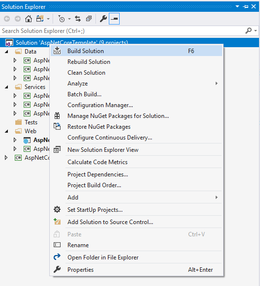

# .NET Core extented architecture and  separation of concerns (Divide and conquer)
## Requires
- Visual Studio 2017
## License
- MIT
## Technologies
- C#
- SQL Server
- Entity Framework
- ASP.NET Core 2.0
## Topics
- Entity Framework Code First
- Generic Repository
- Web Architecture
## Updated
- 02/16/2018
## Description

<h1>Introduction</h1>

<em>Most of the projects start as&nbsp;<em>small projects</em>&nbsp;and with time they turn into&nbsp;<em>medium&nbsp;or even&nbsp;large</em>&nbsp;projects. By the
 time that we realize this is happening, it might be too&nbsp;late&nbsp;and can&nbsp;cost us&nbsp;a lot to change the project architecture.&nbsp;</em>

<strong><em>So why don't we do the whole process smarter and think about this from the beginning?</em></strong>

<em><strong>The separation of concerns</strong>&nbsp;is often neglected topic when dealing with web applications. Everyone who has created even once a basic web app knows that by default .NET has a&nbsp;<em>decent template</em>.</em>

<em>That's okay for&nbsp;<strong>starter</strong>&nbsp;and for people that are new to these concepts, but if you want to create easily&nbsp;maintainable&nbsp;and&nbsp;extendable&nbsp;application
 you should absolutely put some effort to extend the basic MVC template.</em>

<em>So let's see what this template gives us!</em>

<em>*More templates like this one can be downloaded from <a href="https://asptemplatestack.com" target="_blank">
https://asptemplatestack.com</a></em>

<h1>Building the Sample</h1>

<em>Building this template requires installed Visual Studio 2015 or latter with inscluded .NET Core. Once you have it just build the solution, which will trigger package restore and after a few seconds your solution would be build!</em>

<em></em>

<em>This will trigger bower restore and NuGet package restore.</em>

<em>*If bower restore fails, just save the bower.json and .bowerrc files&nbsp; like this: 
</em>

<ul>
<li>Open the file in&nbsp;<em>Visual Studio</em> </li><li>Click on &quot;Save file as&quot; under File menu </li><li>Click on the down arrow sign on the right side of Save button </li><li>Select &quot;Save with Encoding&quot; </li><li>Agree to replace the file </li><li>Change the Encoding type to &quot;Western European (Windows) - Codepage 1252&quot; and leave the Line endings to &quot;Current Settings&quot;
</li><li>Hit Save button </li></ul>

<em> 
</em>

Description

<h3>What does this architecture&nbsp;<strong>give you</strong>&nbsp;more than the usual boilerplate templates?</h3>

&lt;samp&gt;(Those advantages are applicable for medium to large projects)&lt;/samp&gt;

<ul>
<li><strong>Easier development&nbsp;</strong>- one look at the project structure tells you where all different components are situated
</li><li><strong>Lower barrier for understanding, when new people are working on the project</strong>&nbsp;- when introducing new people to some project that is already in progress it's always better to do that step by step. And when these components are well structured
 and neat it is easier to go through them </li><li><strong>Improved maintenance&nbsp;</strong>- whether you have created the project from scratch or not, when a problem occurs it's a lot easier to define where this problem comes from
</li><li><strong>Easier extension of the project</strong>&nbsp;- having all the components separated makes it a lot easier to extend them
</li></ul>
<h3>Detailed explanation of the architecture</h3>

Data

<blockquote>
<ul>
<li><strong>Project for the database tables</strong>&nbsp;- contains the Db Context and the configurations of the migrations
</li><li><strong>Project for abstraction levels over the database</strong>&nbsp;- contains implemention of different abstraction levels over the database like&nbsp;Unit of work&nbsp;and&nbsp;Repository pattern
</li><li><strong>Project for the database models</strong>&nbsp;- contains all the db models including these from the ASP.NET identity which are moved from the web project
</li></ul>
</blockquote>

Services

<blockquote>
<ul>
<li><strong>Project for the services related to the database access</strong>&nbsp;- these services&nbsp;<strong>are not</strong>&nbsp;Web Api services, or any other ASP.NET services. They are just called like that. They might be called 'Providers',or whatever
 descriptive name you like. They are just regular classes plus interfaces that are responsible for the containment of the&nbsp;business logic&nbsp;of the application as well as the tasks related to&nbsp;CRUD
 operations&nbsp;over the database. </li><li><strong>Project for the services related to the web operations</strong>&nbsp;- the same thing is valid here, but here are the services related to more complex logic that is not related to the database like&nbsp;Caching&nbsp;services,&nbsp;Email&nbsp;services
 and etc. </li></ul>
</blockquote>

Tests

<blockquote>
<ul>
<li><strong>Project for the services tests</strong>&nbsp;- just to keep the different types of tests separately
</li><li><strong>Project for the controllers tests</strong> </li><li><strong>Project for the routes tests</strong> </li></ul>
</blockquote>
<blockquote>
<ul>
</ul>
</blockquote>

Web

<blockquote>
<ul>
<li><strong>Project for the web application&nbsp;</strong>- this is the classic MVC project which is stripped of the Db context dependency as well as the db models dependencies . Contains configurations for the&nbsp;Dependency Injection,&nbsp;Automapper&nbsp;and
 other external libraries. The architecture is supposed to keep all your contoller actions very tiny and do all of your business logic in the services, which are injected by your IoC (inversion of control) container. In our case this is&nbsp;Autofac
</li><li><strong>Project for the web application infrastructure&nbsp;</strong>-this project contains source code which is related to the Web application, but might be reusable, and this is why it is separated by the Web App. For example here we can put our View
 Models, custom filters and annotations, html extention methods and helpers, and etc.
</li></ul>
</blockquote>
<blockquote>Lastly there is a separate project intendted to combine all the common classes between all the projects like Global Constants, Global Helper and etc.</blockquote>

&nbsp;

<h1>Additional Features</h1>
<ul>
<li><strong>Extended database models</strong> - this is needed because we always have similar fields in our database tables. This can be avoid using the priciples of the Object Oriented Programming like inheritance.
</li></ul>

&nbsp;

C#

Edit|Remove

<pre class="csharp">public&nbsp;interface&nbsp;IDeletableEntity&nbsp;
{&nbsp;
&nbsp;&nbsp;&nbsp;&nbsp;&nbsp;&nbsp;bool&nbsp;IsDeleted&nbsp;{&nbsp;get;&nbsp;set;&nbsp;}&nbsp;
&nbsp;
&nbsp;&nbsp;&nbsp;&nbsp;&nbsp;&nbsp;DateTime?&nbsp;DeletedOn&nbsp;{&nbsp;get;&nbsp;set;&nbsp;}&nbsp;
}</pre>

&nbsp;

C#

Edit|Remove

<pre class="csharp">public&nbsp;interface&nbsp;IAuditInfo&nbsp;
{&nbsp;
&nbsp;&nbsp;&nbsp;&nbsp;DateTime&nbsp;CreatedOn&nbsp;{&nbsp;get;&nbsp;set;&nbsp;}&nbsp;
&nbsp;
&nbsp;&nbsp;&nbsp;&nbsp;&nbsp;DateTime?&nbsp;ModifiedOn&nbsp;{&nbsp;get;&nbsp;set;&nbsp;}&nbsp;
}</pre>

&nbsp;

C#

Edit|Remove

<pre class="csharp">&nbsp;public&nbsp;abstract&nbsp;class&nbsp;BaseModel&lt;TKey&gt;&nbsp;:&nbsp;IAuditInfo&nbsp;
&nbsp;{&nbsp;
&nbsp;&nbsp;&nbsp;&nbsp;&nbsp;[Key]&nbsp;
&nbsp;&nbsp;&nbsp;&nbsp;&nbsp;public&nbsp;TKey&nbsp;Id&nbsp;{&nbsp;get;&nbsp;set;&nbsp;}&nbsp;
&nbsp;
&nbsp;&nbsp;&nbsp;&nbsp;&nbsp;public&nbsp;DateTime&nbsp;CreatedOn&nbsp;{&nbsp;get;&nbsp;set;&nbsp;}&nbsp;
&nbsp;
&nbsp;&nbsp;&nbsp;&nbsp;&nbsp;public&nbsp;DateTime?&nbsp;ModifiedOn&nbsp;{&nbsp;get;&nbsp;set;&nbsp;}&nbsp;
}</pre>

&nbsp;

C#

Edit|Remove

<pre class="csharp">&nbsp;public&nbsp;abstract&nbsp;class&nbsp;BaseDeletableModel&lt;TKey&gt;&nbsp;:&nbsp;BaseModel&lt;TKey&gt;,&nbsp;IDeletableEntity&nbsp;
&nbsp;&nbsp;&nbsp;&nbsp;{&nbsp;
&nbsp;&nbsp;&nbsp;&nbsp;&nbsp;&nbsp;&nbsp;&nbsp;public&nbsp;bool&nbsp;IsDeleted&nbsp;{&nbsp;get;&nbsp;set;&nbsp;}&nbsp;
&nbsp;
&nbsp;&nbsp;&nbsp;&nbsp;&nbsp;&nbsp;&nbsp;&nbsp;public&nbsp;DateTime?&nbsp;DeletedOn&nbsp;{&nbsp;get;&nbsp;set;&nbsp;}&nbsp;
&nbsp;&nbsp;&nbsp;&nbsp;}</pre>

&nbsp;Now we can use these <strong>base classes </strong>
and prevent adding their properties in each of our classes separately like this: 
 

C#

Edit|Remove

<pre class="csharp">&nbsp;&nbsp;&nbsp;&nbsp;public&nbsp;class&nbsp;Setting&nbsp;:&nbsp;BaseDeletableModel&lt;int&gt;&nbsp;
&nbsp;&nbsp;&nbsp;&nbsp;{&nbsp;
&nbsp;&nbsp;&nbsp;&nbsp;&nbsp;&nbsp;&nbsp;&nbsp;public&nbsp;string&nbsp;Name&nbsp;{&nbsp;get;&nbsp;set;&nbsp;}&nbsp;
&nbsp;
&nbsp;&nbsp;&nbsp;&nbsp;&nbsp;&nbsp;&nbsp;&nbsp;public&nbsp;string&nbsp;Value&nbsp;{&nbsp;get;&nbsp;set;&nbsp;}&nbsp;
&nbsp;&nbsp;&nbsp;&nbsp;}</pre>

&nbsp;

<ul>
<li><strong>Generic Repositiry Pattern</strong> - Creating some kind of abstraction over the database is almost mandatory when talking about a real project.&nbsp;
</li></ul>

&nbsp;

C#

Edit|Remove

<pre class="csharp">&nbsp;&nbsp;&nbsp;&nbsp;public&nbsp;interface&nbsp;IRepository&lt;TEntity&gt;&nbsp;:&nbsp;IDisposable&nbsp;
&nbsp;&nbsp;&nbsp;&nbsp;&nbsp;&nbsp;&nbsp;&nbsp;where&nbsp;TEntity&nbsp;:&nbsp;class&nbsp;
&nbsp;&nbsp;&nbsp;&nbsp;{&nbsp;
&nbsp;&nbsp;&nbsp;&nbsp;&nbsp;&nbsp;&nbsp;&nbsp;IQueryable&lt;TEntity&gt;&nbsp;All();&nbsp;
&nbsp;
&nbsp;&nbsp;&nbsp;&nbsp;&nbsp;&nbsp;&nbsp;&nbsp;IQueryable&lt;TEntity&gt;&nbsp;AllAsNoTracking();&nbsp;
&nbsp;
&nbsp;&nbsp;&nbsp;&nbsp;&nbsp;&nbsp;&nbsp;&nbsp;Task&lt;TEntity&gt;&nbsp;GetByIdAsync(params&nbsp;object[]&nbsp;id);&nbsp;
&nbsp;
&nbsp;&nbsp;&nbsp;&nbsp;&nbsp;&nbsp;&nbsp;&nbsp;void&nbsp;Add(TEntity&nbsp;entity);&nbsp;
&nbsp;
&nbsp;&nbsp;&nbsp;&nbsp;&nbsp;&nbsp;&nbsp;&nbsp;void&nbsp;Update(TEntity&nbsp;entity);&nbsp;
&nbsp;
&nbsp;&nbsp;&nbsp;&nbsp;&nbsp;&nbsp;&nbsp;&nbsp;void&nbsp;Delete(TEntity&nbsp;entity);&nbsp;
&nbsp;
&nbsp;&nbsp;&nbsp;&nbsp;&nbsp;&nbsp;&nbsp;&nbsp;Task&lt;int&gt;&nbsp;SaveChangesAsync();&nbsp;
&nbsp;&nbsp;&nbsp;&nbsp;}</pre>

&nbsp;Our repository shoud contain all operations needed for work with our database like:

<ul>
<li>Create </li><li>Read </li><li>Updated </li><li>Delete </li></ul>

or so called crud operations. In the provided solution we have two implementaions of the interface&nbsp;<strong>EfRepository.cs</strong> and&nbsp;<strong>EfDeletableEntityRepository.cs</strong>

&nbsp;

<h1>Source Code Files</h1>
<ul>
<li><em><strong>EfRepository.cs&nbsp;</strong>- We use this repository for entities that are not implementing the BaseDeletableModel class.</em>
</li><li><strong>EfDeletableEntityRepository.cs - </strong>we use this repository implementaion for entities that implement&nbsp;<em>BaseDeletableModel class and it handles the deleted items automatically.</em>
</li><li><strong>AutoMapperConfig </strong>- additional configurations for the automapper which allows us to set the mappings like this: 

C#

Edit|Remove

csharp

<pre class="csharp">&nbsp;&nbsp;&nbsp;&nbsp;public&nbsp;class&nbsp;SettingViewModel&nbsp;:&nbsp;IMapFrom&lt;Setting&gt;&nbsp;
&nbsp;&nbsp;&nbsp;&nbsp;{&nbsp;
&nbsp;&nbsp;&nbsp;&nbsp;&nbsp;&nbsp;&nbsp;&nbsp;public&nbsp;int&nbsp;Id&nbsp;{&nbsp;get;&nbsp;set;&nbsp;}&nbsp;
&nbsp;
&nbsp;&nbsp;&nbsp;&nbsp;&nbsp;&nbsp;&nbsp;&nbsp;public&nbsp;string&nbsp;Name&nbsp;{&nbsp;get;&nbsp;set;&nbsp;}&nbsp;
&nbsp;
&nbsp;&nbsp;&nbsp;&nbsp;&nbsp;&nbsp;&nbsp;&nbsp;public&nbsp;string&nbsp;Value&nbsp;{&nbsp;get;&nbsp;set;&nbsp;}&nbsp;
&nbsp;&nbsp;&nbsp;&nbsp;}</pre>

</li></ul>
<h1>More Information</h1>

<em>For more advanced templates using this architecture visit&nbsp;<em><a href="https://asptemplatestack.com">https://asptemplatestack.com</a></em></em>

