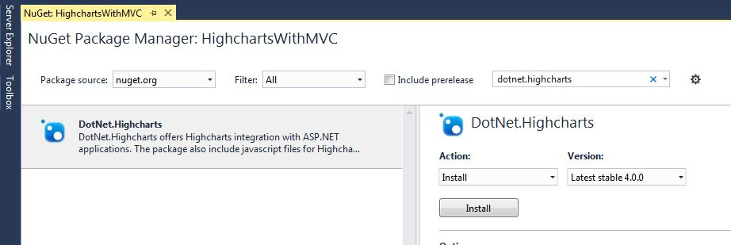
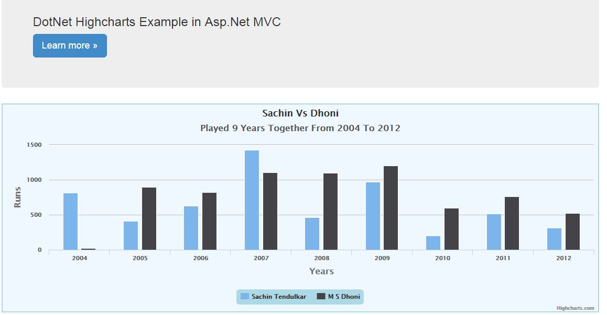

# .NET Highcharts With ASP.NET MVC
## Requires
- Visual Studio 2015
## License
- MIT
## Technologies
- ASP.NET MVC 4
- HighCharts
## Topics
- Charts
- Client Side Rendering
## Updated
- 10/23/2017
## Description

<h1>Introduction</h1>

<em>Highcharts is a JavaScript library to implement charting functionality like a line chart, bar chart, column chart etc. We can create different types of charts using Highcharts. Today, with this article, I will try to show you how to create Highcharts
 in ASP.NET MVC from the server side. Here, server-side means that everything will be created on the server and only the displaying part will happen at the client side.</em>

<h1>Building the Sample</h1>

Just follow the below steps to complete this demonstration.

<strong>STEP 1 Create a project in ASP.NET MVC</strong>

Open Visual Studio 2015 and click on &quot;New Project&quot;. From the &quot;New Project&quot; window, choose web from the Installed Templates and select ASP.NET Web Application. Next, provide a suitable name like &ldquo;HighchartsWithMVC&rdquo;, choose location, and click
 OK.

Next, the Windows will ask to select project template, so we just need to select MVC and change authentication as &ldquo;No Authentication&rdquo; and click the OK button. It will take a few seconds to create the application.

Now, our ASP.NET MVC application is ready.

<strong>STEP 2 Install .NET Highcharts</strong>

To install DotNet.Highcharts in your application, just right click your project from Solution Explorer and choose &quot;Manage NuGet Packages&quot;. It will open the NuGet Package Manager from where we can search the required packages. Search for &ldquo;Dotnet.Highcharts&rdquo;
 from the search textbox as following and install it with the latest version.

&nbsp;

&nbsp;

<strong>STEP 3 Create Highcharts</strong>

Now, it is time to create a chart using Highcharts. Therefore, for this demonstration, I will create a column chart that shows the comparison of runs made in respective years by Sachin and Dhoni. This example is only for explaining.

First, I'm going to create a chart to initialize with basic configuration, such as the type of chart, background color, border etc., and provide a suitable name for it.

C#

Edit|Remove

csharp

<pre class="js">using&nbsp;DotNet.Highcharts;&nbsp;&nbsp;&nbsp;
using&nbsp;DotNet.Highcharts.Enums;&nbsp;&nbsp;&nbsp;
using&nbsp;DotNet.Highcharts.Helpers;&nbsp;&nbsp;&nbsp;
using&nbsp;DotNet.Highcharts.Options;&nbsp;&nbsp;&nbsp;
using&nbsp;System;&nbsp;&nbsp;&nbsp;
using&nbsp;<a class="libraryLink" href="https://msdn.microsoft.com/en-US/library/System.Collections.Generic.aspx" target="_blank" title="Auto generated link to System.Collections.Generic">System.Collections.Generic</a>;&nbsp;&nbsp;&nbsp;
using&nbsp;<a class="libraryLink" href="https://msdn.microsoft.com/en-US/library/System.Drawing.aspx" target="_blank" title="Auto generated link to System.Drawing">System.Drawing</a>;&nbsp;&nbsp;&nbsp;
using&nbsp;<a class="libraryLink" href="https://msdn.microsoft.com/en-US/library/System.Linq.aspx" target="_blank" title="Auto generated link to System.Linq">System.Linq</a>;&nbsp;&nbsp;&nbsp;
using&nbsp;<a class="libraryLink" href="https://msdn.microsoft.com/en-US/library/System.Web.aspx" target="_blank" title="Auto generated link to System.Web">System.Web</a>;&nbsp;&nbsp;&nbsp;
using&nbsp;<a class="libraryLink" href="https://msdn.microsoft.com/en-US/library/System.Web.Mvc.aspx" target="_blank" title="Auto generated link to System.Web.Mvc">System.Web.Mvc</a>;&nbsp;&nbsp;&nbsp;
&nbsp;&nbsp;&nbsp;
namespace&nbsp;HighchartsWithMVC.Controllers&nbsp;&nbsp;&nbsp;
{&nbsp;&nbsp;&nbsp;
&nbsp;&nbsp;&nbsp;&nbsp;public&nbsp;class&nbsp;HomeController&nbsp;:&nbsp;Controller&nbsp;&nbsp;&nbsp;
&nbsp;&nbsp;&nbsp;&nbsp;{&nbsp;&nbsp;&nbsp;
&nbsp;&nbsp;&nbsp;&nbsp;&nbsp;&nbsp;&nbsp;&nbsp;public&nbsp;ActionResult&nbsp;Index()&nbsp;&nbsp;&nbsp;
&nbsp;&nbsp;&nbsp;&nbsp;&nbsp;&nbsp;&nbsp;&nbsp;{&nbsp;&nbsp;&nbsp;
&nbsp;&nbsp;&nbsp;&nbsp;&nbsp;&nbsp;&nbsp;&nbsp;&nbsp;&nbsp;&nbsp;&nbsp;Highcharts&nbsp;columnChart&nbsp;=&nbsp;new&nbsp;Highcharts(&quot;columnchart&quot;);&nbsp;&nbsp;&nbsp;
&nbsp;&nbsp;&nbsp;
&nbsp;&nbsp;&nbsp;&nbsp;&nbsp;&nbsp;&nbsp;&nbsp;&nbsp;&nbsp;&nbsp;&nbsp;columnChart.InitChart(new&nbsp;Chart()&nbsp;&nbsp;&nbsp;
&nbsp;&nbsp;&nbsp;&nbsp;&nbsp;&nbsp;&nbsp;&nbsp;&nbsp;&nbsp;&nbsp;&nbsp;{&nbsp;&nbsp;&nbsp;
&nbsp;&nbsp;&nbsp;&nbsp;&nbsp;&nbsp;&nbsp;&nbsp;&nbsp;&nbsp;&nbsp;&nbsp;&nbsp;&nbsp;&nbsp;&nbsp;Type&nbsp;=&nbsp;DotNet.Highcharts.Enums.ChartTypes.Column,&nbsp;&nbsp;&nbsp;
&nbsp;&nbsp;&nbsp;&nbsp;&nbsp;&nbsp;&nbsp;&nbsp;&nbsp;&nbsp;&nbsp;&nbsp;&nbsp;&nbsp;&nbsp;&nbsp;BackgroundColor&nbsp;=&nbsp;new&nbsp;BackColorOrGradient(<a class="libraryLink" href="https://msdn.microsoft.com/en-US/library/System.Drawing.Color.AliceBlue.aspx" target="_blank" title="Auto generated link to System.Drawing.Color.AliceBlue">System.Drawing.Color.AliceBlue</a>),&nbsp;&nbsp;&nbsp;
&nbsp;&nbsp;&nbsp;&nbsp;&nbsp;&nbsp;&nbsp;&nbsp;&nbsp;&nbsp;&nbsp;&nbsp;&nbsp;&nbsp;&nbsp;&nbsp;Style&nbsp;=&nbsp;&quot;fontWeight:&nbsp;'bold',&nbsp;fontSize:&nbsp;'17px'&quot;,&nbsp;&nbsp;&nbsp;
&nbsp;&nbsp;&nbsp;&nbsp;&nbsp;&nbsp;&nbsp;&nbsp;&nbsp;&nbsp;&nbsp;&nbsp;&nbsp;&nbsp;&nbsp;&nbsp;BorderColor&nbsp;=&nbsp;<a class="libraryLink" href="https://msdn.microsoft.com/en-US/library/System.Drawing.Color.LightBlue.aspx" target="_blank" title="Auto generated link to System.Drawing.Color.LightBlue">System.Drawing.Color.LightBlue</a>,&nbsp;&nbsp;&nbsp;
&nbsp;&nbsp;&nbsp;&nbsp;&nbsp;&nbsp;&nbsp;&nbsp;&nbsp;&nbsp;&nbsp;&nbsp;&nbsp;&nbsp;&nbsp;&nbsp;BorderRadius&nbsp;=&nbsp;0,&nbsp;&nbsp;&nbsp;
&nbsp;&nbsp;&nbsp;&nbsp;&nbsp;&nbsp;&nbsp;&nbsp;&nbsp;&nbsp;&nbsp;&nbsp;&nbsp;&nbsp;&nbsp;&nbsp;BorderWidth&nbsp;=&nbsp;2});&nbsp;&nbsp;&nbsp;
&nbsp;&nbsp;&nbsp;
&nbsp;&nbsp;&nbsp;&nbsp;&nbsp;&nbsp;&nbsp;&nbsp;&nbsp;&nbsp;&nbsp;&nbsp;columnChart.SetTitle(new&nbsp;Title()&nbsp;&nbsp;&nbsp;
&nbsp;&nbsp;&nbsp;&nbsp;&nbsp;&nbsp;&nbsp;&nbsp;&nbsp;&nbsp;&nbsp;&nbsp;{&nbsp;&nbsp;&nbsp;
&nbsp;&nbsp;&nbsp;&nbsp;&nbsp;&nbsp;&nbsp;&nbsp;&nbsp;&nbsp;&nbsp;&nbsp;&nbsp;&nbsp;&nbsp;&nbsp;Text&nbsp;=&nbsp;&quot;Sachin&nbsp;Vs&nbsp;Dhoni&quot;});&nbsp;&nbsp;&nbsp;
&nbsp;&nbsp;&nbsp;
&nbsp;&nbsp;&nbsp;&nbsp;&nbsp;&nbsp;&nbsp;&nbsp;&nbsp;&nbsp;&nbsp;&nbsp;columnChart.SetSubtitle(new&nbsp;Subtitle()&nbsp;&nbsp;&nbsp;
&nbsp;&nbsp;&nbsp;&nbsp;&nbsp;&nbsp;&nbsp;&nbsp;&nbsp;&nbsp;&nbsp;&nbsp;{&nbsp;&nbsp;&nbsp;
&nbsp;&nbsp;&nbsp;&nbsp;&nbsp;&nbsp;&nbsp;&nbsp;&nbsp;&nbsp;&nbsp;&nbsp;&nbsp;&nbsp;&nbsp;&nbsp;Text&nbsp;=&nbsp;&quot;Played&nbsp;9&nbsp;Years&nbsp;Together&nbsp;From&nbsp;2004&nbsp;To&nbsp;2012&quot;});&nbsp;&nbsp;&nbsp;
&nbsp;&nbsp;&nbsp;
&nbsp;&nbsp;&nbsp;&nbsp;&nbsp;&nbsp;&nbsp;&nbsp;&nbsp;&nbsp;&nbsp;&nbsp;columnChart.SetXAxis(new&nbsp;XAxis()&nbsp;&nbsp;&nbsp;
&nbsp;&nbsp;&nbsp;&nbsp;&nbsp;&nbsp;&nbsp;&nbsp;&nbsp;&nbsp;&nbsp;&nbsp;{&nbsp;&nbsp;&nbsp;
&nbsp;&nbsp;&nbsp;&nbsp;&nbsp;&nbsp;&nbsp;&nbsp;&nbsp;&nbsp;&nbsp;&nbsp;&nbsp;&nbsp;&nbsp;&nbsp;Type&nbsp;=&nbsp;AxisTypes.Category,&nbsp;&nbsp;&nbsp;
&nbsp;&nbsp;&nbsp;&nbsp;&nbsp;&nbsp;&nbsp;&nbsp;&nbsp;&nbsp;&nbsp;&nbsp;&nbsp;&nbsp;&nbsp;&nbsp;Title&nbsp;=&nbsp;new&nbsp;XAxisTitle()&nbsp;{&nbsp;Text&nbsp;=&nbsp;&quot;Years&quot;,&nbsp;Style&nbsp;=&nbsp;&quot;fontWeight:&nbsp;'bold',&nbsp;fontSize:&nbsp;'17px'&quot;},&nbsp;&nbsp;&nbsp;
&nbsp;&nbsp;&nbsp;&nbsp;&nbsp;&nbsp;&nbsp;&nbsp;&nbsp;&nbsp;&nbsp;&nbsp;&nbsp;&nbsp;&nbsp;&nbsp;Categories&nbsp;=&nbsp;new[]&nbsp;{&quot;2004&quot;,&nbsp;&quot;2005&quot;,&nbsp;&quot;2006&quot;,&nbsp;&quot;2007&quot;,&nbsp;&quot;2008&quot;,&nbsp;&quot;2009&quot;,&nbsp;&quot;2010&quot;,&nbsp;&quot;2011&quot;,&nbsp;&quot;2012&quot;}});&nbsp;&nbsp;&nbsp;
&nbsp;&nbsp;&nbsp;
&nbsp;&nbsp;&nbsp;&nbsp;&nbsp;&nbsp;&nbsp;&nbsp;&nbsp;&nbsp;&nbsp;&nbsp;columnChart.SetYAxis(new&nbsp;YAxis()&nbsp;&nbsp;&nbsp;
&nbsp;&nbsp;&nbsp;&nbsp;&nbsp;&nbsp;&nbsp;&nbsp;&nbsp;&nbsp;&nbsp;&nbsp;{&nbsp;&nbsp;&nbsp;
&nbsp;&nbsp;&nbsp;&nbsp;&nbsp;&nbsp;&nbsp;&nbsp;&nbsp;&nbsp;&nbsp;&nbsp;&nbsp;&nbsp;&nbsp;&nbsp;Title&nbsp;=&nbsp;new&nbsp;YAxisTitle()&nbsp;&nbsp;&nbsp;
&nbsp;&nbsp;&nbsp;&nbsp;&nbsp;&nbsp;&nbsp;&nbsp;&nbsp;&nbsp;&nbsp;&nbsp;&nbsp;&nbsp;&nbsp;&nbsp;{&nbsp;&nbsp;&nbsp;
&nbsp;&nbsp;&nbsp;&nbsp;&nbsp;&nbsp;&nbsp;&nbsp;&nbsp;&nbsp;&nbsp;&nbsp;&nbsp;&nbsp;&nbsp;&nbsp;&nbsp;&nbsp;&nbsp;&nbsp;Text&nbsp;=&nbsp;&quot;Runs&quot;,&nbsp;&nbsp;&nbsp;
&nbsp;&nbsp;&nbsp;&nbsp;&nbsp;&nbsp;&nbsp;&nbsp;&nbsp;&nbsp;&nbsp;&nbsp;&nbsp;&nbsp;&nbsp;&nbsp;&nbsp;&nbsp;&nbsp;&nbsp;Style&nbsp;=&nbsp;&quot;fontWeight:&nbsp;'bold',&nbsp;fontSize:&nbsp;'17px'&quot;},&nbsp;&nbsp;&nbsp;
&nbsp;&nbsp;&nbsp;&nbsp;&nbsp;&nbsp;&nbsp;&nbsp;&nbsp;&nbsp;&nbsp;&nbsp;&nbsp;&nbsp;&nbsp;&nbsp;ShowFirstLabel&nbsp;=&nbsp;true,&nbsp;&nbsp;&nbsp;
&nbsp;&nbsp;&nbsp;&nbsp;&nbsp;&nbsp;&nbsp;&nbsp;&nbsp;&nbsp;&nbsp;&nbsp;&nbsp;&nbsp;&nbsp;&nbsp;ShowLastLabel&nbsp;=&nbsp;true,&nbsp;&nbsp;&nbsp;
&nbsp;&nbsp;&nbsp;&nbsp;&nbsp;&nbsp;&nbsp;&nbsp;&nbsp;&nbsp;&nbsp;&nbsp;&nbsp;&nbsp;&nbsp;&nbsp;Min&nbsp;=&nbsp;0});&nbsp;&nbsp;&nbsp;
&nbsp;&nbsp;&nbsp;
&nbsp;&nbsp;&nbsp;&nbsp;&nbsp;&nbsp;&nbsp;&nbsp;&nbsp;&nbsp;&nbsp;&nbsp;columnChart.SetLegend(new&nbsp;Legend&nbsp;&nbsp;&nbsp;
&nbsp;&nbsp;&nbsp;&nbsp;&nbsp;&nbsp;&nbsp;&nbsp;&nbsp;&nbsp;&nbsp;&nbsp;{&nbsp;&nbsp;&nbsp;
&nbsp;&nbsp;&nbsp;&nbsp;&nbsp;&nbsp;&nbsp;&nbsp;&nbsp;&nbsp;&nbsp;&nbsp;&nbsp;&nbsp;&nbsp;&nbsp;Enabled&nbsp;=&nbsp;true,&nbsp;&nbsp;&nbsp;
&nbsp;&nbsp;&nbsp;&nbsp;&nbsp;&nbsp;&nbsp;&nbsp;&nbsp;&nbsp;&nbsp;&nbsp;&nbsp;&nbsp;&nbsp;&nbsp;BorderColor&nbsp;=&nbsp;<a class="libraryLink" href="https://msdn.microsoft.com/en-US/library/System.Drawing.Color.CornflowerBlue.aspx" target="_blank" title="Auto generated link to System.Drawing.Color.CornflowerBlue">System.Drawing.Color.CornflowerBlue</a>,&nbsp;&nbsp;&nbsp;
&nbsp;&nbsp;&nbsp;&nbsp;&nbsp;&nbsp;&nbsp;&nbsp;&nbsp;&nbsp;&nbsp;&nbsp;&nbsp;&nbsp;&nbsp;&nbsp;BorderRadius&nbsp;=&nbsp;6,&nbsp;&nbsp;&nbsp;
&nbsp;&nbsp;&nbsp;&nbsp;&nbsp;&nbsp;&nbsp;&nbsp;&nbsp;&nbsp;&nbsp;&nbsp;&nbsp;&nbsp;&nbsp;&nbsp;BackgroundColor&nbsp;=&nbsp;new&nbsp;BackColorOrGradient(ColorTranslator.FromHtml(&quot;#FFADD8E6&quot;))&nbsp;&nbsp;&nbsp;
&nbsp;&nbsp;&nbsp;&nbsp;&nbsp;&nbsp;&nbsp;&nbsp;&nbsp;&nbsp;&nbsp;&nbsp;});&nbsp;&nbsp;&nbsp;
&nbsp;&nbsp;&nbsp;
&nbsp;&nbsp;&nbsp;&nbsp;&nbsp;&nbsp;&nbsp;&nbsp;&nbsp;&nbsp;&nbsp;&nbsp;columnChart.SetSeries(new&nbsp;Series[]&nbsp;&nbsp;&nbsp;
&nbsp;&nbsp;&nbsp;&nbsp;&nbsp;&nbsp;&nbsp;&nbsp;&nbsp;&nbsp;&nbsp;&nbsp;{new&nbsp;Series{&nbsp;&nbsp;&nbsp;
&nbsp;&nbsp;&nbsp;
&nbsp;&nbsp;&nbsp;&nbsp;&nbsp;&nbsp;&nbsp;&nbsp;&nbsp;&nbsp;&nbsp;&nbsp;&nbsp;&nbsp;&nbsp;&nbsp;&nbsp;&nbsp;&nbsp;&nbsp;Name&nbsp;=&nbsp;&quot;Sachin&nbsp;Tendulkar&quot;,&nbsp;&nbsp;&nbsp;
&nbsp;&nbsp;&nbsp;&nbsp;&nbsp;&nbsp;&nbsp;&nbsp;&nbsp;&nbsp;&nbsp;&nbsp;&nbsp;&nbsp;&nbsp;&nbsp;&nbsp;&nbsp;&nbsp;&nbsp;Data&nbsp;=&nbsp;new&nbsp;Data(new&nbsp;object[]&nbsp;{812,&nbsp;412,&nbsp;628,&nbsp;1425,&nbsp;460,&nbsp;972,&nbsp;204,&nbsp;513,&nbsp;315})&nbsp;&nbsp;&nbsp;
&nbsp;&nbsp;&nbsp;&nbsp;&nbsp;&nbsp;&nbsp;&nbsp;&nbsp;&nbsp;&nbsp;&nbsp;&nbsp;&nbsp;&nbsp;&nbsp;},&nbsp;&nbsp;&nbsp;
&nbsp;&nbsp;&nbsp;&nbsp;&nbsp;&nbsp;&nbsp;&nbsp;&nbsp;&nbsp;&nbsp;&nbsp;&nbsp;&nbsp;&nbsp;&nbsp;new&nbsp;Series()&nbsp;&nbsp;&nbsp;
&nbsp;&nbsp;&nbsp;&nbsp;&nbsp;&nbsp;&nbsp;&nbsp;&nbsp;&nbsp;&nbsp;&nbsp;&nbsp;&nbsp;&nbsp;&nbsp;{&nbsp;&nbsp;&nbsp;
&nbsp;&nbsp;&nbsp;&nbsp;&nbsp;&nbsp;&nbsp;&nbsp;&nbsp;&nbsp;&nbsp;&nbsp;&nbsp;&nbsp;&nbsp;&nbsp;&nbsp;&nbsp;&nbsp;&nbsp;Name&nbsp;=&nbsp;&quot;M&nbsp;S&nbsp;Dhoni&quot;,&nbsp;&nbsp;&nbsp;
&nbsp;&nbsp;&nbsp;&nbsp;&nbsp;&nbsp;&nbsp;&nbsp;&nbsp;&nbsp;&nbsp;&nbsp;&nbsp;&nbsp;&nbsp;&nbsp;&nbsp;&nbsp;&nbsp;&nbsp;Data&nbsp;=&nbsp;new&nbsp;Data(new&nbsp;object[]&nbsp;{19,&nbsp;895,&nbsp;821,&nbsp;1103,&nbsp;1097,&nbsp;1198,&nbsp;600,&nbsp;764,&nbsp;524,&nbsp;})&nbsp;&nbsp;&nbsp;
&nbsp;&nbsp;&nbsp;&nbsp;&nbsp;&nbsp;&nbsp;&nbsp;&nbsp;&nbsp;&nbsp;&nbsp;&nbsp;&nbsp;&nbsp;&nbsp;}}&nbsp;&nbsp;&nbsp;
&nbsp;&nbsp;&nbsp;&nbsp;&nbsp;&nbsp;&nbsp;&nbsp;&nbsp;&nbsp;&nbsp;&nbsp;);&nbsp;&nbsp;&nbsp;
&nbsp;&nbsp;&nbsp;
&nbsp;&nbsp;&nbsp;&nbsp;&nbsp;&nbsp;&nbsp;&nbsp;&nbsp;&nbsp;&nbsp;&nbsp;return&nbsp;View(columnChart);&nbsp;&nbsp;&nbsp;
&nbsp;&nbsp;&nbsp;&nbsp;&nbsp;&nbsp;&nbsp;&nbsp;}}</pre>

<strong>STEP 4 Rendering Highcharts on UI</strong>

Just move to Index.cshtml of home controller and add the following code that will render this column chart on UI.

HTML

Edit|Remove

html

<pre class="js">@model&nbsp;DotNet.Highcharts.Highcharts&nbsp;&nbsp;&nbsp;
&nbsp;&nbsp;&nbsp;
@{&nbsp;&nbsp;&nbsp;
&nbsp;&nbsp;&nbsp;&nbsp;ViewBag.Title&nbsp;=&nbsp;&quot;Highcharts&nbsp;Examples&quot;;&nbsp;&nbsp;&nbsp;
}&nbsp;&nbsp;&nbsp;
&nbsp;&nbsp;&nbsp;
&lt;div&nbsp;class=&quot;jumbotron&quot;&gt;&nbsp;&nbsp;&nbsp;
&nbsp;&nbsp;&nbsp;&nbsp;&lt;h3&gt;DotNet&nbsp;Highcharts&nbsp;Example&nbsp;in&nbsp;Asp.Net&nbsp;MVC&lt;/h3&gt;&nbsp;&nbsp;&nbsp;
&nbsp;&nbsp;&nbsp;&nbsp;&lt;p&gt;&lt;a&nbsp;href=&quot;http://dotnet.highcharts.com/&quot;&nbsp;class=&quot;btn&nbsp;btn-primary&nbsp;btn-lg&quot;&gt;Learn&nbsp;more&nbsp;&raquo;&lt;/a&gt;&lt;/p&gt;&nbsp;&nbsp;&nbsp;
&lt;/div&gt;&nbsp;&nbsp;&nbsp;
&nbsp;&nbsp;&nbsp;
&lt;div&nbsp;class=&quot;row&quot;&gt;&nbsp;&nbsp;&nbsp;
&nbsp;&nbsp;&nbsp;&nbsp;&lt;div&gt;&nbsp;&nbsp;&nbsp;
&nbsp;&nbsp;&nbsp;
&nbsp;&nbsp;&nbsp;&nbsp;&nbsp;&nbsp;&nbsp;&nbsp;&lt;div&nbsp;class=&quot;col-md-12&nbsp;col-md-6&quot;&gt;&nbsp;&nbsp;&nbsp;
&nbsp;&nbsp;&nbsp;&nbsp;&nbsp;&nbsp;&nbsp;&nbsp;&nbsp;&nbsp;&nbsp;&nbsp;@(Model)&nbsp;&nbsp;&nbsp;
&nbsp;&nbsp;&nbsp;&nbsp;&nbsp;&nbsp;&nbsp;&nbsp;&lt;/div&gt;&nbsp;&nbsp;&nbsp;
&nbsp;&nbsp;&nbsp;&nbsp;&lt;/div&gt;&nbsp;&nbsp;&nbsp;
&lt;/div&gt;&nbsp;</pre>

To render Highchart on client side, it requires Highcharts.js. So, just add the Highchart.js on _Layout.cshtml file as following.

<strong>Note</strong>&nbsp;-&nbsp;Please make sure that the jQuery is initialized before body tag otherwise it will throw an error.

&nbsp;

HTML

Edit|Remove

html

<pre class="js">&lt;!DOCTYPE&nbsp;html&gt;&nbsp;&nbsp;&nbsp;
&lt;html&gt;&nbsp;&nbsp;&nbsp;
&lt;head&gt;&nbsp;&nbsp;&nbsp;
&nbsp;&nbsp;&nbsp;&nbsp;&lt;meta&nbsp;charset=&quot;utf-8&quot;&nbsp;/&gt;&nbsp;&nbsp;&nbsp;
&nbsp;&nbsp;&nbsp;&nbsp;&lt;meta&nbsp;name=&quot;viewport&quot;&nbsp;content=&quot;width=device-width,&nbsp;initial-scale=1.0&quot;&gt;&nbsp;&nbsp;&nbsp;
&nbsp;&nbsp;&nbsp;&nbsp;&lt;title&gt;@ViewBag.Title&nbsp;-&nbsp;My&nbsp;ASP.NET&nbsp;Application&lt;/title&gt;&nbsp;&nbsp;&nbsp;
&nbsp;&nbsp;&nbsp;&nbsp;@Styles.Render(&quot;~/Content/css&quot;)&nbsp;&nbsp;&nbsp;
&nbsp;&nbsp;&nbsp;&nbsp;@Scripts.Render(&quot;~/bundles/modernizr&quot;)&nbsp;&nbsp;&nbsp;
&nbsp;&nbsp;&nbsp;&nbsp;@Scripts.Render(&quot;~/bundles/jquery&quot;)&nbsp;&nbsp;&nbsp;
&lt;/head&gt;&nbsp;&nbsp;&nbsp;
&lt;body&gt;&nbsp;&nbsp;&nbsp;
&nbsp;&nbsp;&nbsp;&nbsp;&lt;div&nbsp;class=&quot;navbar&nbsp;navbar-inverse&nbsp;navbar-fixed-top&quot;&gt;&nbsp;&nbsp;&nbsp;
&nbsp;&nbsp;&nbsp;&nbsp;&nbsp;&nbsp;&nbsp;&nbsp;&lt;div&nbsp;class=&quot;container&quot;&gt;&nbsp;&nbsp;&nbsp;
&nbsp;&nbsp;&nbsp;&nbsp;&nbsp;&nbsp;&nbsp;&nbsp;&nbsp;&nbsp;&nbsp;&nbsp;&lt;div&nbsp;class=&quot;navbar-header&quot;&gt;&nbsp;&nbsp;&nbsp;
&nbsp;&nbsp;&nbsp;&nbsp;&nbsp;&nbsp;&nbsp;&nbsp;&nbsp;&nbsp;&nbsp;&nbsp;&nbsp;&nbsp;&nbsp;&nbsp;&lt;button&nbsp;type=&quot;button&quot;&nbsp;class=&quot;navbar-toggle&quot;&nbsp;data-toggle=&quot;collapse&quot;&nbsp;data-target=&quot;.navbar-collapse&quot;&gt;&nbsp;&nbsp;&nbsp;
&nbsp;&nbsp;&nbsp;&nbsp;&nbsp;&nbsp;&nbsp;&nbsp;&nbsp;&nbsp;&nbsp;&nbsp;&nbsp;&nbsp;&nbsp;&nbsp;&nbsp;&nbsp;&nbsp;&nbsp;&lt;span&nbsp;class=&quot;icon-bar&quot;&gt;&lt;/span&gt;&nbsp;&nbsp;&nbsp;
&nbsp;&nbsp;&nbsp;&nbsp;&nbsp;&nbsp;&nbsp;&nbsp;&nbsp;&nbsp;&nbsp;&nbsp;&nbsp;&nbsp;&nbsp;&nbsp;&nbsp;&nbsp;&nbsp;&nbsp;&lt;span&nbsp;class=&quot;icon-bar&quot;&gt;&lt;/span&gt;&nbsp;&nbsp;&nbsp;
&nbsp;&nbsp;&nbsp;&nbsp;&nbsp;&nbsp;&nbsp;&nbsp;&nbsp;&nbsp;&nbsp;&nbsp;&nbsp;&nbsp;&nbsp;&nbsp;&nbsp;&nbsp;&nbsp;&nbsp;&lt;span&nbsp;class=&quot;icon-bar&quot;&gt;&lt;/span&gt;&nbsp;&nbsp;&nbsp;
&nbsp;&nbsp;&nbsp;&nbsp;&nbsp;&nbsp;&nbsp;&nbsp;&nbsp;&nbsp;&nbsp;&nbsp;&nbsp;&nbsp;&nbsp;&nbsp;&lt;/button&gt;&nbsp;&nbsp;&nbsp;
&nbsp;&nbsp;&nbsp;&nbsp;&nbsp;&nbsp;&nbsp;&nbsp;&nbsp;&nbsp;&nbsp;&nbsp;&nbsp;&nbsp;&nbsp;&nbsp;@Html.ActionLink(&quot;Application&nbsp;name&quot;,&nbsp;&quot;Index&quot;,&nbsp;&quot;Home&quot;,&nbsp;new&nbsp;{&nbsp;area&nbsp;=&nbsp;&quot;&quot;&nbsp;},&nbsp;new&nbsp;{&nbsp;@class&nbsp;=&nbsp;&quot;navbar-brand&quot;&nbsp;})&nbsp;&nbsp;&nbsp;
&nbsp;&nbsp;&nbsp;&nbsp;&nbsp;&nbsp;&nbsp;&nbsp;&nbsp;&nbsp;&nbsp;&nbsp;&lt;/div&gt;&nbsp;&nbsp;&nbsp;
&nbsp;&nbsp;&nbsp;&nbsp;&nbsp;&nbsp;&nbsp;&nbsp;&nbsp;&nbsp;&nbsp;&nbsp;&lt;div&nbsp;class=&quot;navbar-collapse&nbsp;collapse&quot;&gt;&nbsp;&nbsp;&nbsp;
&nbsp;&nbsp;&nbsp;&nbsp;&nbsp;&nbsp;&nbsp;&nbsp;&nbsp;&nbsp;&nbsp;&nbsp;&nbsp;&nbsp;&nbsp;&nbsp;&lt;ul&nbsp;class=&quot;nav&nbsp;navbar-nav&quot;&gt;&nbsp;&nbsp;&nbsp;
&nbsp;&nbsp;&nbsp;&nbsp;&nbsp;&nbsp;&nbsp;&nbsp;&nbsp;&nbsp;&nbsp;&nbsp;&nbsp;&nbsp;&nbsp;&nbsp;&nbsp;&nbsp;&nbsp;&nbsp;&lt;li&gt;@Html.ActionLink(&quot;Home&quot;,&nbsp;&quot;Index&quot;,&nbsp;&quot;Home&quot;)&lt;/li&gt;&nbsp;&nbsp;&nbsp;
&nbsp;&nbsp;&nbsp;&nbsp;&nbsp;&nbsp;&nbsp;&nbsp;&nbsp;&nbsp;&nbsp;&nbsp;&nbsp;&nbsp;&nbsp;&nbsp;&nbsp;&nbsp;&nbsp;&nbsp;&lt;li&gt;@Html.ActionLink(&quot;About&quot;,&nbsp;&quot;About&quot;,&nbsp;&quot;Home&quot;)&lt;/li&gt;&nbsp;&nbsp;&nbsp;
&nbsp;&nbsp;&nbsp;&nbsp;&nbsp;&nbsp;&nbsp;&nbsp;&nbsp;&nbsp;&nbsp;&nbsp;&nbsp;&nbsp;&nbsp;&nbsp;&nbsp;&nbsp;&nbsp;&nbsp;&lt;li&gt;@Html.ActionLink(&quot;Contact&quot;,&nbsp;&quot;Contact&quot;,&nbsp;&quot;Home&quot;)&lt;/li&gt;&nbsp;&nbsp;&nbsp;
&nbsp;&nbsp;&nbsp;&nbsp;&nbsp;&nbsp;&nbsp;&nbsp;&nbsp;&nbsp;&nbsp;&nbsp;&nbsp;&nbsp;&nbsp;&nbsp;&lt;/ul&gt;&nbsp;&nbsp;&nbsp;
&nbsp;&nbsp;&nbsp;&nbsp;&nbsp;&nbsp;&nbsp;&nbsp;&nbsp;&nbsp;&nbsp;&nbsp;&lt;/div&gt;&nbsp;&nbsp;&nbsp;
&nbsp;&nbsp;&nbsp;&nbsp;&nbsp;&nbsp;&nbsp;&nbsp;&lt;/div&gt;&nbsp;&nbsp;&nbsp;
&nbsp;&nbsp;&nbsp;&nbsp;&lt;/div&gt;&nbsp;&nbsp;&nbsp;
&nbsp;&nbsp;&nbsp;&nbsp;&lt;div&nbsp;class=&quot;container&nbsp;body-content&quot;&gt;&nbsp;&nbsp;&nbsp;
&nbsp;&nbsp;&nbsp;&nbsp;&nbsp;&nbsp;&nbsp;&nbsp;@RenderBody()&nbsp;&nbsp;&nbsp;
&nbsp;&nbsp;&nbsp;&nbsp;&nbsp;&nbsp;&nbsp;&nbsp;&lt;hr&nbsp;/&gt;&nbsp;&nbsp;&nbsp;
&nbsp;&nbsp;&nbsp;&nbsp;&nbsp;&nbsp;&nbsp;&nbsp;&lt;footer&gt;&nbsp;&nbsp;&nbsp;
&nbsp;&nbsp;&nbsp;&nbsp;&nbsp;&nbsp;&nbsp;&nbsp;&nbsp;&nbsp;&nbsp;&nbsp;&lt;p&gt;&copy;&nbsp;@DateTime.Now.Year&nbsp;-&nbsp;My&nbsp;ASP.NET&nbsp;Application&lt;/p&gt;&nbsp;&nbsp;&nbsp;
&nbsp;&nbsp;&nbsp;&nbsp;&nbsp;&nbsp;&nbsp;&nbsp;&lt;/footer&gt;&nbsp;&nbsp;&nbsp;
&nbsp;&nbsp;&nbsp;&nbsp;&lt;/div&gt;&nbsp;&nbsp;&nbsp;
&nbsp;&nbsp;&nbsp;
&nbsp;&nbsp;&nbsp;&nbsp;&nbsp;&nbsp;&nbsp;
&nbsp;&nbsp;&nbsp;&nbsp;@Scripts.Render(&quot;~/bundles/bootstrap&quot;)&nbsp;&nbsp;&nbsp;
&nbsp;&nbsp;&nbsp;&nbsp;&lt;script&nbsp;src=&quot;~/Scripts/Highcharts-4.0.1/js/highcharts.js&quot;&gt;&lt;/script&gt;&nbsp;&nbsp;&nbsp;
&nbsp;&nbsp;&nbsp;&nbsp;@RenderSection(&quot;scripts&quot;,&nbsp;required:&nbsp;false)&nbsp;&nbsp;&nbsp;
&lt;/body&gt;&nbsp;&nbsp;&nbsp;
&lt;/html&gt;&nbsp;&nbsp;</pre>

&nbsp;

<h1>More Information</h1>

<em>For more information on this, see ...<a title="http://www.c-sharpcorner.com/article/dotnet-highcharts-with-asp-net-mvc/" href="http://www.c-sharpcorner.com/article/dotnet-highcharts-with-asp-net-mvc/" target="_blank">http://www.c-sharpcorner.com/article/dotnet-highcharts-with-asp-net-mvc/</a></em>

