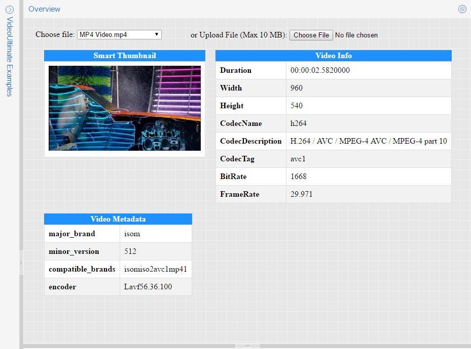

# .NET Video Reader and Thumbnailer
## Requires
- Visual Studio 2015
## License
- MIT
## Technologies
- ASP.NET
## Topics
- video reader
- video thumbnail
- video metadata
## Updated
- 08/08/2019
## Description

<h1>VideoUltimate: .NET Video Reader and Thumbnailer</h1>

VideoUltimate is the fastest and easiest .NET Video Reader and Thumbnailer library for reading video files without any dependencies.

<ul>
<li>Read any video file format on the planet. </li><li>Read a video file frame by frame. </li><li>Generate meaningful thumbnails. </li><li>Read info and metadata of the video file. </li></ul>

<strong>Note:</strong> This project&nbsp;contains a fully working version of the product, however without a license key it will run in trial mode. For more information, please see&nbsp;<a href="http://www.gleamtech.com/videoultimate">VideoUltimate: .NET
 Video Reader and Thumbnailer</a>&nbsp;product page.

<h3 style="margin-top:24px; margin-bottom:16px; font-size:1.25em; font-weight:600; line-height:1.25; color:#24292e">
To use VideoUltimate in a project, do the following in Visual Studio:</h3>
<ol style="padding-left:2em; margin-top:0px; color:#24292e; font-size:16px; margin-bottom:0px!important">
<li>

Add references to VideoUltimate assemblies. There are two ways to perform this:

<ul style="padding-left:2em; margin-top:0px; margin-bottom:0px">
<li>

Add reference to&nbsp;GleamTech.Core.dll&nbsp;and&nbsp;GleamTech.VideoUltimate.dll&nbsp;found in &quot;Bin&quot; folder of VideoUltimate-vX.X.X.X.zip
 package which you already downloaded and extracted.

</li><li style="margin-top:0.25em">

Or install NuGet package and add references automatically via NuGet Package Manager in Visual Studio: Go to&nbsp;Tools -&gt; NuGet Package Manager -&gt; Package Manager Console&nbsp;and
 run this command:

<code style="font-family:SFMono-Regular,Consolas,&quot;Liberation Mono&quot;,Menlo,Courier,monospace; font-size:13.6px; padding:0.2em 0.4em; margin:0px">Install-Package VideoUltimate -Source https://get.gleamtech.com/nuget/default/</code>

If you prefer using the user interface when working with NuGet, you can also install the package this way:

<ul style="padding-left:2em; margin-top:0px; margin-bottom:0px">
<li>

&nbsp;GleamTech has its own NuGet feed so first you need to add this feed to be able to find GleamTech's packages. Go to&nbsp;Tools -&gt; NuGet Package Manager -&gt; Package Manager
 Settings&nbsp;and then click the&nbsp;&#43;&nbsp;button to add a new package source. Enter&nbsp;<code style="font-family:SFMono-Regular,Consolas,&quot;Liberation Mono&quot;,Menlo,Courier,monospace; font-size:13.6px; padding:0.2em 0.4em; margin:0px">GleamTech</code>&nbsp;in&nbsp;Name&nbsp;field
 and&nbsp;<code style="font-family:SFMono-Regular,Consolas,&quot;Liberation Mono&quot;,Menlo,Courier,monospace; font-size:13.6px; padding:0.2em 0.4em; margin:0px">https://get.gleamtech.com/nuget/default/</code>&nbsp;in&nbsp;Sourcefield
 and click&nbsp;OK.

</li><li style="margin-top:0.25em">

Go to&nbsp;Tools -&gt; NuGet Package Manager -&gt; Manage NuGet Packages for Solution, select&nbsp;<code style="font-family:SFMono-Regular,Consolas,&quot;Liberation Mono&quot;,Menlo,Courier,monospace; font-size:13.6px; padding:0.2em 0.4em; margin:0px">GleamTech</code>&nbsp;or&nbsp;<code style="font-family:SFMono-Regular,Consolas,&quot;Liberation Mono&quot;,Menlo,Courier,monospace; font-size:13.6px; padding:0.2em 0.4em; margin:0px">All</code>&nbsp;in
 the Package source dropdown on the top right. Now enter&nbsp;<code style="font-family:SFMono-Regular,Consolas,&quot;Liberation Mono&quot;,Menlo,Courier,monospace; font-size:13.6px; padding:0.2em 0.4em; margin:0px">VideoUltimate</code>&nbsp;in the search field, and click&nbsp;Installbutton
 on the found package.

</li></ul>
</li></ul>
</li><li style="margin-top:0.25em">

Set VideoUltimate's global configuration. For example, you may want to set the license key. Insert the following line into the&nbsp;<code style="font-family:SFMono-Regular,Consolas,&quot;Liberation Mono&quot;,Menlo,Courier,monospace; font-size:13.6px; padding:0.2em 0.4em; margin:0px">Application_Start</code>&nbsp;method
 of your&nbsp;Global.asax.cs&nbsp;for Web projects or Main method for other project types:

<pre style="font-family:SFMono-Regular,Consolas,&quot;Liberation Mono&quot;,Menlo,Courier,monospace; font-size:13.6px; margin-top:0px; margin-bottom:0px; word-wrap:normal; padding:16px; overflow:auto; line-height:1.45; background-color:#f6f8fa; word-break:normal">//Set this property only if you have a valid license key, otherwise do not
//set it so VideoUltimate runs in trial mode.
VideoUltimateConfiguration.Current.LicenseKey = &quot;QQJDJLJP34...&quot;;</pre>

Alternatively you can specify the configuration in&nbsp;<code style="font-family:SFMono-Regular,Consolas,&quot;Liberation Mono&quot;,Menlo,Courier,monospace; font-size:13.6px; padding:0.2em 0.4em; margin:0px">&lt;appSettings&gt;</code>&nbsp;tag
 of your Web.config (or App.exe.config).

<pre style="font-family:SFMono-Regular,Consolas,&quot;Liberation Mono&quot;,Menlo,Courier,monospace; font-size:13.6px; margin-top:0px; margin-bottom:0px; word-wrap:normal; padding:16px; overflow:auto; line-height:1.45; background-color:#f6f8fa; word-break:normal">&lt;add key=&quot;VideoUltimate:LicenseKey&quot; value=&quot;QQJDJLJP34...&quot; /&gt;</pre>

As you would notice,&nbsp;<code style="font-family:SFMono-Regular,Consolas,&quot;Liberation Mono&quot;,Menlo,Courier,monospace; font-size:13.6px; padding:0.2em 0.4em; margin:0px">VideoUltimate:</code>&nbsp;prefix maps to&nbsp;<code style="font-family:SFMono-Regular,Consolas,&quot;Liberation Mono&quot;,Menlo,Courier,monospace; font-size:13.6px; padding:0.2em 0.4em; margin:0px">VideoUltimateConfiguration.Current</code>.

</li><li style="margin-top:0.25em">

Open one of your class files (eg. Program.cs) and at the top of your file add&nbsp;<code style="font-family:SFMono-Regular,Consolas,&quot;Liberation Mono&quot;,Menlo,Courier,monospace; font-size:13.6px; padding:0.2em 0.4em; margin:0px">GleamTech.VideoUltimate</code>&nbsp;namespace:

<pre style="font-family:SFMono-Regular,Consolas,&quot;Liberation Mono&quot;,Menlo,Courier,monospace; font-size:13.6px; margin-top:0px; margin-bottom:0px; word-wrap:normal; padding:16px; overflow:auto; line-height:1.45; background-color:#f6f8fa; word-break:normal">using GleamTech.VideoUltimate;</pre>

Now in some method insert these lines:

<pre style="font-family:SFMono-Regular,Consolas,&quot;Liberation Mono&quot;,Menlo,Courier,monospace; font-size:13.6px; margin-top:0px; margin-bottom:0px; word-wrap:normal; padding:16px; overflow:auto; line-height:1.45; background-color:#f6f8fa; word-break:normal">using (var videoFrameReader = new VideoFrameReader(@&quot;C:\Video.mp4&quot;))
{
    if (videoFrameReader.Read()) //Only if frame was read successfully
    {
        //Get a System.Drawing.Bitmap for the current frame
        //You are responsible for disposing the bitmap when you are finished with it.
        //So it's good practice to have a &quot;using&quot; statement for the retrieved bitmap.
        using (var frame = videoFrameReader.GetFrame())
            //Reference System.Drawing and use System.Drawing.Imaging namespace for the following line.
            frame.Save(@&quot;C:\Frame1.jpg&quot;, ImageFormat.Jpeg);
    }
}</pre>

This will open the source video &quot;C:\Video.mp4&quot;, read the first frame, and if the frame is read and decoded successfully, it will get a Bitmap instance of the frame and save it as &quot;C:\Frame1.jpg&quot;.

Sometimes you may only need to quickly generate a meaningful thumbnail for a video, you can use VideoThumbnailer class for this:

<pre style="font-family:SFMono-Regular,Consolas,&quot;Liberation Mono&quot;,Menlo,Courier,monospace; font-size:13.6px; margin-top:0px; margin-bottom:0px; word-wrap:normal; padding:16px; overflow:auto; line-height:1.45; background-color:#f6f8fa; word-break:normal">using (var videoThumbnailer = new VideoThumbnailer(@&quot;C:\Video.mp4&quot;))
//Generate a meaningful thumbnail of the video and
//get a System.Drawing.Bitmap with 100x100 maximum size.
//You are responsible for disposing the bitmap when you are finished with it.
//So it's good practice to have a &quot;using&quot; statement for the retrieved bitmap.
using (var thumbnail = videoThumbnailer.GenerateThumbnail(100))
    //Reference System.Drawing and use System.Drawing.Imaging namespace for the following line.
    thumbnail.Save(@&quot;C:\Thumbnail1.jpg&quot;, ImageFormat.Jpeg);</pre>

</li></ol>

