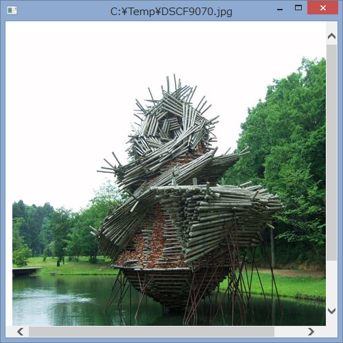

# .NET アプリケーション (WPF/Windows フォーム) で多重起動を禁止し、単一のプロセスで動作させる
## Requires
- Visual Studio 2012
## License
- Apache License, Version 2.0
## Technologies
- C#
- Windows Forms
- WPF
- .NET Framework
- Visual Studio 2012
## Topics
- C#
- 逆引きサンプル コード
## Updated
- 10/03/2013
## Description

<h1>■ 概要</h1>

.NET アプリケーション (WPF/Windows フォーム) で多重起動を禁止し、単一のプロセスで動作するようにする方法を C# で示します。

<h1>■ 解説</h1>

WPF アプリケーションや Windows フォーム アプリケーションにおいて、多重起動を禁止してみます。

ここでは、既にアプリケーションが起動していているときに、そのアプリケーションでドキュメントを開こうとした場合 (*1) に、

<ul>
<li>他のプロセスが起動していなければ、普通にドキュメントを開く。 </li><li>他のプロセスが既に起動していれば、その起動中のアプリケーションでドキュメントを開く。 </li></ul>

という動作を実現します。

<blockquote>

(*1) アプリケーションでドキュメントを開くのには、次のようなケースが考えられます。

<ul>
<li>実行ファイルに、ドキュメント ファイルをドラッグ&amp;ドロップ 
例. 実行ファイルを a.exe とすると、ファイル エクスプローラーで a.png を a.exe にドラッグ&amp;ドロップ </li><li>コマンド プロンプトで、コマンドライン引数にドキュメント ファイルを指定して実行ファイルを起動 
例. 実行ファイルのパスを c:\demo\a.exe、ドキュメント ファイル c:\demo\a.png とすると、コマンド プロンプトを開き、c:\demo\a.exe c:\demo\a.png[Enter] と入力
</li></ul>
</blockquote>
<h1>■ 実現方法</h1>
<h2>すでに起動しているかのチェック方法</h2>

ここでは Mutex を用います。詳細はサンプル コードを参照してください。

<h2>すでに起動しているアプリケーションとの通信方法</h2>

ここでは Ipc を用います。詳細はサンプル コードを参照してください。

<h1>■ サンプル コードの説明</h1>

WPF と Windows フォームの両方のサンプルがあります。

<h2>■ 共通部 (WPF、Windows フォーム非依存)</h2>

次のソースコードは共通部です。

<h3>SingleDocument.cs</h3>
<ul>
<li>多重起動を禁止
<ul>
<li>他のプロセスが起動していなければ、普通にドキュメントを開く </li><li>他のプロセスが既に起動していれば、その起動中のアプリケーションでドキュメントを開く </li></ul>
</li><li>WPF、Windows フォーム非依存 </li><li>参照設定 System.Runtime.Remoting が必要 </li></ul>
<h2>WPF の場合</h2>

上記 SingleDocumentHelper クラスを WPF で使う場合のサンプル コードです。

<h3>SingleDocumentWpfApplication.cs</h3>
<ul>
<li>App.xaml.cs のアプリケーション クラスのベース クラス。 </li><li>タイマーに System.Windows.Threading.DispatcherTimer クラスを使う。 </li></ul>
<h3>App.xaml</h3>
<h3>App.xaml.cs</h3>
<ul>
<li>上記 SingleDocumentApplication クラスから派生。 </li></ul>
<h3>MainWindow.xaml</h3>
<ul>
<li>WebBrowser コントロールが貼ってあるだけ。 </li></ul>
<h3>MainWindow.xaml.cs</h3>
<ul>
<li>指定されたパスや URL を WebBrowser コントロールで表示する。 </li></ul>
<h2>Windows フォームの場合</h2>

SingleDocumentHelper クラスを Windows フォームで使う場合で使う場合のサンプル コードです。

<h3>SingleDocumentWindowsFormApplication.cs</h3>
<ul>
<li>Main メソッドで使用するためのクラス。 </li><li>タイマーに System.Windows.Forms.Timer クラスを使う。 </li></ul>
<h3>Program.cs</h3>
<ul>
<li>Main メソッド。 </li></ul>
<h3>MainForm.cs (MainForm.Designer.cs は不要)</h3>
<ul>
<li>WebBrowser コントロールが貼ってある。 </li><li>指定されたパスや URL を WebBrowser コントロールで表示する。 </li></ul>
<h1>■ 実行方法</h1>

&lt;!-- Windows 上の Visual Studio 2012 以降でこのサンプルを開き、F5 キーを押して実行します。 --&gt;

<ol>
<li>WPF 版または Windows フォーム版をビルドする。 </li><li>ファイル エクスプローラーで実行ファイル (例えば、SingleDocumentSample.Wpf.exe や SingleDocumentSample.WinForm.exe) のあるフォルダーを開き、実行ファイルのアイコンに画像ファイル (JPEG ファイルや PNG ファイル) 等をドラッグ&amp;ドロップする。 (または、コマンドプロンプトで実行ファイルのバスにコマンドライン引数で画像ファイルのパスやURLを渡す)
</li><li>サンプル プログラムが起動し、その画像ファイルが表示される。 </li><li>サンプル プログラムを最小化し、再度ファイル エクスプローラーで別の画像ファイルをドラッグ&amp;ドロップする。 (または、コマンドプロンプトで実行ファイルのバスにコマンドライン引数で別の画像ファイルのパスやURLを渡す)
</li><li>今度はプログラムは起動せず、最小化されていた先程のサンプル プログラムが最前面に戻り、新たな画像ファイルが表示される。 </li></ol>

 実行イメージ

