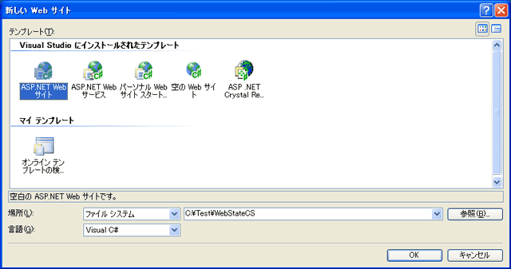
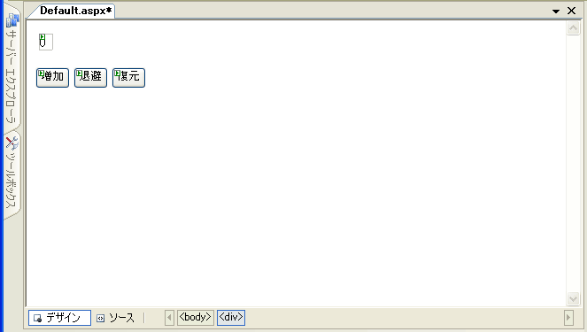
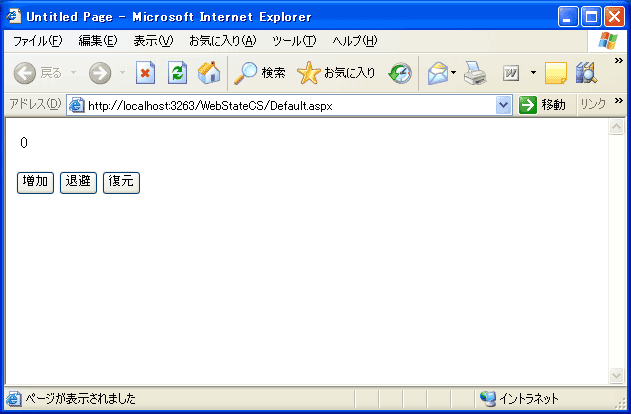
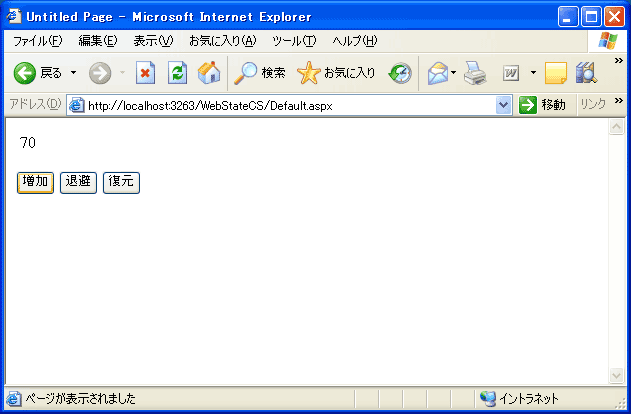
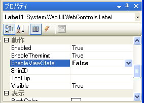

# 10 行でズバリ!! ViewState の利用 (C#)
## License
- Apache License, Version 2.0
## Technologies
- ASP.NET
- Visual Studio 2005
## Topics
- 10 行でズバリ!!
- Web アプリケーション
## Updated
- 09/20/2012
## Description

最終更新日 2005 年 11 月 14 日

<h2> このコンテンツのポイント</h2>
<ul>
<li>ViewState (ビューステート) の利用方法を理解する。 </li><li>ViewState (ビューステート) による状態の維持の仕組みを理解する。 </li></ul>
<h2> 今回紹介するコード</h2>
<h3>＜Default.aspx.cs＞</h3>

C#

Edit Script

csharp

<pre id="codePreview" class="csharp"><code class="csharp">protected void Button1_Click(object sender, EventArgs e)
{
    //現在のラベルの値を取得し、10だけ加算する
    int n = Int32.Parse(Label1.Text);
    n &#43;= 10; 
    Label1.Text = n.ToString();
}
protected void Button2_Click(object sender, EventArgs e)
{
    // ビューステートへ退避
    ViewState[&quot;MyData&quot;] = Label1.Text;
}
protected void Button3_Click(object sender, EventArgs e)
{
    // ビューステートから復元
    Label1.Text = (string) ViewState[&quot;MyData&quot;];</code></pre>

&nbsp;

<h3> 今回のシステム要件</h3>
<ul>
<li>Visual Studio 2005 Beta 2 </li></ul>
<h3>目次</h3>

<a href="#section1">はじめに</a> 
<a href="#section2">作成するアプリケーションの概要</a> 
<a href="#section3">アプリケーションの作成</a> 
<a href="#section4">動作と解説</a> 
<a href="#conclusion">おわりに</a>

<table border="0" cellspacing="0" cellpadding="5" bgcolor="#e5f1f8">
<tbody>
<tr>
<td colspan="2">Visual Basic の内容はこちらに掲載しています。</td>
</tr>
<tr>
<td align="center"></td>
<td><a href="http://code.msdn.microsoft.com/10-ViewState-VB-2ce014b6/">10 行でズバリ!! ViewState の利用 (VB)</a></td>
</tr>
</tbody>
</table>

<h2 id="section1">はじめに</h2>

一般に HTTP を使用したWeb アプリケーションでは、Web ブラウザ上に一つのページを表示するごとに、クライアントとサーバーとの間で、1回の HTTP 要求とHTTP応答のやり取りが完結します。そのため、あるページから別のページに移動した場合に、ページ間で自動的にデータが渡されることはありません。ページ間でデータを渡すには、明示的にデータを渡す方法が必要であり、その方法として「クエリ文字列」や「クッキー」、「セッション」などが挙げられ、これらに関する ASP.NET の実装方法は、「10 行でズバリ
 !! ページ間におけるデータ受け渡し」で取り上げました。

これ以外にも ASP.NET には、Web ページ上のユーザー インターフェイスの状態 (ステート) を、複数の HTTP要求/応答をまたいで、自動的に維持する仕組みが用意されています。これを ViewSate (ビューステート) と呼んでいます。ここでは、ViewState の基本的な機能や、その利用方法について見ていきます。

<h2 id="section2">作成するアプリケーションの概要</h2>

ここでは、ViewState の仕組みと、その使い方を理解するために、ボタンを押すとラベルの数字が増加する Web ページを作ります。ラベル上の数字が、いわば、ユーザー インターフェイスの状態 (ステート) に当たるものであり、この状態が変化する過程で (数値が増加する過程で)、ViewState がどう作用するかを確認します。また、ViewState にとって重要なプロパティである ViewState プロパティやEnableViewSate プロパティの機能も確認します。

<h2 id="section3">アプリケーションの作成</h2>

まず、新規にWebサイトを作成します。Visual Studio 2005 の [ファイル] メニューをクリックし、[新規作成] をポイントして、[Web サイト] をクリックします。 すると、[新しい Web サイト] ダイアログボックスが表示されます。

ここでは、言語として Visual C# を選択し、テンプレートとして 「ASP.NET Web サイト」 を選択します。 [場所] 欄では、ドロップダウン リストで 「ファイル システム」が選択されていることを確認した後、任意のパスを指定して (たとえば、 「C:\Test\WebStateVB」 など)を入力し(図1)、[OK] をクリックします。

<strong>図 1. Web サイトを新規に作成する</strong>&nbsp;

これで、Web フォームによる Web ページ開発の準備として、雛形となる Web サイトができました。

既定の構成では、Default.aspx の編集画面としてソース ビューが開いているので、編集画面の左下部にある [デザイン] タブをクリックして、Web ページのデザイン画面に切り替えます。このデザイン画面で、画面レイアウトが図2になるように、ツールボックスから必要なコントロールをドラッグ アンド ドロップして、Web フォーム上に配置します。

Web サーバー コントロールとして、画面の左上から順に Label コントロールを一つ、そして、Button コントロールを三つ貼り付けます。また、各コントロールが図 2の表示の通りになるよう、Text プロパティを変更します。Label コントロールの Text プロパティには、この後の処理の関係上、必ず 「0」 (ゼロ) を設定しておいてください。

その他のプロパティは既定のままにします。ボタンの (ID) プロパティは、左から順番に、Button1、Button2、Button3 になっているはずです。

<strong>図 2. コントロールを追加して、画面を構成する</strong>&nbsp;

ここで、三つのボタンをダブルクリックして、それぞれ Click イベント ハンドラを作成します。

まずは、[増加] ボタンのイベント ハンドラ (Button1_Click) に、ラベルの値を10だけ増加させるコードを追加します。このボタンを押すたびに、このコードが実行されます。このコードでは、ラベルのテキスト部分 (Label1.Text プロパティ) を文字列型から整数型に変換し (Inst32.Parse メソッド)、10加算して、もとのラベルに再度設定しています。

C#

Edit Script

csharp

<pre id="codePreview" class="csharp"><code class="csharp">protected void Button1_Click(object sender, EventArgs e)
{
    //現在のラベルの値を取得し、10だけ加算する
    int n = Int32.Parse(Label1.Text);
    n &#43;= 10; 
    Label1.Text = n.ToString();
}</code></pre>

&nbsp;

[退避] ボタンのイベント ハンドラ (Button2_Click) に、以下のコードを追加します。このコードでは、Label1.Text プロパティを、ページ オブジェクトの ViewState プロパティに退避しています。(詳しい働きは、後で確認します。)

C#

Edit Script

csharp

<pre id="codePreview" class="csharp"><code class="csharp">protected void Button2_Click(object sender, EventArgs e)
{
    // ビューステートへ退避
    ViewState[&quot;MyData&quot;] = Label1.Text;
}</code></pre>

&nbsp;

[復元] ボタンのイベント ハンドラ (Button3_Click) に、以下のコードを追加します。このコードでは、ページ オブジェクトの ViewState プロパティから、Label1.Text プロパティへ値を復元しています。(詳しい働きは、後で確認します。)

C#

Edit Script

csharp

<pre id="codePreview" class="csharp"><code class="csharp">protected void Button3_Click(object sender, EventArgs e)
{
    // ビューステートから復元
    Label1.Text = (string) ViewState[&quot;MyData&quot;];
}</code></pre>

&nbsp;

これでコードが完成しました。

<h2 id="section4">動作と解説</h2>

コードも画面も完成しましたので、実行してみます。まず、ソリューション エクスプローラ上で、Default.aspx を 1 回クリックして選択された状態にします。次に、[Ctrl&#43;F5] キーを押すか、[デバッグ] メニューの [デバッグなしで開始] をクリックします。

すると、Visual Studio 2005 の既定の構成では、試験用の Web サーバーとして 「ASP.NET 開発サーバー」が自動的に起動し、そのサーバーの上で、Web アプリケーションが実行されるようになります。また、Web ブラウザが自動的に起動して、選択した Web ページが表示されます。(図 3)URL には、ASP.NET 開発サーバーが使用するための、ランダムに設定されたポート番号が含まれています。このポート番号はソリューション ファイルに書き込まれ、これ以降は同じポート番号で実行することになります。

<strong>図 3. アプリケーションを実行する</strong>

図 3 のように、起動した直後の Web ページでは、ラベルの値が初期状態の「0」 (ゼロ) になっています。ここで、Web ページ上の [増加] ボタンを何回か押してみます。ボタンを押すごとに、サーバー側の Click イベント ハンドラが呼び出され、ラベルの値が増加します。(図 4)

<strong>図 4. ラベルの値が増加する (7 回押したところ)</strong>

ここで、HTTP レベルでのブラウザとサーバーのやり取りを考えてみます。

[増加] ボタンを押すごとに、HTTP を使用して、同一の URL (Default.aspx) へポストを行っています。つまり、ボタンを押すごとに、HTTP 要求と HTTP 応答のやり取りが行われます。では、このとき増加するラベルの値は、どこで保持されているのでしょうか?

考えてみると、値が増えることは不思議なことです。たとえば、ボタンが押されたことによって、ラベルの値が 70 になるのならば、その直前の値が60であることを、どこかで記憶しておく必要があります。HTTP 要求と HTTP 応答は、1回ごとに完結してしまうので、特に何もしてなければ、前回の HTTP 要求/応答の際に、ラベルが 60 であったという情報はどこにも残らないはずです。

実は、この値はクライアント側へ送信された HTML 内の隠しフィールドとして、クライアント側で保持されているのです。ブラウザで、HTML のソースを表示して確認してみましょう。

Internet Explorer の [表示] メニューの [ソース] をクリックします。以下のように、name 属性が 「__VIEWSTATE」 になっている隠しフィールド() があります。このフィールドの value 属性の値として、保持されているのです。この値は、Web フォームのユーザー インターフェイスの状態 (ステート) に関する情報です。ASP.NET では、ここに状態が退避されるので、複数の HTTP要求/応答をまたいでも、現在のユーザー インターフェイスの状態が維持できるのです。
 このような仕組みを、ViewState と呼んでいます。

&nbsp;

HTML

スクリプトの編集

html

<pre class="html">&lt;input&nbsp;type=&quot;hidden&quot;&nbsp;name=&quot;__VIEWSTATE&quot;&nbsp;id=&quot;__VIEWSTATE&quot;&nbsp;
&nbsp;&nbsp;&nbsp;&nbsp;&nbsp;&nbsp;&nbsp;&nbsp;&nbsp;&nbsp;&nbsp;value=&quot;/wEPDwUKMTA0NDQ2OTE5OQ9kFgICAw9kFgICAQ8PFgIeBFRleHQFAjcw&quot;&nbsp;/&gt;&nbsp;
&nbsp;
</pre>

&nbsp;

なお、この値は、圧縮されエンコードされて保持されていますが、一般で使用するような高度な暗号化が行われているわけではないので注意が必要です。 この値は、セキュリティのためのものではなく、ユーザー インターフェイス実装の便宜を図るためのものであるといえます。そもそもこの値は、外部からのアクセスを制御できるサーバーで保持されるのではなく、クラ イアント側で保持される点に注意してください。

今回の例のように、ラベルが 60 から 70 に変化する具体的な流れとしては、次のようになります。

<ul>
<li>ボタンをクリックした場合、この隠しフィールドも &lt;input&gt; タグなので、サーバーに投函され、ASP.NET ランタイムが受け取ります。 </li><li>ASP.NET ランタイムは、サーバーでプログラムを実行するにあたり、この情報をプログラム上の各オブジェクトに復元します。隠しフィールドに保持された 60 という値も、Label1.Text に復元されます。(もし、このような復元をしないと、ラベルは空である点に注意してください。HTTP要求/応答ごとに処理が完結しているため、サーバー 側のプログラムは、特別なことがない限り、前の状態を覚えていません。)
</li><li>復元された値 60 を持つ、Label1.Text プロパティに関して、Button1_Click イベントハンドラで 70 に更新されます。 </li><li>クライアントのWeb ページ向けに 70 という文字列が表示されるよう HTML が形成されるほか、現在の 70 という値は、再び隠しフィールドに退避され、HTML 内に反映されます。
</li><li>作成された HTML がクライアントに送信されます。 </li></ul>

このような状態の退避と復元は、ASP.NET ランタイムが自動的に行うので、プログラマが記述すべきことは、先に挙げた Button1_Click イベントハンドラで、10 加算するだけです。つまり、そのプログラム本来のロジックの実装に専念できます。

このような ViewState の仕組みは、既定で有効になっています。ユーザー インターフェイスの形態によっては、状態として保持するデータ量が多いこともあります。その場合、ビュー ステートのサイズが大きくなり、パフォーマンスに影響を与えることがあるかも知れません。状態を維持する必要がない場合は、この機能を無効にしておくとよ いでしょう。その制御を行うのが、EnableViewState プロパティです。この後は、このプロパティを変更してみます。

ここで、ブラウザを閉じて、Web フォーム デザイナに戻ります。デザイナ上で、ラベル Label1 をクリックして選択し、プロパティ ウィンドウで、EnableViewState プロパティを False に設定します。(図 5)

<strong>図 5. EnableViewStateを False に設定する</strong>

ここで、再び実行します。ソリューション エクスプローラ上で、Default.aspx を1回クリックして選択された状態にします。次に、[Ctrl&#43;F5] キーを押すか、[デバッグ] メニューの [デバッグなしで開始] をクリックします。

Default.aspx の Web ページが開いたら、再び [増加] ボタンを何回か押してみます。

今度は、何回押しても、加算結果が 10 になります。直前の HTTP要求/応答の際の値が退避されていないので、加算前の値は、常に 0 になっています。そのため、計算結果は常に 10 になります。

<strong>図 6. 何回押しても、値は 10 のまま変わらない</strong>

確認が済んだら、ブラウザを閉じて、再び EnableViewState プロパティを True に戻してください。最後に、残りの二つのボタンを実験します。

ViewState では、プログラマが任意の値を退避することもできます。

ページ オブジェクトを含む各種サーバー コントロールには、ViewState プロパティがあり、そのプロパティに追加した値は、自動的に HTML の隠しフィールドに退避されます。[退避] ボタンの Button2_Click イベントハンドラでは、以下の記述があり、その時点のラベルの値を、退避しています。

C#

Edit Script

csharp

<pre id="codePreview" class="csharp"><code class="csharp">$$$    ViewState[&quot;MyData&quot;] = Label1.Text;</code></pre>

&nbsp;

ViewState プロパティでは、インデックスを使って、保存する値に名前 (キー) を付けます。ここでは、「MyData」という名前です。[復元] ボタンの Button3_Click イベント ハンドラでは、以下のように、インデックスに「MyData」を指定して、退避された値を参照しています。この記述によって、ラベルは退避時の値に戻りま す。

C#

Edit Script

csharp

<pre id="codePreview" class="csharp"><code class="csharp">$$$    Label1.Text = (string) ViewState[&quot;MyData&quot;];</code></pre>

&nbsp;

なお、今回使用した ViewState プロパティはページ オブジェクトの ViewState プロパティを利用しました。もちろん、ページ オブジェクトの EnableViewState プロパティが True (既定値) でなければ、この退避は動作しません。

ここで、再び実行します。ソリューション エクスプローラ上で、Default.aspx を 1 回クリックして、選択された状態にします。次に、[Ctrl&#43;F5] キーを押すか、[デバッグ] メニューの [デバッグなしで開始] をクリックします。

Default.aspx の Web ページが開いたら、再び [増加] ボタンを3回押して、ラベルの値を 30 にます。

ここで、[退避] ボタンを押して、30 を退避します。

再び、[増加] ボタンを押して、値を増やしていきます。

[復元] ボタンを押すと、値が 30 になることが分かります。何回かボタンが押され、複数回の HTTP 要求/応答のやり取りが行われる中、退避された値が維持されていたことが分ります。

確認が済んだら、ブラウザを閉じます。

<h2 id="conclusion">おわりに</h2>

ASP.NET では、状態が変化するユーザー インターフェイスについて、現在の状態を管理することが非常に簡単であることが分りました。従来の Web アプリケーションであれば、このような状態管理を、プログラマがコードとして記述する必要がありました。説明で触れた隠しフィールドも、従来の Web アプリケーション開発では明示的に実装する必要がありました。ASP.NET では、これらの仕組みがフレームワークの一部として組み込まれており、自動的に行われます。

この仕組みを利用することで、優れたインターフェイスを短期間で開発することができ、また、開発者は本来必要となる、そのアプリケーション固有のロジック作成に専念することができます。&nbsp;

<table>
<tbody>
<tr>
<td></td>
<td></td>
<td>
<ul>
<li>もっと他のコンテンツを見る &gt;&gt; 10 行でズバリ!! サンプル コード集 (<a href="http://msdn.microsoft.com/ja-jp/netframework/ee708289" target="_blank">C#</a> |
<a href="http://msdn.microsoft.com/ja-jp/netframework/ee708290" target="_blank">VB</a>)
</li><li>もっと他のレシピを見る &gt;&gt; <a href="http://msdn.microsoft.com/ja-jp/samplecode.recipe">
Code Recipe へ</a> </li><li>もっと .NET Framework の情報を見る &gt;&gt; <a href="http://msdn.microsoft.com/ja-jp/netframework/" target="_blank">
.NET Framework デベロッパー センターへ</a> </li></ul>
</td>
</tr>
</tbody>
</table>

<a href="#top">ページのトップへ</a>

