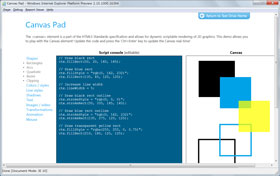
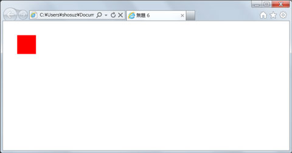
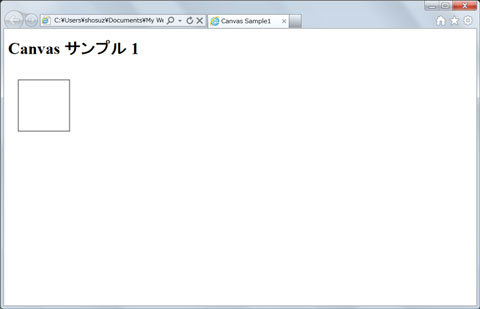
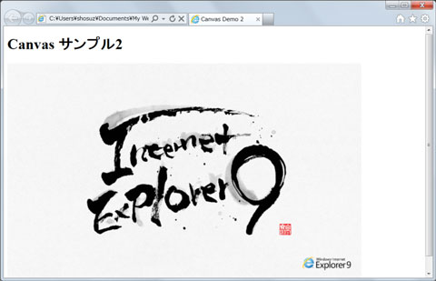

# 10行でズバリ!! [HTML5 と IE9] HTML5 で Canvas を利用する
## License
- Apache License, Version 2.0
## Technologies
- Visual Studio 2010
- Javascript
- HTML5
- Expression Web 4
## Topics
- 10 行でズバリ!!
- Web アプリケーション
## Updated
- 06/22/2011
## Description

<h2 style="padding:10px"> このコンテンツのポイント</h2>

Internet Explorer 9 で新たに導入された、新しい HTML5 機能の 1 つが、Canvas 要素です。これは、Canvas 2D API と一緒に使用します。Canvas 要素は、「HTML5 仕様」で定義されているように、解像度依存のビットマップ
 キャンバス上へのグラフィックのレンダリングを可能にします。キャンバスに描画するには、Canvas 2D コンテキストなどの &quot;コンテキスト&quot; を使用します。これは、W3C Canvas 2D API 仕様に指定されています。 
Internet Explorer 9 では、Canvas 要素のサポートが導入されます。2D Canvas 描画 API が、サポートされる唯一のコンテキストとなります。Internet Explorer 9 のすべてのグラフィックスと同様、Canvas は、Windows と GPU によるハードウェア アクセラレーションに対応しています。 
今回はこの Canvas の特長と、実装方法について、確認していきましょう。

IE9 の Canvas サポートの詳細については、<a href="http://msdn.microsoft.com/ja-jp/ie/ff468705#_HTML5_canvas" target="_blank">MSDN オンライン</a>を参照してください。

<h2 style="padding:10px"> 今回紹介するコード</h2>
<h4>(1) Canvas の API を使って四角形を描画する</h4>

JavaScript

スクリプトの編集|{#scriptcode_dlg.remove_script}

js

<pre class="js">&lt;!DOCTYPE&nbsp;html&gt;&nbsp;
&lt;html&gt;&nbsp;
&nbsp;
&lt;head&gt;&nbsp;
&lt;meta&nbsp;content=&quot;text/html;&nbsp;charset=utf-8&quot;&nbsp;http-equiv=&quot;Content-Type&quot;&gt;&nbsp;
&lt;title&gt;Canvas&nbsp;Sample1&lt;/title&gt;&nbsp;
&lt;script&nbsp;type=&quot;text/javascript&quot;&gt;&nbsp;
&nbsp;
&nbsp;&nbsp;&nbsp;&nbsp;onload&nbsp;=&nbsp;function&nbsp;()&nbsp;{&nbsp;
&nbsp;&nbsp;&nbsp;&nbsp;&nbsp;&nbsp;&nbsp;&nbsp;draw();&nbsp;
&nbsp;&nbsp;&nbsp;&nbsp;};&nbsp;
&nbsp;&nbsp;&nbsp;&nbsp;function&nbsp;draw()&nbsp;{&nbsp;
&nbsp;&nbsp;&nbsp;&nbsp;&nbsp;&nbsp;&nbsp;&nbsp;/*&nbsp;canvas要素のDOMオブジェクト取得*/&nbsp;
&nbsp;&nbsp;&nbsp;&nbsp;&nbsp;&nbsp;&nbsp;&nbsp;var&nbsp;canvas&nbsp;=&nbsp;document.getElementById(&quot;canvas1&quot;);&nbsp;
&nbsp;&nbsp;&nbsp;&nbsp;&nbsp;&nbsp;&nbsp;&nbsp;/*&nbsp;canvas要素の存在チェックとCanvas未対応ブラウザの対処&nbsp;*/&nbsp;
&nbsp;&nbsp;&nbsp;&nbsp;&nbsp;&nbsp;&nbsp;&nbsp;if&nbsp;(!canvas&nbsp;||&nbsp;!canvas.getContext)&nbsp;{&nbsp;
&nbsp;&nbsp;&nbsp;&nbsp;&nbsp;&nbsp;&nbsp;&nbsp;&nbsp;&nbsp;&nbsp;&nbsp;return&nbsp;false&nbsp;
&nbsp;&nbsp;&nbsp;&nbsp;&nbsp;&nbsp;&nbsp;&nbsp;}&nbsp;
&nbsp;&nbsp;&nbsp;&nbsp;&nbsp;&nbsp;&nbsp;&nbsp;/*&nbsp;2D描画コンテキストの取得&nbsp;*/&nbsp;
&nbsp;&nbsp;&nbsp;&nbsp;&nbsp;&nbsp;&nbsp;&nbsp;var&nbsp;ctx&nbsp;=&nbsp;canvas.getContext(&quot;2d&quot;);&nbsp;
&nbsp;&nbsp;&nbsp;&nbsp;&nbsp;&nbsp;&nbsp;&nbsp;/*&nbsp;四角を描く&nbsp;*/&nbsp;
&nbsp;&nbsp;&nbsp;&nbsp;&nbsp;&nbsp;&nbsp;&nbsp;ctx.beginPath();&nbsp;
&nbsp;&nbsp;&nbsp;&nbsp;&nbsp;&nbsp;&nbsp;&nbsp;ctx.moveTo(20,&nbsp;20);&nbsp;
&nbsp;&nbsp;&nbsp;&nbsp;&nbsp;&nbsp;&nbsp;&nbsp;ctx.lineTo(120,&nbsp;20);&nbsp;
&nbsp;&nbsp;&nbsp;&nbsp;&nbsp;&nbsp;&nbsp;&nbsp;ctx.lineTo(120,&nbsp;120);&nbsp;
&nbsp;&nbsp;&nbsp;&nbsp;&nbsp;&nbsp;&nbsp;&nbsp;ctx.lineTo(20,&nbsp;120);&nbsp;
&nbsp;&nbsp;&nbsp;&nbsp;&nbsp;&nbsp;&nbsp;&nbsp;ctx.closePath();&nbsp;
&nbsp;&nbsp;&nbsp;&nbsp;&nbsp;&nbsp;&nbsp;&nbsp;ctx.stroke();&nbsp;
&nbsp;&nbsp;&nbsp;&nbsp;}&nbsp;
&nbsp;
&lt;/script&gt;&nbsp;
&nbsp;
&lt;/head&gt;&nbsp;
&lt;body&gt;&nbsp;
&nbsp;
&nbsp;&nbsp;&nbsp;&nbsp;&lt;h1&gt;Canvas&nbsp;サンプル&nbsp;2&lt;/h1&gt;&nbsp;
&nbsp;&nbsp;&nbsp;&nbsp;&lt;canvas&nbsp;id=&quot;canvas1&quot;&nbsp;width=&quot;300&quot;&nbsp;height=&quot;400&quot;&gt;&nbsp;
&nbsp;&nbsp;&nbsp;&nbsp;&lt;/canvas&gt;&nbsp;
&nbsp;
&lt;/body&gt;&nbsp;
&lt;/html&gt;</pre>

&nbsp;

<h4>(2) Canvas の API を使って画像をロードする</h4>

JavaScript

スクリプトの編集|{#scriptcode_dlg.remove_script}

js

<pre class="js">&lt;!DOCTYPE&nbsp;html&gt;&nbsp;
&lt;html&gt;&nbsp;
&lt;head&gt;&nbsp;
&nbsp;&nbsp;&nbsp;&nbsp;&lt;title&gt;Canvas&nbsp;Demo&nbsp;2&lt;/title&gt;&nbsp;
&lt;/head&gt;&nbsp;
&lt;body&gt;&nbsp;
&nbsp;&nbsp;&nbsp;&nbsp;&lt;h1&gt;Canvas&nbsp;サンプル2&lt;/h1&gt;&nbsp;
&nbsp;&nbsp;&nbsp;&nbsp;&lt;canvas&nbsp;id=&quot;canvas1&quot;&nbsp;width=&quot;760&quot;&nbsp;height=&quot;480&quot;&gt;&nbsp;
&nbsp;&nbsp;&nbsp;&nbsp;&lt;/canvas&gt;&nbsp;
&lt;/body&gt;&nbsp;
&lt;/html&gt;&nbsp;
&nbsp;
&lt;script&nbsp;type=&quot;text/javascript&quot;&gt;&nbsp;
&nbsp;&nbsp;&nbsp;&nbsp;//Canvas要素のDOMオブジェクトを取得&nbsp;
&nbsp;&nbsp;&nbsp;&nbsp;var&nbsp;canvas&nbsp;=&nbsp;document.getElementById(&quot;canvas1&quot;);&nbsp;
&nbsp;&nbsp;&nbsp;&nbsp;//描画コンテキストを取得&nbsp;
&nbsp;&nbsp;&nbsp;&nbsp;var&nbsp;ctx&nbsp;=&nbsp;canvas.getContext(&quot;2d&quot;);&nbsp;
&nbsp;&nbsp;&nbsp;&nbsp;//イメージ要素を生成&nbsp;
&nbsp;&nbsp;&nbsp;&nbsp;var&nbsp;image&nbsp;=&nbsp;new&nbsp;Image();&nbsp;
&nbsp;&nbsp;&nbsp;&nbsp;//画像の読み込みが終わり次第、Canvasに書き出す&nbsp;
&nbsp;&nbsp;&nbsp;&nbsp;&nbsp;&nbsp;&nbsp;&nbsp;image.onload&nbsp;=&nbsp;function&nbsp;()&nbsp;{&nbsp;
&nbsp;&nbsp;&nbsp;&nbsp;&nbsp;&nbsp;&nbsp;&nbsp;&nbsp;&nbsp;&nbsp;&nbsp;ctx.drawImage(image,&nbsp;0,&nbsp;0,&nbsp;canvas.width,&nbsp;canvas.height);&nbsp;
&nbsp;&nbsp;&nbsp;&nbsp;&nbsp;&nbsp;&nbsp;&nbsp;};&nbsp;
&nbsp;&nbsp;&nbsp;&nbsp;&nbsp;&nbsp;&nbsp;&nbsp;//画像のロードを開始する&nbsp;
&nbsp;&nbsp;&nbsp;&nbsp;&nbsp;&nbsp;&nbsp;&nbsp;image.src&nbsp;=&nbsp;&quot;IE9_wallpaper_ryo01_1680_1050.jpg&quot;;&nbsp;
&lt;/script&gt;</pre>

&nbsp;

<h2>目次</h2>
<ol>
<li><a href="#01">はじめに</a>
<ul>
<li><a href="#0101">Web アプリケーション プラットフォームとしての HTML5</a> </li><li><a href="#0102">Canvas の特長と実装方法</a> </li><li><a href="#0103">Canvas のサンプル コード</a> </li><li><a href="#0104">HTML5 オーサリングのためのツール</a> </li></ul>
</li><li><a href="#02">解説</a>
<ol type="1">
<li><a href="#0201">HTML ページの作成</a> </li><li><a href="#0202">HTML ページの編集</a> </li><li><a href="#0203">実行結果の確認</a> </li><li><a href="#0204">Canvas のシナリオと SVG との使い分け</a> </li><li><a href="#0205">おわりに</a> </li></ol>
</li></ol>

<h2 id="01">1. はじめに</h2>

HTML5 は、W3C が HTML4 に代わる 次世代の HTML として策定を進めている HTML 仕様です。現状普及している HTML4.01 の現状の問題点としては、次の 2 点があります。

<ul>
<li>HTML タグで構造付けされた HTML 文書の作成と公開が目的である </li><li>したがって (プラグインなしで) Web アプリケーションを作成するには機能不足である </li></ul>

そこで、HTML5 の特長としては、

<ul>
<li>HTML 文書を作成する機能自体の改良を実施する </li><li>Web アプリケーションを開発するための様々な仕様を追加する </li></ul>

ということになります。

前者は、セマンティックス要素の追加のことで、文章構造をロジカルにし、可読性を高め、SEO 対策等にも利用可能なようにするということです。HTML5 が提供するこれらの新しい
 Semantics タグにより、DIV や SPAN その他の ID 属性を持った class 要素をリプレースすることができます。具体的には、Header, Footer, Article, Section, Nav, Aside, Hgroup, Figure, Figcaption, Address 等々があります。

なお、後者は、本稿以下で順次ご紹介する、HTML5 で初めて登場した新タグや新しく追加された API のことです。

以上 2 つの特長により、Flash や Silverlight 等のブラウザー プラグインで実現できる Web アプリケーションとして必要な機能のうちの一部を、標準の HTML5 及び JavaScript でシンプルに実現できる、ということになります。

<h3 id="0101">Web アプリケーション プラットフォームとしての HTML5</h3>

この図では、広義の HTML5 という部分と、狭義の HTML5 という部分について、提示しています。広義の HTML5 の中には、Web Sockets や Web Storage 等々色々あります。このシリーズでは、主に W3C HTML5 と書いてある箇所をメインに、IE9 や IE10 PP1、そして HTML Labs にある実装を元に、構文要素、Video/Audio、Canvas、フォーム要素、リッチテキスト API、ドラッグ アンド ドロップ API 等々順次ご紹介して行きます。

<h3 id="0102">Canvas の特長と実装方法</h3>

Canvas とは、Javascript で 2D の図形を描くことができるブロック要素のことです。Canvas 要素は、図などのフォーマットではなく、グラフィックスを描画する領域を示す指定した範囲内で、図形などの線画、画像などの 2D Graphics を自由に描画できます。すなわちグラフィックスの描画が可能な領域を示します。 
実装方法としては、下記の通りです。まずは Canvas を定義します。

HTML

スクリプトの編集|{#scriptcode_dlg.remove_script}

html

<pre class="js">&lt;canvas&nbsp;id=&ldquo;mycanvas&rdquo;&nbsp;width=&ldquo;100&rdquo;&nbsp;height=&ldquo;200&rdquo;&gt;&nbsp;&lt;/canvas&gt;&nbsp;</pre>

&nbsp;

次に、JavaScript を用いてキャンバスに描画するため、2d 描画コンテキストを取得します。

JavaScript

スクリプトの編集|{#scriptcode_dlg.remove_script}

js

<pre class="js">var&nbsp;canvas&nbsp;=&nbsp;document.getElementById(&ldquo;mycanvas&rdquo;);&nbsp;
var&nbsp;context&nbsp;=&nbsp;canvas.getContext(&ldquo;2d&rdquo;);</pre>

&nbsp;

Canvas は、Web 上にグラフィックをプログラムするための方法です。Canvas タグは &quot;即時モード&quot; (描画コマンドがグラフィック ハードウェアに直接送信される) の 2 次元描画用サーフェイスです。別のプラグインをダウンロードする必要なしにリアルタイムのグラフ、アニメーション、インタラクティブなゲームを提供できます。CanvasRenderingContext2D オブジェクトで定義されている API により、Canvas では以下に挙げる描画シナリオが可能となります:

<ul>
<li>長方形 </li><li>直線 </li><li>フィル </li><li>円弧 </li><li>シャドウ </li><li>ベジエ曲線 </li><li>2 次曲線 </li><li>画像 </li><li>映像 </li></ul>

Canvas のサンプルは Web 上に数えきれないほど存在していますが、IE9 で可能な Canvas の実装に関しては、<a href="http://ie.microsoft.com/testdrive/Default.html" target="_blank">TestDrive (英語)</a> (特に上記のシナリオ全て網羅しているものとして
<a href="http://ie.microsoft.com/testdrive/Graphics/CanvasPad/Default.html" target="_blank">
CanvasPad (英語)</a>) や <a href="http://www.beautyoftheweb.jp/" target="_blank">Beauty of the Web</a> には、多くのサンプルがあります。ぜひご覧ください。

<h3 id="0103">Canvas のサンプル コード</h3>

Canvas の API を使って赤い四角形を描画するものです。

JavaScript

スクリプトの編集|{#scriptcode_dlg.remove_script}

js

<pre class="js">&lt;canvas&nbsp;id=&quot;myCanvas&quot;&nbsp;width=&ldquo;600&quot;&nbsp;height=&ldquo;600&quot;&gt;&nbsp;
&nbsp;&nbsp;Your&nbsp;browser&nbsp;doesn&rsquo;t&nbsp;support&nbsp;Canvas,&nbsp;sorry.&nbsp;
&lt;/canvas&gt;&nbsp;
&nbsp;
&lt;script&nbsp;type=&quot;text/javascript&quot;&gt;&nbsp;
&nbsp;&nbsp;var&nbsp;example&nbsp;=&nbsp;document.getElementById(&quot;myCanvas&quot;);&nbsp;&nbsp;
&nbsp;&nbsp;var&nbsp;context&nbsp;=&nbsp;example.getContext(&quot;2d&quot;);&nbsp;&nbsp;
&nbsp;&nbsp;context.fillStyle&nbsp;=&nbsp;&quot;rgb(255,0,0)&quot;;&nbsp;&nbsp;
&nbsp;&nbsp;context.fillRect(300,&nbsp;300,&nbsp;500,&nbsp;500);&nbsp;&nbsp;
&lt;/script&gt;</pre>

&nbsp;

これを実行するとこのようなイメージになります。

<h3 id="0104">HTML5 オーサリングのためのツール</h3>

マイクロソフトでは、HTML5 対応のツールとして、下記 2 製品があります。

<ul>
<li style="margin-bottom:1.5em"> 
Visual Studio 2010 Service Pack 1 には、HTML5 インテリセンスと検&#35388; (バリデーション) が含まれています。また、豊富な CSS3 対応のための改良がされています。
</li><li style="margin-bottom:1.5em"> 
Expression Web 4 Service Pack 1 には、HTML5 コード エディター サポートと、HTML5 のデザイン ビューのサポートがあります。CSS3 の新仕様からの多くの新プロパティが含まれています。
</li></ul>

<a href="#top"> ページのトップへ</a>

<h2 id="02">2. 解説</h2>
<h3 id="0201">2.1. HTML ページの作成</h3>

ここでは Expression Web から Web アプリケーションを利用する方法をご紹介します。Expression Web 4 SP1 を起動し、[ファイル] &rarr; [新規作成] &rarr; [HTML ページ] を作成します。

<strong>Note:</strong> 
Expression Web 4 SP1 では、[ツール] &rarr; [ページ編集オプション] &rarr; [作成] タブで下記の通り設定しておけば、新規作成スキーマは全て HTML5 と CSS3 となります。

<a href="#top"> ページのトップへ</a>

<h3 id="0202">2.2. HTML ページの編集</h3>
<h4>(1) Canvas の API を使って四角形を描画する</h4>

HTMLPage が開かれた状態で、下記のように入力します。

JavaScript

スクリプトの編集|{#scriptcode_dlg.remove_script}

js

<pre class="js">&lt;!DOCTYPE&nbsp;html&gt;&nbsp;
&lt;html&gt;&nbsp;
&nbsp;
&lt;head&gt;&nbsp;
&lt;meta&nbsp;content=&quot;text/html;&nbsp;charset=utf-8&quot;&nbsp;http-equiv=&quot;Content-Type&quot;&gt;&nbsp;
&lt;title&gt;Canvas&nbsp;Sample1&lt;/title&gt;&nbsp;
&lt;script&nbsp;type=&quot;text/javascript&quot;&gt;&nbsp;
&nbsp;
&nbsp;&nbsp;&nbsp;&nbsp;onload&nbsp;=&nbsp;function&nbsp;()&nbsp;{&nbsp;
&nbsp;&nbsp;&nbsp;&nbsp;&nbsp;&nbsp;&nbsp;&nbsp;draw();&nbsp;
&nbsp;&nbsp;&nbsp;&nbsp;};&nbsp;
&nbsp;&nbsp;&nbsp;&nbsp;function&nbsp;draw()&nbsp;{&nbsp;
&nbsp;&nbsp;&nbsp;&nbsp;&nbsp;&nbsp;&nbsp;&nbsp;/*&nbsp;canvas要素のDOMオブジェクト取得*/&nbsp;
&nbsp;&nbsp;&nbsp;&nbsp;&nbsp;&nbsp;&nbsp;&nbsp;var&nbsp;canvas&nbsp;=&nbsp;document.getElementById(&quot;canvas1&quot;);&nbsp;
&nbsp;&nbsp;&nbsp;&nbsp;&nbsp;&nbsp;&nbsp;&nbsp;/*&nbsp;canvas要素の存在チェックとCanvas未対応ブラウザの対処&nbsp;*/&nbsp;
&nbsp;&nbsp;&nbsp;&nbsp;&nbsp;&nbsp;&nbsp;&nbsp;if&nbsp;(!canvas&nbsp;||&nbsp;!canvas.getContext)&nbsp;{&nbsp;
&nbsp;&nbsp;&nbsp;&nbsp;&nbsp;&nbsp;&nbsp;&nbsp;&nbsp;&nbsp;&nbsp;&nbsp;return&nbsp;false&nbsp;
&nbsp;&nbsp;&nbsp;&nbsp;&nbsp;&nbsp;&nbsp;&nbsp;}&nbsp;
&nbsp;&nbsp;&nbsp;&nbsp;&nbsp;&nbsp;&nbsp;&nbsp;/*&nbsp;2D描画コンテキストの取得&nbsp;*/&nbsp;
&nbsp;&nbsp;&nbsp;&nbsp;&nbsp;&nbsp;&nbsp;&nbsp;var&nbsp;ctx&nbsp;=&nbsp;canvas.getContext(&quot;2d&quot;);&nbsp;
&nbsp;&nbsp;&nbsp;&nbsp;&nbsp;&nbsp;&nbsp;&nbsp;/*&nbsp;四角を描く&nbsp;*/&nbsp;
&nbsp;&nbsp;&nbsp;&nbsp;&nbsp;&nbsp;&nbsp;&nbsp;ctx.beginPath();&nbsp;
&nbsp;&nbsp;&nbsp;&nbsp;&nbsp;&nbsp;&nbsp;&nbsp;ctx.moveTo(20,&nbsp;20);&nbsp;
&nbsp;&nbsp;&nbsp;&nbsp;&nbsp;&nbsp;&nbsp;&nbsp;ctx.lineTo(120,&nbsp;20);&nbsp;
&nbsp;&nbsp;&nbsp;&nbsp;&nbsp;&nbsp;&nbsp;&nbsp;ctx.lineTo(120,&nbsp;120);&nbsp;
&nbsp;&nbsp;&nbsp;&nbsp;&nbsp;&nbsp;&nbsp;&nbsp;ctx.lineTo(20,&nbsp;120);&nbsp;
&nbsp;&nbsp;&nbsp;&nbsp;&nbsp;&nbsp;&nbsp;&nbsp;ctx.closePath();&nbsp;
&nbsp;&nbsp;&nbsp;&nbsp;&nbsp;&nbsp;&nbsp;&nbsp;ctx.stroke();&nbsp;
&nbsp;&nbsp;&nbsp;&nbsp;}&nbsp;
&nbsp;
&lt;/script&gt;&nbsp;
&nbsp;
&lt;/head&gt;&nbsp;
&lt;body&gt;&nbsp;
&nbsp;
&nbsp;&nbsp;&nbsp;&nbsp;&lt;h1&gt;Canvas&nbsp;サンプル&nbsp;1&lt;/h1&gt;&nbsp;
&nbsp;&nbsp;&nbsp;&nbsp;&lt;canvas&nbsp;id=&quot;canvas1&quot;&nbsp;width=&quot;300&quot;&nbsp;height=&quot;400&quot;&gt;&nbsp;
&nbsp;&nbsp;&nbsp;&nbsp;&lt;/canvas&gt;&nbsp;
&nbsp;
&lt;/body&gt;&nbsp;
&lt;/html&gt;</pre>

&nbsp;

<h4>(2) Canvas の API を使って画像をロードする</h4>

<strong>1.</strong> のステップに従い新たに HTMLPage を作成し、当該 HTMLPage が開かれた状態で、下記のように入力します。

JavaScript

スクリプトの編集|{#scriptcode_dlg.remove_script}

js

<pre class="js">&lt;!DOCTYPE&nbsp;html&gt;&nbsp;
&lt;html&gt;&nbsp;
&lt;head&gt;&nbsp;
&nbsp;&nbsp;&nbsp;&nbsp;&lt;title&gt;Canvas&nbsp;Demo&nbsp;2&lt;/title&gt;&nbsp;
&lt;/head&gt;&nbsp;
&lt;body&gt;&nbsp;
&nbsp;&nbsp;&nbsp;&nbsp;&lt;h1&gt;Canvas&nbsp;サンプル2&lt;/h1&gt;&nbsp;
&nbsp;&nbsp;&nbsp;&nbsp;&lt;canvas&nbsp;id=&quot;canvas1&quot;&nbsp;width=&quot;760&quot;&nbsp;height=&quot;480&quot;&gt;&nbsp;
&nbsp;&nbsp;&nbsp;&nbsp;&lt;/canvas&gt;&nbsp;
&lt;/body&gt;&nbsp;
&lt;/html&gt;&nbsp;
&nbsp;
&lt;script&nbsp;type=&quot;text/javascript&quot;&gt;&nbsp;
&nbsp;&nbsp;&nbsp;&nbsp;//Canvas要素のDOMオブジェクトを取得&nbsp;
&nbsp;&nbsp;&nbsp;&nbsp;var&nbsp;canvas&nbsp;=&nbsp;document.getElementById(&quot;canvas1&quot;);&nbsp;
&nbsp;&nbsp;&nbsp;&nbsp;//描画コンテキストを取得&nbsp;
&nbsp;&nbsp;&nbsp;&nbsp;var&nbsp;ctx&nbsp;=&nbsp;canvas.getContext(&quot;2d&quot;);&nbsp;
&nbsp;&nbsp;&nbsp;&nbsp;//イメージ要素を生成&nbsp;
&nbsp;&nbsp;&nbsp;&nbsp;var&nbsp;image&nbsp;=&nbsp;new&nbsp;Image();&nbsp;
&nbsp;&nbsp;&nbsp;&nbsp;//画像の読み込みが終わり次第、Canvasに書き出す&nbsp;
&nbsp;&nbsp;&nbsp;&nbsp;&nbsp;&nbsp;&nbsp;&nbsp;image.onload&nbsp;=&nbsp;function&nbsp;()&nbsp;{&nbsp;
&nbsp;&nbsp;&nbsp;&nbsp;&nbsp;&nbsp;&nbsp;&nbsp;&nbsp;&nbsp;&nbsp;&nbsp;ctx.drawImage(image,&nbsp;0,&nbsp;0,&nbsp;canvas.width,&nbsp;canvas.height);&nbsp;
&nbsp;&nbsp;&nbsp;&nbsp;&nbsp;&nbsp;&nbsp;&nbsp;};&nbsp;
&nbsp;&nbsp;&nbsp;&nbsp;&nbsp;&nbsp;&nbsp;&nbsp;//画像のロードを開始する&nbsp;
&nbsp;&nbsp;&nbsp;&nbsp;&nbsp;&nbsp;&nbsp;&nbsp;image.src&nbsp;=&nbsp;&quot;IE9_wallpaper_ryo01_1680_1050.jpg&quot;;&nbsp;
&lt;/script&gt;</pre>

&nbsp;

これを実行するとこのようなイメージになります。

<h3 id="0203">2.3. 実行結果の確認</h3>

[ファイル] &rarr; [ブラウザーでプレビュー] で、デバッグ実行します。

(1) の実行結果

(2) の実行結果

このように、Canvas を利用することで、高画質なグラフィックスを Web アプリケーションの中で利用することができます。

<h3 id="0204">2.4. Canvas のシナリオと SVG との使い分け</h3>
<h4>(1) Canvas の使われるシナリオ</h4>

下記があげられるでしょう。

<ul>
<li style="margin-bottom:.75em"><strong>Pixel 操作</strong> 
RayTracing、イメージ効果 </li><li style="margin-bottom:.75em"><strong>リアルタイムデータ提供</strong> 
複雑なシーン、リアルタイムの数学的アニメーション </li><li style="margin-bottom:.75em"><strong>Pixel 置換</strong> 
スターウォーズに出てくるような green/blue スクリーン効果も可能 </li><li style="margin-bottom:.75em"><strong>ゲーム</strong> </li></ul>
<h4>(2) SVG と Canvas との簡単な選択方法</h4>

使い分けに関しては、シナリオ次第ではありますが、一般的には下記の通りですので、ご参考までにご覧ください。

<h4>組み合わせシナリオとパフォーマンスの違い</h4>
<ul>
<li style="margin-bottom:.75em"><strong>チャートとグラフ</strong> 
SVG の方が、ユーザーとのインタラクションや、XML データのロード、そして印刷に向いています。 
Canvas は一般的に SVG よりもレンダリング速度が速くなります。 </li><li style="margin-bottom:.75em"><strong>二次元のゲーム</strong> 
Canvas を使えば、ゲーム開発者は、より多くの API を利用することができます。(ネイティブ API、XNA、etc.) 
SVG は、DOM の利用により多くの操作が必要で、より多くのメモリーを消費します。 </li></ul>

それぞれの特性を生かすには、下記の図のようなパフォーマンスの違いも、重要になります。

<h3 id="0205">2.5. おわりに</h3>

HTML5 の Canvas サポートについて解説しました。Canvas の利用方法がご理解いただけたかと思います。 
さらに詳しいデモやソースについては、<a href="http://ie.microsoft.com/testdrive/Default.html" target="_blank">IE Test Drive (英語)</a> および
<a href="http://msdn.microsoft.com/ja-jp/ie/ff468705" target="_blank">IE9 デベロッパー センター</a>をご覧ください。

<table>
<tbody>
<tr>
<td></td>
<td></td>
<td>
<ul>
<li>もっと他のコンテンツを見る &gt;&gt; <a href="http://msdn.microsoft.com/ja-jp/ie/hh226882" target="_blank">
サンプル コード集</a> </li><li>もっと他のレシピを見る &gt;&gt; <a href="http://code.msdn.microsoft.com/ja-jp">Code Recipe へ</a>
</li><li>もっと Internet Explorer の情報を見る &gt;&gt;&nbsp;<a href="http://msdn.microsoft.com/ja-jp/ie" target="_blank">Internet Explorer デベロッパー センターへ</a>
</li></ul>
</td>
</tr>
</tbody>
</table>

<a href="#top">ページのトップへ</a>

