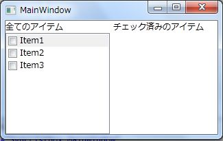
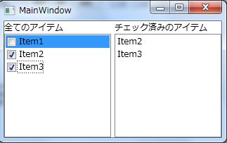

# 1つのコレクションをCollectionViewSourceを使って2つのListBoxに異なる内容を表示する方法
## Requires
- Visual Studio 2010
## License
- Apache License, Version 2.0
## Technologies
- WPF
## Topics
- WPF アプリケーション
## Updated
- 10/22/2011
## Description

<h1>概要</h1>

CollectionViewSourceを使って同じデータ(ObservableCollection&lt;T&gt;)を異なる条件でフィルタリングして表示する方法を示します。

このサンプルプログラムは下記の要件を満たすように作成しています。

<ol>
<li>画面の左半分にCheckBoxが表示されたListBoxがある </li><li>画面の右半分に、左半分でチェックされた項目のみ表示するListBoxがある </li><li>画面の右半分のListBoxに表示する要素が無いときにはListBox自体を表示しない </li><li>画面の左半分と右半分にそれぞれ存在するListBoxに表示するデータは、同一のコレクションを元にしている </li></ol>
<h2>サンプルプログラムの実行例</h2>

実行直後 
画面右半分にListBoxは表示されていません。 
&nbsp;

チェックボックスにチェックを入れた後 
画面右半分にListBoxが表示され、チェックされた項目が表示されます。 
&nbsp;

CollectionViewSourceの概要

CollectionViewSourceは、もとになるコレクションを操作することなく、フィルタリングやグルーピング機能を提供するクラスです。CollectionViewSourceクラスのSourceプロパティに設定されたコレクションを元に、CollectionViewSourceに指定された並び替え条件やフィルタリングの条件を適用した結果をICollectionView型のViewプロパティが表しています。

また、Sourceに指定されたコレクションがINotifyCollectionChangedインターフェースを実装している場合はSourceのコレクションの変更に対してViewプロパティのICollectionViewも同期して内容が更新されます。

このCollectionViewSourceから取得できるICollectionViewをListBoxなどのItemsControl系のコントロールにバインドすることで同一のコレクションにたいして異なる条件でのフィルタリングやグルーピングを実現できます。

<h1>サンプルプログラムの内容</h1>

このサンプルプログラムで使われてる主なクラスを以下に示します。

<ol>
<li>Itemクラス 
ListBoxに表示するクラス。表示用の文字列を持つLabelプロパティとチェック状態を持つCheckedプロパティを定義しています。 </li><li>MainPageViewModelクラス 
Itemクラスのコレクションと、コレクション内の全ての項目を持つICollectionView型のAllItemsプロパティとチェック済みの項目のみを持つICollectionView型のCheckedItemsプロパティを定義しています。また、チェックされた項目が１つ以上あるかどうかを表すHaveCheckedItemプロパティも定義しています。
</li></ol>

このサンプルプログラムの主な処理を行っている箇所のコードを抜粋します。

&nbsp;

C#

スクリプトの編集|Remove

csharp
<pre class="hidden">// テスト用のデータ作成
this.Items = new ObservableCollection&lt;Item&gt;
{
    new Item { Label = &quot;Item1&quot; },
    new Item { Label = &quot;Item2&quot; },
    new Item { Label = &quot;Item3&quot; }
};

foreach (var item in this.Items)
{
    // Checkedの状態が変更したタイミングでCheckedItemの表示の更新と
    // HaveCheckedItemの状態を更新する。
    item.PropertyChanged &#43;= (s, e) =&gt;
    {
        if (e.PropertyName != &quot;Checked&quot;)
        {
            return;
        }

        this.CheckedItems.Refresh();
        this.HaveCheckedItem = !this.CheckedItems.IsEmpty;
    };
}

// 全てのアイテムを表示するViewSourceを作成
this.allItemsSource = new CollectionViewSource
{
    Source = this.Items
};

// Checkedがtrueの項目だけ表示するViewSourceを作成
this.checkedItemsSource = new CollectionViewSource
{
    Source = this.Items
};
this.checkedItemsSource.Filter &#43;= (s, e) =&gt;
{
    var item = e.Item as Item;
    e.Accepted = item.Checked;
};
</pre>

<pre class="js">//&nbsp;テスト用のデータ作成&nbsp;
this.Items&nbsp;=&nbsp;new&nbsp;ObservableCollection&lt;Item&gt;&nbsp;
{&nbsp;
&nbsp;&nbsp;&nbsp;&nbsp;new&nbsp;Item&nbsp;{&nbsp;Label&nbsp;=&nbsp;&quot;Item1&quot;&nbsp;},&nbsp;
&nbsp;&nbsp;&nbsp;&nbsp;new&nbsp;Item&nbsp;{&nbsp;Label&nbsp;=&nbsp;&quot;Item2&quot;&nbsp;},&nbsp;
&nbsp;&nbsp;&nbsp;&nbsp;new&nbsp;Item&nbsp;{&nbsp;Label&nbsp;=&nbsp;&quot;Item3&quot;&nbsp;}&nbsp;
};&nbsp;
&nbsp;
foreach&nbsp;(var&nbsp;item&nbsp;in&nbsp;this.Items)&nbsp;
{&nbsp;
&nbsp;&nbsp;&nbsp;&nbsp;//&nbsp;Checkedの状態が変更したタイミングでCheckedItemの表示の更新と&nbsp;
&nbsp;&nbsp;&nbsp;&nbsp;//&nbsp;HaveCheckedItemの状態を更新する。&nbsp;
&nbsp;&nbsp;&nbsp;&nbsp;item.PropertyChanged&nbsp;&#43;=&nbsp;(s,&nbsp;e)&nbsp;=&gt;&nbsp;
&nbsp;&nbsp;&nbsp;&nbsp;{&nbsp;
&nbsp;&nbsp;&nbsp;&nbsp;&nbsp;&nbsp;&nbsp;&nbsp;if&nbsp;(e.PropertyName&nbsp;!=&nbsp;&quot;Checked&quot;)&nbsp;
&nbsp;&nbsp;&nbsp;&nbsp;&nbsp;&nbsp;&nbsp;&nbsp;{&nbsp;
&nbsp;&nbsp;&nbsp;&nbsp;&nbsp;&nbsp;&nbsp;&nbsp;&nbsp;&nbsp;&nbsp;&nbsp;return;&nbsp;
&nbsp;&nbsp;&nbsp;&nbsp;&nbsp;&nbsp;&nbsp;&nbsp;}&nbsp;
&nbsp;
&nbsp;&nbsp;&nbsp;&nbsp;&nbsp;&nbsp;&nbsp;&nbsp;this.CheckedItems.Refresh();&nbsp;
&nbsp;&nbsp;&nbsp;&nbsp;&nbsp;&nbsp;&nbsp;&nbsp;this.HaveCheckedItem&nbsp;=&nbsp;!this.CheckedItems.IsEmpty;&nbsp;
&nbsp;&nbsp;&nbsp;&nbsp;};&nbsp;
}&nbsp;
&nbsp;
//&nbsp;全てのアイテムを表示するViewSourceを作成&nbsp;
this.allItemsSource&nbsp;=&nbsp;new&nbsp;CollectionViewSource&nbsp;
{&nbsp;
&nbsp;&nbsp;&nbsp;&nbsp;Source&nbsp;=&nbsp;this.Items&nbsp;
};&nbsp;
&nbsp;
//&nbsp;Checkedがtrueの項目だけ表示するViewSourceを作成&nbsp;
this.checkedItemsSource&nbsp;=&nbsp;new&nbsp;CollectionViewSource&nbsp;
{&nbsp;
&nbsp;&nbsp;&nbsp;&nbsp;Source&nbsp;=&nbsp;this.Items&nbsp;
};&nbsp;
this.checkedItemsSource.Filter&nbsp;&#43;=&nbsp;(s,&nbsp;e)&nbsp;=&gt;&nbsp;
{&nbsp;
&nbsp;&nbsp;&nbsp;&nbsp;var&nbsp;item&nbsp;=&nbsp;e.Item&nbsp;as&nbsp;Item;&nbsp;
&nbsp;&nbsp;&nbsp;&nbsp;e.Accepted&nbsp;=&nbsp;item.Checked;&nbsp;
};&nbsp;
</pre>

ItemのCheckedプロパティが変更されたタイミングでCheckedItemsのリフレッシュとチェックされた項目が存在するか確認をしています。そして、XAMLでHaveCheckedItemの値を画面右半分に表示されているListBoxのVisibilityプロパティとバインドしています。バインドの際にbool型からVisibility型に変換するConverterをはさむことで型のミスマッチを解決しています。

XAML

スクリプトの編集|Remove

xaml
<pre class="hidden">&lt;ListBox  
    Grid.Row=&quot;1&quot; 
    Grid.Column=&quot;2&quot; 
    ItemsSource=&quot;{Binding Path=CheckedItems}&quot; 
    Visibility=&quot;{Binding Path=HaveCheckedItem, Converter={StaticResource BooleanToVisibilityConverter}}&quot;&gt;
    &lt;ListBox.ItemTemplate&gt;
        &lt;DataTemplate DataType=&quot;l:Item&quot;&gt;
            &lt;TextBlock Text=&quot;{Binding Label}&quot;/&gt;
        &lt;/DataTemplate&gt;
    &lt;/ListBox.ItemTemplate&gt;
&lt;/ListBox&gt;
</pre>

<pre class="xaml">&lt;ListBox&nbsp;&nbsp;&nbsp;
&nbsp;&nbsp;&nbsp;&nbsp;Grid.Row=&quot;1&quot;&nbsp;&nbsp;
&nbsp;&nbsp;&nbsp;&nbsp;Grid.Column=&quot;2&quot;&nbsp;&nbsp;
&nbsp;&nbsp;&nbsp;&nbsp;ItemsSource=&quot;{Binding&nbsp;Path=CheckedItems}&quot;&nbsp;&nbsp;
&nbsp;&nbsp;&nbsp;&nbsp;Visibility=&quot;{Binding&nbsp;Path=HaveCheckedItem,&nbsp;Converter={StaticResource&nbsp;BooleanToVisibilityConverter}}&quot;&gt;&nbsp;
&nbsp;&nbsp;&nbsp;&nbsp;&lt;ListBox.ItemTemplate&gt;&nbsp;
&nbsp;&nbsp;&nbsp;&nbsp;&nbsp;&nbsp;&nbsp;&nbsp;&lt;DataTemplate&nbsp;DataType=&quot;l:Item&quot;&gt;&nbsp;
&nbsp;&nbsp;&nbsp;&nbsp;&nbsp;&nbsp;&nbsp;&nbsp;&nbsp;&nbsp;&nbsp;&nbsp;&lt;TextBlock&nbsp;Text=&quot;{Binding&nbsp;Label}&quot;/&gt;&nbsp;
&nbsp;&nbsp;&nbsp;&nbsp;&nbsp;&nbsp;&nbsp;&nbsp;&lt;/DataTemplate&gt;&nbsp;
&nbsp;&nbsp;&nbsp;&nbsp;&lt;/ListBox.ItemTemplate&gt;&nbsp;
&lt;/ListBox&gt;&nbsp;
</pre>

以上でコードの主要部分の解説は終了です。実際にコードサンプルをダウンロードして動作を確認してみてください。

<h1 class="endscriptcode">注意事項</h1>

この方法は、1項目がチェックされる度に全ての項目をリフレッシュしなおしたり、全項目を走査してチェック済みの項目の存在確認をしています。この方法は実装が簡単ですが、件数が増えるとパフォーマンスが劣化すると考えられます。要素数が多い場合は、CollectionViewSourceを使用するのではなく、自前で同様のフィルタリング処理を行うカスタムクラスを作成したり、チェックの状態が変更されるタイミングで全走査しなくても良いようにチェック項目数を管理するなどの工夫が必要になります。

