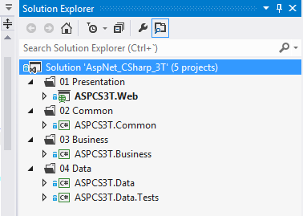

# 3 Tier ASP.NET C# ADO
## Requires
- Visual Studio 2012
## License
- Apache License, Version 2.0
## Technologies
- C#
- ASP.NET
- ADO.NET
## Topics
- 3 Tier Architecture
## Updated
- 06/05/2014
## Description

<h3>Description</h3>

<strong>3 Tier Structure</strong>

In&nbsp;software engineering,&nbsp;multi-tier architecture&nbsp;(often referred to as&nbsp;n-tier architecture) is a&nbsp;client&ndash;server architecture&nbsp;in which presentation, application processing, and data management
 functions are physically separated. The most widespread use of multi-tier architecture is the&nbsp;three-tier architecture.

Three-tier architecture is a client&ndash;server architecture in which the&nbsp;user interface&nbsp;(presentation),&nbsp;functional process logic&nbsp;(&quot;business rules&quot;),&nbsp;computer data storage&nbsp;and&nbsp;data access&nbsp;are
 developed and maintained as independent&nbsp;modules, most often on separate&nbsp;platforms.&nbsp;It was developed by&nbsp;<a title="John J. Donovan" href="http://en.wikipedia.org/wiki/John_J._Donovan">John J. Donovan</a>&nbsp;in Open Environment Corporation
 (OEC), a tools company he founded in&nbsp;Cambridge, Massachusetts.

Three-tier architecture:

<dl><dt><strong>Presentation tier</strong></dt><dt><strong>&nbsp;</strong>This is the topmost level of the application. The presentation tier displays information related to such services as browsing merchandise, purchasing and shopping cart contents. It communicates with other tiers by which it puts out
 the results to the browser/client tier and all other tiers in the network. (In simple terms it is a layer which users can access directly such as a web page, or an operating systems GUI)</dt><dd> 
</dd><dt><strong>Application tier</strong> (business logic, logic tier, or middle tier)</dt><dt>The logical tier is pulled out from the presentation tier and, as its own layer, it controls an application&rsquo;s functionality by performing detailed processing.</dt><dd> 
</dd><dt><strong>Data tier</strong></dt><dt>The data tier includes the data persistence mechanisms (database servers, file shares, etc.) and the data access layer that encapsulates the persistence mechanisms and exposes the data. The data access layer should provide an&nbsp;Application Programming
 Interface (API)&nbsp;to the application tier that exposes methods of managing the stored data without exposing or creating dependencies on the data storage mechanisms. Avoiding dependencies on the storage mechanisms allows for updates or changes without the
 application tier clients being affected by or even aware of the change. As with the separation of any tier, there are costs for implementation and often costs to performance in exchange for improved scalability and maintainability.</dt><dt> 
</dt><dt> 
</dt><dt> 
</dt><dt> 
</dt><dt> 
</dt><dt><strong style="font-size:small; text-decoration:underline">Solution Structure</strong></dt></dl>

&nbsp;

<ul>
<li>
<address><strong>01 Presentation</strong> - Project Type: ASP.NET Web Application -&nbsp;Business Layer consumer</address>
</li><li>
<address>02 Common - Crosscutting layer</address>
</li><li>
<address><strong>03 Business</strong> - Data Access Layer consumer</address>
</li><li>
<address><strong>04 Data</strong> - Data Access Layer</address>
</li></ul>

&nbsp;

---------------------------------------------------

<strong>Data Access Layer</strong>

&quot;Database.cs&quot;

C#

Edit|Remove

csharp
<pre class="hidden">namespace ASPCS3T.Data
{
    using System.Configuration;
    using System.Data;
    using System.Data.SqlClient;

    public class Database
    {
        public static SqlConnection GetConnection()
        {
            return new SqlConnection(ConfigurationManager.ConnectionStrings[&quot;ASPCS3T&quot;].ConnectionString);
        }
    }
}</pre>

<pre class="csharp">namespace&nbsp;ASPCS3T.Data&nbsp;
{&nbsp;
&nbsp;&nbsp;&nbsp;&nbsp;using&nbsp;System.Configuration;&nbsp;
&nbsp;&nbsp;&nbsp;&nbsp;using&nbsp;System.Data;&nbsp;
&nbsp;&nbsp;&nbsp;&nbsp;using&nbsp;System.Data.SqlClient;&nbsp;
&nbsp;
&nbsp;&nbsp;&nbsp;&nbsp;public&nbsp;class&nbsp;Database&nbsp;
&nbsp;&nbsp;&nbsp;&nbsp;{&nbsp;
&nbsp;&nbsp;&nbsp;&nbsp;&nbsp;&nbsp;&nbsp;&nbsp;public&nbsp;static&nbsp;SqlConnection&nbsp;GetConnection()&nbsp;
&nbsp;&nbsp;&nbsp;&nbsp;&nbsp;&nbsp;&nbsp;&nbsp;{&nbsp;
&nbsp;&nbsp;&nbsp;&nbsp;&nbsp;&nbsp;&nbsp;&nbsp;&nbsp;&nbsp;&nbsp;&nbsp;return&nbsp;new&nbsp;SqlConnection(ConfigurationManager.ConnectionStrings[&quot;ASPCS3T&quot;].ConnectionString);&nbsp;
&nbsp;&nbsp;&nbsp;&nbsp;&nbsp;&nbsp;&nbsp;&nbsp;}&nbsp;
&nbsp;&nbsp;&nbsp;&nbsp;}&nbsp;
}</pre>

&nbsp;&quot;ProductData.cs&quot;

C#

Edit|Remove

csharp
<pre class="hidden">namespace ASPCS3T.Data
{
    using ASPCS3T.Common;
    using System;
    using System.Data.SqlClient;
    using System.Collections.Generic;
    using System.Linq;
    using System.Text;

    public class ProductData
    {
        public List&lt;Product&gt; GetAll()
        {
            var productList = new List&lt;Product&gt;();

            using (var connection = Database.GetConnection())
            {
                var command = new SqlCommand(&quot;sp_Product_GetAll&quot;, connection);                
                
                connection.Open();

                using (var reader = command.ExecuteReader())
                {
                    while (reader.Read())
                    {
                        var product = new Product(
                            reader.GetInt32(0), 
                            reader.GetString(1), 
                            reader.GetDecimal(2), 
                            reader.GetInt32(3));
                        
                        productList.Add(product);
                    }
                }

                connection.Close();
            }

            return productList;
        }

        public Product Get(int id)
        {
            Product product = null;

            using (var connection = Database.GetConnection())
            {
                var command = new SqlCommand(&quot;sp_Product_Get @id&quot;, connection);
                
                command.Parameters.Add(new SqlParameter(&quot;id&quot;, id));

                connection.Open();

                using (var reader = command.ExecuteReader())
                {
                    if (reader.Read())
                    {
                        product = new Product(
                        reader.GetInt32(0),
                        reader.GetString(1),
                        reader.GetDecimal(2),
                        reader.GetInt32(3));
                    }                    
                }

                connection.Close();
            }

            return product;
        }

        public void Save(Product product)
        {
            using (var connection = Database.GetConnection())
            {
                var command = new SqlCommand(&quot;sp_Product_Insert @name, @price, @stock&quot;, connection);

                command.Parameters.Add(new SqlParameter(&quot;name&quot;, product.Name));
                command.Parameters.Add(new SqlParameter(&quot;price&quot;, product.Price));
                command.Parameters.Add(new SqlParameter(&quot;stock&quot;, product.stock));

                connection.Open();

                command.ExecuteNonQuery();

                connection.Close();
            }
        }

        public void Delete(int id)
        {
            using (var connection = Database.GetConnection())
            {
                var command = new SqlCommand(&quot;sp_Product_Delete @id&quot;, connection);

                command.Parameters.Add(new SqlParameter(&quot;id&quot;, id));

                connection.Open();

                command.ExecuteNonQuery();

                connection.Close();
            }
        }
    }
}</pre>

<pre class="csharp">namespace&nbsp;ASPCS3T.Data&nbsp;
{&nbsp;
&nbsp;&nbsp;&nbsp;&nbsp;using&nbsp;ASPCS3T.Common;&nbsp;
&nbsp;&nbsp;&nbsp;&nbsp;using&nbsp;System;&nbsp;
&nbsp;&nbsp;&nbsp;&nbsp;using&nbsp;System.Data.SqlClient;&nbsp;
&nbsp;&nbsp;&nbsp;&nbsp;using&nbsp;System.Collections.Generic;&nbsp;
&nbsp;&nbsp;&nbsp;&nbsp;using&nbsp;System.Linq;&nbsp;
&nbsp;&nbsp;&nbsp;&nbsp;using&nbsp;System.Text;&nbsp;
&nbsp;
&nbsp;&nbsp;&nbsp;&nbsp;public&nbsp;class&nbsp;ProductData&nbsp;
&nbsp;&nbsp;&nbsp;&nbsp;{&nbsp;
&nbsp;&nbsp;&nbsp;&nbsp;&nbsp;&nbsp;&nbsp;&nbsp;public&nbsp;List&lt;Product&gt;&nbsp;GetAll()&nbsp;
&nbsp;&nbsp;&nbsp;&nbsp;&nbsp;&nbsp;&nbsp;&nbsp;{&nbsp;
&nbsp;&nbsp;&nbsp;&nbsp;&nbsp;&nbsp;&nbsp;&nbsp;&nbsp;&nbsp;&nbsp;&nbsp;var&nbsp;productList&nbsp;=&nbsp;new&nbsp;List&lt;Product&gt;();&nbsp;
&nbsp;
&nbsp;&nbsp;&nbsp;&nbsp;&nbsp;&nbsp;&nbsp;&nbsp;&nbsp;&nbsp;&nbsp;&nbsp;using&nbsp;(var&nbsp;connection&nbsp;=&nbsp;Database.GetConnection())&nbsp;
&nbsp;&nbsp;&nbsp;&nbsp;&nbsp;&nbsp;&nbsp;&nbsp;&nbsp;&nbsp;&nbsp;&nbsp;{&nbsp;
&nbsp;&nbsp;&nbsp;&nbsp;&nbsp;&nbsp;&nbsp;&nbsp;&nbsp;&nbsp;&nbsp;&nbsp;&nbsp;&nbsp;&nbsp;&nbsp;var&nbsp;command&nbsp;=&nbsp;new&nbsp;SqlCommand(&quot;sp_Product_GetAll&quot;,&nbsp;connection);&nbsp;&nbsp;&nbsp;&nbsp;&nbsp;&nbsp;&nbsp;&nbsp;&nbsp;&nbsp;&nbsp;&nbsp;&nbsp;&nbsp;&nbsp;&nbsp;&nbsp;
&nbsp;&nbsp;&nbsp;&nbsp;&nbsp;&nbsp;&nbsp;&nbsp;&nbsp;&nbsp;&nbsp;&nbsp;&nbsp;&nbsp;&nbsp;&nbsp;&nbsp;
&nbsp;&nbsp;&nbsp;&nbsp;&nbsp;&nbsp;&nbsp;&nbsp;&nbsp;&nbsp;&nbsp;&nbsp;&nbsp;&nbsp;&nbsp;&nbsp;connection.Open();&nbsp;
&nbsp;
&nbsp;&nbsp;&nbsp;&nbsp;&nbsp;&nbsp;&nbsp;&nbsp;&nbsp;&nbsp;&nbsp;&nbsp;&nbsp;&nbsp;&nbsp;&nbsp;using&nbsp;(var&nbsp;reader&nbsp;=&nbsp;command.ExecuteReader())&nbsp;
&nbsp;&nbsp;&nbsp;&nbsp;&nbsp;&nbsp;&nbsp;&nbsp;&nbsp;&nbsp;&nbsp;&nbsp;&nbsp;&nbsp;&nbsp;&nbsp;{&nbsp;
&nbsp;&nbsp;&nbsp;&nbsp;&nbsp;&nbsp;&nbsp;&nbsp;&nbsp;&nbsp;&nbsp;&nbsp;&nbsp;&nbsp;&nbsp;&nbsp;&nbsp;&nbsp;&nbsp;&nbsp;while&nbsp;(reader.Read())&nbsp;
&nbsp;&nbsp;&nbsp;&nbsp;&nbsp;&nbsp;&nbsp;&nbsp;&nbsp;&nbsp;&nbsp;&nbsp;&nbsp;&nbsp;&nbsp;&nbsp;&nbsp;&nbsp;&nbsp;&nbsp;{&nbsp;
&nbsp;&nbsp;&nbsp;&nbsp;&nbsp;&nbsp;&nbsp;&nbsp;&nbsp;&nbsp;&nbsp;&nbsp;&nbsp;&nbsp;&nbsp;&nbsp;&nbsp;&nbsp;&nbsp;&nbsp;&nbsp;&nbsp;&nbsp;&nbsp;var&nbsp;product&nbsp;=&nbsp;new&nbsp;Product(&nbsp;
&nbsp;&nbsp;&nbsp;&nbsp;&nbsp;&nbsp;&nbsp;&nbsp;&nbsp;&nbsp;&nbsp;&nbsp;&nbsp;&nbsp;&nbsp;&nbsp;&nbsp;&nbsp;&nbsp;&nbsp;&nbsp;&nbsp;&nbsp;&nbsp;&nbsp;&nbsp;&nbsp;&nbsp;reader.GetInt32(0),&nbsp;&nbsp;
&nbsp;&nbsp;&nbsp;&nbsp;&nbsp;&nbsp;&nbsp;&nbsp;&nbsp;&nbsp;&nbsp;&nbsp;&nbsp;&nbsp;&nbsp;&nbsp;&nbsp;&nbsp;&nbsp;&nbsp;&nbsp;&nbsp;&nbsp;&nbsp;&nbsp;&nbsp;&nbsp;&nbsp;reader.GetString(1),&nbsp;&nbsp;
&nbsp;&nbsp;&nbsp;&nbsp;&nbsp;&nbsp;&nbsp;&nbsp;&nbsp;&nbsp;&nbsp;&nbsp;&nbsp;&nbsp;&nbsp;&nbsp;&nbsp;&nbsp;&nbsp;&nbsp;&nbsp;&nbsp;&nbsp;&nbsp;&nbsp;&nbsp;&nbsp;&nbsp;reader.GetDecimal(2),&nbsp;&nbsp;
&nbsp;&nbsp;&nbsp;&nbsp;&nbsp;&nbsp;&nbsp;&nbsp;&nbsp;&nbsp;&nbsp;&nbsp;&nbsp;&nbsp;&nbsp;&nbsp;&nbsp;&nbsp;&nbsp;&nbsp;&nbsp;&nbsp;&nbsp;&nbsp;&nbsp;&nbsp;&nbsp;&nbsp;reader.GetInt32(3));&nbsp;
&nbsp;&nbsp;&nbsp;&nbsp;&nbsp;&nbsp;&nbsp;&nbsp;&nbsp;&nbsp;&nbsp;&nbsp;&nbsp;&nbsp;&nbsp;&nbsp;&nbsp;&nbsp;&nbsp;&nbsp;&nbsp;&nbsp;&nbsp;&nbsp;&nbsp;
&nbsp;&nbsp;&nbsp;&nbsp;&nbsp;&nbsp;&nbsp;&nbsp;&nbsp;&nbsp;&nbsp;&nbsp;&nbsp;&nbsp;&nbsp;&nbsp;&nbsp;&nbsp;&nbsp;&nbsp;&nbsp;&nbsp;&nbsp;&nbsp;productList.Add(product);&nbsp;
&nbsp;&nbsp;&nbsp;&nbsp;&nbsp;&nbsp;&nbsp;&nbsp;&nbsp;&nbsp;&nbsp;&nbsp;&nbsp;&nbsp;&nbsp;&nbsp;&nbsp;&nbsp;&nbsp;&nbsp;}&nbsp;
&nbsp;&nbsp;&nbsp;&nbsp;&nbsp;&nbsp;&nbsp;&nbsp;&nbsp;&nbsp;&nbsp;&nbsp;&nbsp;&nbsp;&nbsp;&nbsp;}&nbsp;
&nbsp;
&nbsp;&nbsp;&nbsp;&nbsp;&nbsp;&nbsp;&nbsp;&nbsp;&nbsp;&nbsp;&nbsp;&nbsp;&nbsp;&nbsp;&nbsp;&nbsp;connection.Close();&nbsp;
&nbsp;&nbsp;&nbsp;&nbsp;&nbsp;&nbsp;&nbsp;&nbsp;&nbsp;&nbsp;&nbsp;&nbsp;}&nbsp;
&nbsp;
&nbsp;&nbsp;&nbsp;&nbsp;&nbsp;&nbsp;&nbsp;&nbsp;&nbsp;&nbsp;&nbsp;&nbsp;return&nbsp;productList;&nbsp;
&nbsp;&nbsp;&nbsp;&nbsp;&nbsp;&nbsp;&nbsp;&nbsp;}&nbsp;
&nbsp;
&nbsp;&nbsp;&nbsp;&nbsp;&nbsp;&nbsp;&nbsp;&nbsp;public&nbsp;Product&nbsp;Get(int&nbsp;id)&nbsp;
&nbsp;&nbsp;&nbsp;&nbsp;&nbsp;&nbsp;&nbsp;&nbsp;{&nbsp;
&nbsp;&nbsp;&nbsp;&nbsp;&nbsp;&nbsp;&nbsp;&nbsp;&nbsp;&nbsp;&nbsp;&nbsp;Product&nbsp;product&nbsp;=&nbsp;null;&nbsp;
&nbsp;
&nbsp;&nbsp;&nbsp;&nbsp;&nbsp;&nbsp;&nbsp;&nbsp;&nbsp;&nbsp;&nbsp;&nbsp;using&nbsp;(var&nbsp;connection&nbsp;=&nbsp;Database.GetConnection())&nbsp;
&nbsp;&nbsp;&nbsp;&nbsp;&nbsp;&nbsp;&nbsp;&nbsp;&nbsp;&nbsp;&nbsp;&nbsp;{&nbsp;
&nbsp;&nbsp;&nbsp;&nbsp;&nbsp;&nbsp;&nbsp;&nbsp;&nbsp;&nbsp;&nbsp;&nbsp;&nbsp;&nbsp;&nbsp;&nbsp;var&nbsp;command&nbsp;=&nbsp;new&nbsp;SqlCommand(&quot;sp_Product_Get&nbsp;@id&quot;,&nbsp;connection);&nbsp;
&nbsp;&nbsp;&nbsp;&nbsp;&nbsp;&nbsp;&nbsp;&nbsp;&nbsp;&nbsp;&nbsp;&nbsp;&nbsp;&nbsp;&nbsp;&nbsp;&nbsp;
&nbsp;&nbsp;&nbsp;&nbsp;&nbsp;&nbsp;&nbsp;&nbsp;&nbsp;&nbsp;&nbsp;&nbsp;&nbsp;&nbsp;&nbsp;&nbsp;command.Parameters.Add(new&nbsp;SqlParameter(&quot;id&quot;,&nbsp;id));&nbsp;
&nbsp;
&nbsp;&nbsp;&nbsp;&nbsp;&nbsp;&nbsp;&nbsp;&nbsp;&nbsp;&nbsp;&nbsp;&nbsp;&nbsp;&nbsp;&nbsp;&nbsp;connection.Open();&nbsp;
&nbsp;
&nbsp;&nbsp;&nbsp;&nbsp;&nbsp;&nbsp;&nbsp;&nbsp;&nbsp;&nbsp;&nbsp;&nbsp;&nbsp;&nbsp;&nbsp;&nbsp;using&nbsp;(var&nbsp;reader&nbsp;=&nbsp;command.ExecuteReader())&nbsp;
&nbsp;&nbsp;&nbsp;&nbsp;&nbsp;&nbsp;&nbsp;&nbsp;&nbsp;&nbsp;&nbsp;&nbsp;&nbsp;&nbsp;&nbsp;&nbsp;{&nbsp;
&nbsp;&nbsp;&nbsp;&nbsp;&nbsp;&nbsp;&nbsp;&nbsp;&nbsp;&nbsp;&nbsp;&nbsp;&nbsp;&nbsp;&nbsp;&nbsp;&nbsp;&nbsp;&nbsp;&nbsp;if&nbsp;(reader.Read())&nbsp;
&nbsp;&nbsp;&nbsp;&nbsp;&nbsp;&nbsp;&nbsp;&nbsp;&nbsp;&nbsp;&nbsp;&nbsp;&nbsp;&nbsp;&nbsp;&nbsp;&nbsp;&nbsp;&nbsp;&nbsp;{&nbsp;
&nbsp;&nbsp;&nbsp;&nbsp;&nbsp;&nbsp;&nbsp;&nbsp;&nbsp;&nbsp;&nbsp;&nbsp;&nbsp;&nbsp;&nbsp;&nbsp;&nbsp;&nbsp;&nbsp;&nbsp;&nbsp;&nbsp;&nbsp;&nbsp;product&nbsp;=&nbsp;new&nbsp;Product(&nbsp;
&nbsp;&nbsp;&nbsp;&nbsp;&nbsp;&nbsp;&nbsp;&nbsp;&nbsp;&nbsp;&nbsp;&nbsp;&nbsp;&nbsp;&nbsp;&nbsp;&nbsp;&nbsp;&nbsp;&nbsp;&nbsp;&nbsp;&nbsp;&nbsp;reader.GetInt32(0),&nbsp;
&nbsp;&nbsp;&nbsp;&nbsp;&nbsp;&nbsp;&nbsp;&nbsp;&nbsp;&nbsp;&nbsp;&nbsp;&nbsp;&nbsp;&nbsp;&nbsp;&nbsp;&nbsp;&nbsp;&nbsp;&nbsp;&nbsp;&nbsp;&nbsp;reader.GetString(1),&nbsp;
&nbsp;&nbsp;&nbsp;&nbsp;&nbsp;&nbsp;&nbsp;&nbsp;&nbsp;&nbsp;&nbsp;&nbsp;&nbsp;&nbsp;&nbsp;&nbsp;&nbsp;&nbsp;&nbsp;&nbsp;&nbsp;&nbsp;&nbsp;&nbsp;reader.GetDecimal(2),&nbsp;
&nbsp;&nbsp;&nbsp;&nbsp;&nbsp;&nbsp;&nbsp;&nbsp;&nbsp;&nbsp;&nbsp;&nbsp;&nbsp;&nbsp;&nbsp;&nbsp;&nbsp;&nbsp;&nbsp;&nbsp;&nbsp;&nbsp;&nbsp;&nbsp;reader.GetInt32(3));&nbsp;
&nbsp;&nbsp;&nbsp;&nbsp;&nbsp;&nbsp;&nbsp;&nbsp;&nbsp;&nbsp;&nbsp;&nbsp;&nbsp;&nbsp;&nbsp;&nbsp;&nbsp;&nbsp;&nbsp;&nbsp;}&nbsp;&nbsp;&nbsp;&nbsp;&nbsp;&nbsp;&nbsp;&nbsp;&nbsp;&nbsp;&nbsp;&nbsp;&nbsp;&nbsp;&nbsp;&nbsp;&nbsp;&nbsp;&nbsp;&nbsp;&nbsp;
&nbsp;&nbsp;&nbsp;&nbsp;&nbsp;&nbsp;&nbsp;&nbsp;&nbsp;&nbsp;&nbsp;&nbsp;&nbsp;&nbsp;&nbsp;&nbsp;}&nbsp;
&nbsp;
&nbsp;&nbsp;&nbsp;&nbsp;&nbsp;&nbsp;&nbsp;&nbsp;&nbsp;&nbsp;&nbsp;&nbsp;&nbsp;&nbsp;&nbsp;&nbsp;connection.Close();&nbsp;
&nbsp;&nbsp;&nbsp;&nbsp;&nbsp;&nbsp;&nbsp;&nbsp;&nbsp;&nbsp;&nbsp;&nbsp;}&nbsp;
&nbsp;
&nbsp;&nbsp;&nbsp;&nbsp;&nbsp;&nbsp;&nbsp;&nbsp;&nbsp;&nbsp;&nbsp;&nbsp;return&nbsp;product;&nbsp;
&nbsp;&nbsp;&nbsp;&nbsp;&nbsp;&nbsp;&nbsp;&nbsp;}&nbsp;
&nbsp;
&nbsp;&nbsp;&nbsp;&nbsp;&nbsp;&nbsp;&nbsp;&nbsp;public&nbsp;void&nbsp;Save(Product&nbsp;product)&nbsp;
&nbsp;&nbsp;&nbsp;&nbsp;&nbsp;&nbsp;&nbsp;&nbsp;{&nbsp;
&nbsp;&nbsp;&nbsp;&nbsp;&nbsp;&nbsp;&nbsp;&nbsp;&nbsp;&nbsp;&nbsp;&nbsp;using&nbsp;(var&nbsp;connection&nbsp;=&nbsp;Database.GetConnection())&nbsp;
&nbsp;&nbsp;&nbsp;&nbsp;&nbsp;&nbsp;&nbsp;&nbsp;&nbsp;&nbsp;&nbsp;&nbsp;{&nbsp;
&nbsp;&nbsp;&nbsp;&nbsp;&nbsp;&nbsp;&nbsp;&nbsp;&nbsp;&nbsp;&nbsp;&nbsp;&nbsp;&nbsp;&nbsp;&nbsp;var&nbsp;command&nbsp;=&nbsp;new&nbsp;SqlCommand(&quot;sp_Product_Insert&nbsp;@name,&nbsp;@price,&nbsp;@stock&quot;,&nbsp;connection);&nbsp;
&nbsp;
&nbsp;&nbsp;&nbsp;&nbsp;&nbsp;&nbsp;&nbsp;&nbsp;&nbsp;&nbsp;&nbsp;&nbsp;&nbsp;&nbsp;&nbsp;&nbsp;command.Parameters.Add(new&nbsp;SqlParameter(&quot;name&quot;,&nbsp;product.Name));&nbsp;
&nbsp;&nbsp;&nbsp;&nbsp;&nbsp;&nbsp;&nbsp;&nbsp;&nbsp;&nbsp;&nbsp;&nbsp;&nbsp;&nbsp;&nbsp;&nbsp;command.Parameters.Add(new&nbsp;SqlParameter(&quot;price&quot;,&nbsp;product.Price));&nbsp;
&nbsp;&nbsp;&nbsp;&nbsp;&nbsp;&nbsp;&nbsp;&nbsp;&nbsp;&nbsp;&nbsp;&nbsp;&nbsp;&nbsp;&nbsp;&nbsp;command.Parameters.Add(new&nbsp;SqlParameter(&quot;stock&quot;,&nbsp;product.stock));&nbsp;
&nbsp;
&nbsp;&nbsp;&nbsp;&nbsp;&nbsp;&nbsp;&nbsp;&nbsp;&nbsp;&nbsp;&nbsp;&nbsp;&nbsp;&nbsp;&nbsp;&nbsp;connection.Open();&nbsp;
&nbsp;
&nbsp;&nbsp;&nbsp;&nbsp;&nbsp;&nbsp;&nbsp;&nbsp;&nbsp;&nbsp;&nbsp;&nbsp;&nbsp;&nbsp;&nbsp;&nbsp;command.ExecuteNonQuery();&nbsp;
&nbsp;
&nbsp;&nbsp;&nbsp;&nbsp;&nbsp;&nbsp;&nbsp;&nbsp;&nbsp;&nbsp;&nbsp;&nbsp;&nbsp;&nbsp;&nbsp;&nbsp;connection.Close();&nbsp;
&nbsp;&nbsp;&nbsp;&nbsp;&nbsp;&nbsp;&nbsp;&nbsp;&nbsp;&nbsp;&nbsp;&nbsp;}&nbsp;
&nbsp;&nbsp;&nbsp;&nbsp;&nbsp;&nbsp;&nbsp;&nbsp;}&nbsp;
&nbsp;
&nbsp;&nbsp;&nbsp;&nbsp;&nbsp;&nbsp;&nbsp;&nbsp;public&nbsp;void&nbsp;Delete(int&nbsp;id)&nbsp;
&nbsp;&nbsp;&nbsp;&nbsp;&nbsp;&nbsp;&nbsp;&nbsp;{&nbsp;
&nbsp;&nbsp;&nbsp;&nbsp;&nbsp;&nbsp;&nbsp;&nbsp;&nbsp;&nbsp;&nbsp;&nbsp;using&nbsp;(var&nbsp;connection&nbsp;=&nbsp;Database.GetConnection())&nbsp;
&nbsp;&nbsp;&nbsp;&nbsp;&nbsp;&nbsp;&nbsp;&nbsp;&nbsp;&nbsp;&nbsp;&nbsp;{&nbsp;
&nbsp;&nbsp;&nbsp;&nbsp;&nbsp;&nbsp;&nbsp;&nbsp;&nbsp;&nbsp;&nbsp;&nbsp;&nbsp;&nbsp;&nbsp;&nbsp;var&nbsp;command&nbsp;=&nbsp;new&nbsp;SqlCommand(&quot;sp_Product_Delete&nbsp;@id&quot;,&nbsp;connection);&nbsp;
&nbsp;
&nbsp;&nbsp;&nbsp;&nbsp;&nbsp;&nbsp;&nbsp;&nbsp;&nbsp;&nbsp;&nbsp;&nbsp;&nbsp;&nbsp;&nbsp;&nbsp;command.Parameters.Add(new&nbsp;SqlParameter(&quot;id&quot;,&nbsp;id));&nbsp;
&nbsp;
&nbsp;&nbsp;&nbsp;&nbsp;&nbsp;&nbsp;&nbsp;&nbsp;&nbsp;&nbsp;&nbsp;&nbsp;&nbsp;&nbsp;&nbsp;&nbsp;connection.Open();&nbsp;
&nbsp;
&nbsp;&nbsp;&nbsp;&nbsp;&nbsp;&nbsp;&nbsp;&nbsp;&nbsp;&nbsp;&nbsp;&nbsp;&nbsp;&nbsp;&nbsp;&nbsp;command.ExecuteNonQuery();&nbsp;
&nbsp;
&nbsp;&nbsp;&nbsp;&nbsp;&nbsp;&nbsp;&nbsp;&nbsp;&nbsp;&nbsp;&nbsp;&nbsp;&nbsp;&nbsp;&nbsp;&nbsp;connection.Close();&nbsp;
&nbsp;&nbsp;&nbsp;&nbsp;&nbsp;&nbsp;&nbsp;&nbsp;&nbsp;&nbsp;&nbsp;&nbsp;}&nbsp;
&nbsp;&nbsp;&nbsp;&nbsp;&nbsp;&nbsp;&nbsp;&nbsp;}&nbsp;
&nbsp;&nbsp;&nbsp;&nbsp;}&nbsp;
}</pre>

<strong>&nbsp;Business Layer</strong>

<strong> 
</strong>

&quot;ProductBusiness.cs&quot;

C#

Edit|Remove

csharp
<pre class="hidden">namespace ASPCS3T.Business
{
    using System.Collections.Generic;
    using ASPCS3T.Common;
    using ASPCS3T.Data;

    public class ProductBusiness
    {
        private ProductData manager = new ProductData();

        public List&lt;Product&gt; GetAll()
        {
            return this.manager.GetAll();
        }

        public Product Get(int id)
        {
            return this.manager.Get(id);
        }

        public void Save(Product product)
        {
            this.manager.Save(product);
        }

        public void Delete(int id)
        {
            this.manager.Delete(id);
        }
    }
}</pre>

<pre class="csharp">namespace&nbsp;ASPCS3T.Business&nbsp;
{&nbsp;
&nbsp;&nbsp;&nbsp;&nbsp;using&nbsp;System.Collections.Generic;&nbsp;
&nbsp;&nbsp;&nbsp;&nbsp;using&nbsp;ASPCS3T.Common;&nbsp;
&nbsp;&nbsp;&nbsp;&nbsp;using&nbsp;ASPCS3T.Data;&nbsp;
&nbsp;
&nbsp;&nbsp;&nbsp;&nbsp;public&nbsp;class&nbsp;ProductBusiness&nbsp;
&nbsp;&nbsp;&nbsp;&nbsp;{&nbsp;
&nbsp;&nbsp;&nbsp;&nbsp;&nbsp;&nbsp;&nbsp;&nbsp;private&nbsp;ProductData&nbsp;manager&nbsp;=&nbsp;new&nbsp;ProductData();&nbsp;
&nbsp;
&nbsp;&nbsp;&nbsp;&nbsp;&nbsp;&nbsp;&nbsp;&nbsp;public&nbsp;List&lt;Product&gt;&nbsp;GetAll()&nbsp;
&nbsp;&nbsp;&nbsp;&nbsp;&nbsp;&nbsp;&nbsp;&nbsp;{&nbsp;
&nbsp;&nbsp;&nbsp;&nbsp;&nbsp;&nbsp;&nbsp;&nbsp;&nbsp;&nbsp;&nbsp;&nbsp;return&nbsp;this.manager.GetAll();&nbsp;
&nbsp;&nbsp;&nbsp;&nbsp;&nbsp;&nbsp;&nbsp;&nbsp;}&nbsp;
&nbsp;
&nbsp;&nbsp;&nbsp;&nbsp;&nbsp;&nbsp;&nbsp;&nbsp;public&nbsp;Product&nbsp;Get(int&nbsp;id)&nbsp;
&nbsp;&nbsp;&nbsp;&nbsp;&nbsp;&nbsp;&nbsp;&nbsp;{&nbsp;
&nbsp;&nbsp;&nbsp;&nbsp;&nbsp;&nbsp;&nbsp;&nbsp;&nbsp;&nbsp;&nbsp;&nbsp;return&nbsp;this.manager.Get(id);&nbsp;
&nbsp;&nbsp;&nbsp;&nbsp;&nbsp;&nbsp;&nbsp;&nbsp;}&nbsp;
&nbsp;
&nbsp;&nbsp;&nbsp;&nbsp;&nbsp;&nbsp;&nbsp;&nbsp;public&nbsp;void&nbsp;Save(Product&nbsp;product)&nbsp;
&nbsp;&nbsp;&nbsp;&nbsp;&nbsp;&nbsp;&nbsp;&nbsp;{&nbsp;
&nbsp;&nbsp;&nbsp;&nbsp;&nbsp;&nbsp;&nbsp;&nbsp;&nbsp;&nbsp;&nbsp;&nbsp;this.manager.Save(product);&nbsp;
&nbsp;&nbsp;&nbsp;&nbsp;&nbsp;&nbsp;&nbsp;&nbsp;}&nbsp;
&nbsp;
&nbsp;&nbsp;&nbsp;&nbsp;&nbsp;&nbsp;&nbsp;&nbsp;public&nbsp;void&nbsp;Delete(int&nbsp;id)&nbsp;
&nbsp;&nbsp;&nbsp;&nbsp;&nbsp;&nbsp;&nbsp;&nbsp;{&nbsp;
&nbsp;&nbsp;&nbsp;&nbsp;&nbsp;&nbsp;&nbsp;&nbsp;&nbsp;&nbsp;&nbsp;&nbsp;this.manager.Delete(id);&nbsp;
&nbsp;&nbsp;&nbsp;&nbsp;&nbsp;&nbsp;&nbsp;&nbsp;}&nbsp;
&nbsp;&nbsp;&nbsp;&nbsp;}&nbsp;
}</pre>

<strong>&nbsp;Common Layer</strong>

<strong> 
</strong>

&quot;Product.cs&quot;

C#

Edit|Remove

csharp
<pre class="hidden">namespace ASPCS3T.Common
{    
    public class Product
    {
        public int Id { get; set; }
        public string Name { get; set; }
        public decimal Price { get; set; }
        public int stock { get; set; }

        public Product()
        {
        }

        public Product(int id, string name, decimal price, int stock)
        {
            this.Id = id;
            this.Name = name;
            this.Price = price;
            this.stock = stock;
        }
    }
}</pre>

<pre class="csharp">namespace&nbsp;ASPCS3T.Common&nbsp;
{&nbsp;&nbsp;&nbsp;&nbsp;&nbsp;
&nbsp;&nbsp;&nbsp;&nbsp;public&nbsp;class&nbsp;Product&nbsp;
&nbsp;&nbsp;&nbsp;&nbsp;{&nbsp;
&nbsp;&nbsp;&nbsp;&nbsp;&nbsp;&nbsp;&nbsp;&nbsp;public&nbsp;int&nbsp;Id&nbsp;{&nbsp;get;&nbsp;set;&nbsp;}&nbsp;
&nbsp;&nbsp;&nbsp;&nbsp;&nbsp;&nbsp;&nbsp;&nbsp;public&nbsp;string&nbsp;Name&nbsp;{&nbsp;get;&nbsp;set;&nbsp;}&nbsp;
&nbsp;&nbsp;&nbsp;&nbsp;&nbsp;&nbsp;&nbsp;&nbsp;public&nbsp;decimal&nbsp;Price&nbsp;{&nbsp;get;&nbsp;set;&nbsp;}&nbsp;
&nbsp;&nbsp;&nbsp;&nbsp;&nbsp;&nbsp;&nbsp;&nbsp;public&nbsp;int&nbsp;stock&nbsp;{&nbsp;get;&nbsp;set;&nbsp;}&nbsp;
&nbsp;
&nbsp;&nbsp;&nbsp;&nbsp;&nbsp;&nbsp;&nbsp;&nbsp;public&nbsp;Product()&nbsp;
&nbsp;&nbsp;&nbsp;&nbsp;&nbsp;&nbsp;&nbsp;&nbsp;{&nbsp;
&nbsp;&nbsp;&nbsp;&nbsp;&nbsp;&nbsp;&nbsp;&nbsp;}&nbsp;
&nbsp;
&nbsp;&nbsp;&nbsp;&nbsp;&nbsp;&nbsp;&nbsp;&nbsp;public&nbsp;Product(int&nbsp;id,&nbsp;string&nbsp;name,&nbsp;decimal&nbsp;price,&nbsp;int&nbsp;stock)&nbsp;
&nbsp;&nbsp;&nbsp;&nbsp;&nbsp;&nbsp;&nbsp;&nbsp;{&nbsp;
&nbsp;&nbsp;&nbsp;&nbsp;&nbsp;&nbsp;&nbsp;&nbsp;&nbsp;&nbsp;&nbsp;&nbsp;this.Id&nbsp;=&nbsp;id;&nbsp;
&nbsp;&nbsp;&nbsp;&nbsp;&nbsp;&nbsp;&nbsp;&nbsp;&nbsp;&nbsp;&nbsp;&nbsp;this.Name&nbsp;=&nbsp;name;&nbsp;
&nbsp;&nbsp;&nbsp;&nbsp;&nbsp;&nbsp;&nbsp;&nbsp;&nbsp;&nbsp;&nbsp;&nbsp;this.Price&nbsp;=&nbsp;price;&nbsp;
&nbsp;&nbsp;&nbsp;&nbsp;&nbsp;&nbsp;&nbsp;&nbsp;&nbsp;&nbsp;&nbsp;&nbsp;this.stock&nbsp;=&nbsp;stock;&nbsp;
&nbsp;&nbsp;&nbsp;&nbsp;&nbsp;&nbsp;&nbsp;&nbsp;}&nbsp;
&nbsp;&nbsp;&nbsp;&nbsp;}&nbsp;
}</pre>

<h1>Building the Sample</h1>

<em>For run this sample, you need to execute Transact SQL Code from &quot;../SQL Query/AspNet_CSharp_3T.sql&quot;</em><em>&nbsp;</em>

<em>SQL</em>

<em>Edit|Remove</em>

<em>

<pre class="mysql">create&nbsp;database&nbsp;AspNet_CSharp_3T;&nbsp;
&nbsp;
use&nbsp;AspNet_CSharp_3T;&nbsp;
&nbsp;
&nbsp;
create&nbsp;table&nbsp;product(&nbsp;
&nbsp;&nbsp;&nbsp;&nbsp;Id&nbsp;int&nbsp;identity(100,&nbsp;1)&nbsp;primary&nbsp;key,&nbsp;
&nbsp;&nbsp;&nbsp;&nbsp;Name&nbsp;varchar(100),&nbsp;
&nbsp;&nbsp;&nbsp;&nbsp;Price&nbsp;decimal(10,2),&nbsp;
&nbsp;&nbsp;&nbsp;&nbsp;Stock&nbsp;Int&nbsp;
);&nbsp;
&nbsp;
&nbsp;
CREATE&nbsp;PROCEDURE&nbsp;sp_Product_Insert(&nbsp;
@name&nbsp;varchar(100),&nbsp;
@price&nbsp;decimal(10,2),&nbsp;
@stock&nbsp;Int)&nbsp;
AS&nbsp;
BEGIN&nbsp;
&nbsp;&nbsp;&nbsp;&nbsp;INSERT&nbsp;INTO&nbsp;product&nbsp;(Name,&nbsp;Price,&nbsp;Stock)&nbsp;VALUES&nbsp;(@name,&nbsp;@price,&nbsp;@stock)&nbsp;
END&nbsp;
&nbsp;
&nbsp;
CREATE&nbsp;PROCEDURE&nbsp;sp_Product_Modify(&nbsp;
@id&nbsp;int,&nbsp;
@name&nbsp;varchar(100),&nbsp;
@price&nbsp;decimal(10,2),&nbsp;
@stock&nbsp;Int)&nbsp;
AS&nbsp;
BEGIN&nbsp;
&nbsp;&nbsp;&nbsp;&nbsp;UPDATE&nbsp;product&nbsp;&nbsp;
&nbsp;&nbsp;&nbsp;&nbsp;SET&nbsp;Name&nbsp;=&nbsp;@name,&nbsp;&nbsp;
&nbsp;&nbsp;&nbsp;&nbsp;&nbsp;&nbsp;&nbsp;&nbsp;Price&nbsp;=&nbsp;@price,&nbsp;&nbsp;
&nbsp;&nbsp;&nbsp;&nbsp;&nbsp;&nbsp;&nbsp;&nbsp;Stock&nbsp;=&nbsp;@stock&nbsp;
&nbsp;&nbsp;&nbsp;&nbsp;WHERE&nbsp;Id&nbsp;=&nbsp;@id&nbsp;
END&nbsp;
&nbsp;
&nbsp;
CREATE&nbsp;PROCEDURE&nbsp;sp_Product_Delete(@id&nbsp;int)&nbsp;
AS&nbsp;
BEGIN&nbsp;
&nbsp;&nbsp;&nbsp;&nbsp;DELETE&nbsp;product&nbsp;
&nbsp;&nbsp;&nbsp;&nbsp;WHERE&nbsp;Id&nbsp;=&nbsp;@id&nbsp;
END&nbsp;
&nbsp;
&nbsp;
CREATE&nbsp;PROCEDURE&nbsp;sp_Product_GetAll&nbsp;
AS&nbsp;
BEGIN&nbsp;
&nbsp;&nbsp;&nbsp;&nbsp;SELECT&nbsp;*&nbsp;FROM&nbsp;product&nbsp;
END&nbsp;
&nbsp;
&nbsp;
CREATE&nbsp;PROCEDURE&nbsp;sp_Product_Get(@id&nbsp;int)&nbsp;
AS&nbsp;
BEGIN&nbsp;
&nbsp;&nbsp;&nbsp;&nbsp;SELECT&nbsp;*&nbsp;FROM&nbsp;product&nbsp;
&nbsp;&nbsp;&nbsp;&nbsp;where&nbsp;Id&nbsp;=&nbsp;@id&nbsp;
END</pre>

</em>

<em>&nbsp;<em>and modify&nbsp;<strong>web.config&nbsp;</strong>with your own connectionstring</em></em>

<em><em>

XML

Edit|Remove

<pre class="xml">&lt;connectionStrings&gt;&nbsp;
&nbsp;&nbsp;&nbsp;&nbsp;&lt;add&nbsp;name=&quot;ASPCS3T&quot;&nbsp;&nbsp;
&nbsp;&nbsp;&nbsp;&nbsp;&nbsp;&nbsp;&nbsp;&nbsp;&nbsp;connectionString=&quot;Data&nbsp;Source=(Your&nbsp;server);Initial&nbsp;Catalog=AspNet_CSharp_3T;User&nbsp;ID=(Your&nbsp;user);Password=(Your&nbsp;password)&quot;&nbsp;&nbsp;
&nbsp;&nbsp;&nbsp;&nbsp;&nbsp;&nbsp;&nbsp;&nbsp;&nbsp;providerName=&quot;System.Data.SqlClient&quot;/&gt;&nbsp;
&nbsp;&nbsp;&lt;/connectionStrings&gt;</pre>

&nbsp;

</em></em>

&nbsp;

