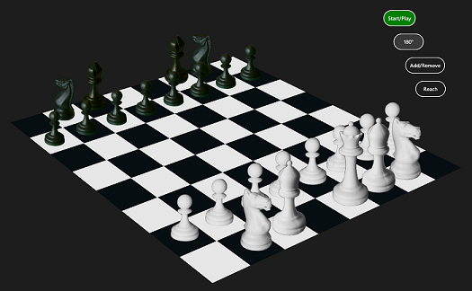

# 3D Chess game using HTML5 and CSS3 (Windows Store)
## Requires
- Visual Studio 2013
## License
- Apache License, Version 2.0
## Technologies
- HTML5
- CSS3
- Visual Studio 2013
- Windows Store app
## Topics
- Games
- Javascript
- HTML5
- Animations
- CSS3
- Windows Store app
- requestAnimationFrame
- 3D animations
- casual games
## Updated
- 05/01/2015
## Description

<h1>Introduction</h1>

The 3D chess app is a hybrid HTML5 and CSS3 app. The board is animated using a CSS3 perspective transform and hardware-accelerated rotations (@keyframes rules). CSS3 animations are also used to move, capture, add, and remove pieces from the board. Board
 rotations paint all the chess pieces on an HTML5 &lt;canvas&gt; overlay, moving these animations off the UI thread and onto the GPU.

The app uses a combination of 3D and 2D technologies to provide 3D effects without the development cost of creating full 3D models, such as you might include in a WebGL or Direct3D app.

The following picture shows the chess board in the middle of a board rotation.

&nbsp;

&nbsp;

<h1>Description</h1>

The main goal of this app is to simulate playing on a real chess board against an actual person, in which touch-based interaction with the board and chess pieces is preferable to a mouse and feels natural (though a mouse works, too). The more specific goals
 of this app are:

<ul>
<li>Provide 3D perspective transforms and rotations on the chess board. This uses CSS3 for hardware-accelerated 3D animations.
</li><li>Board rotations using a hybrid of CSS3 and HTML5. During a rotation, the use of HTML5
<strong>&lt;canvas&gt;</strong> for the chess pieces moves expensive style calculations off the UI thread (to the GPU). The pieces are animated using tracking points on the transformed coordinate plane.
</li><li>Moving, capturing, adding, and removing pieces using CSS3. </li><li>Use of <strong>requestAnimationFrame</strong> for performance-optimized repaints during board rotations.
</li><li>Resetting/rescaling of board and pieces when display size changes. </li><li>Row &amp; column detection. </li><li>Sound effects (when capturing a piece). </li><li>Dynamically updating CSS3 <strong>@keyframes</strong> rules. Importantly, this allows the use of relatively few @keyframes rules to apply to many different pieces with different values.
</li><li>Consistent handling of app state to support different game modes (Start/Play, Add/Remove, Spin, Reach-thru).
</li></ul>

This app does NOT currently demonstrate:

<ul>
<li>Big Blue style AI (it's a 2-player game). </li></ul>

Possible future enhancements:

<ul>
<li>Restricting moves of the chess pieces to legal moves (the simulation is closer to a real chess board, in which you can do what you like). The simulation does do row &amp; column detection, however, to support capturing pieces in the same square. Enforcement
 of legal move could be a future enhancement. </li><li>A complete set of chess pieces. Unlike the 3D board, the pieces are 2D artwork that simulate 3D, and I just needed enough to demonstrate all the concepts working. Supported pieces include: (1) all black &amp; white pawns, (2) all black &amp; white bishops,
 (2) all black &amp; white knights, and (4) the white queen. (Sorry, rooks and kings!)
</li><li>Enforcement of player turns. I did not implement support for playing on two different screens at the same time. This is an option for extending the app.
</li><li>Running in a browser outside the context of a Windows Store app. There is not much WinJS (Win8) dependent code in this app, but to make it a Web app would require another update.
</li><li>Maintenance of app state after termination. </li></ul>
<h1>Building the sample</h1>
<ol>
<li>After downloading, open the sample in Visual Studio 2013. You will need a developer license.
</li><li>Select Local Machine as the debug target. </li><li>Press F5. </li></ol>
<h1>Running the sample</h1>
<ol>
<li>When the app has loaded, press the <strong>Start/Play</strong> button to instruct the app to add the supported pieces to the chess board. (Note: whenever the board is empty, Start/Play will repopulate the board.)
</li><li>To rotate the board, press the 180 deg (Spin) button. </li><li>To add or remove individual pieces, press the Add/Remove button to set Add/Remove mode.
</li></ol>
<h1>More Information</h1>

Related blog posts:

<ul>
<li>Using JavaScript to set @keyframes rules in CSS animations  
<a href="http://blogs.msdn.com/b/msdn_answers/archive/2013/11/04/part-i-using-javascript-to-set-keyframes-in-css-animations-windows-store-apps-ie.aspx">http://blogs.msdn.com/b/msdn_answers/archive/2013/11/04/part-i-using-javascript-to-set-keyframes-in-css-animations-windows-store-apps-ie.aspx</a>
</li><li>Running multiple CSS3 and HTML5 animations 
<a href="http://blogs.msdn.com/b/msdn_answers/archive/2013/12/05/part-ii-running-multiple-css3-and-html5-animations-windows-store-ie.aspx">http://blogs.msdn.com/b/msdn_answers/archive/2013/12/05/part-ii-running-multiple-css3-and-html5-animations-windows-store-ie.aspx</a>
</li></ul>
