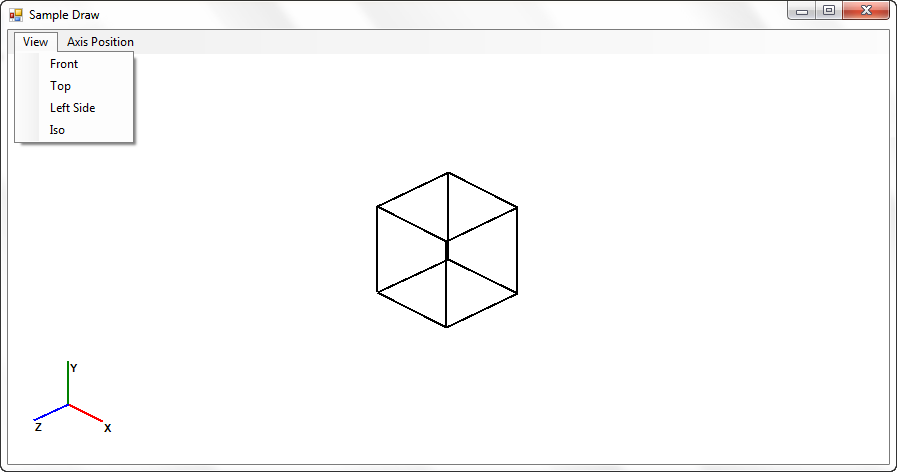
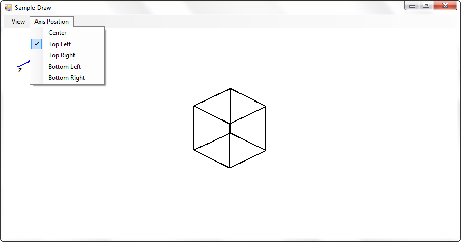

# 3D Modeling using GDI+
## Requires
- Visual Studio 2010
## License
- MS-LPL
## Technologies
- C#
## Topics
- 3D Graphics
## Updated
- 03/30/2014
## Description

<h1>Introduction</h1>

<em>Most of us use OpenGL/ DirectX&nbsp; based program to meet our 3d requirement. Also we need not to reinvent the wheel as most of the methods / capabilities established by these libraries are well tested and confirmed. However these tools does not help&nbsp;&nbsp;a&nbsp;
 learner&nbsp; to understand how 3d graphics being rendered into 2d screen, because those are controlled by different APIs. This attached samples explains how typical 3d modeling graphics projected into 2d screen.</em>

<h1>Building the Sample</h1>

<em>This sample project created using Visual studio 2010 and <em>targeted </em>
dot net framework 4.0</em>

Description

<em>This sample contains 3 different parts.</em>

<em>1. VecrorLib</em>

<em>Contains Vector2D, Vector3D, Point2D, Point 3D classes which are required for any 3d modeling</em>

<em>Matrix3D, Quaternion(under development) class to do transformation such as Translation, scaling, rotation, shear, projection etc</em>

<em>2. Renderer</em>

<em>Contains a camera class and canvas object</em>

<em>3. Sample Project</em>

<em>Sample winform screen which uses Renderer and&nbsp;VectorLib to draw sample 3D cube and provides
<em>rotational </em>transformation of the camera and UI to position the Coordinate axes.</em>

<em></em>

&nbsp;

C#

Edit|Remove

csharp

<pre class="csharp">&nbsp;&nbsp;public&nbsp;void&nbsp;Project(double&nbsp;theta=0,&nbsp;double&nbsp;phi=0,&nbsp;double&nbsp;tx=0,double&nbsp;ty=0,&nbsp;double&nbsp;tz=0)&nbsp;&nbsp;
&nbsp;&nbsp;&nbsp;&nbsp;&nbsp;&nbsp;&nbsp;&nbsp;{&nbsp;&nbsp;&nbsp;&nbsp;
&nbsp;&nbsp;&nbsp;&nbsp;&nbsp;&nbsp;&nbsp;&nbsp;&nbsp;&nbsp;&nbsp;&nbsp;if&nbsp;(m_upVector&nbsp;==&nbsp;Vector3d.YAxis)&nbsp;
&nbsp;&nbsp;&nbsp;&nbsp;&nbsp;&nbsp;&nbsp;&nbsp;&nbsp;&nbsp;&nbsp;&nbsp;{&nbsp;
&nbsp;&nbsp;&nbsp;&nbsp;&nbsp;&nbsp;&nbsp;&nbsp;&nbsp;&nbsp;&nbsp;&nbsp;&nbsp;&nbsp;&nbsp;&nbsp;m_temp.Y&nbsp;=&nbsp;Distance&nbsp;*&nbsp;Math.Sin(Math.PI&nbsp;*&nbsp;(m_cameraPhi&nbsp;&#43;&nbsp;phi)&nbsp;/&nbsp;180);&nbsp;
&nbsp;&nbsp;&nbsp;&nbsp;&nbsp;&nbsp;&nbsp;&nbsp;&nbsp;&nbsp;&nbsp;&nbsp;&nbsp;&nbsp;&nbsp;&nbsp;m_temp.X&nbsp;=&nbsp;Distance&nbsp;*&nbsp;Math.Cos(Math.PI&nbsp;*&nbsp;(m_cameraTheta&nbsp;&#43;&nbsp;theta)&nbsp;/&nbsp;180)&nbsp;*&nbsp;Math.Cos(Math.PI&nbsp;*&nbsp;(m_cameraPhi&nbsp;&#43;&nbsp;phi)&nbsp;/&nbsp;180);&nbsp;
&nbsp;&nbsp;&nbsp;&nbsp;&nbsp;&nbsp;&nbsp;&nbsp;&nbsp;&nbsp;&nbsp;&nbsp;&nbsp;&nbsp;&nbsp;&nbsp;m_temp.Z&nbsp;=&nbsp;Distance&nbsp;*&nbsp;Math.Sin(Math.PI&nbsp;*&nbsp;(m_cameraTheta&nbsp;&#43;&nbsp;theta)&nbsp;/&nbsp;180)&nbsp;*&nbsp;Math.Cos(Math.PI&nbsp;*&nbsp;(m_cameraPhi&nbsp;&#43;&nbsp;phi)&nbsp;/&nbsp;180);&nbsp;
&nbsp;&nbsp;&nbsp;&nbsp;&nbsp;&nbsp;&nbsp;&nbsp;&nbsp;&nbsp;&nbsp;&nbsp;}&nbsp;
&nbsp;&nbsp;&nbsp;&nbsp;&nbsp;&nbsp;&nbsp;&nbsp;&nbsp;&nbsp;&nbsp;&nbsp;else&nbsp;
&nbsp;&nbsp;&nbsp;&nbsp;&nbsp;&nbsp;&nbsp;&nbsp;&nbsp;&nbsp;&nbsp;&nbsp;{&nbsp;
&nbsp;&nbsp;&nbsp;&nbsp;&nbsp;&nbsp;&nbsp;&nbsp;&nbsp;&nbsp;&nbsp;&nbsp;&nbsp;&nbsp;&nbsp;&nbsp;m_temp.Z&nbsp;=&nbsp;Distance&nbsp;*&nbsp;Math.Sin(Math.PI&nbsp;*&nbsp;(m_cameraPhi&nbsp;&#43;&nbsp;phi)&nbsp;/&nbsp;180);&nbsp;
&nbsp;&nbsp;&nbsp;&nbsp;&nbsp;&nbsp;&nbsp;&nbsp;&nbsp;&nbsp;&nbsp;&nbsp;&nbsp;&nbsp;&nbsp;&nbsp;m_temp.X&nbsp;=&nbsp;Distance&nbsp;*&nbsp;Math.Cos(Math.PI&nbsp;*&nbsp;(m_cameraTheta&nbsp;&#43;&nbsp;theta)&nbsp;/&nbsp;180)&nbsp;*&nbsp;Math.Cos(Math.PI&nbsp;*&nbsp;(m_cameraPhi&nbsp;&#43;&nbsp;phi)&nbsp;/&nbsp;180);&nbsp;
&nbsp;&nbsp;&nbsp;&nbsp;&nbsp;&nbsp;&nbsp;&nbsp;&nbsp;&nbsp;&nbsp;&nbsp;&nbsp;&nbsp;&nbsp;&nbsp;m_temp.Y&nbsp;=&nbsp;Distance&nbsp;*&nbsp;Math.Sin(Math.PI&nbsp;*&nbsp;(m_cameraTheta&nbsp;&#43;&nbsp;theta)&nbsp;/&nbsp;180)&nbsp;*&nbsp;Math.Cos(Math.PI&nbsp;*&nbsp;(m_cameraPhi&nbsp;&#43;&nbsp;phi)&nbsp;/&nbsp;180);&nbsp;
&nbsp;&nbsp;&nbsp;&nbsp;&nbsp;&nbsp;&nbsp;&nbsp;&nbsp;&nbsp;&nbsp;&nbsp;}&nbsp;
&nbsp;&nbsp;&nbsp;&nbsp;&nbsp;&nbsp;&nbsp;&nbsp;&nbsp;&nbsp;&nbsp;&nbsp;&nbsp;
&nbsp;&nbsp;&nbsp;&nbsp;&nbsp;&nbsp;&nbsp;&nbsp;&nbsp;&nbsp;&nbsp;&nbsp;double&nbsp;_sin1,&nbsp;_cos1,&nbsp;_sin2,&nbsp;_cos2,&nbsp;_sin3,&nbsp;_cos3;&nbsp;
&nbsp;&nbsp;&nbsp;&nbsp;&nbsp;&nbsp;&nbsp;&nbsp;&nbsp;&nbsp;&nbsp;&nbsp;double&nbsp;_d1,_d2,_d3;&nbsp;
&nbsp;
&nbsp;&nbsp;&nbsp;&nbsp;&nbsp;&nbsp;&nbsp;&nbsp;&nbsp;&nbsp;&nbsp;&nbsp;Matrix3d&nbsp;_m1&nbsp;=&nbsp;Matrix3d.IdentityMatrix();&nbsp;
&nbsp;&nbsp;&nbsp;&nbsp;&nbsp;&nbsp;&nbsp;&nbsp;&nbsp;&nbsp;&nbsp;&nbsp;_m1.Translate(-(m_temp.X),&nbsp;-(m_temp.Y),&nbsp;-(m_temp.Z));&nbsp;
&nbsp;
&nbsp;&nbsp;&nbsp;&nbsp;&nbsp;&nbsp;&nbsp;&nbsp;&nbsp;&nbsp;&nbsp;&nbsp;Point3d&nbsp;_dist&nbsp;=&nbsp;m_temp-TargetPoint;&nbsp;
&nbsp;&nbsp;&nbsp;&nbsp;&nbsp;&nbsp;&nbsp;&nbsp;&nbsp;&nbsp;&nbsp;&nbsp;&nbsp;_d2&nbsp;=&nbsp;m_temp.DistanceTo(TargetPoint);&nbsp;
&nbsp;&nbsp;&nbsp;&nbsp;&nbsp;&nbsp;&nbsp;&nbsp;&nbsp;&nbsp;&nbsp;&nbsp;_d1&nbsp;=&nbsp;Math.Sqrt((_dist.X&nbsp;*&nbsp;_dist.X)&nbsp;&#43;&nbsp;(_dist.Z&nbsp;*&nbsp;_dist.Z));&nbsp;
&nbsp;&nbsp;&nbsp;&nbsp;&nbsp;&nbsp;&nbsp;&nbsp;&nbsp;&nbsp;&nbsp;&nbsp;&nbsp;
&nbsp;&nbsp;&nbsp;&nbsp;&nbsp;&nbsp;&nbsp;&nbsp;&nbsp;&nbsp;&nbsp;&nbsp;//&nbsp;X&nbsp;Axis&nbsp;rotation&nbsp;
&nbsp;&nbsp;&nbsp;&nbsp;&nbsp;&nbsp;&nbsp;&nbsp;&nbsp;&nbsp;&nbsp;&nbsp;Matrix3d&nbsp;_m2&nbsp;=&nbsp;Matrix3d.IdentityMatrix();&nbsp;
&nbsp;&nbsp;&nbsp;&nbsp;&nbsp;&nbsp;&nbsp;&nbsp;&nbsp;&nbsp;&nbsp;&nbsp;if&nbsp;(_d1&nbsp;!=&nbsp;0.0)&nbsp;
&nbsp;&nbsp;&nbsp;&nbsp;&nbsp;&nbsp;&nbsp;&nbsp;&nbsp;&nbsp;&nbsp;&nbsp;{&nbsp;
&nbsp;&nbsp;&nbsp;&nbsp;&nbsp;&nbsp;&nbsp;&nbsp;&nbsp;&nbsp;&nbsp;&nbsp;&nbsp;&nbsp;&nbsp;&nbsp;_sin1&nbsp;=&nbsp;-_dist.X&nbsp;/&nbsp;_d1;&nbsp;
&nbsp;&nbsp;&nbsp;&nbsp;&nbsp;&nbsp;&nbsp;&nbsp;&nbsp;&nbsp;&nbsp;&nbsp;&nbsp;&nbsp;&nbsp;&nbsp;_cos1&nbsp;=&nbsp;_dist.Z&nbsp;/&nbsp;_d1;&nbsp;
&nbsp;&nbsp;&nbsp;&nbsp;&nbsp;&nbsp;&nbsp;&nbsp;&nbsp;&nbsp;&nbsp;&nbsp;&nbsp;&nbsp;&nbsp;&nbsp;_m2.Matrix[0,&nbsp;0]&nbsp;=&nbsp;_cos1;&nbsp;
&nbsp;&nbsp;&nbsp;&nbsp;&nbsp;&nbsp;&nbsp;&nbsp;&nbsp;&nbsp;&nbsp;&nbsp;&nbsp;&nbsp;&nbsp;&nbsp;_m2.Matrix[0,&nbsp;2]&nbsp;=&nbsp;-_sin1;&nbsp;
&nbsp;&nbsp;&nbsp;&nbsp;&nbsp;&nbsp;&nbsp;&nbsp;&nbsp;&nbsp;&nbsp;&nbsp;&nbsp;&nbsp;&nbsp;&nbsp;_m2.Matrix[2,&nbsp;0]&nbsp;=&nbsp;_sin1;&nbsp;
&nbsp;&nbsp;&nbsp;&nbsp;&nbsp;&nbsp;&nbsp;&nbsp;&nbsp;&nbsp;&nbsp;&nbsp;&nbsp;&nbsp;&nbsp;&nbsp;_m2.Matrix[2,&nbsp;2]&nbsp;=&nbsp;_cos1;&nbsp;
&nbsp;
&nbsp;&nbsp;&nbsp;&nbsp;&nbsp;&nbsp;&nbsp;&nbsp;&nbsp;&nbsp;&nbsp;&nbsp;}&nbsp;
&nbsp;&nbsp;&nbsp;&nbsp;&nbsp;&nbsp;&nbsp;&nbsp;&nbsp;&nbsp;&nbsp;&nbsp;//&nbsp;Y&nbsp;Axis&nbsp;rotation&nbsp;
&nbsp;&nbsp;&nbsp;&nbsp;&nbsp;&nbsp;&nbsp;&nbsp;&nbsp;&nbsp;&nbsp;&nbsp;_d2&nbsp;=&nbsp;Math.Sqrt((_dist.X&nbsp;*&nbsp;_dist.X)&nbsp;&#43;&nbsp;(_dist.Y&nbsp;*&nbsp;_dist.Y)&nbsp;&#43;&nbsp;(_dist.Z&nbsp;*&nbsp;_dist.Z));&nbsp;
&nbsp;&nbsp;&nbsp;&nbsp;&nbsp;&nbsp;&nbsp;&nbsp;&nbsp;&nbsp;&nbsp;&nbsp;Matrix3d&nbsp;_m3&nbsp;=&nbsp;Matrix3d.IdentityMatrix();&nbsp;
&nbsp;&nbsp;&nbsp;&nbsp;&nbsp;&nbsp;&nbsp;&nbsp;&nbsp;&nbsp;&nbsp;&nbsp;if&nbsp;(_d2&nbsp;!=&nbsp;0.0)&nbsp;
&nbsp;&nbsp;&nbsp;&nbsp;&nbsp;&nbsp;&nbsp;&nbsp;&nbsp;&nbsp;&nbsp;&nbsp;{&nbsp;
&nbsp;&nbsp;&nbsp;&nbsp;&nbsp;&nbsp;&nbsp;&nbsp;&nbsp;&nbsp;&nbsp;&nbsp;&nbsp;&nbsp;&nbsp;&nbsp;_sin2&nbsp;=&nbsp;_dist.Y&nbsp;/&nbsp;_d2;&nbsp;
&nbsp;&nbsp;&nbsp;&nbsp;&nbsp;&nbsp;&nbsp;&nbsp;&nbsp;&nbsp;&nbsp;&nbsp;&nbsp;&nbsp;&nbsp;&nbsp;_cos2&nbsp;=&nbsp;_d1&nbsp;/&nbsp;_d2;&nbsp;
&nbsp;&nbsp;&nbsp;&nbsp;&nbsp;&nbsp;&nbsp;&nbsp;&nbsp;&nbsp;&nbsp;&nbsp;&nbsp;&nbsp;&nbsp;&nbsp;_m3.Matrix[1,1]&nbsp;=&nbsp;_cos2;&nbsp;
&nbsp;&nbsp;&nbsp;&nbsp;&nbsp;&nbsp;&nbsp;&nbsp;&nbsp;&nbsp;&nbsp;&nbsp;&nbsp;&nbsp;&nbsp;&nbsp;_m3.Matrix[1,&nbsp;2]&nbsp;=&nbsp;_sin2;&nbsp;
&nbsp;&nbsp;&nbsp;&nbsp;&nbsp;&nbsp;&nbsp;&nbsp;&nbsp;&nbsp;&nbsp;&nbsp;&nbsp;&nbsp;&nbsp;&nbsp;_m3.Matrix[2,&nbsp;1]&nbsp;=&nbsp;-_sin2;&nbsp;
&nbsp;&nbsp;&nbsp;&nbsp;&nbsp;&nbsp;&nbsp;&nbsp;&nbsp;&nbsp;&nbsp;&nbsp;&nbsp;&nbsp;&nbsp;&nbsp;_m3.Matrix[2,&nbsp;2]&nbsp;=&nbsp;_cos2;&nbsp;
&nbsp;&nbsp;&nbsp;&nbsp;&nbsp;&nbsp;&nbsp;&nbsp;&nbsp;&nbsp;&nbsp;&nbsp;}&nbsp;
&nbsp;&nbsp;&nbsp;&nbsp;&nbsp;&nbsp;&nbsp;&nbsp;&nbsp;&nbsp;&nbsp;double[]&nbsp;_up2=&nbsp;_m2.ApplyTransform(m_upVector.X,&nbsp;UpVector.Y,&nbsp;UpVector.Z,&nbsp;1);&nbsp;
&nbsp;&nbsp;&nbsp;&nbsp;&nbsp;&nbsp;&nbsp;&nbsp;&nbsp;&nbsp;&nbsp;double[]&nbsp;_up1=_m3.ApplyTransform(_up2[0],&nbsp;_up2[1],&nbsp;_up2[2],&nbsp;_up2[3]);&nbsp;
&nbsp;&nbsp;&nbsp;&nbsp;&nbsp;&nbsp;&nbsp;&nbsp;&nbsp;&nbsp;&nbsp;&nbsp;
&nbsp;&nbsp;&nbsp;&nbsp;&nbsp;&nbsp;&nbsp;&nbsp;&nbsp;&nbsp;//&nbsp;Z&nbsp;Axis&nbsp;Rotation&nbsp;
&nbsp;&nbsp;&nbsp;&nbsp;&nbsp;&nbsp;&nbsp;&nbsp;&nbsp;&nbsp;&nbsp;&nbsp;_d3&nbsp;=&nbsp;Math.Sqrt((_up1[0]&nbsp;*&nbsp;_up1[0])&nbsp;&#43;&nbsp;(_up1[1]&nbsp;*&nbsp;_up1[1]));&nbsp;
&nbsp;&nbsp;&nbsp;&nbsp;&nbsp;&nbsp;&nbsp;&nbsp;&nbsp;&nbsp;&nbsp;Matrix3d&nbsp;_m4&nbsp;=&nbsp;Matrix3d.IdentityMatrix();&nbsp;
&nbsp;&nbsp;&nbsp;&nbsp;&nbsp;&nbsp;&nbsp;&nbsp;&nbsp;&nbsp;&nbsp;if&nbsp;(_d3&nbsp;!=&nbsp;0.0)&nbsp;
&nbsp;&nbsp;&nbsp;&nbsp;&nbsp;&nbsp;&nbsp;&nbsp;&nbsp;&nbsp;&nbsp;{&nbsp;
&nbsp;&nbsp;&nbsp;&nbsp;&nbsp;&nbsp;&nbsp;&nbsp;&nbsp;&nbsp;&nbsp;&nbsp;&nbsp;&nbsp;&nbsp;_sin3&nbsp;=&nbsp;_up1[0]&nbsp;/&nbsp;_d3;&nbsp;
&nbsp;&nbsp;&nbsp;&nbsp;&nbsp;&nbsp;&nbsp;&nbsp;&nbsp;&nbsp;&nbsp;&nbsp;&nbsp;&nbsp;&nbsp;_cos3&nbsp;=&nbsp;_up1[1]&nbsp;/&nbsp;_d3;&nbsp;
&nbsp;&nbsp;&nbsp;&nbsp;&nbsp;&nbsp;&nbsp;&nbsp;&nbsp;&nbsp;&nbsp;&nbsp;&nbsp;&nbsp;&nbsp;_m4.Matrix[0,&nbsp;0]&nbsp;=&nbsp;_cos3;&nbsp;
&nbsp;&nbsp;&nbsp;&nbsp;&nbsp;&nbsp;&nbsp;&nbsp;&nbsp;&nbsp;&nbsp;&nbsp;&nbsp;&nbsp;&nbsp;_m4.Matrix[0,&nbsp;1]&nbsp;=&nbsp;_sin3;&nbsp;
&nbsp;&nbsp;&nbsp;&nbsp;&nbsp;&nbsp;&nbsp;&nbsp;&nbsp;&nbsp;&nbsp;&nbsp;&nbsp;&nbsp;&nbsp;_m4.Matrix[1,&nbsp;0]&nbsp;=-_sin3;&nbsp;
&nbsp;&nbsp;&nbsp;&nbsp;&nbsp;&nbsp;&nbsp;&nbsp;&nbsp;&nbsp;&nbsp;&nbsp;&nbsp;&nbsp;&nbsp;_m4.Matrix[1,&nbsp;1]&nbsp;=&nbsp;_cos3;&nbsp;
&nbsp;&nbsp;&nbsp;&nbsp;&nbsp;&nbsp;&nbsp;&nbsp;&nbsp;&nbsp;&nbsp;}&nbsp;
&nbsp;&nbsp;&nbsp;&nbsp;&nbsp;&nbsp;&nbsp;&nbsp;&nbsp;&nbsp;&nbsp;&nbsp;Matrix3d&nbsp;_m5=Matrix3d.IdentityMatrix();&nbsp;
&nbsp;&nbsp;&nbsp;&nbsp;&nbsp;&nbsp;&nbsp;&nbsp;&nbsp;&nbsp;&nbsp;&nbsp;if&nbsp;(ProjectType&nbsp;==&nbsp;ProjectionTypes.Perspective&nbsp;&amp;&amp;&nbsp;_d2&nbsp;!=&nbsp;0.0)&nbsp;
&nbsp;&nbsp;&nbsp;&nbsp;&nbsp;&nbsp;&nbsp;&nbsp;&nbsp;&nbsp;&nbsp;&nbsp;{&nbsp;
&nbsp;&nbsp;&nbsp;&nbsp;&nbsp;&nbsp;&nbsp;&nbsp;&nbsp;&nbsp;&nbsp;&nbsp;&nbsp;&nbsp;&nbsp;&nbsp;_m5.Matrix[2,&nbsp;3]&nbsp;=&nbsp;-1&nbsp;/&nbsp;_d2;&nbsp;
&nbsp;&nbsp;&nbsp;&nbsp;&nbsp;&nbsp;&nbsp;&nbsp;&nbsp;&nbsp;&nbsp;&nbsp;}&nbsp;
&nbsp;&nbsp;&nbsp;&nbsp;&nbsp;&nbsp;&nbsp;&nbsp;&nbsp;&nbsp;&nbsp;&nbsp;else&nbsp;
&nbsp;&nbsp;&nbsp;&nbsp;&nbsp;&nbsp;&nbsp;&nbsp;&nbsp;&nbsp;&nbsp;&nbsp;{&nbsp;
&nbsp;&nbsp;&nbsp;&nbsp;&nbsp;&nbsp;&nbsp;&nbsp;&nbsp;&nbsp;&nbsp;&nbsp;&nbsp;&nbsp;&nbsp;&nbsp;_m5&nbsp;=&nbsp;Matrix3d.IdentityMatrix();&nbsp;&nbsp;&nbsp;&nbsp;&nbsp;
&nbsp;&nbsp;&nbsp;&nbsp;&nbsp;&nbsp;&nbsp;&nbsp;&nbsp;&nbsp;&nbsp;&nbsp;}&nbsp;
&nbsp;&nbsp;&nbsp;&nbsp;&nbsp;&nbsp;&nbsp;&nbsp;&nbsp;&nbsp;&nbsp;&nbsp;Matrix3d&nbsp;_a=&nbsp;Matrix3d.MatrixMultiply3D(_m1,&nbsp;_m2);&nbsp;
&nbsp;&nbsp;&nbsp;&nbsp;&nbsp;&nbsp;&nbsp;&nbsp;&nbsp;&nbsp;&nbsp;&nbsp;Matrix3d&nbsp;_b&nbsp;=Matrix3d.MatrixMultiply3D(_m3,&nbsp;_m4);&nbsp;
&nbsp;&nbsp;&nbsp;&nbsp;&nbsp;&nbsp;&nbsp;&nbsp;&nbsp;&nbsp;&nbsp;&nbsp;Matrix3d&nbsp;_res&nbsp;=&nbsp;Matrix3d.MatrixMultiply3D(_a,&nbsp;_b);&nbsp;
&nbsp;
&nbsp;&nbsp;&nbsp;&nbsp;&nbsp;&nbsp;&nbsp;&nbsp;&nbsp;&nbsp;&nbsp;&nbsp;//&nbsp;Still&nbsp;in&nbsp;progress&nbsp;code&nbsp;
&nbsp;&nbsp;&nbsp;&nbsp;&nbsp;&nbsp;&nbsp;&nbsp;&nbsp;&nbsp;&nbsp;&nbsp;if&nbsp;(m_viewType&nbsp;==&nbsp;ViewTypes.Front)&nbsp;
&nbsp;&nbsp;&nbsp;&nbsp;&nbsp;&nbsp;&nbsp;&nbsp;&nbsp;&nbsp;&nbsp;&nbsp;{&nbsp;
&nbsp;&nbsp;&nbsp;&nbsp;&nbsp;&nbsp;&nbsp;&nbsp;&nbsp;&nbsp;&nbsp;&nbsp;&nbsp;&nbsp;&nbsp;&nbsp;Matrix3d&nbsp;m_view&nbsp;=&nbsp;Matrix3d.IdentityMatrix();&nbsp;
&nbsp;&nbsp;&nbsp;&nbsp;&nbsp;&nbsp;&nbsp;&nbsp;&nbsp;&nbsp;&nbsp;&nbsp;&nbsp;&nbsp;&nbsp;&nbsp;
&nbsp;&nbsp;&nbsp;&nbsp;&nbsp;&nbsp;&nbsp;&nbsp;&nbsp;&nbsp;&nbsp;&nbsp;&nbsp;&nbsp;&nbsp;&nbsp;m_view.Matrix[2,&nbsp;2]&nbsp;=&nbsp;0;&nbsp;
&nbsp;&nbsp;&nbsp;&nbsp;&nbsp;&nbsp;&nbsp;&nbsp;&nbsp;&nbsp;&nbsp;&nbsp;&nbsp;&nbsp;&nbsp;&nbsp;&nbsp;
&nbsp;&nbsp;&nbsp;&nbsp;&nbsp;&nbsp;&nbsp;&nbsp;&nbsp;&nbsp;&nbsp;&nbsp;&nbsp;&nbsp;&nbsp;&nbsp;ProjectedMatrix&nbsp;=&nbsp;m_view;&nbsp;
&nbsp;&nbsp;&nbsp;&nbsp;&nbsp;&nbsp;&nbsp;&nbsp;&nbsp;&nbsp;&nbsp;&nbsp;}&nbsp;
&nbsp;&nbsp;&nbsp;&nbsp;&nbsp;&nbsp;&nbsp;&nbsp;&nbsp;&nbsp;&nbsp;&nbsp;else&nbsp;if&nbsp;(m_viewType&nbsp;==&nbsp;ViewTypes.Top)&nbsp;
&nbsp;&nbsp;&nbsp;&nbsp;&nbsp;&nbsp;&nbsp;&nbsp;&nbsp;&nbsp;&nbsp;&nbsp;{&nbsp;
&nbsp;&nbsp;&nbsp;&nbsp;&nbsp;&nbsp;&nbsp;&nbsp;&nbsp;&nbsp;&nbsp;&nbsp;&nbsp;&nbsp;&nbsp;&nbsp;Matrix3d&nbsp;m_view&nbsp;=&nbsp;Matrix3d.IdentityMatrix();&nbsp;
&nbsp;&nbsp;&nbsp;&nbsp;&nbsp;&nbsp;&nbsp;&nbsp;&nbsp;&nbsp;&nbsp;&nbsp;&nbsp;&nbsp;&nbsp;&nbsp;m_view.Matrix[1,&nbsp;1]&nbsp;=&nbsp;0;&nbsp;
&nbsp;&nbsp;&nbsp;&nbsp;&nbsp;&nbsp;&nbsp;&nbsp;&nbsp;&nbsp;&nbsp;&nbsp;&nbsp;&nbsp;&nbsp;&nbsp;m_view.Matrix[2,&nbsp;1]&nbsp;=&nbsp;-1;&nbsp;
&nbsp;&nbsp;&nbsp;&nbsp;&nbsp;&nbsp;&nbsp;&nbsp;&nbsp;&nbsp;&nbsp;&nbsp;&nbsp;&nbsp;&nbsp;&nbsp;m_view.Matrix[2,&nbsp;2]&nbsp;=&nbsp;0;&nbsp;
&nbsp;&nbsp;&nbsp;&nbsp;&nbsp;&nbsp;&nbsp;&nbsp;&nbsp;&nbsp;&nbsp;&nbsp;&nbsp;&nbsp;&nbsp;&nbsp;ProjectedMatrix&nbsp;=&nbsp;m_view;&nbsp;
&nbsp;&nbsp;&nbsp;&nbsp;&nbsp;&nbsp;&nbsp;&nbsp;&nbsp;&nbsp;&nbsp;&nbsp;}&nbsp;
&nbsp;&nbsp;&nbsp;&nbsp;&nbsp;&nbsp;&nbsp;&nbsp;&nbsp;&nbsp;&nbsp;&nbsp;else&nbsp;if&nbsp;(m_viewType&nbsp;==&nbsp;ViewTypes.Left)&nbsp;
&nbsp;&nbsp;&nbsp;&nbsp;&nbsp;&nbsp;&nbsp;&nbsp;&nbsp;&nbsp;&nbsp;&nbsp;{&nbsp;
&nbsp;&nbsp;&nbsp;&nbsp;&nbsp;&nbsp;&nbsp;&nbsp;&nbsp;&nbsp;&nbsp;&nbsp;&nbsp;&nbsp;&nbsp;&nbsp;Matrix3d&nbsp;m_view&nbsp;=&nbsp;Matrix3d.IdentityMatrix();&nbsp;
&nbsp;&nbsp;&nbsp;&nbsp;&nbsp;&nbsp;&nbsp;&nbsp;&nbsp;&nbsp;&nbsp;&nbsp;&nbsp;&nbsp;&nbsp;&nbsp;m_view.Matrix[0,&nbsp;0]&nbsp;=&nbsp;0;&nbsp;
&nbsp;&nbsp;&nbsp;&nbsp;&nbsp;&nbsp;&nbsp;&nbsp;&nbsp;&nbsp;&nbsp;&nbsp;&nbsp;&nbsp;&nbsp;&nbsp;m_view.Matrix[2,&nbsp;0]&nbsp;=&nbsp;-1;&nbsp;
&nbsp;&nbsp;&nbsp;&nbsp;&nbsp;&nbsp;&nbsp;&nbsp;&nbsp;&nbsp;&nbsp;&nbsp;&nbsp;&nbsp;&nbsp;&nbsp;m_view.Matrix[2,&nbsp;2]&nbsp;=&nbsp;0;&nbsp;
&nbsp;&nbsp;&nbsp;&nbsp;&nbsp;&nbsp;&nbsp;&nbsp;&nbsp;&nbsp;&nbsp;&nbsp;&nbsp;&nbsp;&nbsp;&nbsp;ProjectedMatrix&nbsp;=&nbsp;m_view;&nbsp;
&nbsp;&nbsp;&nbsp;&nbsp;&nbsp;&nbsp;&nbsp;&nbsp;&nbsp;&nbsp;&nbsp;&nbsp;}&nbsp;&nbsp;
&nbsp;&nbsp;&nbsp;&nbsp;&nbsp;&nbsp;&nbsp;&nbsp;&nbsp;&nbsp;&nbsp;&nbsp;else&nbsp;
&nbsp;&nbsp;&nbsp;&nbsp;&nbsp;&nbsp;&nbsp;&nbsp;&nbsp;&nbsp;&nbsp;&nbsp;ProjectedMatrix&nbsp;=&nbsp;Matrix3d.MatrixMultiply3D(_res,&nbsp;_m5);&nbsp;
&nbsp;&nbsp;&nbsp;&nbsp;&nbsp;&nbsp;&nbsp;&nbsp;}&nbsp;
&nbsp;&nbsp;&nbsp;&nbsp;&nbsp;&nbsp;&nbsp;&nbsp;
&nbsp;&nbsp;&nbsp;&nbsp;&nbsp;&nbsp;&nbsp;
&nbsp;&nbsp;&nbsp;&nbsp;&nbsp;&nbsp;&nbsp;&nbsp;&nbsp;
&nbsp;&nbsp;&nbsp;&nbsp;}</pre>

This sample currently provides support to render wireframe modeling and rotational transformation to support orthographic, perspective projections. Later it will be extended to support Quaternion based camera rotations and translations. which will include
 hidden line removal and depth buffer algorithms lighting concepts.

&nbsp;

