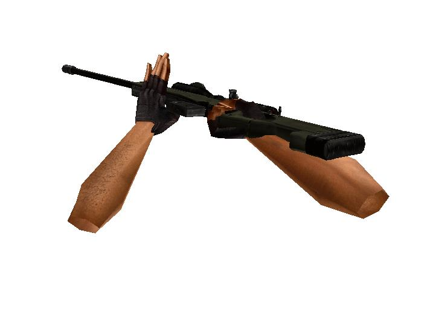

# 3D graphics. Load and animation model.
## Requires
- Visual Studio 2010
## License
- MIT
## Technologies
- Windows Forms
- Visual Studio 2010
- C++
- .NET Framework
- 3D animations
- OpenGL
## Topics
- User Interface
- Windows Forms
- Graphics and 3D
- .NET 4
## Updated
- 08/27/2015
## Description

<h1>Introduction</h1>

There are many file formats. In this example we look at the structure .mdl file. This format is used in such legendary games as Half-Life and Counter-Strike.

Many people wonder how it all works. The example shows how to load a file and animation.

&nbsp;

The main objective of this example to show how to mix managed and unmanaged code. Those interested in 3D graphics just do not find for themselves a lot of interesting things. 
 

<h1>Building the Sample</h1>

For assembly, open the solution in VS, and then build. If you are using the express version, the libraries are not included. In case if you can not find them, then lay out further.

Description

<em>&nbsp;</em>Quick start. 
The results are output.

&nbsp;

In this case, the window inherits the System :: Windows :: Forms :: Form. HDC we obtain in the usual manner.

&nbsp;

C&#43;&#43;

Из&#1084;енение сценария|Remove

cplusplus

<pre class="cplusplus">if&nbsp;(!(hDC=GetDC((HWND)hwnd.ToPointer())))&nbsp;
&nbsp;&nbsp;&nbsp;&nbsp;&nbsp;&nbsp;&nbsp;&nbsp;&nbsp;&nbsp;&nbsp;&nbsp;MessageBox::Show(&nbsp;&quot;Can't&nbsp;Create&nbsp;A&nbsp;GL&nbsp;Device&nbsp;Context.&quot;,&quot;ERROR&quot;);&nbsp;
</pre>

No additional libraries are required. It should also be said that use OpenGL. But you will not be difficult to rewrite the code of DirectX.

Interaction of managed and unmanaged code in this example is rather complicated. Because of the managed and unmanaged classes.

C&#43;&#43;

Из&#1084;енение сценария|Remove

cplusplus

<pre class="cplusplus">public&nbsp;ref&nbsp;class&nbsp;Form1&nbsp;:&nbsp;public&nbsp;System::Windows::Forms::Form&nbsp;
&nbsp;&nbsp;&nbsp;&nbsp;{&nbsp;
&nbsp;&nbsp;&nbsp;&nbsp;public:IntPtr&nbsp;hwnd;&nbsp;
&nbsp;&nbsp;&nbsp;&nbsp;//public:IntPtr&nbsp;hDC;public:&nbsp;HDC&nbsp;hDC;&nbsp;
&nbsp;&nbsp;&nbsp;&nbsp;public:&nbsp;&nbsp;&nbsp;&nbsp;GLuint&nbsp;PixelFormat;&nbsp;
&nbsp;&nbsp;&nbsp;&nbsp;public:&nbsp;&nbsp;&nbsp;&nbsp;HGLRC&nbsp;&nbsp;&nbsp;&nbsp;hRC;&nbsp;&nbsp;&nbsp;&nbsp;&nbsp;&nbsp;&nbsp;&nbsp;//&nbsp;Permanent&nbsp;Rendering&nbsp;Contextpublic:&nbsp;static&nbsp;&nbsp;&nbsp;&nbsp;GLfloat&nbsp;&nbsp;&nbsp;&nbsp;rtri;&nbsp;&nbsp;&nbsp;&nbsp;&nbsp;&nbsp;&nbsp;&nbsp;&nbsp;&nbsp;&nbsp;&nbsp;&nbsp;&nbsp;&nbsp;&nbsp;//&nbsp;Angle&nbsp;For&nbsp;The&nbsp;Triangle&nbsp;(&nbsp;NEW&nbsp;)public:&nbsp;&nbsp;&nbsp;&nbsp;static&nbsp;GLfloat&nbsp;&nbsp;&nbsp;&nbsp;rquad;&nbsp;&nbsp;&nbsp;&nbsp;&nbsp;&nbsp;&nbsp;&nbsp;&nbsp;&nbsp;&nbsp;&nbsp;&nbsp;&nbsp;&nbsp;&nbsp;//&nbsp;Angle&nbsp;For&nbsp;The&nbsp;Quad&nbsp;(&nbsp;NEW&nbsp;)public:&nbsp;static&nbsp;CountS&nbsp;*pCountSS;&nbsp;
&nbsp;&nbsp;&nbsp;&nbsp;public:&nbsp;staticdouble&nbsp;gdAngleX,gdAngleY,gdTransX,gdTransY,gdTransZ;&nbsp;
&nbsp;&nbsp;&nbsp;&nbsp;private:&nbsp;&nbsp;double&nbsp;&nbsp;&nbsp;&nbsp;giX,&nbsp;giY,&nbsp;m_dx,m_dy;&nbsp;
&nbsp;&nbsp;&nbsp;&nbsp;public:&nbsp;staticint&nbsp;keys;&nbsp;
&nbsp;&nbsp;&nbsp;&nbsp;&nbsp;
&nbsp;&nbsp;&nbsp;&nbsp;public:&nbsp;
&nbsp;&nbsp;&nbsp;&nbsp;&nbsp;&nbsp;&nbsp;&nbsp;Form1(void)&nbsp;
&nbsp;&nbsp;&nbsp;&nbsp;&nbsp;&nbsp;&nbsp;&nbsp;{&nbsp;
&nbsp;&nbsp;&nbsp;&nbsp;&nbsp;&nbsp;&nbsp;&nbsp;&nbsp;&nbsp;&nbsp;&nbsp;InitializeComponent();&nbsp;
&nbsp;
&nbsp;
&hellip;&nbsp;
class&nbsp;CountS{&nbsp;
public:&nbsp;
&nbsp;
&nbsp;&nbsp;
struct&nbsp;Vertex&nbsp;
&nbsp;&nbsp;&nbsp;&nbsp;&nbsp;&nbsp;&nbsp;&nbsp;{&nbsp;
&nbsp;&nbsp;&nbsp;&nbsp;&nbsp;&nbsp;&nbsp;&nbsp;&nbsp;&nbsp;&nbsp;&nbsp;int&nbsp;m_boneID;&nbsp;&nbsp;&nbsp;&nbsp;//&nbsp;for&nbsp;skeletal&nbsp;animation&nbsp;
&nbsp;&nbsp;&nbsp;&nbsp;&nbsp;&nbsp;&nbsp;&nbsp;&nbsp;&nbsp;&nbsp;&nbsp;dfx::vector&lt;&gt;&nbsp;m_location;&nbsp;
&nbsp;&nbsp;&nbsp;&nbsp;&nbsp;&nbsp;&nbsp;&nbsp;&nbsp;&nbsp;&nbsp;&nbsp;float&nbsp;m_location1[3];&nbsp;
&nbsp;&nbsp;&nbsp;&nbsp;&nbsp;&nbsp;&nbsp;&nbsp;&nbsp;
&nbsp;&nbsp;&nbsp;&nbsp;&nbsp;&nbsp;&nbsp;&nbsp;};&nbsp;&nbsp;&nbsp;&nbsp;&nbsp;
&nbsp;
&nbsp;
struct&nbsp;Triangle&nbsp;
&nbsp;&nbsp;&nbsp;&nbsp;&nbsp;&nbsp;&nbsp;&nbsp;{&nbsp;
&nbsp;&nbsp;&nbsp;&nbsp;&nbsp;&nbsp;&nbsp;&nbsp;&nbsp;&nbsp;&nbsp;&nbsp;float&nbsp;m_vertexNormals[3][3];//&nbsp;Normals&nbsp;to&nbsp;each&nbsp;of&nbsp;vertex&nbsp;of&nbsp;a&nbsp;triangle&nbsp;float&nbsp;m_s[3],&nbsp;m_t[3];//&nbsp;Textural&nbsp;coordinates&nbsp;for&nbsp;a&nbsp;triangleint&nbsp;m_vertexIndices[3];//3&nbsp;tops&nbsp;make&nbsp;a&nbsp;triangle&nbsp;&nbsp;
&nbsp;&nbsp;&nbsp;&nbsp;&nbsp;&nbsp;&nbsp;&nbsp;&nbsp;&nbsp;&nbsp;&nbsp;&nbsp;
&nbsp;&nbsp;&nbsp;&nbsp;&nbsp;&nbsp;&nbsp;&nbsp;};&nbsp;
</pre>

You can see it in more detail.

&nbsp;

Consider the model itself. It is a set of standard set of vertices, texture, and above all skeletal animation.

&nbsp;

Sample 1. Reload(number key 2-4).

Sample 1. Shot(number key 5-7).

&nbsp;

To move and zoom model use a mouse.

It is important to note that we use for turns quaternion. This allows for smoother animation model.

C&#43;&#43;

Из&#1084;енение сценария|Remove

cplusplus

<pre class="cplusplus">quaternion(&nbsp;const&nbsp;dfx::vector&lt;&nbsp;T&nbsp;&gt;&nbsp;&amp;axis,&nbsp;T&nbsp;angle&nbsp;)&nbsp;{//&nbsp;quaternion&nbsp;
&nbsp;&nbsp;&nbsp;&nbsp;&nbsp;&nbsp;&nbsp;&nbsp;&nbsp;&nbsp;&nbsp;&nbsp;T&nbsp;scale&nbsp;=&nbsp;(&nbsp;T&nbsp;)sin(&nbsp;angle&nbsp;/&nbsp;T(2)&nbsp;);&nbsp;
&nbsp;
&nbsp;&nbsp;&nbsp;&nbsp;&nbsp;&nbsp;&nbsp;&nbsp;&nbsp;&nbsp;&nbsp;&nbsp;w&nbsp;=&nbsp;(&nbsp;T&nbsp;)cos(&nbsp;angle&nbsp;/&nbsp;T(2)&nbsp;);&nbsp;
&nbsp;
&nbsp;&nbsp;&nbsp;&nbsp;&nbsp;&nbsp;&nbsp;&nbsp;&nbsp;&nbsp;&nbsp;&nbsp;x&nbsp;=&nbsp;axis.x&nbsp;*&nbsp;scale;&nbsp;
&nbsp;&nbsp;&nbsp;&nbsp;&nbsp;&nbsp;&nbsp;&nbsp;&nbsp;&nbsp;&nbsp;&nbsp;y&nbsp;=&nbsp;axis.y&nbsp;*&nbsp;scale;&nbsp;
&nbsp;&nbsp;&nbsp;&nbsp;&nbsp;&nbsp;&nbsp;&nbsp;&nbsp;&nbsp;&nbsp;&nbsp;z&nbsp;=&nbsp;axis.z&nbsp;*&nbsp;scale;&nbsp;
&nbsp;&nbsp;&nbsp;&nbsp;&nbsp;&nbsp;&nbsp;&nbsp;&nbsp;
&nbsp;&nbsp;&nbsp;&nbsp;&nbsp;&nbsp;&nbsp;&nbsp;&nbsp;
&nbsp;&nbsp;&nbsp;&nbsp;&nbsp;&nbsp;&nbsp;&nbsp;}&nbsp;
&nbsp;&nbsp;&nbsp;&nbsp;&nbsp;&nbsp;&nbsp;&nbsp;&nbsp;
&nbsp;&nbsp;&nbsp;&nbsp;&nbsp;&nbsp;&nbsp;&nbsp;&nbsp;&nbsp;&nbsp;&nbsp;friend&nbsp;quaternion&nbsp;operator*(&nbsp;const&nbsp;quaternion&nbsp;&amp;a,&nbsp;const&nbsp;quaternion&nbsp;&amp;b&nbsp;)&nbsp;{&nbsp;
&nbsp;&nbsp;&nbsp;&nbsp;&nbsp;&nbsp;&nbsp;&nbsp;&nbsp;&nbsp;&nbsp;&nbsp;const&nbsp;T&nbsp;Qx&nbsp;=&nbsp;a.w&nbsp;*&nbsp;b.x&nbsp;&#43;&nbsp;a.x&nbsp;*&nbsp;b.w&nbsp;&#43;&nbsp;a.y&nbsp;*&nbsp;b.z&nbsp;-&nbsp;a.z&nbsp;*&nbsp;b.y;&nbsp;
&nbsp;&nbsp;&nbsp;&nbsp;&nbsp;&nbsp;&nbsp;&nbsp;&nbsp;&nbsp;&nbsp;&nbsp;const&nbsp;T&nbsp;Qy&nbsp;=&nbsp;a.w&nbsp;*&nbsp;b.y&nbsp;-&nbsp;a.x&nbsp;*&nbsp;b.z&nbsp;&#43;&nbsp;a.y&nbsp;*&nbsp;b.w&nbsp;&#43;&nbsp;a.z&nbsp;*&nbsp;b.x;&nbsp;
&nbsp;&nbsp;&nbsp;&nbsp;&nbsp;&nbsp;&nbsp;&nbsp;&nbsp;&nbsp;&nbsp;&nbsp;const&nbsp;T&nbsp;Qz&nbsp;=&nbsp;a.w&nbsp;*&nbsp;b.z&nbsp;&#43;&nbsp;a.x&nbsp;*&nbsp;b.y&nbsp;-&nbsp;a.y&nbsp;*&nbsp;b.x&nbsp;&#43;&nbsp;a.z&nbsp;*&nbsp;b.w;&nbsp;
&nbsp;&nbsp;&nbsp;&nbsp;&nbsp;&nbsp;&nbsp;&nbsp;&nbsp;&nbsp;&nbsp;&nbsp;const&nbsp;T&nbsp;Qw&nbsp;=&nbsp;a.w&nbsp;*&nbsp;b.w&nbsp;-&nbsp;a.x&nbsp;*&nbsp;b.x&nbsp;-&nbsp;a.y&nbsp;*&nbsp;b.y&nbsp;-&nbsp;a.z&nbsp;*&nbsp;b.z;&nbsp;
&nbsp;&nbsp;&nbsp;&nbsp;&nbsp;&nbsp;&nbsp;&nbsp;&nbsp;&nbsp;&nbsp;&nbsp;return&nbsp;quaternion(&nbsp;Qw,&nbsp;Qx,&nbsp;Qy,&nbsp;Qz&nbsp;);&nbsp;
&nbsp;&nbsp;&nbsp;&nbsp;&nbsp;&nbsp;&nbsp;&nbsp;}&nbsp;
</pre>

You managed to use a model from Valve! But you can do better!

Good luck.

&nbsp;

<h1>More Information</h1>

<em>3D 
model can be used only for training.
Commercial use is prohibited.</em>

