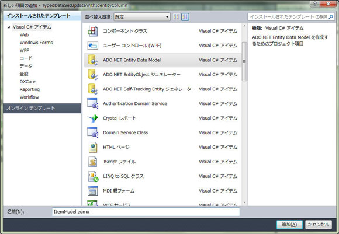
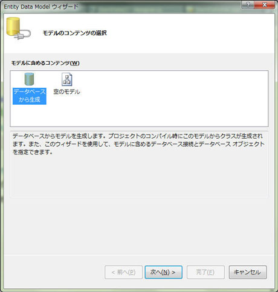
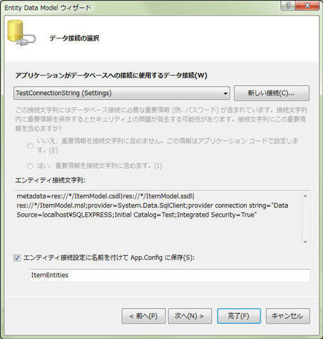
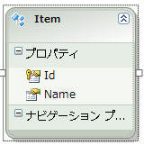
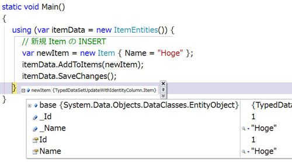

# [C#-ADO.NET] Entity Framework で IDENTITY 列を持ったテーブルに行を挿入した時の IDENTITY 列の値の取得
## Requires
- 
## License
- Apache License, Version 2.0
## Technologies
- Visual Studio 2010
## Topics
- データ アクセス開発
- 逆引きサンプル コード
## Updated
- 06/09/2011
## Description

執筆者: <a href="http://msdn.microsoft.com/ja-jp/gg585574#kojima" target="_blank">
福井コンピュータ株式会社 小島 富治雄</a>

動作確認環境: Visual Studio 2010、.NET Framework 4.0

SQL Server の IDENTITY 列は、テーブルに新しい行が挿入されるときに自動的にその値がインクリメントされます。主キーとしてたいへん便利です。

行の挿入後に IDENTITY 列の値を取得したいことがあります。ADO.NET Entity Framework を使って行を挿入する場合の IDENTITY 列の値の取得方法をみてみましょう。

<a href="#top"> ページのトップへ</a>

<h2>1. SQL Server 側のテーブルの準備</h2>

先ず、IDENTITY 列を持ったテーブルを SQL Server 側に準備しましょう。

1. Visual Studio の「サーバー エクスプローラー」(Visual Studio Express Edition の場合は「データベース・エクスプローラー」) を開きます。

2. 「データ接続」を右クリックし、ポップアップ メニューから「接続の追加」または「新しい SQL Server データベースの作成」をします。

3. その接続の「テーブル」 - 「新しいテーブルの追加」でデータベースにテーブルを追加します。

4. ここでは、試しに以下のような &quot;Item&quot; というテーブルを追加することにします。

<table border="1" style="margin:.5em 2em">
<thead>
<tr>
<th colspan="5">Item</th>
</tr>
<tr>
<th>列名</th>
<th>主キー</th>
<th>データ型</th>
<th>Null を許容</th>
<th>IDENTITY の設定</th>
</tr>
</thead>
<tbody>
<tr>
<th>Id</th>
<td>○</td>
<td>int</td>
<td>&times;</td>
<td>はい</td>
</tr>
<tr>
<th>Name</th>
<td>&times;</td>
<td>nvarchar(100)</td>
<td>&times;</td>
<td>いいえ</td>
</tr>
</tbody>
</table>

5. Id 列を主キーとし、IDENTITY の設定を「はい」にしておきます。

6. または、SQL Server Management Studio などから以下の SQL を実行することでも上記 Item テーブルを作成することができます。

SQL

スクリプトの編集|{#scriptcode_dlg.remove_script}

mysql
<pre class="hidden">CREATE TABLE [dbo].[Item](
	[Id] [int] IDENTITY(1,1) NOT NULL,
	[Name] [nvarchar](100) NOT NULL,
 CONSTRAINT [PK_Item] PRIMARY KEY CLUSTERED 
(
	[Id] ASC
)WITH (PAD_INDEX  = OFF, STATISTICS_NORECOMPUTE  = OFF, IGNORE_DUP_KEY = OFF, ALLOW_ROW_LOCKS  = ON, ALLOW_PAGE_LOCKS  = ON) ON [PRIMARY]
) ON [PRIMARY]</pre>

<pre class="mysql">CREATE&nbsp;TABLE&nbsp;[dbo].[Item](&nbsp;
&nbsp;&nbsp;&nbsp;&nbsp;[Id]&nbsp;[int]&nbsp;IDENTITY(1,1)&nbsp;NOT&nbsp;NULL,&nbsp;
&nbsp;&nbsp;&nbsp;&nbsp;[Name]&nbsp;[nvarchar](100)&nbsp;NOT&nbsp;NULL,&nbsp;
&nbsp;CONSTRAINT&nbsp;[PK_Item]&nbsp;PRIMARY&nbsp;KEY&nbsp;CLUSTERED&nbsp;&nbsp;
(&nbsp;
&nbsp;&nbsp;&nbsp;&nbsp;[Id]&nbsp;ASC&nbsp;
)WITH&nbsp;(PAD_INDEX&nbsp;&nbsp;=&nbsp;OFF,&nbsp;STATISTICS_NORECOMPUTE&nbsp;&nbsp;=&nbsp;OFF,&nbsp;IGNORE_DUP_KEY&nbsp;=&nbsp;OFF,&nbsp;ALLOW_ROW_LOCKS&nbsp;&nbsp;=&nbsp;ON,&nbsp;ALLOW_PAGE_LOCKS&nbsp;&nbsp;=&nbsp;ON)&nbsp;ON&nbsp;[PRIMARY]&nbsp;
)&nbsp;ON&nbsp;[PRIMARY]</pre>

&nbsp;

データベース側の準備ができましたので、これから新規行の IDENTITY 列の値の取得方法を見ていきましょう。

<a href="#top"> ページのトップへ</a>

<h2>2. Entity Framework で行の挿入時の IDENTITY 列を取得する</h2>

1. Visual Studio で、新しい「コンソール アプリケーション」を作成し、「ソリューション エクスプローラー」でプロジェクト名を右クリックします。

2. ポップアップ メニューから、「追加」 - 「新しい項目」を選択します。

3. 「新しい項目の追加」ダイアログ ボックスが開きます。「Visual C# アイテム」 - 「ADO.NET Entity Data Model」を選択します。

4. ここでは「名前」を &quot;ItemModel.edmx&quot; と、し「追加」ボタンを押します。

5. 「Entity Data Model ウィザード」が開きます。

6. ここでは、「データベースから生成」を選択し、「次へ」ボタンを押します。

7. 次の画面では、既存のデータ接続を選択し、「エンティティ接続設定に名前を付けて App.Config に保存」では &quot;ItemEntities&quot; と入力して「次へ」ボタンを押します。

8. 次の「データベース オブジェクトの選択」の画面では、「テーブル」の中の &quot;Item&quot; をチェックします。

9. 「生成されたオブジェクトの名前を複数化または単数化する」にもチェックを入れ、「モデル名前空間」をここでは &quot;ItemModel&quot; として、「完了」ボタンを押します。

10. 暫く待つと、&quot;ItemModel.edmx&quot; というファイルが開きます。中に以下のようなアイテムが追加されているのが分かります。

11. 今度は、以下のサンプル コードで試してみましょう。

C#

スクリプトの編集|{#scriptcode_dlg.remove_script}

csharp
<pre class="hidden">namespace TypedDataSetUpdateWithIdentityColumn
{
    class Program
    {
        static void Main()
        {
            using (var itemData = new ItemEntities()) {
                // 新規 Item の INSERT
                var newItem = new Item { Name = &quot;Hoge&quot; };
                itemData.AddToItems(newItem);
                itemData.SaveChanges();
            }
        }
    }
}</pre>

<pre class="js">namespace&nbsp;TypedDataSetUpdateWithIdentityColumn&nbsp;
{&nbsp;
&nbsp;&nbsp;&nbsp;&nbsp;class&nbsp;Program&nbsp;
&nbsp;&nbsp;&nbsp;&nbsp;{&nbsp;
&nbsp;&nbsp;&nbsp;&nbsp;&nbsp;&nbsp;&nbsp;&nbsp;static&nbsp;void&nbsp;Main()&nbsp;
&nbsp;&nbsp;&nbsp;&nbsp;&nbsp;&nbsp;&nbsp;&nbsp;{&nbsp;
&nbsp;&nbsp;&nbsp;&nbsp;&nbsp;&nbsp;&nbsp;&nbsp;&nbsp;&nbsp;&nbsp;&nbsp;using&nbsp;(var&nbsp;itemData&nbsp;=&nbsp;new&nbsp;ItemEntities())&nbsp;{&nbsp;
&nbsp;&nbsp;&nbsp;&nbsp;&nbsp;&nbsp;&nbsp;&nbsp;&nbsp;&nbsp;&nbsp;&nbsp;&nbsp;&nbsp;&nbsp;&nbsp;//&nbsp;新規&nbsp;Item&nbsp;の&nbsp;INSERT&nbsp;
&nbsp;&nbsp;&nbsp;&nbsp;&nbsp;&nbsp;&nbsp;&nbsp;&nbsp;&nbsp;&nbsp;&nbsp;&nbsp;&nbsp;&nbsp;&nbsp;var&nbsp;newItem&nbsp;=&nbsp;new&nbsp;Item&nbsp;{&nbsp;Name&nbsp;=&nbsp;&quot;Hoge&quot;&nbsp;};&nbsp;
&nbsp;&nbsp;&nbsp;&nbsp;&nbsp;&nbsp;&nbsp;&nbsp;&nbsp;&nbsp;&nbsp;&nbsp;&nbsp;&nbsp;&nbsp;&nbsp;itemData.AddToItems(newItem);&nbsp;
&nbsp;&nbsp;&nbsp;&nbsp;&nbsp;&nbsp;&nbsp;&nbsp;&nbsp;&nbsp;&nbsp;&nbsp;&nbsp;&nbsp;&nbsp;&nbsp;itemData.SaveChanges();&nbsp;
&nbsp;&nbsp;&nbsp;&nbsp;&nbsp;&nbsp;&nbsp;&nbsp;&nbsp;&nbsp;&nbsp;&nbsp;}&nbsp;
&nbsp;&nbsp;&nbsp;&nbsp;&nbsp;&nbsp;&nbsp;&nbsp;}&nbsp;
&nbsp;&nbsp;&nbsp;&nbsp;}&nbsp;
}</pre>

&nbsp;

12. 実行結果は、以下のようになります。

挿入直後の、&quot;newItem&quot; の Id に新たな値が入っているのが確認できます。

<a href="#top"> ページのトップへ</a>

<h2>関連リンク</h2>
<ul>
<li><a href="/ja-jp/DataAccess-howto-b5a084df">SqlCommand で IDENTITY 列を持ったテーブルに行を挿入した時の IDENTITY 列の値の取得</a>
</li><li><a href="/ja-jp/DataAccess-howto-55fab6e5">DataSet で IDENTITY 列を持ったテーブルに行を挿入した時の IDENTITY 列の値の取得</a>
</li><li><a href="/ja-jp/DataAccess-howto-eecfa511">LINQ to SQL で IDENTITY 列を持ったテーブルに行を挿入した時の IDENTITY 列の値の取得</a>
</li></ul>

<table>
<tbody>
<tr>
<td></td>
<td></td>
<td>
<ul>
<li>もっと他のコンテンツを見る &gt;&gt; <a href="/ja-jp/ff363212" target="_blank">逆引きサンプル コード一覧へ</a>
</li><li>もっと他のレシピを見る &gt;&gt; <a href="/ja-jp">Code Recipe へ</a> </li><li>もっと データ アクセス の情報を見る &gt;&gt; <a href="/ja-jp/data" target="_blank">データ アクセス デベロッパー センターへ</a>
</li></ul>
</td>
</tr>
</tbody>
</table>

<a href="#top"> ページのトップへ</a>

