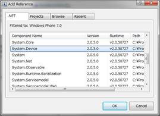

# [C#] GPSによる位置情報の取得
## Requires
- 
## License
- Apache License, Version 2.0
## Technologies
- Silverlight
- Windows Phone 7
## Topics
- Silverlight アプリケーション
- Windows Phone アプリケーション
- 逆引きサンプル コード
## Updated
- 03/17/2011
## Description

対応バージョン: Windows phone Developer Tools for RTM

GPS をはじめとするロケーション サービスを使ってデバイスの位置情報を取得するためのサンプル コードです。

初めに、「Project」メニューの「Add Reference」から、System.Device の参照を追加します。

GPS をつかうには GeoCoordinateWatcher オブジェクトを使います。GeoCoordinateWatcher オブジェクトのインスタンスを作成したら、Start メソッドで GPS 入力を開始します。GPS の位置情報が変化すると、PositionChanged イベントが発生します。情報は引数である GeoPositionChangedEventArgs の Posiotion.Location.Latitude と Position.Location.Longitude から取得できます。

ただし、センサー イベントに対する処理は UI とは別スレッドでの処理となるため、もしセンサー内容を表示するなど UI に対して操作を行う場合は、Dispathcher.Invoke で処理を受け取るように実装する必要があります。

C#

スクリプトの編集

csharp
<pre class="hidden">using System.Device.Location;

public MainPage()
{
    InitializeComponent();

    GeoCoordinateWatcher wtc = new GeoCoordinateWatcher();
    wtc.PositionChanged &#43;= new EventHandler&lt;GeoPositionChangedEventArgs&lt;GeoCoordinate&gt;&gt;(wtc_PositionChanged);
    wtc.Start();
}
 
void wtc_PositionChanged(object sender, GeoPositionChangedEventArgs&lt;GeoCoordinate&gt; e)
{
    Dispatcher.BeginInvoke(() =&gt;
        textBlock1.Text =
        e.Position.Location.Latitude.ToString() &#43; &quot;, &quot; &#43;
        e.Position.Location.Longitude.ToString()
        );
}</pre>

<pre class="csharp">using&nbsp;System.Device.Location;&nbsp;
&nbsp;
public&nbsp;MainPage()&nbsp;
{&nbsp;
&nbsp;&nbsp;&nbsp;&nbsp;InitializeComponent();&nbsp;
&nbsp;
&nbsp;&nbsp;&nbsp;&nbsp;GeoCoordinateWatcher&nbsp;wtc&nbsp;=&nbsp;new&nbsp;GeoCoordinateWatcher();&nbsp;
&nbsp;&nbsp;&nbsp;&nbsp;wtc.PositionChanged&nbsp;&#43;=&nbsp;new&nbsp;EventHandler&lt;GeoPositionChangedEventArgs&lt;GeoCoordinate&gt;&gt;(wtc_PositionChanged);&nbsp;
&nbsp;&nbsp;&nbsp;&nbsp;wtc.Start();&nbsp;
}&nbsp;
&nbsp;&nbsp;
void&nbsp;wtc_PositionChanged(object&nbsp;sender,&nbsp;GeoPositionChangedEventArgs&lt;GeoCoordinate&gt;&nbsp;e)&nbsp;
{&nbsp;
&nbsp;&nbsp;&nbsp;&nbsp;Dispatcher.BeginInvoke(()&nbsp;=&gt;&nbsp;
&nbsp;&nbsp;&nbsp;&nbsp;&nbsp;&nbsp;&nbsp;&nbsp;textBlock1.Text&nbsp;=&nbsp;
&nbsp;&nbsp;&nbsp;&nbsp;&nbsp;&nbsp;&nbsp;&nbsp;e.Position.Location.Latitude.ToString()&nbsp;&#43;&nbsp;&quot;,&nbsp;&quot;&nbsp;&#43;&nbsp;
&nbsp;&nbsp;&nbsp;&nbsp;&nbsp;&nbsp;&nbsp;&nbsp;e.Position.Location.Longitude.ToString()&nbsp;
&nbsp;&nbsp;&nbsp;&nbsp;&nbsp;&nbsp;&nbsp;&nbsp;);&nbsp;
}&nbsp;
&nbsp;
</pre>

<table>
<tbody>
<tr>
<td></td>
<td></td>
<td>
<ul>
<li>もっと他のコンテンツを見る &gt;&gt; <a href="http://msdn.microsoft.com/ja-jp/ff363212" target="_blank">
逆引きサンプル コード一覧へ</a> </li><li>もっと他のレシピを見る &gt;&gt; <a href="http://code.msdn.microsoft.com/ja-jp">Code Recipe へ</a>
</li><li>もっと&nbsp;Windows Phone の情報を見る &gt;&gt; <a href="http://msdn.microsoft.com/ja-jp/windowsphone" target="_blank">
Windows Phone デベロッパー センターへ</a> </li></ul>
</td>
</tr>
</tbody>
</table>

<a href="#top">ページのトップへ</a>

