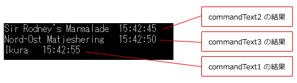

# [C#] 非同期操作を用いて、一度に複数のクエリを処理する
## Requires
- 
## License
- Apache License, Version 2.0
## Technologies
- ADO.NET
## Topics
- データ アクセス開発
- 逆引きサンプル コード
- データ型
## Updated
- 06/14/2011
## Description

執筆者: <a href="http://msdn.microsoft.com/ja-jp/gg585574#kodaka" target="_blank">
インフォシェア株式会社 小高 太郎</a>

動作確認環境: Visual Studio 2005 以上、.NET Framework 2.0 以上

ADO.NET 2.0 から追加された非同期操作を用いると、アプリケーションが長時間にわたるクエリの完了を待つことなく、次のクエリ コマンドを実行することが可能になります。

非同期操作には、同期メソッドに対応する非同期メソッドを用います。非同期メソッドには、処理を開始する Begin パートと、処理を終了する End パートの 2 つが存在しています。

<table border="1" cellspacing="0" cellpadding="5" width="100%" style="border-collapse:collapse; margin-bottom:10px">
<tbody>
<tr>
<td rowspan="2" valign="top" style="background-color:#eff3f7">同期メソッド</td>
<td colspan="2" valign="top" style="background-color:#eff3f7">非同期メソッド</td>
</tr>
<tr>
<td valign="top"><strong>Begin</strong> パート</td>
<td valign="top"><strong>End</strong> パート</td>
</tr>
<tr>
<td valign="top"><strong>ExecuteNonQuery</strong></td>
<td valign="top"><strong>BeginExecuteNonQuery</strong></td>
<td valign="top"><strong>EndExecuteNonQuery</strong></td>
</tr>
<tr>
<td valign="top"><strong>ExecuteReader</strong></td>
<td valign="top"><strong>BeginExecuteReader</strong></td>
<td valign="top"><strong>EndExecuteReader</strong></td>
</tr>
<tr>
<td valign="top"><strong>ExecuteXmlReader</strong></td>
<td valign="top"><strong>BeginExecuteXmlReader</strong></td>
<td valign="top"><strong>EndExecuteXmlReader</strong></td>
</tr>
</tbody>
</table>

非同期メソッドの終了を知るには、コールバック、待機ハンドル、ポーリングを用いた手法がありますが、ここでは、ExecuteReader と待機ハンドルを用いて複数のクエリを処理する方法を紹介します。

C#

スクリプトの編集|{#scriptcode_dlg.remove_script}

csharp
<pre class="hidden">using System.Threading;
using System.Data.SqlClient;
	
static void Main(string[] args)
{
    string ConnectionString = @&quot;Data Source=.;Integrated Security=SSPI;&quot; &#43;
                                &quot;Initial Catalog=Northwind;&quot; &#43;
                                &quot;Asynchronous Processing=true&quot;;
    using(SqlConnection cn1 = new SqlConnection(ConnectionString))
    using(SqlConnection cn2 = new SqlConnection(ConnectionString))
    using(SqlConnection cn3 = new SqlConnection(ConnectionString))
    {
        string commandText1 = &quot;WAITFOR DELAY '0:0:10';&quot; &#43;
                                &quot;SELECT * FROM Products WHERE ProductID = 10&quot;;
        string commandText2 = &quot;WAITFOR DELAY '0:0:00';&quot; &#43;
                                &quot;SELECT * FROM Products WHERE ProductID = 20&quot;;
        string commandText3 = &quot;WAITFOR DELAY '0:0:05';&quot; &#43;
                                &quot;SELECT * FROM Products WHERE ProductID = 30&quot;;
        cn1.Open();
        SqlCommand cmd1 = new SqlCommand(commandText1, cn1);
        IAsyncResult rst1 = cmd1.BeginExecuteReader();
        WaitHandle wH1 = rst1.AsyncWaitHandle;

        cn2.Open();
        SqlCommand cmd2 = new SqlCommand(commandText2, cn2);
        IAsyncResult rst2 = cmd2.BeginExecuteReader();
        WaitHandle wH2 = rst2.AsyncWaitHandle;

        cn3.Open();
        SqlCommand cmd3 = new SqlCommand(commandText3, cn3);
        IAsyncResult rst3 = cmd3.BeginExecuteReader();
        WaitHandle wH3 = rst3.AsyncWaitHandle;

        WaitHandle[] waitHandles = { wH1, wH2, wH3 };

        int index;
        for (int countWaits = 0; countWaits &lt;= 2; countWaits&#43;&#43;)
        {
            index = WaitHandle.WaitAny(waitHandles, 10000, false);

            switch (index)
            {
                case 0:
                    SqlDataReader dr1 = cmd1.EndExecuteReader(rst1);
                    DisplayReader(dr1);
                    break;
                case 1:
                    SqlDataReader dr2 = cmd2.EndExecuteReader(rst2);
                    DisplayReader(dr2);
                    break;
                case 2:
                    SqlDataReader dr3 = cmd3.EndExecuteReader(rst3);
                    DisplayReader(dr3);
                    break;
                case WaitHandle.WaitTimeout:
                    throw new Exception(&quot;タイムアウト&quot;);
            }
        }
    }
}

static void DisplayReader(SqlDataReader dr)
{
    if (dr.Read())
    {
        Console.WriteLine(dr[1].ToString() &#43; &quot;\t&quot; &#43; DateTime.Now.ToLongTimeString());
    }
    dr.Close();
}</pre>

<pre id="codePreview" class="csharp">using&nbsp;System.Threading;&nbsp;
using&nbsp;System.Data.SqlClient;&nbsp;
&nbsp;&nbsp;&nbsp;&nbsp;&nbsp;
static&nbsp;void&nbsp;Main(string[]&nbsp;args)&nbsp;
{&nbsp;
&nbsp;&nbsp;&nbsp;&nbsp;string&nbsp;ConnectionString&nbsp;=&nbsp;@&quot;Data&nbsp;Source=.;Integrated&nbsp;Security=SSPI;&quot;&nbsp;&#43;&nbsp;
&nbsp;&nbsp;&nbsp;&nbsp;&nbsp;&nbsp;&nbsp;&nbsp;&nbsp;&nbsp;&nbsp;&nbsp;&nbsp;&nbsp;&nbsp;&nbsp;&nbsp;&nbsp;&nbsp;&nbsp;&nbsp;&nbsp;&nbsp;&nbsp;&nbsp;&nbsp;&nbsp;&nbsp;&nbsp;&nbsp;&nbsp;&nbsp;&quot;Initial&nbsp;Catalog=Northwind;&quot;&nbsp;&#43;&nbsp;
&nbsp;&nbsp;&nbsp;&nbsp;&nbsp;&nbsp;&nbsp;&nbsp;&nbsp;&nbsp;&nbsp;&nbsp;&nbsp;&nbsp;&nbsp;&nbsp;&nbsp;&nbsp;&nbsp;&nbsp;&nbsp;&nbsp;&nbsp;&nbsp;&nbsp;&nbsp;&nbsp;&nbsp;&nbsp;&nbsp;&nbsp;&nbsp;&quot;Asynchronous&nbsp;Processing=true&quot;;&nbsp;
&nbsp;&nbsp;&nbsp;&nbsp;using(SqlConnection&nbsp;cn1&nbsp;=&nbsp;new&nbsp;SqlConnection(ConnectionString))&nbsp;
&nbsp;&nbsp;&nbsp;&nbsp;using(SqlConnection&nbsp;cn2&nbsp;=&nbsp;new&nbsp;SqlConnection(ConnectionString))&nbsp;
&nbsp;&nbsp;&nbsp;&nbsp;using(SqlConnection&nbsp;cn3&nbsp;=&nbsp;new&nbsp;SqlConnection(ConnectionString))&nbsp;
&nbsp;&nbsp;&nbsp;&nbsp;{&nbsp;
&nbsp;&nbsp;&nbsp;&nbsp;&nbsp;&nbsp;&nbsp;&nbsp;string&nbsp;commandText1&nbsp;=&nbsp;&quot;WAITFOR&nbsp;DELAY&nbsp;'0:0:10';&quot;&nbsp;&#43;&nbsp;
&nbsp;&nbsp;&nbsp;&nbsp;&nbsp;&nbsp;&nbsp;&nbsp;&nbsp;&nbsp;&nbsp;&nbsp;&nbsp;&nbsp;&nbsp;&nbsp;&nbsp;&nbsp;&nbsp;&nbsp;&nbsp;&nbsp;&nbsp;&nbsp;&nbsp;&nbsp;&nbsp;&nbsp;&nbsp;&nbsp;&nbsp;&nbsp;&quot;SELECT&nbsp;*&nbsp;FROM&nbsp;Products&nbsp;WHERE&nbsp;ProductID&nbsp;=&nbsp;10&quot;;&nbsp;
&nbsp;&nbsp;&nbsp;&nbsp;&nbsp;&nbsp;&nbsp;&nbsp;string&nbsp;commandText2&nbsp;=&nbsp;&quot;WAITFOR&nbsp;DELAY&nbsp;'0:0:00';&quot;&nbsp;&#43;&nbsp;
&nbsp;&nbsp;&nbsp;&nbsp;&nbsp;&nbsp;&nbsp;&nbsp;&nbsp;&nbsp;&nbsp;&nbsp;&nbsp;&nbsp;&nbsp;&nbsp;&nbsp;&nbsp;&nbsp;&nbsp;&nbsp;&nbsp;&nbsp;&nbsp;&nbsp;&nbsp;&nbsp;&nbsp;&nbsp;&nbsp;&nbsp;&nbsp;&quot;SELECT&nbsp;*&nbsp;FROM&nbsp;Products&nbsp;WHERE&nbsp;ProductID&nbsp;=&nbsp;20&quot;;&nbsp;
&nbsp;&nbsp;&nbsp;&nbsp;&nbsp;&nbsp;&nbsp;&nbsp;string&nbsp;commandText3&nbsp;=&nbsp;&quot;WAITFOR&nbsp;DELAY&nbsp;'0:0:05';&quot;&nbsp;&#43;&nbsp;
&nbsp;&nbsp;&nbsp;&nbsp;&nbsp;&nbsp;&nbsp;&nbsp;&nbsp;&nbsp;&nbsp;&nbsp;&nbsp;&nbsp;&nbsp;&nbsp;&nbsp;&nbsp;&nbsp;&nbsp;&nbsp;&nbsp;&nbsp;&nbsp;&nbsp;&nbsp;&nbsp;&nbsp;&nbsp;&nbsp;&nbsp;&nbsp;&quot;SELECT&nbsp;*&nbsp;FROM&nbsp;Products&nbsp;WHERE&nbsp;ProductID&nbsp;=&nbsp;30&quot;;&nbsp;
&nbsp;&nbsp;&nbsp;&nbsp;&nbsp;&nbsp;&nbsp;&nbsp;cn1.Open();&nbsp;
&nbsp;&nbsp;&nbsp;&nbsp;&nbsp;&nbsp;&nbsp;&nbsp;SqlCommand&nbsp;cmd1&nbsp;=&nbsp;new&nbsp;SqlCommand(commandText1,&nbsp;cn1);&nbsp;
&nbsp;&nbsp;&nbsp;&nbsp;&nbsp;&nbsp;&nbsp;&nbsp;IAsyncResult&nbsp;rst1&nbsp;=&nbsp;cmd1.BeginExecuteReader();&nbsp;
&nbsp;&nbsp;&nbsp;&nbsp;&nbsp;&nbsp;&nbsp;&nbsp;WaitHandle&nbsp;wH1&nbsp;=&nbsp;rst1.AsyncWaitHandle;&nbsp;
&nbsp;
&nbsp;&nbsp;&nbsp;&nbsp;&nbsp;&nbsp;&nbsp;&nbsp;cn2.Open();&nbsp;
&nbsp;&nbsp;&nbsp;&nbsp;&nbsp;&nbsp;&nbsp;&nbsp;SqlCommand&nbsp;cmd2&nbsp;=&nbsp;new&nbsp;SqlCommand(commandText2,&nbsp;cn2);&nbsp;
&nbsp;&nbsp;&nbsp;&nbsp;&nbsp;&nbsp;&nbsp;&nbsp;IAsyncResult&nbsp;rst2&nbsp;=&nbsp;cmd2.BeginExecuteReader();&nbsp;
&nbsp;&nbsp;&nbsp;&nbsp;&nbsp;&nbsp;&nbsp;&nbsp;WaitHandle&nbsp;wH2&nbsp;=&nbsp;rst2.AsyncWaitHandle;&nbsp;
&nbsp;
&nbsp;&nbsp;&nbsp;&nbsp;&nbsp;&nbsp;&nbsp;&nbsp;cn3.Open();&nbsp;
&nbsp;&nbsp;&nbsp;&nbsp;&nbsp;&nbsp;&nbsp;&nbsp;SqlCommand&nbsp;cmd3&nbsp;=&nbsp;new&nbsp;SqlCommand(commandText3,&nbsp;cn3);&nbsp;
&nbsp;&nbsp;&nbsp;&nbsp;&nbsp;&nbsp;&nbsp;&nbsp;IAsyncResult&nbsp;rst3&nbsp;=&nbsp;cmd3.BeginExecuteReader();&nbsp;
&nbsp;&nbsp;&nbsp;&nbsp;&nbsp;&nbsp;&nbsp;&nbsp;WaitHandle&nbsp;wH3&nbsp;=&nbsp;rst3.AsyncWaitHandle;&nbsp;
&nbsp;
&nbsp;&nbsp;&nbsp;&nbsp;&nbsp;&nbsp;&nbsp;&nbsp;WaitHandle[]&nbsp;waitHandles&nbsp;=&nbsp;{&nbsp;wH1,&nbsp;wH2,&nbsp;wH3&nbsp;};&nbsp;
&nbsp;
&nbsp;&nbsp;&nbsp;&nbsp;&nbsp;&nbsp;&nbsp;&nbsp;int&nbsp;index;&nbsp;
&nbsp;&nbsp;&nbsp;&nbsp;&nbsp;&nbsp;&nbsp;&nbsp;for&nbsp;(int&nbsp;countWaits&nbsp;=&nbsp;0;&nbsp;countWaits&nbsp;&lt;=&nbsp;2;&nbsp;countWaits&#43;&#43;)&nbsp;
&nbsp;&nbsp;&nbsp;&nbsp;&nbsp;&nbsp;&nbsp;&nbsp;{&nbsp;
&nbsp;&nbsp;&nbsp;&nbsp;&nbsp;&nbsp;&nbsp;&nbsp;&nbsp;&nbsp;&nbsp;&nbsp;index&nbsp;=&nbsp;WaitHandle.WaitAny(waitHandles,&nbsp;10000,&nbsp;false);&nbsp;
&nbsp;
&nbsp;&nbsp;&nbsp;&nbsp;&nbsp;&nbsp;&nbsp;&nbsp;&nbsp;&nbsp;&nbsp;&nbsp;switch&nbsp;(index)&nbsp;
&nbsp;&nbsp;&nbsp;&nbsp;&nbsp;&nbsp;&nbsp;&nbsp;&nbsp;&nbsp;&nbsp;&nbsp;{&nbsp;
&nbsp;&nbsp;&nbsp;&nbsp;&nbsp;&nbsp;&nbsp;&nbsp;&nbsp;&nbsp;&nbsp;&nbsp;&nbsp;&nbsp;&nbsp;&nbsp;case&nbsp;0:&nbsp;
&nbsp;&nbsp;&nbsp;&nbsp;&nbsp;&nbsp;&nbsp;&nbsp;&nbsp;&nbsp;&nbsp;&nbsp;&nbsp;&nbsp;&nbsp;&nbsp;&nbsp;&nbsp;&nbsp;&nbsp;SqlDataReader&nbsp;dr1&nbsp;=&nbsp;cmd1.EndExecuteReader(rst1);&nbsp;
&nbsp;&nbsp;&nbsp;&nbsp;&nbsp;&nbsp;&nbsp;&nbsp;&nbsp;&nbsp;&nbsp;&nbsp;&nbsp;&nbsp;&nbsp;&nbsp;&nbsp;&nbsp;&nbsp;&nbsp;DisplayReader(dr1);&nbsp;
&nbsp;&nbsp;&nbsp;&nbsp;&nbsp;&nbsp;&nbsp;&nbsp;&nbsp;&nbsp;&nbsp;&nbsp;&nbsp;&nbsp;&nbsp;&nbsp;&nbsp;&nbsp;&nbsp;&nbsp;break;&nbsp;
&nbsp;&nbsp;&nbsp;&nbsp;&nbsp;&nbsp;&nbsp;&nbsp;&nbsp;&nbsp;&nbsp;&nbsp;&nbsp;&nbsp;&nbsp;&nbsp;case&nbsp;1:&nbsp;
&nbsp;&nbsp;&nbsp;&nbsp;&nbsp;&nbsp;&nbsp;&nbsp;&nbsp;&nbsp;&nbsp;&nbsp;&nbsp;&nbsp;&nbsp;&nbsp;&nbsp;&nbsp;&nbsp;&nbsp;SqlDataReader&nbsp;dr2&nbsp;=&nbsp;cmd2.EndExecuteReader(rst2);&nbsp;
&nbsp;&nbsp;&nbsp;&nbsp;&nbsp;&nbsp;&nbsp;&nbsp;&nbsp;&nbsp;&nbsp;&nbsp;&nbsp;&nbsp;&nbsp;&nbsp;&nbsp;&nbsp;&nbsp;&nbsp;DisplayReader(dr2);&nbsp;
&nbsp;&nbsp;&nbsp;&nbsp;&nbsp;&nbsp;&nbsp;&nbsp;&nbsp;&nbsp;&nbsp;&nbsp;&nbsp;&nbsp;&nbsp;&nbsp;&nbsp;&nbsp;&nbsp;&nbsp;break;&nbsp;
&nbsp;&nbsp;&nbsp;&nbsp;&nbsp;&nbsp;&nbsp;&nbsp;&nbsp;&nbsp;&nbsp;&nbsp;&nbsp;&nbsp;&nbsp;&nbsp;case&nbsp;2:&nbsp;
&nbsp;&nbsp;&nbsp;&nbsp;&nbsp;&nbsp;&nbsp;&nbsp;&nbsp;&nbsp;&nbsp;&nbsp;&nbsp;&nbsp;&nbsp;&nbsp;&nbsp;&nbsp;&nbsp;&nbsp;SqlDataReader&nbsp;dr3&nbsp;=&nbsp;cmd3.EndExecuteReader(rst3);&nbsp;
&nbsp;&nbsp;&nbsp;&nbsp;&nbsp;&nbsp;&nbsp;&nbsp;&nbsp;&nbsp;&nbsp;&nbsp;&nbsp;&nbsp;&nbsp;&nbsp;&nbsp;&nbsp;&nbsp;&nbsp;DisplayReader(dr3);&nbsp;
&nbsp;&nbsp;&nbsp;&nbsp;&nbsp;&nbsp;&nbsp;&nbsp;&nbsp;&nbsp;&nbsp;&nbsp;&nbsp;&nbsp;&nbsp;&nbsp;&nbsp;&nbsp;&nbsp;&nbsp;break;&nbsp;
&nbsp;&nbsp;&nbsp;&nbsp;&nbsp;&nbsp;&nbsp;&nbsp;&nbsp;&nbsp;&nbsp;&nbsp;&nbsp;&nbsp;&nbsp;&nbsp;case&nbsp;WaitHandle.WaitTimeout:&nbsp;
&nbsp;&nbsp;&nbsp;&nbsp;&nbsp;&nbsp;&nbsp;&nbsp;&nbsp;&nbsp;&nbsp;&nbsp;&nbsp;&nbsp;&nbsp;&nbsp;&nbsp;&nbsp;&nbsp;&nbsp;throw&nbsp;new&nbsp;Exception(&quot;タイムアウト&quot;);&nbsp;
&nbsp;&nbsp;&nbsp;&nbsp;&nbsp;&nbsp;&nbsp;&nbsp;&nbsp;&nbsp;&nbsp;&nbsp;}&nbsp;
&nbsp;&nbsp;&nbsp;&nbsp;&nbsp;&nbsp;&nbsp;&nbsp;}&nbsp;
&nbsp;&nbsp;&nbsp;&nbsp;}&nbsp;
}&nbsp;
&nbsp;
static&nbsp;void&nbsp;DisplayReader(SqlDataReader&nbsp;dr)&nbsp;
{&nbsp;
&nbsp;&nbsp;&nbsp;&nbsp;if&nbsp;(dr.Read())&nbsp;
&nbsp;&nbsp;&nbsp;&nbsp;{&nbsp;
&nbsp;&nbsp;&nbsp;&nbsp;&nbsp;&nbsp;&nbsp;&nbsp;Console.WriteLine(dr[1].ToString()&nbsp;&#43;&nbsp;&quot;\t&quot;&nbsp;&#43;&nbsp;DateTime.Now.ToLongTimeString());&nbsp;
&nbsp;&nbsp;&nbsp;&nbsp;}&nbsp;
&nbsp;&nbsp;&nbsp;&nbsp;dr.Close();&nbsp;
}</pre>

上記の手法は、Wait (Any) モデルと呼ばれ、3 つの異なる接続を用いて、それぞれ別のクエリを行い、いずれかが終了したタイミングで EndExecuteReader メソッドを実行する形になります。(これとは別に、Wait (ALL) と呼ばれる、全ての終了を待つモデルも存在します。)

実行すると、commandText2、commandText3、commandText1 の順番に処理されるのが分かります。これは、SQL の中に WAITFOR DELAY が指定してあるためです。

<h2 style="margin-top:30px; font-size:120%">参考リンク</h2>
<ul>
<li><a href="http://msdn.microsoft.com/ja-jp/library/zw97wx20.aspx" target="_blank">非同期操作 (ADO.NET)</a>
</li></ul>

<table>
<tbody>
<tr>
<td></td>
<td></td>
<td>
<ul>
<li>もっと他のコンテンツを見る &gt;&gt; <a href="/ja-jp/ff363212" target="_blank">逆引きサンプル コード一覧へ</a>
</li><li>もっと他のレシピを見る &gt;&gt; <a href="/ja-jp">Code Recipe へ</a> </li><li>もっと データ アクセス の情報を見る &gt;&gt; <a href="/ja-jp/data" target="_blank">データ アクセス デベロッパー センターへ</a>
</li></ul>
</td>
</tr>
</tbody>
</table>

<a href="#top"> ページのトップへ</a>

-------------------------------------------------------------------------------------------------------------

-------------------------------------------------------------------------------------------------------

