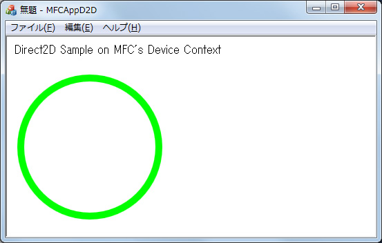

# [C++] MFC アプリケーションのビューの中で、Direct2D を使用する
## Requires
- 
## License
- Apache License, Version 2.0
## Technologies
- Direct2D
- MFC
- Visual Studio 2010
- Windows 7
- DirectX
## Topics
- 逆引きサンプル コード
- Visual C++ プログラミング
- 2 次元グラフィックス
## Updated
- 09/08/2011
## Description

執筆者: <a href="http://msdn.microsoft.com/ja-jp/gg585574#yajima" target="_blank">
エディフィストラーニング株式会社 矢嶋 聡</a>

動作確認環境: Visual Studio 2010 (MFC を利用できるエディション、Express よりも上位のエディション) 、Windows 7 において検&#35388; (Direct2D を利用可能な Windows OS であれば利用可能)

ここでは、次の図 10.1 に示すように、MFC アプリケーションのビュー (CView) のクライアント領域に、従来の GDI のデバイス コンテキスト (CDC) を使用して文字列を表示するほか、同じデバイス コンテキストを使用して Direct2D による図形を表示する方法を示します。

<strong>図 10.1 CDC を使用してビュー上に GDI のテキストと Direct2D の図形を表示する</strong>

作成の手間を減らすため、まずは Visual C&#43;&#43; 2010 の MFC アプリケーション プロジェクトの新規作成を開始し (プロジェクト名は「MFCAppD2D」)、MFC アプリケーション ウィザードを起動して、以下の設定で、単一のウィンドウを持つ SDI アプリケーションを作成します。Direct2D の使用方法の要点を把握しやすくするために、ウィザードで選択する機能オプションは、単純なものを選んでいます。

<ul>
<li style="margin-bottom:8px">「アプリケーションの種類」ページ 

「アプリケーションの種類」として [シングル ドキュメント] (SDI) を選択する 
「プロジェクト形式」として [MFC 標準] を選択する 
[visual スタイルの切り替えを有効にする] チェック ボックスを解除する

</li><li style="margin-bottom:8px">「複合ドキュメントのサポート」ページ 

既定値のまま「なし」を選択する

</li><li style="margin-bottom:8px">「ドキュメント テンプレート プロパティ」ページ 

既定値のまま何も入力しない

</li><li style="margin-bottom:8px">「データベース サポート」ページ 

既定値のまま「なし」を選択する

</li><li style="margin-bottom:8px">「ユーザー インターフェイス機能」ページ 

左の [初期ステータスバー] チェック ボックスを解除する 
右の [クラシック メニューを使用する] オプションを選択する

</li><li style="margin-bottom:8px">「高度な機能」ページ 

既定値のままにする

</li><li style="margin-bottom:8px">「生成されたクラス」ページ 

既定値のままのクラス名を使用する

</li></ul>

Direct2D のインポート ライブラリ「D2d1.lib」をリンカーが使用できるようにするため、以下の設定をします。

<ul>
<li style="margin-bottom:8px">プロジェクト プロパティ ページを開くため、ソリューション エクスプローラー上で「MFCAppD2D」プロジェクトを右クリックして、[プロパティ] をクリックします。
</li><li style="margin-bottom:8px">プロジェクト プロパティ ページの左側のツリーで、[構成プロパティ]、[リンカー]、[入力] の順にクリックして展開した後、右側の「追加の依存ファイル」の欄に、次図 10.2 と同じになるように「D2d1.lib」を追加します (この「追加の依存ファイル」の行の右端のドロップダウン リストから「&lt;編集...&gt;」をクリックすれば、対話形式でこのライブラリ名を入力できます)。
</li></ul>

<strong>図 10.2 Direct2D のライブラリを利用可能にする</strong>

Direct2D のヘッダーをインクルードするため、ファイル stdafx.h の末尾に、次のようにディレクティブを追加します。

<strong>例1. ファイル: stdafx.h</strong>

C&#43;&#43;

スクリプトの編集|Remove

cplusplus
<pre class="hidden"> // [省略]
 
 //◆◆追加
 #include &lt;D2d1.h&gt;</pre>

<pre id="codePreview" class="vb">&nbsp;//&nbsp;[省略]&nbsp;
&nbsp;&nbsp;
&nbsp;//◆◆追加&nbsp;
&nbsp;#include&nbsp;&lt;D2d1.h&gt;</pre>

&nbsp;最後に、例 2 および例 3 に示すように、ビュー クラスに対して追加と修正を行います。

<strong>例 2. ファイル: MFCAppD2DView.h</strong>

C&#43;&#43;

スクリプトの編集|Remove

cplusplus
<pre class="hidden">// MFCAppD2DView.h : CMFCAppD2DView クラスのインターフェイス
 //
 
 #pragma once
 
 
 class CMFCAppD2DView : public CView
 {
 
 // [省略]

 //◆◆追加
 private:
     ID2D1Factory* m_pD2DFactory;             // Direct2Dファクトリ オブジェクト &larr;[1]
     ID2D1DCRenderTarget* m_pDCRenderTarget;  // DC互換のレンダー ターゲット  &larr;[2]
     ID2D1SolidColorBrush* m_pGreenBrush;     // 描画で利用するブラシ  &larr;[3]
 private:
     HRESULT CreateDeviceIndependentResources();  // デバイス非依存の初期化 &larr;[4]
     HRESULT CreateDeviceResources();             // デバイス依存の初期化  &larr; [5]
     void Render(HDC hDC, LPRECT pRect);      // 描画  &larr;[6]
     void DeleteDeviceResources();            // デバイス依存の後処理    &larr;[7]
     void DeleteDeviceIndependentResources(); // デバイス非依存の後処理  &larr;[8]
};

// [省略]</pre>

<pre id="codePreview" class="vb">//&nbsp;MFCAppD2DView.h&nbsp;:&nbsp;CMFCAppD2DView&nbsp;クラスのインターフェイス&nbsp;
&nbsp;//&nbsp;
&nbsp;&nbsp;
&nbsp;#pragma&nbsp;once&nbsp;
&nbsp;&nbsp;
&nbsp;&nbsp;
&nbsp;class&nbsp;CMFCAppD2DView&nbsp;:&nbsp;public&nbsp;CView&nbsp;
&nbsp;{&nbsp;
&nbsp;&nbsp;
&nbsp;//&nbsp;[省略]&nbsp;
&nbsp;
&nbsp;//◆◆追加&nbsp;
&nbsp;private:&nbsp;
&nbsp;&nbsp;&nbsp;&nbsp;&nbsp;ID2D1Factory*&nbsp;m_pD2DFactory;&nbsp;&nbsp;&nbsp;&nbsp;&nbsp;&nbsp;&nbsp;&nbsp;&nbsp;&nbsp;&nbsp;&nbsp;&nbsp;//&nbsp;Direct2Dファクトリ&nbsp;オブジェクト&nbsp;&larr;[1]&nbsp;
&nbsp;&nbsp;&nbsp;&nbsp;&nbsp;ID2D1DCRenderTarget*&nbsp;m_pDCRenderTarget;&nbsp;&nbsp;//&nbsp;DC互換のレンダー&nbsp;ターゲット&nbsp;&nbsp;&larr;[2]&nbsp;
&nbsp;&nbsp;&nbsp;&nbsp;&nbsp;ID2D1SolidColorBrush*&nbsp;m_pGreenBrush;&nbsp;&nbsp;&nbsp;&nbsp;&nbsp;//&nbsp;描画で利用するブラシ&nbsp;&nbsp;&larr;[3]&nbsp;
&nbsp;private:&nbsp;
&nbsp;&nbsp;&nbsp;&nbsp;&nbsp;HRESULT&nbsp;CreateDeviceIndependentResources();&nbsp;&nbsp;//&nbsp;デバイス非依存の初期化&nbsp;&larr;[4]&nbsp;
&nbsp;&nbsp;&nbsp;&nbsp;&nbsp;HRESULT&nbsp;CreateDeviceResources();&nbsp;&nbsp;&nbsp;&nbsp;&nbsp;&nbsp;&nbsp;&nbsp;&nbsp;&nbsp;&nbsp;&nbsp;&nbsp;//&nbsp;デバイス依存の初期化&nbsp;&nbsp;&larr;&nbsp;[5]&nbsp;
&nbsp;&nbsp;&nbsp;&nbsp;&nbsp;void&nbsp;Render(HDC&nbsp;hDC,&nbsp;LPRECT&nbsp;pRect);&nbsp;&nbsp;&nbsp;&nbsp;&nbsp;&nbsp;//&nbsp;描画&nbsp;&nbsp;&larr;[6]&nbsp;
&nbsp;&nbsp;&nbsp;&nbsp;&nbsp;void&nbsp;DeleteDeviceResources();&nbsp;&nbsp;&nbsp;&nbsp;&nbsp;&nbsp;&nbsp;&nbsp;&nbsp;&nbsp;&nbsp;&nbsp;//&nbsp;デバイス依存の後処理&nbsp;&nbsp;&nbsp;&nbsp;&larr;[7]&nbsp;
&nbsp;&nbsp;&nbsp;&nbsp;&nbsp;void&nbsp;DeleteDeviceIndependentResources();&nbsp;//&nbsp;デバイス非依存の後処理&nbsp;&nbsp;&larr;[8]&nbsp;
};&nbsp;
&nbsp;
//&nbsp;[省略]</pre>

<strong>例 3. ファイル: MFCAppD2DView.cpp </strong>

C&#43;&#43;

スクリプトの編集|Remove

cplusplus
<pre class="hidden">// [省略]

 // CMFCAppD2DView コンストラクション/デストラクション
 // ◆◆修正
 CMFCAppD2DView::CMFCAppD2DView()
     : m_pD2DFactory(NULL), m_pDCRenderTarget(NULL), m_pGreenBrush(NULL)  //&larr;[9]
 {
     CreateDeviceIndependentResources();  //&larr;[10]
}

 CMFCAppD2DView::~CMFCAppD2DView()
 {
     DeleteDeviceResources();             //&larr;[11]
     DeleteDeviceIndependentResources();  //&larr;[12]
}

// [省略]

 // CMFCAppD2DView 描画
 // ◆◆OnDrawメンバー関数を修正
 void CMFCAppD2DView::OnDraw(CDC* pDC)  //&larr;[13]
 {
     CMFCAppD2DDoc* pDoc = GetDocument();
     ASSERT_VALID(pDoc);
     if (!pDoc)
         return;
 
     //◆◆追加
     CString str(_T(&quot;Direct2D Sample on MFC's Device Context&quot;));
     pDC-&gt;DrawText(str, CRect(10,10,400,40), DT_LEFT);  //&larr;[14]
     //
     RECT rect;
     this-&gt;GetClientRect(&amp;rect);       //&larr;[15]
     rect.top &#43;= 40;                   //&larr;[16]
     Render(pDC-&gt;GetSafeHdc(), &amp;rect); //&larr;[17]
     //
}

// [省略]

// ◆◆以下の関数実装を追加

 // デバイス非依存の初期化
 HRESULT CMFCAppD2DView::CreateDeviceIndependentResources()
 {
     HRESULT hr;
     // Direct2D Factoryの作成
     hr = ::D2D1CreateFactory(
         D2D1_FACTORY_TYPE_SINGLE_THREADED,
         IID_ID2D1Factory,
         (void**) &amp;m_pD2DFactory);
     return hr;
 }
 
 // デバイス依存の初期化
 HRESULT CMFCAppD2DView::CreateDeviceResources()  //&larr;[18]
 {
     HRESULT hr = S_OK;
 
     // ファクトリが無ければ何もしない
     if( m_pD2DFactory == NULL) return E_FAIL;
 
     // DC互換のレンダー ターゲットの作成
    if(  m_pDCRenderTarget == NULL)
     {
         D2D1_RENDER_TARGET_PROPERTIES props =
             D2D1::RenderTargetProperties(
                 D2D1_RENDER_TARGET_TYPE_DEFAULT,
                 D2D1::PixelFormat(
                     DXGI_FORMAT_B8G8R8A8_UNORM,
                     D2D1_ALPHA_MODE_IGNORE
                 ) , 0.0F, 0.0F,
                 D2D1_RENDER_TARGET_USAGE_GDI_COMPATIBLE
             );
         hr = m_pD2DFactory-&gt;CreateDCRenderTarget(  //&larr;[19]
                 &amp;props, &amp;m_pDCRenderTarget);
         if(!SUCCEEDED(hr)) return hr;
     }
     // ブラシの作成
     if(m_pGreenBrush == NULL)
     {
         ASSERT(m_pDCRenderTarget != NULL);
         hr = m_pDCRenderTarget-&gt;CreateSolidColorBrush(
                 D2D1::ColorF(0.0, 1.0, 0.0), &amp;m_pGreenBrush);
         if(!SUCCEEDED(hr)) return hr;
     }
 
     // 必要なデバイス依存のリソースはここに追加
 
     return hr;
 }
 
 // 描画
 void CMFCAppD2DView::Render(HDC hDC, LPRECT pRect)  //&larr;[20]
 {
     HRESULT hr;
 
     hr = CreateDeviceResources();  //&larr;[21]
     if(!SUCCEEDED(hr)) return;
 
     ASSERT(m_pD2DFactory != NULL &amp;&amp; 
            m_pDCRenderTarget != NULL &amp;&amp;
            m_pGreenBrush != NULL);
 
     hr = m_pDCRenderTarget-&gt;BindDC(hDC, pRect);  //&larr;[22]
 
     m_pDCRenderTarget-&gt;BeginDraw(); //&larr;[23]
 
     m_pDCRenderTarget-&gt;Clear(D2D1::ColorF(1.0F, 1.0F, 1.0F));
     D2D1_ELLIPSE ellipse1 =
         D2D1::Ellipse(D2D1::Point2F(120.0F, 120.0F), 100.0F, 100.0F);
     m_pDCRenderTarget-&gt;DrawEllipse(ellipse1, m_pGreenBrush, 10.0F);
 
     m_pDCRenderTarget-&gt;EndDraw();  //&larr;[24]
 }
 
 // デバイス依存の後処理
 void CMFCAppD2DView::DeleteDeviceResources()
 {
     if(m_pDCRenderTarget != NULL)
     {
         m_pDCRenderTarget-&gt;Release();
         m_pDCRenderTarget = NULL;
     }
 }
 
 // デバイス非依存の後処理
 void CMFCAppD2DView::DeleteDeviceIndependentResources()
 {
     if(m_pGreenBrush != NULL)
     {
         m_pGreenBrush-&gt;Release();
         m_pGreenBrush = NULL;
     }
     if(m_pD2DFactory != NULL)
     {
         m_pD2DFactory-&gt;Release();
         m_pD2DFactory = NULL;
     }
 }</pre>

<pre id="codePreview" class="vb">//&nbsp;[省略]&nbsp;
&nbsp;
&nbsp;//&nbsp;CMFCAppD2DView&nbsp;コンストラクション/デストラクション&nbsp;
&nbsp;//&nbsp;◆◆修正&nbsp;
&nbsp;CMFCAppD2DView::CMFCAppD2DView()&nbsp;
&nbsp;&nbsp;&nbsp;&nbsp;&nbsp;:&nbsp;m_pD2DFactory(NULL),&nbsp;m_pDCRenderTarget(NULL),&nbsp;m_pGreenBrush(NULL)&nbsp;&nbsp;//&larr;[9]&nbsp;
&nbsp;{&nbsp;
&nbsp;&nbsp;&nbsp;&nbsp;&nbsp;CreateDeviceIndependentResources();&nbsp;&nbsp;//&larr;[10]&nbsp;
}&nbsp;
&nbsp;
&nbsp;CMFCAppD2DView::~CMFCAppD2DView()&nbsp;
&nbsp;{&nbsp;
&nbsp;&nbsp;&nbsp;&nbsp;&nbsp;DeleteDeviceResources();&nbsp;&nbsp;&nbsp;&nbsp;&nbsp;&nbsp;&nbsp;&nbsp;&nbsp;&nbsp;&nbsp;&nbsp;&nbsp;//&larr;[11]&nbsp;
&nbsp;&nbsp;&nbsp;&nbsp;&nbsp;DeleteDeviceIndependentResources();&nbsp;&nbsp;//&larr;[12]&nbsp;
}&nbsp;
&nbsp;
//&nbsp;[省略]&nbsp;
&nbsp;
&nbsp;//&nbsp;CMFCAppD2DView&nbsp;描画&nbsp;
&nbsp;//&nbsp;◆◆OnDrawメンバー関数を修正&nbsp;
&nbsp;void&nbsp;CMFCAppD2DView::OnDraw(CDC*&nbsp;pDC)&nbsp;&nbsp;//&larr;[13]&nbsp;
&nbsp;{&nbsp;
&nbsp;&nbsp;&nbsp;&nbsp;&nbsp;CMFCAppD2DDoc*&nbsp;pDoc&nbsp;=&nbsp;GetDocument();&nbsp;
&nbsp;&nbsp;&nbsp;&nbsp;&nbsp;ASSERT_VALID(pDoc);&nbsp;
&nbsp;&nbsp;&nbsp;&nbsp;&nbsp;if&nbsp;(!pDoc)&nbsp;
&nbsp;&nbsp;&nbsp;&nbsp;&nbsp;&nbsp;&nbsp;&nbsp;&nbsp;return;&nbsp;
&nbsp;&nbsp;
&nbsp;&nbsp;&nbsp;&nbsp;&nbsp;//◆◆追加&nbsp;
&nbsp;&nbsp;&nbsp;&nbsp;&nbsp;CString&nbsp;str(_T(&quot;Direct2D&nbsp;Sample&nbsp;on&nbsp;MFC's&nbsp;Device&nbsp;Context&quot;));&nbsp;
&nbsp;&nbsp;&nbsp;&nbsp;&nbsp;pDC-&gt;DrawText(str,&nbsp;CRect(10,10,400,40),&nbsp;DT_LEFT);&nbsp;&nbsp;//&larr;[14]&nbsp;
&nbsp;&nbsp;&nbsp;&nbsp;&nbsp;//&nbsp;
&nbsp;&nbsp;&nbsp;&nbsp;&nbsp;RECT&nbsp;rect;&nbsp;
&nbsp;&nbsp;&nbsp;&nbsp;&nbsp;this-&gt;GetClientRect(&amp;rect);&nbsp;&nbsp;&nbsp;&nbsp;&nbsp;&nbsp;&nbsp;//&larr;[15]&nbsp;
&nbsp;&nbsp;&nbsp;&nbsp;&nbsp;rect.top&nbsp;&#43;=&nbsp;40;&nbsp;&nbsp;&nbsp;&nbsp;&nbsp;&nbsp;&nbsp;&nbsp;&nbsp;&nbsp;&nbsp;&nbsp;&nbsp;&nbsp;&nbsp;&nbsp;&nbsp;&nbsp;&nbsp;//&larr;[16]&nbsp;
&nbsp;&nbsp;&nbsp;&nbsp;&nbsp;Render(pDC-&gt;GetSafeHdc(),&nbsp;&amp;rect);&nbsp;//&larr;[17]&nbsp;
&nbsp;&nbsp;&nbsp;&nbsp;&nbsp;//&nbsp;
}&nbsp;
&nbsp;
//&nbsp;[省略]&nbsp;
&nbsp;
//&nbsp;◆◆以下の関数実装を追加&nbsp;
&nbsp;
&nbsp;//&nbsp;デバイス非依存の初期化&nbsp;
&nbsp;HRESULT&nbsp;CMFCAppD2DView::CreateDeviceIndependentResources()&nbsp;
&nbsp;{&nbsp;
&nbsp;&nbsp;&nbsp;&nbsp;&nbsp;HRESULT&nbsp;hr;&nbsp;
&nbsp;&nbsp;&nbsp;&nbsp;&nbsp;//&nbsp;Direct2D&nbsp;Factoryの作成&nbsp;
&nbsp;&nbsp;&nbsp;&nbsp;&nbsp;hr&nbsp;=&nbsp;::D2D1CreateFactory(&nbsp;
&nbsp;&nbsp;&nbsp;&nbsp;&nbsp;&nbsp;&nbsp;&nbsp;&nbsp;D2D1_FACTORY_TYPE_SINGLE_THREADED,&nbsp;
&nbsp;&nbsp;&nbsp;&nbsp;&nbsp;&nbsp;&nbsp;&nbsp;&nbsp;IID_ID2D1Factory,&nbsp;
&nbsp;&nbsp;&nbsp;&nbsp;&nbsp;&nbsp;&nbsp;&nbsp;&nbsp;(void**)&nbsp;&amp;m_pD2DFactory);&nbsp;
&nbsp;&nbsp;&nbsp;&nbsp;&nbsp;return&nbsp;hr;&nbsp;
&nbsp;}&nbsp;
&nbsp;&nbsp;
&nbsp;//&nbsp;デバイス依存の初期化&nbsp;
&nbsp;HRESULT&nbsp;CMFCAppD2DView::CreateDeviceResources()&nbsp;&nbsp;//&larr;[18]&nbsp;
&nbsp;{&nbsp;
&nbsp;&nbsp;&nbsp;&nbsp;&nbsp;HRESULT&nbsp;hr&nbsp;=&nbsp;S_OK;&nbsp;
&nbsp;&nbsp;
&nbsp;&nbsp;&nbsp;&nbsp;&nbsp;//&nbsp;ファクトリが無ければ何もしない&nbsp;
&nbsp;&nbsp;&nbsp;&nbsp;&nbsp;if(&nbsp;m_pD2DFactory&nbsp;==&nbsp;NULL)&nbsp;return&nbsp;E_FAIL;&nbsp;
&nbsp;&nbsp;
&nbsp;&nbsp;&nbsp;&nbsp;&nbsp;//&nbsp;DC互換のレンダー&nbsp;ターゲットの作成&nbsp;
&nbsp;&nbsp;&nbsp;&nbsp;if(&nbsp;&nbsp;m_pDCRenderTarget&nbsp;==&nbsp;NULL)&nbsp;
&nbsp;&nbsp;&nbsp;&nbsp;&nbsp;{&nbsp;
&nbsp;&nbsp;&nbsp;&nbsp;&nbsp;&nbsp;&nbsp;&nbsp;&nbsp;D2D1_RENDER_TARGET_PROPERTIES&nbsp;props&nbsp;=&nbsp;
&nbsp;&nbsp;&nbsp;&nbsp;&nbsp;&nbsp;&nbsp;&nbsp;&nbsp;&nbsp;&nbsp;&nbsp;&nbsp;D2D1::RenderTargetProperties(&nbsp;
&nbsp;&nbsp;&nbsp;&nbsp;&nbsp;&nbsp;&nbsp;&nbsp;&nbsp;&nbsp;&nbsp;&nbsp;&nbsp;&nbsp;&nbsp;&nbsp;&nbsp;D2D1_RENDER_TARGET_TYPE_DEFAULT,&nbsp;
&nbsp;&nbsp;&nbsp;&nbsp;&nbsp;&nbsp;&nbsp;&nbsp;&nbsp;&nbsp;&nbsp;&nbsp;&nbsp;&nbsp;&nbsp;&nbsp;&nbsp;D2D1::PixelFormat(&nbsp;
&nbsp;&nbsp;&nbsp;&nbsp;&nbsp;&nbsp;&nbsp;&nbsp;&nbsp;&nbsp;&nbsp;&nbsp;&nbsp;&nbsp;&nbsp;&nbsp;&nbsp;&nbsp;&nbsp;&nbsp;&nbsp;DXGI_FORMAT_B8G8R8A8_UNORM,&nbsp;
&nbsp;&nbsp;&nbsp;&nbsp;&nbsp;&nbsp;&nbsp;&nbsp;&nbsp;&nbsp;&nbsp;&nbsp;&nbsp;&nbsp;&nbsp;&nbsp;&nbsp;&nbsp;&nbsp;&nbsp;&nbsp;D2D1_ALPHA_MODE_IGNORE&nbsp;
&nbsp;&nbsp;&nbsp;&nbsp;&nbsp;&nbsp;&nbsp;&nbsp;&nbsp;&nbsp;&nbsp;&nbsp;&nbsp;&nbsp;&nbsp;&nbsp;&nbsp;)&nbsp;,&nbsp;0.0F,&nbsp;0.0F,&nbsp;
&nbsp;&nbsp;&nbsp;&nbsp;&nbsp;&nbsp;&nbsp;&nbsp;&nbsp;&nbsp;&nbsp;&nbsp;&nbsp;&nbsp;&nbsp;&nbsp;&nbsp;D2D1_RENDER_TARGET_USAGE_GDI_COMPATIBLE&nbsp;
&nbsp;&nbsp;&nbsp;&nbsp;&nbsp;&nbsp;&nbsp;&nbsp;&nbsp;&nbsp;&nbsp;&nbsp;&nbsp;);&nbsp;
&nbsp;&nbsp;&nbsp;&nbsp;&nbsp;&nbsp;&nbsp;&nbsp;&nbsp;hr&nbsp;=&nbsp;m_pD2DFactory-&gt;CreateDCRenderTarget(&nbsp;&nbsp;//&larr;[19]&nbsp;
&nbsp;&nbsp;&nbsp;&nbsp;&nbsp;&nbsp;&nbsp;&nbsp;&nbsp;&nbsp;&nbsp;&nbsp;&nbsp;&nbsp;&nbsp;&nbsp;&nbsp;&amp;props,&nbsp;&amp;m_pDCRenderTarget);&nbsp;
&nbsp;&nbsp;&nbsp;&nbsp;&nbsp;&nbsp;&nbsp;&nbsp;&nbsp;if(!SUCCEEDED(hr))&nbsp;return&nbsp;hr;&nbsp;
&nbsp;&nbsp;&nbsp;&nbsp;&nbsp;}&nbsp;
&nbsp;&nbsp;&nbsp;&nbsp;&nbsp;//&nbsp;ブラシの作成&nbsp;
&nbsp;&nbsp;&nbsp;&nbsp;&nbsp;if(m_pGreenBrush&nbsp;==&nbsp;NULL)&nbsp;
&nbsp;&nbsp;&nbsp;&nbsp;&nbsp;{&nbsp;
&nbsp;&nbsp;&nbsp;&nbsp;&nbsp;&nbsp;&nbsp;&nbsp;&nbsp;ASSERT(m_pDCRenderTarget&nbsp;!=&nbsp;NULL);&nbsp;
&nbsp;&nbsp;&nbsp;&nbsp;&nbsp;&nbsp;&nbsp;&nbsp;&nbsp;hr&nbsp;=&nbsp;m_pDCRenderTarget-&gt;CreateSolidColorBrush(&nbsp;
&nbsp;&nbsp;&nbsp;&nbsp;&nbsp;&nbsp;&nbsp;&nbsp;&nbsp;&nbsp;&nbsp;&nbsp;&nbsp;&nbsp;&nbsp;&nbsp;&nbsp;D2D1::ColorF(0.0,&nbsp;1.0,&nbsp;0.0),&nbsp;&amp;m_pGreenBrush);&nbsp;
&nbsp;&nbsp;&nbsp;&nbsp;&nbsp;&nbsp;&nbsp;&nbsp;&nbsp;if(!SUCCEEDED(hr))&nbsp;return&nbsp;hr;&nbsp;
&nbsp;&nbsp;&nbsp;&nbsp;&nbsp;}&nbsp;
&nbsp;&nbsp;
&nbsp;&nbsp;&nbsp;&nbsp;&nbsp;//&nbsp;必要なデバイス依存のリソースはここに追加&nbsp;
&nbsp;&nbsp;
&nbsp;&nbsp;&nbsp;&nbsp;&nbsp;return&nbsp;hr;&nbsp;
&nbsp;}&nbsp;
&nbsp;&nbsp;
&nbsp;//&nbsp;描画&nbsp;
&nbsp;void&nbsp;CMFCAppD2DView::Render(HDC&nbsp;hDC,&nbsp;LPRECT&nbsp;pRect)&nbsp;&nbsp;//&larr;[20]&nbsp;
&nbsp;{&nbsp;
&nbsp;&nbsp;&nbsp;&nbsp;&nbsp;HRESULT&nbsp;hr;&nbsp;
&nbsp;&nbsp;
&nbsp;&nbsp;&nbsp;&nbsp;&nbsp;hr&nbsp;=&nbsp;CreateDeviceResources();&nbsp;&nbsp;//&larr;[21]&nbsp;
&nbsp;&nbsp;&nbsp;&nbsp;&nbsp;if(!SUCCEEDED(hr))&nbsp;return;&nbsp;
&nbsp;&nbsp;
&nbsp;&nbsp;&nbsp;&nbsp;&nbsp;ASSERT(m_pD2DFactory&nbsp;!=&nbsp;NULL&nbsp;&amp;&amp;&nbsp;&nbsp;
&nbsp;&nbsp;&nbsp;&nbsp;&nbsp;&nbsp;&nbsp;&nbsp;&nbsp;&nbsp;&nbsp;&nbsp;m_pDCRenderTarget&nbsp;!=&nbsp;NULL&nbsp;&amp;&amp;&nbsp;
&nbsp;&nbsp;&nbsp;&nbsp;&nbsp;&nbsp;&nbsp;&nbsp;&nbsp;&nbsp;&nbsp;&nbsp;m_pGreenBrush&nbsp;!=&nbsp;NULL);&nbsp;
&nbsp;&nbsp;
&nbsp;&nbsp;&nbsp;&nbsp;&nbsp;hr&nbsp;=&nbsp;m_pDCRenderTarget-&gt;BindDC(hDC,&nbsp;pRect);&nbsp;&nbsp;//&larr;[22]&nbsp;
&nbsp;&nbsp;
&nbsp;&nbsp;&nbsp;&nbsp;&nbsp;m_pDCRenderTarget-&gt;BeginDraw();&nbsp;//&larr;[23]&nbsp;
&nbsp;&nbsp;
&nbsp;&nbsp;&nbsp;&nbsp;&nbsp;m_pDCRenderTarget-&gt;Clear(D2D1::ColorF(1.0F,&nbsp;1.0F,&nbsp;1.0F));&nbsp;
&nbsp;&nbsp;&nbsp;&nbsp;&nbsp;D2D1_ELLIPSE&nbsp;ellipse1&nbsp;=&nbsp;
&nbsp;&nbsp;&nbsp;&nbsp;&nbsp;&nbsp;&nbsp;&nbsp;&nbsp;D2D1::Ellipse(D2D1::Point2F(120.0F,&nbsp;120.0F),&nbsp;100.0F,&nbsp;100.0F);&nbsp;
&nbsp;&nbsp;&nbsp;&nbsp;&nbsp;m_pDCRenderTarget-&gt;DrawEllipse(ellipse1,&nbsp;m_pGreenBrush,&nbsp;10.0F);&nbsp;
&nbsp;&nbsp;
&nbsp;&nbsp;&nbsp;&nbsp;&nbsp;m_pDCRenderTarget-&gt;EndDraw();&nbsp;&nbsp;//&larr;[24]&nbsp;
&nbsp;}&nbsp;
&nbsp;&nbsp;
&nbsp;//&nbsp;デバイス依存の後処理&nbsp;
&nbsp;void&nbsp;CMFCAppD2DView::DeleteDeviceResources()&nbsp;
&nbsp;{&nbsp;
&nbsp;&nbsp;&nbsp;&nbsp;&nbsp;if(m_pDCRenderTarget&nbsp;!=&nbsp;NULL)&nbsp;
&nbsp;&nbsp;&nbsp;&nbsp;&nbsp;{&nbsp;
&nbsp;&nbsp;&nbsp;&nbsp;&nbsp;&nbsp;&nbsp;&nbsp;&nbsp;m_pDCRenderTarget-&gt;Release();&nbsp;
&nbsp;&nbsp;&nbsp;&nbsp;&nbsp;&nbsp;&nbsp;&nbsp;&nbsp;m_pDCRenderTarget&nbsp;=&nbsp;NULL;&nbsp;
&nbsp;&nbsp;&nbsp;&nbsp;&nbsp;}&nbsp;
&nbsp;}&nbsp;
&nbsp;&nbsp;
&nbsp;//&nbsp;デバイス非依存の後処理&nbsp;
&nbsp;void&nbsp;CMFCAppD2DView::DeleteDeviceIndependentResources()&nbsp;
&nbsp;{&nbsp;
&nbsp;&nbsp;&nbsp;&nbsp;&nbsp;if(m_pGreenBrush&nbsp;!=&nbsp;NULL)&nbsp;
&nbsp;&nbsp;&nbsp;&nbsp;&nbsp;{&nbsp;
&nbsp;&nbsp;&nbsp;&nbsp;&nbsp;&nbsp;&nbsp;&nbsp;&nbsp;m_pGreenBrush-&gt;Release();&nbsp;
&nbsp;&nbsp;&nbsp;&nbsp;&nbsp;&nbsp;&nbsp;&nbsp;&nbsp;m_pGreenBrush&nbsp;=&nbsp;NULL;&nbsp;
&nbsp;&nbsp;&nbsp;&nbsp;&nbsp;}&nbsp;
&nbsp;&nbsp;&nbsp;&nbsp;&nbsp;if(m_pD2DFactory&nbsp;!=&nbsp;NULL)&nbsp;
&nbsp;&nbsp;&nbsp;&nbsp;&nbsp;{&nbsp;
&nbsp;&nbsp;&nbsp;&nbsp;&nbsp;&nbsp;&nbsp;&nbsp;&nbsp;m_pD2DFactory-&gt;Release();&nbsp;
&nbsp;&nbsp;&nbsp;&nbsp;&nbsp;&nbsp;&nbsp;&nbsp;&nbsp;m_pD2DFactory&nbsp;=&nbsp;NULL;&nbsp;
&nbsp;&nbsp;&nbsp;&nbsp;&nbsp;}&nbsp;
&nbsp;}</pre>

この例では、ビュー クラスに [1] から [8] までのメンバーを追加しています。また、既存のコンストラクターとデストラクター、および OnDraw メンバー関数を修正します。そして、コメント「// ◆◆以下の関数実装を追加」以降の 5 つのメンバー関数 (CreateDeviceIndependentResources、CreateDeviceResources、Render、DeleteDeviceResources、および、DeleteDeviceIndependentResources) を追加します。

ここでは、主に Direct2D を MFC アプリケーションの中で使用するという点に焦点を当て、補足説明をしておきます。

Direct2D で最低限必要なオブジェクトは「ファクトリ オブジェクト」であり、このオブジェクトを参照するために、[1] では、COM インターフェイス ID2D1Factory のポインターを宣言しています。

また、[2] では Direct2D の論理的な描画先 (描画用のデバイス) とみなせる「レンダー ターゲット」を参照するために、インターフェイス ID2D1DCRenderTarget のポインターを宣言しています。レンダー ターゲットには複数の種類がありますが、ここではデバイス コンテキストを使用して、CView のクライアント領域に表示するので、GDI のデバイス コンテキスト (DC) と互換性のあるもの (ID2D1DCRenderTarget型) を使用しています。

そのほか、円を描くための「ブラシ オブジェクト」のためのポインターが [3] で宣言してあります。

[4] から [8] までのメンバー関数は、初期化から、描画、後処理に至る一連の手順をフェーズごとに分割しました。一般に、初期化や後処理は、デバイス非依存のもの (特定のレンダー ターゲットに依存しないもの) と、デバイスに依存するもの (レンダー ターゲットに依存するもの) に分けることができます。これらの初期化と後処理 ([4]、[5]、[7]、および [8]) は、今回の MFC アプリケーションの例に限らず、一般的な Direct2D の初期化と後処理に関する記述なので、詳細は割愛します。

<strong>Note. </strong> 
[4]、[5]、[7]、および [8] と同様の、Direct2D の初期化や後処理に関しては、以下のアドレスの記事に解説が記載されています。 
<a href="http://code.msdn.microsoft.com/ja-jp/VisualC-7e652493">第 10 回 ネイティブ VC&#43;&#43; におけるグラフィックス オーバービュー、および Direct2D の基本的な利用方法</a>

なお、今回の固有の初期化としては、[18] のデバイス依存の初期化を行う CreateDeviceResources メンバー関数の中で、[19] のようにファクトリ オブジェクト Z (m_pD2DFactory) をもとに、デバイス コンテキスト向けのレンダー ターゲットを作成している部分です。

このビューのコンストラクターでは、[9] のようにインターフェイス ポインターの初期化を行っているほか、[10] ではデバイス非依存の初期化を行っています。デバイス依存の初期化については、描画先 (デバイス) に依存するので、のちほど、OnDraw メンバー関数が呼び出されるタイミングで行っています。

後処理のメンバー関数については、デストラクターの中で、[11] や [12] のように呼び出しています。

ここでの描画は、通常のビュー クラスでの描画の仕組みを使用して、[13] の OnDraw メンバー関数の中で、GDI による描画と Direct2D による描画を行っています。どちらの描画にも同じデバイス コンテキスト (CDC型) を使用するので、[13] の OnDraw 関数では、引数 pDC を宣言している点に注意してください (ウィザードで生成した直後では、この引数宣言はコメントアウトされています)。

[15] では、デバイス コンテキスト (pDC) を使用して、通常の GDI の手法で文字列を表示しています。

[17] では、Render メンバー関数を呼び出して、Direct2D による描画を行っています。引数として、使用するデバイス コンテキスト (pDC) と描画領域 (rect) を渡しています。ここでの描画領域は、[15] および [16] のように、クライアント領域全体から上辺の幅 40 を除外しています (この除外した部分に [14] の文字列を表示させます)。

[20] のRenderメンバー関数では、[21] でデバイス依存の初期化を行って、レンダー ターゲット (pDCRenderTarget) を準備しています。特に重要な点は、このレンダー ターゲット (pDCRenderTarget) に対して [22] の BindDC 関数を呼び出して、デバイス コンテキスト (hDC) を対応づけて、描画領域 (pRect) を指定している点です。この対応づけによって、レンダー ターゲットに描画すると、デバイス コンテキストを介してビューのクライアント領域に描画できます。

実際のレンダー ターゲットへの描画は、[23] の BeginDraw メンバー関数呼び出しから [24] の EndDraw メンバー関数呼び出しで行われています。

このサンプルを実行すると、冒頭の図 10.1 のように表示されます。

<table>
<tbody>
<tr>
<td></td>
<td></td>
<td>
<ul>
<li>もっと他のコンテンツを見る &gt;&gt; <a href="http://msdn.microsoft.com/ja-jp/visualc/hh146885" target="_blank">
連載! とことん Visual C&#43;&#43; 一覧へ</a> </li><li>もっと他のレシピを見る &gt;&gt; <a href="http://code.msdn.microsoft.com/ja-jp">Code Recipe へ</a>
</li><li>もっと Visual C&#43;&#43; の情報を見る &gt;&gt; <a href="http://msdn.microsoft.com/ja-jp/visualc/" target="_blank">
Visual C&#43;&#43; デベロッパー センターへ</a> </li></ul>
</td>
</tr>
</tbody>
</table>

<a href="#top">ページのトップへ</a>

