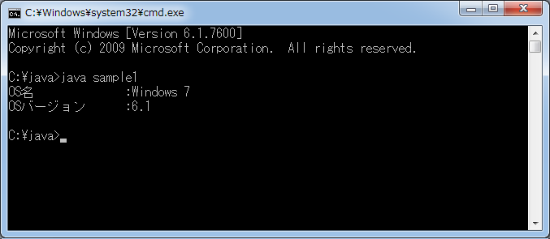
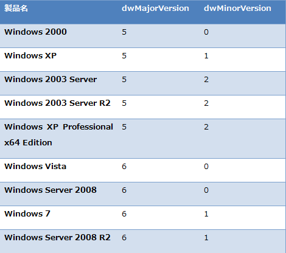

# [Java] Java から Windows OS のバージョンを取得する
## Requires
- 
## License
- Apache License, Version 2.0
## Technologies
- Windows 7
- Java SE 6
- jna3-2-7
## Topics
- 逆引きサンプル コード
- Windows プログラミング
- Windows 7 へのアプリ移行
- Java
- JNA
## Updated
- 02/21/2011
## Description

執筆者: <a href="http://msdn.microsoft.com/ja-jp/gg585574#kawahara" target="_blank">
株式会社クリエ・イルミネート 川原 亮</a>

動作確認環境：Windows 7 Ultimate、Java SE 6、jna3-2-7

Javaはプラットフォームに依存しない実行環境であるため、さまざまなシステムで使用されています。 
しかし、それ故に Java からプラットフォームに依存する情報を取得するとなると、どうするべきか悩む人は多いのではないでしょうか。 
本稿では、Windows OS のバージョンチェックを Java から行う方法について記述します。

Java

スクリプトの編集

java
<pre class="hidden">Windowsのバージョンをチェックする最も簡単な方法は、JavaのSystemクラスのgetProperty メソッドによって、現在使用しているシステムプロパティのセットを取得する方法です。

public class sample1{
 public static void main(String args[]) {
  System.out.println(&quot;OS名          ：&quot; &#43; System.getProperty(&quot;os.name&quot;));
  System.out.println(&quot;OSバージョン  ：&quot; &#43; System.getProperty(&quot;os.version&quot;));
 }
}</pre>
<pre id="codePreview" class="java">Windowsのバージョンをチェックする最も簡単な方法は、JavaのSystemクラスのgetProperty&nbsp;メソッドによって、現在使用しているシステムプロパティのセットを取得する方法です。&nbsp;
&nbsp;
public&nbsp;class&nbsp;sample1{&nbsp;
&nbsp;public&nbsp;static&nbsp;void&nbsp;main(String&nbsp;args[])&nbsp;{&nbsp;
&nbsp;&nbsp;System.out.println(&quot;OS名&nbsp;&nbsp;&nbsp;&nbsp;&nbsp;&nbsp;&nbsp;&nbsp;&nbsp;&nbsp;：&quot;&nbsp;&#43;&nbsp;System.getProperty(&quot;os.name&quot;));&nbsp;
&nbsp;&nbsp;System.out.println(&quot;OSバージョン&nbsp;&nbsp;：&quot;&nbsp;&#43;&nbsp;System.getProperty(&quot;os.version&quot;));&nbsp;
&nbsp;}&nbsp;
}&nbsp;
&nbsp;
</pre>

&nbsp;

システムプロパティには、JVM 及び実行される OS の基本的な情報が&#26684;納されています。 
OSのバージョンの他にも JRE のバージョンやクラスパスの他、OS 名やユーザアカウント名などを取得することが可能です。 
参照できる値は、<a href="http://java.sun.com/javase/ja/6/docs/ja/api/java/lang/System.html#getProperties()" target="_blank">Javadoc</a>から一覧できます。 
ですが、システムプロパティ値は Java が保持している値にアクセスしているのみであり&nbsp;OS 自体が保持する値にアクセスするわけではありませんし、 setProperty メソッドを使用することで変更することも可能です。

したがって、確実な情報を得るのであれば、Windows API を呼び出す手法が最も適切でしょう。 
ここでは、 Java からネイティブの共有ライブラリにアクセスする JNA ライブラリを使用して、Windows API の結果を取得する方法をご紹介します。 
以下のコードでは、 JNA (Java Native Access) を使って kernel32.dll 内の GetVersionEx 関数を利用し、OS のバージョン情報を呼び出しています。 
JNA のダウンロードは<a href="https://jna.dev.java.net/servlets/ProjectDocumentList?folderID=7408&expandFolder=7408&folderID=0" target="_blank">こちら</a>から。 
ライブラリや API のマッピング、プリミティブデータ型のマーシャリング等については、 JNA が指定する方法に依っています。ドキュメントは<a href="https://jna.dev.java.net/javadoc/overview-summary.html" target="_blank">こちら (英語)</a>から。

<h2>今回紹介するコード</h2>

Java

スクリプトの編集

java
<pre class="hidden">import com.sun.jna.Library;
import com.sun.jna.Native;
import com.sun.jna.Platform;
import com.sun.jna.Pointer;
import com.sun.jna.Structure;

public class sample1_1{
 public static void main(String args[]) {
  sample1_1 win = new sample1_1();
  getVersionEx();
 }

 public interface Kernel32 extends Library {
  Kernel32 INSTANCE = (Kernel32) Native.loadLibrary(&quot;kernel32&quot;, Kernel32.class);
  boolean GetVersionExW(Pointer pInfo);
 }
 
 public static class OSVERSIONINFOEX extends Structure {
  public int dwOSVersionInfoSize; 
  public int dwMajorVersion; 
  public int dwMinorVersion; 
  public int dwBuildNumber; 
  public int dwPlatformId; 
  public char[] szCSDVersion;
  public short wServicePackMajor;
  public short wServicePackMinor;
  public short wSuiteMask;
  public byte wProductType;
  public byte wReserved;
  
  public OSVERSIONINFOEX(){
   szCSDVersion = new char [128];
   dwOSVersionInfoSize = this.size();
  }
 }

 public static void getVersionEx() {
  if (Platform.isWindows()) {
   OSVERSIONINFOEX osver = new OSVERSIONINFOEX();
   osver.write();
   boolean flag = Kernel32.INSTANCE.GetVersionExW(osver.getPointer());
   osver.read();
   if (flag) {
    System.out.println(osver.dwMajorVersion &#43; &quot;.&quot; &#43; osver.dwMinorVersion &#43; &quot; &quot; &#43; osver.dwBuildNumber);
   }
  }
 }
}</pre>
<pre id="codePreview" class="java">import&nbsp;com.sun.jna.Library;&nbsp;
import&nbsp;com.sun.jna.Native;&nbsp;
import&nbsp;com.sun.jna.Platform;&nbsp;
import&nbsp;com.sun.jna.Pointer;&nbsp;
import&nbsp;com.sun.jna.Structure;&nbsp;
&nbsp;
public&nbsp;class&nbsp;sample1_1{&nbsp;
&nbsp;public&nbsp;static&nbsp;void&nbsp;main(String&nbsp;args[])&nbsp;{&nbsp;
&nbsp;&nbsp;sample1_1&nbsp;win&nbsp;=&nbsp;new&nbsp;sample1_1();&nbsp;
&nbsp;&nbsp;getVersionEx();&nbsp;
&nbsp;}&nbsp;
&nbsp;
&nbsp;public&nbsp;interface&nbsp;Kernel32&nbsp;extends&nbsp;Library&nbsp;{&nbsp;
&nbsp;&nbsp;Kernel32&nbsp;INSTANCE&nbsp;=&nbsp;(Kernel32)&nbsp;Native.loadLibrary(&quot;kernel32&quot;,&nbsp;Kernel32.class);&nbsp;
&nbsp;&nbsp;boolean&nbsp;GetVersionExW(Pointer&nbsp;pInfo);&nbsp;
&nbsp;}&nbsp;
&nbsp;&nbsp;
&nbsp;public&nbsp;static&nbsp;class&nbsp;OSVERSIONINFOEX&nbsp;extends&nbsp;Structure&nbsp;{&nbsp;
&nbsp;&nbsp;public&nbsp;int&nbsp;dwOSVersionInfoSize;&nbsp;&nbsp;
&nbsp;&nbsp;public&nbsp;int&nbsp;dwMajorVersion;&nbsp;&nbsp;
&nbsp;&nbsp;public&nbsp;int&nbsp;dwMinorVersion;&nbsp;&nbsp;
&nbsp;&nbsp;public&nbsp;int&nbsp;dwBuildNumber;&nbsp;&nbsp;
&nbsp;&nbsp;public&nbsp;int&nbsp;dwPlatformId;&nbsp;&nbsp;
&nbsp;&nbsp;public&nbsp;char[]&nbsp;szCSDVersion;&nbsp;
&nbsp;&nbsp;public&nbsp;short&nbsp;wServicePackMajor;&nbsp;
&nbsp;&nbsp;public&nbsp;short&nbsp;wServicePackMinor;&nbsp;
&nbsp;&nbsp;public&nbsp;short&nbsp;wSuiteMask;&nbsp;
&nbsp;&nbsp;public&nbsp;byte&nbsp;wProductType;&nbsp;
&nbsp;&nbsp;public&nbsp;byte&nbsp;wReserved;&nbsp;
&nbsp;&nbsp;&nbsp;
&nbsp;&nbsp;public&nbsp;OSVERSIONINFOEX(){&nbsp;
&nbsp;&nbsp;&nbsp;szCSDVersion&nbsp;=&nbsp;new&nbsp;char&nbsp;[128];&nbsp;
&nbsp;&nbsp;&nbsp;dwOSVersionInfoSize&nbsp;=&nbsp;this.size();&nbsp;
&nbsp;&nbsp;}&nbsp;
&nbsp;}&nbsp;
&nbsp;
&nbsp;public&nbsp;static&nbsp;void&nbsp;getVersionEx()&nbsp;{&nbsp;
&nbsp;&nbsp;if&nbsp;(Platform.isWindows())&nbsp;{&nbsp;
&nbsp;&nbsp;&nbsp;OSVERSIONINFOEX&nbsp;osver&nbsp;=&nbsp;new&nbsp;OSVERSIONINFOEX();&nbsp;
&nbsp;&nbsp;&nbsp;osver.write();&nbsp;
&nbsp;&nbsp;&nbsp;boolean&nbsp;flag&nbsp;=&nbsp;Kernel32.INSTANCE.GetVersionExW(osver.getPointer());&nbsp;
&nbsp;&nbsp;&nbsp;osver.read();&nbsp;
&nbsp;&nbsp;&nbsp;if&nbsp;(flag)&nbsp;{&nbsp;
&nbsp;&nbsp;&nbsp;&nbsp;System.out.println(osver.dwMajorVersion&nbsp;&#43;&nbsp;&quot;.&quot;&nbsp;&#43;&nbsp;osver.dwMinorVersion&nbsp;&#43;&nbsp;&quot;&nbsp;&quot;&nbsp;&#43;&nbsp;osver.dwBuildNumber);&nbsp;
&nbsp;&nbsp;&nbsp;}&nbsp;
&nbsp;&nbsp;}&nbsp;
&nbsp;}&nbsp;
}&nbsp;
&nbsp;
</pre>

&nbsp;

<h2>Windows API を呼び出すための準備</h2>

JNA では、Native.loadLibrary 関数を使用して、目的の dll をロードします。 
また、使用したいWindows API の関数名と同名のメソッドを定義しておく必要があります。

Java

スクリプトの編集

java
<pre class="hidden">public interface Kernel32 extends Library {
 Kernel32 INSTANCE = (Kernel32) Native.loadLibrary(&quot;kernel32&quot;, Kernel32.class);
 boolean GetVersionExW(Pointer pInfo);
}</pre>
<pre id="codePreview" class="js">public&nbsp;interface&nbsp;Kernel32&nbsp;extends&nbsp;Library&nbsp;{&nbsp;
&nbsp;Kernel32&nbsp;INSTANCE&nbsp;=&nbsp;(Kernel32)&nbsp;Native.loadLibrary(&quot;kernel32&quot;,&nbsp;Kernel32.class);&nbsp;
&nbsp;boolean&nbsp;GetVersionExW(Pointer&nbsp;pInfo);&nbsp;
}&nbsp;
&nbsp;
</pre>

<h2>構造体の定義</h2>

<a href="http://msdn.microsoft.com/ja-jp/library/cc429835.aspx" target="_blank">GetVersionEx 関数</a>は、パラメータに構造体のポインタを指定することで、バージョン情報を構造体に&#26684;納します。 
したがって、Java において構造体に相当するクラスを定義する必要があります。 
JNA には構造体に相当する <a href="https://jna.dev.java.net/javadoc/com/sun/jna/Structure.html" target="_blank">
Structure クラス</a>が用意されているので、 <a href="http://msdn.microsoft.com/en-us/library/ms724833(v=vs.85).aspx" target="_blank">
OSVERSIONINFOEX&nbsp;クラス</a>を定義する際に Structure クラスを拡張し、メンバを定義します。 
メンバの型は正確に Java の型に置き換えなければ、構造体に情報が&#26684;納されません。 
型のマッピングについては、<a href="https://jna.dev.java.net/javadoc/overview-summary.html#marshalling" target="_blank">こちら (英語)</a>を参照してください。 
また、dwOSVersionInfoSize メンバについては事前に指定しておく必要があるため、コンストラクタ内で定義を行っています。

Java

スクリプトの編集

java
<pre class="hidden">public static class OSVERSIONINFOEX extends Structure {
 public int dwOSVersionInfoSize; 
 public int dwMajorVersion; 
 public int dwMinorVersion; 
 public int dwBuildNumber; 
 public int dwPlatformId; 
 public char[] szCSDVersion;
 public short wServicePackMajor;
 public short wServicePackMinor;
 public short wSuiteMask;
 public byte wProductType;
 public byte wReserved;

 
 public OSVERSIONINFOEX(){
  szCSDVersion = new char [128];
  dwOSVersionInfoSize = this.size();
 }
}</pre>
<pre id="codePreview" class="java">public&nbsp;static&nbsp;class&nbsp;OSVERSIONINFOEX&nbsp;extends&nbsp;Structure&nbsp;{&nbsp;
&nbsp;public&nbsp;int&nbsp;dwOSVersionInfoSize;&nbsp;&nbsp;
&nbsp;public&nbsp;int&nbsp;dwMajorVersion;&nbsp;&nbsp;
&nbsp;public&nbsp;int&nbsp;dwMinorVersion;&nbsp;&nbsp;
&nbsp;public&nbsp;int&nbsp;dwBuildNumber;&nbsp;&nbsp;
&nbsp;public&nbsp;int&nbsp;dwPlatformId;&nbsp;&nbsp;
&nbsp;public&nbsp;char[]&nbsp;szCSDVersion;&nbsp;
&nbsp;public&nbsp;short&nbsp;wServicePackMajor;&nbsp;
&nbsp;public&nbsp;short&nbsp;wServicePackMinor;&nbsp;
&nbsp;public&nbsp;short&nbsp;wSuiteMask;&nbsp;
&nbsp;public&nbsp;byte&nbsp;wProductType;&nbsp;
&nbsp;public&nbsp;byte&nbsp;wReserved;&nbsp;
&nbsp;
&nbsp;&nbsp;
&nbsp;public&nbsp;OSVERSIONINFOEX(){&nbsp;
&nbsp;&nbsp;szCSDVersion&nbsp;=&nbsp;new&nbsp;char&nbsp;[128];&nbsp;
&nbsp;&nbsp;dwOSVersionInfoSize&nbsp;=&nbsp;this.size();&nbsp;
&nbsp;}&nbsp;
}&nbsp;
&nbsp;
</pre>

&nbsp;

<h2>GetVersionEx 関数の呼び出し</h2>

Java

スクリプトの編集

java
<pre class="hidden">OSVERSIONINFOEX osver = new OSVERSIONINFOEX();
osver.write();
boolean flag = Kernel32.INSTANCE.GetVersionExW(osver.getPointer());
osver.read();
if (flag) {
 System.out.println(osver.dwMajorVersion &#43; &quot;.&quot; &#43; osver.dwMinorVersion &#43; &quot; &quot; &#43; osver.dwBuildNumber);
}</pre>
<pre id="codePreview" class="js">OSVERSIONINFOEX&nbsp;osver&nbsp;=&nbsp;new&nbsp;OSVERSIONINFOEX();&nbsp;
osver.write();&nbsp;
boolean&nbsp;flag&nbsp;=&nbsp;Kernel32.INSTANCE.GetVersionExW(osver.getPointer());&nbsp;
osver.read();&nbsp;
if&nbsp;(flag)&nbsp;{&nbsp;
&nbsp;System.out.println(osver.dwMajorVersion&nbsp;&#43;&nbsp;&quot;.&quot;&nbsp;&#43;&nbsp;osver.dwMinorVersion&nbsp;&#43;&nbsp;&quot;&nbsp;&quot;&nbsp;&#43;&nbsp;osver.dwBuildNumber);&nbsp;
}&nbsp;
&nbsp;
</pre>

&nbsp;

構造体を初期化し、書き込み可能な状態にしてから、エイリアスである GetVersionExW 関数を呼んでいます。 
パラメータは構造体のポインタです。 
GetVersionEx 関数の呼び出しに失敗すると、戻り値として 0 が返ってきます (dwOSVersionInfoSize を設定せずに呼び出した場合など)。 
正しく処理された場合、メジャー バージョン、マイナー バージョン、ビルド番号を表示します。 
Windows 7 上で実行すると以下のように表示されます。

<h2>実行結果</h2>

メジャー バージョンとマイナー バージョンの組み合わせは下図の通りです。 
上記コードで構造体のメンバにも加えている通り、サービスパックの情報など、&#26684;納できる情報は他にもあります。 
詳しくは <a href="http://msdn.microsoft.com/en-us/library/ms724833(v=vs.85).aspx" target="_blank">
OSVERSIONINFOEX&nbsp; Structure</a>&nbsp;をご参照ください。

&nbsp;

<h2>関連リンク</h2>
<ul>
<li><a href="http://java.sun.com/javase/ja/6/docs/ja/api/java/lang/System.html#getProperties()" target="_blank">System (Java Platform SE 6)&nbsp;</a>&nbsp;
</li><li><a href="https://jna.dev.java.net/servlets/ProjectDocumentList?folderID=7408&expandFolder=7408&folderID=0" target="_blank">jna:latest (SVN head)&nbsp;</a>&nbsp;
</li><li><a href="https://jna.dev.java.net/javadoc/overview-summary.html" target="_blank">jna:OveriView (JNA API) (英語)</a>
</li><li><a href="http://msdn.microsoft.com/ja-jp/library/cc429835.aspx" target="_blank">GetVersionEx&nbsp;関数
</a><a href="http://msdn.microsoft.com/en-us/library/ms724833(v=VS.85).aspx%20GetVersionEx" target="_blank">OSVERSIONINFOEX&nbsp; Structure (英語)</a>

<a href="https://jna.dev.java.net/javadoc/com/sun/jna/Structure.html" target="_blank">Structure クラス (英語)&nbsp;</a>

</li></ul>

&nbsp;

<table>
<tbody>
<tr>
<td valign="top"></td>
<td valign="top"></td>
<td valign="top">
<ul>
<li>もっと他の Windows 7 対応を見る &gt;&gt;<a href="http://msdn.microsoft.com/ja-jp/windows/gg581817" target="_blank">Windows XP から Windows 7 アプリ移行 実践ガイド へ</a>
</li><li>もっと他のコンテンツを見る &gt;&gt; <a href="http://msdn.microsoft.com/ja-jp/ff363212" target="_blank">
逆引きサンプル コード一覧へ</a> </li><li>もっと他のレシピを見る &gt;&gt; <a href="http://msdn.microsoft.com/ja-jp/samplecode.recipe" target="_blank">
Code Recipe へ</a> </li><li>もっと Windows の情報を見る &gt;&gt; <a href="http://msdn.microsoft.com/ja-jp/windows/" target="_blank">
Windows デベロッパー センターへ</a> </li></ul>
</td>
</tr>
</tbody>
</table>

<a href="#top">ページのトップへ</a>

&#65279;

