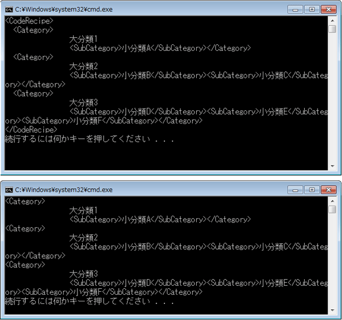
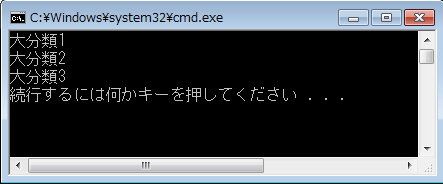

# [VB] LINQ to XML による、XML ドキュメント読み込み時の、3 つの方法の使い分け
## License
- Apache License, Version 2.0
## Technologies
- Visual Studio 2010
- XML DOM
- Windows 7
## Topics
- データ アクセス開発
- 逆引きサンプル コード
## Updated
- 03/10/2011
## Description

執筆者: <a href="http://msdn.microsoft.com/ja-jp/gg585574#syakushiji" target="_blank">
セイザインデザイン、PROJECT KySS　薬師寺 聖</a>

動作確認環境: Visual Studio 2010、Windows 7 Professional 32 bit

LINQ to XML を用いて、XML ドキュメントを読み込むには、いろいろな方法があります。

基本的なものは、<a href="http://msdn.microsoft.com/ja-jp/library/system.xml.linq.xdocument" target="_blank">XDocument クラス</a>を用いる方法と、<a href="http://msdn.microsoft.com/ja-jp/library/system.xml.linq.xelement" target="_blank">XElement クラス</a>を用いる方法の 2 つです。どちらの場合も、Load
 メソッドを用います。引数には、読み込むファイルを参照する URI 文字列を指定します。

この 2 つのクラスの動作は、異なります。コンソール・アプリケーションを作成して、リスト 1 のような XML ドキュメント (LinqSample.xml) を読み込んで結果を確認してみましょう。ソリューション名は &quot;XmlLoad&quot; とし、data フォルダーを作成して、サンプル XML ドキュメントを置いています。

このサンプルでは、読み込んだ XML ドキュメントの子要素のコレクションを、<a href="http://msdn.microsoft.com/ja-jp/library/bb342765" target="_blank">Elements メソッド</a>によって、ドキュメント順に返しています。

<strong>リスト 1 サンプル XML ドキュメント (LinqSample.xml)</strong>

XML

スクリプトの編集

xml

<pre id="codePreview" class="xml">&lt;?xml&nbsp;version=&quot;1.0&quot;&nbsp;encoding=&quot;UTF-8&quot;?&gt;&nbsp;
&lt;CodeRecipe&gt;&nbsp;
&nbsp;&nbsp;&nbsp;&nbsp;&lt;Category&gt;&nbsp;
&nbsp;&nbsp;&nbsp;&nbsp;&nbsp;&nbsp;&nbsp;&nbsp;大分類1&nbsp;
&nbsp;&nbsp;&nbsp;&nbsp;&nbsp;&nbsp;&nbsp;&nbsp;&lt;SubCategory&gt;小分類A&lt;/SubCategory&gt;&nbsp;
&nbsp;&nbsp;&nbsp;&nbsp;&lt;/Category&gt;&nbsp;
&nbsp;&nbsp;&nbsp;&nbsp;&lt;Category&gt;&nbsp;
&nbsp;&nbsp;&nbsp;&nbsp;&nbsp;&nbsp;&nbsp;&nbsp;大分類2&nbsp;
&nbsp;&nbsp;&nbsp;&nbsp;&nbsp;&nbsp;&nbsp;&nbsp;&lt;SubCategory&gt;小分類B&lt;/SubCategory&gt;&nbsp;
&nbsp;&nbsp;&nbsp;&nbsp;&nbsp;&nbsp;&nbsp;&nbsp;&lt;SubCategory&gt;小分類C&lt;/SubCategory&gt;&nbsp;
&nbsp;&nbsp;&nbsp;&nbsp;&lt;/Category&gt;&nbsp;
&nbsp;&nbsp;&nbsp;&nbsp;&lt;Category&gt;&nbsp;
&nbsp;&nbsp;&nbsp;&nbsp;&nbsp;&nbsp;&nbsp;&nbsp;大分類3&nbsp;
&nbsp;&nbsp;&nbsp;&nbsp;&nbsp;&nbsp;&nbsp;&nbsp;&lt;SubCategory&gt;小分類D&lt;/SubCategory&gt;&nbsp;
&nbsp;&nbsp;&nbsp;&nbsp;&nbsp;&nbsp;&nbsp;&nbsp;&lt;SubCategory&gt;小分類E&lt;/SubCategory&gt;&nbsp;
&nbsp;&nbsp;&nbsp;&nbsp;&nbsp;&nbsp;&nbsp;&nbsp;&lt;SubCategory&gt;小分類F&lt;/SubCategory&gt;&nbsp;
&nbsp;&nbsp;&nbsp;&nbsp;&lt;/Category&gt;&nbsp;
&lt;/CodeRecipe&gt;&nbsp;
&nbsp;
</pre>

<strong>リスト 2 リスト 1 のサンプル XML ドキュメントを、XDocument クラスおよび XElement クラスを用いて読み込む</strong>

Visual Basic

スクリプトの編集

vb

<pre id="codePreview" class="vb">Option&nbsp;Strict&nbsp;On&nbsp;
Imports&nbsp;System.Xml.Linq&nbsp;
Imports&nbsp;System.IO&nbsp;'後述のStreamReaderのサンプルで使用&nbsp;
&nbsp;
Module&nbsp;Module1&nbsp;
&nbsp;&nbsp;&nbsp;&nbsp;Sub&nbsp;Main()&nbsp;
&nbsp;&nbsp;&nbsp;&nbsp;&nbsp;&nbsp;&nbsp;&nbsp;'■XDocument.LoadでXMLとして読み込み、XMLとして処理する。&nbsp;
&nbsp;&nbsp;&nbsp;&nbsp;&nbsp;&nbsp;&nbsp;&nbsp;Dim&nbsp;myXmlDoc&nbsp;As&nbsp;XDocument&nbsp;=&nbsp;XDocument.Load(&quot;data\LinqSample.xml&quot;)&nbsp;
&nbsp;&nbsp;&nbsp;&nbsp;&nbsp;&nbsp;&nbsp;&nbsp;Dim&nbsp;myQuery&nbsp;=&nbsp;From&nbsp;c&nbsp;In&nbsp;myXmlDoc.Elements&nbsp;Select&nbsp;c&nbsp;
&nbsp;&nbsp;&nbsp;&nbsp;&nbsp;&nbsp;&nbsp;&nbsp;For&nbsp;Each&nbsp;myResult&nbsp;In&nbsp;myQuery&nbsp;
&nbsp;&nbsp;&nbsp;&nbsp;&nbsp;&nbsp;&nbsp;&nbsp;&nbsp;&nbsp;&nbsp;&nbsp;Console.WriteLine(myResult.ToString)&nbsp;
&nbsp;&nbsp;&nbsp;&nbsp;&nbsp;&nbsp;&nbsp;&nbsp;Next&nbsp;
&nbsp;
&nbsp;&nbsp;&nbsp;&nbsp;&nbsp;&nbsp;&nbsp;&nbsp;''■XElement.LoadでXMLとして読み込み、XMLとして処理する。&nbsp;
&nbsp;&nbsp;&nbsp;&nbsp;&nbsp;&nbsp;&nbsp;&nbsp;'Dim&nbsp;myXmlDoc&nbsp;As&nbsp;XElement&nbsp;=&nbsp;XElement.Load(&quot;data\LinqSample.xml&quot;)&nbsp;
&nbsp;&nbsp;&nbsp;&nbsp;&nbsp;&nbsp;&nbsp;&nbsp;'Dim&nbsp;myQuery&nbsp;=&nbsp;From&nbsp;c&nbsp;In&nbsp;myXmlDoc.Elements&nbsp;Select&nbsp;c&nbsp;
&nbsp;&nbsp;&nbsp;&nbsp;&nbsp;&nbsp;&nbsp;&nbsp;'For&nbsp;Each&nbsp;myResult&nbsp;In&nbsp;myQuery&nbsp;
&nbsp;&nbsp;&nbsp;&nbsp;&nbsp;&nbsp;&nbsp;&nbsp;'&nbsp;&nbsp;&nbsp;&nbsp;Console.WriteLine(myResult.ToString)&nbsp;
&nbsp;&nbsp;&nbsp;&nbsp;&nbsp;&nbsp;&nbsp;&nbsp;'Next&nbsp;
&nbsp;&nbsp;&nbsp;&nbsp;End&nbsp;Sub&nbsp;
End&nbsp;Module&nbsp;
&nbsp;
</pre>

「デバッグなしで開始」すると、XDocument クラスを用いた場合の結果は図 1 上、XElement クラスを用いた場合の結果は図 1 下のようになります。

図 1 XDocument クラスを用いた場合 (上)、XElement クラスを用いた場合 (下)

XDocument クラスを用いた場合は、読み込んだ XML ドキュメントのルート要素ノード &lt;CodeRecipe&gt; は、ルート ノードの子扱いになります。一方、XElement クラスを用いると，読み込んだ XML ドキュメントのルート要素ノードはルート ノード扱いになります。 
そのため、XElement クラスを用いると、XDocument クラスを用いた場合より一階層下のコレクションが返されるようになります。

なお、テキストのみ取得したい場合は、<a href="http://msdn.microsoft.com/ja-jp/library/bb341005" target="_blank">ToString</a> ではなく、Value を使って、Console.WriteLine(MyResult.Value) のように記述します。

既存 XML データを再利用するケースでは、この 2 つの方法以外に、<a href="http://msdn.microsoft.com/ja-jp/library/system.io.streamreader.aspx" target="_blank">StreamReader クラス</a>によって、XML ドキュメントを読み込んで処理した後、XDocument クラスを用いて再読み込みする方法が用いられることもあります。

前掲のリスト 1 は混合内容の XML ドキュメントで、「大分類1」「大分類2」「大分類3」は、タグで挟まれていません。 
リスト 3 では、まず、この XML ドキュメントを StreamReader クラスでテキストとして読み込み、改行とタブを取り除いた後、単純な文字置換によって、&lt;Category&gt; 要素のテキストが &lt;Name&gt; 要素の内容となるよう、構造を変更しています。

このようにして処理しやすい構造となった XML ドキュメントを、<a href="http://msdn.microsoft.com/ja-jp/library/system.xml.linq.xdocument.parse.aspx" target="_blank">XDocument クラスの Parse メソッド</a>を用いて、再読み込みしています。 
出力結果は、図 2 のようになります。

<strong>リスト 3 テキストとして XML ドキュメントを操作した後、Parse メソッドで再処理する</strong>

Visual Basic

スクリプトの編集

vb

<pre id="codePreview" class="vb">&nbsp;&nbsp;&nbsp;&nbsp;&nbsp;&nbsp;&nbsp;&nbsp;Dim&nbsp;myStr&nbsp;As&nbsp;StreamReader&nbsp;=&nbsp;New&nbsp;StreamReader(&quot;data\LinqSample.xml&quot;)&nbsp;&nbsp;
&nbsp;&nbsp;&nbsp;&nbsp;&nbsp;&nbsp;&nbsp;&nbsp;Dim&nbsp;myReplaceText&nbsp;As&nbsp;String&nbsp;=&nbsp;myStr.ReadToEnd&nbsp;&nbsp;
&nbsp;&nbsp;&nbsp;&nbsp;&nbsp;&nbsp;&nbsp;&nbsp;myStr.Close()&nbsp;&nbsp;
&nbsp;&nbsp;
&nbsp;&nbsp;&nbsp;&nbsp;&nbsp;&nbsp;&nbsp;&nbsp;Dim&nbsp;myXmlText&nbsp;As&nbsp;String&nbsp;=&nbsp;myReplaceText.Replace(vbCrLf,&nbsp;String.Empty).Replace(Chr(9),&nbsp;String.Empty)&nbsp;&nbsp;
&nbsp;&nbsp;&nbsp;&nbsp;&nbsp;&nbsp;&nbsp;&nbsp;myXmlText&nbsp;=&nbsp;Replace(myXmlText,&nbsp;&quot;&lt;Category&gt;&quot;,&nbsp;&quot;&lt;Category&gt;&lt;Name&gt;&quot;)&nbsp;&nbsp;
&nbsp;&nbsp;&nbsp;&nbsp;&nbsp;&nbsp;&nbsp;&nbsp;myXmlText&nbsp;=&nbsp;Replace(myXmlText,&nbsp;&quot;&lt;SubCategory&gt;&quot;,&nbsp;&quot;&lt;/Name&gt;&lt;SubCategory&gt;&quot;)&nbsp;&nbsp;
&nbsp;&nbsp;&nbsp;&nbsp;&nbsp;&nbsp;&nbsp;&nbsp;myXmlText&nbsp;=&nbsp;Replace(myXmlText,&nbsp;&quot;&lt;/SubCategory&gt;&lt;/Name&gt;&quot;,&nbsp;&quot;&lt;/SubCategory&gt;&quot;)&nbsp;&nbsp;
&nbsp;&nbsp;
&nbsp;&nbsp;&nbsp;&nbsp;&nbsp;&nbsp;&nbsp;&nbsp;Dim&nbsp;myXmlDoc&nbsp;As&nbsp;XDocument&nbsp;=&nbsp;XDocument.Parse(myXmlText)&nbsp;&nbsp;
&nbsp;&nbsp;&nbsp;&nbsp;&nbsp;&nbsp;&nbsp;&nbsp;Dim&nbsp;myQuery&nbsp;=&nbsp;From&nbsp;c&nbsp;In&nbsp;myXmlDoc.Elements&nbsp;Select&nbsp;c&nbsp;&nbsp;
&nbsp;&nbsp;&nbsp;&nbsp;&nbsp;&nbsp;&nbsp;&nbsp;For&nbsp;Each&nbsp;myResult&nbsp;In&nbsp;myQuery.Elements.&lt;Name&gt;&nbsp;&nbsp;
&nbsp;&nbsp;&nbsp;&nbsp;&nbsp;&nbsp;&nbsp;&nbsp;&nbsp;&nbsp;&nbsp;&nbsp;Console.WriteLine(myResult.Value)&nbsp;&nbsp;
&nbsp;&nbsp;&nbsp;&nbsp;&nbsp;&nbsp;&nbsp;&nbsp;Next&nbsp;
&nbsp;
</pre>

図 2 2 段階の処理で混合内容のテキストを取得した結果

<h2 style="font-size:120%; margin-top:20px">関連リンク</h2>
<ul>
<li><a href="http://msdn.microsoft.com/ja-jp/library/system.xml.linq.xdocument" target="_blank">XDocument クラス</a>
</li><li><a href="http://msdn.microsoft.com/ja-jp/library/bb350413" target="_blank">XElement.Load メソッド (String)</a>
</li><li><a href="http://msdn.microsoft.com/ja-jp/library/bb387087" target="_blank">プログラミング ガイド (LINQ to XML)</a>
</li></ul>

<table>
<tbody>
<tr>
<td></td>
<td>
<ul>
<li>もっと他のコンテンツを見る &gt;&gt; <a href="http://msdn.microsoft.com/ja-jp/ff363212" target="_blank">
逆引きサンプル コード一覧へ</a> </li><li>もっと他のレシピを見る &gt;&gt; <a href="http://code.msdn.microsoft.com/ja-jp">Code Recipe へ</a>
</li></ul>
</td>
</tr>
</tbody>
</table>

<a href="#top">ページのトップへ</a>

