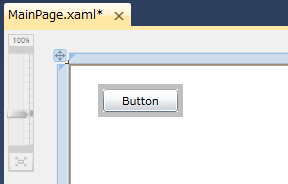

# [XAML] コントロールのまわりに枠を表示する
## Requires
- 
## License
- Apache License, Version 2.0
## Technologies
- Silverlight
## Topics
- Silverlight アプリケーション
- 逆引きサンプル コード
- Silverlight 大全 特集
## Updated
- 05/23/2011
## Description

動作確認環境: Silverlight 4、Visual Studio 2010、Microsoft Silverlight 4 Tools for Visual Studio 2010、Windows 7

Silverlight を使用したアプリケーションで、コントロールのまわりに枠を表示させるには、Border コントロールを使用します。

ここでは、XAML を使用した実装方法を紹介します。Visual Studio を使用した場合は、ツール ボックスにあるコントロールをドラッグ アンド ドロップすることにより、コントロールを使用できます。XAML のコード中に記述されている各プロパティは、Visual Studio のプロパティ ウィンドウからも変更できます。

以下の XAML のコードは、Grid パネルに貼り付けている Button コントロールのまわりに、Border コントロールによって枠を表示させている例です。

XAML

スクリプトの編集|{#scriptcode_dlg.remove_script}

xaml
<pre class="hidden">&lt;Grid x:Name=&quot;LayoutRoot&quot; Background=&quot;White&quot;&gt;
    &lt;Border BorderBrush=&quot;Silver&quot; BorderThickness=&quot;5&quot; Height=&quot;33&quot; HorizontalAlignment=&quot;Left&quot; Margin=&quot;30,20,0,0&quot; Name=&quot;border1&quot; VerticalAlignment=&quot;Top&quot; Width=&quot;85&quot;&gt;
        &lt;Button Content=&quot;Button&quot; Height=&quot;23&quot; Name=&quot;button1&quot; Width=&quot;75&quot; /&gt;
    &lt;/Border&gt;
&lt;/Grid&gt;</pre>

<pre id="codePreview" class="xaml">&lt;Grid&nbsp;x:Name=&quot;LayoutRoot&quot;&nbsp;Background=&quot;White&quot;&gt;&nbsp;
&nbsp;&nbsp;&nbsp;&nbsp;&lt;Border&nbsp;BorderBrush=&quot;Silver&quot;&nbsp;BorderThickness=&quot;5&quot;&nbsp;Height=&quot;33&quot;&nbsp;HorizontalAlignment=&quot;Left&quot;&nbsp;Margin=&quot;30,20,0,0&quot;&nbsp;Name=&quot;border1&quot;&nbsp;VerticalAlignment=&quot;Top&quot;&nbsp;Width=&quot;85&quot;&gt;&nbsp;
&nbsp;&nbsp;&nbsp;&nbsp;&nbsp;&nbsp;&nbsp;&nbsp;&lt;Button&nbsp;Content=&quot;Button&quot;&nbsp;Height=&quot;23&quot;&nbsp;Name=&quot;button1&quot;&nbsp;Width=&quot;75&quot;&nbsp;/&gt;&nbsp;
&nbsp;&nbsp;&nbsp;&nbsp;&lt;/Border&gt;&nbsp;
&lt;/Grid&gt;</pre>

Visual Studio の XAML デザイナー上でみると、このようになっています。Button コントロールのまわりに見える灰色の部分が Border コントロールです。

Border コントロールは、別のコントロールやパネルとともに使用します。Border コントロールの中に入れることができるコントロールまたはパネルは、1 つのみです。

各コントロールのプロパティの説明です。

<dl><dt><strong>BorderBrush:</strong> </dt><dd>枠の色です。 </dd><dt><strong>BorderThickness:</strong> </dt><dd>枠の線の幅です。 </dd><dt><strong>Height:</strong> </dt><dd>コントロールの見た目の高さです。 </dd><dt><strong>HorizontalAlignment:</strong> </dt><dd>パネル内のコントロールの水平方向の位置を、Left、Center、Right、Stretch で表します。ここでは Left が指定されているので、コントロールはパネル内で左寄せされて表示されます。ただし、Margin プロパティが設定されていたときは、その値の分のマージンが設定されます。
</dd><dt><strong>Margin:</strong> </dt><dd>4 つのパラメーターは、順に左側、上側、右側、下側のマージンを示します。マージンとは、その親となるパネルまたはグリッドの縁からの距離です。主に Grid パネルに貼り付けているときに使用します。
</dd><dt><strong>Name:</strong> </dt><dd>コントロールの名前です。Visual Basic や C# のコードから呼び出すときに、ここで設定した名前を使用します。 </dd><dt><strong>VerticalAlignment:</strong> </dt><dd>パネル内のコントロールの垂直方向の位置を、Top、Center、Bottom、Stretch で表します。ここでは Top が指定されているので、コントロールはパネル内で上寄せされて表示されます。ただし、Margin プロパティが設定されていたときは、その値の分のマージンが設定されます。
</dd><dt><strong>Width:</strong> </dt><dd>コントロールの見た目の幅です。 </dd></dl>

これら以外にも、下記のプロパティを設定することにより、見た目を変更できます。ここでは、よく使用されるプロパティを紹介します。

<dl><dt><strong>Background:</strong> </dt><dd>Border コントロールの内部の背景色です。グラデーションをかけたり、イメージを指定することで画像を背景として設定することもできます。 </dd><dt><strong>CornerRadius:</strong> </dt><dd>数値を指定すると、角を丸めることができます。 </dd><dt><strong>Visibility:</strong> </dt><dd>表示と非表示を切り替えることができます。Visible を指定すると表示し、Collapsed を指定すると表示しなくなります。 </dd></dl>

<table>
<tbody>
<tr>
<td></td>
<td></td>
<td>
<ul>
<li>もっと他のコンテンツを見る &gt;&gt; <a href="http://msdn.microsoft.com/ja-jp/ff363212" target="_blank">
逆引きサンプル コード一覧へ</a> </li><li>もっと他のレシピを見る &gt;&gt; <a href="http://msdn.microsoft.com/ja-jp/samplecode.recipe" target="_blank">
Code Recipe へ</a> </li><li>もっと&nbsp;Silverlight の情報を見る &gt;&gt; <a href="http://msdn.microsoft.com/ja-jp/silverlight/" target="_blank">
Silverlight デベロッパー センターへ</a> </li><li>もっと他のコンテンツを見る &gt;&gt; <a href="http://msdn.microsoft.com/ja-jp/silverlight/hh201902" target="_blank">
Silverlight 大全 特集ページ</a> </li></ul>
</td>
</tr>
</tbody>
</table>

<a href="#top"> ページのトップへ</a>

