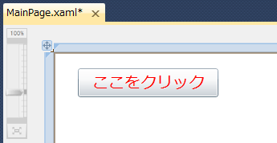

# [XAML] ユーザー インターフェイスでボタンを使用する
## Requires
- 
## License
- Apache License, Version 2.0
## Technologies
- Silverlight
## Topics
- Silverlight アプリケーション
- 逆引きサンプル コード
## Updated
- 05/23/2011
## Description

動作確認環境: Silverlight 4、Visual Studio 2010、Microsoft Silverlight 4 Tools for Visual Studio 2010、 Windows 7

Silverlight を使用したアプリケーションで、ユーザー インターフェイスとしてボタンを使用する場合は Button コントロールを使用します。

ここでは、XAML を使用した実装方法を紹介します。Visual Studio を使用した場合は、ツール ボックスにあるコントロールをドラッグ アンド ドロップすることにより、コントロールを使用できます。XAML のコード中に記述されている各プロパティは、Visual Studio のプロパティ ウィンドウからも変更できます。

以下の XAML のコードは、Button コントロールを Grid パネルの中で使用した例です。

XAML

スクリプトの編集

xaml
<pre class="hidden">&lt;Grid x:Name=&quot;LayoutRoot&quot; Background=&quot;White&quot;&gt;
    &lt;Button Content=&quot;Button&quot; Height=&quot;23&quot; HorizontalAlignment=&quot;Left&quot; Margin=&quot;30,20,0,0&quot; Name=&quot;button1&quot; VerticalAlignment=&quot;Top&quot; Width=&quot;75&quot; /&gt;
&lt;/Grid&gt;</pre>

<pre id="codePreview" class="xaml">&lt;Grid&nbsp;x:Name=&quot;LayoutRoot&quot;&nbsp;Background=&quot;White&quot;&gt;&nbsp;
&nbsp;&nbsp;&nbsp;&nbsp;&lt;Button&nbsp;Content=&quot;Button&quot;&nbsp;Height=&quot;23&quot;&nbsp;HorizontalAlignment=&quot;Left&quot;&nbsp;Margin=&quot;30,20,0,0&quot;&nbsp;Name=&quot;button1&quot;&nbsp;VerticalAlignment=&quot;Top&quot;&nbsp;Width=&quot;75&quot;&nbsp;/&gt;&nbsp;
&lt;/Grid&gt;&nbsp;
/pre&gt;
</pre>

Visual Studio の XAML デザイナー上でみると、このようになっています。

各コントロールのプロパティの説明です。

<dl><dt><strong>Content: </strong></dt><dd>ボタンの上に表示される文字列です。 </dd><dt><strong>Height: </strong></dt><dd>コントロールの見た目の高さです。 </dd><dt><strong>HorizontalAlignment: </strong></dt><dd>パネル内のコントロールの水平方向の位置を、Left、Center、Right、Stretch で表します。ここでは Left が指定されているので、コントロールはパネル内で左寄せされて表示されます。ただし、Margin プロパティが設定されていたときは、その値の分のマージンが設定されます。
</dd><dt><strong>Margin: </strong></dt><dd>4 つのパラメーターは、順に左側、上側、右側、下側のマージンを示します。マージンとは、その親となるパネルまたはグリッドの縁からの距離です。主に Grid パネルに貼り付けているときに使用します。
</dd><dt><strong>Name: </strong></dt><dd>コントロールの名前です。Visual Basic や C# のコードから呼び出すときに、ここで設定した名前を使用します。 </dd><dt><strong>VerticalAlignment: </strong></dt><dd>パネル内のコントロールの垂直方向の位置を、Top、Center、Bottom、Stretch で表します。ここでは Top が指定されているので、コントロールはパネル内で上寄せされて表示されます。ただし、Margin プロパティが設定されていたときは、その値の分のマージンが設定されます。
</dd><dt><strong>Width: </strong></dt><dd>コントロールの見た目の幅です。
<dl></dl>
</dd></dl>

これら以外にも、下記のプロパティを設定することにより、見た目を変更できます。ここでは、よく使用されるプロパティを紹介します。

<dl><dt><strong>Background: </strong></dt><dd>背景色です。グラデーションをかけたり、イメージを指定することで画像を背景として設定することもできます。 </dd><dt><strong>BorderBrush: </strong></dt><dd>枠の色です。 </dd><dt><strong>BorderThickness: </strong></dt><dd>枠の線の幅です。 </dd><dt><strong>FontFamily: </strong></dt><dd>表示するときに使用するフォント名です。 </dd><dt><strong>FontSize: </strong></dt><dd>フォントの大きさです。 </dd><dt><strong>FontStyle: </strong></dt><dd>このプロパティを Italic に変更すると、斜体で表示されます。 </dd><dt><strong>Foreground: </strong></dt><dd>文字の色です。グラデーションをかけたり、イメージを指定することで画像を背景として設定することもできます。 </dd><dt><strong>Visibility: </strong></dt><dd>表示と非表示を切り替えることができます。Visible を指定すると表示し、Collapsed を指定すると表示しなくなります。 </dd></dl>

以下は、Content プロパティに &quot;ここに入力&quot; と表示させ、コントロールの大きさや、FontSize、Foreground を変更した例です。

XAML

スクリプトの編集

xaml
<pre class="hidden">    &lt;Button Content=&quot;ここをクリック&quot; Height=&quot;36&quot; HorizontalAlignment=&quot;Left&quot; Margin=&quot;30,20,0,0&quot; Name=&quot;button1&quot; VerticalAlignment=&quot;Top&quot; Width=&quot;175&quot; FontSize=&quot;20&quot; Foreground=&quot;Red&quot;&gt;&lt;/Button&gt;</pre>

<pre id="codePreview" class="xaml">&nbsp;&nbsp;&nbsp;&nbsp;&lt;Button&nbsp;Content=&quot;ここをクリック&quot;&nbsp;Height=&quot;36&quot;&nbsp;HorizontalAlignment=&quot;Left&quot;&nbsp;Margin=&quot;30,20,0,0&quot;&nbsp;Name=&quot;button1&quot;&nbsp;VerticalAlignment=&quot;Top&quot;&nbsp;Width=&quot;175&quot;&nbsp;FontSize=&quot;20&quot;&nbsp;Foreground=&quot;Red&quot;&gt;&lt;/Button&gt;&nbsp;
&nbsp;
</pre>

Button コントロールは、クリックされると Clicked というイベントを発生します。

Visual Studio の XAML デザイナー上で、貼り付けている Button コントロールをダブルクリックすると、イベント発生時に実行されるイベント ハンドラーが生成します。

以下の例は、ボタンがクリックされたらボタンに表示されている文字を &quot;OK!&quot; に変更し、文字色を青に変更するプログラムの例です。

&nbsp;

Visual Basic

スクリプトの編集

vb
<pre class="hidden">Private Sub Button1_Click(ByVal sender As System.Object, ByVal e As System.Windows.RoutedEventArgs) Handles Button1.Click
    ' ボタンの表示する文字列を OK! に変更
    ' Button1 は、Name プロパティで設定した名前
    Button1.Content = &quot;OK!&quot;

    ' ボタンの表示する文字列の色を青に変更
    Dim mojishoku As New SolidColorBrush
    mojishoku.Color = Colors.Blue
    Button1.Foreground = mojishoku
End Sub</pre>

<pre id="codePreview" class="vb">Private&nbsp;Sub&nbsp;Button1_Click(ByVal&nbsp;sender&nbsp;As&nbsp;System.Object,&nbsp;ByVal&nbsp;e&nbsp;As&nbsp;System.Windows.RoutedEventArgs)&nbsp;Handles&nbsp;Button1.Click&nbsp;
&nbsp;&nbsp;&nbsp;&nbsp;'&nbsp;ボタンの表示する文字列を&nbsp;OK!&nbsp;に変更&nbsp;
&nbsp;&nbsp;&nbsp;&nbsp;'&nbsp;Button1&nbsp;は、Name&nbsp;プロパティで設定した名前&nbsp;
&nbsp;&nbsp;&nbsp;&nbsp;Button1.Content&nbsp;=&nbsp;&quot;OK!&quot;&nbsp;
&nbsp;
&nbsp;&nbsp;&nbsp;&nbsp;'&nbsp;ボタンの表示する文字列の色を青に変更&nbsp;
&nbsp;&nbsp;&nbsp;&nbsp;Dim&nbsp;mojishoku&nbsp;As&nbsp;New&nbsp;SolidColorBrush&nbsp;
&nbsp;&nbsp;&nbsp;&nbsp;mojishoku.Color&nbsp;=&nbsp;Colors.Blue&nbsp;
&nbsp;&nbsp;&nbsp;&nbsp;Button1.Foreground&nbsp;=&nbsp;mojishoku&nbsp;
End&nbsp;Sub&nbsp;
&nbsp;
</pre>

C#

スクリプトの編集

csharp
<pre class="hidden">private void button1_Click(object sender, RoutedEventArgs e)
{
    // ボタンの表示する文字列を OK! に変更
    // button1 は、Name プロパティで設定した名前
    button1.Content = &quot;OK!&quot;;

    // ボタンの表示する文字列の色を青に変更
    SolidColorBrush mojishoku = new SolidColorBrush();
    mojishoku.Color = Colors.Blue;
    button1.Foreground = mojishoku;
}</pre>

<pre id="codePreview" class="csharp">private&nbsp;void&nbsp;button1_Click(object&nbsp;sender,&nbsp;RoutedEventArgs&nbsp;e)&nbsp;
{&nbsp;
&nbsp;&nbsp;&nbsp;&nbsp;//&nbsp;ボタンの表示する文字列を&nbsp;OK!&nbsp;に変更&nbsp;
&nbsp;&nbsp;&nbsp;&nbsp;//&nbsp;button1&nbsp;は、Name&nbsp;プロパティで設定した名前&nbsp;
&nbsp;&nbsp;&nbsp;&nbsp;button1.Content&nbsp;=&nbsp;&quot;OK!&quot;;&nbsp;
&nbsp;
&nbsp;&nbsp;&nbsp;&nbsp;//&nbsp;ボタンの表示する文字列の色を青に変更&nbsp;
&nbsp;&nbsp;&nbsp;&nbsp;SolidColorBrush&nbsp;mojishoku&nbsp;=&nbsp;new&nbsp;SolidColorBrush();&nbsp;
&nbsp;&nbsp;&nbsp;&nbsp;mojishoku.Color&nbsp;=&nbsp;Colors.Blue;&nbsp;
&nbsp;&nbsp;&nbsp;&nbsp;button1.Foreground&nbsp;=&nbsp;mojishoku;&nbsp;
}&nbsp;
&nbsp;
</pre>

<table>
<tbody>
<tr>
<td></td>
<td></td>
<td>
<ul>
<li>もっと他のコンテンツを見る &gt;&gt; <a href="http://msdn.microsoft.com/ja-jp/ff363212" target="_blank">
逆引きサンプル コード一覧へ</a> </li><li>もっと他のレシピを見る &gt;&gt; <a href="http://msdn.microsoft.com/ja-jp/samplecode.recipe" target="_blank">
Code Recipe へ</a> </li><li>もっと&nbsp;Silverlight の情報を見る &gt;&gt; <a href="http://msdn.microsoft.com/ja-jp/silverlight/" target="_blank">
Silverlight デベロッパー センターへ</a> </li><li>もっと他のコンテンツを見る &gt;&gt; <a href="http://msdn.microsoft.com/ja-jp/silverlight/hh201902" target="_blank">
Silverlight 大全 特集ページ</a> </li></ul>
</td>
</tr>
</tbody>
</table>

