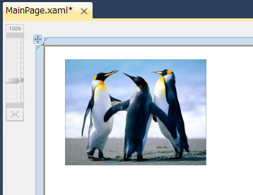

# [XAML] 画像を表示するユーザー インターフェイスを作成する
## License
- Apache License, Version 2.0
## Technologies
- Silverlight
## Topics
- Silverlight アプリケーション
- 逆引きサンプル コード
- Silverlight 大全 特集
## Updated
- 05/25/2011
## Description

動作確認環境: Silverlight 4、Visual Studio 2010、Microsoft Silverlight 4 Tools for Visual Studio 2010、Windows 7

Silverlight を使用したアプリケーションで、画像をユーザー インターフェイスに表示させる場合は Image コントロールを使用します。

以下の XAML のコードは、Image コントロールを Grid パネルの中で使用した例です。この例では、サンプル ピクチャーにあるペンギンの画像を表示させています。

表示させる画像の選択は、Visual Studio の XAML デザイナー上に貼り付けている Image コントロールを選択し、プロパティ ウィンドウの Source と表示されているプロパティの右端にある [...] ボタンをクリックします。[イメージの選択] ダイアログが表示されたら、[追加] ボタンをクリックし、表示させたい画像を選択します。

以下の XAML のコードは、画像を選択したときの例です。

XAML

スクリプトの編集|{#scriptcode_dlg.remove_script}

xaml

<pre id="codePreview" class="xaml">&lt;Grid&nbsp;x:Name=&quot;LayoutRoot&quot;&nbsp;Background=&quot;White&quot;&gt;&nbsp;
&nbsp;&nbsp;&nbsp;&nbsp;&nbsp;&nbsp;&nbsp;&nbsp;&lt;Image&nbsp;Height=&quot;150&quot;&nbsp;HorizontalAlignment=&quot;Left&quot;&nbsp;Margin=&quot;30,20,0,0&quot;&nbsp;Name=&quot;image1&quot;&nbsp;Stretch=&quot;Fill&quot;&nbsp;VerticalAlignment=&quot;Top&quot;&nbsp;Width=&quot;200&quot;&nbsp;Source=&quot;/SLbook_Image;component/Images/Penguins.jpg&quot;&nbsp;/&gt;&nbsp;
&lt;/Grid&gt;</pre>

Visual Studio の XAML デザイナー上でみると、このようになっています。

各コントロールのプロパティの説明です。

<dl><dt><strong>Height:</strong> </dt><dd>コントロールの見た目の高さです。 </dd><dt><strong>HorizontalAlignment:</strong> </dt><dd>パネル内のコントロールの水平方向の位置を、Left、Center、Right、Stretch で表します。ここでは Left が指定されているので、コントロールはパネル内で左寄せされて表示されます。ただし、Margin プロパティが設定されていたときは、その値の分のマージンが設定されます。
</dd><dt><strong>Margin:</strong> </dt><dd>4 つのパラメーターは、順に左側、上側、右側、下側のマージンを示します。マージンとは、その親となるパネルまたはグリッドの縁からの距離です。主に Grid パネルに貼り付けているときに使用します。
</dd><dt><strong>Name:</strong> </dt><dd>コントロールの名前です。Visual Basic や C# のコードから呼び出すときに、ここで設定した名前を使用します。 </dd><dt><strong>Source:</strong> </dt><dd>表示する画像を指定します。画像の選択はプロパティ ウィンドウで行います。プロパティ ウィンドウの Source と表示されているプロパティの右端にある [...] ボタンをクリックします。[イメージの選択] ダイアログが表示されたら、[追加] ボタンをクリックし、表示させたい画像を選択します。
</dd><dt><strong>VerticalAlignment:</strong> </dt><dd>パネル内のコントロールの垂直方向の位置を、Top、Center、Bottom、Stretch で表します。ここでは Top が指定されているので、コントロールはパネル内で上寄せされて表示されます。ただし、Margin プロパティが設定されていたときは、その値の分のマージンが設定されます。
</dd><dt><strong>Width :</strong> </dt><dd>コントロールの見た目の幅です。 </dd></dl>

下記のプロパティを設定することにより、見た目を変更できます。ここでは、よく使用されるプロパティを紹介します。

<dl><dt><strong>Stretch:</strong> </dt><dd>画像の表示方法を変更します。Fill を指定したときは、Image コントロール全体に画像が表示されるように、垂直方向及び水平方向を拡大/縮小します。Uniform を指定したときは、オリジナルの画像の縦横比を変更せずに、画像全体が表示されるように拡大/縮小します。UniformToFill を指定したときは、オリジナルの画像の縦横比を変更せずに、画像が最も大きく表示されるように拡大/縮小します。画像の一部がはみ出すことがあります。None を指定したときは、オリジナルの画像のまま表示します。画像の一部がはみ出すことがあります。
</dd></dl>

Fill の場合

Uniform の場合

UniformToFill の場合

None の場合

<dl><dt><strong>Visibility:</strong> </dt><dd>表示と非表示を切り替えることができます。Visible を指定すると表示し、Collapsed を指定すると表示しなくなります。 </dd></dl>

<table>
<tbody>
<tr>
<td></td>
<td></td>
<td>
<ul>
<li>もっと他のコンテンツを見る &gt;&gt; <a href="http://msdn.microsoft.com/ja-jp/ff363212" target="_blank">
逆引きサンプル コード一覧へ</a> </li><li>もっと他のレシピを見る &gt;&gt; <a href="http://msdn.microsoft.com/ja-jp/samplecode.recipe" target="_blank">
Code Recipe へ</a> </li><li>もっと&nbsp;Silverlight の情報を見る &gt;&gt; <a href="http://msdn.microsoft.com/ja-jp/silverlight/" target="_blank">
Silverlight デベロッパー センターへ</a> </li><li>もっと他のコンテンツを見る &gt;&gt; <a href="http://msdn.microsoft.com/ja-jp/silverlight/hh201902" target="_blank">
Silverlight 大全 特集ページ</a> </li></ul>
</td>
</tr>
</tbody>
</table>

<a href="#top"> ページのトップへ</a>

