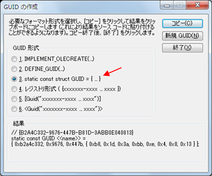

# [連載! とことん VC++] 第 2 回 COM 再入門 ～ COM オブジェクトの基本的実装 ～
## Requires
- 
## License
- Apache License, Version 2.0
## Technologies
- Visual Studio 2010
- Visual C++ 2010
## Topics
- Visual C++ プログラミング
- 連載! とことん VC++
## Updated
- 05/25/2011
## Description

執筆者: <a href="http://msdn.microsoft.com/ja-jp/gg585574#yajima" target="_blank">
エディフィストラーニング株式会社 矢嶋 聡</a>

<h2>目次</h2>
<ol>
<li><a href="#01">はじめに ～ COM オブジェクトの実装知識が必要になるケース ～</a> </li><li><a href="#02">COM サーバー (COM コンポーネント) の基本形態</a> </li><li><a href="#03">DLL 形式の COM サーバーの基本構造</a> </li><li><a href="#04">COM クライアント、COM Library、COM サーバーの基本的な連携動作</a> </li><li><a href="#05">COM サーバーのレジストリへの登録</a> </li><li><a href="#06">CLSID や COM インターフェイスのなどの定義</a> </li><li><a href="#07">COM インターフェイス定義のバリエーション</a> </li><li><a href="#08">COM オブジェクトの実装</a> </li><li><a href="#09">クラス オブジェクトの実装</a> </li><li><a href="#10">DllGetClassObject 関数と DllCanUnloadNow 関数</a> </li><li><a href="#11">レジストリの登録</a> </li><li><a href="#12">COM クライアントからのアクセス</a> </li><li><a href="#13">まとめ</a> </li></ol>

<h2 id="01" style="font-size:120%; margin-top:20px">1. はじめに ～ COM オブジェクトの実装知識が必要になるケース ～</h2>

<a href="http://code.msdn.microsoft.com/VisualC-7c6bc862">前回</a>は、COM オブジェクトを使用する COM クライアントについて解説しました。今回は、COM オブジェクトを提供する側である COM サーバー (COM コンポーネント) について取り上げます。

このような COM サーバーの知識は、ATL COM コンポーネントを開発する場合に基礎知識として役立ちます (ATL COM コンポーネントについては、別の回に取り上げます)。

また、既存の各テクノロジの API は COM ベースのオブジェクトとして提供されているものが多くあり、これらの API を利用する際にも、COM オブジェクトを実装する知識が役立ちます。というのは、これらの API からイベント通知を受け取る際に、API の利用者が用意すべき実装は、イベントを受け取るための単なるコールバック関数ではなく、COM オブジェクトとしての実装が一般的に必要になるからです。API 側がイベントを通知する際には、COM インターフェイスを介して、利用者側の COM オブジェクトを呼び出すのです。

たとえば、アニメーションのフレームワークである Windows Animation Manager では、利用者のプログラムがタイマー イベントの通知を受け取るには、Windows Animation Manager 側から呼び出される COM オブジェクトを、利用者側で実装する必要があります。このような COM ベースの API を利用する開発者の方も、COM サーバー側の仕組みを理解しておけば、この API を有効活用できるようになるでしょう。

まずは、COM サーバーの基本的な形態や基本的な内部構造を確認した後、いくつかポイントとなる実装方法や仕組みを確認していきます。

なお、今回取り上げる COM サーバーでも必要となる、COM 関連の基礎知識は<a href="http://code.msdn.microsoft.com/VisualC-7c6bc862">前回</a>に説明しているので、予め<a href="http://code.msdn.microsoft.com/VisualC-7c6bc862">前回</a>の記事をお読みになることをお奨めします。

<a href="#top">ページのトップへ</a>

<h2 id="02" style="font-size:120%; margin-top:20px">2. COM サーバー (COM コンポーネント) の基本形態</h2>

COM サーバーの形態は、「アウトプロセス (out-of-process)」と「インプロセス (in-process)」の 2 種類に分類できます。

アウトプロセスの COM サーバーは EXE 形式の実装であり、文字通り COM クライアントのプロセスの外の、別のプロセスで実行されます。この COM サーバーのプロセスは、COM クライアントが実行されるマシンとは別のリモート マシンで実行される場合もあります。

一方、インプロセスの COM サーバーは DLL 形式の実装であり、COM クライアントと同一のプロセスで実行されます。ただし、<a href="http://code.msdn.microsoft.com/VisualC-7c6bc862">前回</a>触れた DllHost.exe というファイルのプロセスの中で実行させることで、クライアントとは別のプロセスで実行することも可能です。このような DLL をホストする形態は、「DLL サロゲート」とも言います。また、その DllHost.exe のプロセスをリモート
 マシンに置くこともできます。

いずれのプロセスの形態でも、そもそも COM クライアントにとっては、COM サーバーのプロセスの位置に関わらず、透過的に同じ方法で COM オブジェクトにアクセスできます。しかし、COM サーバー側の観点で見ると、たしかにアウトプロセスやインプロセスに関わらず、CLSID で識別される COM オブジェクトの実装は同じですが、COM オブジェクトを提供するために必要となる周辺の実装に一部違いがあり、それぞれの実装方法を理解しておく必要があります。

ただし、一般に COM オブジェクトを提供する API を利用する際には、その COM オブジェクトをインプロセス形式で利用する場合が多いでしょう。(<a href="http://code.msdn.microsoft.com/VisualC-7c6bc862">前回</a>取り上げた Windows Shell API も、インプロセスで実行できます。)

そこで、ここでは紙面の都合もあり、インプロセス (DLL 形式) の場合の実装に焦点を当てて説明していきます。

<strong>Note:</strong> 
EXE 形式の実装を含む、COM サーバーの実装全般については、以下のアドレスを参照してください。

<ul>
<li><a href="http://msdn.microsoft.com/en-us/library/ms690101.aspx" target="_blank">COM Server Responsibilities (英語版)</a>
</li></ul>

<a href="#top">ページのトップへ</a>

<h2 id="03" style="font-size:120%; margin-top:20px">3. DLL 形式の COM サーバーの基本構造</h2>

それでは、DLL として COM サーバーを実装する際に必要となる基本構造 (必要となる要素) を確認しましょう。ここでは、1 つの COM オブジェクトを提供する上で必要な実装を考えます。

具体的には、次に示すように、ICalcObject インターフェイスでアクセスできる COM オブジェクトを COM クライアントに提供することを考えます。以下に挙げた 3 つの情報は、COM クライアントが必要となる情報でもあります。

<ul>
<li>クラス ID (CLSID) ---- CLSID_CalcObject </li><li>インターフェイス ID (IID) ---- IID_ICalcObject </li><li>インターフェイスの型名 ---- ICalcObject </li></ul>

このような COM オブジェクトを COM クライアントに提供する上で必要となる実装は、以下のとおりです。

<strong>表 2.A DLL 形式の COM サーバーで必要となる実装</strong>

<table style="margin-bottom:10px; border:1px #CCCCCC solid; border-collapse:collapse; border-spacing:0">
<tbody>
<tr style="background-color:#eff3f7">
<td style="padding:10px; border:1px #CCCCCC solid; border-width:1px; white-space:nowrap">
<strong>実装の種類</strong></td>
<td style="padding:10px; border:1px #CCCCCC solid; border-width:1px; white-space:nowrap">
<strong>説明</strong></td>
</tr>
<tr>
<td style="padding:10px; border:1px #CCCCCC solid; border-width:1px">1）オブジェクト本体</td>
<td style="padding:10px; border:1px #CCCCCC solid; border-width:1px">ICalcObject インターフェイスが実装された本体</td>
</tr>
<tr>
<td style="padding:10px; border:1px #CCCCCC solid; border-width:1px">2）クラス オブジェクト 
(クラス ファクトリ)</td>
<td style="padding:10px; border:1px #CCCCCC solid; border-width:1px">上記のオブジェクト インスタンスを提供するオブジェクト、IClassFactory インターフェイス (または IClassFactory2) を実装する</td>
</tr>
<tr>
<td style="padding:10px; border:1px #CCCCCC solid; border-width:1px">3）DllGetClassObject 関数</td>
<td style="padding:10px; border:1px #CCCCCC solid; border-width:1px">COM Library が呼び出す。上記のクラス オブジェクトを返す。</td>
</tr>
<tr>
<td style="padding:10px; border:1px #CCCCCC solid; border-width:1px">4）DllCanUnloadNow 関数</td>
<td style="padding:10px; border:1px #CCCCCC solid; border-width:1px">COM Library が呼び出す。DLL のアンロード是非の問い合せに答える。</td>
</tr>
<tr>
<td style="padding:10px; border:1px #CCCCCC solid; border-width:1px">5）DllRegisterServer 関数 / DllUnRegister 関数</td>
<td style="padding:10px; border:1px #CCCCCC solid; border-width:1px">レジストリに自身を登録する「自己登録」のための実装 
(オプションの実装)</td>
</tr>
</tbody>
</table>

もちろん、DLL のエントリ ポイントである dllmain 関数も必要ですが、上記は COM サーバーとなるために必要となる固有の実装です。

まずは、当然ながら 1) の ICalcObject インターフェイスが実装された COM オブジェクトを記述する必要があります。

そのほか、その 1) の COM オブジェクトのインスタンスを作成するために、2) の「クラス オブジェクト」を記述する必要があります。このクラス オブジェクトは「クラス ファクトリ」とも呼ばれ、定義済みの IClassFactory インターフェイス(または IClasFactory2 インターフェイス)を実装する必要があります。クラス オブジェクトは、COM Library や COM クライアントが、最終目的である 1) の COM オブジェクトのインスタンスを作成するために利用します。

そのほか、3) から 5) までの 4 つの関数を一般に実装します (詳しくは後述)。

次に、この表に挙げた各実装の役割について確認しつつ、実行時の基本的な動作を確認しましょう。

<a href="#top">ページのトップへ</a>

<h2 id="04" style="font-size:120%; margin-top:20px">4. COM クライアント、COM Library、COM サーバーの基本的な連携動作</h2>

次図は、COM クライアントが COM オブジェクトのインスタンスを取得するために、COM Library の CoCreateInstance 関数を呼び出し、インターフェイス ポインターを取得するまでの基本的な連携動作の流れについて、簡略化して示したものです。図中の手順を表す数字 (1) から (10) の順に実行されます。

<strong>図 2.1 COM オブジェクトのインスタンスを取得するまでの流れ</strong>

この図の (1) のように、COM クライアントが COM オブジェクトのインスタンスを取得するために CoCreateInstance 関数を呼び出すと、CoCreateInstance 関数の内部では、(2) のように DLL 側の DllGetClassObject 関数を呼び出します。ただし、初期状態では COM サーバーの DLL がロードされていないので、CoCreateInstance 関数内部では、COM クライアントから引数として受け取った CLSID をもとに、レジストリを調べて対応する
 DLL ファイルのパスを求め、その DLL をロードしたうえで (2) の呼び出しを行います。(この流れを実現するには、予めレジストリへの登録が必要です。この登録方法は後述します。)

(2) で呼び出される DllGetClassObject 関数は、表 2.A の 3) に挙げた関数です。この関数は、その名前のとおり、クラス オブジェクトを呼び出し元へ返すためのものです。正確には、クラス オブジェクトのインターフェイス ポインター (IClassFactory) を返します。これは上図 2.1 の (4) にあたります。これによって、COM Library はクラス オブジェクトにアクセスできます。

さらに前図 2.1 の CoCreateInstance 関数内部の (5) の時点で、クラス オブジェクトのポインターを使用して IClassFactory::CreateInstance メソッドを呼び出します。呼ばれた DLL 側では、(6) の CreateInstance メソッドの内部において、最終目的となる COM オブジェクトのインスタンスを作成し、そのインターフェイス ポインターを返します。そして (7) の時点で、このインターフェイス ポインターを受け取った COM Library
 は、これを COM クライアントに返します。

(8) の時点で、COM クライアントはこのポインターを取得でき、(9) のように目的の COM オブジェクトにアクセスできます。そして、最終的に (10) の目的の COM オブジェクトのメソッドが COM クライアントによって必要に応じて呼び出されます。

<strong>Note:</strong> 
ここでは詳細を割愛しますが、仮に COM クライアントが COM Library の別の関数である CoGetClassObject 関数を呼び出すと、DLL 側の DllGetClassObject 関数が呼び出され、クラス オブジェクトを直接取得することもできます。一旦、クラス オブジェクトを取得すれば、COM クライアントはクラス オブジェクトの IClassFactory::CreateInstance メソッドを複数回呼び出し、1 つのクラス オブジェクトから複数の目的のインスタンスを取得できます。実は、図
 2.1 の (2) でも、CoGetClassObject 関数を呼び出して、間接的に DllGetClassObject 関数を呼び出し、クラス オブジェクトを取得しているのです

まとめると、COM クライアントが目的のオブジェクト インスタンスを取得するまでの過程において、DLL 側での基本的な実行順序は、次の流れになり、DllGetClassObject 関数が起点になると言えます。のちほど DLL のサンプル コードを示しますが、この流れを意識しておくと、DLL 内部の各要素の相互関係をつかみやすくなるでしょう。

DllGetClassObject 関数 (3) &rarr; クラスファクトリ (6) &rarr; 目的のオブジェクト (10)

一方、表 2.A の 4) に挙げた DllCanUnloadNow 関数は、上記の流れとは別に、必要に応じて COM Library が呼び出します。この DllCanUnloadNow 関数は、DLL をアンロードしてよいかどうか、COM Library が問い合せに利用します。

1 つの DLL では、複数の COM オブジェクトや複数のクラス オブジェクトが利用される場合があり、1 つでもオブジェクトが利用されていれば、DLL のアンロードは都合悪いはずです。DLL 側ではオブジェクトの使用状況を追跡する責任があり、その使用状況に応じて、アンロードの是非を DllCanUnloadNow 関数の戻り値を介して回答する責任があります。

次に、前図 2.A の流れでも言及したレジストリ情報の登録方法について確認しましょう。

<a href="#top">ページのトップへ</a>

<h2 id="05" style="font-size:120%; margin-top:20px">5. COM サーバーのレジストリへの登録</h2>

COM サーバーに関する情報をレジストリに書き込む方法は、どのような方法であっても、ある決められた形式の情報をレジストリに書き込んでおきさえすれば、COM サーバーとして構成できます。独自のインストーラーを作成してレジストリに書き込んでもよいですし、レジストリ エディター (regedit.exe) を使用して手作業で書き込むという方法も可能です。

しかし、一般的には「自己登録」という方法を用います。自己登録は、文字通り、レジストリに登録するコードを DLL 自身に実装する方法です。

この方法では、DLL の利用者が次のコマンドを実行して、レジストリに登録します。(ここでは、DLL ファイルの名前を CalcComp.dll とします。)

<strong>例 2.1 DLL 形式の COM サーバー (COM コンポーネント) をレジストリに登録する</strong>

C&#43;&#43;

スクリプトの編集

cplusplus
<pre class="hidden">regsvr32.exe CalcComp.dll</pre>

<pre class="cplusplus">regsvr32.exe&nbsp;CalcComp.dll&nbsp;
&nbsp;
</pre>

&nbsp;

このコマンドを実行すると、CalcComp.dll に実装された DllRegisterServer 関数が呼び出されるので、DLL の実装者は、自分自身をレジストリに登録できるよう、この関数を予め記述しておく必要があります。この DllRegisterServer 関数は、表 2.A の 5) に挙げた関数です。この関数の最も単純な実装は、レジストリに書き込む API を使用して、必要な情報をレジストリに登録する方法です。

ただし、ATL を使用する場合、ATL には自己登録に相当する実装は既に用意されているので、開発者が改めて自己登録のコーディングをする必要はありません。

また、登録とは反対に、レジストリの登録情報を削除するのが次のコマンドです。

<strong>例 2.2 DLL 形式の COM サーバー (COM コンポーネント) のレジストリ登録を削除する</strong>

C&#43;&#43;

スクリプトの編集

cplusplus
<pre class="hidden">regsvr32.exe /u CalcComp.dll</pre>

<pre class="js">regsvr32.exe&nbsp;/u&nbsp;CalcComp.dll&nbsp;
&nbsp;
</pre>

&nbsp;

このコマンドを実行すると、DLL に実装された DllUnregisterServer 関数が呼び出されます。この関数も、DLL の実装者が用意する必要があります。ただし、これも ATL には標準で用意されているので、改めて開発者がコードを書く必要はありません。

いずれにしても、DllRegisterServer 関数と DllUnregisterServer 関数は、regsvr32.exe によって呼び出される特別な関数であり、通常は、COM サーバーと COM クライアントのやり取りには使用しません。

なお、このあと紹介する COM サーバーのサンプル コードでは簡単にするため、この 2 つの関数は実装せずに、レジストリの登録は、.reg ファイルと regedit.exe を用いて、手動で行うことにします。

これで表 2.A に挙げた、必要な要素に関する説明が済みました。これをふまえて、具体的な COM サーバーのサンプル コードを用いた実装手順を確認しましょう。

<strong>Note:</strong> 
この後のサンプルでは、Visual C&#43;&#43; 2010 Express の Win32 プロジェクトを使用しています。サンプルを机上で確認する場合でも理解できるように、サンプル固有の実装部分を一通り掲載していますが、もし、以下のサンプル コードを入力して動作確認するのであれば、次の要領で Win32 プロジェクトを新規作成して、このあとのサンプル コードを指定されたファイルでプロジェクトに追加してください。

<ol>
<li>Win32 アプリケーション プロジェクトを使用し、プロジェクト名は CalcComp とします。 </li><li>プロジェクトの新規作成時に起動する「Win32 アプリケーション ウィザード」では、アプリケーションの種類として「DLL」を選択します。(他のオプションは、既定のままにします。)
</li></ol>

<a href="#top">ページのトップへ</a>

<h2 id="06" style="font-size:120%; margin-top:20px">6. CLSID や COM インターフェイスのなどの定義</h2>

まず、COM オブジェクトにとって必要となる CLSID と、COM クライアントからアクセスさせる COM インターフェイスの IID、および型の定義を記述しましょう。このサンプルでは、次のように、新規にヘッダー ファイルを作成して記述します。なお、この情報は COM サーバーだけでなく、COM クライアントでも使用されるものであり、COM クライアントはこのヘッダーを入手することで、COM オブジェクトにアクセスするコードを記述することができます。

<strong>例 2.3 CLSID、IID、およびインターフェイスの型定義</strong>

<strong>ファイル名: CalcComp.h (新規作成)</strong>

C&#43;&#43;

スクリプトの編集

cplusplus
<pre class="hidden">//基本情報のヘッダー(COMコンポーネントとCOMクライアントで共有可能)
#pragma once
#include &lt;objbase.h&gt;

// CLSID = {CC91D365-E5FF-4985-B593-51AA098EAA4B}
static const CLSID CLSID_CalcObject = //&larr;[1]
{ 0xcc91d365, 0xe5ff, 0x4985, { 0xb5, 0x93, 0x51, 0xaa, 0x9, 0x8e, 0xaa, 0x4b } };

// IID = {97C45BD9-A8B5-423A-8B4A-8AA9619EA7A7}
static const IID IID_ICalcObject =    //&larr;[2]
{ 0x97c45bd9, 0xa8b5, 0x423a, { 0x8b, 0x4a, 0x8a, 0xa9, 0x61, 0x9e, 0xa7, 0xa7 } };

//C&#43;&#43;版のCOMインターフェイス
class ICalcObject : public IUnknown  //&larr;[3]
{
public:
    virtual HRESULT __stdcall Add(int op1, int op2, int* ret) = 0;
};
</pre>

<pre class="cplusplus">//基本情報のヘッダー(COMコンポーネントとCOMクライアントで共有可能)&nbsp;
#pragma&nbsp;once&nbsp;
#include&nbsp;&lt;objbase.h&gt;&nbsp;
&nbsp;
//&nbsp;CLSID&nbsp;=&nbsp;{CC91D365-E5FF-4985-B593-51AA098EAA4B}&nbsp;
static&nbsp;const&nbsp;CLSID&nbsp;CLSID_CalcObject&nbsp;=&nbsp;//&larr;[1]&nbsp;
{&nbsp;0xcc91d365,&nbsp;0xe5ff,&nbsp;0x4985,&nbsp;{&nbsp;0xb5,&nbsp;0x93,&nbsp;0x51,&nbsp;0xaa,&nbsp;0x9,&nbsp;0x8e,&nbsp;0xaa,&nbsp;0x4b&nbsp;}&nbsp;};&nbsp;
&nbsp;
//&nbsp;IID&nbsp;=&nbsp;{97C45BD9-A8B5-423A-8B4A-8AA9619EA7A7}&nbsp;
static&nbsp;const&nbsp;IID&nbsp;IID_ICalcObject&nbsp;=&nbsp;&nbsp;&nbsp;&nbsp;//&larr;[2]&nbsp;
{&nbsp;0x97c45bd9,&nbsp;0xa8b5,&nbsp;0x423a,&nbsp;{&nbsp;0x8b,&nbsp;0x4a,&nbsp;0x8a,&nbsp;0xa9,&nbsp;0x61,&nbsp;0x9e,&nbsp;0xa7,&nbsp;0xa7&nbsp;}&nbsp;};&nbsp;
&nbsp;
//C&#43;&#43;版のCOMインターフェイス&nbsp;
class&nbsp;ICalcObject&nbsp;:&nbsp;public&nbsp;IUnknown&nbsp;&nbsp;//&larr;[3]&nbsp;
{&nbsp;
public:&nbsp;
&nbsp;&nbsp;&nbsp;&nbsp;virtual&nbsp;HRESULT&nbsp;__stdcall&nbsp;Add(int&nbsp;op1,&nbsp;int&nbsp;op2,&nbsp;int*&nbsp;ret)&nbsp;=&nbsp;0;&nbsp;
};&nbsp;
&nbsp;
&nbsp;
</pre>

&nbsp;

CLSID と IID の GUID 値は、ソース コードの複数個所で使用することがあるので、[1] や [2] のように予め定数として定義します。上記の値は、GUID 値の生成ツールである guidgen.exe を使用して自動生成した値を使用しました。この値は、このサンプル固有なものなので、このサンプルでのみ使用してください。

Visual Studio 2010 の上位エディションでは、guiedgen.exe をメニュー ([ツール] - [GUID の作成]) から起動できます。また、Windows SDK にも guidgen.exe が含まれます。このツールを起動すると次図のようになり、ここでは 3 番のオプションを選択した後、[新規 GUID] ボタンをクリックして生成しています。そののち、[コピー] ボタンをクリックすれば、GUID を含む定数定義がクリップボートにコピーされるので、それをペーストして一部修正したのが、このサンプル
 コードです。

<strong>図 2.2 GUID の自動生成</strong>

また、例 2.3 の [3] では ICalcObject インターフェイスを定義し、加算を行う Add メソッドを定義しました。<a href="http://code.msdn.microsoft.com/VisualC-7c6bc862">前回</a>触れたように、IUnknown インターフェイスを継承する必要があり、このインターフェイスは暗黙的に QueryInterface、AddRef、Release の 3 つのメンバーを備えています。よって、このインターフェイスは、合計 4 つのメソッドを持ちます。

<a href="#top">ページのトップへ</a>

<h2 id="07" style="font-size:120%; margin-top:20px">7. COM インターフェイス定義のバリエーション</h2>

ここで、横道にそれますが、COM インターフェイスのバリエーションをいくつか見ていきましょう。

<a href="http://code.msdn.microsoft.com/VisualC-7c6bc862">前回</a>触れたように、COM はプログラミング言語には依存しておらず、COM インターフェイスもバイナリ レベルでのメモリ上の構造が規定されています。C 言語でも、COM インターフェイスを表現できます。たとえば、例 2.3 の ICalcObject インターフェイスを C 言語で表すと次の例 2.4 のようになります。(今回のサンプル プロジェクトに入力する必要はありません。)

<strong>例 2.4 C 言語で表現した COM インターフェイス</strong>

C&#43;&#43;

スクリプトの編集

cplusplus
<pre class="hidden">struct ICalcObjectVtbl  //メソッドを指し示す関数ポインターのテーブル &larr;[4]
{
    HRESULT (__stdcall *QueryInterface)(void*_this, IID *riid, void **ppvObj);
    ULONG   (__stdcall *AddRef )(void *_this);
    ULONG   (__stdcall *Release)(void *_this);
    HRESULT (__stdcall *Add)(void *_this, int op1, int op2, int *ret);
};

typedef struct ICalcObject  //COMインターフェイス &larr;[5]
{
    const struct ICalcObjectVtbl *lpVtbl; //&larr;[6]
} ICalcObject;</pre>

<pre class="cplusplus">struct&nbsp;ICalcObjectVtbl&nbsp;&nbsp;//メソッドを指し示す関数ポインターのテーブル&nbsp;&larr;[4]&nbsp;
{&nbsp;
&nbsp;&nbsp;&nbsp;&nbsp;HRESULT&nbsp;(__stdcall&nbsp;*QueryInterface)(void*_this,&nbsp;IID&nbsp;*riid,&nbsp;void&nbsp;**ppvObj);&nbsp;
&nbsp;&nbsp;&nbsp;&nbsp;ULONG&nbsp;&nbsp;&nbsp;(__stdcall&nbsp;*AddRef&nbsp;)(void&nbsp;*_this);&nbsp;
&nbsp;&nbsp;&nbsp;&nbsp;ULONG&nbsp;&nbsp;&nbsp;(__stdcall&nbsp;*Release)(void&nbsp;*_this);&nbsp;
&nbsp;&nbsp;&nbsp;&nbsp;HRESULT&nbsp;(__stdcall&nbsp;*Add)(void&nbsp;*_this,&nbsp;int&nbsp;op1,&nbsp;int&nbsp;op2,&nbsp;int&nbsp;*ret);&nbsp;
};&nbsp;
&nbsp;
typedef&nbsp;struct&nbsp;ICalcObject&nbsp;&nbsp;//COMインターフェイス&nbsp;&larr;[5]&nbsp;
{&nbsp;
&nbsp;&nbsp;&nbsp;&nbsp;const&nbsp;struct&nbsp;ICalcObjectVtbl&nbsp;*lpVtbl;&nbsp;//&larr;[6]&nbsp;
}&nbsp;ICalcObject;&nbsp;
&nbsp;
</pre>

&nbsp;

これは、COM インターフェイスのメモリ上の構造を直接的に表現しています。このように、COM インターフェイスでは、まず、[4] の構造体のメンバーのように関数ポインター (メソッド) のテーブルが用意されており、実行時には、それぞれ 4 つの関数ポインターが 4 つのメソッドの実装を指し示すことになります。また、この [4] の構造体自体 (関数ポンイターのテーブル) を指し示すポインターが [6] にあります。そして、この [6] のポインターを含む [5] の構造体が、COM インターフェイス自体の型
 (ここでは ICalcObject) となります。なお、C 言語では継承を表す構文がないので、直接、4 つのメソッドが [4] のメンバーとして定義されています。

実は、このメモリ構造は、C&#43;&#43; において仮想関数のメンバーを含むクラスをコンパイルした際の出力イメージと同じです。つまり、例 2.3 の C&#43;&#43; 版の ICalcObject インターフェイスがコンパイルされると、例 2.4 と同じイメージになります。

ただ、使用する言語によって COM インターフェイスの定義を書き分けるのも面倒です。実は COM では、C 言語と C&#43;&#43; の両方で共有できる COM インターフェイス定義のためのマクロが用意されています。このマクロを使うと、次例 2.5 のように ICalcObject インターフェイスを表現できます。(例 2.3 の ICalcObject インターフェイスを例 2.5 のように置き換えても構いません。)

<strong>例 2.5 STDMETHOD 等のマクロを使用した COM インターフェイス定義</strong>

C&#43;&#43;

スクリプトの編集

cplusplus
<pre class="hidden">#undef INTERFACE
#define INTERFACE ICalcObject

DECLARE_INTERFACE_( ICalcObject, IUnknown )
{
    BEGIN_INTERFACE
    STDMETHOD ( QueryInterface )( THIS_  REFIID riid, void **ppvObj ) PURE;
    STDMETHOD_( ULONG, AddRef  )( THIS ) PURE;
    STDMETHOD_( ULONG, Release )( THIS ) PURE;
    STDMETHOD ( Add )( THIS_  int op1, int op2, int *ret ) PURE;
    END_INTERFACE
};</pre>

<pre class="cplusplus">#undef&nbsp;INTERFACE&nbsp;
#define&nbsp;INTERFACE&nbsp;ICalcObject&nbsp;
&nbsp;
DECLARE_INTERFACE_(&nbsp;ICalcObject,&nbsp;IUnknown&nbsp;)&nbsp;
{&nbsp;
&nbsp;&nbsp;&nbsp;&nbsp;BEGIN_INTERFACE&nbsp;
&nbsp;&nbsp;&nbsp;&nbsp;STDMETHOD&nbsp;(&nbsp;QueryInterface&nbsp;)(&nbsp;THIS_&nbsp;&nbsp;REFIID&nbsp;riid,&nbsp;void&nbsp;**ppvObj&nbsp;)&nbsp;PURE;&nbsp;
&nbsp;&nbsp;&nbsp;&nbsp;STDMETHOD_(&nbsp;ULONG,&nbsp;AddRef&nbsp;&nbsp;)(&nbsp;THIS&nbsp;)&nbsp;PURE;&nbsp;
&nbsp;&nbsp;&nbsp;&nbsp;STDMETHOD_(&nbsp;ULONG,&nbsp;Release&nbsp;)(&nbsp;THIS&nbsp;)&nbsp;PURE;&nbsp;
&nbsp;&nbsp;&nbsp;&nbsp;STDMETHOD&nbsp;(&nbsp;Add&nbsp;)(&nbsp;THIS_&nbsp;&nbsp;int&nbsp;op1,&nbsp;int&nbsp;op2,&nbsp;int&nbsp;*ret&nbsp;)&nbsp;PURE;&nbsp;
&nbsp;&nbsp;&nbsp;&nbsp;END_INTERFACE&nbsp;
};&nbsp;
&nbsp;
</pre>

&nbsp;

このマクロで記述しておくと、C&#43;&#43; コンパイラー環境ではクラスと仮想関数の定義のソース コードに展開されたうえで、コンパイルされます。一方、C 言語コンパイラーの環境では、構造体の定義のソース コードに展開されたうえで、コンパイルされます。このマクロを用いて、ヘッダーに記述しておけば、このヘッダーを C&#43;&#43; 環境と C 言語環境のどちらでも利用できるのです。

<a href="#top">ページのトップへ</a>

<h2 id="08" style="font-size:120%; margin-top:20px">8. COM オブジェクトの実装</h2>

次に、前述の COM インターフェイスを実装したオブジェクト本体のコードを確認しましょう。次のようになります。なお今回は、STA (Single Thread Apartment) で動作することを前提にして、マルチ スレッドへの対応は考えないことにします。

<strong>例 2.6 COM オブジェクト本体の定義と実装</strong>

<strong>ファイル名: CalcObject.h (新規作成)</strong>

C&#43;&#43;

スクリプトの編集

cplusplus
<pre class="hidden">#include &lt;ObjBase.h&gt;
#include &quot;CalcComp.h&quot;

// リソースの使用状況などを管理するグローバルな参照カウンター
extern ULONG g_cLock;

//実装クラス
class CCalcObject : ICalcObject  //&larr;[7]
{
public:
    CCalcObject() : m_cRef(0) { g_cLock&#43;&#43;; }
    ~CCalcObject() { g_cLock--; }
public:
    //IUnknownインターフェイスのメソッド
    virtual HRESULT __stdcall QueryInterface(REFIID riid, void **ppvObj);
    virtual ULONG   __stdcall AddRef(void);
    virtual ULONG   __stdcall Release(void);
    //ICalcComp1インターフェイス固有のメソッド
    virtual HRESULT __stdcall Add(int op1, int op2, int *ret);
private:
    ULONG m_cRef; //このオブジェクトの参照カウンター
};</pre>

<pre class="cplusplus">#include&nbsp;&lt;ObjBase.h&gt;&nbsp;
#include&nbsp;&quot;CalcComp.h&quot;&nbsp;
&nbsp;
//&nbsp;リソースの使用状況などを管理するグローバルな参照カウンター&nbsp;
extern&nbsp;ULONG&nbsp;g_cLock;&nbsp;
&nbsp;
//実装クラス&nbsp;
class&nbsp;CCalcObject&nbsp;:&nbsp;ICalcObject&nbsp;&nbsp;//&larr;[7]&nbsp;
{&nbsp;
public:&nbsp;
&nbsp;&nbsp;&nbsp;&nbsp;CCalcObject()&nbsp;:&nbsp;m_cRef(0)&nbsp;{&nbsp;g_cLock&#43;&#43;;&nbsp;}&nbsp;
&nbsp;&nbsp;&nbsp;&nbsp;~CCalcObject()&nbsp;{&nbsp;g_cLock--;&nbsp;}&nbsp;
public:&nbsp;
&nbsp;&nbsp;&nbsp;&nbsp;//IUnknownインターフェイスのメソッド&nbsp;
&nbsp;&nbsp;&nbsp;&nbsp;virtual&nbsp;HRESULT&nbsp;__stdcall&nbsp;QueryInterface(REFIID&nbsp;riid,&nbsp;void&nbsp;**ppvObj);&nbsp;
&nbsp;&nbsp;&nbsp;&nbsp;virtual&nbsp;ULONG&nbsp;&nbsp;&nbsp;__stdcall&nbsp;AddRef(void);&nbsp;
&nbsp;&nbsp;&nbsp;&nbsp;virtual&nbsp;ULONG&nbsp;&nbsp;&nbsp;__stdcall&nbsp;Release(void);&nbsp;
&nbsp;&nbsp;&nbsp;&nbsp;//ICalcComp1インターフェイス固有のメソッド&nbsp;
&nbsp;&nbsp;&nbsp;&nbsp;virtual&nbsp;HRESULT&nbsp;__stdcall&nbsp;Add(int&nbsp;op1,&nbsp;int&nbsp;op2,&nbsp;int&nbsp;*ret);&nbsp;
private:&nbsp;
&nbsp;&nbsp;&nbsp;&nbsp;ULONG&nbsp;m_cRef;&nbsp;//このオブジェクトの参照カウンター&nbsp;
};&nbsp;
&nbsp;
</pre>

&nbsp;

<strong>ファイル名: CalcObject.cpp (新規作成)</strong>

C&#43;&#43;

スクリプトの編集

cplusplus
<pre class="hidden">#include &quot;stdafx.h&quot;
#include &quot;CalcComp.h&quot;
#include &quot;CalcObject.h&quot;

HRESULT __stdcall CCalcObject::QueryInterface(REFIID riid, void **ppvObj)  //&larr;[8]
{
    //引数の検&#35388;
    if(ppvObj == NULL) return E_POINTER;
    //IIDの問い合わせ処理
    if(riid == IID_IUnknown)  //&larr;[9]
        *ppvObj = this;
    else if(riid == IID_ICalcObject)  //&larr;[10]
        *ppvObj = this;
    else
    {
        *ppvObj = NULL;
        return E_NOINTERFACE;
    }
    //参照カウントの加算
    ((IUnknown*)(*ppvObj))-&gt;AddRef();  //&larr;[11]
    //処理成功
    return S_OK;
}

ULONG __stdcall CCalcObject::AddRef(void) //&larr;[12]
{
    return &#43;&#43;m_cRef;
}

ULONG __stdcall CCalcObject::Release(void) //&larr;[13]
{
    if(--m_cRef == 0)  //&larr;[14]
    {
        delete this;
        return 0;
    }
    return m_cRef;    
}

HRESULT __stdcall CCalcObject::Add(int op1, int op2, int *ret) //&larr;[15]
{
    *ret = op1 &#43; op2;
    return S_OK;
}</pre>

<pre class="cplusplus">#include&nbsp;&quot;stdafx.h&quot;&nbsp;
#include&nbsp;&quot;CalcComp.h&quot;&nbsp;
#include&nbsp;&quot;CalcObject.h&quot;&nbsp;
&nbsp;
HRESULT&nbsp;__stdcall&nbsp;CCalcObject::QueryInterface(REFIID&nbsp;riid,&nbsp;void&nbsp;**ppvObj)&nbsp;&nbsp;//&larr;[8]&nbsp;
{&nbsp;
&nbsp;&nbsp;&nbsp;&nbsp;//引数の検&#35388;&nbsp;
&nbsp;&nbsp;&nbsp;&nbsp;if(ppvObj&nbsp;==&nbsp;NULL)&nbsp;return&nbsp;E_POINTER;&nbsp;
&nbsp;&nbsp;&nbsp;&nbsp;//IIDの問い合わせ処理&nbsp;
&nbsp;&nbsp;&nbsp;&nbsp;if(riid&nbsp;==&nbsp;IID_IUnknown)&nbsp;&nbsp;//&larr;[9]&nbsp;
&nbsp;&nbsp;&nbsp;&nbsp;&nbsp;&nbsp;&nbsp;&nbsp;*ppvObj&nbsp;=&nbsp;this;&nbsp;
&nbsp;&nbsp;&nbsp;&nbsp;else&nbsp;if(riid&nbsp;==&nbsp;IID_ICalcObject)&nbsp;&nbsp;//&larr;[10]&nbsp;
&nbsp;&nbsp;&nbsp;&nbsp;&nbsp;&nbsp;&nbsp;&nbsp;*ppvObj&nbsp;=&nbsp;this;&nbsp;
&nbsp;&nbsp;&nbsp;&nbsp;else&nbsp;
&nbsp;&nbsp;&nbsp;&nbsp;{&nbsp;
&nbsp;&nbsp;&nbsp;&nbsp;&nbsp;&nbsp;&nbsp;&nbsp;*ppvObj&nbsp;=&nbsp;NULL;&nbsp;
&nbsp;&nbsp;&nbsp;&nbsp;&nbsp;&nbsp;&nbsp;&nbsp;return&nbsp;E_NOINTERFACE;&nbsp;
&nbsp;&nbsp;&nbsp;&nbsp;}&nbsp;
&nbsp;&nbsp;&nbsp;&nbsp;//参照カウントの加算&nbsp;
&nbsp;&nbsp;&nbsp;&nbsp;((IUnknown*)(*ppvObj))-&gt;AddRef();&nbsp;&nbsp;//&larr;[11]&nbsp;
&nbsp;&nbsp;&nbsp;&nbsp;//処理成功&nbsp;
&nbsp;&nbsp;&nbsp;&nbsp;return&nbsp;S_OK;&nbsp;
}&nbsp;
&nbsp;
ULONG&nbsp;__stdcall&nbsp;CCalcObject::AddRef(void)&nbsp;//&larr;[12]&nbsp;
{&nbsp;
&nbsp;&nbsp;&nbsp;&nbsp;return&nbsp;&#43;&#43;m_cRef;&nbsp;
}&nbsp;
&nbsp;
ULONG&nbsp;__stdcall&nbsp;CCalcObject::Release(void)&nbsp;//&larr;[13]&nbsp;
{&nbsp;
&nbsp;&nbsp;&nbsp;&nbsp;if(--m_cRef&nbsp;==&nbsp;0)&nbsp;&nbsp;//&larr;[14]&nbsp;
&nbsp;&nbsp;&nbsp;&nbsp;{&nbsp;
&nbsp;&nbsp;&nbsp;&nbsp;&nbsp;&nbsp;&nbsp;&nbsp;delete&nbsp;this;&nbsp;
&nbsp;&nbsp;&nbsp;&nbsp;&nbsp;&nbsp;&nbsp;&nbsp;return&nbsp;0;&nbsp;
&nbsp;&nbsp;&nbsp;&nbsp;}&nbsp;
&nbsp;&nbsp;&nbsp;&nbsp;return&nbsp;m_cRef;&nbsp;&nbsp;&nbsp;&nbsp;&nbsp;
}&nbsp;
&nbsp;
HRESULT&nbsp;__stdcall&nbsp;CCalcObject::Add(int&nbsp;op1,&nbsp;int&nbsp;op2,&nbsp;int&nbsp;*ret)&nbsp;//&larr;[15]&nbsp;
{&nbsp;
&nbsp;&nbsp;&nbsp;&nbsp;*ret&nbsp;=&nbsp;op1&nbsp;&#43;&nbsp;op2;&nbsp;
&nbsp;&nbsp;&nbsp;&nbsp;return&nbsp;S_OK;&nbsp;
}&nbsp;
&nbsp;
</pre>

&nbsp;

&nbsp;[7] のように、ICalcObject インターフェイスを実装する CCalcObject クラスを定義しています。このインターフェイスの 4 つメソッドの実装本体は、[8]、[12]、[13]、および、[15] です。

このうち [8] の QueryInterface では、<a href="http://code.msdn.microsoft.com/VisualC-7c6bc862">前回</a>も説明したように、1 番目の引数 (riid) に渡された IID のインターフェイスをサポートするか回答する必要があります。このオブジェクトでは、ICalcObject インターフェイスをサポートするので、そのインターフェイスの派生元である IUnknown インターフェイスも結果的にサポートしています。よって、[9]
 や [10] のように、この 2 つのインターフェイスのサポート有無の問い合わせが来た場合には、このインターフェイスのポインター (ここでは実質的にオブジェクト自体のポインターである this) のアドレスを 2 番目の引数 (正確には *ppvObj) に設定して返します。そして、返すポインターの使用を開始することになるので、[11] のように AddRef メソッドを呼び出して、参照カウンターを 1 だけ増加させます。

また、[12] の AddRef メソッドでは参照カウンター (m_cRef) を 1 だけ増加させ、[13] の Release メソッドでは参照カウンターを 1 だけ減少させ、[14] のように 0 であるか評価し、0 であるならオブジェクトを削除します。

なお、<a href="http://code.msdn.microsoft.com/VisualC-7c6bc862">前回</a>触れたように、本来はインターフェイス ポインターごとに参照カウンターの増減操作を管理する必要がありますが、ここでは、各インターフェイス ポインターのライフ タイムで管理するリソースはないので、オブジェクト インスタンスに 1 つの参照カウンター (m_cRef) を用意して、複数のインターフェイス ポインターで共有するようにしました。

<strong>Note:</strong> 
ここでは、シングル スレッドで実行されることを前提にしています。このままマルチ スレッドで実行すると不都合があります。たとえは、2 つのスレッドが Release メソッドを並行に呼び出している場合、1 番目のスレッドが参照カウンターを 2 から 1 に減算した際に、このスレッドが 1 という値を if 文で評価する直前に、2 番目のスレッドに切り替わって 1 から 0 に変更する可能性があります。その場合、2 つのスレッドの if 文において、参照カウンターが 0 であると認識してしまい、2 つのスレッドで後処理を実行してしまいます。

そして、[15] がこのインターフェイスの固有の Add メソッドです。このメソッドでは、2 つの引数の加算結果を、3 番目の出力引数として返します。COM インターフェイスのメソッドでは、AddRef メソッドや Release メソッドは例外として、その他のメソッドの戻り値を HRESULT 型にしなければならないというルールがあるので、計算結果などを受け取るのなら、[15] の 3 番目の引数のようにポンイターにする必要があります。

なお、[7] の CCalcObject クラスのコンストラクターとデストラクターには、オブジェクト インスタンスの数に連動して、グルーバルな参照カウンター (g_cLock) の増減を行っています。この扱いは後述します。

<a href="#top">ページのトップへ</a>

<h2 id="09" style="font-size:120%; margin-top:20px">9. クラス オブジェクトの実装</h2>

次に、クラス オブジェクトのコードを示します。

<strong>例 2.7 クラス オブジェクトの定義と実装</strong>

<strong>ファイル名:CalcObjectFactory.h (新規作成)</strong>

C&#43;&#43;

スクリプトの編集

cplusplus
<pre class="hidden">#include &lt;ObjBase.h&gt;

// リソースの使用状況などを管理するグローバルな参照カウンター
extern ULONG g_cLock;

//クラスファクトリ
class CCalcObjectFactory : public IClassFactory //&larr;[16]
{
public:
    CCalcObjectFactory() : m_cRef(0) { g_cLock&#43;&#43;; }
    ~CCalcObjectFactory() { g_cLock--; }
public:
    //IUnknownインターフェイスのメソッド
    virtual HRESULT __stdcall QueryInterface(REFIID riid, void** ppvObj);
    virtual ULONG   __stdcall AddRef(void);
    virtual ULONG   __stdcall Release(void);
    //IClassFactoryインターフェイスのメソッド
    virtual HRESULT __stdcall CreateInstance(IUnknown* pUnkOuter,  //&larr;[17]
                                     REFIID riid, void ** ppvObj);
    virtual HRESULT __stdcall LockServer(BOOL bLock); //&larr;[18]
private:
    ULONG m_cRef ; //このオブジェクトの参照カウンター
};
</pre>

<pre class="js">#include&nbsp;&lt;ObjBase.h&gt;&nbsp;
&nbsp;
//&nbsp;リソースの使用状況などを管理するグローバルな参照カウンター&nbsp;
extern&nbsp;ULONG&nbsp;g_cLock;&nbsp;
&nbsp;
//クラスファクトリ&nbsp;
class&nbsp;CCalcObjectFactory&nbsp;:&nbsp;public&nbsp;IClassFactory&nbsp;//&larr;[16]&nbsp;
{&nbsp;
public:&nbsp;
&nbsp;&nbsp;&nbsp;&nbsp;CCalcObjectFactory()&nbsp;:&nbsp;m_cRef(0)&nbsp;{&nbsp;g_cLock&#43;&#43;;&nbsp;}&nbsp;
&nbsp;&nbsp;&nbsp;&nbsp;~CCalcObjectFactory()&nbsp;{&nbsp;g_cLock--;&nbsp;}&nbsp;
public:&nbsp;
&nbsp;&nbsp;&nbsp;&nbsp;//IUnknownインターフェイスのメソッド&nbsp;
&nbsp;&nbsp;&nbsp;&nbsp;virtual&nbsp;HRESULT&nbsp;__stdcall&nbsp;QueryInterface(REFIID&nbsp;riid,&nbsp;void**&nbsp;ppvObj);&nbsp;
&nbsp;&nbsp;&nbsp;&nbsp;virtual&nbsp;ULONG&nbsp;&nbsp;&nbsp;__stdcall&nbsp;AddRef(void);&nbsp;
&nbsp;&nbsp;&nbsp;&nbsp;virtual&nbsp;ULONG&nbsp;&nbsp;&nbsp;__stdcall&nbsp;Release(void);&nbsp;
&nbsp;&nbsp;&nbsp;&nbsp;//IClassFactoryインターフェイスのメソッド&nbsp;
&nbsp;&nbsp;&nbsp;&nbsp;virtual&nbsp;HRESULT&nbsp;__stdcall&nbsp;CreateInstance(IUnknown*&nbsp;pUnkOuter,&nbsp;&nbsp;//&larr;[17]&nbsp;
&nbsp;&nbsp;&nbsp;&nbsp;&nbsp;&nbsp;&nbsp;&nbsp;&nbsp;&nbsp;&nbsp;&nbsp;&nbsp;&nbsp;&nbsp;&nbsp;&nbsp;&nbsp;&nbsp;&nbsp;&nbsp;&nbsp;&nbsp;&nbsp;&nbsp;&nbsp;&nbsp;&nbsp;&nbsp;&nbsp;&nbsp;&nbsp;&nbsp;&nbsp;&nbsp;&nbsp;&nbsp;REFIID&nbsp;riid,&nbsp;void&nbsp;**&nbsp;ppvObj);&nbsp;
&nbsp;&nbsp;&nbsp;&nbsp;virtual&nbsp;HRESULT&nbsp;__stdcall&nbsp;LockServer(BOOL&nbsp;bLock);&nbsp;//&larr;[18]&nbsp;
private:&nbsp;
&nbsp;&nbsp;&nbsp;&nbsp;ULONG&nbsp;m_cRef&nbsp;;&nbsp;//このオブジェクトの参照カウンター&nbsp;
};&nbsp;
&nbsp;
&nbsp;
</pre>

&nbsp;

<strong>ファイル名:CalcObjectFactory.cpp (新規作成)</strong>

C&#43;&#43;

スクリプトの編集

cplusplus
<pre class="hidden">#include &quot;stdafx.h&quot;
#include &quot;CalcComp.h&quot;
#include &quot;CalcObject.h&quot;
#include &quot;CalcObjectFactory.h&quot;

HRESULT __stdcall CCalcObjectFactory::QueryInterface(REFIID riid, void **ppvObj)
{
    //引数の検&#35388;
    if(ppvObj == NULL) return E_POINTER;
    //IIDの問い合わせ処理
    if(riid == IID_IUnknown)
        *ppvObj = this;
    else if(riid == IID_IClassFactory) //&larr;[19]
        *ppvObj = this;
    else
    {
        *ppvObj = NULL;
        return E_NOINTERFACE;
    }
    //参照カウントの加算
    ((IUnknown*)(*ppvObj))-&gt;AddRef();
    //処理成功
    return S_OK;

}

ULONG __stdcall CCalcObjectFactory::AddRef(void)
{
    return &#43;&#43;m_cRef;
}

ULONG __stdcall CCalcObjectFactory::Release(void)
{
    if(--m_cRef == 0)
    {
        delete this;
        return 0;
    }
    return m_cRef; 
}

HRESULT __stdcall CCalcObjectFactory::CreateInstance(IUnknown* pUnkOuter,  //&larr;[20]
                                                      REFIID riid, void** ppvObj)
{
    HRESULT hr;

    //ここでは、アグリゲーションをサポートしない
    if (pUnkOuter != NULL)
        return CLASS_E_NOAGGREGATION;

    //引数の検&#35388;
    if(ppvObj == NULL) return E_POINTER;

    //CCalcObjectインスタンスの作成
    CCalcObject *pObj = new CCalcObject();  //&larr;[21]
    if(pObj == NULL)
        return E_OUTOFMEMORY;

    //インターフェイスポインターの取得
    hr = pObj-&gt;QueryInterface(riid,ppvObj); //&larr;[22]
    if(hr != S_OK)
        delete pObj;

    return hr;
}

HRESULT __stdcall CCalcObjectFactory::LockServer(BOOL bLock)  //&larr;[23]
{
    if (bLock)
        g_cLock&#43;&#43;;
    else
        g_cLock--;
    return S_OK;
}</pre>

<pre class="cplusplus">#include&nbsp;&quot;stdafx.h&quot;&nbsp;
#include&nbsp;&quot;CalcComp.h&quot;&nbsp;
#include&nbsp;&quot;CalcObject.h&quot;&nbsp;
#include&nbsp;&quot;CalcObjectFactory.h&quot;&nbsp;
&nbsp;
HRESULT&nbsp;__stdcall&nbsp;CCalcObjectFactory::QueryInterface(REFIID&nbsp;riid,&nbsp;void&nbsp;**ppvObj)&nbsp;
{&nbsp;
&nbsp;&nbsp;&nbsp;&nbsp;//引数の検&#35388;&nbsp;
&nbsp;&nbsp;&nbsp;&nbsp;if(ppvObj&nbsp;==&nbsp;NULL)&nbsp;return&nbsp;E_POINTER;&nbsp;
&nbsp;&nbsp;&nbsp;&nbsp;//IIDの問い合わせ処理&nbsp;
&nbsp;&nbsp;&nbsp;&nbsp;if(riid&nbsp;==&nbsp;IID_IUnknown)&nbsp;
&nbsp;&nbsp;&nbsp;&nbsp;&nbsp;&nbsp;&nbsp;&nbsp;*ppvObj&nbsp;=&nbsp;this;&nbsp;
&nbsp;&nbsp;&nbsp;&nbsp;else&nbsp;if(riid&nbsp;==&nbsp;IID_IClassFactory)&nbsp;//&larr;[19]&nbsp;
&nbsp;&nbsp;&nbsp;&nbsp;&nbsp;&nbsp;&nbsp;&nbsp;*ppvObj&nbsp;=&nbsp;this;&nbsp;
&nbsp;&nbsp;&nbsp;&nbsp;else&nbsp;
&nbsp;&nbsp;&nbsp;&nbsp;{&nbsp;
&nbsp;&nbsp;&nbsp;&nbsp;&nbsp;&nbsp;&nbsp;&nbsp;*ppvObj&nbsp;=&nbsp;NULL;&nbsp;
&nbsp;&nbsp;&nbsp;&nbsp;&nbsp;&nbsp;&nbsp;&nbsp;return&nbsp;E_NOINTERFACE;&nbsp;
&nbsp;&nbsp;&nbsp;&nbsp;}&nbsp;
&nbsp;&nbsp;&nbsp;&nbsp;//参照カウントの加算&nbsp;
&nbsp;&nbsp;&nbsp;&nbsp;((IUnknown*)(*ppvObj))-&gt;AddRef();&nbsp;
&nbsp;&nbsp;&nbsp;&nbsp;//処理成功&nbsp;
&nbsp;&nbsp;&nbsp;&nbsp;return&nbsp;S_OK;&nbsp;
&nbsp;
}&nbsp;
&nbsp;
ULONG&nbsp;__stdcall&nbsp;CCalcObjectFactory::AddRef(void)&nbsp;
{&nbsp;
&nbsp;&nbsp;&nbsp;&nbsp;return&nbsp;&#43;&#43;m_cRef;&nbsp;
}&nbsp;
&nbsp;
ULONG&nbsp;__stdcall&nbsp;CCalcObjectFactory::Release(void)&nbsp;
{&nbsp;
&nbsp;&nbsp;&nbsp;&nbsp;if(--m_cRef&nbsp;==&nbsp;0)&nbsp;
&nbsp;&nbsp;&nbsp;&nbsp;{&nbsp;
&nbsp;&nbsp;&nbsp;&nbsp;&nbsp;&nbsp;&nbsp;&nbsp;delete&nbsp;this;&nbsp;
&nbsp;&nbsp;&nbsp;&nbsp;&nbsp;&nbsp;&nbsp;&nbsp;return&nbsp;0;&nbsp;
&nbsp;&nbsp;&nbsp;&nbsp;}&nbsp;
&nbsp;&nbsp;&nbsp;&nbsp;return&nbsp;m_cRef;&nbsp;&nbsp;
}&nbsp;
&nbsp;
HRESULT&nbsp;__stdcall&nbsp;CCalcObjectFactory::CreateInstance(IUnknown*&nbsp;pUnkOuter,&nbsp;&nbsp;//&larr;[20]&nbsp;
&nbsp;&nbsp;&nbsp;&nbsp;&nbsp;&nbsp;&nbsp;&nbsp;&nbsp;&nbsp;&nbsp;&nbsp;&nbsp;&nbsp;&nbsp;&nbsp;&nbsp;&nbsp;&nbsp;&nbsp;&nbsp;&nbsp;&nbsp;&nbsp;&nbsp;&nbsp;&nbsp;&nbsp;&nbsp;&nbsp;&nbsp;&nbsp;&nbsp;&nbsp;&nbsp;&nbsp;&nbsp;&nbsp;&nbsp;&nbsp;&nbsp;&nbsp;&nbsp;&nbsp;&nbsp;&nbsp;&nbsp;&nbsp;&nbsp;&nbsp;&nbsp;&nbsp;&nbsp;&nbsp;REFIID&nbsp;riid,&nbsp;void**&nbsp;ppvObj)&nbsp;
{&nbsp;
&nbsp;&nbsp;&nbsp;&nbsp;HRESULT&nbsp;hr;&nbsp;
&nbsp;
&nbsp;&nbsp;&nbsp;&nbsp;//ここでは、アグリゲーションをサポートしない&nbsp;
&nbsp;&nbsp;&nbsp;&nbsp;if&nbsp;(pUnkOuter&nbsp;!=&nbsp;NULL)&nbsp;
&nbsp;&nbsp;&nbsp;&nbsp;&nbsp;&nbsp;&nbsp;&nbsp;return&nbsp;CLASS_E_NOAGGREGATION;&nbsp;
&nbsp;
&nbsp;&nbsp;&nbsp;&nbsp;//引数の検&#35388;&nbsp;
&nbsp;&nbsp;&nbsp;&nbsp;if(ppvObj&nbsp;==&nbsp;NULL)&nbsp;return&nbsp;E_POINTER;&nbsp;
&nbsp;
&nbsp;&nbsp;&nbsp;&nbsp;//CCalcObjectインスタンスの作成&nbsp;
&nbsp;&nbsp;&nbsp;&nbsp;CCalcObject&nbsp;*pObj&nbsp;=&nbsp;new&nbsp;CCalcObject();&nbsp;&nbsp;//&larr;[21]&nbsp;
&nbsp;&nbsp;&nbsp;&nbsp;if(pObj&nbsp;==&nbsp;NULL)&nbsp;
&nbsp;&nbsp;&nbsp;&nbsp;&nbsp;&nbsp;&nbsp;&nbsp;return&nbsp;E_OUTOFMEMORY;&nbsp;
&nbsp;
&nbsp;&nbsp;&nbsp;&nbsp;//インターフェイスポインターの取得&nbsp;
&nbsp;&nbsp;&nbsp;&nbsp;hr&nbsp;=&nbsp;pObj-&gt;QueryInterface(riid,ppvObj);&nbsp;//&larr;[22]&nbsp;
&nbsp;&nbsp;&nbsp;&nbsp;if(hr&nbsp;!=&nbsp;S_OK)&nbsp;
&nbsp;&nbsp;&nbsp;&nbsp;&nbsp;&nbsp;&nbsp;&nbsp;delete&nbsp;pObj;&nbsp;
&nbsp;
&nbsp;&nbsp;&nbsp;&nbsp;return&nbsp;hr;&nbsp;
}&nbsp;
&nbsp;
HRESULT&nbsp;__stdcall&nbsp;CCalcObjectFactory::LockServer(BOOL&nbsp;bLock)&nbsp;&nbsp;//&larr;[23]&nbsp;
{&nbsp;
&nbsp;&nbsp;&nbsp;&nbsp;if&nbsp;(bLock)&nbsp;
&nbsp;&nbsp;&nbsp;&nbsp;&nbsp;&nbsp;&nbsp;&nbsp;g_cLock&#43;&#43;;&nbsp;
&nbsp;&nbsp;&nbsp;&nbsp;else&nbsp;
&nbsp;&nbsp;&nbsp;&nbsp;&nbsp;&nbsp;&nbsp;&nbsp;g_cLock--;&nbsp;
&nbsp;&nbsp;&nbsp;&nbsp;return&nbsp;S_OK;&nbsp;
}&nbsp;
&nbsp;
</pre>

&nbsp;

[16] のように、クラス オブジェクトには IClassFactory インターフェイスを実装します。もちろん、このインターフェイスも IUnknown インターフェイスを継承しています。IClassFactory インターフェイスの固有のメソッドは、[17] と [18] の 2 つです。

QueryInterface、AddRef、および Release メソッドについては、前述の CCalcObject クラスの実装と同様です。ただし、[19] のように QueryInterface メソッドでは、IID_IClassFactory (IClassFactory) のサポート有無の問い合わせに対しては、インターフェイス ポインターを返します。

[20] の CreateInstance メソッドは、図 2.1 の (6) で触れた目的のオブジェクトのインスタンスを作成するメソッドです。ここでは、[21] のように CCalcObject インスタンスを作成しています。なお、[20] の CreateInstance メソッドでは、2 番目の引数 (riid) に指定されたインターフェイス ID のポインターを返す必要があるので、[22] のように、CCalcObject インスタンス (pObj) の QueryInterface メソッドを呼び出して、インターフェイス
 ポインター取得しています。

[23] は、COM サーバーをメモリから解放したくない場合、COM クライアントが引数を TRUE に設定して呼び出す可能性があります。その場合、クライアントによって使用状態であることを意味するので、グローバルな参照カウンター (g_cLock) を増加させています。

<a href="#top">ページのトップへ</a>

<h2 id="10" style="font-size:120%; margin-top:20px">10. DllGetClassObject 関数と DllCanUnloadNow 関数</h2>

残りは 2 つの関数です。この関数は、DLL の外部から呼び出せるように、この関数名のままエクスポートする必要があるので、モジュール定義ファイル (.def ファイル) も使用します。以下に示します。

<strong>例 2.8 DllGetClassObject 関数と DllCanUnloadNow 関数</strong>

<strong>ファイル名:dllmain.cpp (既存のファイル)</strong>

C&#43;&#43;

スクリプトの編集

cplusplus
<pre class="hidden">#include &quot;stdafx.h&quot;

#include &quot;CalcComp.h&quot;
#include &quot;CalcObjectFactory.h&quot;

// DllMain関数は変更なし &larr;[24]

//CoCreateInstanceなどでのClassFactoryの取得
extern &quot;C&quot; HRESULT __stdcall DllGetClassObject(REFCLSID rclsid,  //&larr;[25] 
                                               REFIID riid, 
                                               void **ppObj )
{
    HRESULT hr;

    //CLSIDの確認
    if(rclsid != CLSID_CalcObject)   //&larr;[26]
        return CLASS_E_CLASSNOTAVAILABLE;

    //クラスファクトリの作成
    CCalcObjectFactory *pFactory = new CCalcObjectFactory(); //&larr;[27]
    if(pFactory == NULL)
        return E_OUTOFMEMORY;

    //インターフェイスポインターの取得
    hr = pFactory-&gt;QueryInterface(riid, ppObj); //&larr;[28]
    if(hr != S_OK)
        delete pFactory;

    return hr;
}

extern ULONG g_cLock = 0;

//DLL解放の問い合わせ(DllCanUnloadNow)
extern &quot;C&quot; HRESULT __stdcall DllCanUnloadNow()  //&larr;[29]
{
    if(g_cLock &lt;= 0)
        return S_OK;
    else
        return S_FALSE;
}</pre>

<pre class="cplusplus">#include&nbsp;&quot;stdafx.h&quot;&nbsp;
&nbsp;
#include&nbsp;&quot;CalcComp.h&quot;&nbsp;
#include&nbsp;&quot;CalcObjectFactory.h&quot;&nbsp;
&nbsp;
&nbsp;
//&nbsp;DllMain関数は変更なし&nbsp;&larr;[24]&nbsp;
&nbsp;
//CoCreateInstanceなどでのClassFactoryの取得&nbsp;
extern&nbsp;&quot;C&quot;&nbsp;HRESULT&nbsp;__stdcall&nbsp;DllGetClassObject(REFCLSID&nbsp;rclsid,&nbsp;&nbsp;//&larr;[25]&nbsp;&nbsp;
&nbsp;&nbsp;&nbsp;&nbsp;&nbsp;&nbsp;&nbsp;&nbsp;&nbsp;&nbsp;&nbsp;&nbsp;&nbsp;&nbsp;&nbsp;&nbsp;&nbsp;&nbsp;&nbsp;&nbsp;&nbsp;&nbsp;&nbsp;&nbsp;&nbsp;&nbsp;&nbsp;&nbsp;&nbsp;&nbsp;&nbsp;&nbsp;&nbsp;&nbsp;&nbsp;&nbsp;&nbsp;&nbsp;&nbsp;&nbsp;&nbsp;&nbsp;&nbsp;&nbsp;&nbsp;&nbsp;&nbsp;REFIID&nbsp;riid,&nbsp;&nbsp;
&nbsp;&nbsp;&nbsp;&nbsp;&nbsp;&nbsp;&nbsp;&nbsp;&nbsp;&nbsp;&nbsp;&nbsp;&nbsp;&nbsp;&nbsp;&nbsp;&nbsp;&nbsp;&nbsp;&nbsp;&nbsp;&nbsp;&nbsp;&nbsp;&nbsp;&nbsp;&nbsp;&nbsp;&nbsp;&nbsp;&nbsp;&nbsp;&nbsp;&nbsp;&nbsp;&nbsp;&nbsp;&nbsp;&nbsp;&nbsp;&nbsp;&nbsp;&nbsp;&nbsp;&nbsp;&nbsp;&nbsp;void&nbsp;**ppObj&nbsp;)&nbsp;
{&nbsp;
&nbsp;&nbsp;&nbsp;&nbsp;HRESULT&nbsp;hr;&nbsp;
&nbsp;
&nbsp;&nbsp;&nbsp;&nbsp;//CLSIDの確認&nbsp;
&nbsp;&nbsp;&nbsp;&nbsp;if(rclsid&nbsp;!=&nbsp;CLSID_CalcObject)&nbsp;&nbsp;&nbsp;//&larr;[26]&nbsp;
&nbsp;&nbsp;&nbsp;&nbsp;&nbsp;&nbsp;&nbsp;&nbsp;return&nbsp;CLASS_E_CLASSNOTAVAILABLE;&nbsp;
&nbsp;
&nbsp;&nbsp;&nbsp;&nbsp;//クラスファクトリの作成&nbsp;
&nbsp;&nbsp;&nbsp;&nbsp;CCalcObjectFactory&nbsp;*pFactory&nbsp;=&nbsp;new&nbsp;CCalcObjectFactory();&nbsp;//&larr;[27]&nbsp;
&nbsp;&nbsp;&nbsp;&nbsp;if(pFactory&nbsp;==&nbsp;NULL)&nbsp;
&nbsp;&nbsp;&nbsp;&nbsp;&nbsp;&nbsp;&nbsp;&nbsp;return&nbsp;E_OUTOFMEMORY;&nbsp;
&nbsp;
&nbsp;&nbsp;&nbsp;&nbsp;//インターフェイスポインターの取得&nbsp;
&nbsp;&nbsp;&nbsp;&nbsp;hr&nbsp;=&nbsp;pFactory-&gt;QueryInterface(riid,&nbsp;ppObj);&nbsp;//&larr;[28]&nbsp;
&nbsp;&nbsp;&nbsp;&nbsp;if(hr&nbsp;!=&nbsp;S_OK)&nbsp;
&nbsp;&nbsp;&nbsp;&nbsp;&nbsp;&nbsp;&nbsp;&nbsp;delete&nbsp;pFactory;&nbsp;
&nbsp;
&nbsp;&nbsp;&nbsp;&nbsp;return&nbsp;hr;&nbsp;
}&nbsp;
&nbsp;
extern&nbsp;ULONG&nbsp;g_cLock&nbsp;=&nbsp;0;&nbsp;
&nbsp;
//DLL解放の問い合わせ(DllCanUnloadNow)&nbsp;
extern&nbsp;&quot;C&quot;&nbsp;HRESULT&nbsp;__stdcall&nbsp;DllCanUnloadNow()&nbsp;&nbsp;//&larr;[29]&nbsp;
{&nbsp;
&nbsp;&nbsp;&nbsp;&nbsp;if(g_cLock&nbsp;&lt;=&nbsp;0)&nbsp;
&nbsp;&nbsp;&nbsp;&nbsp;&nbsp;&nbsp;&nbsp;&nbsp;return&nbsp;S_OK;&nbsp;
&nbsp;&nbsp;&nbsp;&nbsp;else&nbsp;
&nbsp;&nbsp;&nbsp;&nbsp;&nbsp;&nbsp;&nbsp;&nbsp;return&nbsp;S_FALSE;&nbsp;
}&nbsp;
&nbsp;
</pre>

&nbsp;

<strong>ファイル名:CalcComp.def (新規作成)</strong>

C&#43;&#43;

スクリプトの編集

cplusplus
<pre class="hidden">EXPORTS   &larr;[30]
    DllGetClassObject     PRIVATE
    DllCanUnloadNow       PRIVATE
</pre>

<pre class="js">EXPORTS&nbsp;&nbsp;&nbsp;&larr;[30]&nbsp;
&nbsp;&nbsp;&nbsp;&nbsp;DllGetClassObject&nbsp;&nbsp;&nbsp;&nbsp;&nbsp;PRIVATE&nbsp;
&nbsp;&nbsp;&nbsp;&nbsp;DllCanUnloadNow&nbsp;&nbsp;&nbsp;&nbsp;&nbsp;&nbsp;&nbsp;PRIVATE&nbsp;
&nbsp;
&nbsp;
</pre>

&nbsp;

[25] の DllGetClassObject 関数では、図 2.1 の (3) でも触れたように、クラス オブジェクトを返す必要があります。正確にいうと、[25] の 1 番目の引数 (rclsid) に指定された CLSID に対応するインスタンスを作成する能力を持つクラス オブジェクトを返します。

そのため、ここでは [26] のように、1 番目の引数 rclsid が想定された CLSID (CLSID_CalcObject) であるか確認し、そうでなければ、戻り値としてエラーを返します。想定された CLSID であれば、[27] のようにクラス オブジェクトのインスタンスを作成します。

また、[25] の 2 番目の引数 (riid) には、取得したいインターフェイスの IID が渡ってくるので、この IID をそのまま [28] の QueryInterface メソッドに渡して、クラス オブジェクト (pFactory) に問い合わせ、インターフェイス ポインターを返させます。

一方、[29] の DllCanUnloadNow 関数でのアンロード可能であるかの問い合わせでは、グローバルな参照カウンター (g_cLock) の値に基づき、使用中のオブジェクトがないか (ゼロであるか) 確認し、使用中でない場合はアンロードしても問題ないので、S_OK を返します。

なお、CCalcObject インスタンスの個数に連動して、リソースの確保や解放を行うなど、きめ細かいリソースの管理をするのなら、CCalcObject インスタンスの個数を数える固有の参照カウンター (たとえば g_cObj) を別途用意するほうがよいでしょう。ここでは簡単にするため、グローバルな参照カウンター g_cLock を 1 つだけ使用しています。

また、これらの 2 つの関数をエクスポートするため、[30] の 3 行にあるように、モジュール定義ファイルを記述します。

<strong>Note:</strong> 
このモジュール定義ファイルが、リンク時に正しく認識できるよう設定されているか確認してください。CalcComp プロジェクトのプロジェクト プロパティ ページを開いたのち、左側のツリーで、[構成プロパティ]、[リンカー]、[入力] の順にノードを展開し、さらに、右のペインに表示された「モジュール定義ファイル」欄に次のパスを設定してください。

$(ProjectDir)CalcComp.def

これで、DLL の実装が済みました。もう 1 つ、レジストリの登録作業が残っています。

<a href="#top">ページのトップへ</a>

<h2 id="11" style="font-size:120%; margin-top:20px">11. レジストリの登録</h2>

この COM サーバーをレジストリに登録するため、次のレジストリ登録用のファイルを作成します。(このファイルは CalcComp プロジェクトに追加する必要はありません。)

<strong>例 2.9 レジストリ登録用のファイル</strong>

<strong>ファイル名: RegisterCalcComp.reg (新規作成)</strong>

C&#43;&#43;

スクリプトの編集

cplusplus
<pre class="hidden">Windows Registry Editor Version 5.00

[HKEY_CLASSES_ROOT\CLSID\{CC91D365-E5FF-4985-B593-51AA098EAA4B}]  &larr;[1]
@=&quot;CalcComp1 Sample Component&quot;

[HKEY_CLASSES_ROOT\CLSID\{CC91D365-E5FF-4985-B593-51AA098EAA4B}\InprocServer32]  &larr;[2]
@=&quot;C:\\SamplesVcpp\\Article02\\CalcCompSol\\Debug\\CalcComp.dll&quot;  &larr;[3]
&quot;ThreadingModel&quot;=&quot;Apartment&quot;  &larr;[4]</pre>

<pre class="cplusplus">Windows&nbsp;Registry&nbsp;Editor&nbsp;Version&nbsp;5.00&nbsp;
&nbsp;
[HKEY_CLASSES_ROOT\CLSID\{CC91D365-E5FF-4985-B593-51AA098EAA4B}]&nbsp;&nbsp;&larr;[1]&nbsp;
@=&quot;CalcComp1&nbsp;Sample&nbsp;Component&quot;&nbsp;
&nbsp;
[HKEY_CLASSES_ROOT\CLSID\{CC91D365-E5FF-4985-B593-51AA098EAA4B}\InprocServer32]&nbsp;&nbsp;&larr;[2]&nbsp;
@=&quot;C:\\SamplesVcpp\\Article02\\CalcCompSol\\Debug\\CalcComp.dll&quot;&nbsp;&nbsp;&larr;[3]&nbsp;
&quot;ThreadingModel&quot;=&quot;Apartment&quot;&nbsp;&nbsp;&larr;[4]&nbsp;
&nbsp;
</pre>

&nbsp;

ここでの重要な情報は、CLSID に対して、DLL のパスとスレッディング モデルを指定している点です。[1] のように CLSID のキーを作成した後、[2] の InprocServer32 サブキーには、インプロセスで起動する際の DLL のパスを [3] のように指定します。また [4] では、スレッディング モデルとして、この COM サーバーが STA をサポートしていることを示しています。

この情報をレジストリに登録するには、管理者としてコマンド プロンプトを起動した後、以下のコマンドを実行してください。(例 2.9 の [3] の DLL のパスには、実際の正しいパスになっているか予め確認してください。また、その他誤った記述をすると、不用意にレジストリを変更してしまうので、慎重に行ってください。また、登録を削除する場合には、レジストリ エディターを使用する必要があります。)

<strong>例 2.10 レジストリへの登録 (32 ビット OS 環境)</strong>

C&#43;&#43;

スクリプトの編集

cplusplus
<pre class="hidden">regedit RegisterCalcComp.reg</pre>

<pre class="cplusplus">regedit&nbsp;RegisterCalcComp.reg&nbsp;
&nbsp;
</pre>

&nbsp;

<strong>例 2.11 レジストリへの登録 (64 ビット OS 環境での WOW の利用)</strong>

C&#43;&#43;

スクリプトの編集

cplusplus
<pre class="hidden">C:\Windows\SysWOW64\regedit RegisterCalcComp.reg</pre>

<pre class="js">C:\Windows\SysWOW64\regedit&nbsp;RegisterCalcComp.reg&nbsp;
&nbsp;
</pre>

&nbsp;

特に、64 ビット OS 環境で実行する場合に注意してください。今回使用している Visual C&#43;&#43; 2010 Express のプロジェクトは、既定で x86 対応 (32 ビット版) です。そのため、64 ビット OS 環境で今回の COM サーバーを使用すると、32 ビットのエミュレーション環境 (WOW) で実行されます。そのため、レジストリの登録も、例 2.11 のように WOW 上のレジストリ エディターを使用して、WOW 上のレジストリに登録しておきます。

つまり、64 ビット OS 環境では、64 ビット向けのレジストリと、WOW 向けのレジストリとは別々に管理されており、COM サーバーの登録も正しい環境のレジストリに対して行う必要があるのです。

これで、今回の DLL 版の COM サーバー (COM コンポーネント) を利用する準備が完了しました。

<a href="#top">ページのトップへ</a>

<h2 id="12" style="font-size:120%; margin-top:20px">12. COM クライアントからのアクセス</h2>

既に COM クライアントの実装方法について<a href="http://code.msdn.microsoft.com/VisualC-7c6bc862">前回</a>説明しましたので、前述の CalcObject にアクセスするには、どうすればよいかお分かりでしょう。クライアントに必要なファイルは、例 2.3 にある CLSID や IID、インターフェイスが定義されたヘッダー ファイルだけです。

参考までに前述の COM オブジェクトにアクセスする COM クライアントの例を示します。以下の例は、任意のプロジェクト名で Win32 コンソール アプリケーションを作成し、main 関数に必要なコードを追加したものです。

<strong>例 2.12 CalcObject を使用する COM クライアント</strong>

C&#43;&#43;

スクリプトの編集

cplusplus
<pre class="hidden">#include &quot;stdafx.h&quot;

#include &lt;objbase.h&gt;
#include &quot;CalcComp.h&quot;

int _tmain(int argc, _TCHAR* argv[])
{
    HRESULT hr;
    hr = ::CoInitializeEx(NULL, COINIT_APARTMENTTHREADED);

    ICalcObject *pObj;
    hr = ::CoCreateInstance(CLSID_CalcObject, NULL, CLSCTX_INPROC_SERVER,
                            IID_ICalcObject, (void**)&amp;pObj);
    if(hr == S_OK)
    {
        int ret;
        hr = pObj-&gt;Add(10, 15, &amp;ret); //&larr;[1]
        ::printf(&quot;ret=%d\n&quot;, ret);
        pObj-&gt;Release();
    }

    ::CoUninitialize();

    return 0;
}
</pre>

<pre class="js">#include&nbsp;&quot;stdafx.h&quot;&nbsp;
&nbsp;
#include&nbsp;&lt;objbase.h&gt;&nbsp;
#include&nbsp;&quot;CalcComp.h&quot;&nbsp;
&nbsp;
int&nbsp;_tmain(int&nbsp;argc,&nbsp;_TCHAR*&nbsp;argv[])&nbsp;
{&nbsp;
&nbsp;&nbsp;&nbsp;&nbsp;HRESULT&nbsp;hr;&nbsp;
&nbsp;&nbsp;&nbsp;&nbsp;hr&nbsp;=&nbsp;::CoInitializeEx(NULL,&nbsp;COINIT_APARTMENTTHREADED);&nbsp;
&nbsp;
&nbsp;&nbsp;&nbsp;&nbsp;ICalcObject&nbsp;*pObj;&nbsp;
&nbsp;&nbsp;&nbsp;&nbsp;hr&nbsp;=&nbsp;::CoCreateInstance(CLSID_CalcObject,&nbsp;NULL,&nbsp;CLSCTX_INPROC_SERVER,&nbsp;
&nbsp;&nbsp;&nbsp;&nbsp;&nbsp;&nbsp;&nbsp;&nbsp;&nbsp;&nbsp;&nbsp;&nbsp;&nbsp;&nbsp;&nbsp;&nbsp;&nbsp;&nbsp;&nbsp;&nbsp;&nbsp;&nbsp;&nbsp;&nbsp;&nbsp;&nbsp;&nbsp;&nbsp;IID_ICalcObject,&nbsp;(void**)&amp;pObj);&nbsp;
&nbsp;&nbsp;&nbsp;&nbsp;if(hr&nbsp;==&nbsp;S_OK)&nbsp;
&nbsp;&nbsp;&nbsp;&nbsp;{&nbsp;
&nbsp;&nbsp;&nbsp;&nbsp;&nbsp;&nbsp;&nbsp;&nbsp;int&nbsp;ret;&nbsp;
&nbsp;&nbsp;&nbsp;&nbsp;&nbsp;&nbsp;&nbsp;&nbsp;hr&nbsp;=&nbsp;pObj-&gt;Add(10,&nbsp;15,&nbsp;&amp;ret);&nbsp;//&larr;[1]&nbsp;
&nbsp;&nbsp;&nbsp;&nbsp;&nbsp;&nbsp;&nbsp;&nbsp;::printf(&quot;ret=%d\n&quot;,&nbsp;ret);&nbsp;
&nbsp;&nbsp;&nbsp;&nbsp;&nbsp;&nbsp;&nbsp;&nbsp;pObj-&gt;Release();&nbsp;
&nbsp;&nbsp;&nbsp;&nbsp;}&nbsp;
&nbsp;
&nbsp;&nbsp;&nbsp;&nbsp;::CoUninitialize();&nbsp;
&nbsp;
&nbsp;&nbsp;&nbsp;&nbsp;return&nbsp;0;&nbsp;
}&nbsp;
&nbsp;
&nbsp;
</pre>

&nbsp;

この例 2.12 では、[1] のように ICalcObject インターフェイス ポインター (pObj) を使用して Add メソッドを呼び出すと、2 つの引数が加算され、その算出結果が次行で「ret=25」と表示されるはずです。

<a href="#top">ページのトップへ</a>

<h2 id="13" style="font-size:120%; margin-top:20px">13. まとめ</h2>

まとめ

今回は、DLL 形式の COM サーバーの基本的な実装方法について確認しました。実際は、ATL を使用したり、COM のマクロを使用したりするので、今回の例のように、純粋に C&#43;&#43; で記述することは少ないかもしれません。しかし、今回の基本的な実装方法を理解すれば、ATL を使用する際や COM ベースの API を使用する際に、その理解も深まり、より有効活用できるようになるでしょう。特に、図 2.1 の基本的な流れが理解できると、COM サーバーの基本要素や全体像を把握しやすくなります。

なお、今回説明した内容のうち、特に COM オブジェクト本体の実装方法を理解しておくと、次の逆引きサンプルも理解しやすくなるでしょう。以下の逆引きサンプルでは、Windows Animation Manager を利用して、アニメーションを表現しており、その際、タイマーからの更新通知を受け取るために、COM オブジェクトを実装し、COM インターフェイス経由で通知を受け取っています。

<ul>
<li><a href="http://code.msdn.microsoft.com/ja-jp/VisualC-howto-e6f45ec7 ">[逆引き] Windows Animation Manager を使用して、タイマー駆動のアニメーションを実装する</a>
</li></ul>

<a href="#top">ページのトップへ</a>

<table>
<tbody>
<tr>
<td></td>
<td></td>
<td>
<ul>
<li>もっと他のコンテンツを見る &gt;&gt; <a href="http://msdn.microsoft.com/ja-jp/visualc/hh146885" target="_blank">
連載! とことん Visual C&#43;&#43; 一覧へ</a> </li><li>もっと他のレシピを見る &gt;&gt; <a href="http://code.msdn.microsoft.com/ja-jp">Code Recipe へ</a>
</li><li>もっと Visual C&#43;&#43; の情報を見る &gt;&gt; <a href="http://msdn.microsoft.com/ja-jp/visualc/" target="_blank">
Visual C&#43;&#43; デベロッパー センターへ</a> </li></ul>
</td>
</tr>
</tbody>
</table>

<a href="#top">ページのトップへ</a>

