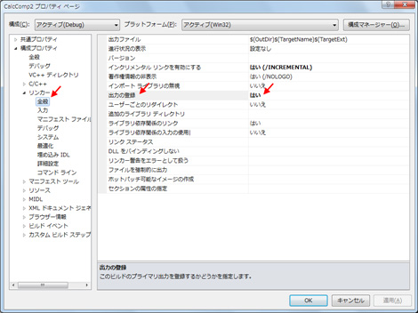

# [連載! とことん VC++] 第 5 回 ATL による COM コンポーネントの基本構造の再確認
## License
- Apache License, Version 2.0
## Technologies
- Visual Studio 2010
- Visual C++ 2010
## Topics
- Visual C++ プログラミング
- 連載! とことん VC++
## Updated
- 06/23/2011
## Description

執筆者: <a href="http://msdn.microsoft.com/ja-jp/gg585574#yajima" target="_blank">
エディフィストラーニング株式会社 矢嶋 聡</a>

<h2>目次</h2>
<ol>
<li><a href="#01">はじめに</a> </li><li><a href="#02">今回作成する COM コンポーネント</a> </li><li><a href="#03">CLSID、IID、COM インターフェイスの定義 ～ MIDL の利用 ～</a> </li><li><a href="#04">COM オブジェクト固有の実装</a> </li><li><a href="#05">IUnknown インターフェイスの実装</a> </li><li><a href="#06">クラス ファクトリの実装</a> </li><li><a href="#07">基本的な関数の実装とエクスポート</a> </li><li><a href="#08">レジストリ登録用のスクリプトの定義と利用</a> </li><li><a href="#09">自己登録用関数の実装とエクスポート</a> </li><li><a href="#10">クライアントの作成</a> </li><li><a href="#11">まとめ</a> </li></ol>

<h2 id="01" style="font-size:120%; margin-top:20px">1. はじめに</h2>

今回は、ATL (Active Template Library) を用いた COM コンポーネント (COM サーバー) の基本的な実装方法について確認します。

ATL は COM プログラミングに関わる豊富な機能が備わった生産性の高いライブラリです。また、Visual Studio が提供する ATL 対応のウィザードを利用すれば、ATL を用いた基本実装のソース コードが自動生成され、プログラマーは開発対象のアプリケーション固有の実装に専念することができます。ただ、ウィザードが生成する ATL のソース コードには様々なクラスやマクロが含まれるので、ATL を使い始めた方にとっては、ATL の使用方法を把握するのに戸惑うかもしれません。

そこで今回は、ウィザードが生成する ATL の基本実装に相当するコードを、手作業で 1 つずつ入力して、1 つの ATL 版の COM コンポーネントを作成し、ATL のライブラリがどのように利用されているのかを確認していきます。

なお、<a href="http://code.msdn.microsoft.com/ja-jp/VisualC-dbc36ad9 ">第 2 回「COM 再入門 ～ COM オブジェクトの基本的実装 ～」</a>では、通常の C&#43;&#43; を用いて COM コンポーネントを作成しましたが、今回は ATL を用いて、同様の実装の COM コンポーネントを作成します。第 2 回における実装方法と対比する箇所もありますので、第 2 回をご覧になっていない方は、予め第 2 回の記事をお読みになることをお奨めします。

<strong>Note:</strong> 
今回も、サンプル コードを机上で確認できるように、サンプル固有の実装部分を一通り掲載していますが、このサンプル コードを入力して動作を確認するのであれば、次の要領でプロジェクトを作成してください。

なお、Visual C&#43;&#43; 2010 Express エディションでは ATL のヘッダーやライブラリが含まれていないため、サンプル コードの確認には、Express エディションよりも上位のエディションが必要です。(この記事を作成する際の検&#35388;には、Professional Edition を使用しました。)

(1) 「Win32 プロジェクト」プロジェクト テンプレートを使用し、以下の名前とバスを指定して、プロジェクトを作成します。(今回は手作業で ATL 関連のコードを入力するので、「ATL プロジェクト」を使用しません。また、既定の x86 版を使用することにします。)

<ul>
<li>名前: CalcComp2 </li><li>場所: C:\SamplesVCpp\Article05\ </li><li>ソリューション名: CalcComp2Sol </li></ul>

(2) プロジェクトの新規作成時に起動する「Win32 アプリケーション ウィザード」では、「アプリケーションの設定」ページにある「アプリケーションの種類」のオプションで、「DLL」オプションを選択します。また、「共通ヘッダー ファイルを追加」のオプションで、「ATL」チェック ボックスをチェックして、ATL のヘッダーを利用可能にしておきます。

(3) ほかは既定値のままにして、プロジェクトを新規作成します。

<a href="#top">ページのトップへ</a>

<h2 id="02" style="font-size:120%; margin-top:20px">2. 今回作成する COM コンポーネント</h2>

最初に、

今回作成する COM コンポーネントがどのようなものか確認しましょう。

今回は、<a href="http://code.msdn.microsoft.com/ja-jp/VisualC-dbc36ad9 ">第 2 回</a>と同様に DLL 形式の COM コンポーネントを作成します。ただし、第 2 回のコンポーネントとの重複を避けるため、CLSID などの識別子や COM インターフェイスは、以下のものを使用します。

<ul>
<li>クラス ID (CLSID) ---- CLSID_CalcObject2 </li><li>インターフェイス ID (IID) ---- IID_ICalcObject2 </li><li>インターフェイスの型名 ---- ICalcObject2 </li></ul>

この ICalcObject2 インターフェイスのメンバーには、第 2 回と同様に、加算を行う Add メソッドが含まれます。

また、ATL を使用して、次表の COM コンポーネントに必要な実装を作り込んでいきます。第 2 回では、5) の自己登録に関しては、.reg ファイルを用いてレジストリに手動で登録しましたが、今回は、ATL を用いて COM コンポーネントに自己登録機能を実装します。

<strong>表 5.A DLL 形式の COM サーバーで必要となる実装</strong>

<table style="margin-bottom:10px; border:1px #CCCCCC solid; border-collapse:collapse; border-spacing:0">
<tbody>
<tr style="background-color:#eff3f7">
<td style="padding:10px; border:1px #CCCCCC solid; border-width:1px; white-space:nowrap; vertical-align:top">
<strong>実装の種類/名前</strong></td>
<td style="padding:10px; border:1px #CCCCCC solid; border-width:1px; white-space:nowrap; vertical-align:top">
<strong>説明</strong></td>
</tr>
<tr>
<td style="padding:10px; border:1px #CCCCCC solid; border-width:1px; vertical-align:top">
1）オブジェクト本体</td>
<td style="padding:10px; border:1px #CCCCCC solid; border-width:1px; vertical-align:top">
ICalcObject2インターフェイスが実装された本体</td>
</tr>
<tr>
<td style="padding:10px; border:1px #CCCCCC solid; border-width:1px; vertical-align:top">
2）クラス オブジェクト 
(クラス ファクトリ)</td>
<td style="padding:10px; border:1px #CCCCCC solid; border-width:1px; vertical-align:top">
上記のオブジェクト インスタンスを提供するオブジェクト、IClassFactory インターフェイス (または IClassFactory2) を実装する</td>
</tr>
<tr>
<td style="padding:10px; border:1px #CCCCCC solid; border-width:1px; vertical-align:top">
3）DllGetClassObject 関数</td>
<td style="padding:10px; border:1px #CCCCCC solid; border-width:1px; vertical-align:top">
COM Library が呼び出す。上記のクラスオ ブジェクトを返す。</td>
</tr>
<tr>
<td style="padding:10px; border:1px #CCCCCC solid; border-width:1px; vertical-align:top">
4）DllCanUnloadNow 関数</td>
<td style="padding:10px; border:1px #CCCCCC solid; border-width:1px; vertical-align:top">
COM Library が呼び出す。DLL のアンロード是非の問い合せに答える。</td>
</tr>
<tr>
<td style="padding:10px; border:1px #CCCCCC solid; border-width:1px; vertical-align:top">
5）DllRegisterServer 関数/DllUnRegister 関数</td>
<td style="padding:10px; border:1px #CCCCCC solid; border-width:1px; vertical-align:top">
レジストリに自身を登録する「自己登録」のための実装 
(オプションの実装)</td>
</tr>
</tbody>
</table>

これらの一連の実装を行う場合、第 2 回で解説した通常の C&#43;&#43; を用いた方法に比べると、ATL を用いた方法では、&#26684;段にコーディングが簡潔になります。その実装手順を順に確認していきましょう。

<a href="#top">ページのトップへ</a>

<h2 id="03" style="font-size:120%; margin-top:20px">3. CLSID、IID、COM インターフェイスの定義 ～ MIDL の利用 ～</h2>

CLSID などの識別子やインターフェイスの型を定義する際に、C&#43;&#43; を用いて手作業で記述することは可能ですが、一般的には MIDL (Microsoft Interface Definition Language) を使用して定義します。

MIDL は、特定のプログラミング言語に依存しないインターフェイスを定義する言語であり、COM や RPC (Remote Procedure Call) で使用されるインターフェイスを定義するためものです。この言語で記述されたソース ファイルを、MIDL コンパイラと呼ばれる専用のコンパイラを用いてコンパイルすると、CLSID の識別子や COM インターフェイスの定義を含む C&#43;&#43; (および C 言語) のソース コードを生成することができます。このほか、タイプ ライブラリも生成することができます。

タイプ ライブラリとは、COM コンポーネントに関する一種のメタ データであり、その COM コンポーネントが提供するオブジェクトの CLSID や、利用可能な COM インターフェイスの型情報などを含みます。このタイプ ライブラリは、拡張子 .tlb の独立したバイナリ ファイルとして利用するか、DLL などの COM コンポーネントにリソースとして埋め込んで利用します。この情報は、COM クライアントがアクセスすべき COM オブジェクトの CLSID やインターフェイスの型を識別する際にも利用できます
 (クライアントからのタイプ ライブラリの利用方法は後述)。

ここでは MIDL を用いて、タイプ ライブラリの定義ほか、CLSID や IID、および COM インターフェイスを定義してみましょう。例 5.1 に示す MIDL をプロジェクトに追加しましょう。

<strong>Note:</strong> 
Visual Studio メニュー操作で MIDL のひな形をプロジェクトに追加する場合、まず、ソリューション エクスプローラー上で CalcComp2 プロジェクトを右クリックし、ショートカット メニューで [追加]、[新しい項目] の順にクリックします。このとき表示される [新しい項目の追加] ダイアログ ボックスのテンプレートのリストから「MIDL ファイル (.idl)」を選択し、例 5.1 に記載されたファイル名を指定して、[追加] ボタンをクリックします。

<strong>例 5.1 MIDL を用いた CLSID、IID、COM インターフェイスなどの定義</strong>

<strong>ファイル名: CalcComp2.idl (新規作成)</strong>

C&#43;&#43;

スクリプトの編集

cplusplus

<pre class="js">import&nbsp;&quot;oaidl.idl&quot;;&nbsp;
import&nbsp;&quot;ocidl.idl&quot;;&nbsp;
&nbsp;
[&nbsp;
&nbsp;&nbsp;&nbsp;&nbsp;object,&nbsp;
&nbsp;&nbsp;&nbsp;&nbsp;uuid(17584AF5-139B-4F14-B8C7-4BF849305A31)&nbsp;&nbsp;&nbsp;//&larr;[1]&nbsp;
]&nbsp;
interface&nbsp;ICalcObject2&nbsp;:&nbsp;IUnknown{&nbsp;&nbsp;&nbsp;&nbsp;&nbsp;&nbsp;&nbsp;&nbsp;&nbsp;&nbsp;&nbsp;&nbsp;&nbsp;&nbsp;&nbsp;//&larr;[2]&nbsp;
&nbsp;&nbsp;&nbsp;&nbsp;HRESULT&nbsp;Add([in]&nbsp;int&nbsp;op1,&nbsp;[in]&nbsp;int&nbsp;op2,&nbsp;[out,retval]&nbsp;int*&nbsp;ret);&nbsp;&nbsp;
};&nbsp;
&nbsp;
[&nbsp;
&nbsp;&nbsp;&nbsp;&nbsp;uuid(7ADE51C7-38CD-4C6C-B2FD-5A7B70DD8153),&nbsp;&nbsp;//&larr;[3]&nbsp;
&nbsp;&nbsp;&nbsp;&nbsp;version(1.0),&nbsp;
]&nbsp;
library&nbsp;CalcComp2Lib&nbsp;&nbsp;//&larr;[4]&nbsp;
{&nbsp;
&nbsp;&nbsp;&nbsp;&nbsp;[&nbsp;
&nbsp;&nbsp;&nbsp;&nbsp;&nbsp;&nbsp;&nbsp;&nbsp;uuid(47F38A62-E865-4842-B7EB-15A97ADA628E)&nbsp;&nbsp;//&larr;[5]&nbsp;
&nbsp;&nbsp;&nbsp;&nbsp;]&nbsp;
&nbsp;&nbsp;&nbsp;&nbsp;coclass&nbsp;CalcObject2&nbsp;&nbsp;&nbsp;&nbsp;&nbsp;&nbsp;&nbsp;&nbsp;&nbsp;&nbsp;&nbsp;&nbsp;&nbsp;&nbsp;&nbsp;&nbsp;&nbsp;&nbsp;&nbsp;&nbsp;&nbsp;&nbsp;&nbsp;&nbsp;&nbsp;&nbsp;&nbsp;&nbsp;&nbsp;//&larr;[6]&nbsp;
&nbsp;&nbsp;&nbsp;&nbsp;{&nbsp;
&nbsp;&nbsp;&nbsp;&nbsp;&nbsp;&nbsp;&nbsp;&nbsp;[default]&nbsp;interface&nbsp;ICalcObject2;&nbsp;&nbsp;&nbsp;&nbsp;&nbsp;&nbsp;&nbsp;&nbsp;&nbsp;&nbsp;&nbsp;//&larr;[7]&nbsp;
&nbsp;&nbsp;&nbsp;&nbsp;};&nbsp;
};&nbsp;
&nbsp;
&nbsp;
</pre>

&nbsp;

ここでは、ATL を用いた COM コンポーネントの基本的な構成を理解することが目的なので、MIDL の構文の詳細は割愛しますが、要点だけ簡単に確認します。(実際のところ、ほとんどの部分は、Visual Studio のウィザードを用いて対話形式で自動生成できます。)

[2] には、IUnknown インターフェイスから派生した ICalcObject2 インターフェイスが定義されています。このインターフェイスのメンバーは Add メソッドです。また、このインターフェイスの IID を [1] で定義しています。 [6] から始まる coclass ブロックが、1 つの CLSID で識別できる 1 つのオブジェクト (正確にはクラス) の定義です。このクラスは [7] のインターフェイスがサポートされており、[5] では CLSID が割り振られています。

また、[4] から始まる library ブロックが、タイプ ライブラリとして扱われ、[3] のように ID (LIBID) も割り振られています。

このように MIDL を記述しておけば、プロジェクトをビルドした際に、識別子やインターフェイスの定義が出力されます。主な出力ファイルには、以下のものが含まれます。(以下のパスは、プロジェクトからの相対パスです。)

<ul>
<li>CalcComp2_h.h&nbsp; ---- ICalcObject2 インターフェイスの定義 </li><li>CalcComp2_i.c ---- CLSID_CalcObject2、IID_ICalcObject2 などの識別子の定義 </li><li>Debug\CalcComp2.tlb ---- タイプ ライブラリ </li></ul>

これで、必要な識別子と COM インターフェイスの定義が出来ました。

<a href="#top">ページのトップへ</a>

<h2 id="04" style="font-size:120%; margin-top:20px">4. COM オブジェクト固有の実装</h2>

次に、今回の COM オブジェクトの固有部分である ICalcObject2 インターフェイスの Add メソッドを実装しましょう。以下の例 5.2 に示す 2 つのファイル (ヘッダー ファイルと C&#43;&#43; ファイル) をプロジェクトに追加してください。

<strong>例 5.2 今回の COM オブジェクトにおける固有の実装部分</strong>

<strong>ファイル名: CalcObject2.h (新規作成)</strong>

C&#43;&#43;

スクリプトの編集

cplusplus

<pre class="js">#pragma&nbsp;once&nbsp;
&nbsp;
#include&nbsp;&quot;CalcComp2_h.h&quot;&nbsp;&nbsp;&nbsp;&nbsp;//&larr;[1]&nbsp;
&nbsp;
class&nbsp;CCalcObject2&nbsp;&nbsp;&nbsp;&nbsp;&nbsp;&nbsp;&nbsp;&nbsp;&nbsp;&nbsp;//&larr;[2]&nbsp;
&nbsp;&nbsp;&nbsp;&nbsp;:&nbsp;public&nbsp;ICalcObject2&nbsp;&nbsp;&nbsp;//&larr;[3]&nbsp;
{&nbsp;
public:&nbsp;
&nbsp;
&nbsp;&nbsp;&nbsp;&nbsp;//virtual&nbsp;HRESULT&nbsp;__stdcall&nbsp;Add(int&nbsp;op1,&nbsp;int&nbsp;op2,&nbsp;int*&nbsp;ret);&nbsp;&nbsp;//&larr;[4]&nbsp;
&nbsp;&nbsp;&nbsp;&nbsp;STDMETHOD(Add)(int&nbsp;op1,&nbsp;int&nbsp;op2,&nbsp;int*&nbsp;ret);&nbsp;&nbsp;&nbsp;&nbsp;&nbsp;&nbsp;&nbsp;&nbsp;&nbsp;&nbsp;&nbsp;&nbsp;&nbsp;&nbsp;&nbsp;&nbsp;&nbsp;&nbsp;&nbsp;//&larr;[5]&nbsp;
};&nbsp;
&nbsp;
&nbsp;
</pre>

&nbsp;

<strong>ファイル名: CalcObject2.cpp (新規作成)</strong>

C&#43;&#43;

スクリプトの編集

cplusplus

<pre class="js">#include&nbsp;&quot;StdAfx.h&quot;&nbsp;
#include&nbsp;&quot;CalcObject2.h&quot;&nbsp;
&nbsp;
//HRESULT&nbsp;__stdcall&nbsp;CCalcObject2::Add(int&nbsp;op1,&nbsp;int&nbsp;op2,&nbsp;int*&nbsp;ret)&nbsp;//&larr;[6]&nbsp;
STDMETHODIMP&nbsp;CCalcObject2::Add(int&nbsp;op1,&nbsp;int&nbsp;op2,&nbsp;int*&nbsp;ret)&nbsp;&nbsp;&nbsp;&nbsp;&nbsp;&nbsp;&nbsp;&nbsp;//&larr;[7]&nbsp;
{&nbsp;
&nbsp;&nbsp;&nbsp;&nbsp;*ret&nbsp;=&nbsp;op1&nbsp;&#43;&nbsp;op2;&nbsp;
&nbsp;&nbsp;&nbsp;&nbsp;return&nbsp;S_OK;&nbsp;
}&nbsp;
&nbsp;
&nbsp;
</pre>

&nbsp;

[1] でインクルードしているファイルは、MIDL によって生成された前述のヘッダー ファイルです。ICalcObject2 インターフェイスを使用するために必要です。

基本的には、これ以外の Add メソッドに関する実装は<a href="http://code.msdn.microsoft.com/ja-jp/VisualC-dbc36ad9 ">第 2 回</a>のものとほぼ同じです。

簡単に確認すると、COM オブジェクト本体のクラスは、[2] に宣言された CCalcObject2 クラスです。このクラス名 CCalcObject2 は任意の名を付けることができますが、ここでは、ATL プロジェクトの通常使用される名前付けの方法に合わせ、MIDL の coclass に指定された名前に「C」を付けました。CCalcObject2 は、ICalcObject2 インターフェイスをサポートするので、[3] でこのインターフェイスを継承しています。また、Add メソッドのオーバーライドは、[4]
 に定義してありますが、今回は [4] をコメント アウトし、代わりに [5] のように、COM のマクロを用いて、同様の定義をしました。

コメント アウトした部分は、第 2 回で紹介した記述方法であり、戻り値の型などの定義を把握しやすくするために用いていました。COM のマクロは、COM で一般的に用いられている方法であり、ATL でも用いられているので、今回は使用しています。このマクロは、保守性や移植性なども考慮した方法であり、たとえば、このマクロを使用すれば、ターゲット プラットフォームに依存する「__stdcall」という呼び出し規約を直接記述しなくて済みます (このマクロは、モトローラー系 CPU をターゲットにした場合は、自動的に「__cdecl」へ置き換えられます)。

同じく、[6] に定義された Add メソッドの実装も、代わりに、[7] のように同等のマクロを使用しています。

これで固有の実装部分が済みました。今回の COM コンポーネントに関する固有の実装は、これですべてです。残りの部分は、COM プログラミングにおけるルーチン ワークです。

たとえば、IUnknown インターフェイスでの AddRef メソッドや Release メソッドによる参照カウンターの増減や、要求された IID に対応するインターフェイス ポインターを返す QueryInterface メソッドの実装、またクラス ファクトリでのインスタンス作成手順などは、対象となるインターフェイスやクラスの型が異なる点を除けば、基本的な手順は同じです。

ATL では、このような実装のために、型の違いをパラメータとしたクラス テンプレートが用意されています。これらのテンプレート ライブラリを使用すれば、前述のルーチン ワークの実装を簡潔に記述できます。しかも、Visual Studio では、ウィザードによってこれらの実装のほとんどを自動生成できるので、プログラマーが固有に記述すべき点は、前述の Add メソッドの部分がほとんど全てです。

ここでは、ATL の基本的な使い方を理解するのが目的なので、残りの部分も手作業で作成することにします。

<a href="#top">ページのトップへ</a>

<h2 id="05" style="font-size:120%; margin-top:20px">5. IUnknown インターフェイスの実装</h2>

次に、COM オブジェクトが実装すべき IUnknown インターフェイスの各メソッドを実装します。ATL のテンプレートとマクロを使用すれば、これらの各メソッドの実装コードをわざわざ記述する必要はなくなります。COM オブジェクトにあたる CCalcObject2 クラスの定義を、次のように変更しましょう。使用するクラスの関係で、stdafx.h にも ATL のヘッダーを 1 つ追加します。修正すべき箇所は太字部分だけです。

<strong>例 5.3 IUnknown インターフェイス相当の実装を追加</strong>

<strong>ファイル名: stdafx.h (既存修正)</strong>

C&#43;&#43;

スクリプトの編集

cplusplus

<pre class="js">#pragma&nbsp;once&nbsp;
&nbsp;
&nbsp;&nbsp;//(省略)&nbsp;
&nbsp;
#include&nbsp;&lt;atlbase.h&gt;&nbsp;
#include&nbsp;&lt;atlstr.h&gt;&nbsp;
#include&nbsp;&lt;atlcom.h&gt;&nbsp;&nbsp;&nbsp;&nbsp;//&larr;[1]&nbsp;追加&nbsp;
&nbsp;
&nbsp;
</pre>

&nbsp;

<strong>ファイル名: CalcObject2.h (既存修正)</strong>

C&#43;&#43;

スクリプトの編集

cplusplus

<pre class="js">#pragma&nbsp;once&nbsp;
&nbsp;
#include&nbsp;&quot;CalcComp2_h.h&quot;&nbsp;
&nbsp;
class&nbsp;CCalcObject2&nbsp;
&nbsp;&nbsp;&nbsp;&nbsp;:&nbsp;public&nbsp;CComObjectRootEx&lt;CComSingleThreadModel&gt;,&nbsp;&nbsp;//&larr;[2]&nbsp;
&nbsp;&nbsp;&nbsp;&nbsp;&nbsp;&nbsp;public&nbsp;ICalcObject2&nbsp;
{&nbsp;
public:&nbsp;
&nbsp;&nbsp;&nbsp;&nbsp;BEGIN_COM_MAP(CCalcObject2)&nbsp;&nbsp;&nbsp;&nbsp;&nbsp;&nbsp;&nbsp;&nbsp;&nbsp;&nbsp;&nbsp;&nbsp;&nbsp;//&larr;[3]&nbsp;
&nbsp;&nbsp;&nbsp;&nbsp;&nbsp;&nbsp;&nbsp;&nbsp;COM_INTERFACE_ENTRY(ICalcObject2)&nbsp;&nbsp;&nbsp;//&larr;[4]&nbsp;
&nbsp;&nbsp;&nbsp;&nbsp;END_COM_MAP()&nbsp;
&nbsp;
&nbsp;&nbsp;&nbsp;&nbsp;//virtual&nbsp;HRESULT&nbsp;__stdcall&nbsp;Add(int&nbsp;op1,&nbsp;int&nbsp;op2,&nbsp;int*&nbsp;ret);&nbsp;&nbsp;&nbsp;&nbsp;&nbsp;
&nbsp;&nbsp;&nbsp;&nbsp;STDMETHOD(Add)(int&nbsp;op1,&nbsp;int&nbsp;op2,&nbsp;int*&nbsp;ret);&nbsp;
};&nbsp;
&nbsp;
&nbsp;
</pre>

&nbsp;

[1] でインクルードしたヘッダーは、ATL のうち、主に COM オブジェクトを実装する際に必要となるヘッダーです。[2] で使用するクラスのためにも必要です。

今回の COM オブジェクトの定義にあたる CCalcObject2 クラスの継承元として、[2] のように、新たに CComObjectRootEx という名前のクラス テンプレートを追加しました。このクラスには、参照カウンターの管理に関わる実装が既に備わっているので、このクラス テンプレートから継承すれば、AddRef メソッドと Release メソッドを改めて記述する必要はありません。また、このクラス テンプレートには、型パラメータとしてスレッディング モデルを指定します。今回は STA (Single
 Thread Apartment) を使用するので、CComSingleThreadModel を指定しています。

また、[3] の 3 行のマクロは、このクラスが提供できる COM インターフェイスを定義したものです。[3] の BEGIN_COM_MAP マクロのパラメータに指定された CCalcObject2 クラスが、インターフェイスを公開するクラスであり、[4] の COM_INTERFACE_ENTRY マクロのパラメータに指定された ICalcObject2 インターフェイスを提供するようになります。[4] のマクロは、BEGIN_COM_MAP から END_COM_MAP までのブロックの中に、複数記述することが可能であり、複数のインターフェイスを提供することもできます。

このマクロの記述は QueryInterface メソッドの内部実装に反映され、QueryInterface メソッドに問い合わせると、ICalcObject2 インターフェイス ポインターを返せるようになります。内部的には、QueryInterface メソッドが返せるインターフェイス一覧のテーブルが作られ、そのテーブルを照会して、該当するインターフェイス ポインターを返すような実装になります。

結局のところ、CCalcObject2 オブジェクトに関する Add メソッド、Release メソッド、および QueryInterface メソッドに関する実装はこれだけです。C&#43;&#43; ファイル (CalcObject2.cpp) にも、これらのメソッドの実装を記述する必要はありません。

これで、表 5.A の「1) オブジェクト本体」が完成しました。問題がなければ、この時点でも正常にコンパイルできます。

<a href="#top">ページのトップへ</a>

<h2 id="06" style="font-size:120%; margin-top:20px">6. クラス ファクトリの実装</h2>

次に、表 5.A の「2) クラス オブジェクト」 (クラス ファクトリ) を実装します。クラス ファクトリは、特定の CLSID のオブジェクトを生成することが主な役割であり、これも ATL のクラス テンプレートを利用できます。ここでは、CCalcObject2 クラスのオブジェクト インスタンスを作成するためのクラス ファクトリが必要であり、次のように CCalcObject2 クラスを変更します。

<strong>例 5.4 クラス ファクトリを追加</strong>

<strong>ファイル名: CalcObject2.h (既存修正)</strong>

C&#43;&#43;

スクリプトの編集

cplusplus

<pre class="js">#pragma&nbsp;once&nbsp;
#pragma&nbsp;once&nbsp;
&nbsp;
#include&nbsp;&quot;CalcComp2_h.h&quot;&nbsp;
&nbsp;
class&nbsp;CCalcObject2&nbsp;
&nbsp;&nbsp;&nbsp;&nbsp;:&nbsp;public&nbsp;CComObjectRootEx&lt;CComSingleThreadModel&gt;,&nbsp;
&nbsp;&nbsp;&nbsp;&nbsp;&nbsp;&nbsp;public&nbsp;CComCoClass&lt;CCalcObject2,&nbsp;&amp;CLSID_CalcObject2&gt;,&nbsp;&nbsp;//&larr;[1]&nbsp;
&nbsp;&nbsp;&nbsp;&nbsp;&nbsp;&nbsp;public&nbsp;ICalcObject2&nbsp;
{&nbsp;
public:&nbsp;
&nbsp;
&nbsp;&nbsp;&nbsp;&nbsp;//ダミー&nbsp;
&nbsp;&nbsp;&nbsp;&nbsp;static&nbsp;HRESULT&nbsp;__stdcall&nbsp;UpdateRegistry(_In_&nbsp;BOOL&nbsp;bRegister)&nbsp;throw()&nbsp;&nbsp;//&larr;[2]&nbsp;
&nbsp;&nbsp;&nbsp;&nbsp;{&nbsp;
&nbsp;&nbsp;&nbsp;&nbsp;&nbsp;&nbsp;&nbsp;&nbsp;return&nbsp;S_OK;&nbsp;
&nbsp;&nbsp;&nbsp;&nbsp;}&nbsp;
&nbsp;
&nbsp;&nbsp;&nbsp;&nbsp;BEGIN_COM_MAP(CCalcObject2)&nbsp;
&nbsp;&nbsp;&nbsp;&nbsp;&nbsp;&nbsp;&nbsp;&nbsp;COM_INTERFACE_ENTRY(ICalcObject2)&nbsp;
&nbsp;&nbsp;&nbsp;&nbsp;END_COM_MAP()&nbsp;
&nbsp;
&nbsp;&nbsp;&nbsp;&nbsp;//virtual&nbsp;HRESULT&nbsp;__stdcall&nbsp;Add(int&nbsp;op1,&nbsp;int&nbsp;op2,&nbsp;int*&nbsp;ret);&nbsp;
&nbsp;&nbsp;&nbsp;&nbsp;STDMETHOD(Add)(int&nbsp;op1,&nbsp;int&nbsp;op2,&nbsp;int*&nbsp;ret);&nbsp;
};&nbsp;
&nbsp;
OBJECT_ENTRY_AUTO(__uuidof(CalcObject2),&nbsp;CCalcObject2)&nbsp;&nbsp;//&larr;[3]&nbsp;
&nbsp;
&nbsp;
</pre>

&nbsp;

CCalcObject2 のクラス ファクトリを実装するには、[1] のように、CComCoClass クラス テンプレートを継承します。このテンプレートでは、2 つのパラメータを必要としており、このクラス ファクトリが作成すべきインスタンスの型 (つまり、CCalcObject2 クラス) と、対応する CLSID を指定します。クラス ファクトリ本体の実装としては、これだけです。

ただし、このクラス ファクトリを ATL 環境で使用するためには、もう 1 つ設定が必要です。

COM クライアントが CoCreateInstance 関数などを使用して、この CLSID に該当するインスタンス作成を試みた場合、COM コンポーネント側では、DllGetClassObject 関数を介して CLSID を受け取ります。そして、ATL の実行環境は、この CLSID に対応するクラス ファクトリや作成すべきクラスを特定できる必要があります。その対応付けを定義しているのが、[3] の OBJECT_ENTRY_AUTO マクロです。1 番目のパラメータに CLSID を指定し、2
 番目のパラメータには、CLSID に対応したクラスを指定します。このクラスは、CComCoClass から継承してクラス ファクトリも備えておく必要があります。

[3] の 1 番目のパラメータの「__uudiof(CalcObject2)」は、今回の CLSID を表現する方法の 1 つです。ここで使用される「CalcObject2」という名前は、MIDL (例 5.1) の coclass キーワードの後に指定されたクラス名であり、MIDL コンパイラによって、この CalcObject2 クラスという名前に、CLSID を割り当てるソース コードも生成されています。そのために、この表記が可能なのです。

なお、[3] のマクロでは、ATL が自己登録の際に使用する関数を指定する効力があります。そのため、CalcObject2 クラスには、[2] のように予め決められた名前の自己登録用の関数 (UpdateRegistry) を用意しておく必要があります。ここでは、[3] のマクロを正常に動作させるために、[2] にダミーの関数を用意しました。

問題がなければ、ここで時点でも正常にコンパイルできます。

<a href="#top">ページのトップへ</a>

<h2 id="07" style="font-size:120%; margin-top:20px">7. 基本的な関数の実装とエクスポート</h2>

次に、表 5.A の「3) DllGetClassObject 関数」と「4) DllCanUnloadNow 関数」を実装しましょう。これも、予め用意された ATL のクラスを使用して、簡単に実装できます。次のように追加と修正を行ってください。

<strong>例 5.5 基本的な関数の実装とエクスポート</strong>

<strong>ファイル名: CalcComp2.def (新規作成) モジュール定義ファイル</strong>

JavaScript

スクリプトの編集

js

<pre class="js">EXPORTS&nbsp;
&nbsp;&nbsp;&nbsp;&nbsp;DllCanUnloadNow&nbsp;&nbsp;&nbsp;&nbsp;&nbsp;PRIVATE&nbsp;
&nbsp;&nbsp;&nbsp;&nbsp;DllGetClassObject&nbsp;&nbsp;&nbsp;PRIVATE&nbsp;
&nbsp;
</pre>

&nbsp;

<strong>ファイル名: dllmain.h (新規作成) main 関数に関連するヘッダー</strong>

C&#43;&#43;

スクリプトの編集

cplusplus

<pre class="js">class&nbsp;CalcComp2Module&nbsp;:&nbsp;public&nbsp;ATL::CAtlDllModuleT&lt;&nbsp;CalcComp2Module&nbsp;&gt;&nbsp;&nbsp;//&larr;[1]&nbsp;
{&nbsp;
public&nbsp;:&nbsp;
&nbsp;
};&nbsp;
&nbsp;
extern&nbsp;class&nbsp;CalcComp2Module&nbsp;_AtlModule;&nbsp;
&nbsp;
&nbsp;
</pre>

&nbsp;

<strong>ファイル名: dllmain.cpp (既存修正) main 関数</strong>

C&#43;&#43;

スクリプトの編集

cplusplus

<pre class="js">#include&nbsp;&quot;stdafx.h&quot;&nbsp;
&nbsp;
#include&nbsp;&quot;dllmain.h&quot;&nbsp;
&nbsp;
CalcComp2Module&nbsp;_AtlModule;&nbsp;&nbsp;//&larr;[2]&nbsp;
&nbsp;
BOOL&nbsp;APIENTRY&nbsp;DllMain(&nbsp;HMODULE&nbsp;hModule,&nbsp;
&nbsp;&nbsp;&nbsp;&nbsp;&nbsp;&nbsp;&nbsp;&nbsp;&nbsp;&nbsp;&nbsp;&nbsp;&nbsp;&nbsp;&nbsp;&nbsp;&nbsp;&nbsp;&nbsp;&nbsp;&nbsp;&nbsp;&nbsp;DWORD&nbsp;&nbsp;ul_reason_for_call,&nbsp;
&nbsp;&nbsp;&nbsp;&nbsp;&nbsp;&nbsp;&nbsp;&nbsp;&nbsp;&nbsp;&nbsp;&nbsp;&nbsp;&nbsp;&nbsp;&nbsp;&nbsp;&nbsp;&nbsp;&nbsp;&nbsp;&nbsp;&nbsp;LPVOID&nbsp;lpReserved&nbsp;
&nbsp;&nbsp;&nbsp;&nbsp;&nbsp;&nbsp;&nbsp;&nbsp;&nbsp;&nbsp;&nbsp;&nbsp;&nbsp;&nbsp;&nbsp;&nbsp;&nbsp;&nbsp;&nbsp;&nbsp;&nbsp;&nbsp;)&nbsp;
{&nbsp;
&nbsp;&nbsp;&nbsp;&nbsp;return&nbsp;_AtlModule.DllMain(ul_reason_for_call,&nbsp;lpReserved);&nbsp;&nbsp;//&larr;[3]&nbsp;
}&nbsp;
&nbsp;
&nbsp;
</pre>

&nbsp;

<strong>ファイル名: CalcComp2.cpp (既存修正)</strong>

C&#43;&#43;

スクリプトの編集

cplusplus

<pre class="js">#include&nbsp;&quot;stdafx.h&quot;&nbsp;
&nbsp;
#include&nbsp;&quot;dllmain.h&quot;&nbsp;
&nbsp;
//extern&nbsp;&quot;C&quot;&nbsp;HRESULT&nbsp;__stdcall&nbsp;DllGetClassObject(REFCLSID&nbsp;rclsid,&nbsp;REFIID&nbsp;riid,&nbsp;void**&nbsp;ppv)&nbsp;
STDAPI&nbsp;DllGetClassObject(REFCLSID&nbsp;rclsid,&nbsp;REFIID&nbsp;riid,&nbsp;LPVOID*&nbsp;ppv)&nbsp;&nbsp;//&larr;[4]&nbsp;
{&nbsp;
&nbsp;&nbsp;&nbsp;&nbsp;return&nbsp;_AtlModule.DllGetClassObject(rclsid,&nbsp;riid,&nbsp;ppv);&nbsp;
}&nbsp;
&nbsp;
//extern&nbsp;&quot;C&quot;&nbsp;HRESULT&nbsp;__stdcall&nbsp;DllCanUnloadNow()&nbsp;
STDAPI&nbsp;DllCanUnloadNow(void)&nbsp;&nbsp;//&larr;[5]&nbsp;
{&nbsp;
&nbsp;&nbsp;&nbsp;&nbsp;return&nbsp;_AtlModule.DllCanUnloadNow();&nbsp;
}&nbsp;
&nbsp;
&nbsp;
</pre>

&nbsp;

まず、モジュール定義ファイル (CalcComp2.def) については、<a href="http://code.msdn.microsoft.com/ja-jp/VisualC-dbc36ad9 ">第 2 回</a>に説明したものと同様であり、DllCanUnloadNow 関数と DllGetClassObject 関数をエクスポートしています。

エクスポートが必要な関数や dllmain 関数に関する実装は、[1] に定義した CAtlDllModuleT 派生クラス (ここでは CalcComp2Module クラス) を使用します。CAtlDllModuleT クラスから派生するだけで、特に実装を追加する必要はありません。

このクラスを定義したのち、[2] のようにグローバ オブジェクト (変数 _AtlModule) として宣言し、[3] のとおり、このオブジェクトのメンバー関数 dllmain を呼び出すように実装すれば、この DLL の dllmain 関数の実装は完成します。

また、[4] や [5] のように DllGetClassObject 関数や DllCanUnloadNow 関数も、それぞれの関数の中で、CalcComp2Module オブジェクト (変数 _AtlModule) の同名のメンバー関数を呼び出すだけです。なお、2 つの関数定義には STDAPI マクロを用いてみました。それぞれの直前のコメント行には、マクロを用いない従来の書き方を示しておきました。

これだけで、2 つの関数が備えるべき実装が実現できます。DllGetClassObject 関数の役割は、クライアントから要求された CLSID (引数 rclsid) に対して、対応するクラス ファクトリを返すことですが、そのためにも、例 5.4 の [3] のマクロを使用した CLSID との対応付けが必要です。

これで、第 2 回に作成した COM コンポーネントと同様の実装になりました。仮にこの時点でビルドして DLL を作成し、手動でレジストリに登録すれば、<a href="http://code.msdn.microsoft.com/ja-jp/VisualC-7c6bc862 ">第 1 回</a>に説明した COM クライアントと同様の要領で、この ATL の COM コンポーネントを呼び出すことができます。

しかし、ここではより ATL らしくするため、自己登録機能も実装しましょう。

<a href="#top">ページのトップへ</a>

<h2 id="08" style="font-size:120%; margin-top:20px">8. レジストリ登録用のスクリプトの定義と利用</h2>

自己登録機能のために必要な実装は、表 5.A の「5) DllRegisterServer 関数 / DllUnRegister 関数」です。この関数の最も原始的な実装は、レジストリ登録用の API を呼び出して、1 つずつ、レジストリ キーを作成する方法です。これは単純作業ですが、意外と手間がかかります。

ATL では、より直観的に記述できるスクリプト (レジストリ スクリプト) を使用して、レジストリに登録する仕組みが用意されています。ここでも、このスクリプトを使用します。例 5.6 に示すレジストリ スクリプトをプロジェクトに追加しましょう。

<strong>Note:</strong> 
Visual Studio メニュー操作でレジストリ スクリプトのひな形をプロジェクトに追加する場合、まず、ソリューション エクスプローラー上で CalcComp2 プロジェクトを右クリックし、ショートカット メニューで [追加]、[新しい項目] の順にクリックします。このとき表示される [新しい項目の追加] ダイアログ ボックスのテンプレートのリストから「レジストリ スクリプト (.rgs)」を選択し、例 5.6 に記載されたファイル名を指定して、[追加] ボタンをクリックします。

<strong>例 5.6 レジストリ スクリプト</strong>

<strong>ファイル名: CalcObject2.rgs (新規作成)</strong>

C&#43;&#43;

スクリプトの編集

cplusplus

<pre class="js">HKCR&nbsp;
{&nbsp;
&nbsp;&nbsp;&nbsp;&nbsp;NoRemove&nbsp;CLSID&nbsp;
&nbsp;&nbsp;&nbsp;&nbsp;{&nbsp;
&nbsp;&nbsp;&nbsp;&nbsp;&nbsp;&nbsp;&nbsp;&nbsp;ForceRemove&nbsp;{47F38A62-E865-4842-B7EB-15A97ADA628E}&nbsp;=&nbsp;s&nbsp;'CalcObject2&nbsp;Class'&nbsp;
&nbsp;&nbsp;&nbsp;&nbsp;&nbsp;&nbsp;&nbsp;&nbsp;{&nbsp;
&nbsp;&nbsp;&nbsp;&nbsp;&nbsp;&nbsp;&nbsp;&nbsp;&nbsp;&nbsp;&nbsp;&nbsp;InprocServer32&nbsp;=&nbsp;s&nbsp;'%MODULE%'&nbsp;
&nbsp;&nbsp;&nbsp;&nbsp;&nbsp;&nbsp;&nbsp;&nbsp;&nbsp;&nbsp;&nbsp;&nbsp;{&nbsp;
&nbsp;&nbsp;&nbsp;&nbsp;&nbsp;&nbsp;&nbsp;&nbsp;&nbsp;&nbsp;&nbsp;&nbsp;val&nbsp;ThreadingModel&nbsp;=&nbsp;s&nbsp;'Apartment'&nbsp;
&nbsp;&nbsp;&nbsp;&nbsp;&nbsp;&nbsp;&nbsp;&nbsp;&nbsp;&nbsp;&nbsp;&nbsp;}&nbsp;
&nbsp;&nbsp;&nbsp;&nbsp;&nbsp;&nbsp;&nbsp;&nbsp;&nbsp;&nbsp;&nbsp;&nbsp;TypeLib&nbsp;=&nbsp;s&nbsp;'{7ADE51C7-38CD-4C6C-B2FD-5A7B70DD8153}'&nbsp;
&nbsp;&nbsp;&nbsp;&nbsp;&nbsp;&nbsp;&nbsp;&nbsp;&nbsp;&nbsp;&nbsp;&nbsp;Version&nbsp;=&nbsp;s&nbsp;'1.0'&nbsp;
&nbsp;&nbsp;&nbsp;&nbsp;&nbsp;&nbsp;&nbsp;&nbsp;}&nbsp;
&nbsp;&nbsp;&nbsp;&nbsp;}&nbsp;
}&nbsp;
&nbsp;
&nbsp;
</pre>

&nbsp;

ここでは、レジストリ スクリプトの構文の詳細は割愛しますが、<a href="http://code.msdn.microsoft.com/ja-jp/VisualC-dbc36ad9 ">第 2 回</a>で取り上げた COM サーバー向けのレジストリ情報の構造を表していることが読み取れると思います。

さらに、このレジストリ スクリプトを使用するために、リソースとして組み込みます。以下のリソース スクリプトを作成してプロジェクトに追加してください。簡単にするため、リソース ビューを使用せずに、予めメモ帳などでリソース スクリプト (myresource.rc) を作成し、後からプロジェクトに組み込むとよいでしょう。

<strong>例 5.7 レジストリ スクリプトをリソースとして組み込むためのリソース スクリプト</strong>

<strong>ファイル名: myresource.h (新規作成)</strong>

C&#43;&#43;

スクリプトの編集

cplusplus

<pre class="js">#pragma&nbsp;once&nbsp;
#define&nbsp;IDR_CALCCOMP2&nbsp;1000&nbsp;
&nbsp;
&nbsp;
</pre>

&nbsp;

<strong>ファイル名: myresource.rc (新規作成) リソース スクリプト</strong>

C&#43;&#43;

スクリプトの編集

cplusplus

<pre class="js">#include&nbsp;&quot;myresource.h&quot;&nbsp;
IDR_CALCCOMP2&nbsp;&nbsp;&nbsp;REGISTRY&nbsp;&nbsp;&quot;CalcObject2.rgs&quot;&nbsp;
1&nbsp;TYPELIB&nbsp;&quot;DEBUG\CalcObject2.tlb&quot;&nbsp;
&nbsp;
&nbsp;
</pre>

&nbsp;

このリソース スクリプト myresource.rc の 2 行目の記述によって、レジストリ スクリプト CalcObject2.rgs は DLL コンポーネントのリソースとして取り込まれ、IDR_CALCCOMP2 という識別子が付きます。

また、3 行目はタイプ ライブラリをリソースに埋め込むための記述です。今回の自己登録では、DLL コンポーネントがタイプ ライブラリを提供可能である点もレジストリに登録されるので、タイプ ライブラリを DLL に組み込んでおきます。(このようにしないと、このあとの ATL を利用した自己登録に失敗します。) なお、タイプ ライブラリのリソース ID は、1 にしておく必要があります。(後述のクライアント環境から、#import ディレクティブを使用して参照するために必要です。)

そして、このリソースを使用して、レジストリに登録するように実装します。この自己登録を行うべき場所は、例 5.4 の UpdateRegistry 関数です。この関数は、自己登録が必要になったとき ATL のライブラリが呼び出します。ただし、プログラマーがこの実装コードを記述する必要はありません。これもマクロで置き換えることができます。例 5.4 で記述したダミーの UpdateRegistry 関数を次のマクロに置き換えてください。

<strong>例 5.8 マクロを利用した自己登録機能の実装</strong>

<strong>ファイル名: CalcObject2.h (既存修正)</strong>

C&#43;&#43;

スクリプトの編集

cplusplus

<pre class="js">#pragma&nbsp;once&nbsp;
#pragma&nbsp;once&nbsp;
&nbsp;
#include&nbsp;&quot;CalcComp2_h.h&quot;&nbsp;
#include&nbsp;&quot;myresource.h&quot;&nbsp;&nbsp;&nbsp;//&larr;[1]&nbsp;
&nbsp;
class&nbsp;CCalcObject2&nbsp;
&nbsp;&nbsp;&nbsp;&nbsp;:&nbsp;public&nbsp;CComObjectRootEx&lt;CComSingleThreadModel&gt;,&nbsp;
&nbsp;&nbsp;&nbsp;&nbsp;&nbsp;&nbsp;public&nbsp;CComCoClass&lt;CCalcObject2,&nbsp;&amp;CLSID_CalcObject2&gt;,&nbsp;
&nbsp;&nbsp;&nbsp;&nbsp;&nbsp;&nbsp;public&nbsp;ICalcObject2&nbsp;
{&nbsp;
public:&nbsp;
&nbsp;
&nbsp;&nbsp;&nbsp;&nbsp;DECLARE_REGISTRY_RESOURCEID(IDR_CALCCOMP2)&nbsp;&nbsp;//&larr;[2]&nbsp;
&nbsp;
&nbsp;&nbsp;&nbsp;&nbsp;BEGIN_COM_MAP(CCalcObject2)&nbsp;
&nbsp;&nbsp;&nbsp;&nbsp;&nbsp;&nbsp;&nbsp;&nbsp;COM_INTERFACE_ENTRY(ICalcObject2)&nbsp;
&nbsp;&nbsp;&nbsp;&nbsp;END_COM_MAP()&nbsp;
&nbsp;
&nbsp;&nbsp;&nbsp;&nbsp;//virtual&nbsp;HRESULT&nbsp;__stdcall&nbsp;Add(int&nbsp;op1,&nbsp;int&nbsp;op2,&nbsp;int*&nbsp;ret);&nbsp;
&nbsp;&nbsp;&nbsp;&nbsp;STDMETHOD(Add)(int&nbsp;op1,&nbsp;int&nbsp;op2,&nbsp;int*&nbsp;ret);&nbsp;
};&nbsp;
&nbsp;
OBJECT_ENTRY_AUTO(__uuidof(CalcObject2),&nbsp;CCalcObject2)&nbsp;
&nbsp;
&nbsp;
</pre>

&nbsp;

[2] のように、DECLARE_REGISTRY_RESOURCEID マクロの 1 行だけになります。このマクロのパラメータには、読み込むべきレジストリ スクリプトのリソース ID (ここでは IDR_CALCCOMP2) を指定します。そのため、[1] のヘッダーも必要です。 このマクロは、UpdateRegistry 関数に展開され、レジストリ スクリプトを読み込み、これをもとにレジストリに登録を行うようになります。

<a href="#top">ページのトップへ</a>

<h2 id="09" style="font-size:120%; margin-top:20px">9. 自己登録用関数の実装とエクスポート</h2>

次に、表 5.A の 5) に挙げた 2 つの関数の実装とエクスポートを行います。次のように追加修正してください (太字部分)。

<strong>例 5.9 自己登録用関数の実装とエクスポート</strong>

<strong>ファイル名: CalcComp2.def (新規作成) モジュール定義ファイル</strong>

C&#43;&#43;

スクリプトの編集

cplusplus

<pre class="js">EXPORTS&nbsp;
&nbsp;&nbsp;&nbsp;&nbsp;DllCanUnloadNow&nbsp;&nbsp;&nbsp;&nbsp;&nbsp;&nbsp;PRIVATE&nbsp;
&nbsp;&nbsp;&nbsp;&nbsp;DllGetClassObject&nbsp;&nbsp;&nbsp;&nbsp;PRIVATE&nbsp;
&nbsp;&nbsp;&nbsp;&nbsp;DllRegisterServer&nbsp;&nbsp;&nbsp;&nbsp;PRIVATE&nbsp;
&nbsp;&nbsp;&nbsp;&nbsp;DllUnregisterServer&nbsp;&nbsp;PRIVATE&nbsp;
&nbsp;
&nbsp;
</pre>

&nbsp;

<strong>ファイル名: CalcComp2.cpp (既存修正)</strong>

C&#43;&#43;

スクリプトの編集

cplusplus

<pre class="js">#include&nbsp;&quot;stdafx.h&quot;&nbsp;
&nbsp;
#include&nbsp;&quot;dllmain.h&quot;&nbsp;
&nbsp;
//extern&nbsp;&quot;C&quot;&nbsp;HRESULT&nbsp;__stdcall&nbsp;DllGetClassObject(REFCLSID&nbsp;rclsid,&nbsp;REFIID&nbsp;riid,&nbsp;void**&nbsp;ppv)&nbsp;
STDAPI&nbsp;DllGetClassObject(REFCLSID&nbsp;rclsid,&nbsp;REFIID&nbsp;riid,&nbsp;LPVOID*&nbsp;ppv)&nbsp;
{&nbsp;
&nbsp;&nbsp;&nbsp;&nbsp;return&nbsp;_AtlModule.DllGetClassObject(rclsid,&nbsp;riid,&nbsp;ppv);&nbsp;
}&nbsp;
&nbsp;
//extern&nbsp;&quot;C&quot;&nbsp;HRESULT&nbsp;__stdcall&nbsp;DllCanUnloadNow()&nbsp;
STDAPI&nbsp;DllCanUnloadNow(void)&nbsp;
{&nbsp;
&nbsp;&nbsp;&nbsp;&nbsp;return&nbsp;_AtlModule.DllCanUnloadNow();&nbsp;
}&nbsp;
&nbsp;
//extern&nbsp;&quot;C&quot;&nbsp;HRESULT&nbsp;__stdcall&nbsp;DllRegisterServer(void)&nbsp;&nbsp;
STDAPI&nbsp;DllRegisterServer(void)&nbsp;//&larr;[1]&nbsp;
{&nbsp;
&nbsp;&nbsp;&nbsp;&nbsp;HRESULT&nbsp;hr&nbsp;=&nbsp;_AtlModule.DllRegisterServer();&nbsp;
&nbsp;&nbsp;&nbsp;&nbsp;return&nbsp;hr;&nbsp;
}&nbsp;
&nbsp;
//extern&nbsp;&quot;C&quot;&nbsp;HRESULT&nbsp;__stdcall&nbsp;DllUnregisterServer(void)&nbsp;
STDAPI&nbsp;DllUnregisterServer(void)&nbsp;//&larr;[2]&nbsp;
{&nbsp;
&nbsp;&nbsp;&nbsp;&nbsp;HRESULT&nbsp;hr&nbsp;=&nbsp;_AtlModule.DllUnregisterServer();&nbsp;
&nbsp;&nbsp;&nbsp;&nbsp;return&nbsp;hr;&nbsp;
}&nbsp;
&nbsp;
&nbsp;
</pre>

&nbsp;

モジュール定義ファイル (CalcComp2.def) では、エクスポートする 2 つの関数が追加されました。

また、[1] や [2] のように、2 つの関数の実装は、CalcComp2Module オブジェクト (変数 _AtlModule) の同名のメンバー関数を呼び出すだけです。このように実装しておけば、必要に応じて、例 5.8 の [2] でマクロを用いて定義した UpdateRegistry 関数が呼び出されます。

これで COM コンポーネントは完成です。Regsvr32.exe ツールを使用して、このコンポーネントの自己登録機能を呼び出して、レジストリに登録できるようになりました。

ここではビルドの際に、この自己登録を行えるようにするため、プロジェクトを設定しておきましょう。そのためには、プロジェクト プロパティ ページを開き、プロパティ ページが開いたら、左ペインのツリーで、[構成プロパティ]、[リンカー]、[全般] の順にノードを展開し、右ペインで「出力の登録」という欄の値を「はい」へ変更します。

<strong>図 5.1 ビルド時の登録の指定</strong>

なお、ビルド時に登録するためには、管理者として Visual Studio を起動する必要があります。このあとは、一旦 Visual Studio を終了して、管理者として再度起動してプロジェクトを開いておいてください。

ここでビルドを行い、登録も成功すれば、正常にビルドが終了します。

<strong>Note:</strong> 
これ以外にも、自己登録に利用する関数として、DllInstall 関数がありますが、ここでは簡単にするため、最小限の実装にしました。

これで、COM コンポーネントが完成しました。今回は ATL の使い方を理解するため、ほぼすべて手作業で入力しましたが、実際は Visual Studio によって、その多くを自動生成できます。今まで作成したファイルに関して、Visual Studio での対応状況は次表 5.B のとおりです。

この表のうち、プログラマーが手作業で入力する必要があるのは、表中の [1] の太字部分のみであり、例 5.2 (CalcObject2.cpp) の Add メソッド内部の実装コードだけです。残りの部分は、ATL プロジェクトや ATL シンプル オブジェクト ウィザード、また、クラス ビューでの対話操作を利用することで、自動生成させることができます。Visual Studio を用いれば、このような COM コンポーネントも簡単に作成することができるのです。

もちろん、仮に ATL 関連のコードを手作業で入力したとしても、通常の C&#43;&#43; で記述するのに比べて、簡潔であることは実感頂けたかと思います。

<strong>表 5.B 今回のサンプル コードの実装における Visual Studio の対応状況</strong>

<table style="margin-bottom:10px; border:1px #CCCCCC solid; border-collapse:collapse; border-spacing:0">
<tbody>
<tr style="background-color:#eff3f7">
<td style="padding:10px; border:1px #CCCCCC solid; border-width:1px; white-space:nowrap; vertical-align:top">
<strong>ファイル名</strong></td>
<td style="padding:10px; border:1px #CCCCCC solid; border-width:1px; white-space:nowrap; vertical-align:top">
<strong>役割/特徴</strong></td>
<td style="padding:10px; border:1px #CCCCCC solid; border-width:1px; white-space:nowrap; vertical-align:top">
<strong>対応状況</strong></td>
</tr>
<tr>
<td style="padding:10px; border:1px #CCCCCC solid; border-width:1px; vertical-align:top">
CalcObject2.idl</td>
<td style="padding:10px; border:1px #CCCCCC solid; border-width:1px; vertical-align:top">
MIDL 
(インターフェイスの型、IID、coclass の構成、CLSID、および、タイプ ライブラリの定義)</td>
<td style="padding:10px; border:1px #CCCCCC solid; border-width:1px; vertical-align:top">
ATL プロジェクトの新規作成時に、ひな形が自動生成される。 
ATL シンプル オブジェクト ウィザードによって、インターフェイスと coclass の定義が自動追加される。 
クラス ビューでの対話操作を介して、インターフェイスにメソッドが自動追加される。</td>
</tr>
<tr>
<td style="padding:10px; border:1px #CCCCCC solid; border-width:1px; vertical-align:top">
CalcObject2.h 
CalcObject2.cpp</td>
<td style="padding:10px; border:1px #CCCCCC solid; border-width:1px; vertical-align:top">
COM オブジェクト本体と 
そのクラス ファクトリの実装 
(CCalcObject2 クラス、および、 
BEGIN_COM_MAP、 
COM_INTERFACE_ENTRY、 
END_COM_MAP、 
OBJECT_ENTRY_AUTO、 
DECLARE_REGISTRY_RESOURCEID の各種マクロ)</td>
<td style="padding:10px; border:1px #CCCCCC solid; border-width:1px; vertical-align:top">
ATL シンプル オブジェクト ウィザードによって、CComObjectRootEx、CComCoClass、およびインターフェイスを継承し、各種マクロを伴うクラスが自動生成される。 
クラス ビューとの対話操作を介して、インターフェイスにメソッドのひな形が自動追加される。 
<strong>自動追加されたメソッドのひな形の中に、手作業で実装コードを記述する。</strong>-------- [1]</td>
</tr>
<tr>
<td style="padding:10px; border:1px #CCCCCC solid; border-width:1px; vertical-align:top">
stdafx.h</td>
<td style="padding:10px; border:1px #CCCCCC solid; border-width:1px; vertical-align:top">
ATL 関連のインクルード</td>
<td style="padding:10px; border:1px #CCCCCC solid; border-width:1px; vertical-align:top">
ATL プロジェクトの新規作成時に、自動生成される。</td>
</tr>
<tr>
<td style="padding:10px; border:1px #CCCCCC solid; border-width:1px; vertical-align:top">
CalcComp2.def</td>
<td style="padding:10px; border:1px #CCCCCC solid; border-width:1px; vertical-align:top">
関数のエクスポート</td>
<td style="padding:10px; border:1px #CCCCCC solid; border-width:1px; vertical-align:top">
ATL プロジェクトの新規作成時に、自動生成される。</td>
</tr>
<tr>
<td style="padding:10px; border:1px #CCCCCC solid; border-width:1px; vertical-align:top">
dllmain.h 
dllmain.cpp</td>
<td style="padding:10px; border:1px #CCCCCC solid; border-width:1px; vertical-align:top">
CAtlDllModuleT 派生クラス 
dllmain 関数</td>
<td style="padding:10px; border:1px #CCCCCC solid; border-width:1px; vertical-align:top">
ATL プロジェクトの新規作成時に、自動生成される。</td>
</tr>
<tr>
<td style="padding:10px; border:1px #CCCCCC solid; border-width:1px; vertical-align:top">
CalcComp2.cpp</td>
<td style="padding:10px; border:1px #CCCCCC solid; border-width:1px; vertical-align:top">
DllGetClassObject 関数 
DllCanUnloadNow 関数 
DllRegisterServer 関数 
DllUnregisterServer 関数</td>
<td style="padding:10px; border:1px #CCCCCC solid; border-width:1px; vertical-align:top">
ATL プロジェクトの新規作成時に、自動生成される。</td>
</tr>
<tr>
<td style="padding:10px; border:1px #CCCCCC solid; border-width:1px; vertical-align:top">
CalcObject2.rgs</td>
<td style="padding:10px; border:1px #CCCCCC solid; border-width:1px; vertical-align:top">
レジストリ スクリプト</td>
<td style="padding:10px; border:1px #CCCCCC solid; border-width:1px; vertical-align:top">
ATL シンプル オブジェクト ウィザードによって、自動生成される。</td>
</tr>
<tr>
<td style="padding:10px; border:1px #CCCCCC solid; border-width:1px; vertical-align:top">
myresource.h 
myresource.cpp</td>
<td style="padding:10px; border:1px #CCCCCC solid; border-width:1px; vertical-align:top">
レジストリ スクリプト、およびタイプ ライブラリのためのリソース定義</td>
<td style="padding:10px; border:1px #CCCCCC solid; border-width:1px; vertical-align:top">
ATL プロジェクトの新規作成時に、タイプ ライブラリをリソースとして組み込むように自動構成される。 
ATL シンプル オブジェクト ウィザードによって、レジストリ スクリプトをリソースとして組み込むように自動構成される。</td>
</tr>
</tbody>
</table>

<a href="#top">ページのトップへ</a>

<h2 id="10" style="font-size:120%; margin-top:20px">10. クライアントの作成</h2>

クライアントについては、<a href="http://code.msdn.microsoft.com/ja-jp/VisualC-7c6bc862 ">第 1 回</a>で作成したものと同様なので詳細は割愛します。ただし、今までと違う点は、タイプ ライブラリを利用できる点です。クライアントのビルド時に、タイプ ライブラリを使用することで、必要なインターフェイスの型や CLSID などの識別子が定義されたヘッダー ファイルが自動的に生成され、これを利用できます。

以下にクライアントのサンプル コードを示します。余力のある方は、Win32 コンソール アプリケーション プロジェクトを作成し、以下のコードを入力し、実行してみてください。

<strong>例 5.10 クライアント アプリケーション</strong>

C&#43;&#43;

スクリプトの編集

cplusplus

<pre class="js">#include&nbsp;&quot;stdafx.h&quot;&nbsp;
#include&nbsp;&lt;ObjBase.h&gt;&nbsp;
&nbsp;
#import&nbsp;&quot;..\Debug\CalcComp2.dll&quot;&nbsp;no_namespace&nbsp;named_guids&nbsp;raw_interfaces_only&nbsp;&nbsp;//&larr;[1]&nbsp;
//#import&nbsp;&quot;..\CalcComp2\Debug\CalcComp2.tlb&quot;&nbsp;no_namespace&nbsp;named_guids&nbsp;raw_interfaces_only&nbsp;
//#include&nbsp;&quot;Debug\calccomp2.tlh&quot;&nbsp;
&nbsp;
int&nbsp;_tmain(int&nbsp;argc,&nbsp;_TCHAR*&nbsp;argv[])&nbsp;
{&nbsp;
&nbsp;&nbsp;&nbsp;&nbsp;HRESULT&nbsp;hr;&nbsp;
&nbsp;&nbsp;&nbsp;&nbsp;hr&nbsp;=&nbsp;::CoInitializeEx(NULL,&nbsp;COINIT_APARTMENTTHREADED);&nbsp;
&nbsp;
&nbsp;&nbsp;&nbsp;&nbsp;ICalcObject2&nbsp;*pObj;&nbsp;
&nbsp;&nbsp;&nbsp;&nbsp;hr&nbsp;=&nbsp;::CoCreateInstance(CLSID_CalcObject2,&nbsp;NULL,&nbsp;CLSCTX_INPROC_SERVER,&nbsp;
&nbsp;&nbsp;&nbsp;&nbsp;&nbsp;&nbsp;&nbsp;&nbsp;&nbsp;&nbsp;&nbsp;&nbsp;&nbsp;&nbsp;&nbsp;&nbsp;&nbsp;&nbsp;&nbsp;&nbsp;&nbsp;&nbsp;&nbsp;&nbsp;&nbsp;&nbsp;&nbsp;&nbsp;IID_ICalcObject2,&nbsp;(void**)&amp;pObj);&nbsp;
&nbsp;&nbsp;&nbsp;&nbsp;if(hr&nbsp;==&nbsp;S_OK)&nbsp;
&nbsp;&nbsp;&nbsp;&nbsp;{&nbsp;
&nbsp;&nbsp;&nbsp;&nbsp;&nbsp;&nbsp;&nbsp;&nbsp;int&nbsp;ret;&nbsp;
&nbsp;&nbsp;&nbsp;&nbsp;&nbsp;&nbsp;&nbsp;&nbsp;hr&nbsp;=&nbsp;pObj-&gt;Add(10,&nbsp;15,&nbsp;&amp;ret);&nbsp;
&nbsp;&nbsp;&nbsp;&nbsp;&nbsp;&nbsp;&nbsp;&nbsp;::printf(&quot;ret=%d\n&quot;,&nbsp;ret);&nbsp;
&nbsp;&nbsp;&nbsp;&nbsp;&nbsp;&nbsp;&nbsp;&nbsp;pObj-&gt;Release();&nbsp;
&nbsp;&nbsp;&nbsp;&nbsp;}&nbsp;
&nbsp;
&nbsp;&nbsp;&nbsp;&nbsp;::CoUninitialize();&nbsp;
&nbsp;
&nbsp;&nbsp;&nbsp;&nbsp;return&nbsp;0;&nbsp;
}&nbsp;
&nbsp;
&nbsp;
</pre>

&nbsp;

ポイントは、識別子 CLSID_CalcObject2 や ICalcObject2 型のインターフェイスを使用するために、ヘッダー ファイルをインクルードするのではなく、[1] のように #import ディレクティブを使用して、直接 DLL ファイルを参照している点です。

<strong>Note:</strong> 
ここで指定したパスは、CalcComp2 プロジェクトと同一のソリューションに、クライアント プロジェクトが含まれていることを前提しています。また、先に CalcComp2 がビルドされるように、「プロジェクト依存関係」として、クライアントのプロジェクトが CalcComp2 プロジェクトに依存するように設定してください。(プロジェクト依存関係は、ソリューション エクスプローラー上のソリューション ノードを右クリックし、ショートカット メニューの [プロジェクト依存関係] から指定できます。)

[1] のように指定すると、DLL 内部にリソースとして埋め込まれたタイプ ライブラリを使用して、必要なヘッダー ファイルを自動生成できます。(例 5.7 で触れたように、タイプ ライブラリのリソース ID は 1 にする必要があります。)

このディレクティブに指定された「no_namespace」は、生成されるヘッダーに名前空間を含まないようにするためのものです。既定では、タイプ ライブラリ名の名前空間内に定義されます。また、「named_guids」の指定によって、CLSID などの識別子が生成されます。最後の「raw_interfaces_only」の指定によって、COM インターフェイスが生成されます。これを付けないと、COM インターフェイスをラップしたオブジェクトの定義が生成されます。

なお、[1] の次行にあるように、タイプ ライブラリ ファイル (.tlb ファイル) を直接指定することもできます。また、さらに次行に示すように、この #import ディレクティブによって生成されたヘッダー ファイル (calccomp2.tlh) を直接インクルードすることも可能です。

これを実行すると、COM オブジェクトの Add メソッドが呼び出され、実行結果として「ret=25」とコンソールに表示されるはずです。

<a href="#top">ページのトップへ</a>

<h2 id="11" style="font-size:120%; margin-top:20px">11. まとめ</h2>

今回は、ATL を用いた COM コンポーネントの基本的実装方法を確認しました。COM プログラミングにおける IUnknown インターフェイスの実装やクラス ファクトリの実装など、ルーチン ワークの部分はほとんど ATL で用意されおり、プログラマーが独自に記述すべき点は、例 5.2 の Add メソッドの固有機能を実装する部分など、ごく限られた部分であることが確認できました。また、固有の実装部分以外は、その多くが Visual Studio のウィザードによって生成されるコードであり、今回はそれを手作業で入力することによって、ATL
 のライブラリの基本的な使用方法について確認しました。実際の ATL プロジェクトには、これ以外のクラス テンプレートやマクロも使用されています。今後、それらについて調べたり、また、ATL のウィザードが生成したコードをカスタマイズしたりする際に、今回の記事がお役に立てば幸いです。

<a href="#top">ページのトップへ</a>

<table>
<tbody>
<tr>
<td></td>
<td></td>
<td>
<ul>
<li>もっと他のコンテンツを見る &gt;&gt; <a href="http://msdn.microsoft.com/ja-jp/visualc/hh146885" target="_blank">
連載! とことん Visual C&#43;&#43; 一覧へ</a> </li><li>もっと他のレシピを見る &gt;&gt; <a href="http://code.msdn.microsoft.com/ja-jp">Code Recipe へ</a>
</li><li>もっと Visual C&#43;&#43; の情報を見る &gt;&gt; <a href="http://msdn.microsoft.com/ja-jp/visualc/" target="_blank">
Visual C&#43;&#43; デベロッパー センターへ</a> </li></ul>
</td>
</tr>
</tbody>
</table>

<a href="#top">ページのトップへ</a>

