# [連載! とことん VC++] 第 6 回 MFC アプリケーションの基本構造の再確認 ～ドキュメント/ビュー アーキテクチャ～
## Requires
- 
## License
- Apache License, Version 2.0
## Technologies
- Visual Studio 2010
- Visual C++ 2010
## Topics
- Visual C++ プログラミング
- 連載! とことん VC++
## Updated
- 07/06/2011
## Description

執筆者: <a href="http://msdn.microsoft.com/ja-jp/gg585574#yajima" target="_blank">
エディフィストラーニング株式会社 矢嶋 聡</a>

<h2>目次</h2>
<ol>
<li><a href="#01">はじめに ～ MFC の特徴と習得のポイント～</a> </li><li><a href="#02">今回作成するアプリケーション ～基本的な MDI アプリケーション～</a> </li><li><a href="#03">MFC ライブラリの利用準備</a> </li><li><a href="#04">アプリケーション クラスの定義と使用</a> </li><li><a href="#05">フレーム ウィンドウ クラスの定義と使用</a> </li><li><a href="#06">最低限の実装で実行 ～アプリケーション クラスとフレーム ウィンド</a> </li><li><a href="#07">ドキュメント、ビュー、子フレーム ウィンドウの役割</a> </li><li><a href="#08">ドキュメント、ビュー、子フレーム ウィンドウの実装</a> </li><li><a href="#09">ドキュメント、ビュー、子フレーム ウィンドウのためのリソース</a> </li><li><a href="#10">ドキュメント テンプレートの登録と子ウィンドウの新規作成</a> </li><li><a href="#11">完成した MDI アプリケーションの確認</a> </li><li><a href="#12">まとめ</a> </li><li><a href="#13">参考手順</a> </li></ol>

<h2 id="01" style="font-size:120%; margin-top:20px">1. はじめに ～ MFC の特徴と習得のポイント～</h2>

今回から 2 回に渡り、MFC (Microsoft Foundation Class) ライブラリについて取り上げます。

MFC ライブラリは、Windows プログラミングのための、C&#43;&#43; で記述されたオブジェクト指向のアプリケーション フレームワークです。MFC には、様々なユーザー インターフェイスやデータ操作、入出力、また、ネットワーク アクセスなど、豊富な機能が実装されています。開発者はこれら MFC の実装を利用することで、開発期間を短縮し、移植性や再利用性の高いコードを記述することができます。

Visual C&#43;&#43; では、MFC を利用したアプリケーション (MFC アプリケーション) を開発するための、プロジェクト テンプレートやウィザードなどの各種ツールが用意されています。たとえば、Visual C&#43;&#43; 2010 で「MFC アプリケーション」プロジェクトを新規作成すると、「MFC アプリケーション ウィザード」が起動し、既定のオプション設定のままで、ソース コードを自動生成すれば、以下のような本&#26684;的なユーザー インターフェイスなどを備えた MFC アプリケーションを作成することができます。

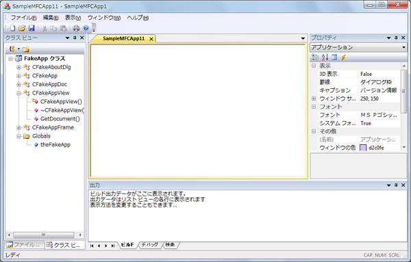

<strong>図 6.1 MFC アプリケーション ウィザードで生成したソース コードの実行結果</strong>

これだけ豊富な機能があると、MFC を使い始めた方は、どこから習得したらよいか迷うかもしれません。しかし、まず習得すべき点は、やはり「ドキュメント/ビュー アーキテクチャ (ドキュメント/ビュー モデルとも呼ばれる)」でしょう。

ドキュメント/ビュー アーキテクチャは、アプリケーション内部のデータに当たる「ドキュメント」と、そのデータを表示する「ビュー」とを分離して実装するアーキテクチャです。データの&#26684;納や保守の処理を、データ表示の処理から分離することで、アプリケーションの柔軟性や保守性が向上します。

また、ここでいう「ドキュメント」とは、一般に言う「文書 (ドキュメント)」を実装するためのものというわけではなく、プログラムで扱うデータ全般に利用できます。たとえば、クライアント アプリケーションとして、データベースから取り込んだデータを一時的にキャッシュする場所として利用したり、アプリケーションの現在の状態 (ステート) を保持する場所として利用したりできます。

このような幅広い適用範囲も鑑みると、やはり MFC を有効活用する上で、まずはドキュメント/ビュー アーキテクチャを習得することが重要であると言えるでしょう。

このドキュメント/ビュー アーキテクチャを用いたアプリーションも、ウィザードによって自動生成され、あまり意識せずに利用できます。前回の ATL と同様に、使い始めた方にとっては、このドキュメント/ビュー アーキテクチャの使用方法を把握するのに戸惑うかもしれません。そこで今回も、ドキュメント/ビューに基づく MFC アプリケーションを手作業で作り込むことで、これをどう使用するのか確認していきます。

なお、今回の記事でも Visual C&#43;&#43; 2010 の IDE の基本操作については、前提知識として必要になるほか、メッセージ ループやウィンドウ プロシージャなど、Windows プログラミングの基礎知識も必要となります。

<strong>Note: 
</strong>今回も、サンプル コードを机上で確認できるように、サンプル固有の実装部分を一通り掲載していますが、このサンプル コードを入力して動作を確認するのであれば、次の要領でプロジェクトを作成してください (Windows アプリケーションに対応した空のプロジェクトを作成しておきます)。

なお、Visual C&#43;&#43; 2010 Express エディションでは MFC のヘッダーやライブラリが含まれていないため、サンプル コードの確認には、Express エディションよりも上位のエディションが必要です。(この記事を作成する際の検&#35388;には、Professional Edition を使用しました。)

<ol>
<li>「Win32 プロジェクト」プロジェクト テンプレートを使用し、以下の名前とバスを指定して、プロジェクトを作成します。(今回は手作業で MFC 関連のコードを入力するので、「MFC アプリケーション」プロジェクトを使用しません。また、既定の x86 版を使用することにします。)

&nbsp;&nbsp;&nbsp; &nbsp;&nbsp;&nbsp; 名前: SmallApp 
&nbsp;&nbsp;&nbsp; &nbsp;&nbsp;&nbsp; 場所: C:\SamplesVCpp\Article06\(任意) 
&nbsp;&nbsp;&nbsp; &nbsp;&nbsp;&nbsp; ソリューション名: SmallAppSol

</li><li>プロジェクトの新規作成時に起動する「Win32 アプリケーション ウィザード」では、「アプリケーションの設定」ページにある「アプリケーションの種類」のオプションで、「Windows アプリケーション」オプションを選択します。さらに、同じページの「追加オプション」にある「空のプロジェクト」チェック ボックスを必ずチェックして、プロジェクトを空の状態にします。
</li><li>ほかは既定値のままにして、プロジェクトを新規作成します。 </li></ol>

<a href="#top">ページのトップへ</a>

<h2 id="02" style="font-size:120%; margin-top:20px">2. 今回作成するアプリケーション ～基本的な MDI アプリケーション～</h2>

前図 6.1 の MFC アプリケーションでは多くの機能を盛り込んでいるので、ここではドキュメント/ビュー アーキテクチャに焦点を当て、できるだけ直接関係しない機能を削ることにします。今回は、図 6.2 のように、親ウィンドウの中に複数の子ウィンドウを含むことがでる「マルチ ドキュメント インターフェイス (MDI: Multiple Document Interface)」アプリケーションを作成します (以降は、「MDI アプリケーション」と表記)。

MFC のドキュメント/ビュー アーキテクチャの典型的な実装形態としては、このような MDI のほかに、シングル ドキュメント インターフェイス (SDI: Single Document Interface) もあります。SDI は単一のウィンドウを持つアプリケーションです。MDI に比べると SDI では、いくつか構成要素が削られていますが、基本的な構造や使い方は MDI に類&#20284;しているので、MDI を理解しておけば、後から SDI について調べても、問題なく理解できるでしょう。

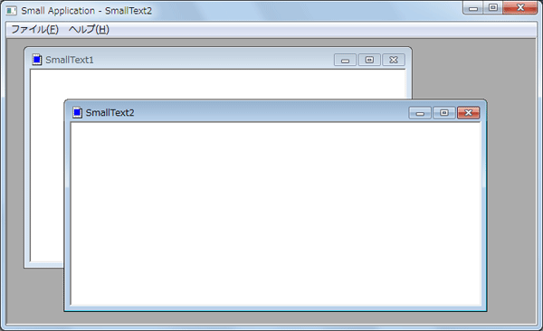

<strong>図 6.2 MFC を用いた MDI アプリケーション</strong>

実際のところ、これと同様のアプリケーションは、MFC アプリケーション ウィザードを用いて、対話操作で自動生成することができます。しかし、今回はドキュメント/ビュー アーキテクチャの基本的な利用方法を理解することが目的であるので、Windows アプリケーション向けの空のプロジェクト (前述の Note 参照) を出発点にして、手作業でコードを入力し、MDI アプリケーションを作り込んでいきます。

<strong>Note: 
</strong>MFC アプリケーション ウィザードを用いて、図 6.2 と同様のサンプルを自動作成することもできます (アイコンやメニュー バー構成などは若干異なります)。参考までに、ウィザードで作成する場合の手順を巻末に掲載しています。余力のある方は試に行ってみてください。

<a href="#top">ページのトップへ</a>

<h2 id="03" style="font-size:120%; margin-top:20px">3. MFC ライブラリの利用準備</h2>

ここで、MFC ライブラリを利用できるようにするため、ビルド時に MFC ライブラリとリンクするように設定し、MFC 関連のヘッダーファイルもインクルードしておきましょう。

まず、リンク時に MFC ライブラリを利用できるようにするため、プロジェクト プロパティ ページを開きます (ソリューション エクスプローラー上で SmallApp プロジェクトを右クリックして、[プロパティ] を選択)。

左ペインのツリー上で [構成プロパティ]、[全般] の順に展開し、右ペインの「MFC の使用」プロパティには「共有 DLL で MFC を使う」に変更し (図 6.3)、[OK] をクリックします

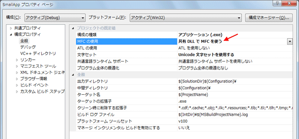

<strong>図 6.3 MFC ライブラリを使用できるように指定</strong>

次に MFC 関連のヘッダーをインクルードします。今回は、MFC アプリケーション ウィザードが生成するコードに準じて、以下のようにプロジェクト内で共通して使用するヘッダー ファイル (stdafx.h) を作成し、SmallApp プロジェクトに追加してください。

<strong>例 6.1 MFC 関連のヘッダーをインクルードする汎用的なヘッダー</strong> 
<strong>ファイル名: stdafx.h (新規作成)</strong>

C&#43;&#43;

スクリプトの編集|{#scriptcode_dlg.remove_script}

cplusplus
<pre class="hidden">#pragma once

#define _WIN32_WINNT  0x0601  //&larr;[1]

#include &lt;afxwin.h&gt;  //&larr;[2]
#include &lt;afxext.h&gt;  //&larr;[3]</pre>

<pre id="codePreview" class="cplusplus">#pragma&nbsp;once&nbsp;
&nbsp;
#define&nbsp;_WIN32_WINNT&nbsp;&nbsp;0x0601&nbsp;&nbsp;//&larr;[1]&nbsp;
&nbsp;
#include&nbsp;&lt;afxwin.h&gt;&nbsp;&nbsp;//&larr;[2]&nbsp;
#include&nbsp;&lt;afxext.h&gt;&nbsp;&nbsp;//&larr;[3]</pre>

MFC ライブラリのために用いる標準的なヘッダーは、[2] と [3] に挙げた 2 つです。

なお、[1] のターゲット バージョンを表すシンボル「_WIN32_WINNT」は必須ではありませんが、このシンボルのバージョンの値を定義しないと、コンパイラーが既定値の最新バージョン (Windows 7) を選択する旨の警告を表示します。ここでは警告を避けるため追記しました。このバージョン指定の値に応じて、[2] と [3] のヘッダーで利用できる定義が変化します。

この例の [1] では、「0x0601」(Windows 7) をターゲットとしましたが、「0x0500」(Windows 2000) 以上であればコンパイルできます。サンプルを検&#35388;する環境に合わせて変更してください。

このあと、プロジェクト内の各ソース ファイルでは、この stdafx.h をインクルードする記述を追加します。

このあとは MFC ライブラリのクラスを使用します。まずは、ドキュメント/ビュー アーキテクチャ使用の有無に関わらず、一般に MFC アプリケーションとして最低限必要な実装を作成しましょう。

<a href="#top">ページのトップへ</a>

<h2 id="04" style="font-size:120%; margin-top:20px">4. アプリケーション クラスの定義と使用</h2>

MFC アプリケーションには、いわばアプリケーションの中核ともいえる「アプリケーションクラス」のオブジェクトが 1 つ必要になります。アプリケーション クラスとは、MFC ライブラリが提供する CWinApp クラス (実際には、この派生クラスを使用) のことです。では早速、このクラスの役割を確認し、基本的な実装を行いましょう。

通常、Windows アプリケーションには WinMain 関数があります。この WinMain 関数の内部では、アプリケーションの初期化から始まり、メイン ウィンドウとの対話操作を行うためのメッセージ ループ、そして、アプリケーションの終了処理に至るまで、アプリケーションのライフタイム全体の流れが記述されています。

MFC では、WinMain 関数に相当する実装はライブラリ側に記述されているので、プログラマーが WinMain 関数を記述することはありません。MFC ライブラリが持つ WinMain 関数では、初期化から後処理までの一連の流れを実現するため、次図のように、「アプリケーション クラス」の 3 つのメンバー関数 (InitInstance、Run、および ExitInstance) を順に呼び出すように実装されています。

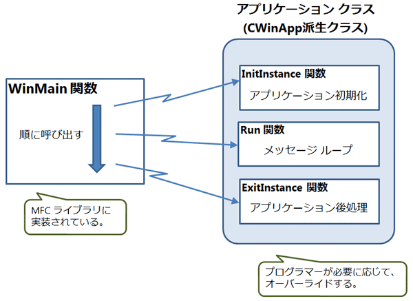

<strong>図 6.4 CWinApp 派生クラスによるアプリケーションのライフタイム</strong>

プログラマーは、図中の右にある CWinApp 派生クラスを定義する必要があります。3 つの関数は仮想関数であり、必要に応じて、これらのメンバー関数をオーバーライドします。このうち、特別な理由がない限り、Run 関数についてはオーバーライドせずに、基本クラスに実装された既存のメッセージ ループを利用すればよいでしょう。ExitInstance 関数の後処理も固有の処理を行う必要がなければ、オーバーライドする必要はありません。通常は、アプリケーション固有の振る舞いの準備のため、InitInstance 関数はオーバーライドします。

ここでは、MDI アプリケーションを構成するために、InitInstance メソッドのみオーバーライドしましょう。次の CWinApp 派生クラスを SmallApp プロジェクトに追加してください。

<strong>例 6.2 CWinApp 派生クラス (アプリケーションクラス) </strong> 
<strong>ファイル名: SmallApp.h (新規作成)</strong>

C&#43;&#43;

スクリプトの編集|{#scriptcode_dlg.remove_script}

cplusplus
<pre class="hidden">#pragma once

class CSmallApp : public CWinApp   //&larr;[1]
{
public:
    virtual BOOL InitInstance();   //&larr;[2]

};</pre>

<pre id="codePreview" class="cplusplus">#pragma&nbsp;once&nbsp;
&nbsp;
class&nbsp;CSmallApp&nbsp;:&nbsp;public&nbsp;CWinApp&nbsp;&nbsp;&nbsp;//&larr;[1]&nbsp;
{&nbsp;
public:&nbsp;
&nbsp;&nbsp;&nbsp;&nbsp;virtual&nbsp;BOOL&nbsp;InitInstance();&nbsp;&nbsp;&nbsp;//&larr;[2]&nbsp;
&nbsp;
};</pre>

<strong>ファイル名: SmallApp.cpp (新規作成)</strong>

C&#43;&#43;

スクリプトの編集|{#scriptcode_dlg.remove_script}

cplusplus
<pre class="hidden">#include &quot;stdafx.h&quot;
#include &quot;SmallApp.h&quot;

CSmallApp theApp;    //&larr;[3]

BOOL CSmallApp::InitInstance()   //&larr;[4]
{
    CWinApp::InitInstance();     //&larr;[5]

    //ここでメインのフレームウィンドウを作成する

    return TRUE;  //&larr;[6]
}</pre>

<pre id="codePreview" class="cplusplus">#include&nbsp;&quot;stdafx.h&quot;&nbsp;
#include&nbsp;&quot;SmallApp.h&quot;&nbsp;
&nbsp;
CSmallApp&nbsp;theApp;&nbsp;&nbsp;&nbsp;&nbsp;//&larr;[3]&nbsp;
&nbsp;
BOOL&nbsp;CSmallApp::InitInstance()&nbsp;&nbsp;&nbsp;//&larr;[4]&nbsp;
{&nbsp;
&nbsp;&nbsp;&nbsp;&nbsp;CWinApp::InitInstance();&nbsp;&nbsp;&nbsp;&nbsp;&nbsp;//&larr;[5]&nbsp;
&nbsp;
&nbsp;&nbsp;&nbsp;&nbsp;//ここでメインのフレームウィンドウを作成する&nbsp;
&nbsp;
&nbsp;&nbsp;&nbsp;&nbsp;return&nbsp;TRUE;&nbsp;&nbsp;//&larr;[6]&nbsp;
}</pre>

ヘッダー SmallApp.h では、[1] のように CWinApp 派生クラス (ここでは CSmallApp クラス) を定義し、[2] で基本クラスの InitInstance 関数をオーバーライドすべく宣言しています。

<strong>Note: 
</strong>Visual C&#43;&#43; 2010の MFC アプリケーション ウィザードが生成するアプリケーション クラスは、CWinApp クラスを継承し拡張した CWinAppEx クラスから派生しています。ここでは基本機能しか使わないので、CWinApp クラスから派生させれば十分です。

実際にオーバーライドした実装は [4] にあります。この InitInstance 関数で行うべき主な初期化は、メイン ウィンドウを作成することです。この点は次項で扱います (よって、現時点の InitInstance 関数は不完全です)。

なお作法として、CWinApp 基本クラスの InitInstance 関数に実装された既定の初期処理を禁止する特別な事情がない限り、原則としては [5] のように、基本クラスの同名関数を呼び出しておくのがよいでしょう。(MFC のソース コードは提供されているので、基本クラスの実装を確認することもできます。)

また、[6] で TRUE を返すことで、MFC ライブラリ内の WinMain 関数では、引き続きメッセージ ループ (Run 関数呼び出し) へと処理が続きます。仮に InitInstance 関数から FALSE を返すと、メッセージ ループに進まず、アプリケーションが終了します。そのため、InitInstance 関数内でダイアログ ボックスを表示してアプリケーションを終了したいような場合、つまり、メッセージ ループを必要とするメインウィンドウを利用しない場合は、意図的に FALSE を返すコードを記述することもあります。

このほか、WinMain 関数から呼び出してもらうために、[3] のように、この CSmallApp クラスのグローバル オブジェクト インスタンスも確保するよう定義する必要もあります (変数名は任意)。

<a href="#top">ページのトップへ</a>

&nbsp;

<h2 id="05" style="font-size:120%; margin-top:20px">5. フレーム ウィンドウ クラスの定義と使用</h2>

今回のサンプルは Windows アプリケーションであるので、次に、フレームを持ったメイン ウィンドウ (以降はフレーム ウィンドウと表記) を用意しましょう。フレーム ウィンドウは、CFrameWnd クラスに実装されています。ここでは、MDI アプリケーションの親ウィンドウとしてフレーム ウィンドウを用意する必要があるので、CFrameWnd から派生した CMDIFrameWnd クラスを使用します。

<strong>Note: 
</strong>SDI の場合は、CFrameWnd クラスを使用します。

CMDIFrameWnd は継承せずにそのまま利用できますが、ここでは MFC アプリケーション ウィザードが生成するコードに合わせて、この CMDIFrameWnd クラスの派生クラスを定義しておきましょう。そのほうが、後から機能追加する際にも便利です。次に示す CMDIFrameWnd 派生クラスをプロジェクトに追加してください。

<strong>例 6.3 CMDIFrameWnd 派生クラス (アプリケーション クラス)</strong> 
<strong>ファイル名: MainFrm.h (新規作成)</strong>

C&#43;&#43;

スクリプトの編集|{#scriptcode_dlg.remove_script}

cplusplus
<pre class="hidden">class CMainFrame : public CMDIFrameWnd
{

};</pre>

<pre id="codePreview" class="cplusplus">class&nbsp;CMainFrame&nbsp;:&nbsp;public&nbsp;CMDIFrameWnd&nbsp;
{&nbsp;
&nbsp;
};</pre>

ファイル名: MainFrm.cpp (新規作成)

C&#43;&#43;

スクリプトの編集|{#scriptcode_dlg.remove_script}

cplusplus
<pre class="hidden">#include &quot;stdafx.h&quot;
#include &quot;MainFrm.h&quot;</pre>

<pre id="codePreview" class="cplusplus">#include&nbsp;&quot;stdafx.h&quot;&nbsp;
#include&nbsp;&quot;MainFrm.h&quot;</pre>

単に継承するだけなので、特にメンバーの追加やオーバーライドはありません。

また、このクラスを用いてウィンドウを作る必要がありますが、そのためには、このクラスの Create メンバー関数か、または、LoadFrame メンバー関数を呼び出します。ここでも、MFC アプリケーション ウィザードが生成するコードに合わせて、後者の LoadFrame 関数を使用することにします。この関数を使用するには、ウィンドウに必要なリソースを予め用意する必要があります。以下のリソース スクリプトをプロジェクトに追加してください。

<strong>Note: 
</strong>余分なリソース スクリプトを排除し簡単にするため、以下のスクリプト (.rc) をメモ帳などで作成して保存し、あとからプロジェクトに追加するとよいでしょう。もしくは、リソース ビューの動作や使用方法が分かる方は、以下のヘッダーやスクリプトと同じになるように、リソース ビューを操作して作成しても構いません。

<strong>例 6.4 フレーム ウィンドウが使用するリソース</strong> 
<strong>ファイル名: resource.h (新規作成)</strong>

C&#43;&#43;

スクリプトの編集|{#scriptcode_dlg.remove_script}

cplusplus
<pre class="hidden">#define IDR_MAINFRAME 128    //タイトル文字列、アイコン、メニューバー共通のID
#define ID_VIEW_ITEM1 500    //メニュー項目の任意コマンドID</pre>

<pre id="codePreview" class="cplusplus">#define&nbsp;IDR_MAINFRAME&nbsp;128&nbsp;&nbsp;&nbsp;&nbsp;//タイトル文字列、アイコン、メニューバー共通のID&nbsp;
#define&nbsp;ID_VIEW_ITEM1&nbsp;500&nbsp;&nbsp;&nbsp;&nbsp;//メニュー項目の任意コマンドID</pre>

<strong>ファイル名: SmallApp.rc (新規作成)</strong>

C&#43;&#43;

スクリプトの編集|{#scriptcode_dlg.remove_script}

cplusplus
<pre class="hidden">#include &quot;resource.h&quot;
#include &lt;afxres.h&gt;  //afxwin.hからもインクルードしている  &larr;[1]

IDR_MAINFRAME ICON &quot;SmallApp.ico&quot;      //&larr;[2]

STRINGTABLE
BEGIN
    IDR_MAINFRAME &quot;Small Application&quot;  //&larr;[3]
END

IDR_MAINFRAME MENU  // &larr;[4]
BEGIN
    POPUP &quot;ファイル(&amp;F)&quot;
    BEGIN
        MENUITEM &quot;アプリケーションの終了(&amp;X)&quot;,  ID_APP_EXIT  //&larr;[5]
    END
    POPUP &quot;表示(&amp;W)&quot;
    BEGIN
        MENUITEM &quot;項目&amp;1&quot;, ID_VIEW_ITEM1
    END
    POPUP &quot;ヘルプ(&amp;H)&quot;
    BEGIN
        MENUITEM &quot;バージョン情報(&amp;A)...&quot;, ID_APP_ABOUT  //&larr;[6]
    END
END</pre>

<pre id="codePreview" class="cplusplus">#include&nbsp;&quot;resource.h&quot;&nbsp;
#include&nbsp;&lt;afxres.h&gt;&nbsp;&nbsp;//afxwin.hからもインクルードしている&nbsp;&nbsp;&larr;[1]&nbsp;
&nbsp;
IDR_MAINFRAME&nbsp;ICON&nbsp;&quot;SmallApp.ico&quot;&nbsp;&nbsp;&nbsp;&nbsp;&nbsp;&nbsp;//&larr;[2]&nbsp;
&nbsp;
STRINGTABLE&nbsp;
BEGIN&nbsp;
&nbsp;&nbsp;&nbsp;&nbsp;IDR_MAINFRAME&nbsp;&quot;Small&nbsp;Application&quot;&nbsp;&nbsp;//&larr;[3]&nbsp;
END&nbsp;
&nbsp;
IDR_MAINFRAME&nbsp;MENU&nbsp;&nbsp;//&nbsp;&larr;[4]&nbsp;
BEGIN&nbsp;
&nbsp;&nbsp;&nbsp;&nbsp;POPUP&nbsp;&quot;ファイル(&amp;F)&quot;&nbsp;
&nbsp;&nbsp;&nbsp;&nbsp;BEGIN&nbsp;
&nbsp;&nbsp;&nbsp;&nbsp;&nbsp;&nbsp;&nbsp;&nbsp;MENUITEM&nbsp;&quot;アプリケーションの終了(&amp;X)&quot;,&nbsp;&nbsp;ID_APP_EXIT&nbsp;&nbsp;//&larr;[5]&nbsp;
&nbsp;&nbsp;&nbsp;&nbsp;END&nbsp;
&nbsp;&nbsp;&nbsp;&nbsp;POPUP&nbsp;&quot;表示(&amp;W)&quot;&nbsp;
&nbsp;&nbsp;&nbsp;&nbsp;BEGIN&nbsp;
&nbsp;&nbsp;&nbsp;&nbsp;&nbsp;&nbsp;&nbsp;&nbsp;MENUITEM&nbsp;&quot;項目&amp;1&quot;,&nbsp;ID_VIEW_ITEM1&nbsp;
&nbsp;&nbsp;&nbsp;&nbsp;END&nbsp;
&nbsp;&nbsp;&nbsp;&nbsp;POPUP&nbsp;&quot;ヘルプ(&amp;H)&quot;&nbsp;
&nbsp;&nbsp;&nbsp;&nbsp;BEGIN&nbsp;
&nbsp;&nbsp;&nbsp;&nbsp;&nbsp;&nbsp;&nbsp;&nbsp;MENUITEM&nbsp;&quot;バージョン情報(&amp;A)...&quot;,&nbsp;ID_APP_ABOUT&nbsp;&nbsp;//&larr;[6]&nbsp;
&nbsp;&nbsp;&nbsp;&nbsp;END&nbsp;
END</pre>

ここでは、フレーム ウィンドウで使用するタイトル バーのアイコン、タイトル バーの文字列、および、メニュー バーが、順に、[2]、[3]、[4] に定義されています。[2] のアイコン「SmallApp.ico」は適当に作成してプロジェクトに追加しておいてください。アイコンは必須ではないので、[2] の行は削除てても構いません (アイコンを指定しないと既定のアイコンが利用されます)。

注意すべき点は、[2]、[3]、および [4] のリソース ID は、同じ値にする必要がある点です (ここでは IDR_MAINFRMAE であり、resource.h に定義してあります)。

[4] のメニュー バーでは、トップ レベルのメニュー項目が 3 つあり ([ファイル]、[表示]、および[ヘルプ])、それぞれ POPUP ステートメントを使ってドロップダウン メニューとして定義されています。それぞれのドロップダウン メニューには、コマンドを実行する具体的なメニュー項目として、MENUITEM ステートメントが記述されています。POPUP や MENUITEM の直後に記述された文字列は、メニュー項目に表示される文字列であり、文字列の中のアンパサンドが付いた部分は、そのメニュー項目のアクセス
 キーとして機能します。たとえば、「&amp;X」ならば、[Alt] キーを押しながら [X] を押すと、そのメニュー コマンドが実行されます。

このほか、[5] と [6] のメニュー項目には、MFC の定義済みコマンド ID として、ID_APP_EXIT と ID_APP_ABOUT を使用しました。このコマンド ID は [1] でインクルードしたヘッダー afxres.h に定義されています。このコマンド ID のいくつかは、既定のコマンド動作が割り振ってあるので便利です (後述)。このあと、このプロジェクトの他のソース コードでも、この定義済みコマンド ID が必要になりますが、既に stdafx.h の中でインクルードした afxwin.h
 から、間接的に afxres.h をインクルードしています。

もう 1 点注意する点として、メニュー バーのトップ レベルの項目は 2 つ以上にしてください。この例の [4] では、[ファイル]、[表示]、および [ヘルプ] の 3 項目になっています。Windows インターフェイスのガイドラインでは、メニュー バーのトップ レベルの右端は [ヘルプ] メニューにする必要があり、その結果、トップ レベルの項目は最低 2 個あるはずです。このあと使用する LoadFrame メンバー関数の内部では、トップ レベルのメニュー項目が 2 つ以上あるか検&#35388;するアサーションが記述されており、2
 つ以上ないとアサーションに失敗し、実行が中断してしまいます。ただ通常であれば、2 つ以上になるので問題はないでしょう。

最後に、アプリケーション クラスの InitInstance 関数の中に、フレーム ウィンドウを構築するコードを追加します。次のように修正してください (番号は今までのアプリケーション クラスにおける通番にしました)。

<strong>例 6.5 InitInstance メンバー関数でのフレーム ウィンドウの作成</strong> 
<strong>ファイル名: SmallApp.h (既存修正)</strong>

C&#43;&#43;

スクリプトの編集|{#scriptcode_dlg.remove_script}

cplusplus
<pre class="hidden">#pragma once

#include &quot;resource.h&quot;   //&larr;[7]

class CSmallApp : public CWinApp
{
public:
    virtual BOOL InitInstance();

};</pre>

<pre id="codePreview" class="cplusplus">#pragma&nbsp;once&nbsp;
&nbsp;
#include&nbsp;&quot;resource.h&quot;&nbsp;&nbsp;&nbsp;//&larr;[7]&nbsp;
&nbsp;
class&nbsp;CSmallApp&nbsp;:&nbsp;public&nbsp;CWinApp&nbsp;
{&nbsp;
public:&nbsp;
&nbsp;&nbsp;&nbsp;&nbsp;virtual&nbsp;BOOL&nbsp;InitInstance();&nbsp;
&nbsp;
};</pre>

<strong>ファイル名: SmallApp.cpp (既存修正)</strong>

C&#43;&#43;

スクリプトの編集|{#scriptcode_dlg.remove_script}

cplusplus
<pre class="hidden">#include &quot;stdafx.h&quot;
#include &quot;SmallApp.h&quot;
#include &quot;MainFrm.h&quot;     //&larr;[8]

CSmallApp theApp;

BOOL CSmallApp::InitInstance()
{
    CWinApp::InitInstance();

    //ここでメインのフレームウィンドウを作成する
    CMainFrame* pMainFrame = new CMainFrame();  //&larr;[9]
    pMainFrame-&gt;LoadFrame( IDR_MAINFRAME );     //&larr;[10]
    pMainFrame-&gt;ShowWindow( m_nCmdShow );
    pMainFrame-&gt;UpdateWindow(); 
    m_pMainWnd = pMainFrame;  //&larr;[11]

    return TRUE;
}</pre>

<pre id="codePreview" class="cplusplus">#include&nbsp;&quot;stdafx.h&quot;&nbsp;
#include&nbsp;&quot;SmallApp.h&quot;&nbsp;
#include&nbsp;&quot;MainFrm.h&quot;&nbsp;&nbsp;&nbsp;&nbsp;&nbsp;//&larr;[8]&nbsp;
&nbsp;
CSmallApp&nbsp;theApp;&nbsp;
&nbsp;
BOOL&nbsp;CSmallApp::InitInstance()&nbsp;
{&nbsp;
&nbsp;&nbsp;&nbsp;&nbsp;CWinApp::InitInstance();&nbsp;
&nbsp;
&nbsp;&nbsp;&nbsp;&nbsp;//ここでメインのフレームウィンドウを作成する&nbsp;
&nbsp;&nbsp;&nbsp;&nbsp;CMainFrame*&nbsp;pMainFrame&nbsp;=&nbsp;new&nbsp;CMainFrame();&nbsp;&nbsp;//&larr;[9]&nbsp;
&nbsp;&nbsp;&nbsp;&nbsp;pMainFrame-&gt;LoadFrame(&nbsp;IDR_MAINFRAME&nbsp;);&nbsp;&nbsp;&nbsp;&nbsp;&nbsp;//&larr;[10]&nbsp;
&nbsp;&nbsp;&nbsp;&nbsp;pMainFrame-&gt;ShowWindow(&nbsp;m_nCmdShow&nbsp;);&nbsp;
&nbsp;&nbsp;&nbsp;&nbsp;pMainFrame-&gt;UpdateWindow();&nbsp;&nbsp;
&nbsp;&nbsp;&nbsp;&nbsp;m_pMainWnd&nbsp;=&nbsp;pMainFrame;&nbsp;&nbsp;//&larr;[11]&nbsp;
&nbsp;
&nbsp;&nbsp;&nbsp;&nbsp;return&nbsp;TRUE;&nbsp;
}</pre>

リソースを使用するため、[7] のように、リソース ID のシンボルを定義した resource.h をインクルードします。必ずしも、この位置にインクルードする必要はないのですが、MFC アプリケーション ウィザードが生成するコードに合わせてみました。

[8] では、フレーム ウィンドウのヘッダーをインクルードしたのち、フレーム ウィンドウの作成で必要な処理は [9] から [11] です。

[9] でインスタンスを作成したのち、[10] から続く 3 行のように、3 つのメンバー関数を順に呼び出し、ウィンドウを表示させます。まず、LoadFrame 関数を呼び出すことで、ウィンドウが内部的に作成されます。まだウィンドウは非表示の状態なので、ShowWindow 関数の呼び出しによって表示されます。そして、UpdateWindow 関数を呼び出すと、メッセージ ループを介さずに、ウィンドウに対して直接 WM_PAINT イベントが送られ、その結果、メッセージ ループが開始するよりも前に、速やかにウィンドウに対してクライアント領域の描画を指示することができます。

LoadFrame 関数の引数には例 6.4 で記述したリソース スクリプトのリソース ID が指定されている点に注意してください。この引数の指定によって、フレーム ウィンドウには、該当するリソース ID を持つアイコン、タイトル バー、およびメニュー バーが反映されます。このほか、同じリソース ID のアクセラレーター (ショートカット キー) があれば反映されます。

最後に、[11] を忘れないでください。メインのフレーム ウィンドウを作成したら、必ずメンバー変数 m_pMainWnd に対して、フレーム ウィンドウのポインターを設定してください。この設定を行わずに、InitInstance 関数の戻り値として TRUE を返しても、メッセージ ループに進むことができず、アプリケーションが強制終了します。

結局のところ、InitInstance 関数での典型的な実装は、メインのフレーム ウィンドウを作成し、メンバー変数 m_pMainWnd に対して、そのポインターを設定することです。

<a href="#top">ページのトップへ</a>

<h2 id="06" style="font-size:120%; margin-top:20px">6. 最低限の実装で実行 ～アプリケーション クラスとフレーム ウィンドウ～</h2>

これで、MFC アプリケーションとして典型的な最低限の実装ができました。この時点で、プロジェクトのソース コードは、以下の状態になっていることを確認してください。

<ul>
<li>汎用的なヘッダー --- 例 6.1 stdafx.h </li><li>アプリケーション クラス ---- 例 6.5 SmallApp.h、および SmallApp.cpp </li><li>フレーム ウィンドウ ---- 例 6.3 MainFrm.h および MainFrm.cpp </li><li>フレーム ウィンドウのリソース ---- 例 6.4 resource.h および SmallApp.rc </li><li>アイコン ファイル ---- SmallApp.ico (オプション) </li></ul>

<strong>Note: 
</strong>今回は、フレーム ウィンドウとして CMDIFrameWnd 派生クラスを使用しましたが、例 6.3 において、代わりに CFrameWnd から派生させれば、より汎用的な実装になります。

これを実行すると、次のように MDI の親ウィンドウにあたるフレーム ウィンドウが表示されます。

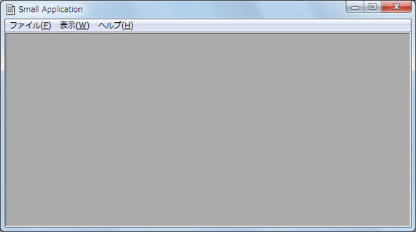

<strong>図 6.5 フレーム ウィンドウが表示される基本的な実装</strong>

アイコンやタイトル、メニュー バーも、例 6.4 のリソースが反映されます。

さらに興味深いことに、次に示すように [ファイル] メニューの [アプリケーションの終了] は有効化 (黒色) されていますが、 [表示] メニューの [項目 1] は無効化 (グレー) されています。

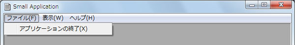

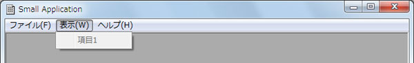

<strong>図 6.6 メニュー項目の動的な有効化と無効化</strong>

この例では、[アプリケーションの終了] メニューのコマンド ID として、MFC の予約済みである ID_APP_EXIT を使用していました。このコマンド ID には、アプリケーションを終了するための標準実装 CWinApp::OnAppExit メンバー関数が、コマンド ハンドラーとして既にマップされているのです。MFC ライブラリの実行環境は、アプリケーションの実行時に、メニュー項目のコマンド ID にマップされたコマンド ハンドラーの有無を確認し、コマンド ハンドラーが存在する場合には、そのメニュー項目を動的に有効化し、存在しない場合には、動的に無効化するようになっています。そのため、図
 6.6 のような違いが現れました。

なお、この例では [ヘルプ] メニューの [バージョン情報] のコマンド ID は、定義済みの ID_APP_ABOUT を使用しましたが、標準実装のコマンド ハンドラーは定義されていないので、無効化の状態になります。

確認が済んだら、[ファイル] メニューの [アプリケーションの終了] をクリックし、このアプリケーションを終了しておいてください。

<strong>Note: 
</strong>MFC の定義済みコマンド ID については、以下を参照してください。

<ul>
<li><a href="http://msdn.microsoft.com/ja-jp/library/11861byt.aspx" target="_blank">テクニカル ノート 22: 標準コマンドの実装</a>
</li></ul>

<a href="#top">ページのトップへ</a>

<h2 id="07" style="font-size:120%; margin-top:20px">7. ドキュメント、ビュー、子フレーム ウィンドウの役割</h2>

MDI の親ウィンドウの実装が済んだので、今度は MDI の子ウィンドウを実装します。ここで、いよいよドキュメント/ビュー アーキテクチャを使用します。

子ウィンドウを実装するには、データを管理するドキュメント クラスと、そのデータを子ウィンドウのクライアント領域に表示するビュー クラスを実装する必要があります。これらのクラスの相関関係をより正確に表すと、次図のようになります。

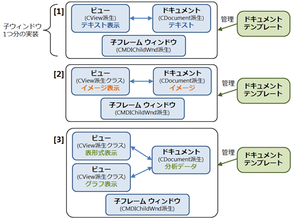

<strong>図 6.7 ドキュメント、ビュー、子フレームの関係</strong>

この図の [1]、[2]、および [3] のそれぞれの大きな枠が、1 つ分の子ウィンドウの実装です。それぞれの枠内は、ドキュメント、ビュー、子フレーム ウィンドウの 3 種類のクラスが 1 組の実装として構成されています。各クラスは、それぞれの枠内に記載たれたクラスから継承します。実行時には、子ウィンドウが 1 個表示されるごとに、これら 1 組の 3 種類のクラスのオブジェクトインスタンスが生成されます。

この図の [1]、[2]、および [3] では、各組の実装が異なっています。その違いは、それぞれのドキュメント クラスが管理するデータの違いです。それぞれ順に、テキスト、イメージ、分析データを管理しています。基本的な考え方としては、管理するデータが異なれば、この 3 種類のクラスの別の組み合わせを用意することになります。

また、[3] の分析データを管理するケースでは、ドキュメント 1 つに対して、異なる表示を行うビュー クラスが 2 つあります。このように 1 つの大きな枠内 (子ウィンドウ 1 つ分の実装) では、ドキュメント クラスについては最大 1 つですが、異なる表示を行うビュー クラス (ここでは表形式とグラフ) を複数持つこともできます。

さらに、この図の右にあるように、3 種類のクラスの 1 つの組み合わせ (子ウィンドウ 1 つ分の実装) は、1 つのドキュメント テンプレート オブジェクト (CDocTemplate 派生クラス) によって管理されています (後述)。

今回は、基本的な [1] のパターンの 3 種類のクラス (ドキュメント、ビュー、および子フレーム クラス) を実装します。

<strong>Note: 
</strong>SDI でドキュメント/ビュー アーキテクチャを使用する場合も、基本的には図 6.7 と同じ構造です。ただし、SDI ではウィンドウはメイン ウィンドウ 1 つなので、3 種類のクラスの組み合わせのうち、子フレーム ウィンドウの部分が、メインのフレーム ウィンドウになります。

<a href="#top">ページのトップへ</a>

<h2 id="08" style="font-size:120%; margin-top:20px">8. ドキュメント、ビュー、子フレーム ウィンドウの実装</h2>

ドキュメント、ビュー、および子フレーム ウィンドウの各クラスを実装するには、前図 6.7 に記載したように、それぞれ、CDocument クラス、CView クラス、および CMDIChildFrame クラスから継承して、独自の実装を行います。ただし、子フレーム ウィンドウについては、一般的なフレームのままでも構わないので、継承せずに既存の CMIDChildFrame をそのまま使用しても構いません。

ただし、ここでも MFC アプリケーション ウィザードが生成するコードに合わせて、3 種類のクラスとも継承することにします。今回は簡単にするため、単純に継承するだけです。このあとの説明も参考にして、以下の 3 種類のクラスをプロジェクトに追加してください。

<strong>例 6.6 ドキュメント、ビュー、子フレーム ウィンドウの実装</strong> 
<strong>ファイル名: SmallDoc.h (新規作成)</strong>

C&#43;&#43;

スクリプトの編集|{#scriptcode_dlg.remove_script}

cplusplus
<pre class="hidden">#pragma once
class CSmallDoc : public CDocument   //&larr;[1]
{
protected:
    CSmallDoc();  //&larr;[2]
    DECLARE_DYNCREATE(CSmallDoc)  //&larr;[3]
};</pre>

<pre id="codePreview" class="cplusplus">#pragma&nbsp;once&nbsp;
class&nbsp;CSmallDoc&nbsp;:&nbsp;public&nbsp;CDocument&nbsp;&nbsp;&nbsp;//&larr;[1]&nbsp;
{&nbsp;
protected:&nbsp;
&nbsp;&nbsp;&nbsp;&nbsp;CSmallDoc();&nbsp;&nbsp;//&larr;[2]&nbsp;
&nbsp;&nbsp;&nbsp;&nbsp;DECLARE_DYNCREATE(CSmallDoc)&nbsp;&nbsp;//&larr;[3]&nbsp;
};</pre>

<strong>ファイル名: SmallDoc.cpp (新規作成)</strong>

C&#43;&#43;

スクリプトの編集|{#scriptcode_dlg.remove_script}

cplusplus
<pre class="hidden">#include &quot;stdafx.h&quot;
#include &quot;SmallDoc.h&quot;

IMPLEMENT_DYNCREATE( CSmallDoc, CDocument )  //&larr;[4]

CSmallDoc::CSmallDoc()
{
}</pre>

<pre id="codePreview" class="cplusplus">#include&nbsp;&quot;stdafx.h&quot;&nbsp;
#include&nbsp;&quot;SmallDoc.h&quot;&nbsp;
&nbsp;
IMPLEMENT_DYNCREATE(&nbsp;CSmallDoc,&nbsp;CDocument&nbsp;)&nbsp;&nbsp;//&larr;[4]&nbsp;
&nbsp;
CSmallDoc::CSmallDoc()&nbsp;
{&nbsp;
}</pre>

<strong>ファイル名: SmallView.h (新規作成)</strong>

C&#43;&#43;

スクリプトの編集|{#scriptcode_dlg.remove_script}

cplusplus
<pre class="hidden">// SmallView.h
#pragma once
class CSmallView : public CView  //&larr;[5]
{
protected:
    CSmallView();
    DECLARE_DYNCREATE(CSmallView)
public:
    CSmallDoc* GetDocument();  //&larr;[6]
public:
    virtual void OnDraw(CDC* pDC);  //&larr;[7]
};</pre>

<pre id="codePreview" class="cplusplus">//&nbsp;SmallView.h&nbsp;
#pragma&nbsp;once&nbsp;
class&nbsp;CSmallView&nbsp;:&nbsp;public&nbsp;CView&nbsp;&nbsp;//&larr;[5]&nbsp;
{&nbsp;
protected:&nbsp;
&nbsp;&nbsp;&nbsp;&nbsp;CSmallView();&nbsp;
&nbsp;&nbsp;&nbsp;&nbsp;DECLARE_DYNCREATE(CSmallView)&nbsp;
public:&nbsp;
&nbsp;&nbsp;&nbsp;&nbsp;CSmallDoc*&nbsp;GetDocument();&nbsp;&nbsp;//&larr;[6]&nbsp;
public:&nbsp;
&nbsp;&nbsp;&nbsp;&nbsp;virtual&nbsp;void&nbsp;OnDraw(CDC*&nbsp;pDC);&nbsp;&nbsp;//&larr;[7]&nbsp;
};</pre>

<strong>ファイル名: SmallView.cpp (新規作成)</strong>

C&#43;&#43;

スクリプトの編集|{#scriptcode_dlg.remove_script}

cplusplus
<pre class="hidden">#include &quot;stdafx.h&quot;
#include &quot;SmallDoc.h&quot;
#include &quot;SmallView.h&quot;

IMPLEMENT_DYNCREATE( CSmallView, CView )

CSmallView::CSmallView()
{
}

CSmallDoc* CSmallView::GetDocument()  //&larr;[8]
{
    return (CSmallDoc*) m_pDocument;  //&larr;[9]
}

void CSmallView::OnDraw(CDC* pDC)  //&larr;[10]
{
}</pre>

<pre id="codePreview" class="cplusplus">#include&nbsp;&quot;stdafx.h&quot;&nbsp;
#include&nbsp;&quot;SmallDoc.h&quot;&nbsp;
#include&nbsp;&quot;SmallView.h&quot;&nbsp;
&nbsp;
IMPLEMENT_DYNCREATE(&nbsp;CSmallView,&nbsp;CView&nbsp;)&nbsp;
&nbsp;
CSmallView::CSmallView()&nbsp;
{&nbsp;
}&nbsp;
&nbsp;
CSmallDoc*&nbsp;CSmallView::GetDocument()&nbsp;&nbsp;//&larr;[8]&nbsp;
{&nbsp;
&nbsp;&nbsp;&nbsp;&nbsp;return&nbsp;(CSmallDoc*)&nbsp;m_pDocument;&nbsp;&nbsp;//&larr;[9]&nbsp;
}&nbsp;
&nbsp;
void&nbsp;CSmallView::OnDraw(CDC*&nbsp;pDC)&nbsp;&nbsp;//&larr;[10]&nbsp;
{&nbsp;
}</pre>

<strong>ファイル名: ChildFrm.h (新規作成)</strong>

C&#43;&#43;

スクリプトの編集|{#scriptcode_dlg.remove_script}

cplusplus
<pre class="hidden">#pragma once
class CChildFrame : public CMDIChildWnd  //&larr;[11]
{
protected:
    CChildFrame();
    DECLARE_DYNCREATE(CChildFrame)
};</pre>

<pre id="codePreview" class="cplusplus">#pragma&nbsp;once&nbsp;
class&nbsp;CChildFrame&nbsp;:&nbsp;public&nbsp;CMDIChildWnd&nbsp;&nbsp;//&larr;[11]&nbsp;
{&nbsp;
protected:&nbsp;
&nbsp;&nbsp;&nbsp;&nbsp;CChildFrame();&nbsp;
&nbsp;&nbsp;&nbsp;&nbsp;DECLARE_DYNCREATE(CChildFrame)&nbsp;
};</pre>

<strong>ファイル名: ChildFrm.cpp (新規作成)</strong>

C&#43;&#43;

スクリプトの編集|{#scriptcode_dlg.remove_script}

cplusplus
<pre class="hidden">#include &quot;stdafx.h&quot;
#include &quot;ChildFrm.h&quot;

IMPLEMENT_DYNCREATE( CChildFrame, CMDIChildWnd )

CChildFrame::CChildFrame()
{
}</pre>

<pre id="codePreview" class="cplusplus">#include&nbsp;&quot;stdafx.h&quot;&nbsp;
#include&nbsp;&quot;ChildFrm.h&quot;&nbsp;
&nbsp;
IMPLEMENT_DYNCREATE(&nbsp;CChildFrame,&nbsp;CMDIChildWnd&nbsp;)&nbsp;
&nbsp;
CChildFrame::CChildFrame()&nbsp;
{&nbsp;
}</pre>

[1]、[5]、および [11] には、順に、CDocument (ドキュメント) 、CView (ビュー) 、および CMDIFrameWnd (子フレーム ウィンドウ) の派生クラスが定義されています。

1 つ留意すべき点としては、これら 3 種類のクラスがドキュメント テンプレート オブジェクトの管理下に置かれることになる点です。アプリケーションの実行時に子ウィンドウの生成が必要になると、ドキュメント テンプレートは、3 種類のクラスのインスタンスを動的に作成します。これらを動的に生成する際には、3 種類の各クラスに装備された専用のインスタンス生成関数と、動的生成に利用される型情報である「ランタイム型情報」が必要になります。

この生成関数と型情報を定義するために、DECLARE_DYNCREATE マクロと IMPLEMENT_DYNCREATE マクロが必要です。[3] と [4] では、この 2 つのマクロを使用して、ドキュメント クラス SmallDoc のインスタンス生成関数とランタイム型情報を定義しています。DECLARE_DYNCREATE マクロは、ヘッダーのクラス定義の中に記述し、IMPLEMENT_DYNCREATE は .cpp ファイルの中に記述します。

ビューと子フレーム ウィンドウのクラスも同様です。ただし、それぞれのマクロの引数は異なり、自身のクラス名やその基本クラス名が指定されています。

また、この動的なインスタンス生成の仕組みを利用するには、引数無しの既定のコンストラクターも必要です。ここでも、3 種類のクラスそれぞれに、引数無しのコンストラクターが定義されています。

これで、これら 3 種類のクラスはドキュメント テンプレートの管理下に置くことができます。

<strong>Note: 
</strong>この 2 つのマクロによって定義される主な実装としては、インスタンスを動的に生成する CreateObject メンバー関数と、型情報を表す CRuntimeClass 型オブジェクトが挙げられます。しかし実際には、このマクロによって何が定義されるかは、特に意識する必要はありません。通常、このマクロで定義された関数やデータを、プログラマーが直接アクセスすることは無いからです。プログラマーが意識すべき点は、インスタンスの動的生成のために、この 2 つのマクロを書く必要がある点です。

また、[6] や [8] に定義された GetDocument 関数は、少なくとも今回のサンプルでは記述しなくとも動作しますが、ビュー インスタンスに対応するドキュメント インスタンスを参照するために、通常は用意します。MFC アプリケーション ウィザードも同様のコードを生成します。この GetDocument 関数では、[9] のように、ポインター変数 m_pDocument が持つアドレスを返してください。このポインターは、MFC ライブラリによって設定されるもので、このビューのインスタンスに対応するドキュメントのインスタンスを表します。

また、CView 基本クラスの OnDraw メンバー関数は純粋仮想関数であるので、ビュー クラスのインスタンスを作成できるようにするため、[7]、[10] のようにオーバーライドする必要があります。

これで 3 種類のクラスの最低限の実装が済みました。

<a href="#top">ページのトップへ</a>

<h2 id="09" style="font-size:120%; margin-top:20px">9. ドキュメント、ビュー、子フレーム ウィンドウのためのリソース</h2>

前述の 3 種類のクラスの実装に付随して、リソースの定義がいくつか必要です。最低限必要なリソースは、この 3 種類のクラスを管理するドキュメント テンプレートに伝えるべき文字列の情報 (後述) ですが、ここでは子ウィンドウが利用するアイコンと、子ウィンドウがアクティブな際に表示されるメニュー バーのリソースも追加しましょう。これらリソースの ID も、同じ値にする必要があります。既存のリソース スクリプトに、次の記述を追加してください (番号はリソース スクリプト内で連番になっています)。

<strong>Note:</strong> 
今回のリソース スクリプトは、リソース ビューで編集することを前提としていないので、コード エディターで修正するほうが無難でしょう。そのためには、ソリューション エクスプローラー上で「SmallApp.rc」を右クリックし、ショートカット メニューから [コードの表示] をクリックします。

<strong>例 6.7 ドキュメント、ビュー、子フレーム ウィンドウのためのリソース</strong> 
<strong>ファイル名: resource.h (既存修正)</strong>

C&#43;&#43;

スクリプトの編集|{#scriptcode_dlg.remove_script}

cplusplus
<pre class="hidden">#define IDR_MAINFRAME 128      //タイトル文字列、アイコン、メニューバー共通のID
#define ID_VIEW_ITEM1 500      //メニュー項目の任意コマンドID
#define IDR_SMALLTEXTTYPE 800  //子ウィンドウ、ドキュメントテンプレートのリソースID</pre>

<pre id="codePreview" class="cplusplus">#define&nbsp;IDR_MAINFRAME&nbsp;128&nbsp;&nbsp;&nbsp;&nbsp;&nbsp;&nbsp;//タイトル文字列、アイコン、メニューバー共通のID&nbsp;
#define&nbsp;ID_VIEW_ITEM1&nbsp;500&nbsp;&nbsp;&nbsp;&nbsp;&nbsp;&nbsp;//メニュー項目の任意コマンドID&nbsp;
#define&nbsp;IDR_SMALLTEXTTYPE&nbsp;800&nbsp;&nbsp;//子ウィンドウ、ドキュメントテンプレートのリソースID</pre>

<strong>ファイル名: SmallApp.rc (新規作成)</strong>

C&#43;&#43;

スクリプトの編集|{#scriptcode_dlg.remove_script}

cplusplus
<pre class="hidden">#include &quot;resource.h&quot;
#include &lt;afxres.h&gt;  //afxwin.hからもインクルードしている

  (省略) メインのフレーム ウィンドウのリソース定義

IDR_SMALLTEXTTYPE ICON &quot;SmallText.ico&quot;   //&larr;[7]

STRINGTABLE
BEGIN     // 以下は1行で記述してください。&darr;[8]
    IDR_SMALLTEXTTYPE &quot;(dummy)\nSmallText\nSmall Text\nSmall Text (*.txt-sample)\n.txt\nSmall.TextDoc.1\nSmallTextDoc\n&quot;
END

IDR_SMALLTEXTTYPE MENU  //&larr;[9]
BEGIN
    POPUP &quot;ファイル(&amp;F)&quot;
    BEGIN
        MENUITEM &quot;アプリケーションの終了(&amp;X)&quot;,  ID_APP_EXIT 
    END
    POPUP &quot;ヘルプ(&amp;H)&quot;
    BEGIN
        MENUITEM &quot;バージョン情報(&amp;A)...&quot;, ID_APP_ABOUT
    END</pre>

<pre id="codePreview" class="cplusplus">#include&nbsp;&quot;resource.h&quot;&nbsp;
#include&nbsp;&lt;afxres.h&gt;&nbsp;&nbsp;//afxwin.hからもインクルードしている&nbsp;
&nbsp;
&nbsp;&nbsp;(省略)&nbsp;メインのフレーム&nbsp;ウィンドウのリソース定義&nbsp;
&nbsp;
IDR_SMALLTEXTTYPE&nbsp;ICON&nbsp;&quot;SmallText.ico&quot;&nbsp;&nbsp;&nbsp;//&larr;[7]&nbsp;
&nbsp;
STRINGTABLE&nbsp;
BEGIN&nbsp;&nbsp;&nbsp;&nbsp;&nbsp;//&nbsp;以下は1行で記述してください。&darr;[8]&nbsp;
&nbsp;&nbsp;&nbsp;&nbsp;IDR_SMALLTEXTTYPE&nbsp;&quot;(dummy)\nSmallText\nSmall&nbsp;Text\nSmall&nbsp;Text&nbsp;(*.txt-sample)\n.txt\nSmall.TextDoc.1\nSmallTextDoc\n&quot;&nbsp;
END&nbsp;
&nbsp;
IDR_SMALLTEXTTYPE&nbsp;MENU&nbsp;&nbsp;//&larr;[9]&nbsp;
BEGIN&nbsp;
&nbsp;&nbsp;&nbsp;&nbsp;POPUP&nbsp;&quot;ファイル(&amp;F)&quot;&nbsp;
&nbsp;&nbsp;&nbsp;&nbsp;BEGIN&nbsp;
&nbsp;&nbsp;&nbsp;&nbsp;&nbsp;&nbsp;&nbsp;&nbsp;MENUITEM&nbsp;&quot;アプリケーションの終了(&amp;X)&quot;,&nbsp;&nbsp;ID_APP_EXIT&nbsp;&nbsp;
&nbsp;&nbsp;&nbsp;&nbsp;END&nbsp;
&nbsp;&nbsp;&nbsp;&nbsp;POPUP&nbsp;&quot;ヘルプ(&amp;H)&quot;&nbsp;
&nbsp;&nbsp;&nbsp;&nbsp;BEGIN&nbsp;
&nbsp;&nbsp;&nbsp;&nbsp;&nbsp;&nbsp;&nbsp;&nbsp;MENUITEM&nbsp;&quot;バージョン情報(&amp;A)...&quot;,&nbsp;ID_APP_ABOUT&nbsp;
&nbsp;&nbsp;&nbsp;&nbsp;END</pre>

[7] は子フレーム ウィンドウに表示されるアイコンです。必須ではないので、[7] は削除しても構いません。アイコンを指定しなければ、既定のアイコンが表示されます。指定する場合は、アイコンファイル「SmallText.ico」を作成し、プロジェクトに追加してください。

[9] は子フレーム ウィンドウがアクティブな際に表示されるメニュー バーです。これも必須ではなく、記述しなければ、メインのフレーム ウィンドウのメニュー バーがそのまま利用されます。

[8] の文字列リソースは必須です。この文字列を 1 行で記述してください。この文字列は、ドキュメント テンプレート オブジェクトに渡します。文字列の内部は「\n」で区切られた項目の集合です。このサンプルでは、2 番目の項目である「SmallText」のみを使用しており、子フレーム ウィンドウのタイトルとして表示されます。また、1 番目の「(dummy)」は MDI では使用しません。

<strong>Note:</strong> 
この文字列の各項目の意味は、以下のメンバー関数を参照してください。このメンバー関数の引数に、この文字列の項目の順番 (インデックス) を渡すと、該当する位置の項目が取得できます。このドキュメントには、返される各項目の意味が掲載されています。

<ul>
<li><a href="http://msdn.microsoft.com/ja-jp/library/2b4xctyw.aspx" target="_blank">CDocTemplate::GetDocString</a>
</li></ul>

これで 3 種類のクラスと関連するリソースの準備ができました。あとは、ドキュメント テンプレート オブジェクトを用意すれば、子ウィンドウを表示できるようになります。

<a href="#top">ページのトップへ</a>

<h2 id="10" style="font-size:120%; margin-top:20px">10. ドキュメント テンプレートの登録と子ウィンドウの新規作成</h2>

ドキュメント テンプレートに関しては、わざわざプログラマーが継承して派生クラスを定義する必要はありません。MDI の場合であれば、既存の CMultiDocTemplate クラスを使用します。これは、CDocTemplate 派生クラスです。

<strong>Note:</strong> 
SDI の場合は、CSingleDocTemplate クラスを使用します。

この CMultiDocTemplate クラスのオブジェクト インスタンスを作成したのち、アプリケーション クラスのオブジェクトへ追加する必要があります。この後の説明も参考にして、以下のように InitInstance 関数を修正してください。

<strong>例 6.8 ドキュメント テンプレートの登録と子ウィンドウの新規作成</strong> 
<strong>ファイル名: SmallApp.h (変更なし)</strong>

C&#43;&#43;

スクリプトの編集|{#scriptcode_dlg.remove_script}

cplusplus
<pre class="hidden">#pragma once

#include &quot;resource.h&quot;

class CSmallApp : public CWinApp
{
public:
    virtual BOOL InitInstance();

};</pre>

<pre id="codePreview" class="cplusplus">#pragma&nbsp;once&nbsp;
&nbsp;
#include&nbsp;&quot;resource.h&quot;&nbsp;
&nbsp;
class&nbsp;CSmallApp&nbsp;:&nbsp;public&nbsp;CWinApp&nbsp;
{&nbsp;
public:&nbsp;
&nbsp;&nbsp;&nbsp;&nbsp;virtual&nbsp;BOOL&nbsp;InitInstance();&nbsp;
&nbsp;
};</pre>

<strong>ファイル名: SmallApp.cpp (既存変更)</strong>

C&#43;&#43;

スクリプトの編集|{#scriptcode_dlg.remove_script}

cplusplus
<pre class="hidden">#include &quot;stdafx.h&quot;
#include &quot;SmallApp.h&quot;

#include &quot;stdafx.h&quot;
#include &quot;SmallApp.h&quot;
#include &quot;MainFrm.h&quot;

#include &quot;SmallDoc.h&quot;  //&larr;[12]
#include &quot;SmallView.h&quot;
#include &quot;ChildFrm.h&quot;

CSmallApp theApp;

BOOL CSmallApp::InitInstance()
{
    CWinApp::InitInstance();

    CMultiDocTemplate* pTemplate;        //&larr;[13]
    pTemplate = new CMultiDocTemplate(   //&larr;[14]
        IDR_SMALLTEXTTYPE,               //&larr;[15]
        RUNTIME_CLASS(CSmallDoc),        //&larr;[16]
        RUNTIME_CLASS(CChildFrame),
        RUNTIME_CLASS(CSmallView) );
    if( !pTemplate ) return FALSE;
    AddDocTemplate(pTemplate);           //&larr;[17]

    //ここでメインのフレームウィンドウを作成する
    CMainFrame* pMainFrame = new CMainFrame();
    pMainFrame-&gt;LoadFrame( IDR_MAINFRAME );
    pMainFrame-&gt;ShowWindow( m_nCmdShow );
    pMainFrame-&gt;UpdateWindow(); 
    m_pMainWnd = pMainFrame;

    OnFileNew();   //&larr;[18]

    return TRUE;
}</pre>

<pre id="codePreview" class="cplusplus">#include&nbsp;&quot;stdafx.h&quot;&nbsp;
#include&nbsp;&quot;SmallApp.h&quot;&nbsp;
&nbsp;
#include&nbsp;&quot;stdafx.h&quot;&nbsp;
#include&nbsp;&quot;SmallApp.h&quot;&nbsp;
#include&nbsp;&quot;MainFrm.h&quot;&nbsp;
&nbsp;
#include&nbsp;&quot;SmallDoc.h&quot;&nbsp;&nbsp;//&larr;[12]&nbsp;
#include&nbsp;&quot;SmallView.h&quot;&nbsp;
#include&nbsp;&quot;ChildFrm.h&quot;&nbsp;
&nbsp;
CSmallApp&nbsp;theApp;&nbsp;
&nbsp;
BOOL&nbsp;CSmallApp::InitInstance()&nbsp;
{&nbsp;
&nbsp;&nbsp;&nbsp;&nbsp;CWinApp::InitInstance();&nbsp;
&nbsp;
&nbsp;&nbsp;&nbsp;&nbsp;CMultiDocTemplate*&nbsp;pTemplate;&nbsp;&nbsp;&nbsp;&nbsp;&nbsp;&nbsp;&nbsp;&nbsp;//&larr;[13]&nbsp;
&nbsp;&nbsp;&nbsp;&nbsp;pTemplate&nbsp;=&nbsp;new&nbsp;CMultiDocTemplate(&nbsp;&nbsp;&nbsp;//&larr;[14]&nbsp;
&nbsp;&nbsp;&nbsp;&nbsp;&nbsp;&nbsp;&nbsp;&nbsp;IDR_SMALLTEXTTYPE,&nbsp;&nbsp;&nbsp;&nbsp;&nbsp;&nbsp;&nbsp;&nbsp;&nbsp;&nbsp;&nbsp;&nbsp;&nbsp;&nbsp;&nbsp;//&larr;[15]&nbsp;
&nbsp;&nbsp;&nbsp;&nbsp;&nbsp;&nbsp;&nbsp;&nbsp;RUNTIME_CLASS(CSmallDoc),&nbsp;&nbsp;&nbsp;&nbsp;&nbsp;&nbsp;&nbsp;&nbsp;//&larr;[16]&nbsp;
&nbsp;&nbsp;&nbsp;&nbsp;&nbsp;&nbsp;&nbsp;&nbsp;RUNTIME_CLASS(CChildFrame),&nbsp;
&nbsp;&nbsp;&nbsp;&nbsp;&nbsp;&nbsp;&nbsp;&nbsp;RUNTIME_CLASS(CSmallView)&nbsp;);&nbsp;
&nbsp;&nbsp;&nbsp;&nbsp;if(&nbsp;!pTemplate&nbsp;)&nbsp;return&nbsp;FALSE;&nbsp;
&nbsp;&nbsp;&nbsp;&nbsp;AddDocTemplate(pTemplate);&nbsp;&nbsp;&nbsp;&nbsp;&nbsp;&nbsp;&nbsp;&nbsp;&nbsp;&nbsp;&nbsp;//&larr;[17]&nbsp;
&nbsp;
&nbsp;&nbsp;&nbsp;&nbsp;//ここでメインのフレームウィンドウを作成する&nbsp;
&nbsp;&nbsp;&nbsp;&nbsp;CMainFrame*&nbsp;pMainFrame&nbsp;=&nbsp;new&nbsp;CMainFrame();&nbsp;
&nbsp;&nbsp;&nbsp;&nbsp;pMainFrame-&gt;LoadFrame(&nbsp;IDR_MAINFRAME&nbsp;);&nbsp;
&nbsp;&nbsp;&nbsp;&nbsp;pMainFrame-&gt;ShowWindow(&nbsp;m_nCmdShow&nbsp;);&nbsp;
&nbsp;&nbsp;&nbsp;&nbsp;pMainFrame-&gt;UpdateWindow();&nbsp;&nbsp;
&nbsp;&nbsp;&nbsp;&nbsp;m_pMainWnd&nbsp;=&nbsp;pMainFrame;&nbsp;
&nbsp;
&nbsp;
&nbsp;&nbsp;&nbsp;&nbsp;OnFileNew();&nbsp;&nbsp;&nbsp;//&larr;[18]&nbsp;
&nbsp;
&nbsp;&nbsp;&nbsp;&nbsp;return&nbsp;TRUE;&nbsp;
}</pre>

新たに定義した 3 種類のクラスを使用するため、[12] から始まる 3 行では、これらのクラスのヘッダーをインクルードします。

[13] から [17] の部分が、ドキュメント テンプレート オブジェクトを作成し、アプリケーション クラスに追加する部分です。InitInstance 関数以外の場所でも、ドキュメント テンプレートの作成と追加を行うことが可能ですが、通常は子ウィンドウのために使用する 3 種類のクラスを後から入れ替えることもないので、InitInstance 関数の中で行うのが適当でしょう。

[14] で MDI 向けのドキュメント テンプレートである CMultiDocTemplate オブジェクトを作成しています。コンストラクターの引数を介して、ドキュメント テンプレートに必要な情報を渡します。引数の 1 つ目である [15] には、例 6.7 で作成したリソースの ID を指定しています。これによって、子ウィンドウのタイトル文字列やアイコン リソース、メニュー バーを指定したことになります。

[16] から始まる残りの 3 つの引数は、このドキュメント テンプレートが管理すべき 3 種類のクラスを指定します。その際には、クラスの型情報である「ランタイム型情報」を渡します。このため、RUNTIME_CLASS マクロを使い、マクロの引数にクラス名を渡します。

<strong>Note:</strong> 
この RUNTIME_CLASS マクロは、型情報である CRuntimeClass オブジェクトのポインタを返す関数に展開されます。これを利用できるようにするには、例 6.6 の DECLARE_DYNCREATE マクロや IMPLEMENT_DYNCREATE マクロを使用して、各クラスに型情報や型情報のポインターを取得する関数を定義しておく必要があります。詳しいマクロ内部の構造は意識する必要はありませんが、RUNTIME_CLASS マクロが利用できる前提して、DECLARE_DYNCREATE マクロや
 IMPLEMENT_DYNCREATE マクロの定義が必要である点は理解しておく必要があります。

ドキュメント テンプレート オブジェクトを作成したのち、[17] のように CWinApp クラスの AddDocTemplate 関数を呼び出して、アプリケーション クラス (のオブジェクト) にドキュメント テンプレートを追加します。

次に、[18] に記述した CWinApp クラスの OnFileNew 関数を呼び出すと、[ファイル] メニューの [新規作成] コマンドに相当する動作が行われます。この OnFileNew 関数の内部では、[17] で追加されたドキュメント テンプレートを使用して、子ウィンドウを新規に表示します。(つまり、OnFileNew 関数を呼び出す前に、予めドキュメント テンプレートの追加が必要です。)

この CWinApp::OnFileNew 関数の流れをより具体的に示すと、次図のようになります。

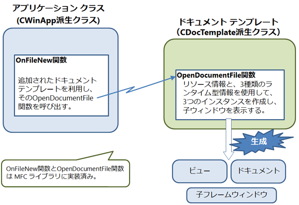

<strong>図 6.8 ドキュメント テンプレートを使用した子ウィンドウの作成</strong>

図中の左の CWinApp::OnFileNew 関数の内部では、追加されたドキュメント テンプレートを使用して、そのドキュメント テンプレートの OpenDocumentFile 関数を呼び出します。ドキュメント テンプレートの OpenDocumentFile 関数の内部では、例 6.8 の [15] から [16] の時点でコンストラクターの引数に渡されたリソース情報と 3 種類のランタイム型情報を使用して、ドキュメント、ビュー、および子フレーム ウィンドウのインスタンスを作成します。その結果、子ウィンドウが
 1 つ表示されます。

この流れで登場する CWinApp::OnFileNew 関数と CDocTemplate::OpenDocumentFile 関数は、MFC ライブラリに実装済みなので、プログラマーが用意すべき実装は、最終的にインスタンスが作成される 3 種類のクラス (および、リソース文字列) だけです。

このあと、CWinApp::OnFileNew 関数を繰り返し呼び出せば、呼び出した回数だけ、同じ要領で子ウィンドウが新規に表示されます。仮に、例 6.8 の [18] の箇所で、OnFileNew 関数を 2 回呼び出せば、子ウィンドウが 2 つ新規に表示されます。冒頭の図 6.2 の実行結果は、2 回呼び出した場合の例です。

<a href="#top">ページのトップへ</a>

<h2 id="11" style="font-size:120%; margin-top:20px">11. 完成した MDI アプリケーションの確認</h2>

これで、MDI の構成要素が一通り揃いました。実際にこのプログラムを作成した方は、プログラムコードが次の状態になっているか確認してください。(例 6.8 の [18] の OnFileNew 関数を 2 回呼び出しても構いませんが、このサンプルは次回も使用しますので、すべての作業が済んだら、OnFileNew 関数の呼び出しは例 6.8 のように 1 回に戻しておいてください。)

<ul>
<li>汎用的なヘッダー --- 例 6.1 stdafx.h </li><li>アプリケーション クラス ---- 例 6.8 SmallApp.h、および SmallApp.cpp </li><li>フレーム ウィンドウ ---- 例 6.3 MainFrm.h および MainFrm.cpp </li><li>リソース ---- 例 6.7 resource.h および SmallApp.rc (例 6.4 の SmallApp.rc を含む) </li><li>アイコン ファイル ---- SmallApp.ico、SmallText.ico (いずれもオプション) </li><li>ドキュメント、ビュー、子フレーム ---- 例 6.6 SmallDoc.h、SmallDoc.cpp、SmallView.h、SmallView.cpp、ChildFrm.h、および ChildFrm.cpp
</li></ul>

この状態で実行すると、次図のように子ウィンドウが表示されます。メニューは、子ウィンドウのリソースとして定義した例 6.7 のメニュー バー (正確にいえば、ドキュメント テンプレートのコンストラクター引数へ渡したリソースのメニュー バー) が表示されます。

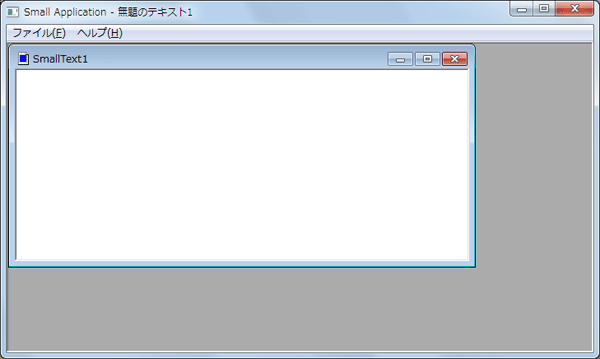

<strong>図 6.9 完成した MDI アプリケーション</strong>

また、子ウィンドウ内の右上部の閉じるボタン ([&times;] ボタン) をクリックして、子ウィンドウを閉じると、次図のように、メニュー バーはメインのフレーム ウィンドウに使用されたリソースに切替わることが分かります。

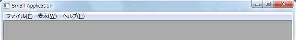

<strong>図 6.10 メイン フレーム ウィンドウのメニュー バーに切替わる</strong>

確認が済んだら、アプリケーションを終了しておきましょう。

<a href="#top">ページのトップへ</a>

<h2 id="12" style="font-size:120%; margin-top:20px">12. まとめ</h2>

今回は、MDI アプリケーションの主要なクラスの使用方法を理解するために、手作業で MDI アプリケーションを作成しました。実際のところ、MFC アプリケーション ウィザードを使用すれば、今回手作業で行った実装と同等のものは、すべて自動生成させることができます。

ただ、提供された MFC のサンプル コードなどは、ウィザードで生成した後のソース コードのわけですから、それらのサンプルを読解したり、カスタマイズしたりする際には、今回の知識が役立つと思います。

また、今回作成したサンプルには、子ウィンドウを新規作成するコマンドや、「開く」、「閉じる」などの一般的なデータに関わる操作、また、ドキュメントのシリアル化は実装されていません。また、ビューについても、実際の描画は実装していません。次回は、このドキュメント/ビュー アーキテクチャのサンプルを利用して、これらの機能をいくつか追加していきます。

<a href="#top">ページのトップへ</a>

<h2 id="13" style="font-size:120%; margin-top:20px">13. 参考手順</h2>

MFC アプリケーション ウィザードを用いて、今回のサンプル プログラムとほぼ同等のものを作成する手順を以下に示しておきます。MFC アプリケーション プロジェクトを新規作成する際に起動する MFC アプリケーション ウィザードの各ページでは、順に以下のように設定してください。

<ul>
<li>「アプリケーションの種類」ページ
<ul>
<li style="list-style:none none">「アプリケーションの種類」として［マルチ ドキュメント］(MDI) を選択する </li><li style="list-style:none none">［タブ付きドキュメント］チェック ボックスを解除する </li><li style="list-style:none none">「プロジェクト形式」として［MFC 標準］を選択する </li><li style="list-style:none none">［visual スタイルの切り替えを有効にする］チェック ボックスを解除する </li></ul>
</li><li>「複合ドキュメントのサポート」ページ
<ul>
<li style="list-style:none none">既定値のまま「なし」を選択する </li></ul>
</li><li>ドキュメント テンプレート プロパティ」ページ
<ul>
<li style="list-style:none none">ファイル拡張子: txt-sample </li><li style="list-style:none none">フィルター名: Small Text (*.txt-sample) </li><li style="list-style:none none">メインフレームのキャプション: Small Application </li><li style="list-style:none none">ドキュメントの種類の名前: SmallText </li><li style="list-style:none none">ファイルの新しい短い名前: Small Text </li><li style="list-style:none none">ファイルの種類 ID: Small.TextDoc.1 </li><li style="list-style:none none">ファイルの種類の長い名前: SmallTextDoc </li></ul>
</li><li>「データベース サポート」ページ
<ul>
<li style="list-style:none none">既定値のまま「なし」を選択する </li></ul>
</li><li>「ユーザー インターフェイス機能」ページ
<ul>
<li style="list-style:none none">左の ［初期ステータスバー］ チェック ボックスを解除する </li><li style="list-style:none none">右の ［ユーザー定義のツール バーとツール バー イメージ］ チェック ボックスを解除する </li><li style="list-style:none none">右の ［パーソナル化されたメニュー動作］ チェック ボックスを解除する </li></ul>
</li><li>「高度な機能」ページ
<ul>
<li style="list-style:none none">すべてのチェック ボックスを解除する </li></ul>
</li><li>「生成されたクラス」ページ
<ul>
<li style="list-style:none none">クラス名は任意。(このページで、クラス名やファイル名をサンプルと同じ設定にできます。基本クラスは変更せずに、既定のまま使用してください。)
</li></ul>
</li></ul>

<table>
<tbody>
<tr>
<td></td>
<td></td>
<td>
<ul>
<li>もっと他のコンテンツを見る &gt;&gt; <a href="http://msdn.microsoft.com/ja-jp/visualc/hh146885" target="_blank">
連載! とことん Visual C&#43;&#43; 一覧へ</a> </li><li>もっと他のレシピを見る &gt;&gt; <a href="http://code.msdn.microsoft.com/ja-jp">Code Recipe へ</a>
</li><li>もっと Visual C&#43;&#43; の情報を見る &gt;&gt; <a href="http://msdn.microsoft.com/ja-jp/visualc/" target="_blank">
Visual C&#43;&#43; デベロッパー センターへ</a> </li></ul>
</td>
</tr>
</tbody>
</table>

<a href="#top">ページのトップへ</a>

