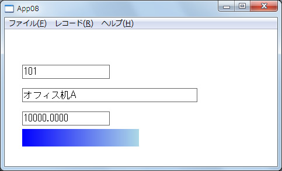
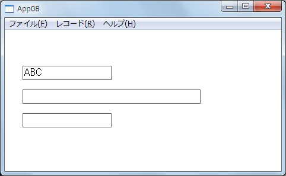
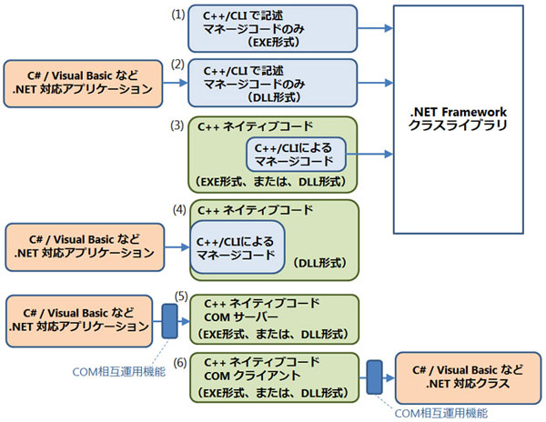
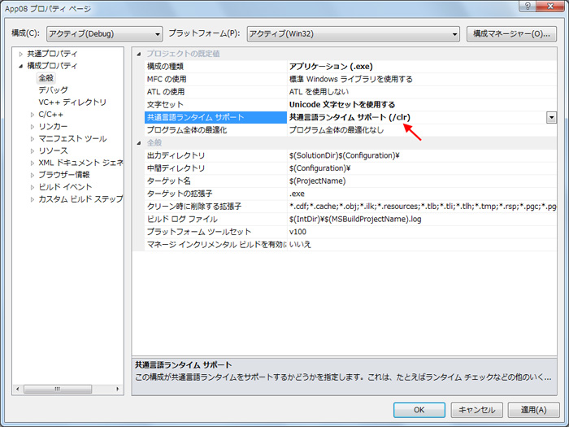
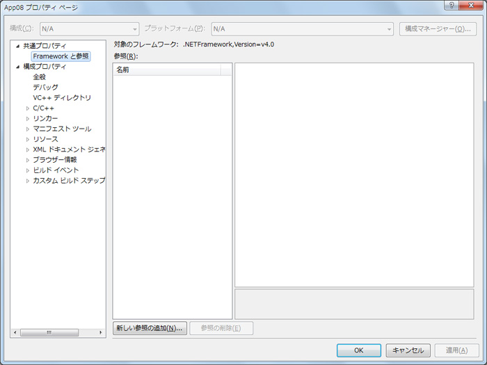
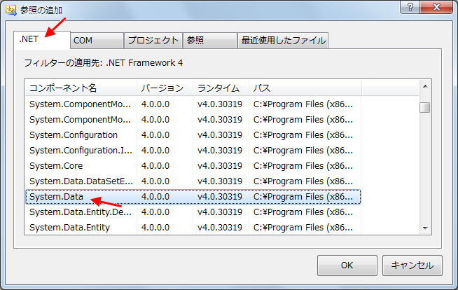
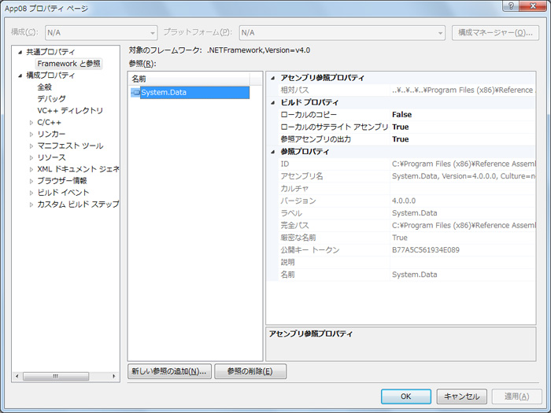
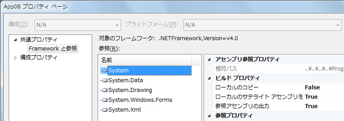
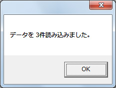
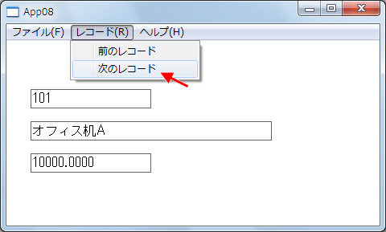

# [連載! とことん VC++] 第 8 回 C++/CLI を利用した相互運用 ～ネイティブ C++ から .NET の利用～
## Requires
- 
## License
- Apache License, Version 2.0
## Technologies
- Visual Studio 2010
- Visual C++ 2010
## Topics
- Visual C++ プログラミング
- 連載! とことん VC++
## Updated
- 03/08/2012
## Description

執筆者: <a href="http://msdn.microsoft.com/ja-jp/gg585574#yajima" target="_blank">
エディフィストラーニング株式会社 矢嶋 聡</a>

<h2>目次</h2>
<ol>
<li><a href="#01">はじめに</a> </li><li><a href="#02">今回作成するサンプル アプリケーション</a> </li><li><a href="#03">C&#43;&#43;/CLI の利用のシナリオ</a> </li><li><a href="#04">C&#43;&#43;/CLI を使用するプロジェクトの基本設定</a> </li><li><a href="#05">.NET Framework クラス ライブラリへの参照</a> </li><li><a href="#06">基本 (1) - .NET Framework のデータ型の基礎</a> </li><li><a href="#07">基本 (2) - 変数宣言とインスタンスの確保</a> </li><li><a href="#08">ADO.NET の利用 ～ライブラリの基本的な使用～</a> </li><li><a href="#09">ネイティブコード用の文字列と .NET 版の文字列との相互変換</a> </li><li><a href="#10">ネイティブなデバイス コンテキストと .NET 版の Graphics オブジェクトの併用</a> </li><li><a href="#11">ネイティブなファイルハンドルと .NET コードの連携</a> </li><li><a href="#12">まとめ</a> </li></ol>

<h2 id="01" style="font-size:120%; margin-top:20px">1. はじめに</h2>

今回から 2 回に渡り、C&#43;&#43;/CLI (Common Language Infrastructure) について取り上げます。

C&#43;&#43;/CLI は、Visual C&#43;&#43; 2005 から導入された比較的新しい言語仕様であり、.NET Framework 向けアプリケーションを開発するために使用される、C&#43;&#43; の拡張です。C&#43;&#43;/CLI を用いることで、.NET 対応のマネージオブジェクトを実装できるほか、.NET Framework のクラスライブラリを利用することができます。現在は、.NET Framework の基盤でもある Common Language Infrastructure 向けの C&#43;&#43; 拡張として、ECMA の標準
 (ECMA-372) にもなっています。

従来の C&#43;&#43; 言語知識や .NET Framework の基礎知識をお持ちであれば、言語構文については、およそ推測できるかと思います。ここでは、C&#43;&#43;/CLI の言語構文を 1 つずつ取り上げるのではなく、最初に、Visual C&#43;&#43; において C&#43;&#43;/CLI が使用されるシナリオを改めて整理したのち、具体的なサンプルを用いながら、C&#43;&#43;/CLI の特徴や使用する上での注意点など、今後、C&#43;&#43;/CLI の理解を深める上で役立つ点をいくつか確認することにします。

<strong>Note:</strong>

C&#43;&#43;/CLI の構文の詳細は、以下のアドレスを参照してください。

<ul>
<li><a href="http://msdn.microsoft.com/ja-jp/library/xey702bw.aspx">Language Features for Targeting the CLR</a>
</li></ul>

&nbsp;

今回取り上げるサンプルでは、主に、C&#43;&#43; アプリケーションから .NET Framework クラス ライブラリなど、予め用意された .NET 対応のオブジェクトを利用する方法について取り上げます。また、次回の第 9 回では逆に、Visual Basic や C# など他の .NET 対応プログラミング言語から利用させるために、C&#43;&#43; 版の .NET 対応のオブジェクトを作成する上での注意点や実装の特徴について取り上げます。

<a href="#top" target="_self">ページのトップへ</a>

<h2 id="02" style="font-size:120%; margin-top:20px">2. 今回作成するサンプル アプリケーション</h2>

今回は、次図に示すアプリケーションを作成します。この主要部分は、ネイティブ C&#43;&#43; で記述された Windows アプリケーションですが、C&#43;&#43;/CLI も用いて .NET のライブラリを利用しています。

<strong>図 8.1 今回作成するサンプル アプリケーション</strong>

ADO.NET を利用して、データ ベースからデータを読み込み、ネイティブ コードで 記述されたユーザー インターフェイスに、そのデータを表示しています。また、下部の帯グラフも .NET のグラフィック関連のライブラリを使用しており、表示先で あるメインウィンドウは、ネイティブ コードで実装されています。このほか、ネイティブ コードでオープンしたファイルに対して、.NET のオブジェクトを使用して、データ を保存するコードも記述します。このように、従来のネイティブ コードと .NET の コードを併用する際には、ネイティブ
 コードと .NET コードをどう連携させるかがポイントとなり、ここでは、その特徴や留意点なども取り上げます。

<strong>Note:</strong>

この後のサンプルでは、Visual C&#43;&#43; 2010 Express の Win32 プロジェクトを使用しています。サンプル コードを机上で確認する場合でも理解できるように、サンプル固有の実装部分を一通り掲載していますが、もし、このサンプル コードを入力して動作確認するのであれば、次の要領で Win32 プロジェクトを準備してください。(この時点では、まだ .NET 対応になっていません。) このサンプルでは、いくつかメニュー バーにメニュー項目を追加し、メイン ウィンドウ上には、3 つの EDIT コントロール
 (テキスト ボックス) を貼り付けいます。

また、今回は .NET のデータアクセステクノロジである ADO.NET を使用するので、データベースも使用します。予め、SQL Server 2008 R2 Express (または、それ以上のエディション) をインストールしておく必要があります。必要なデータベース ファイルの作成方法については後述します。

(1) プロジェクトを新規作成するにあたり、Win32 プロジェクト テンプレートを使用し、プロジェクト名は App08、ソリューション名を App08Sol とします。プロジェクトの作成場所は「C:\SamplesVCpp\Article08\」と指定し、そのほかのオプションは既定のままにします。 
(2) プロジェクトの新規作成時に起動する「Win32 アプリケーション ウィザード」では、既定のままに指定して、ウィンドウを伴うアプリケーションとして作成します。 
(3) プロジェクトが生成されたら、例 8.1 に示すように、各ファイルに関して修正します。修正部分は、コメント「//◆◆◆」で囲まれた太字部分です。なお、ソリューション エクスプローラー上に表示されるファイルのうち、リソース スクリプトである「App08.rc」をダブル クリックしても、Express エディションでは、リソース ビュー経由で編集できません。よって、「App08.rc」を右クリックして、ショートカット メニューから［コードの表示］をクリックし、コード エディターを起動して編集してください。

また、ここでは実装を簡単にするため、特に断りがないかぎり、プロジェクト既定の Unicode 版であることを前提に、関数の引数や文字列リテラルは Unicode 文字列を使用しています。

<strong>例 8.1 サンプルの下準備</strong>を実 行してください

<strong>ファイル名: Resource.h (末尾に追加)</strong>

C&#43;&#43;

スクリプトの編集|{#scriptcode_dlg.remove_script}

cplusplus
<pre class="hidden">// [省略]

//◆◆◆メニュー項目やEDITコントロール用のID
#define ID_FILE_EXPORT    3001
#define ID_RECORD_PREV    3500
#define ID_RECORD_NEXT    3501
#define IDC_EDIT1         3701
#define IDC_EDIT2         3702
#define IDC_EDIT3         3703
//◆◆◆</pre>

<pre id="codePreview" class="js">//&nbsp;[省略]&nbsp;
&nbsp;
//◆◆◆メニュー項目やEDITコントロール用のID&nbsp;
#define&nbsp;ID_FILE_EXPORT&nbsp;&nbsp;&nbsp;&nbsp;3001&nbsp;
#define&nbsp;ID_RECORD_PREV&nbsp;&nbsp;&nbsp;&nbsp;3500&nbsp;
#define&nbsp;ID_RECORD_NEXT&nbsp;&nbsp;&nbsp;&nbsp;3501&nbsp;
#define&nbsp;IDC_EDIT1&nbsp;&nbsp;&nbsp;&nbsp;&nbsp;&nbsp;&nbsp;&nbsp;&nbsp;3701&nbsp;
#define&nbsp;IDC_EDIT2&nbsp;&nbsp;&nbsp;&nbsp;&nbsp;&nbsp;&nbsp;&nbsp;&nbsp;3702&nbsp;
#define&nbsp;IDC_EDIT3&nbsp;&nbsp;&nbsp;&nbsp;&nbsp;&nbsp;&nbsp;&nbsp;&nbsp;3703&nbsp;
//◆◆◆</pre>

&nbsp;

<strong>ファイル名: App08.rc (メニューに対しての修正)</strong>

C&#43;&#43;

スクリプトの編集|{#scriptcode_dlg.remove_script}

cplusplus
<pre class="hidden">// [省略]

//◆◆◆メニュー項目の修正
IDC_APP08 MENU
BEGIN
    POPUP &quot;ファイル(&amp;F)&quot;
    BEGIN
        MENUITEM &quot;ファイルへエクスポート&quot;, ID_FILE_EXPORT
        MENUITEM SEPARATOR
        MENUITEM &quot;アプリケーションの終了(&amp;X)&quot;, IDM_EXIT
    END
    POPUP &quot;レコード(&amp;R)&quot;
    BEGIN
        MENUITEM &quot;前のレコード&quot;, ID_RECORD_PREV
        MENUITEM &quot;次のレコード&quot;, ID_RECORD_NEXT
    END
    POPUP &quot;ヘルプ(&amp;H)&quot;
    BEGIN
        MENUITEM &quot;バージョン情報(&amp;A)...&quot;, IDM_ABOUT
    END
END
//◆◆◆

// [省略]</pre>

<pre id="codePreview" class="cplusplus">//&nbsp;[省略]&nbsp;
&nbsp;
//◆◆◆メニュー項目の修正&nbsp;
IDC_APP08&nbsp;MENU&nbsp;
BEGIN&nbsp;
&nbsp;&nbsp;&nbsp;&nbsp;POPUP&nbsp;&quot;ファイル(&amp;F)&quot;&nbsp;
&nbsp;&nbsp;&nbsp;&nbsp;BEGIN&nbsp;
&nbsp;&nbsp;&nbsp;&nbsp;&nbsp;&nbsp;&nbsp;&nbsp;MENUITEM&nbsp;&quot;ファイルへエクスポート&quot;,&nbsp;ID_FILE_EXPORT&nbsp;
&nbsp;&nbsp;&nbsp;&nbsp;&nbsp;&nbsp;&nbsp;&nbsp;MENUITEM&nbsp;SEPARATOR&nbsp;
&nbsp;&nbsp;&nbsp;&nbsp;&nbsp;&nbsp;&nbsp;&nbsp;MENUITEM&nbsp;&quot;アプリケーションの終了(&amp;X)&quot;,&nbsp;IDM_EXIT&nbsp;
&nbsp;&nbsp;&nbsp;&nbsp;END&nbsp;
&nbsp;&nbsp;&nbsp;&nbsp;POPUP&nbsp;&quot;レコード(&amp;R)&quot;&nbsp;
&nbsp;&nbsp;&nbsp;&nbsp;BEGIN&nbsp;
&nbsp;&nbsp;&nbsp;&nbsp;&nbsp;&nbsp;&nbsp;&nbsp;MENUITEM&nbsp;&quot;前のレコード&quot;,&nbsp;ID_RECORD_PREV&nbsp;
&nbsp;&nbsp;&nbsp;&nbsp;&nbsp;&nbsp;&nbsp;&nbsp;MENUITEM&nbsp;&quot;次のレコード&quot;,&nbsp;ID_RECORD_NEXT&nbsp;
&nbsp;&nbsp;&nbsp;&nbsp;END&nbsp;
&nbsp;&nbsp;&nbsp;&nbsp;POPUP&nbsp;&quot;ヘルプ(&amp;H)&quot;&nbsp;
&nbsp;&nbsp;&nbsp;&nbsp;BEGIN&nbsp;
&nbsp;&nbsp;&nbsp;&nbsp;&nbsp;&nbsp;&nbsp;&nbsp;MENUITEM&nbsp;&quot;バージョン情報(&amp;A)...&quot;,&nbsp;IDM_ABOUT&nbsp;
&nbsp;&nbsp;&nbsp;&nbsp;END&nbsp;
END&nbsp;
//◆◆◆&nbsp;
&nbsp;
//&nbsp;[省略]</pre>

<strong>ファイル名: App08.cpp (既存の修正)</strong>

C&#43;&#43;

スクリプトの編集|{#scriptcode_dlg.remove_script}

cplusplus
<pre class="hidden">// [省略]

//◆◆◆
//メインウィンドウのハンドル
HWND hMainWindow = NULL;

// TODO(1): 使用する関数のプロトタイプをここに追加

//◆◆◆

int APIENTRY _tWinMain(HINSTANCE hInstance,
                     HINSTANCE hPrevInstance,
                     LPTSTR    lpCmdLine,
                     int       nCmdShow)
{
    UNREFERENCED_PARAMETER(hPrevInstance);
    UNREFERENCED_PARAMETER(lpCmdLine);

// [省略]

BOOL InitInstance(HINSTANCE hInstance, int nCmdShow)
{
   HWND hWnd;

   hInst = hInstance; // グローバル変数にインスタンス処理を&#26684;納します。

   hWnd = CreateWindow(szWindowClass, szTitle, WS_OVERLAPPEDWINDOW,
      CW_USEDEFAULT, 0, CW_USEDEFAULT, 0, NULL, NULL, hInstance, NULL);

   if (!hWnd)
   {
      return FALSE;
   }

   //◆◆◆
   // メインウィンドウのハンドル退避
   hMainWindow = hWnd;
   // EDITコントロールの貼り付けとコントロールIDの割り振り
   ::CreateWindowW( L&quot;EDIT&quot;, NULL, WS_CHILD | WS_VISIBLE | WS_BORDER,
       30, 60, 150, 24, hWnd, (HMENU)(UINT_PTR)IDC_EDIT1, hInstance, NULL);
   ::CreateWindowW( L&quot;EDIT&quot;, NULL, WS_CHILD | WS_VISIBLE | WS_BORDER,
       30,100, 300, 24, hWnd, (HMENU)(UINT_PTR)IDC_EDIT2, hInstance, NULL);
   ::CreateWindowW( L&quot;EDIT&quot;, NULL, WS_CHILD | WS_VISIBLE | WS_BORDER,
       30,140, 150, 24, hWnd, (HMENU)(UINT_PTR)IDC_EDIT3, hInstance, NULL);
   ::SetDlgItemTextW( hWnd, IDC_EDIT1, L&quot;ABC&quot;);

   // TODO(2): データベースの読み込みをここに追加

   //◆◆◆

   ShowWindow(hWnd, nCmdShow);
   UpdateWindow(hWnd);

   return TRUE;
}

//◆◆◆

// TODO(3): 必要な関数をここに追加

//◆◆◆</pre>

<pre id="codePreview" class="js">//&nbsp;[省略]&nbsp;
&nbsp;
//◆◆◆&nbsp;
//メインウィンドウのハンドル&nbsp;
HWND&nbsp;hMainWindow&nbsp;=&nbsp;NULL;&nbsp;
&nbsp;
//&nbsp;TODO(1):&nbsp;使用する関数のプロトタイプをここに追加&nbsp;
&nbsp;
//◆◆◆&nbsp;
&nbsp;
int&nbsp;APIENTRY&nbsp;_tWinMain(HINSTANCE&nbsp;hInstance,&nbsp;
&nbsp;&nbsp;&nbsp;&nbsp;&nbsp;&nbsp;&nbsp;&nbsp;&nbsp;&nbsp;&nbsp;&nbsp;&nbsp;&nbsp;&nbsp;&nbsp;&nbsp;&nbsp;&nbsp;&nbsp;&nbsp;HINSTANCE&nbsp;hPrevInstance,&nbsp;
&nbsp;&nbsp;&nbsp;&nbsp;&nbsp;&nbsp;&nbsp;&nbsp;&nbsp;&nbsp;&nbsp;&nbsp;&nbsp;&nbsp;&nbsp;&nbsp;&nbsp;&nbsp;&nbsp;&nbsp;&nbsp;LPTSTR&nbsp;&nbsp;&nbsp;&nbsp;lpCmdLine,&nbsp;
&nbsp;&nbsp;&nbsp;&nbsp;&nbsp;&nbsp;&nbsp;&nbsp;&nbsp;&nbsp;&nbsp;&nbsp;&nbsp;&nbsp;&nbsp;&nbsp;&nbsp;&nbsp;&nbsp;&nbsp;&nbsp;int&nbsp;&nbsp;&nbsp;&nbsp;&nbsp;&nbsp;&nbsp;nCmdShow)&nbsp;
{&nbsp;
&nbsp;&nbsp;&nbsp;&nbsp;UNREFERENCED_PARAMETER(hPrevInstance);&nbsp;
&nbsp;&nbsp;&nbsp;&nbsp;UNREFERENCED_PARAMETER(lpCmdLine);&nbsp;
&nbsp;
//&nbsp;[省略]&nbsp;
&nbsp;
BOOL&nbsp;InitInstance(HINSTANCE&nbsp;hInstance,&nbsp;int&nbsp;nCmdShow)&nbsp;
{&nbsp;
&nbsp;&nbsp;&nbsp;HWND&nbsp;hWnd;&nbsp;
&nbsp;
&nbsp;&nbsp;&nbsp;hInst&nbsp;=&nbsp;hInstance;&nbsp;//&nbsp;グローバル変数にインスタンス処理を&#26684;納します。&nbsp;
&nbsp;
&nbsp;&nbsp;&nbsp;hWnd&nbsp;=&nbsp;CreateWindow(szWindowClass,&nbsp;szTitle,&nbsp;WS_OVERLAPPEDWINDOW,&nbsp;
&nbsp;&nbsp;&nbsp;&nbsp;&nbsp;&nbsp;CW_USEDEFAULT,&nbsp;0,&nbsp;CW_USEDEFAULT,&nbsp;0,&nbsp;NULL,&nbsp;NULL,&nbsp;hInstance,&nbsp;NULL);&nbsp;
&nbsp;
&nbsp;&nbsp;&nbsp;if&nbsp;(!hWnd)&nbsp;
&nbsp;&nbsp;&nbsp;{&nbsp;
&nbsp;&nbsp;&nbsp;&nbsp;&nbsp;&nbsp;return&nbsp;FALSE;&nbsp;
&nbsp;&nbsp;&nbsp;}&nbsp;
&nbsp;
&nbsp;&nbsp;&nbsp;//◆◆◆&nbsp;
&nbsp;&nbsp;&nbsp;//&nbsp;メインウィンドウのハンドル退避&nbsp;
&nbsp;&nbsp;&nbsp;hMainWindow&nbsp;=&nbsp;hWnd;&nbsp;
&nbsp;&nbsp;&nbsp;//&nbsp;EDITコントロールの貼り付けとコントロールIDの割り振り&nbsp;
&nbsp;&nbsp;&nbsp;::CreateWindowW(&nbsp;L&quot;EDIT&quot;,&nbsp;NULL,&nbsp;WS_CHILD&nbsp;|&nbsp;WS_VISIBLE&nbsp;|&nbsp;WS_BORDER,&nbsp;
&nbsp;&nbsp;&nbsp;&nbsp;&nbsp;&nbsp;&nbsp;30,&nbsp;60,&nbsp;150,&nbsp;24,&nbsp;hWnd,&nbsp;(HMENU)(UINT_PTR)IDC_EDIT1,&nbsp;hInstance,&nbsp;NULL);&nbsp;
&nbsp;&nbsp;&nbsp;::CreateWindowW(&nbsp;L&quot;EDIT&quot;,&nbsp;NULL,&nbsp;WS_CHILD&nbsp;|&nbsp;WS_VISIBLE&nbsp;|&nbsp;WS_BORDER,&nbsp;
&nbsp;&nbsp;&nbsp;&nbsp;&nbsp;&nbsp;&nbsp;30,100,&nbsp;300,&nbsp;24,&nbsp;hWnd,&nbsp;(HMENU)(UINT_PTR)IDC_EDIT2,&nbsp;hInstance,&nbsp;NULL);&nbsp;
&nbsp;&nbsp;&nbsp;::CreateWindowW(&nbsp;L&quot;EDIT&quot;,&nbsp;NULL,&nbsp;WS_CHILD&nbsp;|&nbsp;WS_VISIBLE&nbsp;|&nbsp;WS_BORDER,&nbsp;
&nbsp;&nbsp;&nbsp;&nbsp;&nbsp;&nbsp;&nbsp;30,140,&nbsp;150,&nbsp;24,&nbsp;hWnd,&nbsp;(HMENU)(UINT_PTR)IDC_EDIT3,&nbsp;hInstance,&nbsp;NULL);&nbsp;
&nbsp;&nbsp;&nbsp;::SetDlgItemTextW(&nbsp;hWnd,&nbsp;IDC_EDIT1,&nbsp;L&quot;ABC&quot;);&nbsp;
&nbsp;
&nbsp;&nbsp;&nbsp;//&nbsp;TODO(2):&nbsp;データベースの読み込みをここに追加&nbsp;
&nbsp;
&nbsp;&nbsp;&nbsp;//◆◆◆&nbsp;
&nbsp;
&nbsp;&nbsp;&nbsp;ShowWindow(hWnd,&nbsp;nCmdShow);&nbsp;
&nbsp;&nbsp;&nbsp;UpdateWindow(hWnd);&nbsp;
&nbsp;
&nbsp;&nbsp;&nbsp;return&nbsp;TRUE;&nbsp;
}&nbsp;
&nbsp;
//◆◆◆&nbsp;
&nbsp;
//&nbsp;TODO(3):&nbsp;必要な関数をここに追加&nbsp;
&nbsp;
//◆◆◆</pre>

&nbsp;

のちほど、「TODO(1):」から「TODO(3):」までの各箇所に、必要なサンプル コードを追加するほか、ウィンドウ プロシージャの一部を修正します。この時点でビルドして、実行すると、次図のようなメニュー バーと 3 つの EDIT コントロールを伴うウィンドウが表示されます。1 つ目の EDIT コントロールの「ABC」というテキスト表示は、試験的な表示であり、このあとは修正します。

<strong>図 8.2 初期状態のサンプル アプリケーション</strong>

<strong>Note:</strong>

このほかデータ ベース ファイルを用意する必要があります。以下のバッチ ファイルとスクリプトを用意して、バッチ ファイル「MakeDatabase1.bat」を実行してください。なお、このバッチ ファイルでは、SQL Server 2008 R2 Express エディションが既定構成でインストールされてるいことを前提としていま す。バッチ ファイル内のインスタンス名「.\SQLEXPRESS」は、必要に応じて変 更してください。また、スクリプト ファイル内のデータベース作成用のパス「'C: \SamplesVCpp\Article08\db\」は予め用意しておいてください。なお、これを実行すると、既存の
 Sales という名前のデータベースに対して上書きするので注意してください。

<strong>例 8.2 データ ベース ファイルの準備</strong>

<strong>ファイル名: MakeDatabase1.bat (バッチ ファイル)</strong>

C&#43;&#43;

スクリプトの編集|{#scriptcode_dlg.remove_script}

cplusplus
<pre class="hidden">sqlcmd -E -S .\SQLEXPRESS -i MakeDatabase1.sql</pre>

<pre id="codePreview" class="js">sqlcmd&nbsp;-E&nbsp;-S&nbsp;.\SQLEXPRESS&nbsp;-i&nbsp;MakeDatabase1.sql</pre>

&nbsp;

<strong>ファイル名: MakeDatabase1.sql (スクリプト ファイル)</strong>

C&#43;&#43;

スクリプトの編集|{#scriptcode_dlg.remove_script}

cplusplus
<pre class="hidden">:On Error Exit

USE master
GO

IF EXISTS (SELECT name FROM master.dbo.sysdatabases WHERE name = N'Sales')
BEGIN
     DROP DATABASE Sales
END
GO

/***** データベース作成 *****/

CREATE DATABASE Sales
    ON     (NAME = Sales_dat, FILENAME = N'C:\SamplesVCpp\Article08\db\Sales_dat.mdf')
    LOG ON (NAME = Sales_log, FILENAME = N'C:\SamplesVCpp\Article08\db\Sales_log.ldf')
GO

/***** テーブル作成 *****/
use Sales
GO

CREATE TABLE dbo.Products (
    ProductID int PRIMARY KEY,
    ProductName nvarchar(16) NOT NULL,
    Price money NOT NULL
)
GO

/***** データ作成 *****/
INSERT INTO Products VALUES(101, 'オフィス机A' , 10000)
INSERT INTO Products VALUES(102, 'オフィス机B' , 20000)
INSERT INTO Products VALUES(201, 'LEDスタンド'  , 3000)
GO</pre>

<pre id="codePreview" class="js">:On&nbsp;Error&nbsp;Exit&nbsp;
&nbsp;
USE&nbsp;master&nbsp;
GO&nbsp;
&nbsp;
IF&nbsp;EXISTS&nbsp;(SELECT&nbsp;name&nbsp;FROM&nbsp;master.dbo.sysdatabases&nbsp;WHERE&nbsp;name&nbsp;=&nbsp;N'Sales')&nbsp;
BEGIN&nbsp;
&nbsp;&nbsp;&nbsp;&nbsp;&nbsp;DROP&nbsp;DATABASE&nbsp;Sales&nbsp;
END&nbsp;
GO&nbsp;
&nbsp;
/*****&nbsp;データベース作成&nbsp;*****/&nbsp;
&nbsp;
CREATE&nbsp;DATABASE&nbsp;Sales&nbsp;
&nbsp;&nbsp;&nbsp;&nbsp;ON&nbsp;&nbsp;&nbsp;&nbsp;&nbsp;(NAME&nbsp;=&nbsp;Sales_dat,&nbsp;FILENAME&nbsp;=&nbsp;N'C:\SamplesVCpp\Article08\db\Sales_dat.mdf')&nbsp;
&nbsp;&nbsp;&nbsp;&nbsp;LOG&nbsp;ON&nbsp;(NAME&nbsp;=&nbsp;Sales_log,&nbsp;FILENAME&nbsp;=&nbsp;N'C:\SamplesVCpp\Article08\db\Sales_log.ldf')&nbsp;
GO&nbsp;
&nbsp;
&nbsp;
/*****&nbsp;テーブル作成&nbsp;*****/&nbsp;
use&nbsp;Sales&nbsp;
GO&nbsp;
&nbsp;
CREATE&nbsp;TABLE&nbsp;dbo.Products&nbsp;(&nbsp;
&nbsp;&nbsp;&nbsp;&nbsp;ProductID&nbsp;int&nbsp;PRIMARY&nbsp;KEY,&nbsp;
&nbsp;&nbsp;&nbsp;&nbsp;ProductName&nbsp;nvarchar(16)&nbsp;NOT&nbsp;NULL,&nbsp;
&nbsp;&nbsp;&nbsp;&nbsp;Price&nbsp;money&nbsp;NOT&nbsp;NULL&nbsp;
)&nbsp;
GO&nbsp;
&nbsp;
/*****&nbsp;データ作成&nbsp;*****/&nbsp;
INSERT&nbsp;INTO&nbsp;Products&nbsp;VALUES(101,&nbsp;'オフィス机A'&nbsp;,&nbsp;10000)&nbsp;
INSERT&nbsp;INTO&nbsp;Products&nbsp;VALUES(102,&nbsp;'オフィス机B'&nbsp;,&nbsp;20000)&nbsp;
INSERT&nbsp;INTO&nbsp;Products&nbsp;VALUES(201,&nbsp;'LEDスタンド'&nbsp;&nbsp;,&nbsp;3000)&nbsp;
GO</pre>

&nbsp;

これらを実行する際には、上記のバッチ ファイルとスクリプト ファイルを同一フォルダー内に用意したのち、SQL Server にログイン可能なアカウントで、 Windows にログオンし、コマンドプロンプトを開いて、バッチ ファイルのほうを実 行してください。(既定構成でインストールした SQL Server 2008 R2 の場合、インストールに使用したアカウントは、SQL Server にログインできます。) これを実行すると、「Sales」という名前のデータ ベースが作成され、さらに 「Products」という名前のテーブルが作成されます。テーブル内のデータは
 3 件 あります。

<strong>Note:</strong>

上記の Sales データ ベースを削除して元の状態に戻すには、スクリプト ファイル内のデータ ベース作成より前の部分 (データ ベースの削除) だけ実行するよう、スクリプト ファイルの後半を削除してください。

<a href="#top" target="_self">ページのトップへ</a>

<h2 id="03" style="font-size:120%; margin-top:20px">3. C&#43;&#43;/CLI の利用のシナリオ</h2>

C&#43;&#43;/CLI の具体例を確認する前に、C&#43;&#43;/CLI を使うべき状況を改めて整理しておきましょう。そもそも C&#43;&#43;/CLI は、.NET 向けの実装するために使用するので、まずは、Visual C&#43;&#43; において、.NET を使用するパターンにどのようなものがあるか、まとめてみましょう。次図は、C&#43;&#43;/CLI を使用するケースも含め、Visual C&#43;&#43; において .NET Framework を用いる実装パターンを挙げたものです。

<strong>図8.3 Visual C&#43;&#43;における .NET Framework 関連の実装パターン</strong>

主なパターンとして、この図の中央の縦に並んだ 6 通りの実装が考えられます。

このうち (5) と (6) は、.NET Framework が提供する「COM 相互運用機能」を使用して、C&#43;&#43; アプリケーションと .NET 対応アプリケーションを連携させる方法です。COM 相互運用機能を用いれば、.NET Framework の実行環境が提供する専用のレイヤーを介することで、COM サーバーの COM オブジェクトは、.NET 対応アプリケーションにとって、.NET 版オブジェクト (マネージ オブジェクト) として利用できます。

(5) のパターンは、C&#43;&#43; ネイティブ コードの COM オブジェクトが、左側の .NET 対応アプリケーションから、マネージ オブジェクトとして利用されている例です。また、(6) のパターンは右側の .NET 対応クラスをCOM オブジェクトとして、C&#43;&#43; の COM クライアントが利用する例です。この 2 つのパターンは、COM 関連のレジストリ情報を利用する方法であり、COM 相互運用機能を利用する上で、特別なコードを追記する必要はありません。つまり、C&#43;&#43; アプリケーションはネイティブ コードのまま利用でき、C&#43;&#43;/CLI
 によるコードの追加や書き換えは必要ないのです。

よって、(5) と (6) の COM 相互運用機能を利用するパターンは、既存の C&#43;&#43; ネイティブ アプリケーションを .NET 環境に移行する最も簡単な方法です。しかし、トレードオフとして、対象が COM サーバーや COM クライアントに限定されるほか、COM 相互運用機能のために、専用のレイヤーを経由する分、オーバーヘッドが生じます。

(1) や (2) は、C&#43;&#43;/CLI を用いて .NET 対応コード (マネージコード) として実装する方法であり、純粋に .NET 対応アプリケーションとして構築します。この方法であれば、.NET Framework の恩恵を最大限受けることができます。(1) のようにスタンドアローン アプリケーションとして構成できるだけでなく、(2) のように C# や Visual Basic などで作成したアプリケーションからライブラリとして利用することもでき、複数の言語をまたぐ再利用が可能です。ただし、トレードオフとしては、全面的に
 C&#43;&#43;/CLI で書き換えることになるので、既存資産の C&#43;&#43; ネイティブ アプリケーションをそのままでは再利用できない点が挙げられます。新規にアプリケーションを作成するのであれば、(1) や (2) は有力な選択肢となるでしょう。

(3) や (4) は、C&#43;&#43; ネイティブ コードと C&#43;&#43;/CLI によるマネージ コードを 1 つのアプリケーションの中で併用する方法で、いわば、「ハイブリッド型」のアプリケーションです。特に、このハイブリッド型が他の言語にないユニークな実装パターンと言えます。

このうち (3) では、既存の C&#43;&#43; ネイティブ コードのアプリケーションに、C&#43;&#43;/CLI のコードを書き加えて、.NET Framework クラス ライブラリを使用しています。(.NET Framework クラス ライブラリにアクセスする部分は、C&#43;&#43;/CLI でコードを記述する必要があります。) また (4) の場合は、左側の C# や VB などの .NET 対応アプリケーションから、C&#43;&#43; のネイティブ オブジェクトを利用させるため、その仲介役となる(ブリッジ役となる) .NET 版のラッパー
 オブジェクトを C&#43;&#43;/CLI で実装した例です。

この (3) と (4) のパターンでは、他のパターンの課題を克服することができます。というのは、1 つのアプリケーションの中で、ネイティブ コードとマネージ コードが併用され、ネイティブ環境と .NET 環境の直接的な連携ができるので、(5) や (6) の COM 相互運用機能とは異なり、余分なレイヤーが無くなることで、オーバーヘッドを軽減できるからです。(ただし、場合によっては、ネイティブ オブジェクトとマネージ オブジェクトとの間で、依然としてデータの変換は必要になることはあります。) また、(1)
 や (2) のようにアプリケーション全体を新規作成するわけではないので、既存の C&#43;&#43; 資産も有効活用できます。

一方、(3) と (4) のハイブリッド型のトレードオフとしては、1 つのアプリケーションが完全には .NET Framework の管理下にあるわけではない点です。そのため、.NET Framework のメリットの 1 つである、ガベージ コレクションによる自動的なリソースの廃棄が、常に利用できるとは限らず、プログラマーがリソースのライフタイムを管理する必要があります。そのため、メモリリークなどのリスクは残ります。しかし、そもそも従来の C&#43;&#43; アプリケーションでは、プログラマーがリソースのライフタイムを管理していたわけですから問題点が新たに増えたわけではなく、さらに、.NET
 Framework の機能を享受できるので、利用する価値は十分あるでしょう。

いずれにしても、それぞれのパターンの長所と短所を考慮しつつ、それぞれの状況に適切した選択肢を選ぶことになります。

ここでは、特に既存資産のネイティブ コードと .NET 対応のマネージコードの連携に役立つ「ハイブリッド型」のアプリケーションについて取り上げます。特にこの第 8 回では (3) のパターンを扱い、次回の第 9 回では (4) のパターンを扱います。

<a href="#top" target="_self">ページのトップへ</a>

<h2 id="04" style="font-size:120%; margin-top:20px">4. C&#43;&#43;/CLI を使用するプロジェクトの基本設定</h2>

まずは、Visual C&#43;&#43; のプロジェクトが C&#43;&#43;/CLI に対応できように構成しましょう。

初めから、プロジェクト テンプレートとして「Windows フォーム アプリケーション」などの .NET 対応のものを使用していれば、C&#43;&#43;/CLI を利用できる環境になっていますが、ここでは基本的な設定方法を確認するため、今回のサンプル アプリケーションの App08 プロジェクトは、「Win32 プロジェクト」というネイティブ コード対応のものを使用しています。このプロジェクトで、C&#43;&#43;/CLI を利用できるように設定しましょう。

この設定は、App08 のプロジェクト プロパティ ページで行えます。次図のように、App08 のプロジェクト プロパティ ページを開き (ソリューション エクスプローラー上の ［App08］ プロジェクトを右クリックして ［プロパティ］ を選択)、左側のツリーでは ［構成プロパティ］ ノード配下の ［全般］ ノードをクリックします。このとき、右側の「共通言語ランタイム サポート」という項目では「共通言語ランタイムのサポート (/clr)」を選択します。

<strong>図 8.4 共通言語ランタイムをサポートするように変更</strong>

この「共通言語ランタイム サポート」という項目では、文字通り、.NET Frameworkのランタイムである共通言語ランタイムに対応するか否かを指定します。ここで、共通言語ランタイムをサポートするように設定すれば、C&#43;&#43;/CLI も利用できるようになります。

この項目では、次表のようにいくつかのオプションが指定でき、サポート状況が異なります。

<strong>表 8.1 共通言語ランタイム サポートの選択肢</strong>

<table class="grid" border="1" cellspacing="0" cellpadding="5" style="border-collapse:collapse; margin-bottom:10px">
<tbody>
<tr style="background-color:#eff3f7">
<td rowspan="2"><strong>選択肢</strong></td>
<td colspan="2" style="text-align:center"><strong>ネイティブ</strong></td>
<td colspan="2" style="text-align:center"><strong>マネージ</strong></td>
</tr>
<tr style="background-color:#eff3f7">
<td><strong>コード</strong></td>
<td><strong>データ</strong></td>
<td><strong>コード</strong></td>
<td><strong>データ</strong></td>
</tr>
<tr>
<td>1) 共通言語ランタイムサポート (/clr)</td>
<td style="text-align:center">○</td>
<td style="text-align:center">○</td>
<td style="text-align:center">○</td>
<td style="text-align:center">○</td>
</tr>
<tr>
<td>2) 純粋 MSIL 共通言語ランタイム サポート (/clr:pure)</td>
<td style="text-align:center">&nbsp;</td>
<td style="text-align:center">○</td>
<td style="text-align:center">○</td>
<td style="text-align:center">○</td>
</tr>
<tr>
<td>3) 安全な MSIL 共通言語ランタイム サポート (/clr:safe)</td>
<td style="text-align:center">&nbsp;</td>
<td>&nbsp;</td>
<td style="text-align:center">○</td>
<td style="text-align:center">○</td>
</tr>
</tbody>
</table>

この 3 つの選択肢のうち、今回選択した 1) は、ネイティブなコード (手続き) とデータ (型)、および、マネージ対応のコードとデータを併用できるパターンです。図 8.3 の 6 つの実装パターンに照らし合わせると、(3) と (4) のハイブリッド型で使用する選択肢です。

残りの 2) と 3) では、ネイティブな手続きを書くことはできず、図 8.3 の (1) や (2) の純粋な .NET 対応アプリケーションで使用する選択肢です。このうち、2) の選択肢では、ネイティブなデータ型を使用することは可能であり、ポインターを用いたメモリ アクセスなど、柔軟なデータ アクセスが可能です。その分、不正なメモリ アクセスがないように気を付ける必要はあります。一方、3) はネイティブ対応の実装を一切禁止したもので、メモリ アクセスなどのリソース操作は、.NET Framework
 の管理下にすべて置かれます。この3) の選択肢は、ポインターなどのきめ細かいメモリ操作はできませんが、最も信&#38972;性の高い実装方法です。

このほか表には載せませんでしたが、「共通言語ランタイム サポート、古い構文 (/clr:oldSyntax)」という選択肢があります。これは、Visual C&#43;&#43; .NET 2003 までに使用していた .NET 向けの古い構文「C&#43;&#43; マネージ拡張」に対応するために残されています。

これで、今回のサンプル用のプロジェクトで C&#43;&#43;/CLI が利用できるようになりました。

<a href="#top" target="_self">ページのトップへ</a>

<h2 id="05" style="font-size:120%; margin-top:20px">5. .NET Framework クラスライブラリへの参照</h2>

C&#43;&#43;/CLI を使用して .NET 対応の実装を行う際、ほとんどの場合は、.NET Framework クラス ライブラリも使用することになるでしょう。クラス ライブラリを使用するには、プロジェクトからライブラリを参照できるように構成する必要があります。この設定をしておかないと、ビルドすることができません。ここで、今回必要なライブラリを参照できるように設定しておきましょう。

再び、プロジェクト プロパティ ページを開き、左側のツリーでは ［共通プロパティ］ ノードを展開し、その配下の ［Frameworkと参照］ ノードをクリックして選択します。右側のペインには、このプロジェクトが現在参照しているライブラリ ファイル (正確にはアセンブリファイル) の一覧が表示されますが、今のところありません。

<strong>図 8.5 プロジェクトが参照しているライブラリ</strong>

ここで、今回のサンプルに必要なライブラリを追加します。上図のプロパティ ページの左寄りの下部にある ［新しい参照の追加］ ボタンをクリックします。次図のように ［参照の追加］ ダイアログ ボックスが表示されたら、［.NET］ タブをクリックして、.NET 標準のライブラリ一覧に切り替えます。この一覧を下方にスクロールして、［コンポーネント］ 列の名前が「System.Data」(System.Data.dll) を見つけて選択します。

<strong>図 8.6 System.Data.dll を選択</strong>

［OK］ ボタンをクリックして追加します。すると、次図のように一覧に「System.Data」が表示されます。この System.Data アセンブリは、ADO.NET の基本機能を使用する際に必要になります。

<strong>図 8.7 System.Data.dll を追加</strong>

このほか、同様の手順で以下のアセンブリも追加してください。今回は、C&#43;&#43;/CLI の特徴を理解するのが目的なので、ライブラリのどの機能で、どのアセンブリが必要になるかは意識する必要はありません。

System.Data (ADO.NET 関連、追加済み) 
System (今回使用するアセンブリの一部で依存するので必要) 
System.Drawing (二次元グラフィック関連) 
System.Windows.Forms (Windows フォーム関連、メッセージ ボックスなど) 
System.Xml (XML データ関連)

これらを追加すると、図 8.7 のプロジェクト プロパティ ページの参照するアセンブリの一覧には、次のようにアセンブリ名が表示されるはずです。

<strong>図 8.8 今回使用するアセンブリの一覧</strong>

これで、.NET Framework クラスライブラリを使用して、C&#43;&#43;/CLI のプログラム コードを書く準備ができました。

<a href="#top" target="_self">ページのトップへ</a>

<h2 id="06" style="font-size:120%; margin-top:20px">6. 基本 (1) - .NET Framework のデータ型の基礎</h2>

具体的なコードを記述する前に、C&#43;&#43;/CLI との基本的な構文にも関わる .NET Framework の基本事項を少し確認しましょう。

.NET Framework のデータ (オブジェクト) が配置される場所には、2 種類の形態があります。「スタック」と「マネージヒープ」です。

このうちスタックは、C&#43;&#43; のネイティブ アプリケーションと同様に、ローカル変数や引数の確保などで利用されまれ、ローカル変数や引数の確保と解放は自動的に行われ、メモリ領域のライフタイムを管理するために、プログラマーが特別なコードを書く必要はありません。

これに対して「マネージヒープ」は、ネイティブ アプリケーションにけるヒープと同様に、プログラマーが明示的に new キーワードなどを用いて、オブジェクトの領域を確保します。しかし、ネイティブ アプリケーションのヒープでは、new による確保から delete キーワードによる削除まで、オブジェクトのライフタイムをプログラマーが明示的に管理する必要がありますが、.NET のマネージヒープでは、対象となるオブジェクトが参照されなくなった場合、.NET の「ガベージ コレクション」によって自動的に解放されます。そのため、オブジェクトの削除し忘れなどによるメモリ
 リークはありません。

また、.NET Framework では、データ型によって、スタックとマネージヒープのどちらに確保されるかが決まっています。スタックに確保されるデータは「値型」と呼ばれ、マネージヒープに確保されるデータは「参照型」と呼ばれます。.NET Framework のプログラミング言語では、データ型を定義する際に、そのデータ型が値型か参照型のどちらであるかを明記する構文が用意されています。

C&#43;&#43;/CLI の構文も同様であり、例 8.3 の [1] のように class キーワードの前に value 修飾子を付けて定義すると値型となり、[2] のように ref 修飾子を付けると参照型になります。マネージヒープに確保され、ガベージ コレクションの対象となるのは後者の場合です。(このコードの入力は不要です。)

<strong>例 8.3 C&#43;&#43;/CLI における値型と参照型</strong>

C&#43;&#43;

スクリプトの編集|{#scriptcode_dlg.remove_script}

cplusplus
<pre class="hidden">value class RecordV  //値型 &larr;[1]
{
public:
    int Data1;
    int Data2;
};

ref class RecordC   //参照型&larr;[2]
{
public:
    int Data1;
    int Data2;
};
</pre>

<pre id="codePreview" class="js">value&nbsp;class&nbsp;RecordV&nbsp;&nbsp;//値型&nbsp;&larr;[1]&nbsp;
{&nbsp;
public:&nbsp;
&nbsp;&nbsp;&nbsp;&nbsp;int&nbsp;Data1;&nbsp;
&nbsp;&nbsp;&nbsp;&nbsp;int&nbsp;Data2;&nbsp;
};&nbsp;
&nbsp;
ref&nbsp;class&nbsp;RecordC&nbsp;&nbsp;&nbsp;//参照型&larr;[2]&nbsp;
{&nbsp;
public:&nbsp;
&nbsp;&nbsp;&nbsp;&nbsp;int&nbsp;Data1;&nbsp;
&nbsp;&nbsp;&nbsp;&nbsp;int&nbsp;Data2;&nbsp;
};&nbsp;
</pre>

.NET Framework での基本的な使い分けのガイドラインとしては、比較的軽量なデータは値型として定義し、本&#26684;的なオブジェクトは参照型として定義することになっています。.NET Framework クラス ライブラリでも、基本的に軽量なデータは値型として定義され、本&#26684;的なオブジェクトは参照型として定義されています。たとえば、.NET の int 型や float 型、char 型など、基本的なデータ型は値型です。これに対して、この後取り上げる ADO.NET のデータ ベースのテーブルをキャッシュする
 DataSet オブジェクトは参照型です。また、文字列である String 型も参照型です。このようなライブラリなどでの使い分けを、値型と参照型の使い分ける際の目安にするとよいでしょう。

<strong>Note:</strong>

C&#43;&#43;/CLI では、通常の C&#43;&#43; と同様に、データ型を定義する際には、class キーワードの代わりに、struct キーワードを用いることもできます。つまり、「value struct」と定義すれば値型となり、「ref struct」と定義すれば参照型になります。このような class キーワードと struct キーワードの違いは、従来の C&#43;&#43; と同様です。すなわち、class キーワードでのメンバーのアクセス修飾子の既定値は private であるのに対して、struct では public
 です。 
なお、C# では class キーワードを用いると参照型となり、struct キーワードを用いると値型になります。この点は、C&#43;&#43; と C# で異なるので注意してください。

このような値型と参照型の違いによって、変数の定義方法も若干異なります。この点を次に説明します。

<a href="#top" target="_self">ページのトップへ</a>

<h2 id="07" style="font-size:120%; margin-top:20px">7. 基本 (2) - 変数宣言とインスタンスの確保</h2>

値型か参照型かによって、変数の宣言方法が異なります。次表はそれぞれの宣言方法をまとめたものです。前述の例 8.3 の RecordV 型と RecordC 型を例にしています。

<strong>表 8.2 型による変数宣言の違い</strong>

<table class="grid" border="1" cellspacing="0" cellpadding="5" style="border-collapse:collapse; margin-bottom:10px">
<tbody>
<tr style="background-color:#eff3f7">
<td><strong>値型</strong></td>
<td><strong>参照型</strong></td>
</tr>
<tr>
<td>(1) ★RecordV rec1; 
 
(2) RecordV *pRec = &amp;rec1; (/clr:safeは不可) 
(3) RecordV &amp;rec3 = rec1; (/clr:safeは不可)</td>
<td>(4) RecordC rec4; 
(5) ★RecordC ^rec5; 
(6) &times;RecordC *pRec = &amp;rec1; 不可! 
(7) &times;RecordC &amp;rec6 = rec4; 不可!</td>
</tr>
</tbody>
</table>

いくつかバリエーションがありますが、★印の付いた 2 つの記述方法を、典型的な記述方法として覚えておくとよいでしょう。

左側の値型である RecordV は、通常の C&#43;&#43; の変数と同様の扱いであり、(1) のようにその型の変数を宣言することは、その変数のデータ (オブジェクト) をメモリ上に確保することを意味します。ローカル変数や引数として宣言することで、スタックにデータ本体の領域が確保されます。そして、変数のスコープ (適用範囲) から外れると、スタックから解放されます。

また、値型の場合は、(2) のようにポインター変数を宣言できます。このほか、(3) のように参照の宣言が可能であり、この場合は、変数 rec3 は変数 rec1 のエイリアスとして機能します。ただし、(2) と (3) は、.NET の本来の使い方ではなく、ネイティブ環境でのデータの扱い方なので、表 8.1 の共通言語ランタイム サポートの選択肢のうち、3) の「安全な MSIL 共通言語ランタイム サポート (/clr:safe)」を使用する環境では、利用することができません。その意味で、本来の .NET
 における値型変数の宣言方法は、★印の付いた (1) であると言えます。

右側の参照型 RecordC の場合では、典型的な変数の宣言方法は★印の付いた (5) です。記号「^」 (カレット) の付いた変数 rec5 の表記方法は、.NET 版のポインター変数とみなすことができます。この変数は、マネージヒープに確保されたオブジェクトを指し示す (参照する) ポインターに相当します。この変数をローカル変数として宣言した場合、スタックに確保されるのはポインターに当たる変数だけです。オブジェクト自体をマネージヒープに確保するには、次の例 8.4 の [1] のように、専用の gcnew
 キーワードを使用します。これでオブジェクト インスタンスがマネージヒープに確保され、そのアドレス (参照情報) がポインターに相当する変数 rec5 に代入されます。

<strong>例 8.4 マネージヒープ上に参照型のオブジェクトを確保する</strong>

&nbsp;

C&#43;&#43;

スクリプトの編集|{#scriptcode_dlg.remove_script}

cplusplus
<pre class="hidden">RecordC ^rec5 = gcnew RecordC();
または、
rec5 = gcnew RecordC();</pre>

<pre id="codePreview" class="js">RecordC&nbsp;^rec5&nbsp;=&nbsp;gcnew&nbsp;RecordC();&nbsp;
または、&nbsp;
rec5&nbsp;=&nbsp;gcnew&nbsp;RecordC();</pre>

&nbsp;

そして、この変数 rec5 がスコープから外れ、さらに、ここで使用していたオブジェクトが、どこからも参照されなくなった場合、ガベージ コレクションによって、オブジェクトは破棄されます。

また、参照型でも表 8.2 の (4) のように、通常の変数のように宣言することができます。(4) のようにローカル変数を宣言した場合には、変数のスコープ内の入ると、マネージヒープにオブジェクトが確保され、そのオブジェクトを参照するポインターがスタック領域に確保されます。そして、変数がスコープから外れ、どこからも参照されなくなると、ガベージ コレクションによって解放されます。つまり、(4) の表記方法でも、内部的にはマネージピープ上のオブジェクトをポインターによって参照する形態になっています。

なお、表 8.2 の (6) や (7) のように、参照型オブジェクトの変数については、通常のポインター変数としての宣言や、参照の宣言を行うことは文法上できません。

また、ここでは変数に付加した「*」、「&amp;」、および「^」については、変数の先頭に付ける代わりに、型名の末尾のほうに付けて宣言することもできます。たとえば、(5) は「RecordC^ rec5;」と記述しても構いません。

これで、.NET のクラス ライブラリのオブジェクトを利用する準備ができました。この後は、実際にクラス ライブラリを使用して、C&#43;&#43;/CLI の特徴や注意点を確認します。

<strong>Note:</strong>

&nbsp;厳密にいうと、参照型のオブジェクトに埋め込まれた値型のメンバー変数は、参照型のオブジェクトの一部として、マネージヒープに確保されます。また、値型のオブジェクトに埋め込まれた参照型のメンバー変数の場合は、値型オブジェクトの一部としてスタックに確保されるのは、あくまでポインターに当たる参照用の変数だけであり、参照型のオブジェクト本体は、マネージヒープに配置されます。

<a href="#top" target="_self">ページのトップへ</a>

<h2 id="08" style="font-size:120%; margin-top:20px">8. ADO.NET の利用 ～ライブラリの基本的な使用～</h2>

.NET Framework の ADO.NET には、データ ベースからデータを読み込んでキャッシュする DataSet オブジェクトが用意されています。これを利用すると、非接続の状態でデータ ベース上の閲覧などができるので、サーバーの負荷を軽減することができます。ここでは、C&#43;&#43; ネイティブ コードのアプリケーションで、この DataSet を利用してみましょう。ただし、ここでのテーマは、C&#43;&#43;/CLI にあるので、ADO.NET の詳細にはこだわらず、C&#43;&#43;/CLI を利用する際の注意点や特徴を確認します。

まずは、データベースの Products テーブルをメモリ上の DataSet オブジェクトへ読み込むサンプルを確認しましょう。次のコードを入力してください。

<strong>例 8.5 ADO.NET によるデータアクセス</strong>最後にもう一つ

<strong>ファイル名: App08.cpp (既存の修正)</strong>

C&#43;&#43;

スクリプトの編集|{#scriptcode_dlg.remove_script}

cplusplus
<pre class="hidden">// [省略]

//◆◆◆
//メインウィンドウのハンドル
HWND hMainWindow = NULL;

// TODO(1): 使用する関数のプロトタイプをここに追加
BOOL GetDatabase();  //&larr;[1]

//◆◆◆

// [省略]

BOOL InitInstance(HINSTANCE hInstance, int nCmdShow)
{

   // [省略]

   //◆◆◆
   // メインウィンドウのハンドル退避
   hMainWindow = hWnd;
   // EDITコントロールの貼り付けとコントロールIDの割り振り
   ::CreateWindowW( L&quot;EDIT&quot;, NULL, WS_CHILD | WS_VISIBLE | WS_BORDER,
       30, 60, 150, 24, hWnd, (HMENU)(UINT_PTR)IDC_EDIT1, hInstance, NULL);
   ::CreateWindowW( L&quot;EDIT&quot;, NULL, WS_CHILD | WS_VISIBLE | WS_BORDER,
       30,100, 300, 24, hWnd, (HMENU)(UINT_PTR)IDC_EDIT2, hInstance, NULL);
   ::CreateWindowW( L&quot;EDIT&quot;, NULL, WS_CHILD | WS_VISIBLE | WS_BORDER,
       30,140, 150, 24, hWnd, (HMENU)(UINT_PTR)IDC_EDIT3, hInstance, NULL);
   ::SetDlgItemTextW( hWnd, IDC_EDIT1, L&quot;ABC&quot;);

   // TODO(2): データベースの読み込みをここに追加
   // データベースのデータを読み込み
   if( ! ::GetDatabase() ) return FALSE;  //&larr;[2]
   //◆◆◆

   ShowWindow(hWnd, nCmdShow);
   UpdateWindow(hWnd);

   return TRUE;
}

//◆◆◆
using namespace System;                  //String, Decimal, Convert  &larr;[3]
using namespace System::Data;            //DataSet
using namespace System::Data::SqlClient; //SqlConnection, SqlDataAdapter
using namespace System::Windows::Forms;  //MessageBox
using namespace System::Runtime::InteropServices; //Marshal
using namespace System::Drawing;                  //Graphics
using namespace System::Drawing::Drawing2D;       //LinearGradientBrush
using namespace System::IO;                       //FileStream, FileAccess
using namespace Microsoft::Win32::SafeHandles;    //SafeFileHandle

ref class MyData  //&larr;[4]
{
public:
    static DataSet   ^SalesDataSet = nullptr;  //&larr;[5]
    static DataTable ^Products     = nullptr;  //&larr;[6]
    static int CurrentIndex = 0;               //&larr;[7]
};

// TODO(3): 必要な関数をここに追加
//データベース読み込み
BOOL GetDatabase() //&larr;[8]
{
    SqlConnection ^conn = nullptr;       //&larr;[9]
    SqlDataAdapter ^adapter = nullptr;   //&larr;[10]
    try   //&larr;[11]
    {
        conn = gcnew SqlConnection(      //&larr;[12]
            &quot;Data Source=.\\SQLEXPRESS;Initial Catalog=Sales;Integrated Security=True&quot;);
        adapter = gcnew SqlDataAdapter(  //&larr;[13]
            &quot;SELECT * FROM Products&quot;, conn);
        if(MyData::SalesDataSet == nullptr)
            MyData::SalesDataSet = gcnew DataSet();      //&larr;[14]
        conn-&gt;Open();                                    //&larr;[15]
        adapter-&gt;Fill(MyData::SalesDataSet, &quot;Products&quot;); //&larr;[16]
        MyData::Products = MyData::SalesDataSet-&gt;Tables[&quot;Products&quot;]; //&larr;[17]
        MyData::CurrentIndex = 0;  //&larr;[18]
    }
    catch(Exception ^ex)  //&larr;[19]
    {
        MessageBox::Show(
            ex-&gt;GetType()-&gt;FullName &#43; &quot;\n&quot; &#43;
            ex-&gt;Message);
        return FALSE;
    }
    finally               //&larr;[20]
    {
        if(conn != nullptr) conn-&gt;Close();
    }
    MessageBox::Show(     //&larr;[21]
        String::Format(   //&larr;[22]
            &quot;データを {0}件読み込みました。&quot;,
            MyData::SalesDataSet-&gt;Tables[&quot;Products&quot;]-&gt;Rows-&gt;Count));
    return TRUE;
}</pre>

<pre id="codePreview" class="js">//&nbsp;[省略]&nbsp;
&nbsp;
//◆◆◆&nbsp;
//メインウィンドウのハンドル&nbsp;
HWND&nbsp;hMainWindow&nbsp;=&nbsp;NULL;&nbsp;
&nbsp;
//&nbsp;TODO(1):&nbsp;使用する関数のプロトタイプをここに追加&nbsp;
BOOL&nbsp;GetDatabase();&nbsp;&nbsp;//&larr;[1]&nbsp;
&nbsp;
//◆◆◆&nbsp;
&nbsp;
//&nbsp;[省略]&nbsp;
&nbsp;
BOOL&nbsp;InitInstance(HINSTANCE&nbsp;hInstance,&nbsp;int&nbsp;nCmdShow)&nbsp;
{&nbsp;
&nbsp;
&nbsp;&nbsp;&nbsp;//&nbsp;[省略]&nbsp;
&nbsp;
&nbsp;&nbsp;&nbsp;//◆◆◆&nbsp;
&nbsp;&nbsp;&nbsp;//&nbsp;メインウィンドウのハンドル退避&nbsp;
&nbsp;&nbsp;&nbsp;hMainWindow&nbsp;=&nbsp;hWnd;&nbsp;
&nbsp;&nbsp;&nbsp;//&nbsp;EDITコントロールの貼り付けとコントロールIDの割り振り&nbsp;
&nbsp;&nbsp;&nbsp;::CreateWindowW(&nbsp;L&quot;EDIT&quot;,&nbsp;NULL,&nbsp;WS_CHILD&nbsp;|&nbsp;WS_VISIBLE&nbsp;|&nbsp;WS_BORDER,&nbsp;
&nbsp;&nbsp;&nbsp;&nbsp;&nbsp;&nbsp;&nbsp;30,&nbsp;60,&nbsp;150,&nbsp;24,&nbsp;hWnd,&nbsp;(HMENU)(UINT_PTR)IDC_EDIT1,&nbsp;hInstance,&nbsp;NULL);&nbsp;
&nbsp;&nbsp;&nbsp;::CreateWindowW(&nbsp;L&quot;EDIT&quot;,&nbsp;NULL,&nbsp;WS_CHILD&nbsp;|&nbsp;WS_VISIBLE&nbsp;|&nbsp;WS_BORDER,&nbsp;
&nbsp;&nbsp;&nbsp;&nbsp;&nbsp;&nbsp;&nbsp;30,100,&nbsp;300,&nbsp;24,&nbsp;hWnd,&nbsp;(HMENU)(UINT_PTR)IDC_EDIT2,&nbsp;hInstance,&nbsp;NULL);&nbsp;
&nbsp;&nbsp;&nbsp;::CreateWindowW(&nbsp;L&quot;EDIT&quot;,&nbsp;NULL,&nbsp;WS_CHILD&nbsp;|&nbsp;WS_VISIBLE&nbsp;|&nbsp;WS_BORDER,&nbsp;
&nbsp;&nbsp;&nbsp;&nbsp;&nbsp;&nbsp;&nbsp;30,140,&nbsp;150,&nbsp;24,&nbsp;hWnd,&nbsp;(HMENU)(UINT_PTR)IDC_EDIT3,&nbsp;hInstance,&nbsp;NULL);&nbsp;
&nbsp;&nbsp;&nbsp;::SetDlgItemTextW(&nbsp;hWnd,&nbsp;IDC_EDIT1,&nbsp;L&quot;ABC&quot;);&nbsp;
&nbsp;
&nbsp;&nbsp;&nbsp;//&nbsp;TODO(2):&nbsp;データベースの読み込みをここに追加&nbsp;
&nbsp;&nbsp;&nbsp;//&nbsp;データベースのデータを読み込み&nbsp;
&nbsp;&nbsp;&nbsp;if(&nbsp;!&nbsp;::GetDatabase()&nbsp;)&nbsp;return&nbsp;FALSE;&nbsp;&nbsp;//&larr;[2]&nbsp;
&nbsp;&nbsp;&nbsp;//◆◆◆&nbsp;
&nbsp;
&nbsp;&nbsp;&nbsp;ShowWindow(hWnd,&nbsp;nCmdShow);&nbsp;
&nbsp;&nbsp;&nbsp;UpdateWindow(hWnd);&nbsp;
&nbsp;
&nbsp;&nbsp;&nbsp;return&nbsp;TRUE;&nbsp;
}&nbsp;
&nbsp;
//◆◆◆&nbsp;
using&nbsp;namespace&nbsp;System;&nbsp;&nbsp;&nbsp;&nbsp;&nbsp;&nbsp;&nbsp;&nbsp;&nbsp;&nbsp;&nbsp;&nbsp;&nbsp;&nbsp;&nbsp;&nbsp;&nbsp;&nbsp;//String,&nbsp;Decimal,&nbsp;Convert&nbsp;&nbsp;&larr;[3]&nbsp;
using&nbsp;namespace&nbsp;System::Data;&nbsp;&nbsp;&nbsp;&nbsp;&nbsp;&nbsp;&nbsp;&nbsp;&nbsp;&nbsp;&nbsp;&nbsp;//DataSet&nbsp;
using&nbsp;namespace&nbsp;System::Data::SqlClient;&nbsp;//SqlConnection,&nbsp;SqlDataAdapter&nbsp;
using&nbsp;namespace&nbsp;System::Windows::Forms;&nbsp;&nbsp;//MessageBox&nbsp;
using&nbsp;namespace&nbsp;System::Runtime::InteropServices;&nbsp;//Marshal&nbsp;
using&nbsp;namespace&nbsp;System::Drawing;&nbsp;&nbsp;&nbsp;&nbsp;&nbsp;&nbsp;&nbsp;&nbsp;&nbsp;&nbsp;&nbsp;&nbsp;&nbsp;&nbsp;&nbsp;&nbsp;&nbsp;&nbsp;//Graphics&nbsp;
using&nbsp;namespace&nbsp;System::Drawing::Drawing2D;&nbsp;&nbsp;&nbsp;&nbsp;&nbsp;&nbsp;&nbsp;//LinearGradientBrush&nbsp;
using&nbsp;namespace&nbsp;System::IO;&nbsp;&nbsp;&nbsp;&nbsp;&nbsp;&nbsp;&nbsp;&nbsp;&nbsp;&nbsp;&nbsp;&nbsp;&nbsp;&nbsp;&nbsp;&nbsp;&nbsp;&nbsp;&nbsp;&nbsp;&nbsp;&nbsp;&nbsp;//FileStream,&nbsp;FileAccess&nbsp;
using&nbsp;namespace&nbsp;Microsoft::Win32::SafeHandles;&nbsp;&nbsp;&nbsp;&nbsp;//SafeFileHandle&nbsp;
&nbsp;
ref&nbsp;class&nbsp;MyData&nbsp;&nbsp;//&larr;[4]&nbsp;
{&nbsp;
public:&nbsp;
&nbsp;&nbsp;&nbsp;&nbsp;static&nbsp;DataSet&nbsp;&nbsp;&nbsp;^SalesDataSet&nbsp;=&nbsp;nullptr;&nbsp;&nbsp;//&larr;[5]&nbsp;
&nbsp;&nbsp;&nbsp;&nbsp;static&nbsp;DataTable&nbsp;^Products&nbsp;&nbsp;&nbsp;&nbsp;&nbsp;=&nbsp;nullptr;&nbsp;&nbsp;//&larr;[6]&nbsp;
&nbsp;&nbsp;&nbsp;&nbsp;static&nbsp;int&nbsp;CurrentIndex&nbsp;=&nbsp;0;&nbsp;&nbsp;&nbsp;&nbsp;&nbsp;&nbsp;&nbsp;&nbsp;&nbsp;&nbsp;&nbsp;&nbsp;&nbsp;&nbsp;&nbsp;//&larr;[7]&nbsp;
};&nbsp;
&nbsp;
//&nbsp;TODO(3):&nbsp;必要な関数をここに追加&nbsp;
//データベース読み込み&nbsp;
BOOL&nbsp;GetDatabase()&nbsp;//&larr;[8]&nbsp;
{&nbsp;
&nbsp;&nbsp;&nbsp;&nbsp;SqlConnection&nbsp;^conn&nbsp;=&nbsp;nullptr;&nbsp;&nbsp;&nbsp;&nbsp;&nbsp;&nbsp;&nbsp;//&larr;[9]&nbsp;
&nbsp;&nbsp;&nbsp;&nbsp;SqlDataAdapter&nbsp;^adapter&nbsp;=&nbsp;nullptr;&nbsp;&nbsp;&nbsp;//&larr;[10]&nbsp;
&nbsp;&nbsp;&nbsp;&nbsp;try&nbsp;&nbsp;&nbsp;//&larr;[11]&nbsp;
&nbsp;&nbsp;&nbsp;&nbsp;{&nbsp;
&nbsp;&nbsp;&nbsp;&nbsp;&nbsp;&nbsp;&nbsp;&nbsp;conn&nbsp;=&nbsp;gcnew&nbsp;SqlConnection(&nbsp;&nbsp;&nbsp;&nbsp;&nbsp;&nbsp;//&larr;[12]&nbsp;
&nbsp;&nbsp;&nbsp;&nbsp;&nbsp;&nbsp;&nbsp;&nbsp;&nbsp;&nbsp;&nbsp;&nbsp;&quot;Data&nbsp;Source=.\\SQLEXPRESS;Initial&nbsp;Catalog=Sales;Integrated&nbsp;Security=True&quot;);&nbsp;
&nbsp;&nbsp;&nbsp;&nbsp;&nbsp;&nbsp;&nbsp;&nbsp;adapter&nbsp;=&nbsp;gcnew&nbsp;SqlDataAdapter(&nbsp;&nbsp;//&larr;[13]&nbsp;
&nbsp;&nbsp;&nbsp;&nbsp;&nbsp;&nbsp;&nbsp;&nbsp;&nbsp;&nbsp;&nbsp;&nbsp;&quot;SELECT&nbsp;*&nbsp;FROM&nbsp;Products&quot;,&nbsp;conn);&nbsp;
&nbsp;&nbsp;&nbsp;&nbsp;&nbsp;&nbsp;&nbsp;&nbsp;if(MyData::SalesDataSet&nbsp;==&nbsp;nullptr)&nbsp;
&nbsp;&nbsp;&nbsp;&nbsp;&nbsp;&nbsp;&nbsp;&nbsp;&nbsp;&nbsp;&nbsp;&nbsp;MyData::SalesDataSet&nbsp;=&nbsp;gcnew&nbsp;DataSet();&nbsp;&nbsp;&nbsp;&nbsp;&nbsp;&nbsp;//&larr;[14]&nbsp;
&nbsp;&nbsp;&nbsp;&nbsp;&nbsp;&nbsp;&nbsp;&nbsp;conn-&gt;Open();&nbsp;&nbsp;&nbsp;&nbsp;&nbsp;&nbsp;&nbsp;&nbsp;&nbsp;&nbsp;&nbsp;&nbsp;&nbsp;&nbsp;&nbsp;&nbsp;&nbsp;&nbsp;&nbsp;&nbsp;&nbsp;&nbsp;&nbsp;&nbsp;&nbsp;&nbsp;&nbsp;&nbsp;&nbsp;&nbsp;&nbsp;&nbsp;&nbsp;&nbsp;&nbsp;&nbsp;//&larr;[15]&nbsp;
&nbsp;&nbsp;&nbsp;&nbsp;&nbsp;&nbsp;&nbsp;&nbsp;adapter-&gt;Fill(MyData::SalesDataSet,&nbsp;&quot;Products&quot;);&nbsp;//&larr;[16]&nbsp;
&nbsp;&nbsp;&nbsp;&nbsp;&nbsp;&nbsp;&nbsp;&nbsp;MyData::Products&nbsp;=&nbsp;MyData::SalesDataSet-&gt;Tables[&quot;Products&quot;];&nbsp;//&larr;[17]&nbsp;
&nbsp;&nbsp;&nbsp;&nbsp;&nbsp;&nbsp;&nbsp;&nbsp;MyData::CurrentIndex&nbsp;=&nbsp;0;&nbsp;&nbsp;//&larr;[18]&nbsp;
&nbsp;&nbsp;&nbsp;&nbsp;}&nbsp;
&nbsp;&nbsp;&nbsp;&nbsp;catch(Exception&nbsp;^ex)&nbsp;&nbsp;//&larr;[19]&nbsp;
&nbsp;&nbsp;&nbsp;&nbsp;{&nbsp;
&nbsp;&nbsp;&nbsp;&nbsp;&nbsp;&nbsp;&nbsp;&nbsp;MessageBox::Show(&nbsp;
&nbsp;&nbsp;&nbsp;&nbsp;&nbsp;&nbsp;&nbsp;&nbsp;&nbsp;&nbsp;&nbsp;&nbsp;ex-&gt;GetType()-&gt;FullName&nbsp;&#43;&nbsp;&quot;\n&quot;&nbsp;&#43;&nbsp;
&nbsp;&nbsp;&nbsp;&nbsp;&nbsp;&nbsp;&nbsp;&nbsp;&nbsp;&nbsp;&nbsp;&nbsp;ex-&gt;Message);&nbsp;
&nbsp;&nbsp;&nbsp;&nbsp;&nbsp;&nbsp;&nbsp;&nbsp;return&nbsp;FALSE;&nbsp;
&nbsp;&nbsp;&nbsp;&nbsp;}&nbsp;
&nbsp;&nbsp;&nbsp;&nbsp;finally&nbsp;&nbsp;&nbsp;&nbsp;&nbsp;&nbsp;&nbsp;&nbsp;&nbsp;&nbsp;&nbsp;&nbsp;&nbsp;&nbsp;&nbsp;//&larr;[20]&nbsp;
&nbsp;&nbsp;&nbsp;&nbsp;{&nbsp;
&nbsp;&nbsp;&nbsp;&nbsp;&nbsp;&nbsp;&nbsp;&nbsp;if(conn&nbsp;!=&nbsp;nullptr)&nbsp;conn-&gt;Close();&nbsp;
&nbsp;&nbsp;&nbsp;&nbsp;}&nbsp;
&nbsp;&nbsp;&nbsp;&nbsp;MessageBox::Show(&nbsp;&nbsp;&nbsp;&nbsp;&nbsp;//&larr;[21]&nbsp;
&nbsp;&nbsp;&nbsp;&nbsp;&nbsp;&nbsp;&nbsp;&nbsp;String::Format(&nbsp;&nbsp;&nbsp;//&larr;[22]&nbsp;
&nbsp;&nbsp;&nbsp;&nbsp;&nbsp;&nbsp;&nbsp;&nbsp;&nbsp;&nbsp;&nbsp;&nbsp;&quot;データを&nbsp;{0}件読み込みました。&quot;,&nbsp;
&nbsp;&nbsp;&nbsp;&nbsp;&nbsp;&nbsp;&nbsp;&nbsp;&nbsp;&nbsp;&nbsp;&nbsp;MyData::SalesDataSet-&gt;Tables[&quot;Products&quot;]-&gt;Rows-&gt;Count));&nbsp;
&nbsp;&nbsp;&nbsp;&nbsp;return&nbsp;TRUE;&nbsp;
}</pre>

&nbsp;

この例では、既に準備したサンプル プログラムの「TODO(1):」から「TODO(3):」までの各コメントの部分に必要なコードを追加しています。

冒頭の [1] では、まず、データ ベースへのアクセスに使用する GetDatabase 関数のプロトタイプ宣言を行っています。関数の形式に関しては、従来の C&#43;&#43; と C&#43;&#43;/CLI は同様です。その関数がネイティブ対応かマネージ対応かは、関数内部の実装次第です。

この関数は、InitInstance 関数の中の [2] から呼び出すようにして、メイン ウィンドウが表示する前にデータ ベースから Products テーブルを取り込むことにします。

今回は ADO.NET ほか、いくつかのライブラリを使用するので、そのライブラリのクラスが属する名前空間にアクセスできるようにするため、[3] から始まる数行では、using ディレクティブを使用しています。これを用いることで、これ以降は、クラス名を使うたびに名前空間で修飾する必要はなくなります。この点は、従来の C&#43;&#43; と同様です。ここでは、今回使用するクラスのすべての名前空間に関して列挙しています。各行のコメントに記述されたクラス名は、それぞれの名前空間に属する主なクラスを記しています。

また、今回はデータベースのメモリ上のキャッシュとして DataSet オブジェクトを使用しており、これは複数の関数から共有する必要があります。しかしながら、DataSet オブジェクトをグローバル オブジェクトとして宣言できないので注意してください。

マネージ オフジェクトをアプリケーション スコープのグローバル オブジェクトとして宣言することは仕様上できません。そのため、ここでは [4] のように、改めてクラスを定義した上で、その静的メンバーとして [5] のように、DataSet オブジェクトの変数を宣言しています。なお、ネイティブ クラスのメンバー変数としても DataSet オブジェクトを直接宣言できないので、[4] は .NET 対応のマネージクラスである必要があります。

[5] の DataSet は参照型なので、ここでもメンバー変数の定義には「^」を付けて、オブジェクトを参照できるようにしました。なお、この変数に初期値として代入している「nullptr」は、C&#43;&#43;/CLI の予約語であり、どこも参照していない「NULL ポインター」を意味します。

[6] の DataTable も参照型であり、この後のデータ操作を行いやすくするため、Products テーブルに相当するオブジェクトを直接参照する変数を用意しました。

[7] の int 型の変数は、このあと、Products テーブル内のレコードを 1 件ずつ参照する際に、現在参照している位置を表す、一種のレコード ポインターとして使用します。int 型などの単純な型については、特別なことをしない限り、ネイティブ C&#43;&#43; と C&#43;&#43;/CLI との間で透過的に利用できます。

次に、データベースのテーブルを読み込む [8] の GetDatabase 関数を確認しましょう。

[9] と [10] は、それぞれ、接続とデータの読み込みを担当する参照型のマネージ オブジェクトです。そのため、それぞれの変数 conn と adapter もカレットが付いています。

ここでは、[12] と [13] で gcnew キーワードを用いて、それぞれのインスタンスを作成しています。コンストラクターの引数には、それぞれ、接続文字列、ならびに、データを読み込む際に使用する SELECT 文を指定しています。このコンストラクターの引数は、String 型の文字列を渡す必要があり、この状況で二重引用符の文字列リテラルを記述すれば、.NET 環境向けに特別な変換をしなくとも、透過的に String 型の文字列として扱われます。

さらに [14] では、DataSet オブジェクト インスタンスを作成しています。

また、[15] では SqlConnection オブジェクトである変数 conn の Open メソッド (メンバー関数) を呼び出して、データ ベースに接続します。このとき、変数 conn はマネージ オブジェクトを参照するための変数であり、従来の C &#43;&#43; と同様に「-&gt;」演算子を用いて、メンバーにアクセスします。

そして、[16] の Fill メソッドを呼び出すことで、Products テーブル全体が、DataSet オブジェクトの中へ読み込まれます。

この読み込まれた Products テーブル自体は、DataTable オブジェクトとしてアクセスできます。そこで [17] では、このテーブルを参照しやすくするために、DataTable オブジェクトを指し示す参照 (指し示すアドレス) をメンバー変数 Products に退避しています。この変数 Products も、マネージ オブジェクトを参照するための変数です。

[18] では、この後参照するレコードの位置を先頭に設定しています。

なお、これらの処理は [11] の try ブロックの中に記述されています。.NET Framework でも構造化例外処理をサポートしているので、try、catch、および finally ブロックを用いた例外処理を記述できます。ただし、例外が発生した際にスローされるオブジェクトは、Exception 派生クラスであり、これも参照型です。よって、[19] の例外オブジェクトを受け取るための変数 ex も参照型であり、カレット「^」が付いています。

最終的には、例外の有無に関わらず、[20] の finally ブロックが実行され、Close メソッドが呼びされて、データ ベースへの接続が閉じられます。

また、[21] では .NET Framework クラス ライブラリの MessageBox クラスの Show メソッドを呼び出して、.NET版 のメッセージボックスを表示しています。その際、引数には文字列を整形すべく、[22] では String クラスの Format メソッドを使用しています。

このサンプル アプリケーションを実行すると、メイン ウィンドウが表示される前に、データ ベースからデータが読み込み込まれ、メッセージ ボックスには読み込んだデータの件数が表示されます。

<strong>図 8.9 データを読み込んだのちメッセージボックスを表示する</strong>

［OK］ ボタンをクリックして、メッセージ ボックスを閉じると、メイン ウィンドウが表示されるので、メイン ウィンドウを閉じて、アプリケーションを終了しておいてください。

ここまでは、.NET Framework の ADO.NET を用いてデータを読み込み、その結果を .NET 版のユーザー インターフェイスであるメッセージ ボックスに表示していました。つまり、.NET 環境の範囲内で行うべき処理が完結していたので、.NET 環境とネイティブ環境でのデータのやり取りは発生しませんでした。

このあとは、マネージ オブジェクトである DataSet に読み込んだデータを、ネイティブ コードのユーザー インターフェイスである 3 つの EDIT コントロールに表示させるようにします。そのためには、.NET 版のデータとネイティブ環境のデータとの間で、相互に受け渡す変換処理が必要になる場合があります。特に、文字列のやり取りでは必要です。次にこの点を確認します。

<a href="#top" target="_self">ページのトップへ</a>

<h2 id="09" style="font-size:120%; margin-top:20px">9. ネイティブ コード用の文字列と .NET 版の文字列との相互変換</h2>

既に触れたように、.NET では文字列を String 型 (のマネージ オブジェクト) として扱います。一方、ネイティブ コードの文字列は、Unicode 文字列の wchar_t 型配列や ANSI 文字列の char 型配列、また、長さを記憶できる BSTR 型と様々です。よって、マネージ環境とネイティブ環境との間で、文字列をやり取りするには、これらの違いを意識した文字列の相互変換が必要になります。

この点もふまえて、DataSet オブジェクトのデータをネイティブな EDIT コントロールに表示する次のコードを入力してみましょう。

<strong>例 8.6 DataSet のデータをネイティブな UI へ表示する</strong>

<strong>ファイル名: App08.cpp (既存の修正)</strong>

&nbsp;

C&#43;&#43;

スクリプトの編集|{#scriptcode_dlg.remove_script}

cplusplus
<pre class="hidden">// [省略]

//◆◆◆
//メインウィンドウのハンドル
HWND hMainWindow = NULL;

// TODO(1): 使用する関数のプロトタイプをここに追加
BOOL GetDatabase();
void RecordPrev();   //&larr;[23]
void RecordNext();
BOOL UpdateControlsToSource();
void UpdateSourceToControls();
//◆◆◆

// [省略]

BOOL InitInstance(HINSTANCE hInstance, int nCmdShow)
{

   // [省略]

   //◆◆◆
   // メインウィンドウのハンドル退避
   hMainWindow = hWnd;
   // EDITコントロールの貼り付けとコントロールIDの割り振り
   ::CreateWindowW( L&quot;EDIT&quot;, NULL, WS_CHILD | WS_VISIBLE | WS_BORDER,
       30, 60, 150, 24, hWnd, (HMENU)(UINT_PTR)IDC_EDIT1, hInstance, NULL);
   ::CreateWindowW( L&quot;EDIT&quot;, NULL, WS_CHILD | WS_VISIBLE | WS_BORDER,
       30,100, 300, 24, hWnd, (HMENU)(UINT_PTR)IDC_EDIT2, hInstance, NULL);
   ::CreateWindowW( L&quot;EDIT&quot;, NULL, WS_CHILD | WS_VISIBLE | WS_BORDER,
       30,140, 150, 24, hWnd, (HMENU)(UINT_PTR)IDC_EDIT3, hInstance, NULL);
   ::SetDlgItemTextW( hWnd, IDC_EDIT1, L&quot;ABC&quot;);

   // TODO(2): データベースの読み込みをここに追加
   // データベースのデータを読み込み
   if( ! ::GetDatabase() ) return FALSE;
   // コントロールへ反映
   ::UpdateSourceToControls();  //&larr;[24]
   //◆◆◆

   ShowWindow(hWnd, nCmdShow);
   UpdateWindow(hWnd);

   return TRUE;
}

//◆◆◆

// [省略] 

// TODO(3): 必要な関数をここに追加

// [省略] 以下はGetDatabase関数の下に追加

//前のレコード
void RecordPrev()  //&larr;[25]
{
    if(MyData::Products == nullptr) return;
    if(MyData::CurrentIndex &lt; MyData::Products-&gt;Rows-&gt;Count)
    {
        if( ! ::UpdateControlsToSource() ) return;  //&larr;[26]
    }
    if(MyData::CurrentIndex &gt; 0)
    {
        MyData::CurrentIndex--;  //&larr;[27]
    }
    ::UpdateSourceToControls();  //&larr;[28]
}

//次のレコード
void RecordNext()  //&larr;[29]
{
    if(MyData::Products == nullptr) return;
    if(MyData::CurrentIndex &gt;= 0)
    {
        if( ! ::UpdateControlsToSource() ) return;  //&larr;[30]
    }
    if(MyData::CurrentIndex &lt; MyData::Products-&gt;Rows-&gt;Count - 1)
    {
        MyData::CurrentIndex&#43;&#43;;  //&larr;[31]
    }
    ::UpdateSourceToControls();  //&larr;[32]
}

//コントロールの内容をデータソースに反映
BOOL UpdateControlsToSource()  //&larr;[33]
{
    const int MAXCHARS = 32;
    wchar_t text1[MAXCHARS], text2[MAXCHARS], text3[MAXCHARS];
    ::GetDlgItemTextW( hMainWindow, IDC_EDIT1, (LPWSTR)text1, MAXCHARS );  //&larr;[34]
    ::GetDlgItemTextW( hMainWindow, IDC_EDIT2, (LPWSTR)text2, MAXCHARS );
    ::GetDlgItemTextW( hMainWindow, IDC_EDIT3, (LPWSTR)text3, MAXCHARS );
    String ^s1 = Marshal::PtrToStringUni(IntPtr(text1));  //&larr;[35]
    String ^s2 = Marshal::PtrToStringUni(IntPtr(text2));
    String ^s3 = Marshal::PtrToStringUni(IntPtr(text3));
    try
    {
        DataRow ^currentRow = MyData::Products-&gt;Rows[MyData::CurrentIndex];
        currentRow[&quot;ProductID&quot;]   = Int32::Parse(s1);     //&larr;[36]
        currentRow[&quot;ProductName&quot;] = s2;
        currentRow[&quot;Price&quot;]       = Decimal::Parse(s3);
    }
    catch(Exception ^ex)
    {
        MessageBox::Show(
            ex-&gt;GetType()-&gt;FullName &#43; &quot;\n&quot; &#43;
            ex-&gt;Message);
        return FALSE;
    }
    return TRUE;
}

//データソースをコントロールへ反映
void UpdateSourceToControls()  //&larr;[37]
{
    DataRow ^currentRow = MyData::Products-&gt;Rows[MyData::CurrentIndex];
    IntPtr p1, p2, p3;         //&larr;[38]
    p1 = Marshal::StringToHGlobalUni( currentRow[&quot;ProductID&quot;]-&gt;ToString() );  //&larr;[39]
    p2 = Marshal::StringToHGlobalUni( currentRow[&quot;ProductName&quot;]-&gt;ToString() );
    p3 = Marshal::StringToHGlobalUni( currentRow[&quot;Price&quot;]-&gt;ToString() );
    ::SetDlgItemTextW( hMainWindow, IDC_EDIT1, (LPCWSTR) p1.ToPointer() );    //&larr;[40]
    ::SetDlgItemTextW( hMainWindow, IDC_EDIT2, (LPCWSTR) p2.ToPointer() );
    ::SetDlgItemTextW( hMainWindow, IDC_EDIT3, (LPCWSTR) p3.ToPointer() );
    Marshal::FreeHGlobal(p1);  //&larr;[41]
    Marshal::FreeHGlobal(p2);
    Marshal::FreeHGlobal(p3);

    ::InvalidateRect(hMainWindow, NULL, TRUE);  //&larr;[42]
}
//◆◆◆

// [省略] 以下はウィンドウプロシージャ

LRESULT CALLBACK WndProc(HWND hWnd, UINT message, WPARAM wParam, LPARAM lParam)
{
    int wmId, wmEvent;
    PAINTSTRUCT ps;
    HDC hdc;

    switch (message)
    {
    case WM_COMMAND:
        wmId    = LOWORD(wParam);
        wmEvent = HIWORD(wParam);
        // 選択されたメニューの解析:
        switch (wmId)
        {
        case IDM_ABOUT:
            DialogBox(hInst, MAKEINTRESOURCE(IDD_ABOUTBOX), hWnd, About);
            break;
        case IDM_EXIT:
            DestroyWindow(hWnd);
            break;
        //◆◆◆コマンドの追加
        case ID_RECORD_PREV:
            ::RecordPrev();  //&larr;[43]
            break;
        case ID_RECORD_NEXT:
            ::RecordNext();  //&larr;[44]
            break;
        //◆◆◆
        default:
            return DefWindowProc(hWnd, message, wParam, lParam);
        }
        break;
    case WM_PAINT:

// [省略]</pre>

<pre id="codePreview" class="js">//&nbsp;[省略]&nbsp;
&nbsp;
//◆◆◆&nbsp;
//メインウィンドウのハンドル&nbsp;
HWND&nbsp;hMainWindow&nbsp;=&nbsp;NULL;&nbsp;
&nbsp;
//&nbsp;TODO(1):&nbsp;使用する関数のプロトタイプをここに追加&nbsp;
BOOL&nbsp;GetDatabase();&nbsp;
void&nbsp;RecordPrev();&nbsp;&nbsp;&nbsp;//&larr;[23]&nbsp;
void&nbsp;RecordNext();&nbsp;
BOOL&nbsp;UpdateControlsToSource();&nbsp;
void&nbsp;UpdateSourceToControls();&nbsp;
//◆◆◆&nbsp;
&nbsp;
//&nbsp;[省略]&nbsp;
&nbsp;
BOOL&nbsp;InitInstance(HINSTANCE&nbsp;hInstance,&nbsp;int&nbsp;nCmdShow)&nbsp;
{&nbsp;
&nbsp;
&nbsp;&nbsp;&nbsp;//&nbsp;[省略]&nbsp;
&nbsp;
&nbsp;&nbsp;&nbsp;//◆◆◆&nbsp;
&nbsp;&nbsp;&nbsp;//&nbsp;メインウィンドウのハンドル退避&nbsp;
&nbsp;&nbsp;&nbsp;hMainWindow&nbsp;=&nbsp;hWnd;&nbsp;
&nbsp;&nbsp;&nbsp;//&nbsp;EDITコントロールの貼り付けとコントロールIDの割り振り&nbsp;
&nbsp;&nbsp;&nbsp;::CreateWindowW(&nbsp;L&quot;EDIT&quot;,&nbsp;NULL,&nbsp;WS_CHILD&nbsp;|&nbsp;WS_VISIBLE&nbsp;|&nbsp;WS_BORDER,&nbsp;
&nbsp;&nbsp;&nbsp;&nbsp;&nbsp;&nbsp;&nbsp;30,&nbsp;60,&nbsp;150,&nbsp;24,&nbsp;hWnd,&nbsp;(HMENU)(UINT_PTR)IDC_EDIT1,&nbsp;hInstance,&nbsp;NULL);&nbsp;
&nbsp;&nbsp;&nbsp;::CreateWindowW(&nbsp;L&quot;EDIT&quot;,&nbsp;NULL,&nbsp;WS_CHILD&nbsp;|&nbsp;WS_VISIBLE&nbsp;|&nbsp;WS_BORDER,&nbsp;
&nbsp;&nbsp;&nbsp;&nbsp;&nbsp;&nbsp;&nbsp;30,100,&nbsp;300,&nbsp;24,&nbsp;hWnd,&nbsp;(HMENU)(UINT_PTR)IDC_EDIT2,&nbsp;hInstance,&nbsp;NULL);&nbsp;
&nbsp;&nbsp;&nbsp;::CreateWindowW(&nbsp;L&quot;EDIT&quot;,&nbsp;NULL,&nbsp;WS_CHILD&nbsp;|&nbsp;WS_VISIBLE&nbsp;|&nbsp;WS_BORDER,&nbsp;
&nbsp;&nbsp;&nbsp;&nbsp;&nbsp;&nbsp;&nbsp;30,140,&nbsp;150,&nbsp;24,&nbsp;hWnd,&nbsp;(HMENU)(UINT_PTR)IDC_EDIT3,&nbsp;hInstance,&nbsp;NULL);&nbsp;
&nbsp;&nbsp;&nbsp;::SetDlgItemTextW(&nbsp;hWnd,&nbsp;IDC_EDIT1,&nbsp;L&quot;ABC&quot;);&nbsp;
&nbsp;
&nbsp;&nbsp;&nbsp;//&nbsp;TODO(2):&nbsp;データベースの読み込みをここに追加&nbsp;
&nbsp;&nbsp;&nbsp;//&nbsp;データベースのデータを読み込み&nbsp;
&nbsp;&nbsp;&nbsp;if(&nbsp;!&nbsp;::GetDatabase()&nbsp;)&nbsp;return&nbsp;FALSE;&nbsp;
&nbsp;&nbsp;&nbsp;//&nbsp;コントロールへ反映&nbsp;
&nbsp;&nbsp;&nbsp;::UpdateSourceToControls();&nbsp;&nbsp;//&larr;[24]&nbsp;
&nbsp;&nbsp;&nbsp;//◆◆◆&nbsp;
&nbsp;
&nbsp;&nbsp;&nbsp;ShowWindow(hWnd,&nbsp;nCmdShow);&nbsp;
&nbsp;&nbsp;&nbsp;UpdateWindow(hWnd);&nbsp;
&nbsp;
&nbsp;&nbsp;&nbsp;return&nbsp;TRUE;&nbsp;
}&nbsp;
&nbsp;
//◆◆◆&nbsp;
&nbsp;
//&nbsp;[省略]&nbsp;&nbsp;
&nbsp;
//&nbsp;TODO(3):&nbsp;必要な関数をここに追加&nbsp;
&nbsp;
//&nbsp;[省略]&nbsp;以下はGetDatabase関数の下に追加&nbsp;
&nbsp;
//前のレコード&nbsp;
void&nbsp;RecordPrev()&nbsp;&nbsp;//&larr;[25]&nbsp;
{&nbsp;
&nbsp;&nbsp;&nbsp;&nbsp;if(MyData::Products&nbsp;==&nbsp;nullptr)&nbsp;return;&nbsp;
&nbsp;&nbsp;&nbsp;&nbsp;if(MyData::CurrentIndex&nbsp;&lt;&nbsp;MyData::Products-&gt;Rows-&gt;Count)&nbsp;
&nbsp;&nbsp;&nbsp;&nbsp;{&nbsp;
&nbsp;&nbsp;&nbsp;&nbsp;&nbsp;&nbsp;&nbsp;&nbsp;if(&nbsp;!&nbsp;::UpdateControlsToSource()&nbsp;)&nbsp;return;&nbsp;&nbsp;//&larr;[26]&nbsp;
&nbsp;&nbsp;&nbsp;&nbsp;}&nbsp;
&nbsp;&nbsp;&nbsp;&nbsp;if(MyData::CurrentIndex&nbsp;&gt;&nbsp;0)&nbsp;
&nbsp;&nbsp;&nbsp;&nbsp;{&nbsp;
&nbsp;&nbsp;&nbsp;&nbsp;&nbsp;&nbsp;&nbsp;&nbsp;MyData::CurrentIndex--;&nbsp;&nbsp;//&larr;[27]&nbsp;
&nbsp;&nbsp;&nbsp;&nbsp;}&nbsp;
&nbsp;&nbsp;&nbsp;&nbsp;::UpdateSourceToControls();&nbsp;&nbsp;//&larr;[28]&nbsp;
}&nbsp;
&nbsp;
//次のレコード&nbsp;
void&nbsp;RecordNext()&nbsp;&nbsp;//&larr;[29]&nbsp;
{&nbsp;
&nbsp;&nbsp;&nbsp;&nbsp;if(MyData::Products&nbsp;==&nbsp;nullptr)&nbsp;return;&nbsp;
&nbsp;&nbsp;&nbsp;&nbsp;if(MyData::CurrentIndex&nbsp;&gt;=&nbsp;0)&nbsp;
&nbsp;&nbsp;&nbsp;&nbsp;{&nbsp;
&nbsp;&nbsp;&nbsp;&nbsp;&nbsp;&nbsp;&nbsp;&nbsp;if(&nbsp;!&nbsp;::UpdateControlsToSource()&nbsp;)&nbsp;return;&nbsp;&nbsp;//&larr;[30]&nbsp;
&nbsp;&nbsp;&nbsp;&nbsp;}&nbsp;
&nbsp;&nbsp;&nbsp;&nbsp;if(MyData::CurrentIndex&nbsp;&lt;&nbsp;MyData::Products-&gt;Rows-&gt;Count&nbsp;-&nbsp;1)&nbsp;
&nbsp;&nbsp;&nbsp;&nbsp;{&nbsp;
&nbsp;&nbsp;&nbsp;&nbsp;&nbsp;&nbsp;&nbsp;&nbsp;MyData::CurrentIndex&#43;&#43;;&nbsp;&nbsp;//&larr;[31]&nbsp;
&nbsp;&nbsp;&nbsp;&nbsp;}&nbsp;
&nbsp;&nbsp;&nbsp;&nbsp;::UpdateSourceToControls();&nbsp;&nbsp;//&larr;[32]&nbsp;
}&nbsp;
&nbsp;
//コントロールの内容をデータソースに反映&nbsp;
BOOL&nbsp;UpdateControlsToSource()&nbsp;&nbsp;//&larr;[33]&nbsp;
{&nbsp;
&nbsp;&nbsp;&nbsp;&nbsp;const&nbsp;int&nbsp;MAXCHARS&nbsp;=&nbsp;32;&nbsp;
&nbsp;&nbsp;&nbsp;&nbsp;wchar_t&nbsp;text1[MAXCHARS],&nbsp;text2[MAXCHARS],&nbsp;text3[MAXCHARS];&nbsp;
&nbsp;&nbsp;&nbsp;&nbsp;::GetDlgItemTextW(&nbsp;hMainWindow,&nbsp;IDC_EDIT1,&nbsp;(LPWSTR)text1,&nbsp;MAXCHARS&nbsp;);&nbsp;&nbsp;//&larr;[34]&nbsp;
&nbsp;&nbsp;&nbsp;&nbsp;::GetDlgItemTextW(&nbsp;hMainWindow,&nbsp;IDC_EDIT2,&nbsp;(LPWSTR)text2,&nbsp;MAXCHARS&nbsp;);&nbsp;
&nbsp;&nbsp;&nbsp;&nbsp;::GetDlgItemTextW(&nbsp;hMainWindow,&nbsp;IDC_EDIT3,&nbsp;(LPWSTR)text3,&nbsp;MAXCHARS&nbsp;);&nbsp;
&nbsp;&nbsp;&nbsp;&nbsp;String&nbsp;^s1&nbsp;=&nbsp;Marshal::PtrToStringUni(IntPtr(text1));&nbsp;&nbsp;//&larr;[35]&nbsp;
&nbsp;&nbsp;&nbsp;&nbsp;String&nbsp;^s2&nbsp;=&nbsp;Marshal::PtrToStringUni(IntPtr(text2));&nbsp;
&nbsp;&nbsp;&nbsp;&nbsp;String&nbsp;^s3&nbsp;=&nbsp;Marshal::PtrToStringUni(IntPtr(text3));&nbsp;
&nbsp;&nbsp;&nbsp;&nbsp;try&nbsp;
&nbsp;&nbsp;&nbsp;&nbsp;{&nbsp;
&nbsp;&nbsp;&nbsp;&nbsp;&nbsp;&nbsp;&nbsp;&nbsp;DataRow&nbsp;^currentRow&nbsp;=&nbsp;MyData::Products-&gt;Rows[MyData::CurrentIndex];&nbsp;
&nbsp;&nbsp;&nbsp;&nbsp;&nbsp;&nbsp;&nbsp;&nbsp;currentRow[&quot;ProductID&quot;]&nbsp;&nbsp;&nbsp;=&nbsp;Int32::Parse(s1);&nbsp;&nbsp;&nbsp;&nbsp;&nbsp;//&larr;[36]&nbsp;
&nbsp;&nbsp;&nbsp;&nbsp;&nbsp;&nbsp;&nbsp;&nbsp;currentRow[&quot;ProductName&quot;]&nbsp;=&nbsp;s2;&nbsp;
&nbsp;&nbsp;&nbsp;&nbsp;&nbsp;&nbsp;&nbsp;&nbsp;currentRow[&quot;Price&quot;]&nbsp;&nbsp;&nbsp;&nbsp;&nbsp;&nbsp;&nbsp;=&nbsp;Decimal::Parse(s3);&nbsp;
&nbsp;&nbsp;&nbsp;&nbsp;}&nbsp;
&nbsp;&nbsp;&nbsp;&nbsp;catch(Exception&nbsp;^ex)&nbsp;
&nbsp;&nbsp;&nbsp;&nbsp;{&nbsp;
&nbsp;&nbsp;&nbsp;&nbsp;&nbsp;&nbsp;&nbsp;&nbsp;MessageBox::Show(&nbsp;
&nbsp;&nbsp;&nbsp;&nbsp;&nbsp;&nbsp;&nbsp;&nbsp;&nbsp;&nbsp;&nbsp;&nbsp;ex-&gt;GetType()-&gt;FullName&nbsp;&#43;&nbsp;&quot;\n&quot;&nbsp;&#43;&nbsp;
&nbsp;&nbsp;&nbsp;&nbsp;&nbsp;&nbsp;&nbsp;&nbsp;&nbsp;&nbsp;&nbsp;&nbsp;ex-&gt;Message);&nbsp;
&nbsp;&nbsp;&nbsp;&nbsp;&nbsp;&nbsp;&nbsp;&nbsp;return&nbsp;FALSE;&nbsp;
&nbsp;&nbsp;&nbsp;&nbsp;}&nbsp;
&nbsp;&nbsp;&nbsp;&nbsp;return&nbsp;TRUE;&nbsp;
}&nbsp;
&nbsp;
//データソースをコントロールへ反映&nbsp;
void&nbsp;UpdateSourceToControls()&nbsp;&nbsp;//&larr;[37]&nbsp;
{&nbsp;
&nbsp;&nbsp;&nbsp;&nbsp;DataRow&nbsp;^currentRow&nbsp;=&nbsp;MyData::Products-&gt;Rows[MyData::CurrentIndex];&nbsp;
&nbsp;&nbsp;&nbsp;&nbsp;IntPtr&nbsp;p1,&nbsp;p2,&nbsp;p3;&nbsp;&nbsp;&nbsp;&nbsp;&nbsp;&nbsp;&nbsp;&nbsp;&nbsp;//&larr;[38]&nbsp;
&nbsp;&nbsp;&nbsp;&nbsp;p1&nbsp;=&nbsp;Marshal::StringToHGlobalUni(&nbsp;currentRow[&quot;ProductID&quot;]-&gt;ToString()&nbsp;);&nbsp;&nbsp;//&larr;[39]&nbsp;
&nbsp;&nbsp;&nbsp;&nbsp;p2&nbsp;=&nbsp;Marshal::StringToHGlobalUni(&nbsp;currentRow[&quot;ProductName&quot;]-&gt;ToString()&nbsp;);&nbsp;
&nbsp;&nbsp;&nbsp;&nbsp;p3&nbsp;=&nbsp;Marshal::StringToHGlobalUni(&nbsp;currentRow[&quot;Price&quot;]-&gt;ToString()&nbsp;);&nbsp;
&nbsp;&nbsp;&nbsp;&nbsp;::SetDlgItemTextW(&nbsp;hMainWindow,&nbsp;IDC_EDIT1,&nbsp;(LPCWSTR)&nbsp;p1.ToPointer()&nbsp;);&nbsp;&nbsp;&nbsp;&nbsp;//&larr;[40]&nbsp;
&nbsp;&nbsp;&nbsp;&nbsp;::SetDlgItemTextW(&nbsp;hMainWindow,&nbsp;IDC_EDIT2,&nbsp;(LPCWSTR)&nbsp;p2.ToPointer()&nbsp;);&nbsp;
&nbsp;&nbsp;&nbsp;&nbsp;::SetDlgItemTextW(&nbsp;hMainWindow,&nbsp;IDC_EDIT3,&nbsp;(LPCWSTR)&nbsp;p3.ToPointer()&nbsp;);&nbsp;
&nbsp;&nbsp;&nbsp;&nbsp;Marshal::FreeHGlobal(p1);&nbsp;&nbsp;//&larr;[41]&nbsp;
&nbsp;&nbsp;&nbsp;&nbsp;Marshal::FreeHGlobal(p2);&nbsp;
&nbsp;&nbsp;&nbsp;&nbsp;Marshal::FreeHGlobal(p3);&nbsp;
&nbsp;
&nbsp;&nbsp;&nbsp;&nbsp;::InvalidateRect(hMainWindow,&nbsp;NULL,&nbsp;TRUE);&nbsp;&nbsp;//&larr;[42]&nbsp;
}&nbsp;
//◆◆◆&nbsp;
&nbsp;
//&nbsp;[省略]&nbsp;以下はウィンドウプロシージャ&nbsp;
&nbsp;
LRESULT&nbsp;CALLBACK&nbsp;WndProc(HWND&nbsp;hWnd,&nbsp;UINT&nbsp;message,&nbsp;WPARAM&nbsp;wParam,&nbsp;LPARAM&nbsp;lParam)&nbsp;
{&nbsp;
&nbsp;&nbsp;&nbsp;&nbsp;int&nbsp;wmId,&nbsp;wmEvent;&nbsp;
&nbsp;&nbsp;&nbsp;&nbsp;PAINTSTRUCT&nbsp;ps;&nbsp;
&nbsp;&nbsp;&nbsp;&nbsp;HDC&nbsp;hdc;&nbsp;
&nbsp;
&nbsp;&nbsp;&nbsp;&nbsp;switch&nbsp;(message)&nbsp;
&nbsp;&nbsp;&nbsp;&nbsp;{&nbsp;
&nbsp;&nbsp;&nbsp;&nbsp;case&nbsp;WM_COMMAND:&nbsp;
&nbsp;&nbsp;&nbsp;&nbsp;&nbsp;&nbsp;&nbsp;&nbsp;wmId&nbsp;&nbsp;&nbsp;&nbsp;=&nbsp;LOWORD(wParam);&nbsp;
&nbsp;&nbsp;&nbsp;&nbsp;&nbsp;&nbsp;&nbsp;&nbsp;wmEvent&nbsp;=&nbsp;HIWORD(wParam);&nbsp;
&nbsp;&nbsp;&nbsp;&nbsp;&nbsp;&nbsp;&nbsp;&nbsp;//&nbsp;選択されたメニューの解析:&nbsp;
&nbsp;&nbsp;&nbsp;&nbsp;&nbsp;&nbsp;&nbsp;&nbsp;switch&nbsp;(wmId)&nbsp;
&nbsp;&nbsp;&nbsp;&nbsp;&nbsp;&nbsp;&nbsp;&nbsp;{&nbsp;
&nbsp;&nbsp;&nbsp;&nbsp;&nbsp;&nbsp;&nbsp;&nbsp;case&nbsp;IDM_ABOUT:&nbsp;
&nbsp;&nbsp;&nbsp;&nbsp;&nbsp;&nbsp;&nbsp;&nbsp;&nbsp;&nbsp;&nbsp;&nbsp;DialogBox(hInst,&nbsp;MAKEINTRESOURCE(IDD_ABOUTBOX),&nbsp;hWnd,&nbsp;About);&nbsp;
&nbsp;&nbsp;&nbsp;&nbsp;&nbsp;&nbsp;&nbsp;&nbsp;&nbsp;&nbsp;&nbsp;&nbsp;break;&nbsp;
&nbsp;&nbsp;&nbsp;&nbsp;&nbsp;&nbsp;&nbsp;&nbsp;case&nbsp;IDM_EXIT:&nbsp;
&nbsp;&nbsp;&nbsp;&nbsp;&nbsp;&nbsp;&nbsp;&nbsp;&nbsp;&nbsp;&nbsp;&nbsp;DestroyWindow(hWnd);&nbsp;
&nbsp;&nbsp;&nbsp;&nbsp;&nbsp;&nbsp;&nbsp;&nbsp;&nbsp;&nbsp;&nbsp;&nbsp;break;&nbsp;
&nbsp;&nbsp;&nbsp;&nbsp;&nbsp;&nbsp;&nbsp;&nbsp;//◆◆◆コマンドの追加&nbsp;
&nbsp;&nbsp;&nbsp;&nbsp;&nbsp;&nbsp;&nbsp;&nbsp;case&nbsp;ID_RECORD_PREV:&nbsp;
&nbsp;&nbsp;&nbsp;&nbsp;&nbsp;&nbsp;&nbsp;&nbsp;&nbsp;&nbsp;&nbsp;&nbsp;::RecordPrev();&nbsp;&nbsp;//&larr;[43]&nbsp;
&nbsp;&nbsp;&nbsp;&nbsp;&nbsp;&nbsp;&nbsp;&nbsp;&nbsp;&nbsp;&nbsp;&nbsp;break;&nbsp;
&nbsp;&nbsp;&nbsp;&nbsp;&nbsp;&nbsp;&nbsp;&nbsp;case&nbsp;ID_RECORD_NEXT:&nbsp;
&nbsp;&nbsp;&nbsp;&nbsp;&nbsp;&nbsp;&nbsp;&nbsp;&nbsp;&nbsp;&nbsp;&nbsp;::RecordNext();&nbsp;&nbsp;//&larr;[44]&nbsp;
&nbsp;&nbsp;&nbsp;&nbsp;&nbsp;&nbsp;&nbsp;&nbsp;&nbsp;&nbsp;&nbsp;&nbsp;break;&nbsp;
&nbsp;&nbsp;&nbsp;&nbsp;&nbsp;&nbsp;&nbsp;&nbsp;//◆◆◆&nbsp;
&nbsp;&nbsp;&nbsp;&nbsp;&nbsp;&nbsp;&nbsp;&nbsp;default:&nbsp;
&nbsp;&nbsp;&nbsp;&nbsp;&nbsp;&nbsp;&nbsp;&nbsp;&nbsp;&nbsp;&nbsp;&nbsp;return&nbsp;DefWindowProc(hWnd,&nbsp;message,&nbsp;wParam,&nbsp;lParam);&nbsp;
&nbsp;&nbsp;&nbsp;&nbsp;&nbsp;&nbsp;&nbsp;&nbsp;}&nbsp;
&nbsp;&nbsp;&nbsp;&nbsp;&nbsp;&nbsp;&nbsp;&nbsp;break;&nbsp;
&nbsp;&nbsp;&nbsp;&nbsp;case&nbsp;WM_PAINT:&nbsp;
&nbsp;
//&nbsp;[省略]</pre>

&nbsp;

まず、[23] から始まる 4 行では、新たに 4 つの関数を追加するので、そのプロトタイプ宣言を行っています。4 つの関数の本体は、「TODO(3):」より後の [25] 以降に記述されています。

これらの関数のうち、メインウィンドウが表示される前に [24] では、DataSet のデータを 3 つの EDIT コントロールに反映すべく、UpdateSourceToControls 関数を呼び出しています。

また、メニューの ［前のレコード］(ID_RECORD_PREV) と ［次のレコード］(ID_RECORD_NEXT) に呼応して、それぞれ RecordPrev 関数と RecordNext 関数が起動できるようにするため、[43] と [44] から呼び出しています。

[25] の RecordPrev 関数では、1 つ前のレコードに移動するため、[27] では変数 CurrentIndex の値から 1 を減算しています。その際に、[26] では移動する前に、UpdateControlsToSource 関数を呼び出して、3 つの EDIT コントロール上のユーザーが変更した可能性のある最新内容を DataSet に退避しています。また、移動した後の [28] では、UpdateSourceToControls 関数を呼び出して、DataSet の内容を 3 つの
 EDIT コントロールに反映しています。

一方、[29] の RecordNext 関数では、1 つ後のレコードに移動するため、[31] では変数 CurrentIndex の値に 1 を加算しています。その際に、[30] では移動する前に、UpdateControlsToSource 関数を呼び出して、3 つの EDIT コントロール上のユーザーが変更した可能性のある最新内容を DataSet に退避しています。また、移動した後の [32] では、UpdateSourceToControls 関数を呼び出して、DataSet の内容を 3 つの
 EDIT コントロールに反映しています。

肝心の String 型の文字列とネイティブな文字列との間の変換は、[33] と [37] のそれぞれ関数で行っています。

[33] の UpdateControlsToSource 関数の中では、[34] から始まる 3 行において、ネイティブ API である GetDlgItemTextW 関数を呼び出し、3 つの EDIT コントロールから、Unicode 文字列を取得して、それぞれ、text 1、text 2、および text 3 の wchar_t 型配列に&#26684;納しています。

&nbsp;そして、[35]から始まる 3 行では、Marshal クラスの PtrToStringUni 関数を使用して、Unicode 文字列から String 型のオブジェクト (.NET 向けの文字列) を作成しています。

<strong>Note:</strong>

この Marshal クラスには、.NET 環境のデータとネイティブ環境のデータとの間で、相互に変換する各種メソッドが用意されています。相互変換が必要な場合、まずは、この Marshal クラスで利用可能なメソッドがあるか調べるとよいでしょう。このほかにも、ANSI 文字列から String&nbsp; 型に変換する PtrToStringAnsi メソッドや、BSTR 型から String 型に変換する PtrToStringBSTR メソッドもあります。&nbsp;

なお、[35] の PtrToStringUni メソッドの引数には、変換元となるネイティブ文字列のポインター (先頭アドレス) を渡す必要がありますが、そのままのアドレスを渡すのではなく、通常はこの例のように、ネイティブなポインターをカプセル化した IntPtr 構造体 (値型) を作成して渡します。

マネージ オブジェクトである String 型に変換した後、[36] から始まる 3 行では、必要に応じて数値などに変換し、DataTable オブジェクトの該当する行にデータを退避しています。

<strong>Note:</strong>

ここでは簡単にするため、EDIT コントロール上での変更の有無に関わらず、DataTable の該当行に 3 つのデータを代入して退避しました。このように代入すると、その行が変更されたことを意味するダーティフラグが立ち、このデータ セットのデータをデータ ベースに向けて送信すると、フラグが立っている行は、すべて書き込まれます。本来は、無駄な書き込みを避けるため、EDIT コントロールで変更されたか否かをチェックし、変更がない場合には、該当行にデータを退避するのを避け、フラグが立たないようにするなどの工夫が必要となるでしょう。&nbsp;

これに対し、[37] の UpdateSourceToControls 関数では、マネージ オブジェクトの DataSet 内のデータを、ネイティブ コードの EDIT コントロールへ反映させます。

[39] から始まる 3 行では、1 つのレコード (行) の 3 つの項目を一旦 String 型の文字列に変換したのち、StringToHGlobalUni メソッドを使用して、ネイティブ環境のグローバルヒープに領域を確保し、その領域に変換結果の Unicode 文字列を&#26684;納しています。戻り値の型は、[38] の変数の型からも分かるように、確保された領域を指し示すポインターをカプセル化した IntPtr オブジェクトです。

3 つの変換結果 (Unicode 文字列) のポインターを IntPtr オブジェクトとして取得したのち、[40] から始まる 3 行では、ネイティブ API の SetDlgItemTextW 関数を呼び出して、それぞれの Unicode 文字列を EDIT コントロールに設定しています (コピーしています)。それぞれの呼び出しの 3 番目の引数に注意してください。この引数にはネイティブ ポインターを渡す必要があるので、IntPtr オブジェクトのままでは渡せません。そこで、IntPtr オブジェクトの
 ToPointer メソッドを呼び出し、ネイティブ ポインターを取得しています。

最後に、[41] から始まる 3 行では、Marshall クラスの FreeHGlobal メソッドを呼び出して、[39] で確保したグローバルヒープの Unicode 文字列を解放しています。この文字列は、マネージヒープではなく、ネイティブなグローバルヒープに確保されていたので、このように FreeHGlobal メソッドを呼び出し、明示的にメモリを解放する必要があります。

<strong>Note:</strong>

このほかにも、変換結果の領域を COM タスクアロケーターによって確保させる StringToCoTaskMemUni メソッドや、BSTR 型の領域を確保する StringToBSTR メソッドもあります。それぞれ、領域を解放するメソッドもあります。&nbsp;

なお、[42] のクライアント領域を無効化する InvalidateRect 関数は、このあと実装するグラフを描画させるためのものであり、今のところ影響はありません。 
ここで実行すると、データを 3 件読み込んだ旨のメッセージ ボックスが表示された後、次図のようにメインウィンドウには、Products テーブル内の 1 件目のデータが表示されます。そして、［レコード］ メニューの ［前のレコード］ や ［次のレコード］ をクリックすると、表示されるレコードがそれぞれ前後に移動します。

<strong>図 8.10 DataSet のデータが表示される</strong>

以上、マネージ オブジェクトである String 型と、ネイティブ データの文字列との間での相互変換の方法について確認しました。この方法は、マネージ環境とデータをやり取りする多くの状況で利用できるでしょう。

<a href="#top" target="_self">ページのトップへ</a>

<h2 id="10" style="font-size:120%; margin-top:20px">10. ネイティブなデバイス コンテキストと .NET 版の Graphics オブジェクトの併用</h2>

次に、.NET 版の Graphics オブジェクトを併用して、ネイティブなウィンドウのクライアント領域に描画してみましょう。これを利用すれば、.NET 向けに実装された描画コードを、ネイティブ C&#43;&#43; アプリケーションで再利用することができます。次のコードを追加してください。

<strong>例 8.6 DataSet のデータをネイティブな UI へ表示する</strong>

<strong>ファイル名: App08.cpp (既存の修正)</strong>

&nbsp;

C&#43;&#43;

スクリプトの編集|{#scriptcode_dlg.remove_script}

cplusplus
<pre class="hidden">// [省略]

//◆◆◆
//メインウィンドウのハンドル
HWND hMainWindow = NULL;

// TODO(1): 使用する関数のプロトタイプをここに追加
BOOL GetDatabase();
void RecordPrev();
void RecordNext();
BOOL UpdateControlsToSource();
void UpdateSourceToControls();
void Draw(HDC hDC);  //&larr;[45]
//◆◆◆

// [省略]

//◆◆◆

// [省略] 

// TODO(3): 必要な関数をここに追加

// [省略] 以下はUpdateSourceToControls関数の下に追加

//HDCを利用した描画
void Draw(HDC hDC)  //&larr;[46]
{
    Graphics ^gr = Graphics::FromHdc(IntPtr(hDC)); //&larr;[47]
    
    DataRow ^currentRow = MyData::Products-&gt;Rows[MyData::CurrentIndex]; //&larr;[48]
    int width = 0;
    try
    {
        Decimal price = Convert::ToDecimal(currentRow[&quot;Price&quot;]);
        width = (int)(price / 50);  //&larr;[49]
    }
    catch(Exception^)
    {
    }
    LinearGradientBrush ^brush = gcnew LinearGradientBrush(  //&larr;[50]
        Point(30, 0), Point(30&#43;width, 0), Color::Blue, Color::LightBlue);
    gr-&gt;FillRectangle(brush, 30, 170, width, 30);            //&larr;[51]
    delete gr; //&larr;[52]
}
//◆◆◆

// [省略] 以下はウィンドウプロシージャの WM_PAINTに呼応する部分

    case WM_PAINT:
        hdc = BeginPaint(hWnd, &amp;ps);
        //◆◆◆描画コード
        Draw(ps.hdc);  //&larr;[53]
        //◆◆◆
        EndPaint(hWnd, &amp;ps);
        break;

// [省略]</pre>

<pre id="codePreview" class="js">//&nbsp;[省略]&nbsp;
&nbsp;
//◆◆◆&nbsp;
//メインウィンドウのハンドル&nbsp;
HWND&nbsp;hMainWindow&nbsp;=&nbsp;NULL;&nbsp;
&nbsp;
//&nbsp;TODO(1):&nbsp;使用する関数のプロトタイプをここに追加&nbsp;
BOOL&nbsp;GetDatabase();&nbsp;
void&nbsp;RecordPrev();&nbsp;
void&nbsp;RecordNext();&nbsp;
BOOL&nbsp;UpdateControlsToSource();&nbsp;
void&nbsp;UpdateSourceToControls();&nbsp;
void&nbsp;Draw(HDC&nbsp;hDC);&nbsp;&nbsp;//&larr;[45]&nbsp;
//◆◆◆&nbsp;
&nbsp;
//&nbsp;[省略]&nbsp;
&nbsp;
//◆◆◆&nbsp;
&nbsp;
//&nbsp;[省略]&nbsp;&nbsp;
&nbsp;
//&nbsp;TODO(3):&nbsp;必要な関数をここに追加&nbsp;
&nbsp;
//&nbsp;[省略]&nbsp;以下はUpdateSourceToControls関数の下に追加&nbsp;
&nbsp;
//HDCを利用した描画&nbsp;
void&nbsp;Draw(HDC&nbsp;hDC)&nbsp;&nbsp;//&larr;[46]&nbsp;
{&nbsp;
&nbsp;&nbsp;&nbsp;&nbsp;Graphics&nbsp;^gr&nbsp;=&nbsp;Graphics::FromHdc(IntPtr(hDC));&nbsp;//&larr;[47]&nbsp;
&nbsp;&nbsp;&nbsp;&nbsp;&nbsp;
&nbsp;&nbsp;&nbsp;&nbsp;DataRow&nbsp;^currentRow&nbsp;=&nbsp;MyData::Products-&gt;Rows[MyData::CurrentIndex];&nbsp;//&larr;[48]&nbsp;
&nbsp;&nbsp;&nbsp;&nbsp;int&nbsp;width&nbsp;=&nbsp;0;&nbsp;
&nbsp;&nbsp;&nbsp;&nbsp;try&nbsp;
&nbsp;&nbsp;&nbsp;&nbsp;{&nbsp;
&nbsp;&nbsp;&nbsp;&nbsp;&nbsp;&nbsp;&nbsp;&nbsp;Decimal&nbsp;price&nbsp;=&nbsp;Convert::ToDecimal(currentRow[&quot;Price&quot;]);&nbsp;
&nbsp;&nbsp;&nbsp;&nbsp;&nbsp;&nbsp;&nbsp;&nbsp;width&nbsp;=&nbsp;(int)(price&nbsp;/&nbsp;50);&nbsp;&nbsp;//&larr;[49]&nbsp;
&nbsp;&nbsp;&nbsp;&nbsp;}&nbsp;
&nbsp;&nbsp;&nbsp;&nbsp;catch(Exception^)&nbsp;
&nbsp;&nbsp;&nbsp;&nbsp;{&nbsp;
&nbsp;&nbsp;&nbsp;&nbsp;}&nbsp;
&nbsp;&nbsp;&nbsp;&nbsp;LinearGradientBrush&nbsp;^brush&nbsp;=&nbsp;gcnew&nbsp;LinearGradientBrush(&nbsp;&nbsp;//&larr;[50]&nbsp;
&nbsp;&nbsp;&nbsp;&nbsp;&nbsp;&nbsp;&nbsp;&nbsp;Point(30,&nbsp;0),&nbsp;Point(30&#43;width,&nbsp;0),&nbsp;Color::Blue,&nbsp;Color::LightBlue);&nbsp;
&nbsp;&nbsp;&nbsp;&nbsp;gr-&gt;FillRectangle(brush,&nbsp;30,&nbsp;170,&nbsp;width,&nbsp;30);&nbsp;&nbsp;&nbsp;&nbsp;&nbsp;&nbsp;&nbsp;&nbsp;&nbsp;&nbsp;&nbsp;&nbsp;//&larr;[51]&nbsp;
&nbsp;&nbsp;&nbsp;&nbsp;delete&nbsp;gr;&nbsp;//&larr;[52]&nbsp;
}&nbsp;
//◆◆◆&nbsp;
&nbsp;
//&nbsp;[省略]&nbsp;以下はウィンドウプロシージャの&nbsp;WM_PAINTに呼応する部分&nbsp;
&nbsp;
&nbsp;&nbsp;&nbsp;&nbsp;case&nbsp;WM_PAINT:&nbsp;
&nbsp;&nbsp;&nbsp;&nbsp;&nbsp;&nbsp;&nbsp;&nbsp;hdc&nbsp;=&nbsp;BeginPaint(hWnd,&nbsp;&amp;ps);&nbsp;
&nbsp;&nbsp;&nbsp;&nbsp;&nbsp;&nbsp;&nbsp;&nbsp;//◆◆◆描画コード&nbsp;
&nbsp;&nbsp;&nbsp;&nbsp;&nbsp;&nbsp;&nbsp;&nbsp;Draw(ps.hdc);&nbsp;&nbsp;//&larr;[53]&nbsp;
&nbsp;&nbsp;&nbsp;&nbsp;&nbsp;&nbsp;&nbsp;&nbsp;//◆◆◆&nbsp;
&nbsp;&nbsp;&nbsp;&nbsp;&nbsp;&nbsp;&nbsp;&nbsp;EndPaint(hWnd,&nbsp;&amp;ps);&nbsp;
&nbsp;&nbsp;&nbsp;&nbsp;&nbsp;&nbsp;&nbsp;&nbsp;break;&nbsp;
&nbsp;
//&nbsp;[省略]</pre>

&nbsp;

ここでは、[45] にプロタイプ宣言を行ったように、ネイティブなデバイスコンテキスト (HDC) を引数として受け取り、描画を行う Draw 関数を定義することにします。この関数は、[53] のように、WM_PAINT メッセージに呼応して呼び出され、このとき描画に必要なデバイスコンテキスト (ps.hdc) を引数として渡して、クライアント領域に対して描画させるようにします。

Draw 関数の本体は、[46] にあります。

まず、この関数では、受け取ったネイティブなデバイスコンテキストをもとに、[47] のように、Graphics クラスの FromHdc メソッドを呼び出して、マネージ オブジェクトである Graphics オブジェクトを作成します。ここで引数は、デバイスコンテキストを渡します。そもそも、デバイスコンテキストである HDC 型は、ネイティブ ポインターであり、そのままポインターを渡すのではなく、ここでも IntPtr 構造体にカプセル化して渡します。

このあと、Graphics オブジェクトを用いた描画内容は、デバイスコンテキストを介して、メイン ウィンドウのクライアント領域に表示されます。[40] では、描画すべきデータの行 (DataRow オブジェクト) を求め、その行の Price 列の値をもとに、[49] ではグラフの横幅 (変数 width) を算出しています。

このグラフの横幅の情報に基づいて、[50] では、グラデーションを表現するブラシに当たる LinearGradientBrush オブジェクトを作成し、さらに [51] では、そのブラシを使用して、グラフを描画しています。

重要な点は、[52] の delete キーワードの使用方法です。

そもそも .NET のマネージ オブジェクトでは、参照しなくなれば、ガベージ コレクションによって自動的に破棄され、不要なリソースも解放されます。しかし、必要以上にリソースを維持することを避けるため、明示的にリソースを解放するメソッドが用意されています。一般に、.NET のクラスライブラリでは、このようなリソースを解放する後処理のメソッドは、IDisposable インターフェイスの Dispose メソッドとして実装されています。このため、オブジェクトが必要なくなった場合、Dispose メソッドが実装されたオブジェクトに関しては、通常は、この
 Dispose メソッドを明示的に呼び出します。Graphics オブジェクトにも、Dispose メソッドが用意されています。

C&#43;&#43;/CLI では、この Dispose メソッドはデストラクターに相当するものであり、文法上は、明示的に Dispose メソッドを呼び出すことができません。その代り [52] のように、後処理を呼び出すために、delete キーワードを使用します。(仮に Dispose メソッドが実装されていなくとも、delete キーワードを使用することができます。)

注意すべき点は、delete キーワードはあくまで、Dispose メソッドを呼び出して、リソースの解放などの後処理をさせるためのものだという点です。C&#43;&#43;/CLI の delete キーワード自体は、オブジェクトを削除する機能はなく、オブジェクトを削除するのは、あDataRowくまでガベージコレクションです。

これでグラフが表示できるようになります。実行すると、冒頭の図 8.1 のように、横帯のグラフが表示されます。このグラフは、3 つ目の EDIT コントロールの金額に応じて、その長さが変化します。(ここでは簡単にするため、3 つ目の EDIT コントロール上で、値を変更しただけではグラフは変化しません。金額を変更したのち、他の行に移動して、変更した元の行に移動するとグラフに反映されます。)

<strong>Note:</strong>

このようなグラデーションを伴う二次元グラフィックを実装したい場合、GDI&#43; のネイティブ API を使用することもできます。そもそも、.NET の Graphics オブジェクトは、GDI&#43; をラップしたオブジェクトなので、直接、GDI &#43; を利用したほうが、実行の負荷は少なくなるでしょう。ただし、既に Graphics オブジェクトを使用したマネージ コードの実装がある場合は、ここで紹介した方法を使用するとで、ネイティブ コードのユーザー インターフェイス上で再利用することができます。

<a href="#top" target="_self">ページのトップへ</a>

<h2 id="11" style="font-size:120%; margin-top:20px">11. ネイティブなファイルハンドルと .NET コードの連携</h2>

最後にもう 1 つ、ネイティブなファイル ハンドルを .NET のプログラム コードから利用する方法について確認しましょう。

ここで、DataSet オブジェクトにキャッシュされた Products テーブルのデータを、ディスク上に保存するように実装します。実は、DataSet オブジェクトには、ファイルパスを文字列として渡すと、そのファイル上に保存するメソッドがあるので、わざわざ、ネイティブなファイル ハンドルを用意する必要はないのです。

しかし、ここでの例では、ネイティブ環境と .NET 環境との連携方法を確認するために、あえて、ネイティブなファイル ハンドルを用意して、そのハンドルに対して、DataSet オブジェクトのデータを保存するようにします。この方法を用いれば、たとえば、ネイティブ コードを用いて、途中までファイルへ書き込んだのち、そのファイルに DataSet オブジェクトのデータを埋め込むこともできます。ここで次のコードを入力してください。

<strong>例 8.7 DataSet のデータをディスクに保存する</strong>

<strong>ファイル名: App08.cpp (既存の修正)</strong>

C&#43;&#43;

スクリプトの編集|{#scriptcode_dlg.remove_script}

cplusplus
<pre class="hidden">// [省略]

//◆◆◆
//メインウィンドウのハンドル
HWND hMainWindow = NULL;

// TODO(1): 使用する関数のプロトタイプをここに追加
BOOL GetDatabase();
void RecordPrev();
void RecordNext();
BOOL UpdateControlsToSource();
void UpdateSourceToControls();
void Draw(HDC hDC);
void ExportToFile(); //&larr;[54]
//◆◆◆

// [省略]

//◆◆◆

// [省略] 

// TODO(3): 必要な関数をここに追加

// [省略] 以下はDraw関数の下に追加
//ファイルへエクスポート
void ExportToFile()  //&larr;[55]
{
    // 簡単にするため、保存先のパスは固定
    LPCWSTR pFileName =
        L&quot;C:\\SamplesVCpp\\Article08\\App08Sol\\Debug\\Test.txt&quot;;  //&larr;[56]
    
    HANDLE handle = ::CreateFileW(  //&larr;[57]
        pFileName,     //ファイル名 
        GENERIC_WRITE, //書き込み
        0,             //排他的アクセス(共有無し)
        NULL,          //セキュリティ情報
        CREATE_ALWAYS, //常に上書き新規作成
        FILE_ATTRIBUTE_NORMAL,  //ファイル属性 
        NULL                    //読み込み時のテンプレートファイル
    );
    if(handle == INVALID_HANDLE_VALUE)
    {
        MessageBox::Show(&quot;ファイル作成に失敗しました。&quot;);
        return;
    }

    DWORD writtenBytes;
    ::WriteFile( handle, (LPVOID) &quot;[BEGIN-BackupData]&quot;, 18, &amp;writtenBytes, NULL); //&larr;[58]

    SafeFileHandle ^safeHandle = gcnew SafeFileHandle(IntPtr(handle), FALSE);  //&larr;[59]
    FileStream ^fs = gcnew FileStream(safeHandle,FileAccess::Write);  //&larr;[60]
    MyData::SalesDataSet-&gt;WriteXml(fs);  //&larr;[61]
    fs-&gt;Flush();
    delete fs;   //&larr;[62]

    ::WriteFile( handle, (LPVOID) &quot;[END-BackupData]&quot;, 16, &amp;writtenBytes, NULL);  //&larr;[63]
   
    ::CloseHandle(handle);  //&larr;[64]
}
//◆◆◆

// [省略] 以下はウィンドウプロシージャの WM_COMMANDメッセージに呼応する部分のうち
//        コマンドIDによって多分岐する部分

        //◆◆◆コマンドの追加
        case ID_RECORD_PREV:
            ::RecordPrev();
            break;
        case ID_RECORD_NEXT:
            ::RecordNext();
            break;
        case ID_FILE_EXPORT:
            ::ExportToFile();  //&larr;[65]
            break;
        //◆◆◆

// [省略]</pre>

<pre id="codePreview" class="js">//&nbsp;[省略]&nbsp;
&nbsp;
//◆◆◆&nbsp;
//メインウィンドウのハンドル&nbsp;
HWND&nbsp;hMainWindow&nbsp;=&nbsp;NULL;&nbsp;
&nbsp;
//&nbsp;TODO(1):&nbsp;使用する関数のプロトタイプをここに追加&nbsp;
BOOL&nbsp;GetDatabase();&nbsp;
void&nbsp;RecordPrev();&nbsp;
void&nbsp;RecordNext();&nbsp;
BOOL&nbsp;UpdateControlsToSource();&nbsp;
void&nbsp;UpdateSourceToControls();&nbsp;
void&nbsp;Draw(HDC&nbsp;hDC);&nbsp;
void&nbsp;ExportToFile();&nbsp;//&larr;[54]&nbsp;
//◆◆◆&nbsp;
&nbsp;
//&nbsp;[省略]&nbsp;
&nbsp;
//◆◆◆&nbsp;
&nbsp;
//&nbsp;[省略]&nbsp;&nbsp;
&nbsp;
//&nbsp;TODO(3):&nbsp;必要な関数をここに追加&nbsp;
&nbsp;
//&nbsp;[省略]&nbsp;以下はDraw関数の下に追加&nbsp;
//ファイルへエクスポート&nbsp;
void&nbsp;ExportToFile()&nbsp;&nbsp;//&larr;[55]&nbsp;
{&nbsp;
&nbsp;&nbsp;&nbsp;&nbsp;//&nbsp;簡単にするため、保存先のパスは固定&nbsp;
&nbsp;&nbsp;&nbsp;&nbsp;LPCWSTR&nbsp;pFileName&nbsp;=&nbsp;
&nbsp;&nbsp;&nbsp;&nbsp;&nbsp;&nbsp;&nbsp;&nbsp;L&quot;C:\\SamplesVCpp\\Article08\\App08Sol\\Debug\\Test.txt&quot;;&nbsp;&nbsp;//&larr;[56]&nbsp;
&nbsp;&nbsp;&nbsp;&nbsp;&nbsp;
&nbsp;&nbsp;&nbsp;&nbsp;HANDLE&nbsp;handle&nbsp;=&nbsp;::CreateFileW(&nbsp;&nbsp;//&larr;[57]&nbsp;
&nbsp;&nbsp;&nbsp;&nbsp;&nbsp;&nbsp;&nbsp;&nbsp;pFileName,&nbsp;&nbsp;&nbsp;&nbsp;&nbsp;//ファイル名&nbsp;&nbsp;
&nbsp;&nbsp;&nbsp;&nbsp;&nbsp;&nbsp;&nbsp;&nbsp;GENERIC_WRITE,&nbsp;//書き込み&nbsp;
&nbsp;&nbsp;&nbsp;&nbsp;&nbsp;&nbsp;&nbsp;&nbsp;0,&nbsp;&nbsp;&nbsp;&nbsp;&nbsp;&nbsp;&nbsp;&nbsp;&nbsp;&nbsp;&nbsp;&nbsp;&nbsp;//排他的アクセス(共有無し)&nbsp;
&nbsp;&nbsp;&nbsp;&nbsp;&nbsp;&nbsp;&nbsp;&nbsp;NULL,&nbsp;&nbsp;&nbsp;&nbsp;&nbsp;&nbsp;&nbsp;&nbsp;&nbsp;&nbsp;//セキュリティ情報&nbsp;
&nbsp;&nbsp;&nbsp;&nbsp;&nbsp;&nbsp;&nbsp;&nbsp;CREATE_ALWAYS,&nbsp;//常に上書き新規作成&nbsp;
&nbsp;&nbsp;&nbsp;&nbsp;&nbsp;&nbsp;&nbsp;&nbsp;FILE_ATTRIBUTE_NORMAL,&nbsp;&nbsp;//ファイル属性&nbsp;&nbsp;
&nbsp;&nbsp;&nbsp;&nbsp;&nbsp;&nbsp;&nbsp;&nbsp;NULL&nbsp;&nbsp;&nbsp;&nbsp;&nbsp;&nbsp;&nbsp;&nbsp;&nbsp;&nbsp;&nbsp;&nbsp;&nbsp;&nbsp;&nbsp;&nbsp;&nbsp;&nbsp;&nbsp;&nbsp;//読み込み時のテンプレートファイル&nbsp;
&nbsp;&nbsp;&nbsp;&nbsp;);&nbsp;
&nbsp;&nbsp;&nbsp;&nbsp;if(handle&nbsp;==&nbsp;INVALID_HANDLE_VALUE)&nbsp;
&nbsp;&nbsp;&nbsp;&nbsp;{&nbsp;
&nbsp;&nbsp;&nbsp;&nbsp;&nbsp;&nbsp;&nbsp;&nbsp;MessageBox::Show(&quot;ファイル作成に失敗しました。&quot;);&nbsp;
&nbsp;&nbsp;&nbsp;&nbsp;&nbsp;&nbsp;&nbsp;&nbsp;return;&nbsp;
&nbsp;&nbsp;&nbsp;&nbsp;}&nbsp;
&nbsp;
&nbsp;&nbsp;&nbsp;&nbsp;DWORD&nbsp;writtenBytes;&nbsp;
&nbsp;&nbsp;&nbsp;&nbsp;::WriteFile(&nbsp;handle,&nbsp;(LPVOID)&nbsp;&quot;[BEGIN-BackupData]&quot;,&nbsp;18,&nbsp;&amp;writtenBytes,&nbsp;NULL);&nbsp;//&larr;[58]&nbsp;
&nbsp;
&nbsp;&nbsp;&nbsp;&nbsp;SafeFileHandle&nbsp;^safeHandle&nbsp;=&nbsp;gcnew&nbsp;SafeFileHandle(IntPtr(handle),&nbsp;FALSE);&nbsp;&nbsp;//&larr;[59]&nbsp;
&nbsp;&nbsp;&nbsp;&nbsp;FileStream&nbsp;^fs&nbsp;=&nbsp;gcnew&nbsp;FileStream(safeHandle,FileAccess::Write);&nbsp;&nbsp;//&larr;[60]&nbsp;
&nbsp;&nbsp;&nbsp;&nbsp;MyData::SalesDataSet-&gt;WriteXml(fs);&nbsp;&nbsp;//&larr;[61]&nbsp;
&nbsp;&nbsp;&nbsp;&nbsp;fs-&gt;Flush();&nbsp;
&nbsp;&nbsp;&nbsp;&nbsp;delete&nbsp;fs;&nbsp;&nbsp;&nbsp;//&larr;[62]&nbsp;
&nbsp;
&nbsp;&nbsp;&nbsp;&nbsp;::WriteFile(&nbsp;handle,&nbsp;(LPVOID)&nbsp;&quot;[END-BackupData]&quot;,&nbsp;16,&nbsp;&amp;writtenBytes,&nbsp;NULL);&nbsp;&nbsp;//&larr;[63]&nbsp;
&nbsp;&nbsp;&nbsp;&nbsp;
&nbsp;&nbsp;&nbsp;&nbsp;::CloseHandle(handle);&nbsp;&nbsp;//&larr;[64]&nbsp;
}&nbsp;
//◆◆◆&nbsp;
&nbsp;
//&nbsp;[省略]&nbsp;以下はウィンドウプロシージャの&nbsp;WM_COMMANDメッセージに呼応する部分のうち&nbsp;
//&nbsp;&nbsp;&nbsp;&nbsp;&nbsp;&nbsp;&nbsp;&nbsp;コマンドIDによって多分岐する部分&nbsp;
&nbsp;
&nbsp;&nbsp;&nbsp;&nbsp;&nbsp;&nbsp;&nbsp;&nbsp;//◆◆◆コマンドの追加&nbsp;
&nbsp;&nbsp;&nbsp;&nbsp;&nbsp;&nbsp;&nbsp;&nbsp;case&nbsp;ID_RECORD_PREV:&nbsp;
&nbsp;&nbsp;&nbsp;&nbsp;&nbsp;&nbsp;&nbsp;&nbsp;&nbsp;&nbsp;&nbsp;&nbsp;::RecordPrev();&nbsp;
&nbsp;&nbsp;&nbsp;&nbsp;&nbsp;&nbsp;&nbsp;&nbsp;&nbsp;&nbsp;&nbsp;&nbsp;break;&nbsp;
&nbsp;&nbsp;&nbsp;&nbsp;&nbsp;&nbsp;&nbsp;&nbsp;case&nbsp;ID_RECORD_NEXT:&nbsp;
&nbsp;&nbsp;&nbsp;&nbsp;&nbsp;&nbsp;&nbsp;&nbsp;&nbsp;&nbsp;&nbsp;&nbsp;::RecordNext();&nbsp;
&nbsp;&nbsp;&nbsp;&nbsp;&nbsp;&nbsp;&nbsp;&nbsp;&nbsp;&nbsp;&nbsp;&nbsp;break;&nbsp;
&nbsp;&nbsp;&nbsp;&nbsp;&nbsp;&nbsp;&nbsp;&nbsp;case&nbsp;ID_FILE_EXPORT:&nbsp;
&nbsp;&nbsp;&nbsp;&nbsp;&nbsp;&nbsp;&nbsp;&nbsp;&nbsp;&nbsp;&nbsp;&nbsp;::ExportToFile();&nbsp;&nbsp;//&larr;[65]&nbsp;
&nbsp;&nbsp;&nbsp;&nbsp;&nbsp;&nbsp;&nbsp;&nbsp;&nbsp;&nbsp;&nbsp;&nbsp;break;&nbsp;
&nbsp;&nbsp;&nbsp;&nbsp;&nbsp;&nbsp;&nbsp;&nbsp;//◆◆◆&nbsp;
&nbsp;
//&nbsp;[省略]</pre>

&nbsp;

ここでは、[54] にプロタイプ宣言を行い、ファイルに DataSet のデータを保存する ExportToFile 関数を定義することにします。この関数は、[65] のように、メニュー コマンドの「ID_FILE_EXPORT」に呼応して呼び出されます。

ExportToFile 関数の本体は、[55] にあります。

まず [56] では、今回の保存先のパスが記述されているので、必要に応じて変更しておいてください。 
この関数の内部では、[57] のようにネイティブ API の CreateFileW 関数を使用して、ファイルをオープンし、そのハンドルを取得して、変数 handle に退避しています。

&nbsp;また [58] では、このファイル ハンドルを使用し、WriteFile 関数を呼び出して、&quot;[BEGIN-BackupData]&quot; という文字列を書き込んでいます。この関数の書き込みはバイト単位であり、ここで書き込む文字列は、ANSI 文字列を使用しました。

次に、同じファイル ハンドルを使用し、.NET Framework のライブラリを用いて、マネージ オブジェクトのデータを書き込みます。そのためには、[59] のように、ファイル ハンドルである変数 handler をカプセル化した IntPtr オブジェクトを作成したのち、これを引数として、SafeFileHandle オブジェクトを作ります。そして、[60] のように、ファイルを操作する .NET 版の FileStream オブジェクトを作成し、このオブジェクトのコンストラクターの引数には、SafeFileHandle
 オブジェクトを渡します。これで、FileStream オブジェクトを介して、[57] でオープンした同じファイルに引き続き書き込むことができます。

あとは、[61] のように DataSet オブジェクトの WriteXml ソメッドを呼び出し、その引数に出力先として、FileStream オブジェクト (変数fs) を指定すれば、書き出すことができます。

さらに次行で、Flush メソッドを呼び出し、バッファに残ったデータを確実にファイルに書き込んだのち、ここでも [62] のように delete キーワードを使用して、FileStream オブジェクトの Dispose メソッドを呼び出し、リソースを解放しています。

この Dispose メソッドの呼び出しによって、内部的に使用された、SafeFileHandle オブジェクトも連動して閉じます。ただし、さらにネイティブなファイル ハンドルはこのあと使うので、ファイル ハンドルが閉じないようにする必要があります。そのために、[59] の SafeFileHandle のコンストラクターの引数には、FALSE を指定しました。この引数を TRUE にすると、[62] の時点で、SafeFileHandle が閉じるタイミングで、同時にファイル ハンドルも閉じてしまいます。

ここではファイル ハンドルを開いたままにて、引き続き [63] では、&quot;[END-BackupData]&quot; という文字列を書き出し、[64] でファイル ハンドルを閉じています。

このように、ネイティブ リソースのハンドルと、マネージ オブジェクトでのリソース操作を連携する場合は、リソースの解放などのライフタイムに注意を払う必要があります。.NET Framework において、内部的にネイティブ リソースを扱うマネージ オブジェクトは、通常、ネイティブ リソースのライフタイムも管理しています。特別なことをしなければ、マネージ オブジェクトの明示的な後処理 (Disposeメソッド) や、ガベージ コレクションによる後処理のタイミングで、ネイティブ リソースも解放されます。逆に、例
 8.7 のネイティブリソースを別途利用するような状況では、プログラマーが解放する責任があり、そういう意味で、やや上級者向けのやり方であり、リソースの管理は慎重に行うべきです。

このアプリケーションを実行して、［ファイル］ メニューの ［ファイルへエクスポート］ をクリックすると、例 8.7 の [58] で指定されたパスにファイルを出力します。そのファイルには、次のように、&quot;[BEGIN-BackupData]&quot; と &quot;[END-BackupData]&quot; に囲まれた XML データが出力されます。この XML データは、WriteXml メソッドによって、DataSet オブジェクト内部のデータをシリアル化したものです。

<strong>例8.8 ファイル出力の結果</strong>

&nbsp;

C&#43;&#43;

スクリプトの編集|{#scriptcode_dlg.remove_script}

cplusplus
<pre class="hidden">[BEGIN-BackupData]&lt;NewDataSet&gt;
  &lt;Products&gt;
    &lt;ProductID&gt;101&lt;/ProductID&gt;
    &lt;ProductName&gt;オフィス机A&lt;/ProductName&gt;
    &lt;Price&gt;10000.0000&lt;/Price&gt;
  &lt;/Products&gt;
  &lt;Products&gt;
    &lt;ProductID&gt;102&lt;/ProductID&gt;
    &lt;ProductName&gt;オフィス机B&lt;/ProductName&gt;
    &lt;Price&gt;20000.0000&lt;/Price&gt;
  &lt;/Products&gt;
  &lt;Products&gt;
    &lt;ProductID&gt;201&lt;/ProductID&gt;
    &lt;ProductName&gt;LEDスタンド&lt;/ProductName&gt;
    &lt;Price&gt;3000.0000&lt;/Price&gt;
  &lt;/Products&gt;
&lt;/NewDataSet&gt;[END-BackupData]</pre>

<pre id="codePreview" class="js">[BEGIN-BackupData]&lt;NewDataSet&gt;&nbsp;
&nbsp;&nbsp;&lt;Products&gt;&nbsp;
&nbsp;&nbsp;&nbsp;&nbsp;&lt;ProductID&gt;101&lt;/ProductID&gt;&nbsp;
&nbsp;&nbsp;&nbsp;&nbsp;&lt;ProductName&gt;オフィス机A&lt;/ProductName&gt;&nbsp;
&nbsp;&nbsp;&nbsp;&nbsp;&lt;Price&gt;10000.0000&lt;/Price&gt;&nbsp;
&nbsp;&nbsp;&lt;/Products&gt;&nbsp;
&nbsp;&nbsp;&lt;Products&gt;&nbsp;
&nbsp;&nbsp;&nbsp;&nbsp;&lt;ProductID&gt;102&lt;/ProductID&gt;&nbsp;
&nbsp;&nbsp;&nbsp;&nbsp;&lt;ProductName&gt;オフィス机B&lt;/ProductName&gt;&nbsp;
&nbsp;&nbsp;&nbsp;&nbsp;&lt;Price&gt;20000.0000&lt;/Price&gt;&nbsp;
&nbsp;&nbsp;&lt;/Products&gt;&nbsp;
&nbsp;&nbsp;&lt;Products&gt;&nbsp;
&nbsp;&nbsp;&nbsp;&nbsp;&lt;ProductID&gt;201&lt;/ProductID&gt;&nbsp;
&nbsp;&nbsp;&nbsp;&nbsp;&lt;ProductName&gt;LEDスタンド&lt;/ProductName&gt;&nbsp;
&nbsp;&nbsp;&nbsp;&nbsp;&lt;Price&gt;3000.0000&lt;/Price&gt;&nbsp;
&nbsp;&nbsp;&lt;/Products&gt;&nbsp;
&lt;/NewDataSet&gt;[END-BackupData]</pre>

&nbsp;

&nbsp;

<strong>Note:</strong>

前述の SafeFileHandle を扱う際に、マネージ オブジェクトでの操作終了時に、ネイティブなファイル ハンドルを閉じない方法として、次の [A] のように DangerousAddRef メソッドを呼び出して、ファイル ハンドルの参照カウンターを明示的にカウントアップする方法もあります。この場合も、[B] の delete キーワードを用いたタイミング (Dispose メソッド呼び出し) では、ファイル ハンドルは閉じません。そして、[C] で DangerousRelease メソッドを呼び出すことで、参照カウンターが減少し、ファイル
 ハンドルが閉じます。 
[A] と [C] のメソッドには、興味深い名前が付いていますが、わざわざ「Dangerous」という名前を付けることからも、.NET Framework の管理から切り離し、ファイル ハンドルをプログラマーが管理する際には、それだけ慎重に行うべきであることが読み取れます。

SafeFileHandle ^safeHandle = gcnew SafeFileHandle(IntPtr(handle), TRUE); 
Boolean bFlag; 
safeHandle-&gt;DangerousAddRef(bFlag); // [A] カウントアップ 
FileStream ^fs = gcnew FileStream(safeHandle,FileAccess::Write); 
MyData::SalesDataSet-&gt;WriteXml(fs); 
fs-&gt;Flush(); 
delete fs; // [B] ここではファイルハンドルは閉じない 
 
::WriteFile( handle, (LPVOID) &quot;[END-BackupData]&quot;, 16, &amp;writtenBytes, NULL); 
 
safeHandle-&gt;DangerousRelease(); // [C] カウントダウン、ファイルハンドルは閉じる

<a href="#top" target="_self">ページのトップへ</a>

<h2 id="12" style="font-size:120%; margin-top:20px">12. まとめ</h2>

今回は、C&#43;&#43;/CLI を用いて、.NET のクラス ライブラリをネイティブ コードの中で併用する方法について取り上げました。単に、ライブラリを使うだけなら、それほど難しくありませんが、特にハイブリッド型の実装では、ネイティブ環境のデータと .NET 環境のマネージ データとの間での、相互変換が必要になります。そこで、文字列の扱いや、デバイス コンテキスト、ファイル ハンドルなど、代表的なリソースについて、相互にやり取りする方法についても確認しました。 
次回は、C&#43;&#43;/CLI を用いて、C&#43;&#43; による実装を C# や Visual Basic に公開する際のポイントや注意点について取り上げます。

<table>
<tbody>
<tr>
<td></td>
<td></td>
<td>
<ul>
<li>もっと他のコンテンツを見る &gt;&gt; <a href="http://msdn.microsoft.com/ja-jp/visualc/hh146885" target="_blank">
連載! とことん Visual C&#43;&#43; 一覧へ</a> </li><li>もっと他のレシピを見る &gt;&gt; <a href="http://code.msdn.microsoft.com/ja-jp">Code Recipe へ</a>
</li><li>もっと Visual C&#43;&#43; の情報を見る &gt;&gt; <a href="http://msdn.microsoft.com/ja-jp/visualc/" target="_blank">
Visual C&#43;&#43; デベロッパー センターへ</a> </li></ul>
</td>
</tr>
</tbody>
</table>

<a href="#top">ページのトップへ</a>

