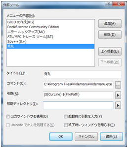
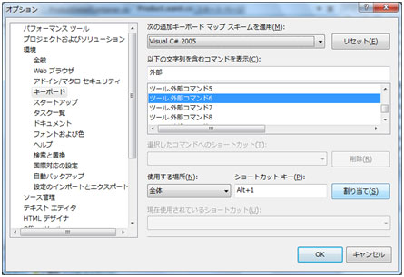

# エディタにこだわりがある人へ、「Visual Studio のエディタとの連携」
## Requires
- 
## License
- Apache License, Version 2.0
## Technologies
- 今週の How-To
## Topics
- Visual Studio 2008
- Visual Studio 2010
## Updated
- 02/14/2011
## Description

開発者の皆様の中には、テキストエディタにこだわりがある方もいると思います。使い慣れたエディタを用いて、C# や VB のコードの実装をしたいと思っていても、Visual Studio を使用する以上、現実的には難しいと感じているかもしれません。

しかしながら、実は Visaul Studio 側の設定をおこなうことで外部ツールとの連携が可能になるのです。下記に手順を紹介します。

[ツール] - [外部ツール] を実行して、任意のエディタを下記のように登録します。 
タイトル: 意 (&amp; の次の文字はアクセスキーになります) 
コマンド: エディタのフルパス (C\:xxxx\xxxx.exe など) 
引数: エディタの指定 (秀丸ならば /j$(CurLine) $(ItemPath)) 
初期ディレクトリ: 任意

図 1

引数の設定が多少煩雑のように思えますが、右側のボタンを押すことで、パスやカレント行などの指定が出来ますのである程度の簡易に設定ができるはずです。

この設定をおこなうと、[ツール] の中に設定が登録されます。後は、キーボードのショートカットを割り当てるなどすればより便利でしょう。

この方法は、[ツール] - [オプション] より [キーボード] を選択し、[ツール.外部コマンド xx] を選択します。(xx の数値は外部コマンドの数です) ここでショートカットキーに任意のキーを設定して [割り当てボタン] を押下します。

図 2

こうした環境に、更に ExpressionBlend などの外部ツールを含めても勿論問題ありません、実際に開発をおこなっている方のお話が以下にありますので、ご興味のある方はご確認ください。

<a href="http://www.microsoft.com/japan/powerpro/TF/interview/37_2.mspx" target="_blank">http://www.microsoft.com/japan/powerpro/TF/interview/37_2.mspx</a>

<table>
<tbody>
<tr>
<td></td>
<td>
<ul>
<li>もっと他のコンテンツを見る &gt;&gt; <a href="http://msdn.microsoft.com/ja-jp/ee708292" target="_blank">
今週の How-to 一覧へ</a> </li><li>もっと他のレシピを見る &gt;&gt; <a href="http://msdn.microsoft.com/ja-jp/samplecode.recipe">
Code Recipe へ</a> </li></ul>
</td>
</tr>
</tbody>
</table>

<a href="#top">ページのトップへ</a>

