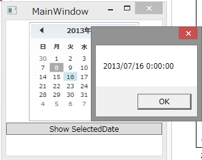

# カレンダーコントロールのサンプルプログラム
## Requires
- Visual Studio 2012
## License
- Apache License, Version 2.0
## Technologies
- WPF
## Topics
- WPF Basics
## Updated
- 07/08/2013
## Description

<h1>サンプルプログラムの概要</h1>

このサンプルプログラムはBlogの以下の記事の中で使用したサンプルコードになります。

<a class="entry-title-link x_bookmark" href="http://okazuki.hatenablog.com/entry/2013/07/08/233948">WPF4.5入門 その28 「Calendarコントロール」</a>

このサンプルプログラムは、以下の3つのプロジェクトが入っています。

<ol>
<li>CalendarSample01プロジェクト </li><li>CalendarSample02プロジェクト </li><li>CalendarSample03プロジェクト </li></ol>

各サンプルプログラムの動作を以下に説明します。

<h2>CalendarSample01プロジェクト</h2>

CalendarSample01プロジェクトは、単純にカレンダーを画面に置いた時のデフォルトの挙動を確認するためのものです。Windowに置いてあるButtonをクリックすることえ、CalendarクラスのSelectedDateプロパティを経由して選択した日付の表示を行っています。

<h2>CalendarSample02プロジェクト</h2>

CalendarSample02プロジェクトは、Calendarコントロールの日付選択の機能に幅を持たせるための各種プロパティを使用しています。

複数の日付の範囲選択を行うためのSelectionModeプロパティの設定や、指定した日付を選択できないようにするBlackoutDatesプロパティを使用しています。ボタンのクリックイベントでは、SelectedDatesプロパティから選択された日付を全て列挙し、改行区切りでフォーマットしてメッセージボックスに表示しています。

<h2>CalendarSample03プロジェクト</h2>

CalendarSample03プロジェクトは、Calendarコントロールで表示される日付の範囲を指定するためのプロパティを使用しています。

CalendarコントロールのDisplayDateStartプロパティでカレンダーの表示の最初の日付を指定しています。DisplayDateEndプロパティでカレンダーの表示の最終の日付を指定しています。こうすることで、ユーザーに選択の必要がない日付をあらかじめ排除することができます。

<h1>まとめ</h1>

このカレンダーコントロールは、直感的に日付を入力したり出力するための非常に基本的なコントロールです。このコントロールをただ表示するだけではなく、このサンプルプログラム内で使用している各種プロパティで一工夫することで、より便利な日付の入力や出力のための部品として利用できます。

&nbsp;

