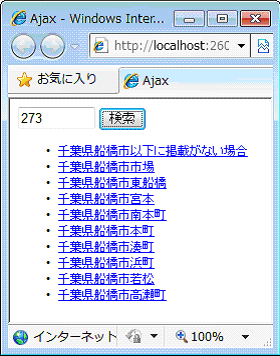

# サーバーから取得した JSON データによってページを更新する
## License
- Apache License, Version 2.0
## Technologies
- Visual Studio 2010
- jQuery 1.5
## Topics
- 逆引きサンプル コード
- jQuery
## Updated
- 03/30/2011
## Description

執筆者: <a href="http://msdn.microsoft.com/ja-jp/gg585574#yamada" target="_blank">
有限会社 WINGS プロジェクト 山田 祥寛</a>

動作確認環境: Visual Studio 2010、jQuery 1.5&nbsp;

JSON (JavaScript Object Notation) は、JavaScript のオブジェクト リテラルをもとにしたデータ形式です。JavaScript との親和性に優れることから、Ajax 通信でも多く利用されるフォーマットです。jQuery でも $.getJson メソッドを利用することで HTTP GET 通信で JSON 形式のデータを取得できます。

たとえば本稿で紹介するサンプルは、JSON 形式でデータを提供する郵便番号検索 Web サービス <a href="http://zip.ricollab.jp/" target="_blank">
ricollab</a>&nbsp;から、指定された郵便番号に対応する住所を取得する例です。

&nbsp;

なお、郵便番号検索 Web サービスは、「http://zip.ricollab.jp/search?q=<em>郵便番号</em>&amp;type=json」のような URL でアクセスすることで、以下のような JSON データを返すものとします (コメントは著者によるもの)。

{ 
&nbsp; &quot;query&quot;: &quot;273&quot;,&nbsp;// 検索条件 
&nbsp; &quot;totalResults&quot;: 120,&nbsp;// 結果件数 
&nbsp; &quot;itemsPerPage&quot;: 10,&nbsp;// ページ当たりの件数 
&nbsp; &quot;next&quot;: &quot;http://zip.ricollab.jp/search?page=2&amp;q=273&amp;type=json&quot;,&nbsp;// 次ページ URL 
&nbsp; &quot;result&quot;: [&nbsp;// 結果リスト 
&nbsp;&nbsp;&nbsp; { 
&nbsp;&nbsp;&nbsp;&nbsp;&nbsp; &quot;zipcode&quot;: &quot;2730000&quot;,&nbsp;// 郵便番号 
&nbsp;&nbsp;&nbsp;&nbsp;&nbsp; &quot;address&quot;: &quot;千葉県船橋市以下に掲載がない場合&quot;,&nbsp;// 住所 
&nbsp;&nbsp;&nbsp;&nbsp;&nbsp; &quot;link&quot;: &quot;http://zip.ricollab.jp/2730000&quot;&nbsp;// 詳細ページのリンク先 
&nbsp;&nbsp;&nbsp; }, 
&nbsp;&nbsp;&nbsp; { 
&nbsp;&nbsp;&nbsp;&nbsp;&nbsp; &quot;zipcode&quot;: &quot;2730001&quot;, 
&nbsp;&nbsp;&nbsp;&nbsp;&nbsp; &quot;address&quot;: &quot;千葉県船橋市市場&quot;, 
&nbsp;&nbsp;&nbsp;&nbsp;&nbsp; &quot;link&quot;: &quot;http://zip.ricollab.jp/2730001&quot; 
&nbsp;&nbsp;&nbsp; }, 
&nbsp;&nbsp;&nbsp; .... 
}

&nbsp;以下は、郵便番号検索 Web サービスにアクセスするためのコードです。

&lt;input type=&quot;text&quot; id=&quot;zip&quot; size=&quot;7&quot; /&gt; 
&lt;input type=&quot;button&quot; id=&quot;btn&quot; value=&quot;検索&quot; /&gt; 
&lt;ul id=&quot;list&quot;&gt;&lt;/ul&gt; 
&nbsp; 
&lt;script src=&quot;../Scripts/jquery-1.5.min.js&quot; type=&quot;text/javascript&quot;&gt;&lt;/script&gt; 
&lt;script type=&quot;text/javascript&quot;&gt; 
&nbsp; // [検索] ボタンをクリックしたら、郵便番号検索 Web サービス に非同期通信 
$('#btn').click(function () { 
&nbsp; $.getJSON( 
&nbsp; // 問い合わせのためのURL を指定 
&nbsp;&nbsp;&nbsp; 'http://zip.ricollab.jp/search?type=json&amp;<strong>callback=?</strong>', 
&nbsp;&nbsp;&nbsp; { q: $('#zip').val() },&nbsp;&nbsp;&nbsp; // パラメータ q (郵便番号) を追加 
&nbsp; // 取得した結果データをもとにリストを生成 (コールバック関数) 
&nbsp;&nbsp;&nbsp; function (data) { 
&nbsp;&nbsp;&nbsp;&nbsp; // &lt;ul id=&quot;list&quot;&gt; 配下を空に 
&nbsp;&nbsp;&nbsp;&nbsp;&nbsp; $('#list').empty(); 
&nbsp;&nbsp;&nbsp;&nbsp; // 取得したデータ data 配下の result プロパティ (配列) を順に処理 
&nbsp;&nbsp;&nbsp;&nbsp;&nbsp; $.each(data.result, 
&nbsp;&nbsp;&nbsp;&nbsp;&nbsp;&nbsp;&nbsp; function(index, value) {&nbsp;&nbsp;&nbsp; // 引数はインデックス番号、値 
&nbsp;&nbsp;&nbsp;&nbsp;&nbsp;&nbsp;&nbsp;&nbsp;&nbsp; $('#list').append( 
&nbsp;&nbsp;&nbsp;&nbsp; // &lt;ul id=&quot;list&quot;&gt; 配下に &lt;li&gt;&lt;/li&gt; をセット 
&nbsp;&nbsp;&nbsp;&nbsp;&nbsp;&nbsp;&nbsp;&nbsp;&nbsp;&nbsp;&nbsp; $('&lt;li&gt;&lt;/li&gt;').append( 
&nbsp;&nbsp;&nbsp;&nbsp; // &lt;li&gt;&lt;/li&gt; 配下に &lt;a&gt;&lt;/a&gt;をセット 
&nbsp;&nbsp;&nbsp;&nbsp;&nbsp;&nbsp;&nbsp;&nbsp;&nbsp;&nbsp;&nbsp;&nbsp;&nbsp; $('&lt;a&gt;&lt;/a&gt;'). 
&nbsp;&nbsp;&nbsp; // href 属性には link プロパティ、配下のテキストには address プロパティをセット 
&nbsp;&nbsp;&nbsp;&nbsp;&nbsp;&nbsp;&nbsp;&nbsp;&nbsp;&nbsp;&nbsp;&nbsp;&nbsp;&nbsp;&nbsp; attr('href', value.link). 
&nbsp;&nbsp;&nbsp;&nbsp;&nbsp;&nbsp;&nbsp;&nbsp;&nbsp;&nbsp;&nbsp;&nbsp;&nbsp;&nbsp;&nbsp; html(value.address) 
&nbsp;&nbsp;&nbsp;&nbsp;&nbsp;&nbsp;&nbsp;&nbsp;&nbsp;&nbsp;&nbsp; ) 
&nbsp;&nbsp;&nbsp;&nbsp;&nbsp;&nbsp;&nbsp;&nbsp;&nbsp; ); 
&nbsp;&nbsp;&nbsp;&nbsp;&nbsp;&nbsp;&nbsp; } 
&nbsp;&nbsp;&nbsp;&nbsp;&nbsp; ); 
&nbsp;&nbsp;&nbsp; } 
&nbsp; ); 
}); 
&lt;/script&gt;

外部サービスにアクセスする場合には、問い合わせ URL の末尾に「callback=?」を付与しなければならない点に注意してください (太字部分)。これによって、jQuery は内部的に JSONP という技術を使って、クロスドメインでの通信を行います (※)。

※) セキュリティ上の理由から JavaScript では既定でドメインを跨いだ通信は禁止されています。

Web サービスから得られた結果は、コールバック関数に JavaScript のオブジェクトとして渡されますので、あとは必要なデータを順に取り出して、&lt;ul&gt; リストとして組み立てます。

HTML リストの組み立てについては、別稿「<a href="http://code.msdn.microsoft.com/ja-jp/jQuery-howto-dde0bf55">before、after メソッドなどを使用して特定の要素にコンテンツの追加/更新/削除を行う</a>」「<a href="http://code.msdn.microsoft.com/ja-jp/jQuery-attrremoveAttr-7c3dfbe3">[jQuery] attr、removeAttr メソッドを使用して、要素に対する属性値の取得や設定/解除を行う</a>」「<a href="http://code.msdn.microsoft.com/ja-jp/jQuery-howto-ac2fe74d">text
 メソッドと html メソッドを使って要素配下のテキストを取得/設定する</a>」なども合わせて参照してください。

<table>
<tbody>
<tr>
<td></td>
<td></td>
<td>
<ul>
<li>もっと他のコンテンツを見る &gt;&gt; <a href="http://msdn.microsoft.com/ja-jp/ff363212" target="_blank">
逆引きサンプル コード一覧へ</a> </li><li>もっと他のレシピを見る &gt;&gt; <a href="http://code.msdn.microsoft.com/ja-jp/">Code Recipe へ</a>
</li><li>もっと ASP.Net の情報を見る &gt;&gt; <a href="http://msdn.microsoft.com/ja-jp/asp.net" target="_blank">
ASP.Net デベロッパーセンターへ</a> </li></ul>
</td>
</tr>
</tbody>
</table>

<a href="#top">ページのトップへ</a>

