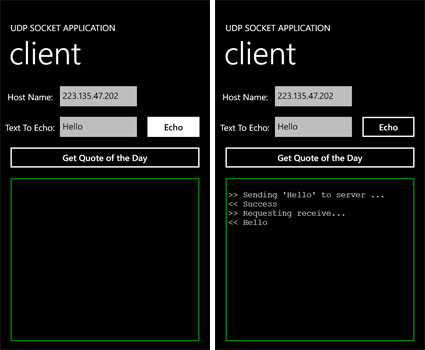
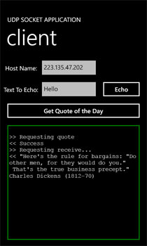

# ソケットで通信を行うには
## License
- Apache License, Version 2.0
## Technologies
- Windows Phone
## Topics
- Windows Phone アプリケーション
- "How to" ラーニング コース
## Updated
- 02/15/2012
## Description

サンプル | <a href="http://download.microsoft.com/download/A/1/0/A10EBC63-2398-483C-9F65-5DDA7122B45C/SocketFeatures.zip">
Zip、118 KB</a>

このサンプルは、手順に沿って、コードをコピーし、ソース コードへ貼り付けることでアプリケーションを作成できます。完成例は、サンプル ファイルの Finish フォルダーに&#26684;納されていますので参考にしてください。

ここでは以下の手順で説明します。

<ul>
<li>ソケット クライアントを作成する </li><li>データを送信する </li><li>データを受信する </li><li>ソケット クライアントを使用する </li></ul>
<h2 style="font-size:120%; margin:20px 0px; border-left:7px solid #666666; padding-left:12px">
ソケット クライアントを作成する</h2>
<ol>
<li>このコンテンツのサポート ファイルの Start フォルダーから &quot;UDPClient&quot; プロジェクトを開きます。 </li><li>クライアントを動作させるため、コンピューターで簡易 TCP/IP サービスを有効にする必要があります。以下の手順を実行します。
<ol>
<li style="list-style:lower-alpha">コントロール パネルで [プログラムと機能] を開きます。 </li><li style="list-style:lower-alpha">[Windows の機能の有効化または無効化] をクリックします。 </li><li style="list-style:lower-alpha">[Windows の機能] ダイアログで [簡易 TCP/IP サービス] チェック ボックスをオンにして機能を有効にし、[OK] をクリックします。
</li><li style="list-style:lower-alpha">この手順を実行するには、ローカル コンピューターの Administrators グループまたは Network Configuration Operators グループのメンバーとしてログオンする必要があります。
</li><li style="list-style:lower-alpha">コンピューターの [サービス] リストで、&quot;Simple TCP/IP Services&quot; サービスが開始されていることを確認します。開始されていない場合はサービスを手動で開始します。サービスの開始方法の詳細については、「<a href="http://technet.microsoft.com/ja-jp/library/cc755249.aspx" target="_blank">サービスの開始方法を構成する</a>」を参照してください。
</li></ol>
</li><li>メニューから [プロジェクト]　&rarr; [クラスの追加] を選択し、SocketClient という名前を付けます。
</li><li>SocketClient.cs で、<a class="libraryLink" href="http://msdn.microsoft.com/ja-JP/library/System.Net.Sockets.aspx" target="_blank" title="Auto generated link to System.Net.Sockets">System.Net.Sockets</a>、<a class="libraryLink" href="http://msdn.microsoft.com/ja-JP/library/System.Threading.aspx" target="_blank" title="Auto generated link to System.Threading">System.Threading</a>、<a class="libraryLink" href="http://msdn.microsoft.com/ja-JP/library/System.Text.aspx" target="_blank" title="Auto generated link to System.Text">System.Text</a> の名前空間を追加し、SocketClient クラスに以下のメンバー変数を定義します。

C#

スクリプトの編集|Remove

csharp

<pre id="codePreview" class="csharp">using&nbsp;<a class="libraryLink" href="http://msdn.microsoft.com/ja-JP/library/System.Net.Sockets.aspx" target="_blank" title="Auto generated link to System.Net.Sockets">System.Net.Sockets</a>;&nbsp;
using&nbsp;<a class="libraryLink" href="http://msdn.microsoft.com/ja-JP/library/System.Threading.aspx" target="_blank" title="Auto generated link to System.Threading">System.Threading</a>;&nbsp;
using&nbsp;<a class="libraryLink" href="http://msdn.microsoft.com/ja-JP/library/System.Text.aspx" target="_blank" title="Auto generated link to System.Text">System.Text</a>;&nbsp;
&nbsp;
//&nbsp;このクラスの有効期間中の各呼び出しに使用される、キャッシュされた&nbsp;Socket&nbsp;オブジェクト。&nbsp;
Socket&nbsp;socket&nbsp;=&nbsp;null;&nbsp;
&nbsp;
//&nbsp;非同期処理が完了したことを通知するために信号を送るオブジェクト。&nbsp;
static&nbsp;ManualResetEvent&nbsp;clientDone&nbsp;=&nbsp;new&nbsp;ManualResetEvent(false);&nbsp;
&nbsp;
//&nbsp;各非同期呼び出しのタイムアウトをミリ秒で定義する。このタイムアウト期間内に&nbsp;&nbsp;
//&nbsp;応答を受信しなかった場合、呼び出しが中止される。&nbsp;
const&nbsp;int&nbsp;TIMEOUT_MILLISECONDS&nbsp;=&nbsp;5000;&nbsp;
&nbsp;
//&nbsp;非同期ソケット&nbsp;メソッドで使用するデータ&nbsp;バッファーの最大サイズ。&nbsp;
const&nbsp;int&nbsp;MAX_BUFFER_SIZE&nbsp;=&nbsp;2048;</pre>

&nbsp;

</li><li>以下のパラメーターを使って socket 変数を初期化するコンストラクターを追加します。

C#

スクリプトの編集|Remove

csharp

<pre id="codePreview" class="csharp">public&nbsp;SocketClient()&nbsp;
{&nbsp;
&nbsp;&nbsp;&nbsp;&nbsp;//&nbsp;AddressFamily.InterNetwork&nbsp;-&nbsp;ソケットは&nbsp;IP&nbsp;version&nbsp;4&nbsp;アドレス指定方式を&nbsp;
&nbsp;&nbsp;&nbsp;&nbsp;//&nbsp;使用してアドレスを解決する。&nbsp;
&nbsp;&nbsp;&nbsp;&nbsp;//&nbsp;SocketType.Dgram&nbsp;-&nbsp;データグラム&nbsp;(メッセージ)&nbsp;パケットをサポートするソケット&nbsp;
&nbsp;&nbsp;&nbsp;&nbsp;//&nbsp;PrototcolType.Udp&nbsp;-&nbsp;ユーザー&nbsp;データグラム&nbsp;プロトコル&nbsp;(UDP)&nbsp;
&nbsp;&nbsp;&nbsp;&nbsp;socket&nbsp;=&nbsp;new&nbsp;Socket(AddressFamily.InterNetwork,&nbsp;SocketType.Dgram,&nbsp;ProtocolType.Udp);&nbsp;
}</pre>

&nbsp;

</li><li>socket を閉じる Close メソッドを追加します。

C#

スクリプトの編集|Remove

csharp

<pre id="codePreview" class="csharp">public&nbsp;void&nbsp;Close()&nbsp;
{&nbsp;
&nbsp;&nbsp;&nbsp;&nbsp;socket.Close();&nbsp;
}</pre>

&nbsp;

</li></ol>
<h2 style="font-size:120%; margin:20px 0px; border-left:7px solid #666666; padding-left:12px">
データを送信する</h2>
<ol>
<li>SocketClient.cs で、Send メソッドを追加します。文字列を返すようにし、パラメーターとして serverName、portNumber、data を受け入れます。

C#

スクリプトの編集|Remove

csharp

<pre id="codePreview" class="csharp">public&nbsp;string&nbsp;Send(string&nbsp;serverName,&nbsp;int&nbsp;portNumber,&nbsp;string&nbsp;data)&nbsp;{&nbsp;}</pre>

&nbsp;

</li><li>Send メソッドで、string 型の変数 response を定義し、既定値として &quot;Operation Timeout&quot; を設定します。

C#

スクリプトの編集|Remove

csharp

<pre id="codePreview" class="csharp">string&nbsp;response&nbsp;=&nbsp;&quot;Operation&nbsp;Timeout&quot;;</pre>

&nbsp;

</li><li>ソケットが null でないかどうか確認し、以下のようにデータを送信します。

C#

スクリプトの編集|Remove

csharp

<pre id="codePreview" class="csharp">if&nbsp;(socket&nbsp;!=&nbsp;null)&nbsp;
{&nbsp;
&nbsp;&nbsp;&nbsp;&nbsp;//&nbsp;SocketAsyncEventArgs&nbsp;コンテキスト&nbsp;オブジェクトを作成する。&nbsp;
&nbsp;&nbsp;&nbsp;&nbsp;&nbsp;&nbsp;&nbsp;SocketAsyncEventArgs&nbsp;socketEventArg&nbsp;=&nbsp;new&nbsp;SocketAsyncEventArgs();&nbsp;
&nbsp;
//&nbsp;コンテキスト&nbsp;オブジェクトのプロパティを設定する。&nbsp;
&nbsp;&nbsp;&nbsp;&nbsp;&nbsp;&nbsp;&nbsp;socketEventArg.RemoteEndPoint&nbsp;=&nbsp;new&nbsp;DnsEndPoint(serverName,&nbsp;portNumber);&nbsp;
&nbsp;
//&nbsp;Completed&nbsp;イベントのインライン&nbsp;イベント&nbsp;ハンドラー。&nbsp;
//&nbsp;注:&nbsp;メソッドを自己完結させるため、このイベント&nbsp;ハンドラーはインラインで実装される。&nbsp;
&nbsp;&nbsp;&nbsp;&nbsp;&nbsp;&nbsp;&nbsp;socketEventArg.Completed&nbsp;&#43;=&nbsp;new&nbsp;EventHandler&lt;SocketAsyncEventArgs&gt;(delegate(object&nbsp;s,&nbsp;SocketAsyncEventArgs&nbsp;e)&nbsp;
&nbsp;&nbsp;&nbsp;&nbsp;&nbsp;&nbsp;&nbsp;{&nbsp;
&nbsp;&nbsp;&nbsp;&nbsp;&nbsp;&nbsp;&nbsp;&nbsp;&nbsp;&nbsp;&nbsp;response&nbsp;=&nbsp;e.SocketError.ToString();&nbsp;
&nbsp;
//&nbsp;UI&nbsp;スレッドのブロックを解除する。&nbsp;
&nbsp;&nbsp;&nbsp;&nbsp;&nbsp;&nbsp;&nbsp;&nbsp;&nbsp;&nbsp;&nbsp;&nbsp;&nbsp;&nbsp;clientDone.Set();&nbsp;
&nbsp;&nbsp;&nbsp;&nbsp;});&nbsp;
&nbsp;
&nbsp;&nbsp;&nbsp;&nbsp;//&nbsp;送信するデータをバッファーに追加する。&nbsp;
&nbsp;&nbsp;&nbsp;&nbsp;&nbsp;&nbsp;&nbsp;byte[]&nbsp;payload&nbsp;=&nbsp;Encoding.UTF8.GetBytes(data);&nbsp;
&nbsp;&nbsp;&nbsp;&nbsp;&nbsp;&nbsp;&nbsp;socketEventArg.SetBuffer(payload,&nbsp;0,&nbsp;payload.Length);&nbsp;
&nbsp;
//&nbsp;イベントの状態をシグナルなしに設定し、スレッドのブロックを発生させる。&nbsp;
&nbsp;&nbsp;&nbsp;&nbsp;&nbsp;&nbsp;&nbsp;clientDone.Reset();&nbsp;
&nbsp;
//&nbsp;ソケットを使用して非同期の送信要求を行う。&nbsp;
&nbsp;&nbsp;&nbsp;&nbsp;&nbsp;&nbsp;&nbsp;socket.SendToAsync(socketEventArg);&nbsp;
&nbsp;
//&nbsp;TIMEOUT_MILLISECONDS&nbsp;の最大秒数まで&nbsp;UI&nbsp;スレッドをブロックする。&nbsp;
//&nbsp;この時間内に応答がなければ、処理を先に進める。&nbsp;
&nbsp;&nbsp;&nbsp;&nbsp;&nbsp;&nbsp;&nbsp;clientDone.WaitOne(TIMEOUT_MILLISECONDS);&nbsp;
}&nbsp;
else&nbsp;
{&nbsp;
&nbsp;&nbsp;&nbsp;&nbsp;response&nbsp;=&nbsp;&quot;Socket&nbsp;is&nbsp;not&nbsp;initialized&quot;;&nbsp;
}</pre>

&nbsp;

</li><li>応答を返します。

C#

スクリプトの編集|Remove

csharp

<pre id="codePreview" class="csharp">return&nbsp;response;</pre>

&nbsp;

</li></ol>
<h2 style="font-size:120%; margin:20px 0px; border-left:7px solid #666666; padding-left:12px">
データを受信する</h2>
<ol>
<li>SocketClient.cs で、Receive メソッドを追加します。文字列を返すようにし、パラメーターとして portNumber を受け入れます。

C#

スクリプトの編集|Remove

csharp

<pre id="codePreview" class="csharp">public&nbsp;string&nbsp;Receive(int&nbsp;portNumber)&nbsp;{&nbsp;&nbsp;}</pre>

&nbsp;

</li><li>Receive メソッドで、string 型の変数 response を定義し、既定値として &quot;Operation Timeout&quot; を設定します。

C#

スクリプトの編集|Remove

csharp

<pre id="codePreview" class="js">string&nbsp;response&nbsp;=&nbsp;&quot;Operation&nbsp;Timeout&quot;;</pre>

&nbsp;

</li><li>ソケットが null でないかどうか確認し、以下のようにデータを受信します。

C#

スクリプトの編集|Remove

csharp

<pre id="codePreview" class="csharp">if&nbsp;(socket&nbsp;!=&nbsp;null)&nbsp;
{&nbsp;
&nbsp;&nbsp;&nbsp;&nbsp;//&nbsp;SocketAsyncEventArgs&nbsp;コンテキスト&nbsp;オブジェクトを作成する。&nbsp;
&nbsp;&nbsp;&nbsp;&nbsp;&nbsp;&nbsp;&nbsp;SocketAsyncEventArgs&nbsp;socketEventArg&nbsp;=&nbsp;new&nbsp;SocketAsyncEventArgs();&nbsp;
&nbsp;&nbsp;&nbsp;&nbsp;&nbsp;&nbsp;&nbsp;socketEventArg.RemoteEndPoint&nbsp;=&nbsp;new&nbsp;IPEndPoint(IPAddress.Any,&nbsp;portNumber);&nbsp;
&nbsp;
//&nbsp;データを受信するためのバッファーを設定する。&nbsp;
&nbsp;&nbsp;&nbsp;&nbsp;&nbsp;&nbsp;&nbsp;socketEventArg.SetBuffer(new&nbsp;Byte[MAX_BUFFER_SIZE],&nbsp;0,&nbsp;MAX_BUFFER_SIZE);&nbsp;
&nbsp;
//&nbsp;Completed&nbsp;イベントのインライン&nbsp;イベント&nbsp;ハンドラー。&nbsp;
//&nbsp;注:&nbsp;メソッドを自己完結させるため、このイベント&nbsp;ハンドラーはインラインで実装される。&nbsp;
&nbsp;&nbsp;&nbsp;&nbsp;&nbsp;&nbsp;&nbsp;socketEventArg.Completed&nbsp;&#43;=&nbsp;new&nbsp;EventHandler&lt;SocketAsyncEventArgs&gt;(delegate(object&nbsp;s,&nbsp;SocketAsyncEventArgs&nbsp;e)&nbsp;
&nbsp;&nbsp;&nbsp;&nbsp;&nbsp;&nbsp;&nbsp;{&nbsp;
&nbsp;&nbsp;&nbsp;&nbsp;&nbsp;&nbsp;&nbsp;&nbsp;&nbsp;&nbsp;&nbsp;if&nbsp;(e.SocketError&nbsp;==&nbsp;SocketError.Success)&nbsp;
&nbsp;&nbsp;&nbsp;&nbsp;&nbsp;&nbsp;&nbsp;&nbsp;{&nbsp;
&nbsp;&nbsp;&nbsp;&nbsp;//&nbsp;バッファーからデータを取得する。&nbsp;
&nbsp;&nbsp;&nbsp;&nbsp;&nbsp;&nbsp;&nbsp;&nbsp;&nbsp;&nbsp;&nbsp;&nbsp;&nbsp;&nbsp;&nbsp;&nbsp;&nbsp;&nbsp;&nbsp;&nbsp;&nbsp;response&nbsp;=&nbsp;Encoding.UTF8.GetString(e.Buffer,&nbsp;e.Offset,&nbsp;e.BytesTransferred);&nbsp;
&nbsp;&nbsp;&nbsp;&nbsp;&nbsp;&nbsp;&nbsp;&nbsp;&nbsp;&nbsp;&nbsp;&nbsp;response&nbsp;=&nbsp;response.Trim('\0');&nbsp;
&nbsp;&nbsp;&nbsp;&nbsp;&nbsp;&nbsp;&nbsp;&nbsp;}&nbsp;
&nbsp;&nbsp;&nbsp;&nbsp;&nbsp;&nbsp;&nbsp;&nbsp;&nbsp;&nbsp;&nbsp;&nbsp;&nbsp;&nbsp;else&nbsp;
&nbsp;&nbsp;&nbsp;&nbsp;&nbsp;&nbsp;&nbsp;&nbsp;&nbsp;&nbsp;&nbsp;&nbsp;&nbsp;&nbsp;{&nbsp;
&nbsp;&nbsp;&nbsp;&nbsp;&nbsp;&nbsp;&nbsp;&nbsp;&nbsp;&nbsp;&nbsp;&nbsp;&nbsp;&nbsp;&nbsp;&nbsp;&nbsp;&nbsp;response&nbsp;=&nbsp;e.SocketError.ToString();&nbsp;
&nbsp;&nbsp;&nbsp;&nbsp;&nbsp;&nbsp;&nbsp;&nbsp;}&nbsp;
&nbsp;&nbsp;&nbsp;&nbsp;&nbsp;&nbsp;&nbsp;&nbsp;clientDone.Set();&nbsp;
&nbsp;&nbsp;&nbsp;&nbsp;});&nbsp;
&nbsp;
//&nbsp;イベントの状態をシグナルなしに設定し、スレッドのブロックを発生させる。&nbsp;
&nbsp;&nbsp;&nbsp;&nbsp;&nbsp;&nbsp;&nbsp;clientDone.Reset();&nbsp;
&nbsp;
&nbsp;&nbsp;&nbsp;&nbsp;//&nbsp;ソケットを使用して非同期の受信要求を行う。&nbsp;
&nbsp;&nbsp;&nbsp;&nbsp;&nbsp;&nbsp;&nbsp;socket.ReceiveFromAsync(socketEventArg);&nbsp;
&nbsp;
//&nbsp;TIMEOUT_MILLISECONDS&nbsp;の最大秒数まで&nbsp;UI&nbsp;スレッドをブロックする。&nbsp;
//&nbsp;この時間内に応答がなければ、処理を先に進める。&nbsp;
&nbsp;&nbsp;&nbsp;&nbsp;&nbsp;&nbsp;&nbsp;clientDone.WaitOne(TIMEOUT_MILLISECONDS);&nbsp;
&nbsp;&nbsp;&nbsp;&nbsp;&nbsp;&nbsp;&nbsp;}&nbsp;
else&nbsp;
{&nbsp;
&nbsp;&nbsp;&nbsp;&nbsp;response&nbsp;=&nbsp;&quot;Socket&nbsp;is&nbsp;not&nbsp;initialized&quot;;&nbsp;
}</pre>

&nbsp;

</li><li>応答を返します。

C#

スクリプトの編集|Remove

csharp

<pre id="codePreview" class="csharp">return&nbsp;response;</pre>

&nbsp;

</li></ol>
<h2 style="font-size:120%; margin:20px 0px; border-left:7px solid #666666; padding-left:12px">
ソケット クライアントを使用する</h2>
<ol>
<li>MainPage.xaml.cs の、btnEcho の Click イベント ハンドラーで、ClearLog の後に、<em>client</em> という名前の新しい SocketClient 変数を作成します。

C#

スクリプトの編集|Remove

csharp

<pre id="codePreview" class="csharp">SocketClient&nbsp;client&nbsp;=&nbsp;new&nbsp;SocketClient();</pre>

&nbsp;

</li><li>以下のように、エコーされるメッセージを送信します。

C#

スクリプトの編集|Remove

csharp

<pre id="codePreview" class="csharp">Log(String.Format(&quot;&gt;&gt;&nbsp;Sending&nbsp;'{0}'&nbsp;to&nbsp;server&nbsp;...&quot;,&nbsp;txtInput.Text));&nbsp;
string&nbsp;result&nbsp;=&nbsp;client.Send(txtRemoteHost.Text,&nbsp;ECHO_PORT,&nbsp;txtInput.Text);&nbsp;
Log(&quot;&lt;&lt;&nbsp;&quot;&nbsp;&#43;&nbsp;result);</pre>

&nbsp;

</li><li>以下のように、応答を受信してクライアントを閉じます。

C#

スクリプトの編集|Remove

csharp

<pre id="codePreview" class="csharp">Log(&quot;&gt;&gt;&nbsp;Requesting&nbsp;receive...&quot;);&nbsp;
result&nbsp;=&nbsp;client.Receive(ECHO_PORT);&nbsp;
Log(&quot;&lt;&lt;&nbsp;&quot;&nbsp;&#43;&nbsp;result);&nbsp;
&nbsp;
client.Close();</pre>

&nbsp;

</li><li>MainPage.xaml.cs の、btnGetQuote の Click イベント ハンドラーで、client という名前の新しい SocketClient 変数を ClearLog の後に作成します。

C#

スクリプトの編集|Remove

csharp

<pre id="codePreview" class="csharp">SocketClient&nbsp;client&nbsp;=&nbsp;new&nbsp;SocketClient();</pre>

&nbsp;

</li><li>以下のように、今日の名言 (quote of the day) の要求を送信します。

C#

スクリプトの編集|Remove

csharp

<pre id="codePreview" class="csharp">//&nbsp;UDP&nbsp;では、着信する&nbsp;UDP&nbsp;メッセージごとにメッセージが送信されるため、&quot;ダミー&quot;&nbsp;メッセージを送信して&nbsp;&nbsp;
//&nbsp;応答を求める。メッセージは空にできないので、以下のメッセージは空白文字&nbsp;1&nbsp;つで構成されている。&nbsp;
Log(&quot;&gt;&gt;&nbsp;Requesting&nbsp;quote&quot;);&nbsp;
string&nbsp;result&nbsp;=&nbsp;client.Send(txtRemoteHost.Text,&nbsp;QOTD_PORT,&nbsp;&quot;&nbsp;&quot;);&nbsp;
Log(&quot;&lt;&lt;&nbsp;&quot;&nbsp;&#43;&nbsp;result);</pre>

&nbsp;

</li><li>以下のように、応答を受信してクライアントを閉じます。

C#

スクリプトの編集|Remove

csharp

<pre id="codePreview" class="csharp">//&nbsp;&quot;今日の名言&quot;&nbsp;(QOTD)&nbsp;を返すサーバーからの応答を受信する。&nbsp;
Log(&quot;&gt;&gt;&nbsp;Requesting&nbsp;receive...&quot;);&nbsp;
result&nbsp;=&nbsp;client.Receive(QOTD_PORT);&nbsp;
Log(&quot;&lt;&lt;&nbsp;&quot;&nbsp;&#43;&nbsp;result);&nbsp;
&nbsp;
client.Close();</pre>

&nbsp;

</li><li>プロジェクトを実行します。 </li><li>[Host Name] に利用しているコンピューター名または現在割り当てられている IP アドレスを入力します。

</li><li>エコーするテキストを追加して [Echo] ボタンをタップします。応答が出力テキスト ボックスに返されることを確認します。

</li><li>[Get Quote of the Day] ボタンをタップします。応答が出力テキスト ボックスに返されることを確認します。

</li></ol>

インターネットおよびその他のサービスとのほぼリアルタイムな通信を可能にする、新しいソケット機能を紹介しました。

<h2 style="font-size:120%; margin:20px 0px; border-left:7px solid #666666; padding-left:12px">
関連ドキュメント</h2>
<ul>
<li><a href="http://msdn.microsoft.com/ja-jp/library/system.net.sockets.socket(v=vs.95)" target="_blank">Socket クラス</a>
</li></ul>
<h2 style="font-size:120%; margin:20px 0px; border-left:7px solid #666666; padding-left:12px">
参考ビデオ</h2>
<ul>
<li><a href="http://msdn.microsoft.com/en-us/hh329472" target="_blank">How Do I: Communicate with Sockets in Windows Phone &lsquo;Mango&rsquo;? (英語)</a>
</li></ul>

<table>
<tbody>
<tr>
<td></td>
<td></td>
<td>
<ul>
<li>もっと他のコンテンツを見る &gt;&gt; <a href="http://msdn.microsoft.com/ja-jp/windowsphone/hh744643" target="_blank">
Windows Phone アプリケーション開発 &quot;How to&quot; ラーニング コースへ</a> </li><li>もっと&nbsp;Windows Phone の情報を見る &gt;&gt; <a href="http://msdn.microsoft.com/ja-jp/windowsphone" target="_blank">
Windows Phone デベロッパー センターへ</a> </li></ul>
</td>
</tr>
</tbody>
</table>

<a href="#top">ページのトップへ</a>

