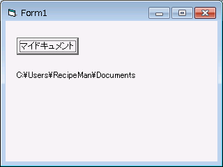

# マイドキュメントのパスを取得する (VB6.0)
## License
- Apache License, Version 2.0
## Technologies
- Windows 7
- Visual Basic 6.0
## Topics
- 逆引きサンプル コード
- Windows プログラミング
- Windows 7 へのアプリ移行
## Updated
- 02/14/2011
## Description

執筆者: <a href="http://msdn.microsoft.com/ja-jp/gg585574#mizobata" target="_blank">
株式会社クリエ・イルミネート 溝端 二三雄</a>

マイドキュメントのフォルダーへのパスは Windows のバージョンによって異なります。また、Active Directory のメンバー コンピュータの場合、ネットワーク共有になる場合もあります (移動ユーザー プロファイルを使用時)。このため、マイドキュメントのフォルダーにアクセスする際にパスをハードコード

するのは推奨されません。実行環境のマイドキュメントのフォルダーへのパスを取得する専用の API を使用するべきです。

<h2> 
今回紹介するコード</h2>

Visual Basic

スクリプトの編集

vb

<pre class="js">Option&nbsp;Explicit&nbsp;
Private&nbsp;Const&nbsp;S_OK&nbsp;=&nbsp;&amp;H0&nbsp;&nbsp;&nbsp;&nbsp;&nbsp;&nbsp;&nbsp;&nbsp;&nbsp;&nbsp;&nbsp;&nbsp;&nbsp;&nbsp;&nbsp;&nbsp;'&nbsp;Success&nbsp;
Private&nbsp;Const&nbsp;S_FALSE&nbsp;=&nbsp;&amp;H1&nbsp;&nbsp;&nbsp;&nbsp;&nbsp;&nbsp;&nbsp;&nbsp;&nbsp;&nbsp;&nbsp;&nbsp;&nbsp;'&nbsp;The&nbsp;Folder&nbsp;is&nbsp;valid,&nbsp;but&nbsp;does&nbsp;not&nbsp;exist&nbsp;
Private&nbsp;Const&nbsp;E_INVALIDARG&nbsp;=&nbsp;&amp;H80070057&nbsp;'&nbsp;Invalid&nbsp;CSIDL&nbsp;Value&nbsp;
Private&nbsp;Const&nbsp;CSIDL_PERSONAL&nbsp;=&nbsp;&amp;H5&nbsp;
Private&nbsp;Declare&nbsp;Function&nbsp;SHGetFolderPath&nbsp;Lib&nbsp;&quot;shfolder&quot;&nbsp;_&nbsp;
&nbsp;&nbsp;&nbsp;&nbsp;Alias&nbsp;&quot;SHGetFolderPathA&quot;&nbsp;_&nbsp;
&nbsp;&nbsp;&nbsp;&nbsp;(ByVal&nbsp;hwndOwner&nbsp;As&nbsp;Long,&nbsp;ByVal&nbsp;nFolder&nbsp;As&nbsp;Long,&nbsp;_&nbsp;
&nbsp;&nbsp;&nbsp;&nbsp;ByVal&nbsp;hToken&nbsp;As&nbsp;Long,&nbsp;ByVal&nbsp;dwFlags&nbsp;As&nbsp;Long,&nbsp;_&nbsp;
&nbsp;&nbsp;&nbsp;&nbsp;ByVal&nbsp;pszPath&nbsp;As&nbsp;String)&nbsp;As&nbsp;Long&nbsp;
&nbsp;
Private&nbsp;Sub&nbsp;MyDocumentButton_Click()&nbsp;
&nbsp;&nbsp;&nbsp;&nbsp;Dim&nbsp;sPath&nbsp;As&nbsp;StringDim&nbsp;RetVal&nbsp;As&nbsp;LongsPath&nbsp;=&nbsp;String(260,&nbsp;0)&nbsp;
&nbsp;&nbsp;&nbsp;&nbsp;RetVal&nbsp;=&nbsp;SHGetFolderPath(0,&nbsp;CSIDL_PERSONAL,&nbsp;0,&nbsp;0,&nbsp;sPath)&nbsp;
&nbsp;&nbsp;&nbsp;&nbsp;Select&nbsp;Case&nbsp;RetVal&nbsp;
&nbsp;&nbsp;&nbsp;&nbsp;&nbsp;&nbsp;&nbsp;Case&nbsp;S_OK&nbsp;
&nbsp;&nbsp;&nbsp;&nbsp;&nbsp;&nbsp;&nbsp;&nbsp;&nbsp;&nbsp;&nbsp;&nbsp;sPath&nbsp;=&nbsp;Left(sPath,&nbsp;InStr(1,&nbsp;sPath,&nbsp;Chr(0))&nbsp;-&nbsp;1)&nbsp;&nbsp;
&nbsp;&nbsp;&nbsp;&nbsp;&nbsp;&nbsp;&nbsp;&nbsp;&nbsp;&nbsp;&nbsp;&nbsp;MyDocumentLabel.Caption&nbsp;=&nbsp;sPath&nbsp;
&nbsp;&nbsp;&nbsp;&nbsp;&nbsp;&nbsp;&nbsp;Case&nbsp;S_FALSE&nbsp;
&nbsp;&nbsp;&nbsp;&nbsp;&nbsp;&nbsp;&nbsp;&nbsp;&nbsp;&nbsp;&nbsp;&nbsp;MyDocumentLabel.Caption&nbsp;=&nbsp;&quot;フォルダが存在しません。&quot;&nbsp;
&nbsp;&nbsp;&nbsp;&nbsp;&nbsp;&nbsp;&nbsp;Case&nbsp;E_INVALIDARG&nbsp;
&nbsp;&nbsp;&nbsp;&nbsp;&nbsp;&nbsp;&nbsp;&nbsp;&nbsp;&nbsp;&nbsp;&nbsp;MyDocumentLabel.Caption&nbsp;=&nbsp;&quot;不正なIDが指定されました。&quot;&nbsp;
&nbsp;&nbsp;&nbsp;&nbsp;End&nbsp;Select&nbsp;
End&nbsp;Sub&nbsp;
&nbsp;
</pre>

&nbsp;

<pre>  </pre>
<h2>Windows API を呼び出すための準備</h2>

次の 1 行 (Declare 構文) で Windows API を使用するための宣言を行っています。具体的には shfolder.dll 内にある SHGetFolderPathA 関数を使用 (オプションである Alias を指定しているので、VB6.0 では GetVersionEx と言う関数名で使用) するための宣言となります。 
Private Declare Function SHGetFolderPath Lib &quot;shfolder&quot; _

&nbsp;

Visual Basic

スクリプトの編集

vb

<pre class="js">&nbsp;&nbsp;&nbsp;&nbsp;Alias&nbsp;&quot;SHGetFolderPathA&quot;&nbsp;_&nbsp;&nbsp;&nbsp;&nbsp;(ByVal&nbsp;hwndOwner&nbsp;As&nbsp;Long,&nbsp;ByVal&nbsp;nFolder&nbsp;As&nbsp;Long,&nbsp;_&nbsp;
&nbsp;
&nbsp;&nbsp;&nbsp;&nbsp;ByVal&nbsp;hToken&nbsp;As&nbsp;Long,&nbsp;ByVal&nbsp;dwFlags&nbsp;As&nbsp;Long,&nbsp;_&nbsp;&nbsp;&nbsp;&nbsp;ByVal&nbsp;pszPath&nbsp;As&nbsp;String)&nbsp;As&nbsp;Long&nbsp;
&nbsp;
</pre>

&nbsp;

&nbsp;

&nbsp;

<h2>SHGetFolderPath 関数の呼び出し</h2>

マイドキュメントのフォルダーのパスを取得するために使用する SHGetFolderPath 関数には 5 個の引数があります。pszPath にはこの関数によって取得されたパスが返ってきます。それ以外の引数は以下の値を設定します。

<ul>
<li>hwndOwner 
予約済みです。0 を指定します。 </li><li>nFolder 
どのフォルダーのパスを取得するかを 16 進で指定します。マイドキュメントの場合 5 を指定します。今回のコードでは CSIDL_PERSONAL として前半で定義しています。
</li><li>hToken 
特定のユーザー権限で関数を実行する場合、そのユーザーのアクセストークンを指定します。実行者の権限の場合、0 を指定します。 </li><li>dwFlags 
0:この値を使用します。現在のパスが取得されます。 
1:既定のパスが取得されます。 </li></ul>
<h2>サンプルコードの実行</h2>

正しくフォルダーへのパスが取得できた場合、ラベルに表示するようになっているので、実行すると以下のような結果となります。

<h2>参考</h2>

nFolder で指定する 16 進の値で代表的なものを以下に記載します。各定数が何を示しているかに関しては、<a href="http://msdn.microsoft.com/en-us/library/bb762494(v=VS.85).aspx" target="_blank">CSIDL (英語)
</a>&nbsp;をご参照ください。

<ul>
<li>CSIDL_DESKTOP $0000 </li><li>CSIDL_PROGRAMS $0002 </li><li>CSIDL_CONTROLS $0003&nbsp; </li><li>CSIDL_PRINTERS $0004&nbsp; </li><li>CSIDL_PERSONAL $0005 </li><li>CSIDL_STARTUP $0007&nbsp; </li><li>CSIDL_MYMUSIC $000D </li><li>CSIDL_APPDATA $001A&nbsp; </li><li>CSIDL_WINDOWS $0024 </li><li>CSIDL_SYSTEM $0025 </li><li>CSIDL_PROGRAM_FILES $0026 </li><li>CSIDL_MYPICTURES $0027&nbsp; </li><li>CSIDL_PROGRAM_FILES_COMMON $002B </li></ul>
<h2> 
関連リンク</h2>
<ul>
<li><a href="http://support.microsoft.com/kb/252652/ja" target="_blank">Visual Basic からには、SHGetFolderPath 関数を使用する方法</a>
</li><li><a href="http://msdn.microsoft.com/en-us/library/bb762181(v=VS.85).aspx" target="_blank">SHGetFolderPath Function (英語)</a>
</li></ul>

&nbsp;

<table>
<tbody>
<tr>
<td valign="top"></td>
<td valign="top"></td>
<td valign="top">
<ul>
<li>もっと他の Windows 7 対応を見る &gt;&gt;<a href="http://msdn.microsoft.com/ja-jp/windows/gg581817" target="_blank">Windows XP から Windows 7 アプリ移行 実践ガイド へ</a>
</li><li>もっと他のコンテンツを見る &gt;&gt; <a href="http://msdn.microsoft.com/ja-jp/ff363212" target="_blank">
逆引きサンプル コード一覧へ</a> </li><li>もっと他のレシピを見る &gt;&gt; <a href="http://msdn.microsoft.com/ja-jp/samplecode.recipe">
Code Recipe へ</a> </li><li>もっと Windows の情報を見る &gt;&gt; <a href="http://msdn.microsoft.com/ja-jp/windows/" target="_blank">
Windows デベロッパー センターへ</a> </li></ul>
</td>
</tr>
</tbody>
</table>

<a href="#top">ページのトップへ</a>

