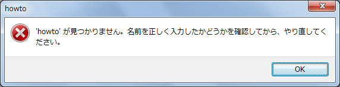

# メッセージ ボックスの内容をコピーする
## Requires
- 
## License
- Apache License, Version 2.0
## Technologies
- Windows
## Topics
- 今週の How-To
- Tips
## Updated
- 02/14/2011
## Description

更新日: 2010 年 3 月 1 日

毎日のように目にする完了通知やエラー メッセージなどのメッセージ ボックスの内容が実は簡単な操作でコピーできることをご存知でしょうか? 例えば、スタート メニューの [ファイル名を指定して実行] のダイアログで、存在しないアプリケーションの名前を入力するとエラー メッセージが表示されます。

このようなメッセージ ボックスが表示されている状態で、Ctrl&#43;C を押すとメッセージの内容をコピーすることが可能です。例えばこのエラー メッセージの場合は以下のようになります。

[Window Title] 
howto 
[Content] 
'howto' が見つかりません。名前を正しく入力したかどうかを確認してから、やり直してください。 
[OK]

エラー メッセージに長い番号などが表示されている場合にはこの機能を活用することで間違うことなく内容を取得できます。皆様が作られているアプリケーションにおいても、こうしたメッセージのコピーを想定して、必要なメッセージやコード番号などをエラー メッセージとして書いておくことで、正確な情報のやり取りが可能になります。また、管理者とエンド ユーザーの間での一般的なエラー報告のケースにも使用できるでしょう。エラー メッセージの正確な報告のためにも、このような機能を活用してみてはいかがでしょうか。

<table>
<tbody>
<tr>
<td></td>
<td>
<ul>
<li>もっと他のコンテンツを見る &gt;&gt; <a href="http://msdn.microsoft.com/ja-jp/ee708292" target="_blank">
今週の How-to 一覧へ</a> </li><li>もっと他のレシピを見る &gt;&gt; <a href="http://msdn.microsoft.com/ja-jp/samplecode.recipe">
Code Recipe へ</a> </li></ul>
</td>
</tr>
</tbody>
</table>

<a href="#top">ページのトップへ</a>

