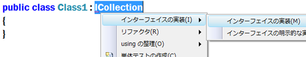
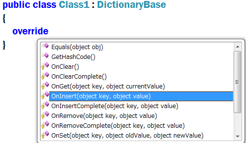

# 活用してますか? Visual Studio のコード補完機能 - クラス/インタフェース編
## License
- Apache License, Version 2.0
## Technologies
- Visual Studio 2008
- Visual Studio 2010
## Topics
- 今週の How-To
- Tips
## Updated
- 02/14/2011
## Description

更新日: 2010 年 3 月 29 日

インタフェースの実装クラスや、抽象クラス (abstract class) を継承したクラスを作成する場合、決められたメソッドやプロパティを実装するのは大変面倒な作業です。わざわざドキュメントを調べて、引数や返り値の型などもちゃんと揃えておかなくてはいけません。

例えば以下のコードでは、ICollection インタフェースの CopyTo メソッド、Count プロパティ、さらに (ICollection の) 継承元の IEnumerable インタフェースのメンバーも含め、いくつかのメンバーを実装する必要があります。1 つ 1 つ調べるのは退屈で時間のかかる作業です。

public class Class1 : ICollection 
{ 
}

このような場合、ICollection を選択して、マウスで右クリックをおこない、[インタフェースの実装] を選択します。実装が必要なメソッドやプロパティのスタブ コードが挿入されるため、あとはゆっくりと中身のロジックだけを実装すれば OK です。

※Visual Basic の場合は、「Implements ICollection」と入力して Enter キーを押すと、実装が必要なスタブ コードが自動生成されます。

また、抽象クラス (abstract class) を継承したクラスの場合は、「override」&#43; Space キーを入力すると、オーバーライド可能なメンバーの一覧がインテリセンスで表示され、選択すると、そのスタブ コードが挿入されます。

※Visual Basic の場合は、「Overrides」と入力してください。

public class Class1 : DictionaryBase 
{ 
&nbsp;&nbsp;&nbsp; // 挿入されたスタブコード 
&nbsp;&nbsp;&nbsp; protected override void OnInsert(object key, object value) 
&nbsp;&nbsp;&nbsp; { 
&nbsp;&nbsp;&nbsp;&nbsp;&nbsp;&nbsp;&nbsp; base.OnInsert(key, value);&nbsp; // あとは、ここを実装するだけ 
&nbsp;&nbsp;&nbsp; } 
}

コード補完機能は、コード品質の維持だけでなく、日々のプログラミングの迅速さ、快適さを与えてくれます。Visual Studio が持つさまざまなコード補完機能を活用して、プログラミングの楽しさを再発見してください。

<table>
<tbody>
<tr>
<td></td>
<td>
<ul>
<li>もっと他のコンテンツを見る &gt;&gt; <a href="http://msdn.microsoft.com/ja-jp/ee708292" target="_blank">
今週の How-to 一覧へ</a> </li><li>もっと他のレシピを見る &gt;&gt; <a href="http://msdn.microsoft.com/ja-jp/samplecode.recipe">
Code Recipe へ</a> </li></ul>
</td>
</tr>
</tbody>
</table>

<a href="#top">ページのトップへ</a>

