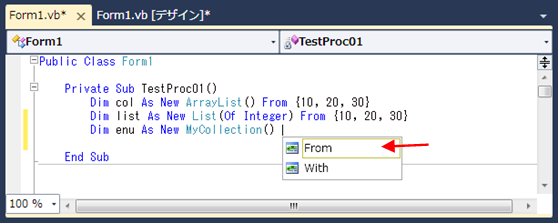
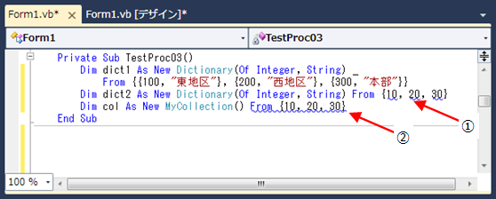

# 連載! とことん VB: 第 12 回 コレクション初期化の簡潔な表現 ～新しいコレクション初期化子～
## Requires
- 
## License
- Apache License, Version 2.0
## Technologies
- Visual Studio 2008
- Visual Studio 2010
## Topics
- VB プログラミング
- 連載 VB
## Updated
- 02/13/2011
## Description

更新日: 2010 年 3 月 1 日

執筆者: <a href="http://msdn.microsoft.com/ja-jp/gg585574#yajima" target="_blank">
エディフィストラーニング株式会社 矢嶋 聡</a>

この記事は、「MSDN プログラミング シリーズ」として発行している技術書籍「<a title="新しいウィンドウで開きます" href="http://www.amazon.co.jp/%E3%82%B9%E3%83%86%E3%83%83%E3%83%97%E3%82%A2%E3%83%83%E3%83%97Visual-Basic-2010%EF%BD%9E%E9%96%8B%E7%99%BA%E8%80%85%E3%81%8C%E3%82%82%E3%81%86%E4%B8%80%E6%AD%A9%E4%B8%8A%E9%81%94%E3%81%99%E3%82%8B%E3%81%9F%E3%82%81%E3%81%AE%E5%BF%85%E8%AA%AD%E3%82%A2%E3%83%89%E3%83%90%E3%82%A4%E3%82%B9%EF%BC%81-MSDN%E3%83%97%E3%83%AD%E3%82%B0%E3%83%A9%E3%83%9F%E3%83%B3%E3%82%B0-%E3%82%A8%E3%83%87%E3%82%A3%E3%83%95%E3%82%A3%E3%82%B9%E3%83%88%E3%83%A9%E3%83%BC%E3%83%8B%E3%83%B3%E3%82%B0%E6%A0%AA%E5%BC%8F%E4%BC%9A%E7%A4%BE/dp/4822294269/ref=sr_1_1?ie=UTF8&s=books&qid=1278865722&sr=1-1" target="_blank"><strong>ステップアップ
 Visual Basic 2010 ～開発者がもう一歩上達するための必読アドバイス</strong></a>」(日経 BP 社刊) を基に先進的なテクニックを紹介しています。

<h2>目次</h2>
<ol>
<li><a href="#01">はじめに</a> </li><li><a href="#02">コレクションの基本的な初期化</a> </li><li><a href="#03">コレクションの 1 つの要素に対して、複数の初期値を指定</a> </li><li><a href="#04">コレクション初期化子に対応するオブジェクトの要件</a> </li><li><a href="#05">コレクション初期化のための使い勝手をよくするカスタマイズ</a> </li></ol>

<h2 id="01">1. はじめに</h2>

.NET 版の Visual Basic では、それまでの Visual Basic 6.0 とは異なり、次の例 1 のように変数宣言の構文に、初期値を代入する式が書けるようになりました。その際、①のように単一の値 (ここでは 10) を代入するだけでなく、②の配列変数の宣言のように、括弧 { } の中にカンマ区切りで初期値のリストを記述し、配列の各要素に初期値を代入できるようになりました。②の表現を使用すれば、要素の数だけ代入文を書く必要もなくコードは簡潔になり、配列の各要素の値を把握する上での可読性も向上します。

<strong>例 1. .NET 版の Visual Basic における変数の初期化</strong>

Visual Basic

スクリプトの編集

vb
<pre class="hidden">Dim x As Integer = 10                    &larr;①
Dim num() As Integer = { 10, 20, 30, 40, 50 }        &larr;②</pre>
<pre id="codePreview" class="vb">Dim&nbsp;x&nbsp;As&nbsp;Integer&nbsp;=&nbsp;10&nbsp;&nbsp;&nbsp;&nbsp;&nbsp;&nbsp;&nbsp;&nbsp;&nbsp;&nbsp;&nbsp;&nbsp;&nbsp;&nbsp;&nbsp;&nbsp;&nbsp;&nbsp;&nbsp;&nbsp;&larr;①&nbsp;
Dim&nbsp;num()&nbsp;As&nbsp;Integer&nbsp;=&nbsp;{&nbsp;10,&nbsp;20,&nbsp;30,&nbsp;40,&nbsp;50&nbsp;}&nbsp;&nbsp;&nbsp;&nbsp;&nbsp;&nbsp;&nbsp;&nbsp;&larr;②&nbsp;
&nbsp;
</pre>

&nbsp;

そして Visual Basic 10.0 (Visual Basic 2010) では、配列だけではなくコレクションについても、「コレクション初期化子 (Collection Initializer)」と呼ばれる新しい構文を使用して、コレクションの各要素への初期化を簡潔に表記できるようになりました。ここでは、この新しい構文の基本的な使用方法のほか、そもそもこの構文を使用できるコレクション オブジェクトの要件は何であるのかという点や、カスタマイズを行った応用例を取り上げます。

<a href="#top"> ページのトップへ</a>

<h2 id="02">2. コレクションの基本的な初期化</h2>

まず、コレクション初期化子の基本的な使用方法を確認してみましょう。次の例 2 では、2 つのコレクションに対して、それぞれ初期値を代入しています。(Visual Studio 2010 のコード エディターで実際に入力して構文の有効性を確認する場合は、適当な Windows フォーム アプリケーション プロジェクトを作成し、以下のプロシージャを入力してみてください。この構文は、Visual Studio 2008 のVisual Basic 9.0、およびそれより前のバージョンでは記述できません。)

<strong>例 2. コレクション初期化子を使用した様々なコレクションの初期化</strong>

Visual Basic

スクリプトの編集

vb
<pre class="hidden">Private Sub TestProc01()
    Dim col As New ArrayList() From {10, 20, 30}        &larr;①
    Dim list As New List(Of Integer) From {10, 20, 30}    &larr;②
End Sub</pre>
<pre id="codePreview" class="vb">Private&nbsp;Sub&nbsp;TestProc01()&nbsp;
&nbsp;&nbsp;&nbsp;&nbsp;Dim&nbsp;col&nbsp;As&nbsp;New&nbsp;ArrayList()&nbsp;From&nbsp;{10,&nbsp;20,&nbsp;30}&nbsp;&nbsp;&nbsp;&nbsp;&nbsp;&nbsp;&nbsp;&nbsp;&larr;①&nbsp;
&nbsp;&nbsp;&nbsp;&nbsp;Dim&nbsp;list&nbsp;As&nbsp;New&nbsp;List(Of&nbsp;Integer)&nbsp;From&nbsp;{10,&nbsp;20,&nbsp;30}&nbsp;&nbsp;&nbsp;&nbsp;&larr;②&nbsp;
End&nbsp;Sub&nbsp;
&nbsp;
</pre>

&nbsp;

①の ArrayList オブジェクトは、要素を Object 型として管理する汎用的なコレクションです。また、②の List (Of Integer) はジェネリックを利用したコレクションです。ジェネリックについての詳細はここでは割愛しますが、&quot;(Of Integer)&quot; が要素の型を表していると考えてください。つまり、List (Of Integer) は Integer 型の要素のコレクションです。

それぞれのコレクションに関して、コレクション初期化子を使用した構文は次の形式になっています。

Visual Basic

Edit Script

vb
<pre class="hidden"><code class="csharp">New コレクションクラス() From { 値1, 値2, 値3, ... }</code></pre>
<pre id="codePreview" class="vb"><code class="csharp">New コレクションクラス() From { 値1, 値2, 値3, ... }</code></pre>

&nbsp;

この構文で、New キーワードの後にクラス名を記述してコレクションのオブジェクト インスタンスを作成する点は従来の表記方法ですが、その後に From キーワードを続け、括弧 { } の中にカンマ区切りで各要素の初期値を書くことができます。特に、冒頭の例 1 の配列変数の初期化と異なる点は、From キーワードがある点です。ここでは、例 2 の①と②のどちらも、順に 10、20、30 の値の要素がコレクションに追加されます。

この初期化の表記方法は、実質的には次の例 3 のように、そのコレクションの Add メソッドを呼び出して要素を追加する方法と同等です。Add メソッドの引数には、コレクション初期化子のFrom キーワード以降に列挙された初期値のリスト (ここでは、10、20、30) が順に渡されています。

<strong>例 3. コレクション初期化子が行う初期化の意味</strong>

Visual Basic

スクリプトの編集

vb
<pre class="hidden">Private Sub TestProc02()
    Dim col As New ArrayList()
    col.Add(10)
    col.Add(20)
    col.Add(30)
    Dim list As New List(Of Integer)
    list.Add(10)
    list.Add(20)
    list.Add(30)
End Sub</pre>
<pre id="codePreview" class="vb">Private&nbsp;Sub&nbsp;TestProc02()&nbsp;
&nbsp;&nbsp;&nbsp;&nbsp;Dim&nbsp;col&nbsp;As&nbsp;New&nbsp;ArrayList()&nbsp;
&nbsp;&nbsp;&nbsp;&nbsp;col.Add(10)&nbsp;
&nbsp;&nbsp;&nbsp;&nbsp;col.Add(20)&nbsp;
&nbsp;&nbsp;&nbsp;&nbsp;col.Add(30)&nbsp;
&nbsp;&nbsp;&nbsp;&nbsp;Dim&nbsp;list&nbsp;As&nbsp;New&nbsp;List(Of&nbsp;Integer)&nbsp;
&nbsp;&nbsp;&nbsp;&nbsp;list.Add(10)&nbsp;
&nbsp;&nbsp;&nbsp;&nbsp;list.Add(20)&nbsp;
&nbsp;&nbsp;&nbsp;&nbsp;list.Add(30)&nbsp;
End&nbsp;Sub&nbsp;
&nbsp;
</pre>

&nbsp;

例 3 のように直接記述する場合は、明らかにステートメントの行数が増えて手間がかかり、また、例 2 のほうが端的に初期化したい内容が伝わり、可読性が高くなります。

<a href="#top"> ページのトップへ</a>

<h2 id="03">3. コレクションの 1 つの要素に対して、複数の初期値を指定</h2>

結局のところ、コレクション初期化子はコレクションの Add メソッドを介して要素を追加することになります。よって、Add メソッドの引数形式に応じて、初期値のリストの記述方法が変わります。ここで、初期値のリストのバリエーションを確認してみましょう。

次の例 4 では、コレクションの一種である Dictionary (Of Integer, String) オブジェクトに対して、各要素の初期化を行っています。また、例 5 は例 4 と同等の追加操作を Add メソッドの呼び出しで表わしたものです。

<strong>例 4. Dictionary (Of Integer, String) オブジェクトの要素に対する初期化</strong>

Visual Basic

スクリプトの編集

vb
<pre class="hidden">Private Sub TestProc03()
    Dim dict As New Dictionary(Of Integer, String) _
        From {{100, &quot;東地区&quot;}, {200, &quot;西地区&quot;}, {300, &quot;本部&quot;}}    &larr;①
End Sub</pre>
<pre id="codePreview" class="vb">Private&nbsp;Sub&nbsp;TestProc03()&nbsp;
&nbsp;&nbsp;&nbsp;&nbsp;Dim&nbsp;dict&nbsp;As&nbsp;New&nbsp;Dictionary(Of&nbsp;Integer,&nbsp;String)&nbsp;_&nbsp;
&nbsp;&nbsp;&nbsp;&nbsp;&nbsp;&nbsp;&nbsp;&nbsp;From&nbsp;{{100,&nbsp;&quot;東地区&quot;},&nbsp;{200,&nbsp;&quot;西地区&quot;},&nbsp;{300,&nbsp;&quot;本部&quot;}}&nbsp;&nbsp;&nbsp;&nbsp;&larr;①&nbsp;
End&nbsp;Sub&nbsp;
&nbsp;
</pre>

&nbsp;

<strong>例 5. Dictionary (Of Integer, String) オブジェクトに対する要素の追加</strong>

Visual Basic

スクリプトの編集

vb
<pre class="hidden">Private Sub TestProc04()
    Dim dict As New Dictionary(Of Integer, String)
    dict.Add(100, &quot;東地区&quot;)                    &larr;②
    dict.Add(200, &quot;西地区&quot;)
    dict.Add(300, &quot;本部&quot;)
End Sub</pre>
<pre id="codePreview" class="vb">Private&nbsp;Sub&nbsp;TestProc04()&nbsp;
&nbsp;&nbsp;&nbsp;&nbsp;Dim&nbsp;dict&nbsp;As&nbsp;New&nbsp;Dictionary(Of&nbsp;Integer,&nbsp;String)&nbsp;
&nbsp;&nbsp;&nbsp;&nbsp;dict.Add(100,&nbsp;&quot;東地区&quot;)&nbsp;&nbsp;&nbsp;&nbsp;&nbsp;&nbsp;&nbsp;&nbsp;&nbsp;&nbsp;&nbsp;&nbsp;&nbsp;&nbsp;&nbsp;&nbsp;&nbsp;&nbsp;&nbsp;&nbsp;&larr;②&nbsp;
&nbsp;&nbsp;&nbsp;&nbsp;dict.Add(200,&nbsp;&quot;西地区&quot;)&nbsp;
&nbsp;&nbsp;&nbsp;&nbsp;dict.Add(300,&nbsp;&quot;本部&quot;)&nbsp;
End&nbsp;Sub&nbsp;
&nbsp;
</pre>

&nbsp;

例 4 と例 5 に登場する Dictionary (Of Integer, String) オブジェクトは「ディクショナリー」オブジェクトであり、1 つの要素が「キー」と「値」のペアで構成されています。ディクショナリーは、特定の「キー」に対する「値」を求める時などに使用します。この Dictionary (Of Integer, String) オブジェクトもジェネリックが使用されています。&quot;(Of Integer, String)&quot; の部分は、「キー」が Integer 型で「値」が String
 型である点を表しています。

ここでは、1 つの要素が Integer 型と String 型の 2 つのデータのペアから構成されており、例 5 の②にあるように、このコレクションの Add メソッドも 2 つの引数を持っています。コレクション初期化子がこれに対応するためには、①のように括弧が入れ子になり、要素ごとに括弧 { } を使用して、引数の並びを構成します。つまり、②の呼び出しのように、引数に「100, &quot;東地区&quot;」と 2 つの値を渡すためには、①の冒頭にあるとおり、次のような 2 つの値の並びを渡します。

Visual Basic

Edit Script

vb
<pre class="hidden"><code class="csharp">{ 100, &quot;東地区&quot; }</code></pre>
<pre id="codePreview" class="vb"><code class="csharp">{ 100, &quot;東地区&quot; }</code></pre>

&nbsp;

このように、Add メソッドの引数の数に合わせて、1 つの要素を表すリストの値の数も変化することになります。

<a href="#top"> ページのトップへ</a>

<h2 id="04">4. コレクション初期化子に対応するオブジェクトの要件</h2>

ここまでのところはコレクション初期化子の使用方法を確認しましたが、そもそもコレクション初期化子が使用できるオブジェクトの要件は何なのでしょうか。つまり、オブジェクト インスタンスの作成時に From 句を使用して初期化のリストを記述できるオブジェクトの要件は何なのか、改めて確認してみましょう。

Visual Basic 10.0 の言語仕様によると、コレクション初期化子に対応するオブジェクトは、次の 2 つの条件を満たす必要があります。

<ol style="list-style:none">
<li>条件 1) コレクション (collection type) であること </li><li>条件 2) From 句の初期化のリストに対応した Add メソッドを持つこと </li></ol>

まず、条件 1 について確認します。Visual Basic の言語仕様では、コレクション (collection type) についても定義があり、IEnumerable インターフェイスを実装したオブジェクトなど、いくつかの実装パターンが定義されています。簡単にいうと、以前ご説明した「For Each...Next ループの In キーワードの後ろに記述できる集合を扱うオブジェクト」と言うことができます。

<strong>Note:</strong> For Each...Next ループの In キーワードの後ろに記述できるコレクションについては、「<a href="http://beta.code.msdn.microsoft.com/8-For-Each-Next-IEnumerable-9b964e4f">第 8 回 For Each ... Next ループ対応のコレクション ～ 3 種類の実装パターン～</a>」を参照してください。

また、実際に Visual Studio 2010 のコード エディターに、New キーワードを使用してコレクションクラスのインスタンスを作成するコードを入力し、さらに半角スペースを入力すると、以下の図のように入力候補の一覧には、From キーワードも列挙されます。もし、コレクション初期化子に対応できない場合には、この From キーワードが列挙されません。このエディターの挙動 (インテリセンス) によって、コレクション初期化子に対応可能かどうか判断する材料となるでしょう。

<strong>図 1. コレクション初期化子が利用可能なコレクション</strong>

なお、図 1 の MyCollection クラスのサンプル コードには、次のように IEnumerable インターフェイスをあらかじめ実装しており、このため、From キーワードが候補として列挙されました。(簡単にするため、コレクションの仕様に準拠する最低限のひな型だけで、具体的な実装はありません。) 仮に、以下の MyCollection クラスから IEnumerable インターフェイスの実装を削除し、クラス ブロックの中を空の状態にすると、図 1 の入力候補には From キーワードが表示されなくなります。

<strong>例 6. 簡単なコレクション</strong>

Visual Basic

スクリプトの編集

vb
<pre class="hidden">Public Class MyCollection
    Implements IEnumerable
 
    Public Function GetEnumerator1() As IEnumerator _
                    Implements IEnumerable.GetEnumerator
        Return New MyEnumerator()
    End Function
End Class
 
Public Class MyEnumerator
    Implements IEnumerator
 
    Public Function MoveNext() As Boolean Implements IEnumerator.MoveNext
        Return False
    End Function
 
    Public ReadOnly Property Current As Object Implements IEnumerator.Current
        Get
            Return Nothing
        End Get
    End Property
 
    Public Sub Reset() Implements IEnumerator.Reset
 
    End Sub
End Class</pre>
<pre id="codePreview" class="vb">Public&nbsp;Class&nbsp;MyCollection&nbsp;
&nbsp;&nbsp;&nbsp;&nbsp;Implements&nbsp;IEnumerable&nbsp;
&nbsp;&nbsp;
&nbsp;&nbsp;&nbsp;&nbsp;Public&nbsp;Function&nbsp;GetEnumerator1()&nbsp;As&nbsp;IEnumerator&nbsp;_&nbsp;
&nbsp;&nbsp;&nbsp;&nbsp;&nbsp;&nbsp;&nbsp;&nbsp;&nbsp;&nbsp;&nbsp;&nbsp;&nbsp;&nbsp;&nbsp;&nbsp;&nbsp;&nbsp;&nbsp;&nbsp;Implements&nbsp;IEnumerable.GetEnumerator&nbsp;
&nbsp;&nbsp;&nbsp;&nbsp;&nbsp;&nbsp;&nbsp;&nbsp;Return&nbsp;New&nbsp;MyEnumerator()&nbsp;
&nbsp;&nbsp;&nbsp;&nbsp;End&nbsp;Function&nbsp;
End&nbsp;Class&nbsp;
&nbsp;&nbsp;
Public&nbsp;Class&nbsp;MyEnumerator&nbsp;
&nbsp;&nbsp;&nbsp;&nbsp;Implements&nbsp;IEnumerator&nbsp;
&nbsp;&nbsp;
&nbsp;&nbsp;&nbsp;&nbsp;Public&nbsp;Function&nbsp;MoveNext()&nbsp;As&nbsp;Boolean&nbsp;Implements&nbsp;IEnumerator.MoveNext&nbsp;
&nbsp;&nbsp;&nbsp;&nbsp;&nbsp;&nbsp;&nbsp;&nbsp;Return&nbsp;False&nbsp;
&nbsp;&nbsp;&nbsp;&nbsp;End&nbsp;Function&nbsp;
&nbsp;&nbsp;
&nbsp;&nbsp;&nbsp;&nbsp;Public&nbsp;ReadOnly&nbsp;Property&nbsp;Current&nbsp;As&nbsp;Object&nbsp;Implements&nbsp;IEnumerator.Current&nbsp;
&nbsp;&nbsp;&nbsp;&nbsp;&nbsp;&nbsp;&nbsp;&nbsp;Get&nbsp;
&nbsp;&nbsp;&nbsp;&nbsp;&nbsp;&nbsp;&nbsp;&nbsp;&nbsp;&nbsp;&nbsp;&nbsp;Return&nbsp;Nothing&nbsp;
&nbsp;&nbsp;&nbsp;&nbsp;&nbsp;&nbsp;&nbsp;&nbsp;End&nbsp;Get&nbsp;
&nbsp;&nbsp;&nbsp;&nbsp;End&nbsp;Property&nbsp;
&nbsp;&nbsp;
&nbsp;&nbsp;&nbsp;&nbsp;Public&nbsp;Sub&nbsp;Reset()&nbsp;Implements&nbsp;IEnumerator.Reset&nbsp;
&nbsp;&nbsp;
&nbsp;&nbsp;&nbsp;&nbsp;End&nbsp;Sub&nbsp;
End&nbsp;Class&nbsp;
&nbsp;
</pre>

&nbsp;

次に、条件 2 について補足します。コレクション初期化子を使用するためには、コレクションという条件 1 を満たしただけでは不十分です。From キーワードの後に記述される初期化のリストを引数として受け取れる適切な Add メソッドが必要です。

次の図は、コレクションである条件 1 を満たしていたとしても、適切な Add メソッドがない場合のエラー (波線) を表しています。

<strong>図 2. 適切な Add メソッドがない場合のエラー</strong>

2 つの赤い矢印のうち①のエラーは、Add メソッドの引数のパターンが合致していないエラーです。既に述べたように、 Dictionary (Of Integer, String) オブジェクトの Add メソッドでは、2 つの引数が必要ですが、この例では Integer 型の引数 1 つしか渡していません。実際には、次のエラー メッセージが表示されます。「メソッド 'Add' には、1 個の引数を受け取るオーバーロードがありません。」

一方、②では、MyCollection クラスが例 6 のように定義してあり、コレクションには違いないのですが、Add メソッドそのものが見つからないために発生するエラーです。実際には、次のエラー メッセージが表示されます。

「型 'Project1.MyCollection' には、アクセス可能な 'Add' メソッドがないため、... (以下省略)」 
②においてコレクション初期化子を有効にするには、Integer 型の引数 1 つを持つAdd メソッドが必要なため、例 6 の MyCollection へ① (下記の太字) に示す Add メソッドを追加する必要があります。

<strong>例 7. コレクション初期化子対応するため Add メソッドを追加</strong>

Public Class MyCollection 
&nbsp;&nbsp;&nbsp;&nbsp;&nbsp;&nbsp;&nbsp;&nbsp;&nbsp;&nbsp;&nbsp;&nbsp;&nbsp;Implements IEnumerable

&nbsp;&nbsp;&nbsp;&nbsp;&nbsp;&nbsp;&nbsp;&nbsp;&nbsp;&nbsp;&nbsp;&nbsp;&nbsp;Public Function GetEnumerator1() As IEnumerator _ 
&nbsp;&nbsp;&nbsp;&nbsp;&nbsp;&nbsp;&nbsp;&nbsp;&nbsp;&nbsp;&nbsp;&nbsp;&nbsp;&nbsp;&nbsp;&nbsp;&nbsp;&nbsp;&nbsp;&nbsp;&nbsp;&nbsp;&nbsp;&nbsp;&nbsp;&nbsp;&nbsp;&nbsp;&nbsp;&nbsp;&nbsp;&nbsp;&nbsp;&nbsp;&nbsp;&nbsp;&nbsp;&nbsp;&nbsp;Implements IEnumerable.GetEnumerator 
&nbsp;&nbsp;&nbsp;&nbsp;&nbsp;&nbsp;&nbsp;&nbsp;&nbsp;&nbsp;&nbsp;&nbsp;&nbsp;&nbsp;&nbsp;&nbsp;&nbsp;&nbsp;&nbsp;&nbsp;&nbsp;&nbsp;&nbsp;&nbsp;&nbsp;&nbsp;Return New MyEnumerator() 
&nbsp;&nbsp;&nbsp;&nbsp;&nbsp;&nbsp;&nbsp;&nbsp;&nbsp;&nbsp;&nbsp;&nbsp;&nbsp;End Function

<strong>&nbsp;&nbsp;&nbsp;&nbsp;&nbsp;&nbsp;&nbsp;&nbsp;&nbsp;&nbsp;&nbsp;&nbsp;&nbsp;Public Sub Add(ByVal dt As Integer) &larr;①</strong>

<strong>&nbsp;&nbsp;&nbsp;&nbsp;&nbsp;&nbsp;&nbsp;&nbsp;&nbsp;&nbsp;&nbsp;&nbsp;&nbsp;End Sub</strong> 
End Class

これで、カスタム オブジェクトをコレクション初期化子に対応できるようになりました。

<a href="#top"> ページのトップへ</a>

<h2 id="05">5. コレクション初期化のための使い勝手をよくするカスタマイズ</h2>

最後に、応用例を 1 つ取り上げましょう。コレクションの各要素が、複数のプロパティを持つオブジェクトである場合もあります。次の例では、List (Of Product) という型でコレクションを宣言しています。つまり、&quot;(Of Product)&quot; と記述してあることから、Product クラスのインスタンスがコレクションの各要素になっています。Product クラスの定義は、例 9 のとおりです。

<strong>例 8. List (Of Product) でのコレクション初期化子</strong>

Visual Basic

スクリプトの編集

vb
<pre class="hidden">Private Sub TestProc05
    Dim list5 As New List(Of Product) _            &larr;①
        From {New Product() With {.ID = 10, .Price = 200D},    &larr;②
               New Product() With {.ID = 20, .Price = 300D},
               New Product() With {.ID = 30, .Price = 500D}}
Ens Sub</pre>
<pre id="codePreview" class="vb">Private&nbsp;Sub&nbsp;TestProc05&nbsp;
&nbsp;&nbsp;&nbsp;&nbsp;Dim&nbsp;list5&nbsp;As&nbsp;New&nbsp;List(Of&nbsp;Product)&nbsp;_&nbsp;&nbsp;&nbsp;&nbsp;&nbsp;&nbsp;&nbsp;&nbsp;&nbsp;&nbsp;&nbsp;&nbsp;&larr;①&nbsp;
&nbsp;&nbsp;&nbsp;&nbsp;&nbsp;&nbsp;&nbsp;&nbsp;From&nbsp;{New&nbsp;Product()&nbsp;With&nbsp;{.ID&nbsp;=&nbsp;10,&nbsp;.Price&nbsp;=&nbsp;200D},&nbsp;&nbsp;&nbsp;&nbsp;&larr;②&nbsp;
&nbsp;&nbsp;&nbsp;&nbsp;&nbsp;&nbsp;&nbsp;&nbsp;&nbsp;&nbsp;&nbsp;&nbsp;&nbsp;&nbsp;&nbsp;New&nbsp;Product()&nbsp;With&nbsp;{.ID&nbsp;=&nbsp;20,&nbsp;.Price&nbsp;=&nbsp;300D},&nbsp;
&nbsp;&nbsp;&nbsp;&nbsp;&nbsp;&nbsp;&nbsp;&nbsp;&nbsp;&nbsp;&nbsp;&nbsp;&nbsp;&nbsp;&nbsp;New&nbsp;Product()&nbsp;With&nbsp;{.ID&nbsp;=&nbsp;30,&nbsp;.Price&nbsp;=&nbsp;500D}}&nbsp;
Ens&nbsp;Sub&nbsp;
&nbsp;
</pre>

&nbsp;

<strong>例 9. Product クラス</strong>

Visual Basic

スクリプトの編集

vb
<pre class="hidden">Public Class Product
    Public Property ID As Integer                &larr;③
    Public Property Price As Decimal
End Class</pre>
<pre id="codePreview" class="vb">Public&nbsp;Class&nbsp;Product&nbsp;
&nbsp;&nbsp;&nbsp;&nbsp;Public&nbsp;Property&nbsp;ID&nbsp;As&nbsp;Integer&nbsp;&nbsp;&nbsp;&nbsp;&nbsp;&nbsp;&nbsp;&nbsp;&nbsp;&nbsp;&nbsp;&nbsp;&nbsp;&nbsp;&nbsp;&nbsp;&larr;③&nbsp;
&nbsp;&nbsp;&nbsp;&nbsp;Public&nbsp;Property&nbsp;Price&nbsp;As&nbsp;Decimal&nbsp;
End&nbsp;Class&nbsp;
&nbsp;
</pre>

&nbsp;

例 9 の Product クラスには、ID プロパティと Price プロパティの 2 つのプロパティがあります。③のようにプロパティの定義には、今までの一連の記事でも何回か登場した Visual Basic 10.0 の新機能である「Auto-Implemented Properties」と呼ばれる、プロパティの簡易表現を使用しました。

この Product クラスのインスタンスをコレクションの要素として、例 8 の①のコレクションに初期値を追加しているのが、②以降の部分です。ここでは、Product インスタンスを 3 つ追加するために、オブジェクト初期化子を使用して、1 つ分のインスタンスは次のように表現しました。

Visual Basic

Edit Script

vb
<pre class="hidden"><code class="csharp">New Product() With {.ID = 10, .Price = 200D }</code></pre>
<pre id="codePreview" class="vb"><code class="csharp">New Product() With {.ID = 10, .Price = 200D }</code></pre>

&nbsp;

<strong>Note:</strong> このWith によるオブジェクト初期化子は、Visual Basic 2008 から導入された比較的新しい表現です。

さて、例 8 のように、このような初期化を 3 つ書いてもよいのですが、3 つのインスタンスの違いは、プロパティの部分 (IDプロパティと Price プロパティ) だけなので、工夫すると、次の例 10 のようにさらに簡潔になります。

<strong>例 10. List (Of Product) でのカスタマイズされたコレクション初期化子の使用</strong>

Visual Basic

スクリプトの編集

vb
<pre class="hidden">Private Sub TestProc05
    Dim list5 As New List(Of Product) _
        From {{10, 200D}, {20, 300D}, {30, 500D}}
Ens Sub</pre>
<pre id="codePreview" class="vb">Private&nbsp;Sub&nbsp;TestProc05&nbsp;
&nbsp;&nbsp;&nbsp;&nbsp;Dim&nbsp;list5&nbsp;As&nbsp;New&nbsp;List(Of&nbsp;Product)&nbsp;_&nbsp;
&nbsp;&nbsp;&nbsp;&nbsp;&nbsp;&nbsp;&nbsp;&nbsp;From&nbsp;{{10,&nbsp;200D},&nbsp;{20,&nbsp;300D},&nbsp;{30,&nbsp;500D}}&nbsp;
Ens&nbsp;Sub&nbsp;
&nbsp;
</pre>

&nbsp;

上記のような記述を可能にするには、前述したように、2 つのプロパティを引数として受け取る Add メソッドをコレクションに追加し、その Add メソッドの中で Product インスタンスを作るようにすればよいのです。

ただし、List (Of Product) で使用されている List (Of 型) という形式のジェネリック クラスは、クラス ライブラリに定義されたクラスなので、このクラスに Add メソッドを直接追加できません。このような既存クラスの定義を変更せずに Add メソッドを追加するのであれば、<a href="http://msdn.microsoft.com/ja-jp/ff404131" target="_blank">第 9 回で取り上げた「拡張メソッド」</a>が利用できます。よって、例 10
 のようにコレクション初期化子を使用できるようにするには、List (Of Product) に適用可能な拡張メソッドとして、以下の Add メソッドを定義すればよいのです。

<strong>例 11. 拡張メソッドとしての Add メソッド</strong>

Visual Basic

スクリプトの編集

vb
<pre class="hidden">Namespace MyUtility
 
    Public Module ListProductExtensions
 
        &lt;System.Runtime.CompilerServices.Extension()&gt;
        Public Sub Add(ByVal list As List(Of Product),        &larr;①
               ByVal id As Integer, ByVal price As Decimal)    &larr;②
            list.Add(New Product() With {.ID = id, .Price = price})
        End Sub
 
    End Module
 
End Namespace</pre>
<pre id="codePreview" class="vb">Namespace&nbsp;MyUtility&nbsp;
&nbsp;&nbsp;
&nbsp;&nbsp;&nbsp;&nbsp;Public&nbsp;Module&nbsp;ListProductExtensions&nbsp;
&nbsp;&nbsp;
&nbsp;&nbsp;&nbsp;&nbsp;&nbsp;&nbsp;&nbsp;&nbsp;&lt;System.Runtime.CompilerServices.Extension()&gt;&nbsp;
&nbsp;&nbsp;&nbsp;&nbsp;&nbsp;&nbsp;&nbsp;&nbsp;Public&nbsp;Sub&nbsp;Add(ByVal&nbsp;list&nbsp;As&nbsp;List(Of&nbsp;Product),&nbsp;&nbsp;&nbsp;&nbsp;&nbsp;&nbsp;&nbsp;&nbsp;&larr;①&nbsp;
&nbsp;&nbsp;&nbsp;&nbsp;&nbsp;&nbsp;&nbsp;&nbsp;&nbsp;&nbsp;&nbsp;&nbsp;&nbsp;&nbsp;&nbsp;ByVal&nbsp;id&nbsp;As&nbsp;Integer,&nbsp;ByVal&nbsp;price&nbsp;As&nbsp;Decimal)&nbsp;&nbsp;&nbsp;&nbsp;&larr;②&nbsp;
&nbsp;&nbsp;&nbsp;&nbsp;&nbsp;&nbsp;&nbsp;&nbsp;&nbsp;&nbsp;&nbsp;&nbsp;list.Add(New&nbsp;Product()&nbsp;With&nbsp;{.ID&nbsp;=&nbsp;id,&nbsp;.Price&nbsp;=&nbsp;price})&nbsp;
&nbsp;&nbsp;&nbsp;&nbsp;&nbsp;&nbsp;&nbsp;&nbsp;End&nbsp;Sub&nbsp;
&nbsp;&nbsp;
&nbsp;&nbsp;&nbsp;&nbsp;End&nbsp;Module&nbsp;
&nbsp;&nbsp;
End&nbsp;Namespace&nbsp;
&nbsp;
</pre>

&nbsp;

第 9 回でも述べたように、拡張メソッドの第 1 引数は、拡張対象となるコレクション自体なので、①のように List (Of Product) となります。Add メソッドに渡る実際の引数は、②にあるように第 2 引数と第 3 引数になります。この拡張メソッドの定義をした後、例 10 のソース コードの先頭に、以下の Imports 文を追加することで、拡張メソッドが利用できるようになり、その結果、以下の①のコレクション初期化子が有効になります。(「Project1」は、例 11 の拡張メソッドのルート名前空間です。既定では、例
 11 のソース コードのプロジェクト名です。)

<strong>例 12. 拡張メソッドとしての Add メソッドの利用</strong>

Visual Basic

スクリプトの編集

vb
<pre class="hidden">Imports Project1.MyUtility
 
    : (省略)
 
Private Sub TestProc05
    Dim list5 As New List(Of Product) _
        From {10, 200D}, {20, 300D}, {30, 500D}}    &larr;①
Ens Sub</pre>
<pre id="codePreview" class="vb">Imports&nbsp;Project1.MyUtility&nbsp;
&nbsp;&nbsp;
&nbsp;&nbsp;&nbsp;&nbsp;:&nbsp;(省略)&nbsp;
&nbsp;&nbsp;
Private&nbsp;Sub&nbsp;TestProc05&nbsp;
&nbsp;&nbsp;&nbsp;&nbsp;Dim&nbsp;list5&nbsp;As&nbsp;New&nbsp;List(Of&nbsp;Product)&nbsp;_&nbsp;
&nbsp;&nbsp;&nbsp;&nbsp;&nbsp;&nbsp;&nbsp;&nbsp;From&nbsp;{10,&nbsp;200D},&nbsp;{20,&nbsp;300D},&nbsp;{30,&nbsp;500D}}&nbsp;&nbsp;&nbsp;&nbsp;&larr;①&nbsp;
Ens&nbsp;Sub&nbsp;
&nbsp;
</pre>

&nbsp;

以上、コレクション初期化子の基本的な使用方法のほか、適用できる状況の確認や、カスタマイズによって、より簡潔な初期化の表記を行う方法を確認しました。これらをうまく利用して、Visual Basic 10.0 を有効活用していくと良いでしょう。

<table>
<tbody>
<tr>
<td></td>
<td></td>
<td>
<ul>
<li>もっと他のコンテンツを見る &gt;&gt; <a href="http://msdn.microsoft.com/ja-jp/ff357686" target="_blank">
連載! とことん Visual Basic 一覧へ</a> </li><li>もっと他のレシピを見る &gt;&gt; <a href="http://msdn.microsoft.com/ja-jp/samplecode.recipe" target="_blank">
Code Recipe へ</a> </li><li>もっと .NET Framework の情報を見る &gt;&gt; <a href="http://msdn.microsoft.com/ja-jp/netframework/" target="_blank">
.NET Framework デベロッパー センターへ</a> </li></ul>
</td>
</tr>
</tbody>
</table>

<a href="#top">ページのトップへ</a>

