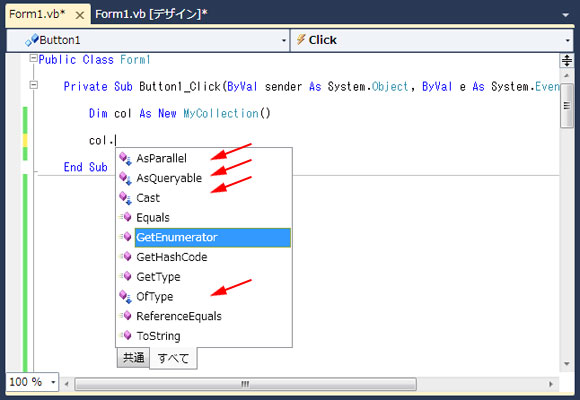

# 連載! とことん VB: 第 9 回 拡張メソッド ～定義とその利用例～
## License
- Apache License, Version 2.0
## Technologies
- Visual Studio 2008
- Visual Studio 2010
## Topics
- VB プログラミング
- 連載 VB
## Updated
- 02/13/2011
## Description

更新日: 2010 年 2 月 19 日

執筆者: <a href="http://msdn.microsoft.com/ja-jp/gg585574#yajima" target="_blank">
エディフィストラーニング株式会社 矢嶋 聡</a>

この記事は、「MSDN プログラミング シリーズ」として発行している技術書籍「<a title="新しいウィンドウで開きます" href="http://www.amazon.co.jp/%E3%82%B9%E3%83%86%E3%83%83%E3%83%97%E3%82%A2%E3%83%83%E3%83%97Visual-Basic-2010%EF%BD%9E%E9%96%8B%E7%99%BA%E8%80%85%E3%81%8C%E3%82%82%E3%81%86%E4%B8%80%E6%AD%A9%E4%B8%8A%E9%81%94%E3%81%99%E3%82%8B%E3%81%9F%E3%82%81%E3%81%AE%E5%BF%85%E8%AA%AD%E3%82%A2%E3%83%89%E3%83%90%E3%82%A4%E3%82%B9%EF%BC%81-MSDN%E3%83%97%E3%83%AD%E3%82%B0%E3%83%A9%E3%83%9F%E3%83%B3%E3%82%B0-%E3%82%A8%E3%83%87%E3%82%A3%E3%83%95%E3%82%A3%E3%82%B9%E3%83%88%E3%83%A9%E3%83%BC%E3%83%8B%E3%83%B3%E3%82%B0%E6%A0%AA%E5%BC%8F%E4%BC%9A%E7%A4%BE/dp/4822294269/ref=sr_1_1?ie=UTF8&s=books&qid=1278865722&sr=1-1" target="_blank"><strong>ステップアップ
 Visual Basic 2010 ～開発者がもう一歩上達するための必読アドバイス</strong></a>」(日経 BP 社刊) を基に先進的なテクニックを紹介しています。

<h2>目次</h2>
<ol>
<li><a href="#01">拡張メソッドとは? ～実は知らないうちに身近に潜んでいる...～</a> </li><li><a href="#02">「拡張メソッド」の使い方</a> </li><li><a href="#03">「拡張メソッド」の定義確認</a> </li><li><a href="#04">「拡張メソッド」の利用事例</a> </li></ol>

Visual Basic 2008 から導入された新しい仕組みの 1 つに「拡張メソッド」があります。「拡張メソッド」は、既存のオブジェクトにメソッドとして機能を追加する新しい仕組みです。しかし、機能追加を行う方法は他にも複数存在し、「拡張メソッド」の使いどころが今ひとつ理解しづらいかも知れません。そこで今回は、改めてこの「拡張メソッド」を取り上げ、その基本的な定義方法のほか、具体的な利用事例を元にその用途について解説します。

特に「拡張メソッド」は、今後使用する機会も増えてくると予想される「LINQ」でも様々な形で利用されており、このことからも Visual Basic 10.0 を今後使いこなす上で「拡張メソッド」を理解することは重要です。Visual Basic 10.0 を活用する準備として、しっかり確認しておきましょう。

<h2 id="01">1. 拡張メソッドとは? ～実は知らないうちに身近に潜んでいる...～</h2>

まず、「拡張メソッド」が何であるかを実感していただくために、日ごろのプログラミングの中でどんな状況で登場し利用されるのか、その一端を確認してみましょう。

実は、前回取り上げた IEnumerable インターフェイスを実装したオブジェクトにも「拡張メソッド」が潜んでしました。次の例は、前回取り上げたコードを抜粋して修正したものであり、For Each ... Next 文で利用するコレクションに実装すべき IEnumerable インターフェイスの定義と、そのインターフェイスを実装したコレクション クラスの例です。(ここでは拡張メソッドを確認するのが目的なので、このインターフェイス自身の役割や特徴などは深く考えなくて構いません。)

<strong>例 1. IEnumerable インターフェイス、および、これを実装したコレクション クラス</strong>

Visual Basic

スクリプトの編集

vb

<pre id="codePreview" class="vb">Public&nbsp;Interface&nbsp;IEnumerable&nbsp;&nbsp;&nbsp;&nbsp;&nbsp;&nbsp;&nbsp;&nbsp;&nbsp;&nbsp;&nbsp;&nbsp;&larr;[1]&nbsp;
&nbsp;&nbsp;&nbsp;&nbsp;Function&nbsp;GetEnumerator()&nbsp;As&nbsp;IEnumerator&nbsp;&nbsp;&nbsp;&nbsp;&larr;[2]&nbsp;
End&nbsp;Interface&nbsp;
&nbsp;&nbsp;
Public&nbsp;Class&nbsp;MyCollection&nbsp;&nbsp;&nbsp;&nbsp;&larr;[3]&nbsp;
&nbsp;&nbsp;&nbsp;&nbsp;Implements&nbsp;IEnumerable&nbsp;&nbsp;&nbsp;&nbsp;&larr;[4]&nbsp;
&nbsp;&nbsp;
&nbsp;&nbsp;&nbsp;&nbsp;Public&nbsp;Function&nbsp;GetEnumerator()&nbsp;As&nbsp;IEnumerator&nbsp;_&nbsp;&nbsp;&nbsp;&nbsp;&larr;[5]&nbsp;
&nbsp;&nbsp;&nbsp;&nbsp;&nbsp;&nbsp;&nbsp;&nbsp;Implements&nbsp;IEnumerable.GetEnumerator&nbsp;&nbsp;&nbsp;&nbsp;&larr;[6]&nbsp;
&nbsp;&nbsp;&nbsp;&nbsp;&nbsp;&nbsp;&nbsp;&nbsp;Return&nbsp;New&nbsp;MyEnumerator()&nbsp;
&nbsp;&nbsp;&nbsp;&nbsp;End&nbsp;Function&nbsp;
End&nbsp;Class&nbsp;
&nbsp;
</pre>

&nbsp;

[1] の IEnumerable インターフェイスは既にライブラリに定義済みのインターフェイスであり、[2] の GetEnumerator メソッドを含みます。一方、[3] のコレクション (MyCollection クラス) は、このインターフェイスを実装するため [4] のように宣言を行い、このインターフェイスに基づいて [5] 以降に GetEnumerator メソッドを実装しています。(ここでの [5] のメソッド名は [6] の Implements 句が付いていることから、IEnumerable
 インターフェイスの GetEnumerator メソッドとして実装したものあることが分かります。)

この MyCollection クラスの構成メンバーとしては GetEnumerator メソッドが存在します。さらに .NET では、クラス継承を明記しないと暗黙的に Object クラスから継承すると見なされるので、この MyCollection クラスは Object クラスに定義された構成メンバー (例えば、ToString メソッドなど) を継承し、MyCollection クラス自身の構成メンバーとして扱うことができます。

しかし、実際に MyCollection クラスのオブジェクト インスタンスを作成するコードを記述し、さらにエディター上で次図のように、このオブジェクトの変数に「ドット」を続けて入力し、インテリセンス (IntelliSense) 機能によってメンバー構成を一覧表示させると、次のように思い当たらないメンバーがリスト アップされます。

<strong>図 1. MyCollection オブジェクトの構成メンバーの一覧</strong>

上図のリスト アップされた MyCollection クラスのメンバーのうち、赤い矢印が「無いもの」は Object クラスから継承したり、IEnumerable インターフェイスのメソッドとして実装したものであり、MyCollection クラスのメンバーであることが理解できるでしょう。しかし、赤い矢印を付けた AsParallel、AsQueryable、Cast、および OfType の 4 つのメソッドは、MyCollection クラス自身の定義やその継承元のクラス定義、インターフェイス定義などには見当たりません。しかし、この
 MyCollection オブジェクトのメンバーのように利用することができます。(ここでは、この 4 つのメソッドの名前や役割自体は重要ではありません。追加された点にだけ注目してください。)

実は、この赤い矢印で示した 4 つのメソッドが「拡張メソッド」です。「拡張メソッド」とは、このように使用対象となるオブジェクト自体には、メンバーとして定義されておらず (まったく別のところで定義され)、なおかつ、その対象オブジェクトのメンバーとして利用できるもので、実質的にオブジェクトの機能を拡張するためのメソッドです。「拡張メソッド」はクラスやインターフェイスなどの型に追加できます。さらに、「拡張メソッド」を追加したクラスから継承して新たに派生クラスを定義するか、「拡張メソッド」を追加したインターフェイスを実装する形で新たにクラスを定義すると、そのクラスにも「拡張メソッド」が受け継がれます。

このことを前述の例に当てはめると、例 1 のように IEnumerable インターフェイス &quot;自体&quot; には、これら 4 つのメソッドは定義されていません。しかし、別の場所に、確かにこれらの「拡張メソッド」が IEnumerable インターフェイスの追加の構成メンバーとして定義されています。なお、通常のインターフェイスのメンバーの定義は、実装は伴わず、引数や戻り値などの形式だけの定義ですが (中身が空っぽですが)、「拡張メソッド」は既に実装 (中身) も存在します。

そして、MyCollection クラスは IEnumerable インターフェイスを実装しているので、「拡張メソッド」も受け継いでいるのです。あくまで別のところで「拡張メソッド」は定義されているので、MyCollection クラスを定義したソース コード自体には「拡張メソッド」の痕跡は現れません。見方を変えると、「拡張メソッド」の大きな特徴として、「既存のオブジェクトの定義を直接修正せずに、別のところで、後から機能拡張として追加できる」ことが読み取れます。

このような仕組みが、前述の普段記述するコードの中にも、知らずのうちに採用されていたのです。

それでは次に簡単な例を使用して、「拡張メソッド」の基本的な使用方法と定義方法を順に確認しましょう。

<a href="#top"> ページのトップへ</a>

<h2 id="02">2. 「拡張メソッド」の使い方</h2>

前述の例は、IEnumerable インターフェイスに対して「拡張メソッド」を追加し、そのインターフェイスをクラスで実装したという例でしたが、説明を簡潔にするため、1 つのクラスに「拡張メソッド」を追加した簡単な例を見てみましょう。

次の例 2 と例 3 は、「PrintWithFormat」という名前の「拡張メソッド」を追加した場合の MyClass1 クラスの使用例です。なお、例 2 は、MyProject1 という名前の Windows アプリケーションのプロジェクトを作り、フォームのボタンを貼り付けて Click イベント ハンドラーを生成させ、その中にコードを記述したコードです。また、例 3 は、このプロジェクトに対して、MyClass1 クラス (MyClass1.vb) を追加したコードです。

<strong>例 2. 「拡張メソッド」利用 (Form1.vb)</strong>

Visual Basic

スクリプトの編集

vb

<pre id="codePreview" class="vb">Imports&nbsp;MyProject1.MyUtility.MyClass1Extensions&nbsp;&nbsp;&nbsp;&nbsp;&nbsp;&nbsp;&nbsp;&nbsp;&larr;[1]&nbsp;
&nbsp;&nbsp;
Public&nbsp;Class&nbsp;Form1&nbsp;
&nbsp;&nbsp;
&nbsp;&nbsp;&nbsp;&nbsp;Private&nbsp;Sub&nbsp;Button1_Click(&nbsp;...&nbsp;)&nbsp;Handles&nbsp;Button1.Click&nbsp;&nbsp;&nbsp;&nbsp;&larr;[2]&nbsp;
&nbsp;&nbsp;
&nbsp;&nbsp;&nbsp;&nbsp;&nbsp;&nbsp;&nbsp;&nbsp;Dim&nbsp;obj&nbsp;As&nbsp;New&nbsp;MyClass1&nbsp;&nbsp;&nbsp;&nbsp;&nbsp;&nbsp;&nbsp;&nbsp;&nbsp;&nbsp;&nbsp;&nbsp;&larr;[3]&nbsp;
&nbsp;&nbsp;&nbsp;&nbsp;&nbsp;&nbsp;&nbsp;&nbsp;obj.Print()&nbsp;&nbsp;&nbsp;&nbsp;&nbsp;&nbsp;&nbsp;&nbsp;&nbsp;&nbsp;&nbsp;&nbsp;&nbsp;&nbsp;&nbsp;&nbsp;&larr;[4]&nbsp;
&nbsp;&nbsp;&nbsp;&nbsp;&nbsp;&nbsp;&nbsp;&nbsp;obj.PrintWithFormat(&quot;Data={0}&quot;)&nbsp;&nbsp;&nbsp;&nbsp;&larr;[5]&nbsp;
&nbsp;&nbsp;
&nbsp;&nbsp;&nbsp;&nbsp;End&nbsp;Sub&nbsp;
End&nbsp;Sub&nbsp;
&nbsp;
</pre>

&nbsp;

<strong>例 3. MyClass1 クラスの定義 (MyClass1.vb)</strong>

Visual Basic

スクリプトの編集

vb

<pre id="codePreview" class="vb">Public&nbsp;Class&nbsp;MyClass1&nbsp;&nbsp;&nbsp;&nbsp;&larr;[6]&nbsp;
&nbsp;&nbsp;
&nbsp;&nbsp;&nbsp;&nbsp;Public&nbsp;Property&nbsp;Data&nbsp;As&nbsp;Integer&nbsp;=&nbsp;100&nbsp;&nbsp;&nbsp;&nbsp;&larr;[7]&nbsp;
&nbsp;&nbsp;
&nbsp;&nbsp;&nbsp;&nbsp;Public&nbsp;Sub&nbsp;Print()&nbsp;&nbsp;&nbsp;&nbsp;&nbsp;&nbsp;&nbsp;&nbsp;&nbsp;&nbsp;&nbsp;&nbsp;&nbsp;&nbsp;&nbsp;&nbsp;&larr;[8]&nbsp;
&nbsp;&nbsp;&nbsp;&nbsp;&nbsp;&nbsp;&nbsp;&nbsp;MsgBox(Data)&nbsp;
&nbsp;&nbsp;&nbsp;&nbsp;End&nbsp;Sub&nbsp;
&nbsp;&nbsp;
End&nbsp;Class&nbsp;
&nbsp;
</pre>

&nbsp;

例 2 の [2] にある Click イベント ハンドラーの中に、「拡張メソッド」を伴う MyClass1 オブジェクトの使用例があります。[3] で MyClass1 オブジェクト インスタンスを作成して変数 obj に設定した後、[4] と [5] では、それぞれ Print メソッドと PrintWithFormat メソッドを呼び出しています。この 2 つのメソッドのうち、[4] は本来の MyClass1 オブジェクトのメソッドですが、[5] は「拡張メソッド」です。

実際の MyClass1 クラスの定義は例 3 です。[6] の MyClass1 のクラス定義のブロック内には、このクラスのメンバーとして、[7] の Data プロパティと、[8] の Print メソッドがあります。[8] の Print メソッドでは、単純に [7] の Data プロパティの値をメッセージ ボックスに表示します。

<strong>Note:</strong> [7] の形式のプロパティ定義は、以前の記事でも一度登場した Visual Basic 10.0 から新たに導入された「Auto-Implemented Properties」と呼ばれるプロパティ定義の 1 つです。Get プロシージャや Set プロシージャなどの具体的な実装が未定の場合に、暫定的なプロパティ定義としても利用できるプロパティの簡易表現です。

MyClass1 クラスのメンバーとして定義されているのは [7] と [8] の 2 つだけですが、実際には例 1 の [5] のように、PrintWithFormat メソッドも呼び出しています。このメソッドは「拡張メソッド」として定義されています (この定義については、後述します)。

ここでは、その呼び出し方に注意してください。あたかもオブジェクト インスタンスのメソッドとして呼び出されています。つまり、「拡張メソッド」はインスタスンス メソッドとして拡張されます。「拡張メソッド」として追加することを検討する場合は、対象となるオブジェクトの定義 (クラス) に対して、共有メソッド (Shared メソッド) という形ではなく、インスタンス メソッドとして使用されることをおぼえておきましょう。

<a href="#top"> ページのトップへ</a>

<h2 id="03">3. 「拡張メソッド」の定義確認</h2>

次に、前述の「拡張メソッド」である PrintWithFormat メソッドの定義を確認します。次の例は、前述のプロジェクトに、新たに MyClass1Extension モジュールとして追加した場合の例です。

<strong>例 4. MyClass1 クラスへの拡張メソッド (MyClass1Extensions.vb)</strong>

Visual Basic

スクリプトの編集

vb

<pre id="codePreview" class="vb">Namespace&nbsp;MyUtility&nbsp;&nbsp;&nbsp;&nbsp;&nbsp;&nbsp;&nbsp;&nbsp;&nbsp;&nbsp;&nbsp;&nbsp;&larr;[9]&nbsp;
&nbsp;&nbsp;
&nbsp;&nbsp;&nbsp;&nbsp;Public&nbsp;Module&nbsp;MyClass1Extensions&nbsp;&nbsp;&nbsp;&nbsp;&larr;[10]&nbsp;
&nbsp;&nbsp;
&nbsp;&nbsp;&nbsp;&nbsp;&nbsp;&nbsp;&nbsp;&nbsp;&lt;System.Runtime.CompilerServices.Extension()&gt;&nbsp;&nbsp;&nbsp;&nbsp;&larr;[11]&nbsp;
&nbsp;&nbsp;&nbsp;&nbsp;&nbsp;&nbsp;&nbsp;&nbsp;Public&nbsp;Sub&nbsp;PrintWithFormat(ByVal&nbsp;obj&nbsp;As&nbsp;MyClass1,&nbsp;ByVal&nbsp;fmt&nbsp;As&nbsp;String)&larr;[12]&nbsp;
&nbsp;&nbsp;&nbsp;&nbsp;&nbsp;&nbsp;&nbsp;&nbsp;&nbsp;&nbsp;&nbsp;&nbsp;MsgBox(String.Format(fmt,&nbsp;obj.Data))&nbsp;&nbsp;&nbsp;&nbsp;&larr;[13]&nbsp;
&nbsp;&nbsp;&nbsp;&nbsp;&nbsp;&nbsp;&nbsp;&nbsp;End&nbsp;Sub&nbsp;
&nbsp;&nbsp;
&nbsp;&nbsp;&nbsp;&nbsp;End&nbsp;Module&nbsp;
&nbsp;&nbsp;
End&nbsp;Namespace&nbsp;
&nbsp;
</pre>

&nbsp;

「拡張メソッド」の定義は、対象となるクラスの定義とは別のところに、モジュールのメソッドとして、&lt;Extensions&gt; 属性を付けて定義します。それが例 4 の [12] にある PrintWithFormat メソッドです。正確には、このメソッドが「拡張メソッド」となるためには、以下の条件を満たす必要があります。

<ol>
<li>モジュールの中のメンバーとして定義すること </li><li>&lt;Extension&gt; 属性を付けた Sub または Function プロシージャであること </li><li>第一引数の型は、追加する対象となるクラスやインターフェイス (今回の場合、MyClass1) であること </li></ol>

まず、1. にあるようにモジュールの中に定義する点に注意してください。例えば、Class (クラス) や Structure (構造体) などの中には定義できません。また、モジュールに定義するということは、実質的に共有メンバー (Shared メンバー) であるということになりますが、Class の中に共有メソッドとして定義することもできません。あくまでモジュールの中に定義してください。(また、定義は実質的に共有メソッドですが、前述の通り、使用する際は例 2 の [5] のようにインスタンス メソッドのように使用します。)
 ここでは、[10] にあるように、MyClass1Extensions モジュールの中に定義しています。なお、モジュール名は任意の名前を付けることができ、名前自体は、拡張メソッドの追加先となる対象のクラスの名前との間に直接的な関係はありません。

さらに、2. にあるように「拡張メソッド」になれるのは、いわゆるメソッドの実装にあたる、Sub プロシージャと Function プロシージャだけです。Property プロシージャやフィールド変数、イベントは、この仕組みを適用できません。ここでは [12] にあるように、Sub プロシージャを使用しました。また [11] にあるように、プロシージャには &lt;Extensions&gt; 属性を必ず付ける必要があります。

<strong>Note:</strong> &lt;Extensions&gt; 属性は、あくまで PrintWithFormat メソッドの先頭に付いた属性なので、[11] と [12] は実質的に 1 つのステートメントです。本来であれば、[11] の属性宣言の後に行を継続させるための記号として、下記の通り、行末に「半角スペース」と「アンダーバー」を記述する必要があります。

&lt;System.Runtime.CompilerServices.Extension()&gt; _ 
Public Sub PrintWithFormat(ByVal obj As MyClass1, . . .

しかし、Visual Basic 10.0 では、新機能として、明らかに行が継続する必要がある個所は、このような継続行の記号 (アンダーバー) を省略しても、暗黙的に行を継続するとみなすことが出来るようになりました。

そして、3. にあるように、プロシージャの第 1 引数の型は、「拡張メソッド」の追加対象となるクラスやインターフェイスになります。実際に、拡張メソッドが呼び出された場合、この第1引数には、対象となるオブジェクト インスタンスが渡ってきます。この引数は必須であり、結局のところ、この引数の型によって「拡張メソッド」の追加先が決まります。ここでは、引数の型は「As MyClass1」なので、例 1 の [5] のように、MyClass1 オブジェクトの「拡張メソッド」として利用できます。例えば、冒頭に触れた
 IEnumerable インターフェイスに対する追加であれば、この第 1 引数の型は「As IEnumerable」ということになります。

実際の拡張メソッドの内部の実装は任意です。ただし、「拡張メソッド」は論理的には対象となるオブジェクトのメンバーとして振舞うのが自然なので、典型的な実装としては、[13] の「obj.Data」にあるように、第 1 引数に渡ってきたオブジェクトに対して何らかのアクセスを行い、このオブジェクトに関する処理を実行することになるでしょう。([13] では、このオブジェクトの Data プロパティの内容を、引数 fmt の書式に基づいてメッセージ ボックスに表示します。)

また、例 2 の [5] にあるように「拡張メソッド」を呼び出すときに渡す引数は、「拡張メソッド」の第 2 引数以降です。例えば、呼び出す際に 3 つの実引数を並べたら、「拡張メソッド」側には順に第 2 引数、第 3 引数、そして第 4 引数へと渡ります。ここでは、[5] の &quot;Data={0}&quot; は例 4 の [12] の第 2 引数 fmt に渡ります。

なお、第 1 引数の渡し方は「ByVal」や「ByRef」のどちらでも文法的には可能です。しかし、「拡張メソッド」の役割は、第 1 引数に渡ってきたオブジェクトに対して働きかけることが目的なので、「ByVal」で十分でしょう。「ByRef」を使用して、第 1 引数のオブジェクトを入れ替える必要もありません。

<strong>Note:</strong> この「ByVal」や「ByRef」については、<a href="http://beta.code.msdn.microsoft.com/7-e989b51b">第 7 回「参照渡し」という用語の誤解</a>を参照してください。

上記で、[9] の名前空間の定義は、「拡張メソッド」を使用する上での必須要件ではありませんが、「拡張メソッド」を使用する上での「コツ」として重要です。仮に、例 4 の「拡張メソッドを定義する側」と例 2 の「利用する側」が同じ名前空間に存在すると、自動的に「拡張メソッド」が利用できるようになります。一方、両者が異なる名前空間にある場合は、そのままでは利用できません。この例 (例 2、例 4) では、別の名前空間を定義しています。この場合、例 2 の利用する側で [1] のように Imports 文を使用して、モジュールの使用
 (または名前空間の使用) を明示する必要があります。[1] ではモジュール名まで明記していますが、次のようにモジュールが属する名前空間までを記述する方法でも構いません。以下の例であれば、この名前空間に属するすべてのモジュールの「拡張メソッド」が利用できるようになります。

<strong>例 5. 名前空間のインポート</strong>

Visual Basic

Edit Script

vb

<pre id="codePreview" class="vb"><code class="csharp">Imports MyProject1.MyUtility</code></pre>

&nbsp;

この名前空間の仕組みを利用すれば、「拡張メソッド」を利用する側は、Imports 文を書くか書かないかによって、「拡張メソッド」を利用するか否かを選択するという運用ができます。(もちろん Imports 文を使用する以前に、「拡張メソッド」が定義された当該ライブラリ (DLL) を参照 (参照の追加) しなければ、「拡張メソッド」を利用できません。)

以上、基本的な「拡張メソッド」の定義と使用方法を確認しました。結局のところ、「拡張メソッド」を使用すると、既存のクラス定義には手を加えず、後からそこで必要な機能を追加できるという「拡張メソッド」の役割も読み取れたかと思います。

<a href="#top"> ページのトップへ</a>

<h2 id="04">4. 「拡張メソッド」の利用事例</h2>

ここで「拡張メソッド」の本&#26684;的な利用事例として、改めて冒頭の例を確認しましょう。前述の図 1 の一覧にリストアップされた「拡張メソッド」は、Microsoft 自身が実装した「拡張メソッド」です。これらのメソッドは、LINQ で利用されています。

実は、冒頭の MyCollection オブジェクト (コレクション) は LINQ にも対応できます。例えば、次の [1] のような LINQ のクエリ式で利用できるのです。(LINQ については別の回で説明するため、ここでは、クエリ式の詳細の理解は不要です。「拡張メソッド」の観点から確認します。)

<strong>例 6. LINQ のクエリ式の利用</strong>

Visual Basic

スクリプトの編集

vb

<pre id="codePreview" class="vb">Dim&nbsp;col&nbsp;As&nbsp;New&nbsp;MyCollection&nbsp;
Dim&nbsp;query&nbsp;=&nbsp;From&nbsp;d&nbsp;In&nbsp;col&nbsp;Where&nbsp;d&nbsp;&gt;&nbsp;10&nbsp;&nbsp;&nbsp;&nbsp;&nbsp;&nbsp;&nbsp;&nbsp;&larr;[1]&nbsp;
&nbsp;
</pre>

&nbsp;

[1] のクエリ式の In の後ろに、コレクションである変数 col を書くことができます。これが可能なのも「拡張メソッド」の恩恵を受けているからです。というのは、コンパイラは [1] の式を見つけると、実質的に、次のようなコードに変換します。

<strong>例 7. クエリ式の実質的な意味</strong>

Visual Basic

Edit Script

vb

<pre id="codePreview" class="vb"><code class="csharp">Dim query = col.Cast(Of Object)().Where(Function(d) d &gt; 10)</code></pre>

&nbsp;

このコードの正確な意味については割愛しますが、「col.Cast(～)」となっている点に注目してください。変換後のコードでは、[1] のクエリ式に登場したコレクション変数 col について、Cast メソッドを呼び出すコードに変換されました。

Cast メソッドは、図 1 のメソッドの一覧にあるように「拡張メソッド」の 1 つです。この「拡張メソッド」は、IEnumerable インターフェイスに追加されたものであり、IEnumerable インターフェイスを実装したすべてのオブジェクトは、自動的に Cast メソッドがメンバーとして加わります。その結果、IEnumerable インターフェイスを実装したすべてのオブジェクトは、例 6 から例 7 への変換が可能であり、よって例 6 のようにクエリ式で利用できるようになるのです。また、このような
 Cast メソッドは、コンパイラが使用するだけでなく、ある程度 LINQ を使い慣れた上級者であれば、直接呼び出すコードを記述する場合もあります。

考えてみてください。IEnumerable インターフェイスを実装したすべてのオブジェクトに対して Cast メソッドを追加するだけなら、Microsoft は例 1 の [1] の IEnumerable インターフェイスの定義自体を変更して、Cast メソッドをメンバーとして追加するという選択肢もあったはずです。しかし、実際はそうではありませんでした。もし、IEnumerable インターフェイス自身に Cast メソッドを追加するような方法を取れば、IEnumerable インターフェイスを実装した既存のすべてのオブジェクトは、変更されたメンバー構成を反映してコードを書き換える必要があったでしょう。(もちろん、インターフェイス定義に
 Cast メソッドを追加するということは、Cast メソッド自体の実装も各プログラマーが行わなければならないという負荷もあります。)

しかし、「拡張メソッド」なら、既存の IEnumerable インターフェイスを実装したオブジェクトは変更する必要もなく、LINQ のための「拡張メソッド」である Cast メソッドを利用できるようになります。

このように「拡張メソッド」による機能追加の意義の 1 つとして、既存のコードを変更せずに機能を追加できるという効果があります。特に注目したい点は、「拡張メソッド」を追加したい対象オブジェクトの定義 (つまり、対象となるクラス) に対して「拡張メソッド」を追加するのではなく、インターフェイスに対して「拡張メソッド」を追加すると、そのインターフェイスを実装するすべてのオブジェクトに対して「拡張メソッド」としての追加機能を適用することができる点です。

皆さんが独自に「拡張メソッド」を定義する場合にも、単に追加したいオブジェクトのクラスに直接追加するのではなく、その後の利用も踏まえ、インターフェイスに追加する方法なども考慮に入れると良いでしょう。

<strong>Note:</strong> ここでは、特徴的な利用事例の 1 つを取り上げましたが、全般的な使用方法については、以下のドキュメントを参照してください。

<ul>
<li><a href="http://msdn.microsoft.com/ja-jp/library/bb384936" target="_blank">MSDN: 拡張メソッド (Visual Basic)</a>
</li></ul>

また、「拡張メソッド」と同じシグニチャ (メソッド名や引数形式) を持つインスタンス メソッドが既にオブジェクトの定義に存在していた場合、インスタンス メソッドが優先されます。これにより、知らない間に既存のインスタス メソッドが「拡張メソッド」に入れ替わることを防ぐことができます。逆に言えば、「拡張メソッド」は利用者側に強制的に使用させる方法がありません。これらを踏まえた基本的な使用指針も、上記のドキュメントの「最適な使用方法」という項に記載されていますので是非参考にしてみてください。

<table>
<tbody>
<tr>
<td></td>
<td></td>
<td>
<ul>
<li>もっと他のコンテンツを見る &gt;&gt; <a href="http://msdn.microsoft.com/ja-jp/ff357686" target="_blank">
連載! とことん Visual Basic 一覧へ</a> </li><li>もっと他のレシピを見る &gt;&gt; <a href="http://msdn.microsoft.com/ja-jp/samplecode.recipe" target="_blank">
Code Recipe へ</a> </li><li>もっと .NET Framework の情報を見る &gt;&gt; <a href="http://msdn.microsoft.com/ja-jp/netframework/" target="_blank">
.NET Framework デベロッパー センターへ</a> </li></ul>
</td>
</tr>
</tbody>
</table>

<a href="#top">ページのトップへ</a>

